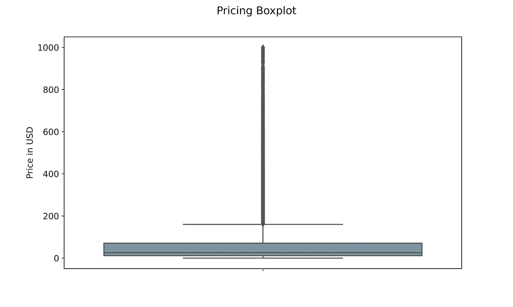
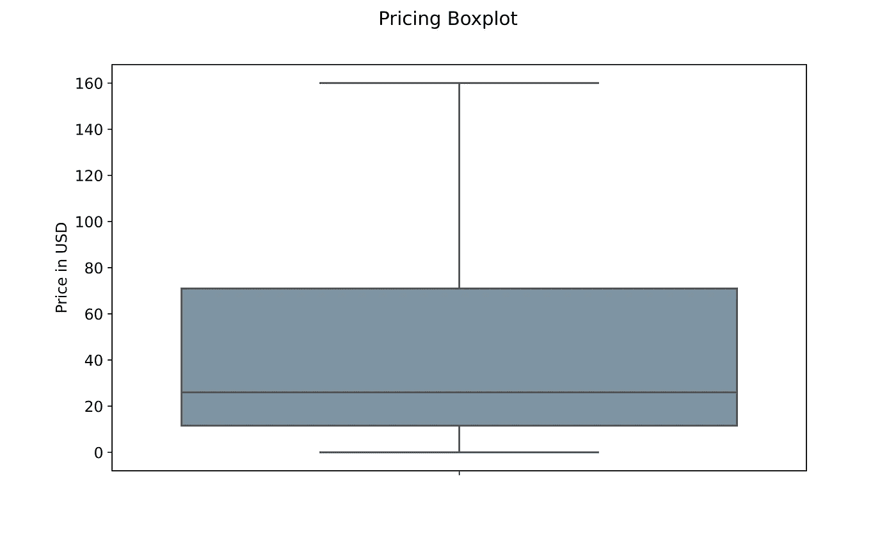
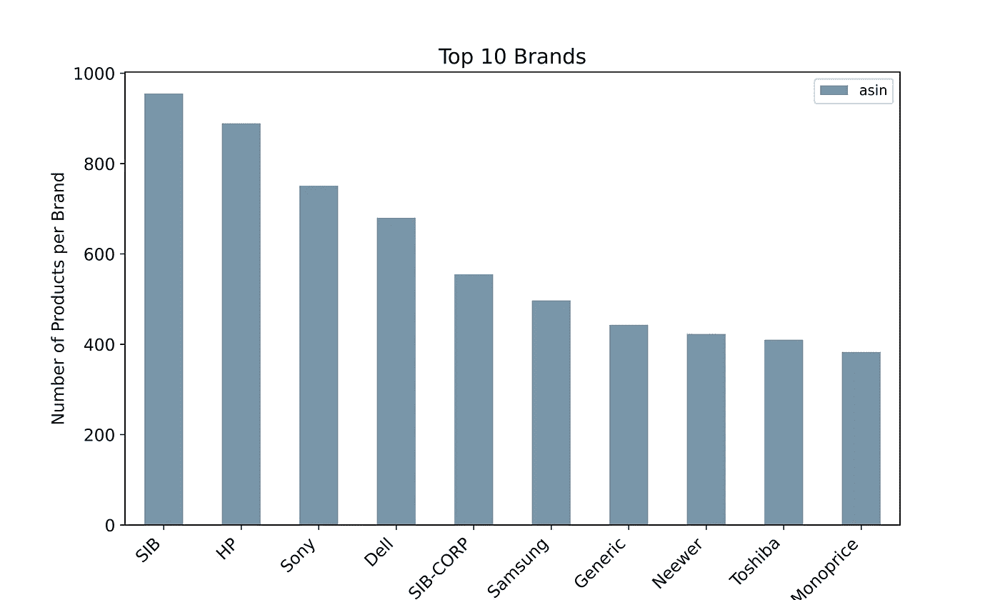

# 用 Python 构建亚马逊产品推荐系统

> 原文：<https://towardsdatascience.com/building-a-recommender-system-for-amazon-products-with-python-8e0010ec772c>

## 我为亚马逊的电子产品类别建立了一个推荐系统


由[马克斯·托马斯](https://unsplash.com/@querysprout?utm_source=medium&utm_medium=referral)在 [Unsplash](https://unsplash.com?utm_source=medium&utm_medium=referral) 上拍摄的照片

# 介绍

T 这个项目的目标是**为**电子**产品类别部分重建**亚马逊**产品推荐系统**。

现在是十一月，黑色星期五到了！你是哪种类型的购物者？你是把当天想买的所有商品都存起来，还是宁愿打开网站，看看**现场打折促销**？

尽管网上商店在过去十年中取得了令人难以置信的成功，显示出巨大的潜力和增长，但实体店和网上商店的根本区别之一是消费者的冲动购买。

如果顾客面前摆着**各种各样的产品**，他们更有可能购买原本不打算购买的东西。**冲动购买**的**现象**居然被**网上**店铺的配置**限制**。同样的**不会发生**对于他们的**物理**同行。最大的实体零售连锁店让他们的顾客通过一条**精确的路径**，以确保他们在离开商店之前参观了每一个通道。

像亚马逊这样的网上商店认为可以重现冲动购买现象的方法是通过推荐系统。推荐系统识别客户刚刚购买或查看的**最相似的**或**互补的**产品。其目的是最大化网上商店通常缺乏的**随机购买**现象。

**在亚马逊**上购物让我对其中的机制非常感兴趣，我想**重现**(甚至是部分)他们推荐系统的结果。

根据博客“Recostream”的说法，亚马逊产品推荐系统有三种依赖关系**，其中一种是**产品对产品推荐**。当用户实际上没有搜索历史时，该算法将产品聚集在一起，并根据商品的元数据向同一用户推荐它们。**

## **数据**

**项目的第一步是收集**数据**。幸运的是，圣地亚哥加利福尼亚大学的研究人员有一个存储库，让学生和组织外的个人使用这些数据进行研究和项目。可以通过下面的[链接](http://jmcauley.ucsd.edu/data/amazon/links.html)以及**许多其他与推荐系统相关的有趣数据集**来访问数据【2】【3】。产品元数据**最后更新于 2014 年**；许多产品今天可能无法买到。**

**电子类元数据包含 **498，196 条记录**，总共有 **8 列**:**

*   **`asin` —与每个产品相关联的唯一 ID**
*   **`imUrl` —与每个产品相关联的图像的 URL 链接**
*   **`description` —产品的描述**
*   **`categories` —每个产品所属的所有类别的 python 列表**
*   **`title` —产品的名称**
*   **`price` —产品的价格**
*   **`salesRank` —每个产品在特定类别中的排名**
*   **`related` —与每个产品相关的客户查看和购买的产品**
*   **`brand` —产品的品牌。**

**您会注意到该文件是一种“松散的”`JSON`格式，其中每一行都是一个`JSON` ，包含前面提到的作为一个字段的所有列。我们将在代码部署部分看到如何处理这个问题。**

## **电子设计自动化(Electronic Design Automation)**

**让我们从一个快速的探索性数据分析开始。在**清除了其中一列中至少包含一个`NaN`值的所有记录**之后，我为电子产品类别创建了可视化效果。**

****

**有异常值的价格箱线图-作者图片**

**第一个图表是一个箱线图，显示了每种产品的最高价、最低价、第 25 个百分点、第 75 个百分点和平均价格。例如，我们知道一件产品的**最高**价值是 1000 美元，而**最低**大约是 1 美元。160 美元上方的线由**点**组成，每个点都代表一个**异常值**。离群值表示在整个数据集中只出现一次的记录。因此，我们知道只有一种产品的价格在 1000 美元左右。**

**T2 的平均 T3 价格似乎在 25 美元左右。值得注意的是，库`matplotlib`通过选项`showfliers=False`自动排除异常值。为了让我们的箱线图看起来更清晰，我们可以将参数设置为 false。**

****

**价格箱线图—作者图片**

**结果是一个没有异常值的更加清晰的箱线图。图表还显示，绝大多数电子产品的价格都在 1 美元到 160 美元之间。**

****

**按列出的产品数量排名的前 10 大品牌——按作者排序的图片**

**图表显示了在亚马逊上销售的电子类**产品**的数量排名的**十大品牌**。其中有惠普、索尼、戴尔、三星。**

****

**十大零售商定价箱线图—作者图片**

**最后，我们可以看到**前 10 名卖家**的**价格分布**。索尼和三星无疑提供了**广泛的产品**，从几美元一直到 500 美元和 600 美元，因此，它们的平均价格高于大多数顶级竞争对手。有趣的是， **SIB 和 SIB-CORP** 提供更多的产品，但平均价格更实惠。**

**图表还告诉我们，索尼提供的产品大约是数据集中最高价格产品的 60%。**

## **余弦相似性**

**根据产品的特征将产品聚集在一起的一个可能的解决方案是**余弦相似度**。我们需要彻底理解这个概念，然后建立我们的推荐系统。**

****余弦相似度**衡量两个数字序列的“接近”程度。它如何适用于我们的情况？令人惊奇的是，句子可以被转换成数字，或者更好地，转换成向量。**

**余弦相似度可以取-1 和 1 之间的值**，其中 **1** 表示两个向量在形式上**相同**，而 **-1** 表示它们尽可能**不同**。****

**数学上，**余弦相似度**是两个多维向量的点积除以它们的大小的乘积【4】。我知道这里有很多不好的词语，但是让我们试着用一个实际的例子来分解它。**

**假设我们正在**分析文档 A** 和**文档 B** 。文档 A 具有三个最常见的术语:“今天”、“好的”和“阳光”，它们分别出现 4 次、2 次和 3 次。文档 B 中相同的三个术语出现了 3 次、2 次和 2 次。因此，我们可以将它们写成如下形式:**

> **A = (2，2，3)；B = (3，2，2)**

**两个向量的**点积**的公式可以写成:**

**他们的矢量**点积**不外乎 2x3 + 2x2 + 3x2 = 16**

**另一方面,**单矢量幅度**计算如下:**

**如果我应用我得到的公式**

> **| | A | | = 4.12||B|| = 4.12**

**因此，它们的余弦相似度为**

> **16 / 17 = 0.94 = 19.74°**

**这两个向量非常相似。**

**到目前为止，我们只计算了两个矢量与**三维**之间的**的分数。一个单词向量实际上可以有无限多的维度(取决于它包含多少单词),但是这个过程背后的逻辑在数学上是相同的。在下一节中，我们将看到如何在实践中应用所有的概念。****

# **代码部署**

**让我们进入**代码部署阶段**，在数据集上构建我们的推荐系统。**

## **导入库**

**每个数据科学笔记本的第一个单元应该**导入库，**我们项目需要的库是:**

```
#Importing libraries for data management
import gzip
import json
import pandas as pd
from tqdm import tqdm_notebook as tqdm

#Importing libraries for feature engineering
import nltk
import re
from nltk.corpus import stopwords
from sklearn.feature_extraction.text import CountVectorizer 
from sklearn.metrics.pairwise import cosine_similarity
```

*   **解压缩数据文件**
*   **`json`解码它们**
*   **`pandas`将 JSON 数据转换成更易管理的数据帧格式**
*   **`tqdm`创建进度条**
*   **`nltk`处理文本字符串**
*   **`re`提供正则表达式支持**
*   **最后，需要使用`sklearn`进行文本预处理**

## **读取数据**

**如前所述，数据已经以**松散 JSON** 格式上传。这个问题的解决方案是首先用命令`json.dumps`将文件转换成 **JSON 可读格式行**。然后，我们可以通过将`\n`设置为换行符，将这个文件转换成由 JSON 行组成的 **python 列表**。最后，我们可以将每一行添加到`data`空列表中，同时用命令`json.loads`将它作为 JSON 读取**。****

**使用命令`pd.DataFrame`将`data`列表作为数据帧读取，我们现在可以用它来构建我们的推荐器。**

```
#Creating an empty list
data = []

#Decoding the gzip file
def parse(path):
  g = gzip.open(path, 'r')
  for l in g:
    yield json.dumps(eval(l))

#Defining f as the file that will contain json data
f = open("output_strict.json", 'w')

#Defining linebreak as '\n' and writing one at the end of each line
for l in parse("meta_Electronics.json.gz"):
  f.write(l + '\n')

#Appending each json element to the empty 'data' list
with open('output_strict.json', 'r') as f:
    for l in tqdm(f):
        data.append(json.loads(l))

#Reading 'data' as a pandas dataframe
full = pd.DataFrame(data)
```

**为了让您了解`data`列表的每一行看起来如何，我们可以运行一个简单的**命令** `print(data[0])`，控制台**打印索引为 0** 的那一行。**

```
print(data[0])

output: 
{
'asin': '0132793040', 
'imUrl': 'http://ecx.images-amazon.com/images/I/31JIPhp%2BGIL.jpg', 
'description': 'The Kelby Training DVD Mastering Blend Modes in Adobe Photoshop CS5 with Corey Barker is a useful tool for...and confidence you need.', 
'categories': [['Electronics', 'Computers & Accessories', 'Cables & Accessories', 'Monitor Accessories']], 
'title': 'Kelby Training DVD: Mastering Blend Modes in Adobe Photoshop CS5 By Corey Barker'
}
```

**如您所见，输出是一个 JSON 文件，它用`{}`来打开和关闭字符串，每个列名后面都跟有`:`和相应的字符串。你可以注意到第一个产品缺少了`price`、`salesRank`、`related`和`brand information`。这些列自动填充有`NaN`值。**

**当我们以数据框架的形式阅读整个列表后，电子产品显示出以下 8 个特征:**

```
| asin   | imUrl   | description   | categories   |
|--------|---------|---------------|--------------|| price   | salesRank   | related   | brand   |
|---------|-------------|-----------|---------|
```

## **特征工程**

****特征工程**负责**数据清理并创建**列，我们将在其中计算**余弦相似度得分**。由于 RAM 内存的限制，我不希望专栏特别长，因为评论或产品描述可能会特别长。相反，我决定创建一个包含`categories`、`title`和`brand` 列的**“数据汤”**。但在此之前，我们需要消除这三列中包含 NaN 值的每一行。**

**所选的栏目包含了我们推荐者所需要的有价值的、本质的文本形式的信息。`description`列也可能是一个潜在的候选列，但是该字符串通常太长，并且在整个数据集中没有标准化。对于我们要完成的任务来说，它并不代表足够可靠的信息。**

```
#Dropping each row containing a NaN value within selected columns
df = full.dropna(subset=['categories', 'title', 'brand'])

#Resetting index count
df = df.reset_index()
```

**运行第一部分代码后，行数从 **498，196** 急剧减少到大约 **142，000** ，这是一个很大的变化。只有在这一点上，我们才能创建所谓的数据汤:**

```
#Creating datasoup made of selected columns
df['ensemble'] = df['title'] + ' ' + 
df['categories'].astype(str) + ' ' + 
df['brand']

#Printing record at index 0
df['ensemble'].iloc[0]

output: 
"Barnes &amp; Noble NOOK Power Kit in Carbon BNADPN31 
[['Electronics', 'eBook Readers & Accessories', 'Power Adapters']] 
Barnes &amp; Noble"
```

**需要包括**品牌**的名称，因为标题并不总是包含它。**

**现在我可以继续进行**清洁部分**了。函数`text_cleaning`负责从集合列中删除每个`amp`字符串。除此之外，字符串`[^A-Za-z0–9]`过滤掉每个**特殊字符**。最后，函数的最后一行删除字符串包含的每个**停用词**。**

```
#Defining text cleaning function
def text_cleaning(text):
    forbidden_words = set(stopwords.words('english'))
    text = re.sub(r'amp','',text)
    text = re.sub(r'\s+', ' ', re.sub('[^A-Za-z0-9]', ' ', 
           text.strip().lower())).strip()
    text = [word for word in text.split() if word not in forbidden_words]
    return ' '.join(text)
```

**使用**λ函数**，我们可以将`text_cleaning`应用于名为`ensemble`的整个列，我们可以通过调用`iloc`并指示随机记录的索引来随机选择随机产品的数据汤。**

```
#Applying text cleaning function to each row
df['ensemble'] = df['ensemble'].apply(lambda text: text_cleaning(text))

#Printing line at Index 10000
df['ensemble'].iloc[10000]

output:
'vcool vga cooler electronics computers accessories 
computer components fans cooling case fans antec'
```

**第**10001 行**上的记录(索引从 0 开始)是 Antec 的 **vcool VGA 冷却器。这是一个品牌名称不在标题中的场景。****

## **余弦计算和推荐功能**

**余弦相似度的计算始于**构建一个矩阵，该矩阵包含所有出现在集合列中的单词**。我们要用的方法叫做“**计数矢量化**，或者更通俗的说法是“**单词包**”。如果你想了解更多关于计数矢量化的内容，你可以在下面的[链接](https://medium.com/mlearning-ai/a-bow-vs-a-tfidf-feature-extractor-a-practical-application-on-a-naïve-bayes-classifier-in-python-a68e8fb2248c)中阅读我以前的一篇文章。**

**由于 RAM 的限制，余弦相似性分数将仅在预处理阶段后可用的 **142，000** 条记录中的前 **35，000** 条记录上进行计算。这很可能影响推荐器的最终性能。**

```
#Selecting first 35000 rows
df = df.head(35000)

#creating count_vect object
count_vect = CountVectorizer()

#Create Matrix
count_matrix = count_vect.fit_transform(df['ensemble'])

# Compute the cosine similarity matrix
cosine_sim = cosine_similarity(count_matrix, count_matrix)
```

**命令`cosine_similarity`，顾名思义，计算`count_matrix`中每一行的余弦相似度。`count_matrix`上的每一行都是一个向量，包含出现在集合列中的每个单词的字数。**

```
#Creating a Pandas Series from df's index
indices = pd.Series(df.index, index=df['title']).drop_duplicates()
```

**在运行**实际推荐系统**之前，我们需要确保创建一个索引，并且这个索引没有重复。**

**只有在这一点上，我们才能定义`content_recommender`函数。它有 4 个参数:`title`、`cosine_sim`、`df`和`indices`。调用函数时，标题将是唯一要输入的元素。**

**`content_recommender`工作方式如下:**

*   **它找到与用户提供的标题相关联的**产品的索引****
*   **它在**余弦相似矩阵**中搜索产品的索引，并收集所有产品的所有分数**
*   **它**将所有分数从**最相似产品**(接近 1)到最不相似(接近 0)进行排序****
*   **它只选择**前 30 个最相似的**产品**
*   **它添加一个索引，**返回一个熊猫系列**的结果**

```
# Function that takes in product title as input and gives recommendations
def content_recommender(title, cosine_sim=cosine_sim, df=df,
indices=indices):

    # Obtain the index of the product that matches the title
    idx = indices[title]

    # Get the pairwsie similarity scores of all products with that product
    # And convert it into a list of tuples as described above
    sim_scores = list(enumerate(cosine_sim[idx]))

    # Sort the products based on the cosine similarity scores
    sim_scores = sorted(sim_scores, key=lambda x: x[1], reverse=True)

    # Get the scores of the 30 most similar products. Ignore the first product.
    sim_scores = sim_scores[1:30]

    # Get the product indices
    product_indices = [i[0] for i in sim_scores]

    # Return the top 30 most similar products
    return df['title'].iloc[product_indices]
```

**现在让我们在“Vcool VGA Cooler”上测试一下。我们想要 30 种类似的产品，客户会有兴趣购买。通过运行命令`content_recommender(product_title)`,**函数返回 30 条建议的列表**。**

```
#Define the product we want to recommend other items from
product_title = 'Vcool VGA Cooler'

#Launching the content_recommender function
recommendations = content_recommender(product_title)

#Associating titles to recommendations
asin_recommendations = df[df['title'].isin(recommendations)]

#Merging datasets
recommendations = pd.merge(recommendations, 
                           asin_recommendations, 
                           on='title', 
                           how='left')

#Showing top 5 recommended products
recommendations['title'].head()
```

**在 **5 个最相似的产品**中，我们发现了其他 Antec 产品，如 Tricool 电脑机箱风扇、扩展槽冷却风扇等等。**

```
1    Antec Big Boy 200 - 200mm Tricool Computer Case Fan                                                            
2    Antec Cyclone Blower, Expansion Slot Cooling Fan                                                               
3    StarTech.com 90x25mm High Air Flow Dual Ball Bearing Computer Case Fan with TX3 Cooling Fan FAN9X25TX3H (Black)
4    Antec 120MM BLUE LED FAN Case Fan (Clear)                                                                      
5    Antec PRO 80MM 80mm Case Fan Pro with 3-Pin &amp; 4-Pin Connector (Discontinued by Manufacturer)
```

**原始数据集中的`related`列包含消费者也购买、一起购买以及在查看 VGA 冷却器后购买的产品列表。**

```
#Selecting the 'related' column of the product we computed recommendations for
related = pd.DataFrame.from_dict(df['related'].iloc[10000], orient='index').transpose()

#Printing first 10 records of the dataset
related.head(10)
```

**通过在该列中打印 python 字典的头，控制台返回以下数据集。**

```
|    | also_bought   | bought_together   | buy_after_viewing   |
|---:|:--------------|:------------------|:--------------------|
|  0 | B000051299    | B000233ZMU        | B000051299          |
|  1 | B000233ZMU    | B000051299        | B00552Q7SC          |
|  2 | B000I5KSNQ    |                   | B000233ZMU          |
|  3 | B00552Q7SC    |                   | B004X90SE2          |
|  4 | B000HVHCKS    |                   |                     |
|  5 | B0026ZPFCK    |                   |                     |
|  6 | B009SJR3GS    |                   |                     |
|  7 | B004X90SE2    |                   |                     |
|  8 | B001NPEBEC    |                   |                     |
|  9 | B002DUKPN2    |                   |                     |
| 10 | B00066FH1U    |                   |                     |
```

**让我们测试一下我们的推荐者是否做得好。让我们看看`also_bought`列表中的一些`asin`id 是否出现在推荐中。**

```
#Checking if recommended products are in the 'also_bought' column for
#final evaluation of the recommender

related['also_bought'].isin(recommendations['asin'])
```

**我们的推荐人正确推荐了 44 种产品中的 5 种。**

```
[**True** False  **True** False False False False False False False  **True** False False False False False False  **True** False False False False False False False False  **True** False False False False False False False False False False False False False False False False False]
```

**我同意**不是最佳结果**，但是考虑到我们只使用了完整数据集中可用的 **498，196** 行中的 **35，000** ，这是可以接受的。它当然有很大的改进空间。如果目标列的 NaN 值不那么频繁，甚至不存在，那么推荐可能会更准确，更接近实际的 Amazon 值。第二，使用**更大的 RAM 存储器**，或者甚至分布式计算，可以允许从业者计算更大的矩阵。**

# **结论**

**我希望你喜欢这个项目，并希望它对未来的使用有用。**

**如文中所述，通过将数据集的所有行**包含在余弦相似度矩阵中，可以进一步改善最终结果。最重要的是，我们可以通过将元数据数据集与存储库中其他可用的数据集合并，来添加每个产品的**评审平均分**。我们可以在余弦相似度的计算中包含价格。另一个可能的改进是建立一个完全基于每个产品描述图片的推荐系统。****

**列出了进一步改进的主要解决方案。从未来实施到实际**生产**的角度来看，它们中的大多数甚至是值得追求的。**

**最后，我想以感谢 Medium 实现了如此有用的功能，让程序员可以在平台上共享内容来结束这篇文章。**

```
print('Thank you Medium!')
```

**最后，如果您喜欢该内容，请考虑添加一个关注，以便在新文章发表时得到通知。如果你对这篇文章有任何意见，请写在评论里！我很想读读它们:)谢谢你的阅读！**

***PS:如果你喜欢我写的东西，如果你能通过* [*这个链接*](https://giovanni-valdata.medium.com/membership) *订阅一个中等会员，那对我来说就是全世界。有了会员资格，你就获得了媒体文章提供的惊人价值，这是支持我的内容的一种间接方式！***

**[1]亚马逊 2021 年的产品推荐系统:这家电子商务巨头的算法是如何工作的？—恢复数据流。(2021).检索于 2022 年 11 月 1 日，来自 Recostream.com 网站:[https://recostream.com/blog/amazon-recommendation-system](https://recostream.com/blog/amazon-recommendation-system)**

**[2]何，r .，&麦考利，J. (2016 年 4 月).起伏:用一类协同过滤对流行趋势的视觉演变进行建模。第 25 届国际万维网会议论文集*(第 507-517 页)。***

**[3]麦考利，j .，塔吉特，c .，施，q .，，范登亨格尔，A. (2015 年 8 月)。基于图像的风格和替代品建议。在*第 38 届国际 ACM SIGIR 信息检索研究与发展会议记录中*(第 43–52 页)。**

**[4]f . Rahutomo，t . kita suka 和 m . arit sugi(2012 年 10 月)。语义余弦相似度。在*ICAST 第七届高科技国际学生大会*(第 4 卷第 1 页)。**

**[5]鲁纳克·巴尼克。2018.用 Python 实践推荐系统:开始用 Python 构建强大的个性化推荐引擎。*包装出版。***

**如果你想看看我以前的一些文章**

**[](/time-series-forecasting-on-power-consumption-273d56768b99) [## 电力消费的时间序列预测

### 本文旨在利用时间序列分析来预测摩洛哥泰图安市的电力消耗

towardsdatascience.com](/time-series-forecasting-on-power-consumption-273d56768b99) [](/model-selection-and-hyperparameter-tuning-on-amazon-kindle-book-reviews-with-python-6d17ec46d318) [## 用 Python 实现亚马逊 Kindle 书评的模型选择和超参数调整

### 基于模型选择和超参数优化的书评情感分析

towardsdatascience.com](/model-selection-and-hyperparameter-tuning-on-amazon-kindle-book-reviews-with-python-6d17ec46d318) [](/feature-importance-to-predict-mushrooms-edibility-in-python-5aa133fea3f8) [## Python 中预测蘑菇可食用性的特征重要性

### 利用特征重要性来预测蘑菇种类是可食用的还是有毒的

towardsdatascience.com](/feature-importance-to-predict-mushrooms-edibility-in-python-5aa133fea3f8)**