# 使用 Cognitive 和 CDKTF 构建无服务器 Azure ML 服务

> 原文：<https://towardsdatascience.com/building-a-serverless-azure-ml-service-using-cognitive-and-cdktf-8f1217f39bbb>

## 在本教程中，我们将回顾使用云服务，如 Azure Functions 和 Cognitive 来构建情感分析服务


亚历山大·帕萨里克的照片来自 [Pexels](https://www.pexels.com/photo/view-of-cityscape-325185/)

为了构建我们的服务，我们将使用以下内容:

*   [**cdktf**](https://www.terraform.io/cdktf) **:** 将允许我们用 python 在 Azure cloud 中构建基础设施
*   [**azure 功能**](https://azure.microsoft.com/en-gb/services/functions/?&ef_id=Cj0KCQjwhLKUBhDiARIsAMaTLnFgzbDqXGFSWLmBOiyxPj2aybWyCkZsKD9Sduko0gp6T10oxvuJPRwaAqz1EALw_wcB:G:s&OCID=AID2200274_SEM_Cj0KCQjwhLKUBhDiARIsAMaTLnFgzbDqXGFSWLmBOiyxPj2aybWyCkZsKD9Sduko0gp6T10oxvuJPRwaAqz1EALw_wcB:G:s&gclid=Cj0KCQjwhLKUBhDiARIsAMaTLnFgzbDqXGFSWLmBOiyxPj2aybWyCkZsKD9Sduko0gp6T10oxvuJPRwaAqz1EALw_wcB) **:** 用于运行应用的无服务器云服务
*   [**azure 认知服务**](https://azure.microsoft.com/en-us/services/cognitive-services/) **:** 可通过 API 访问的现成 AI 服务
*   [**vs 代码**](https://code.visualstudio.com) **:** 代码编辑器用于编写我们的应用和部署 azure 功能

**TL；DR:代码在**[**GitHub**](https://github.com/BogdanCojocar/medium-articles/tree/master/cdktf_azure_sentiment_ml)**上。**

在本文中，我们将在 Azure 中部署和开发一个 ML 情感分析服务。我们将使用 cdktf 部署基础设施，并编写一个 rest 服务，将情感分析逻辑应用于即将到来的请求。整个栈都是用 python 写的。

# 步骤 1:编写 azure 基础设施

为了构建和部署基础设施，我们需要访问 azure 帐户(此处[提供免费试用注册](https://azure.microsoft.com/en-us/free/))和安装在我们环境中的 cdktf。我们可以使用 brew 实现这一目的:

```
brew install cdktf
```

好了，现在我们可以开始编码了。在 cdktf 中，我们需要做的第一件事是创建包含所有 azure 组件的主类，我们称之为 **MLAzureStack:**

正如我们所看到的，我们需要从 **TerraformStack** 继承，还需要创建一个**azuremprovider**，它将帮助与 azure 云 API 进行通信，以便构建所需的基础设施。

接下来，我们将创建一个资源组。这是一个逻辑容器，将容纳我们部署的所有基础架构。这是一个将你所有的资源组合在一起的好方法。

我们使用一个类 **StackVariables** 的 vars 实例，它将保存我们基础设施的所有自定义值。请访问 github repo 了解有关这方面的详细信息。

在下一个代码片段中，我们将创建一组在部署 Azure 功能时使用的资源:

存储帐户将托管我们的功能应用程序所使用的容器的文件系统。这是代码上传的地方，也是日志和临时文件写入的地方。

application insights 是一个监控组件，它将帮助我们从 azure 功能中收集指标和日志。

服务计划定义了可用于该功能的计算资源，还定义了其扩展方式。

我们可以定义 azure 函数基础设施。我们可以看到我们引用了资源组、服务计划和存储帐户。我们正在创建一个运行 python 代码的 linux 函数。我们还定义了另外两个应用程序设置 **AZURE_LANGUAGE_ENDPOINT** 和 **AZURE_LANGUAGE_KEY** ，它们将指向我们接下来创建的认知资源。它们将在实际的应用程序中作为环境变量被读取。

最后一块基础设施是认知账户，它将运行情感分析 ML 预训练算法。我们使用认知服务端点作为输出变量，因此我们可以在实际的 python 函数中使用它。

为了能够运行 cdktf cli，我们必须使用`az login`登录 azure cloud。微软有很好的关于如何安装 azure cli 的文档。

然后我们可以检查哪些资源将被部署到 azure 中，使用:

```
cdktf diff
```

我们可以看到提供者正在初始化，类似于我们通常在 terraform 中看到的情况:

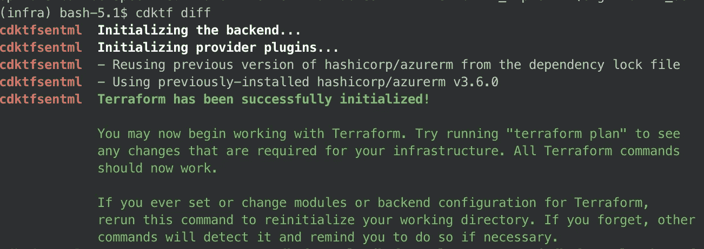

作者图片

最后，我们可以部署堆栈:

```
cdktf deploy
```

如果一切都运行成功，我们应该看到已经添加了 9 个资源:

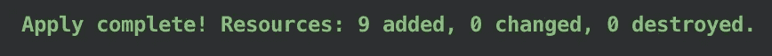

作者图片

如果我们导航到 azure 门户，我们应该看到在资源组中创建的所有资源:

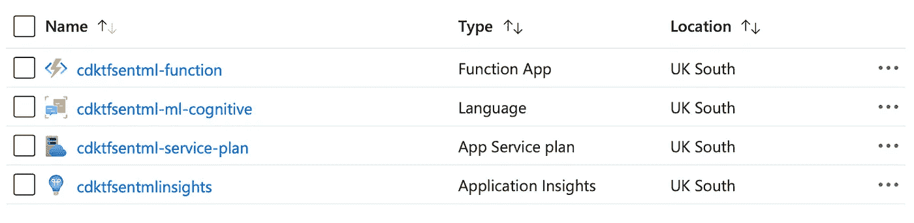

作者图片

# 第二步:编写 azure 函数代码

这一步将包括编写 azure 函数 python 代码。如果你在 AWS 或 GCP 使用过其他无服务器服务，你会注意到类似的模式。

我们为 azure 功能和认知服务导入所有必要的库，并创建文本分析服务，这将帮助我们使用情感分析 API。正如我们在上一步中看到的，一旦在 cdktf 中定义了 AZURE_LANGUAGE_ENDPOINT 和 AZURE_LANGUAGE_KEY，我们就可以在这里读取它们，因为需要它们来读取认知 API。

在函数的主体中，我们尝试读取请求中传递的**句子**字段，如果我们没有找到它，我们将向用户发送一个 404 无效请求。如果我们有了必填字段，我们就调用文本分析服务，获取情感标签(正面、负面、中性)，然后将其发送回客户端。

该请求具有以下格式:

```
{
   "sentence": "This is an amazing day!"
}
```

# 步骤 3:使用 vscode 部署和测试服务

我们可以下载本教程的源代码，并使用 vscode 来编辑和部署代码。可以从[这里](https://code.visualstudio.com/download)下载 Vscode。

我们还需要在 IDE 的扩展选项卡中安装 Azure Functions 扩展:

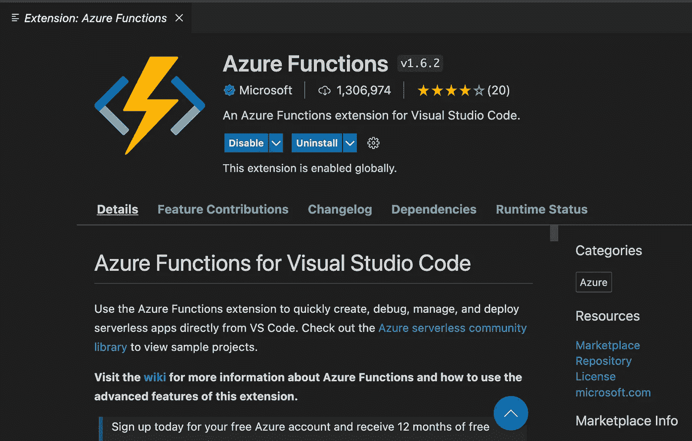

作者图片

如果我们安装了所有东西并从 GitHub 加载了项目，我们可以进入 vscode 中的 azure 选项卡，我们应该会看到 azure 函数(在我们登录后)和本地项目:

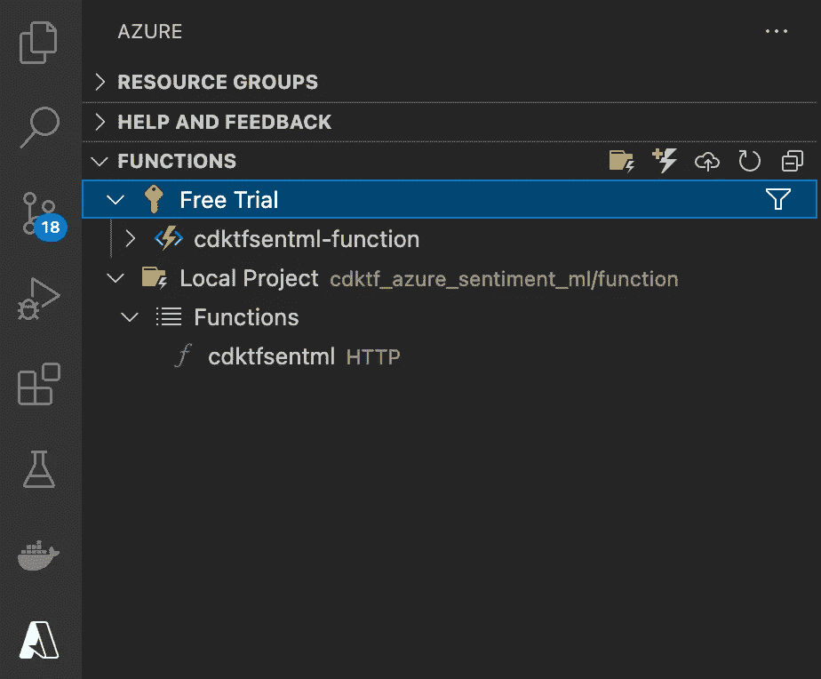

作者图片

接下来我们可以将该功能部署到 azure。我们可以通过点击“功能”选项卡中的云图标来实现:

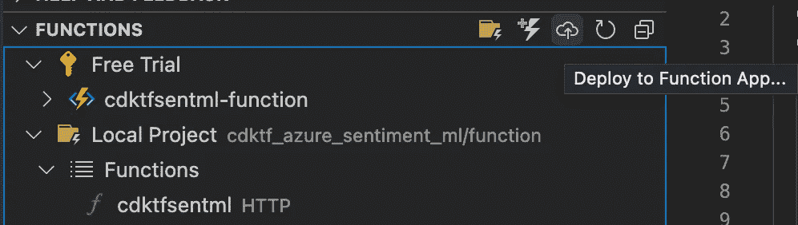

作者图片

将弹出一个菜单，我们可以在其中选择已经部署的功能:

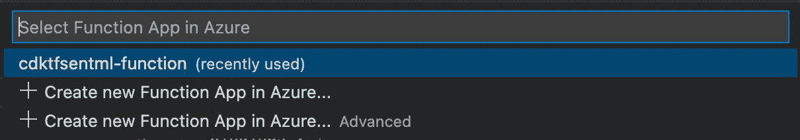

作者图片

几分钟后，我们将收到部署成功的消息:

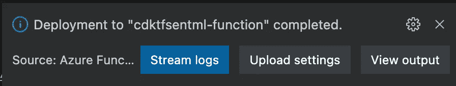

作者图片

部署后，我们可以直接从 vscode 测试功能。在函数选项卡中，我们可以右键单击部署在 azure 中的函数，然后运行**立即执行函数:**

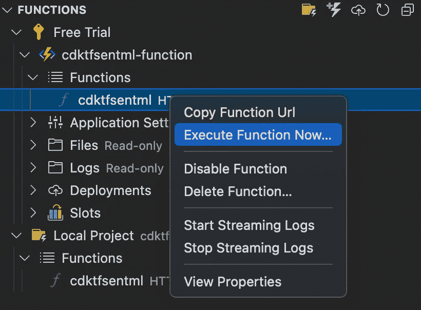

作者图片

这将打开另一个消息框，我们可以在其中编写将发送给 azure 函数的请求:

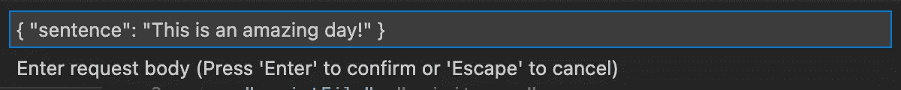

作者图片

我们应该收到来自服务的带有我们请求的情感标签的回答:

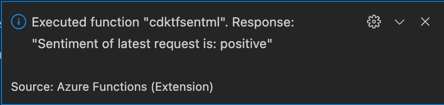

作者图片

如果我们对函数的响应有任何问题，检查任何问题的最简单方法是查看日志。为此，我们需要登录 azure 门户，然后进入资源组-> cdktfsentml-rg-> cdktfsentml-function。在函数窗口中，我们需要进入函数选项卡并选择我们的 cdktfsentml 函数:

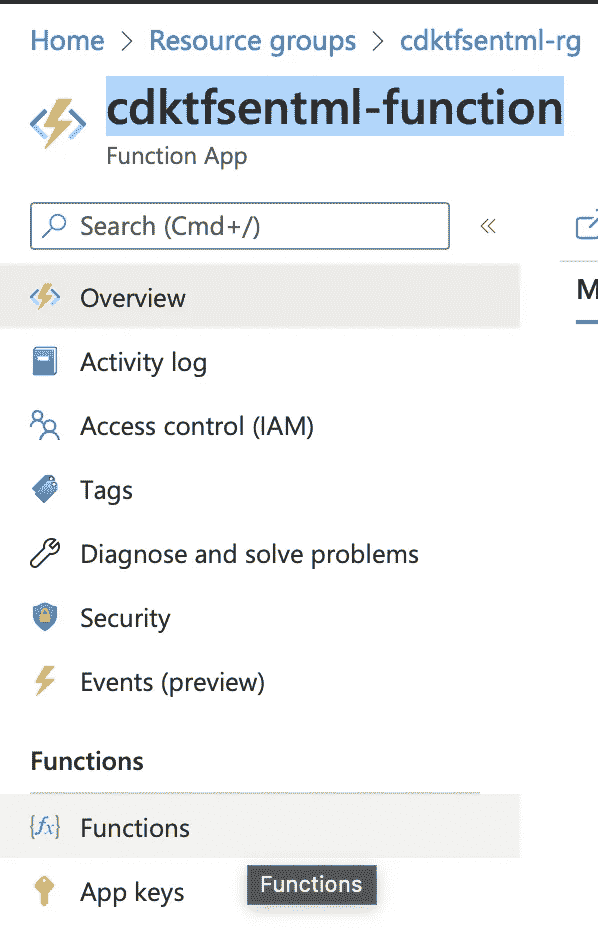

作者图片

进入 Monitor 选项卡，您将获得关于该函数每次调用的许多详细信息:

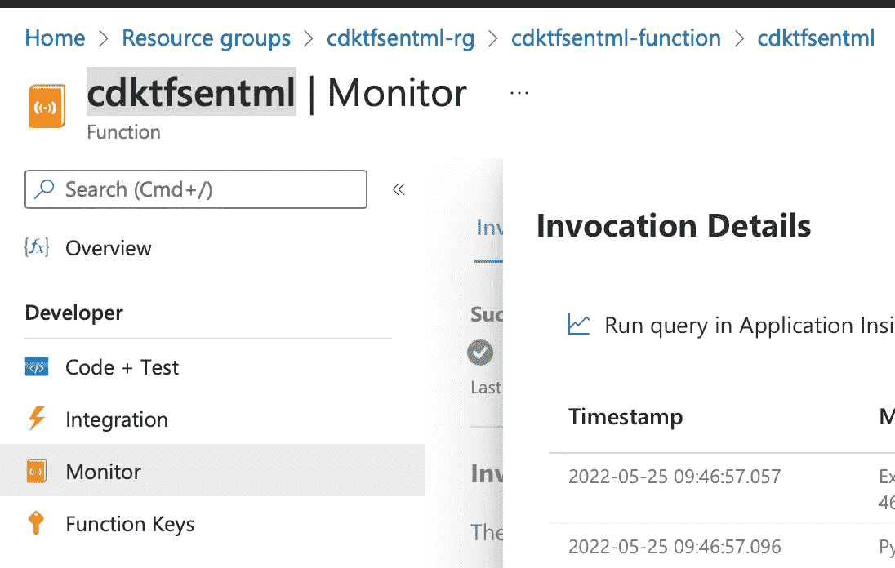

作者图片

如果我们想从 azure 中移除我们的基础设施，我们可以再次运行 cdktf，几分钟后它应该会移除所有内容:

```
cdktf destroy
```

就是这样！我希望你喜欢这个教程，并发现它很有用！我们已经着手在 Azure 中创建一个完整的服务，从构建基础设施到构建和测试 ML 服务。我们看到了如何在 python 中端到端地构建我们的产品，以及使用预构建模型来运行众所周知的 ML 问题(如情感分析)是多么容易。当在生产中使用像 Azure Cognitive 这样的服务时，我们需要评估与构建和训练我们自己的算法相比的成本。此外，我们还看到了如何利用 Azure Functions 这样的无服务器产品来保持低成本，如果我们的服务不经常使用，并且没有必要建立一个 24/7 服务器解决方案。