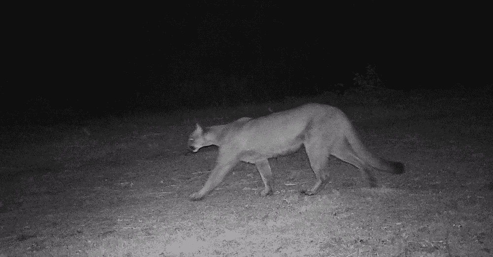
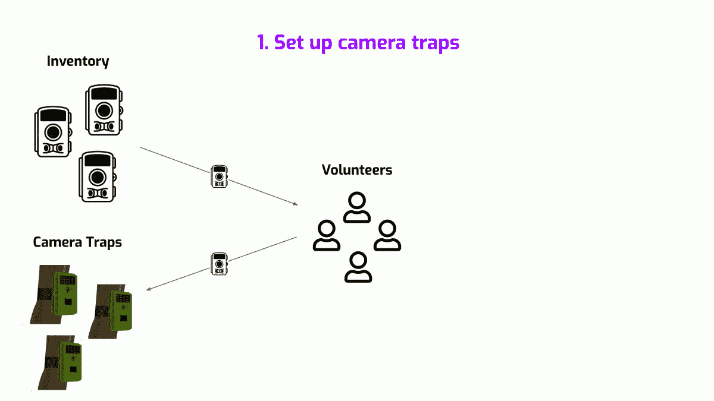
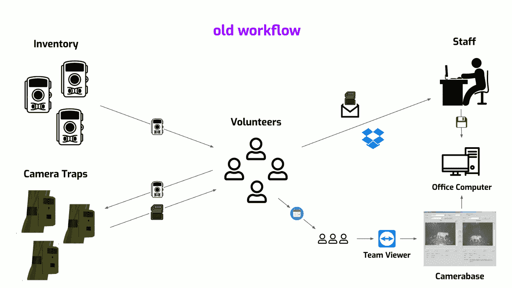
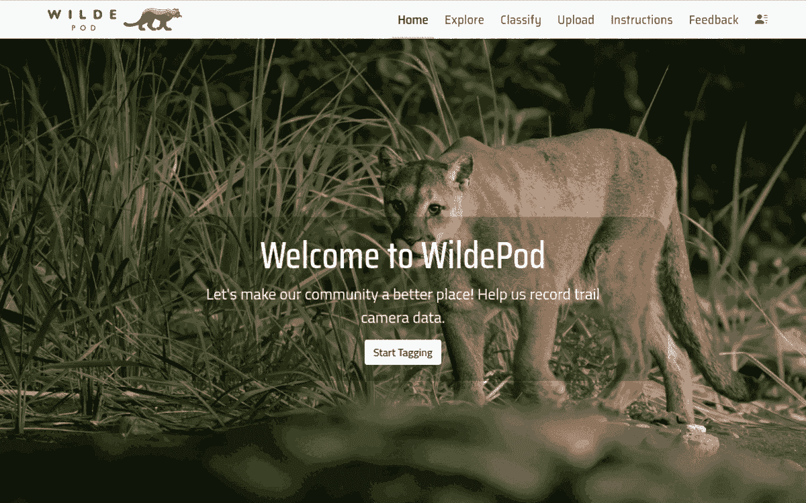

# 建立一个简单的人工智能驱动的人在回路系统来管理野生动物相机陷阱图像和注释

> 原文：<https://towardsdatascience.com/building-a-simple-ai-powered-human-in-the-loop-system-to-manage-wildlife-camera-trap-images-caec966d7b59>

## 带着目标和同理心为非营利组织寻求可持续的技术解决方案

由[猫科动物保护基金会](https://felidaefund.org/)资助的普里西马溪红杉保护区[中的美洲狮](https://www.openspace.org/preserves/purisima-creek-redwoods)

在这篇文章中，我简要记录了我设计和构建人工智能驱动的人在回路系统的旅程，以管理[猫科动物保护基金](https://felidaefund.org/)的相机陷阱图像&注释。如果你对技术在野生动物保护、构建计算机视觉应用或与非营利组织合作中的作用感兴趣，你可能会发现这篇文章很有用。如果你想在进入这篇文章之前有一个高层次的概述，你也可以看看这个[幻灯片](https://docs.google.com/presentation/d/1yHZkAGTqN4Jn_jkfTtbo1jERBNf7ReOONxtJnpw6DL4/edit?usp=sharing)。

猫科动物保护基金会是一个非营利的野生动物研究和保护组织，总部位于旧金山湾区，专门研究野猫，尤其是美洲狮。为了促进他们的研究，他们主要使用相机陷阱，到 2021 年，他们的业务已经发展到超过 100 个相机陷阱，每年生成超过 100 万张图像。然而，这种增长也意味着他们的数据管道开始淹没他们的底层软件工具，促使他们寻找更具可扩展性的解决方案。

他们知道将基于云的解决方案与人工智能/人工智能结合使用是一条出路，为了帮助他们建立这种解决方案，他们在 LinkedIn 上发布了一个招募志愿者的帖子，我碰巧发现了这个帖子。对于在大卫·爱登堡长大的人来说，单是“保护”这个词就足以引发兴奋感，但当我得知他们需要一个基于云的人工智能解决方案来改善他们的数据管道时，我被说服了！

# 1.笑一笑，美洲狮，你上镜头了！

在我们开始之前，让我们快速了解一下什么是相机陷阱，以及它们如何帮助野生动物研究。这里有一个 TL；来自[本 WWF 帖子](https://www.wwf.org.uk/project/conservationtechnology/camera-trap)的博士——

*   相机陷阱是一种带有传感器的相机，可以检测前方的活动，并自动触发图像或视频捕捉。
*   他们让野生动物研究人员以不干扰它们自然行为的方式收集关于我们同类的数据。

现在，你可能在想，“但是为什么我们不能像我们做人口普查一样，穿过森林采访这些动物，并在最后击掌庆祝呢？”。对此，我显然会说，“好主意！我喜欢和五只美洲狮击掌，但我认为生态学家会翻白眼。然而，严肃地说，“在森林里漫步并收集数据”实际上是一种有效的技术，十多年前我曾经自愿这样做，但这是一个昂贵的、劳动密集型的过程，需要人们在森林里踮着脚尖，冒着被毫无防备、受到惊吓的大象踩成煎饼的风险，就我而言！

虽然收集数据的不同技术有不同的权衡，但在猫科动物的情况下，相机陷阱是一个很好的来源，因为猫通常很害羞，喜欢夜间活动。因此，为了支持他们的研究，Felidae 操作了 100 多个照相机陷阱，主要在旧金山湾区，每年产生成千上万的图像！

# 2.数据供应链

虽然相机陷阱很棒，但它们生成的原始图像在变成我们都爱的甜蜜科学之前还有一段路要走。通常，研究人员需要知道

*   **照片拍摄的地点——这是通过标注纬度&经度设置相机陷阱时收集的。**
*   **图像拍摄时间**—相机陷阱为每张图像生成一个时间戳，指示图像拍摄时间。
*   **图像中的动物是什么——一旦收集了图像，注释者就会查看每张图像，并记下其中的动物。**

正如您可能猜到的那样，手工注释这些图像是这个流程中最耗时的过程。但是当你考虑到相机失灵、错误、遮挡、吹树叶、月球漫步的小妖精(好吧，这可能是我编的)等等因素时。，你会得到很多甚至没有任何动物的图片。如果这还不够，只是为了迷惑研究人员，这些相机陷阱偶尔会决定将他们的内部时钟重置为 1970 年的某个时间，从而打乱所有的时间戳。他们似乎就是不能抓住机会！因此，为了管理这种错综复杂的数据管道，研究人员/组织根据其规模和对资源的访问权限设置了不同的工作流。

为了更好地理解这一点，让我们仔细看看 Felidae 的数据管道，它们遇到的不同问题，以及用于解决这些问题的工具套件。大体上，他们的工作流程可以分为三个任务

1.  **设置相机陷阱** —相机陷阱被布置在预定的位置，为了跟踪它们，Felidae 使用 Google Sheets 将相机陷阱的 id 与其纬度&经度关联起来。
2.  **收集图像**——每隔一段时间，来自这些相机陷阱的存储卡就会被收集起来，通过[收存箱](https://www.dropbox.com/)或者通过物理邮件传送到办公室。Felidae 的工作人员随后将这些图像以及有关源摄像机陷阱的信息保存到物理计算机上。
3.  **注释图像** — Felidae 使用一个基于微软 Access 的工具 [Camera Base](https://www.atrium-biodiversity.org/tools/camerabase/) 来处理注释。因为它运行在一台物理计算机上，所以在任何给定的时间，访问都仅限于单个注释器。因此，注释者使用共享的 Google 日历安排访问，然后使用 [TeamViewer](https://www.teamviewer.com/en-us/) 远程登录来注释图像。

一旦对图像进行了注释和清理，数据就从相机库中导出，并根据需要使用 R/Excel 进行提取，以回答他们的研究问题。整个过程是由一群敬业、勤奋的人推动的，他们包括数百名志愿者和一小部分实习生&全职员工。

猫科动物的数据供应链(图片来自作者)

# 3.向上，向上，远离云

当我第一次了解到猫科动物的工作流程时，这是我的反应—😳😧💀我的猜测是，既然你也已经知道了，你可能已经不远了。我记得当时想，“微软 Access？TeamViewer？共享日历？我刚才是不是穿越时空了？”。但是他们已经知道了！他们痛苦地意识到他们工作流程中的低效率，尤其是他们的一次一个注释者的瓶颈和遗留下来的大量未注释图像。更不用说硬盘故障和数据丢失的潜在风险。然而，当时他们知道迁移到云是解决之道，并且已经尝试过，但是却没有明确的前进道路。

## 3.1.圣杯

让我们后退一步，再次查看工作流，找出潜在的改进领域。第一个，也是最明显的一个，是远离作为注释工具的相机底座，公平地说，它可能没有考虑到同时的用户访问。通过构建一个 web 应用程序来代替它，可以通过允许多个注释器同时独立工作来消除注释瓶颈。第二种，不太明显的一种，是使用机器学习，特别是计算机视觉，来自动识别图像中的动物。这项技术在最近几年取得了重大进展，并且有可能极大地提高注释器的吞吐量，[它被野生动物研究人员广泛认为是“游戏规则的改变者”](https://wildlabs.net/state-of-conservation-technology)。因此，从猫科动物的角度来看，这些方向的进展将大大改善他们的工作流程，并腾出时间来做更多的科学工作。但是，正如莫斐斯的名言所说，“知道道路和走在道路上是有区别的”，这种区别在非营利组织中更加危险。

## 3.2.非营利难题

非营利组织资源匮乏不足为奇，尤其是规模较小、更具地方性的非营利组织。他们很难为其核心职能提供资金，因此在投资新技术时，他们倾向于采取更保守的方法。即使他们雄心勃勃，但他们往往缺乏内部专业知识，不知道从哪里开始。因此，他们期待志愿者的到来并伸出援手。虽然这一开始看起来像是获得了“免费工作”，但随之而来的成本并不明显。不幸的是，现实并没有免费的午餐！

那么，这些成本是什么？虽然与盈利性组织可能面临的情况没有什么不同，如减员、入职、决策失误等。然而，幅度被显著放大。为什么？因为志愿者倾向于白天工作，他们的可用性和承诺水平是高度可变的。此外，可用的志愿者资源通常很少，在经验、专业知识和期望方面差异很大。因此，当非营利组织经历志愿者的流失或重影时，他们的项目往往会停滞不前，改变方向，或者在最糟糕的情况下，彻底失败。

## 3.3.通往一体化地狱的高速公路

Felidae 的技术努力始于 2020 年，此后出现了一系列志愿者，他们致力于他们更广阔愿景的不同方面。结果是不同成熟度的多线程工作跨越了一系列技术，这些技术密切反映了构建它们的人的背景。让我们快速看一下它们是什么—

*   一个**数据库模式**连接来自相机陷阱、志愿者、图像、注释等的信息。起草为原始 SQL 查询。它是经过深思熟虑的，但是还没有投入生产，并且没有数据，在一个 60 美元/月的 Google CloudSQL 实例上。
*   一个部分建成的**节点**应用程序与这个数据库接口。然而，大部分代码在少数几个表上实现了基本的 CRUD(创建、读取、更新、删除)操作，并且没有部署到任何地方。
*   一个部分构建的基于 **React** 的 UI，还没有与后端集成。
*   一个经过内部训练的计算机视觉模型,可以区分有和没有动物的图像。作为原始 PyTorch 代码分发，工作人员必须在办公室计算机上用一系列命令执行这些代码，这是唯一一个被积极集成并提供大量价值的组件。

到 2021 年夏天，当我第一次与他们交谈时，大多数从事这些线程工作的人都不在了。其余的人在相当长的一段时间内试图将这些线完成并缝合成一个有凝聚力的产品。他们当时不知道的是，他们正沿着高速公路直奔被人们亲切地称为“融合地狱”的地方。

# 4.有时候，后退一步就是前进一步

虽然按照现有的轨迹直接进入一个项目是合理的，但重要的是要记住，作为一个新人，你会带来一个相对不受主流思想泡沫影响的全新视角。虽然这能让你找到更好的解决方案，但也让你容易重复过去的错误。不用说，有很多作业要做。

## 4.1.家庭作业

从没有任何领域知识开始，我花了前几周时间与 Felidae 的一些工作人员和过去的志愿者交谈，他们非常亲切地帮助我对他们的工作流、痛点和乌托邦有一个强烈的感觉。他们还详细记录了他们当前的现代化之旅、过程中的决策点及其背后的基本原理。由于这样的对话往往遵循叙事结构，我需要将*他们的问题是什么*与*他们如何试图解决问题或者认为应该解决的问题分开。实现这一点的最佳方式是制作一份结构化的文件，不仅作为他们口述历史的书面版本，还作为未来对话的有用锚。简单来说就是一篇复习论文！*

为了补充这一点，我也有相当多的关于相机陷阱数据管道的内容，这让我发现了来自[丹·莫瑞斯](http://dmorris.net/)的这篇[奇妙的博客文章](https://agentmorris.github.io/camera-trap-ml-survey/)。很快就变得很明显，Felidae 并不是唯一一个在看似支离破碎的软件工具领域导航的人，但是激起我兴趣的是社区近年来为解决这个问题所做的重大努力。最值得注意的是，从 2018 年开始，使用机器学习自动检测相机陷阱图像中的动物已经正式成为在 [CVPR](https://en.wikipedia.org/wiki/Conference_on_Computer_Vision_and_Pattern_Recognition) 的一个研讨会举行的[竞赛，这是一个受欢迎的计算机视觉会议。此外，微软的](https://sites.google.com/view/fgvc9/competitions/iwildcam2022) [AI for Earth](https://www.microsoft.com/en-us/ai/ai-for-earth) 已经开源了一个这样的模型，名为 [MegaDetector](https://github.com/microsoft/CameraTraps/blob/main/megadetector.md) 供大家使用。另一项合作项目 [Wildlife Insights](https://www.wildlifeinsights.org/) ，旨在通过提供一种基于云的人工智能解决方案来标准化相机陷阱图像工作流程，这正是 Felidae 试图打造的东西！

## 4.2.先买，后买，最后建

从头开始构建东西的冲动是很难抗拒的，尤其是在灵活性和定制的诱惑下。毕竟，创造的欲望很高，来自外部解决方案强加的约束的不适也很高。但是，每一个决定都是一种权衡，而且，灵活性带来了前期和维护成本。正如我前面提到的，这些决定与营利性组织不得不做出的决定没有什么不同，但在技术快速发展、人员流失加剧和缺乏内部专业知识的背景下，非营利组织不得不在更大的不确定性下做出这些决定，这使得这些成本更有可能被低估。

换句话说，非营利组织面临着与营利组织相同的*构建与购买*困境，尽管约束条件略有不同。一方面，他们需要建设或购买的资本和劳动力较少。另一方面，由于开源社区，他们有了更多的免费选择。在这种情况下，一个很好的经验法则是首先接受一个强烈的偏向，支持免费的解决方案，同时放松质量门槛。接下来是寻找可购买的选择，特别是来自大型成熟组织的选择，这些组织提供低成本、稳定的产品，并可能为非营利组织提供折扣。最后，只有当(1)让工作流适应现有解决方案的效率太低和/或(2)有机会被其他非营利组织重用时，才求助于构建。

在他们的旅程中，Felidae 严重倾向于建造太多的东西，投入了超过 18 个月的时间和精力，开始屈服于臭名昭著的沉没成本陷阱。虽然向前迈进显然意味着剔除大部分工作线索并后退一步，但对我来说，认识到这样一个事实也很重要，即激进变革的提议，尤其是来自一名新志愿者的提议，可能并理所当然地会引发恐惧和怀疑。因此，当我让时间建立信任时，我致力于解决他们的问题，同时将他们推向外部解决方案，即使这意味着在他们的工作流程中增加额外的一两步。

# 5.少即是多

在很高的层面上，Felidae 需要一个集成了以下功能组件的单一系统——

1.  **库存管理**对相机陷阱、盒子、内存卡等实物库存进行编目。跟踪他们在战场上的部署。
2.  **摄像头陷阱管理**追踪这些摄像头在研究期间监控的物理位置。
3.  **图像管理**以简单、结构化的方式存储、浏览和共享他们收集的成千上万张图像。
4.  **注释管理**给这些图片加上它们所包含的动物标签。
5.  **收集、上传和注释这些图片的志愿者和工作人员的用户管理**。

如前所述，Google sheets 用于跟踪库存、相机陷阱和用户；Dropbox/Windows 文件系统管理的图像；最后，摄像机基础处理注释。然而，这些都没有在下面相互连接，这样做需要大量的体力劳动！当时，虽然没有万能的灵丹妙药(Wildlife Insights 已经很接近了)，但是有大型活跃的工作组支持的相当成熟的子组件。因此，最合理的选择是简单地采用这些来代替内部线程，并将事情削减到只有一个薄薄的粘合层，即 web 应用程序。

我在这里的指导原则，由无数黑客马拉松塑造，是一个偏爱速度的原则。因此，当我开始时，我的首要任务是尽快部署一个基本但功能齐全的端到端产品。在给定的环境下，这种方法是理想的，因为在开发过程中，必须尽早将最终用户纳入进来。此外，作为一个内部应用程序，对错误和故障的容忍度更高。但是，也许更重要的是，它提供了当时非常需要的东西——18 个多月后的切实进步感，这将鼓舞士气，并在最近建立信任。

## 5.1.被解放的姜戈

核心粘合组件，即 web 应用程序，是以遍布 SQL、Node & React 的数千行部分功能代码的形式存在的。但令我惊讶的是，大多数(如果不是全部的话)只是在基表上实现了 CRUD 操作。虽然这些框架中可能有提供相同功能的第三方包，但我和其他任何人都不太了解这个生态系统，无法继续这些思路。然而，我对另一个流行的框架有相当多的经验， [Django](https://www.djangoproject.com/) ！

现在，添加新的技术依赖不是一件容易的事情，特别是当这种依赖会渗透到单点故障时，在这种情况下，就是我。但是，我对自己的承诺很有把握，在这种情况下，考虑到[姜戈](https://www.djangoproject.com/)提供的众多好处，冒这个风险似乎是合情合理的

1.  一个用于基本 CRUD 操作的内置 GUI， [Django Admin](https://docs.djangoproject.com/en/4.0/ref/contrib/admin/) 接口，以及一组可供选择的皮肤(我使用 [Jazzmin](https://django-jazzmin.readthedocs.io/) )。
2.  令人惊叹的 django-allauth 软件包增强了内置的用户管理系统。
3.  ORMs 超过原始 SQL，我发现它更简单、更干净(个人偏见)。
4.  一种统一的语言，Python，将跨越 web 应用程序、数据库和 AI/ML 模型，为志愿者在系统的不同领域做出贡献降低了障碍。

带着对 Django 永恒的爱，我重温了我的 web 开发技能，开始着手做这件事。幸运的是，正如我所希望的那样，我不仅能够替换现有的数千行代码，还能够用大约一百行代码添加更多的功能！就这样，在几个喝着咖啡的晚上，我能够建立一个 web 应用程序，消除五个功能组件中的三个——库存、相机陷阱和用户管理——这都要归功于 Django 及其周围生态系统的惊人力量。

## 5.2.请再来点收纳箱。

下一个稍微棘手的组件是图像管理。这里的棘手之处不在于图像上传的处理，而在于它的庞大数量！直接从存储卡中取出的图像会以成千上万的形式出现，在某些情况下，会以数万的形式出现，这意味着 web 应用程序需要暂停/恢复上传、删除重复图像、验证图像完整性等功能。接下来是浏览、分享和操作这些图像的用户界面。不幸的是，Felidae 严重低估了这方面的努力水平，他们不仅制定了这个崇高的计划，还在浏览器内的 ML 模型中分层，以在上传之前过滤掉空图像。一个小型非营利组织的白日梦！

根据主题，我的目标是少建，而不是多建。幸运的是，几乎所有提供云存储的公司都解决了这个问题，而且锦上添花的是，Felidae 已经使用 Dropbox 来传输他们的图像。因此，更多的 Dropbox 实际上意味着更少的工作，抵消了他们将图像下载到办公室电脑上的需求。更重要的是，Dropbox 有两个主要优势——( 1)简单、直观的 Python SDK，便于与 Django 集成;( 2)易于使用的“文件请求”功能，甚至允许非 Dropbox 用户上传文件——这使得它明显优于其他替代品，如 Google Drive。

从用户的角度来看，一旦从相机陷阱中收集到存储卡，他们只需登录网站并提交在线表格(以前在纸上完成)。接下来，他们会收到一个上传图片的 Dropbox 链接。就是这样！在幕后，Django 会自动浏览上传的图像，并在数据库中添加一层必要的元数据。在这一阶段，Dropbox 通过其 API 展示了一套功能，再次证明了它非常有用。具体来说，

1.  它使识别文件类型(图像、视频、文档等)变得容易。)特别是对于媒体，它还暴露了 Exif 属性，如时间戳和位置(纬度/经度)——这对相机陷阱至关重要！
2.  它自动生成[内容哈希](https://www.dropbox.com/developers/reference/content-hash)来唯一识别图像。
3.  最后也是最重要的，它提供了一个简单的缩略图 API。这意味着 Django 只能提取更大的源图像的更小的压缩版本(~5MB)进行额外的处理&渲染。

少就是多！

## 5.3.MegaDetector & Annotorious，动态二人组

最后，也是最关键的，是时候用更高效的东西替换相机底座了。概括地说，这需要两个组件——( 1)用户添加注释的用户界面，以及(2)可以学习和复制这些注释器的 AI/ML 模型。在这里，Felidae 确实有一个胜利，那就是一个训练有素的模型，它可以以合理的准确度检测图像中动物的存在。但是，他们完全错过了 [MegaDetector](https://github.com/microsoft/CameraTraps/blob/main/megadetector.md) ，一个由大型社区支持的类似模型，并根据数量级以上的数据进行训练。作为一个额外的奖励，虽然内部模型将“空白”/“非空白”标签贴在整个图像上(图像分类器)，但 MegaDetector 可以检测人、动物和车辆以及它们在图像中的位置(对象检测器)。不用说，斧头必须砍在内部模型上，随着[最近发布的新一代 MegaDetector】，这个决定显然已经得到了很多倍的回报！](https://wildlabs.net/discussion/megadetector-v5-release)

AI/ML 模型是狡猾的小生物，它们使一切都变得明显随机，MegaDetector 也不例外。没有它，每个图像都需要人工检查，有了它，图像就有可能需要它。不幸的是，解释这些数字并不是一件容易的事情，在这个阶段未被发现的错误模式有可能严重扭曲下游分析。公平地说，即使获得了更多的信任，人类注释者也是随机的，他们有自己的任期相关的错误率。因此，一个健壮的系统应该是一个协作的系统，其中注释者不仅覆盖 AI 模型的盲点，还覆盖彼此——同时随着时间的推移，将手工劳动的量最小化。

实现这一点的第一步意味着一个用户界面将呈现出 [MegaDetector](https://github.com/microsoft/CameraTraps/blob/main/megadetector.md) 预测的边界框，同时还允许注释者编辑或添加他们自己的边界框。在计算机视觉应用中，这是一项常见但重要的任务，整个公司都围绕着提供这样的功能而建立，在检查我的选项时，我偶然发现了一个免费但非常棒的库，名为[注释](https://recogito.github.io/annotorious/)，它似乎是量身定制的！凭借简单、直观的界面，Annotorious 使 Django 网站成为一个简单的注释平台，不仅取代了相机库，还支持收集更细微的对象级数据，MegaDetector 和其他人工智能模型可以从中学习。

## 5.4.FaaS、PaaS 和 IaaS

因为我的首要任务是让 Felidae 的员工参与进来，所以让应用程序实时可用非常重要，即使是以准系统的形式。因此，关于底层软件基础设施的决策必须从一开始就做出。但是在开始之前，让我们后退一步，看看系统的不同组件，只是这次是作为软件的一部分。大体上，我们有—

1.  **网络应用**，Django，作为用户与系统交互的主要界面。
2.  一个**关系数据库**用来存放关于库存、相机陷阱、用户、图像和注释的结构化数据。
3.  **媒体资产**主要包括要在网站上呈现的摄像机捕捉图像的压缩版本。
4.  **AI/ML 模型**像 MegaDetector 一样检测和识别图像中的对象。

十年前，我的直觉是租用一个裸机实例，将所有这些组件竖立起来，但现在，随着成熟云服务的出现，有了更多选项可供选择。随着 Felidae 已经在谷歌云平台(GCP)上开始，任务归结为找出正确的服务集来使用，同时强烈倾向于速度和易于维护。

首先，为 Django 使用[应用引擎](https://cloud.google.com/appengine)几乎是一件容易的事情，因为它有慷慨的免费层、内置的自动缩放和[优秀的入门文档](https://cloud.google.com/python/django/appengine)。用[云 SQL](https://cloud.google.com/sql) 和[它的代理](https://cloud.google.com/sql/docs/mysql/sql-proxy)建立 Postgres 数据库很容易，使得本地开发变得轻而易举。对于媒体资产， [django-storages](https://django-storages.readthedocs.io/en/latest/) 使得存储到[云存储](https://cloud.google.com/storage)和从云存储提供服务变得很简单。而且，在这个过程中，[云日志](https://cloud.google.com/logging)增加了大量的可见性，并使调试成为一种乐趣！这转化为 Django 应用程序一建立就投入使用，并使员工在开发过程的早期就可以轻松浏览、搜索并给出他们有价值的反馈。

剩下的部分，MegaDetector，有点复杂。首先，由于它只有在大批量图片上传时才会被触发，而这种情况每个月都会发生几次，因此将其与 Django 应用捆绑在一起是没有意义的。此外，它有很大的内存占用量(约 6GB)，远远超过了应用引擎的限制。考虑到这一点，虽然我最初考虑了[云运行](https://cloud.google.com/run)，但我最终还是选择了使用[云函数](https://cloud.google.com/functions)，主要是因为它的简单性。只要有一个简单的 http 触发器，Django 就可以在上传图像时调用这些云函数，并且与它分离，模型开发和部署变得更加模块化和独立。有了它，网站的功能就完整了，我完全没有大喊“它还活着！它还活着！！!"疯狂地。

# 6.景色

到 2022 年初，经过前几个月零星的晚上和周末黑客会议，网站已经准备好了！经过几个月由工作人员领导的用户测试和解决 UX 的问题后，该网站在 2022 年春天开始收集注释。拉远，这里是对 Felidae 的工作流程意味着什么的快速浏览。

Felidae 的新旧工作流程(图片由作者提供)

该网站目前位于 WildePod.org，目前正在向经过审查的志愿者开放，计划在明年开放。现在，这里有一些截图来展示它的样子。

wildepod.org 截图(经许可使用)

# 7.前方的小路

到目前为止的旅程实际上只是未来有趣而有影响力的旅程的基础。有了基本的工具，这里有一些广泛的工作领域，我认为它们不仅可以为猫科动物，也可以为野生动物研究和保护创造很多价值！

*   **数据金矿**——多年来，猫科动物的相机陷阱已经收集了近百万张图像，价值近 5TB！更好的是，他们还有一群热情的志愿者，他们使用 Camerabase，煞费苦心地标注了这些图像的一大部分，包括其中动物的种类和数量。因此，第一步是将所有这些图像迁移到新的范式中，当与 MegaDetector 结合时，有可能生成成千上万的物种级注释，这是 ML 模型的无价资源！
*   **物种检测** —目前，应用程序中 AI/ML 模型的使用仅限于检测一般的动物。然而，由于数据稀少，准确识别其物种是一项非常困难的任务，并且非常处于研究的前沿。目前这种方法的分支是一个两步注释过程——一个 MegaDetector 辅助的动物检测阶段，然后是一个纯手动的物种注释阶段，用户必须从一长串物种中进行选择，这造成了缓慢而糟糕的用户体验。但是，由于猫科动物的大量内部数据，这不仅是改善猫科动物物种检测模型的大好机会，也有助于更大规模的研究工作。此外，在典型的人在回路中的方式中，经过训练的模型可以通过简单地对物种列表进行排序来极大地增强用户体验，作为回报，这些用户注释可以帮助模型在近乎连续的协作回路中随着时间的推移而变得更好。
*   **洞察和分析** —一旦图像被收集和注释，这个管道的最后一个阶段通常是处理数据以回答研究问题。目前，这是通过下载注释并将其加载到 Excel 或 r 等专用软件上来完成的。虽然这些任务通常更难抽象，但有机会将高层次的见解直接集成到网站中，使研究人员能够专注于更深入、更微妙的问题。

强调这条道路的是向更广泛的社区开放源代码数据、模型和软件资源的机会，这可以更好地帮助理解和帮助我们在野外的生物同胞。

如果您有兴趣提供帮助，或者您有任何问题、评论或反馈，请随时[在 LinkedIn 上给我留言](https://abhaykashyap.com/blog/ai-powered-camera-trap-image-annotation-system/%7Chttps://www.linkedin.com/in/abhaykashyap12/)或在下面添加评论。