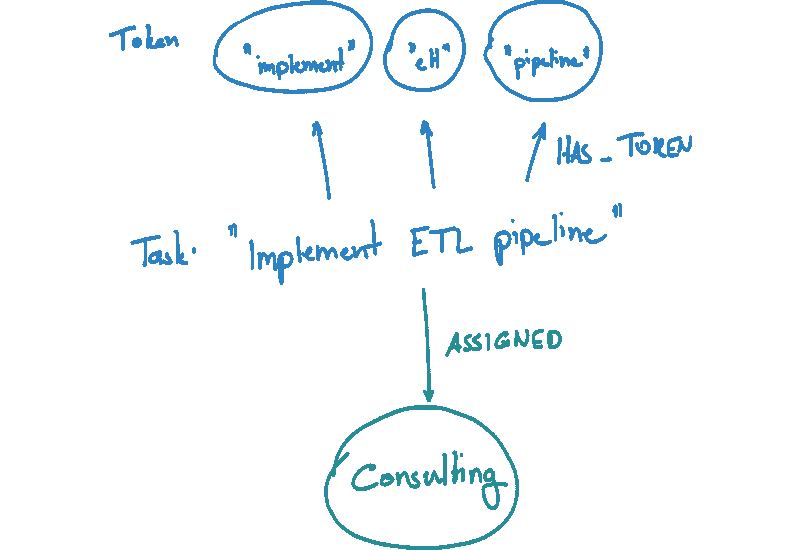
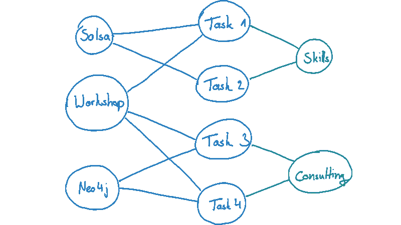
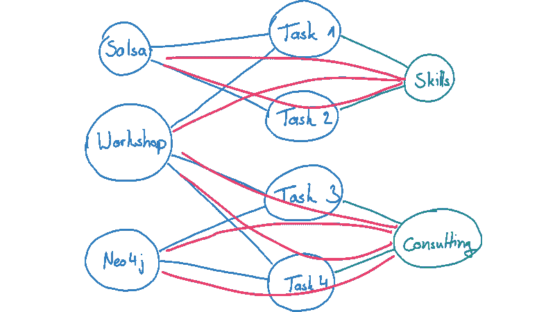
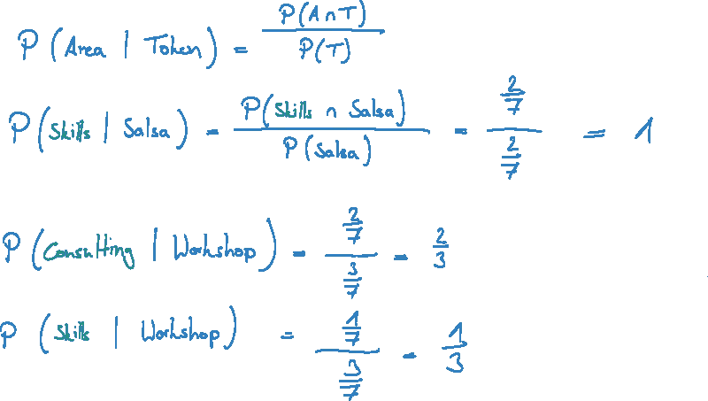
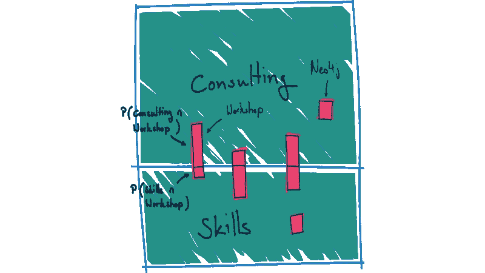
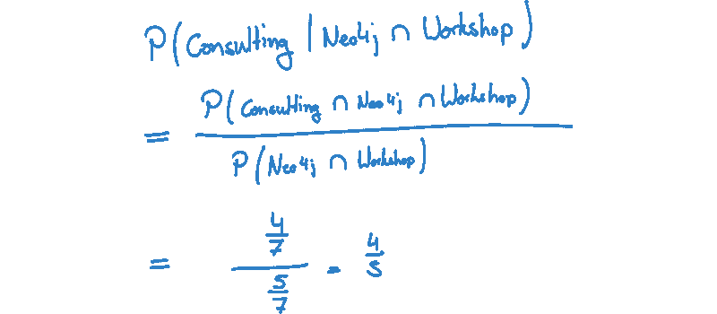
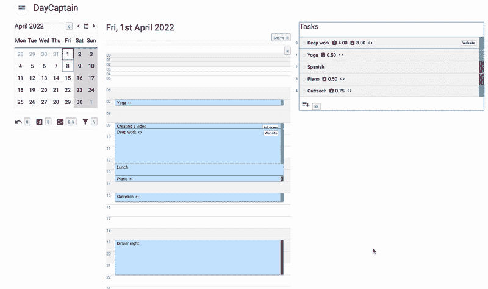

# 用 Neo4j 构建一个简单的推荐引擎

> 原文：<https://towardsdatascience.com/building-a-simple-recommendation-engine-in-neo4j-45770d8747eb>

## 让我们用 plain Cypher 构建一个简单的推荐引擎

像 Neo4j 这样的图形数据库是创建推荐引擎的优秀工具。它们允许我们检查可能包含各种数据源的数据点的大环境。他们强大的存储模型非常适合我们希望分析节点周围环境的应用。如果你想了解是什么让图比关系模型更强大，请阅读这里的。

在本文中，我描述了我们如何只用 Cypher 直接在 Neo4j 中实现一个简单的推荐引擎。该方法基于基本的自然语言处理和简单的条件概率来寻找最可能的匹配项。这个实现可以在一个查询中用几行代码来完成。当用户与应用程序交互时，我们实时运行查询。这个简单的方法产生了非常令人满意的结果，是一个很好的第一个版本。这为我们节省了很多供应和维护额外外部系统的麻烦，我们需要这些系统来进行更复杂的方法。尽管它工作得很好，但是这个解决方案也有一些限制。

# 领域:队长，任务，事件，领域和项目

DayCaptain 是一个个人时间规划应用程序，允许用户创建由任务和事件组成的一天计划。任务和事件的主要属性是它们的标题，这是一个指定它的短字符串。组织这些对象的一种方法是将它们分配给(生活)区域和项目。一个领域是一个更大且持久的主题，而一个项目是有时间限制的。项目本身可以被分配到一个区域，在这种情况下，它们继承该区域。在本文的其余部分，我们不写“任务和事件”,现在我们只关注任务。

现在，目标是当用户开始在前端输入时，检测新任务的区域分配。例如:用户创建一个任务，开始在 DayCaptain 中编写“部署 ETL 管道”。当他打字时，我们想通过分析使用这些单词的其他任务来检测单词最可能出现的区域。

# 标记化和词干化—准备工作

目前，我们只考虑任务的标题属性。为了将它转化为可工作的特性，我们需要提取它的表征并对它们进行词干处理。我们使用 [StanfordNLP](https://nlp.stanford.edu/software/) 框架在用户创建新任务和事件时处理每个输入字符串，并将它们的令牌用法作为关系存储在图中。

数据模型:任务的主要属性是标题。它链接到词干标记，并被分配给一个区域。(图片由作者提供)

# 集合、面积和条件概率

我们的目标是为用户当前正在键入的一组单词找到最可能的区域分配。所以，我们要找到概率`P(A|T)`最大的区域。换句话说:给定一个记号 T，我们想找到包含这个单词的概率最大的区域 A。

让我们从一个简单的例子开始:

任务与令牌和区域有关系——介于两者之间。(图片由作者提供)

现在，正如我们所看到的，任务(或事件)位于区域和令牌之间，并且基本上形成了它们的分配。当我们创建由标记组成的新任务和事件，并将它们与区域相关联时，我们在区域和标记之间获得更多这样的间接关系。这些间接关系正是我们要分析来寻找建议的。

当任务位于区域和令牌之间时，它们在它们之间形成间接关系。(图片由作者提供)

现在，根据上图，我们还可以在区域和令牌之间构建一个分配矩阵。

利用这些间接关系，我们可以构造一个面积和记号的频率矩阵。(图片由作者提供)

手头有了所有这些数字，我们可以很容易地计算出`P(A|T) = P(A & T) / P(T)`的条件概率。以下是一些例子:

使用我们的频率矩阵，我们可以很容易地计算条件概率看到一个地区给定一个令牌。(图片由作者提供)

说明这种概率的一个非常直观的方法是将它们视为面积。

频率也可以用面积来表示。(图片由作者提供)

我们的推荐查询很简单。然而，这个例子只适用于单个令牌。问题是:我们如何将多个单词组合成这样一个概率计算？

# 查找多个单词的推荐

每个任务和事件可以，并且可能由多个令牌组成。为了将我们的模型扩展到这种情况，作为区域的图示特别有用。

例如:我们想找到任务“准备 Neo4j 研讨会”的区域分配。然后，我们想找到概率`P(A|”Neo4j” & “workshop”)`。从微积分，我们可以推断，我们需要找到`P(A & “Neo4j” & “workshop”)`和`P(“Neo4j” & “workshop”)`。如果我们查看我们的面积图(或我们的矩阵),我们可以得出这些概率是什么。计算如下:

双令牌条件概率的计算。(图片由作者提供)

正如我们已经从例子中看到的，我们不需要赋值的全局计数，因为它总是相互抵消。因此，我们的推荐查询非常简单，只需确定每个区域内的分配数量。以下是查询:

最终区域检测查询。

**该查询的一些注释:**在 real DayCaptain 中，也有在区域和任务之间建模的项目。`Information`标签是任务和事件的超类(或者基本上是所有东西，它有一个标题属性)。此外，查询被简化为不考虑用户。在我们的生产案例中，我们实际上将这个查询限制到特定的用户。

# 这很简单——但是效果如何呢？

行动中的区域检测🚀(图片由作者提供)

我们对推荐引擎进行了定量评估，甚至在相同的数据上将其与深度神经网络模型进行了比较。结果非常令人满意。在这两种情况下，我们将数据集分为训练集和测试集。尽管在我们的简单方法中没有训练阶段，但我们想测试推荐引擎是否能在它以前没有见过的数据点上很好地工作。

我们有大量来自我自己的数据，因为我已经使用 DayCaptain 超过 4 年了。对于这两种方法，我们测量了他们对已知任务或事件预测正确结果的次数。这两种方法都在大约 95%的时间里预测了正确的区域。

# 伙计，这很酷——但这意味着什么呢？

让我们对此进行简短的讨论:我们的简单统计(或概率)推荐方法使用非常简单的数学和大量的直觉来产生非常有用的结果。它非常简单明了地用普通密码实现，并且直接在我们的 Neo4j 后端运行。没有添加外部系统的开销，没有我们需要管理的培训周期或模型，维护代码的开销也很低。我们实际上能够实时查询结果(在用户输入时多次查询),而不需要对结果做任何准备。与嵌入 word2vec 的深度神经网络模型等更复杂的方法相比，它产生了同样好的结果。

然而，这种方法的主要缺点是:它局限于一个简单的特性集。一旦我们想在我们的推荐中考虑更多的特性，我们必须在我们的查询中显式地建模它们。它可能变得非常复杂，难以理解，甚至无法维护。更不用说寻找正确的方法将多个特性组合成一个合理的结果的复杂开发过程了。

# 让我们把这个围起来。

Neo4j 强大的查询模型允许我们在数据库中构建强大的推荐。我们创建了一个非常简单但非常强大的预测查询，为我们的用户提供最佳体验。我们的方法实际上是 80/20，我们取得了一些非常好的结果。对我们来说，主要优势是直接在我们的图形数据库中实现，因为它为我们节省了大量供应、培训和监控额外系统的工作。然而，这种方法的应用限于一小部分特征，因为查询可能变得相当复杂，并且需要很大的努力来维护和扩展。这里描述的方法无疑是构建初始工作解决方案的良好起点。

# 让我们组队吧——让我听听你的意见。

我希望你喜欢阅读这篇文章，并希望你能从中受益。如果您有任何问题或不同意见，我热忱欢迎您留下评论或直接联系我。点击订阅按钮阅读更多类似内容。🚀