# 使用 AWS 构建简单的 Web 应用程序

> 原文：<https://towardsdatascience.com/building-a-simple-web-application-using-aws-605436d77407>

## 你是 AWS 新手吗？—本教程是为您设计的。


克里斯·斯皮格尔在 [Unsplash](https://unsplash.com/@chrisspiegl?utm_source=unsplash&utm_medium=referral&utm_content=creditCopyText) 上的照片

在本文中，我将向您展示如何在 AWS 上构建一个简单的 web 应用程序。首先，我们将创建一个显示“Hello World”的静态 web 应用程序然后，我们将发现如何将不同的 AWS 特性整合到 web 应用程序中，并了解它们如何协同工作。

在这个项目中，你可以从标题中猜到，我们将使用 AWS cloud，它代表 Amazon Web Services 一个优秀的云平台，为许多不同的用例提供了无尽的服务，从训练机器学习模型到托管网站和应用程序(在撰写本文时，大约有 200 个 AWS 服务可用)。

这个项目很好地介绍了云计算平台。如果你是新手，刚刚进入云服务，不要担心。开始学习新的东西永远不会太晚。

如果你准备好了，让我们开始工作吧。这是我们将遵循的结构。

## 目录:

*   *第一步——开始*
*   *步骤 2 — AWS Lambda 无服务器功能*
*   *步骤 3 —将 Lambda 功能连接到网络应用*
*   *步骤 4 —创建一个 DynamoDB 表*
*   *步骤 5— IAM 策略和权限*
*   *最后一步——测试网络应用*

# 步骤 1 —开始

在这一步中，我们将学习如何使用 AWS Amplify 控制台为我们的 web 应用程序部署静态资源。

基本的 web 开发知识对这部分会有帮助。我们将创建我们的 HTML 文件。如前所述，该网站将是直截了当的，一个标题说“你好，世界！”

作为这个项目的代码编辑，我使用了 Atom。随意用你最喜欢的。以下是该页面的代码片段:

有多种方法可以将我们的代码上传到 Amplify 控制台。比如我喜欢用 Git。为了使本文简单，我将向您展示如何通过拖放方法将它直接放入 Amplify 中。为此，我们必须压缩我们的 HTML 文件。


图片由作者提供。

现在，让我们去 AWS 放大器控制台。它看起来会像这样:

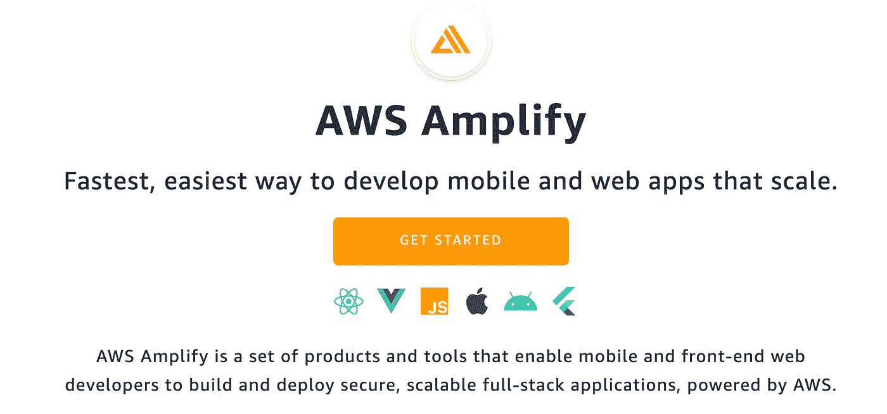

当我们点击“开始”时，它会将我们带到以下屏幕(我们将在此屏幕上选择 Amplify Hosting):

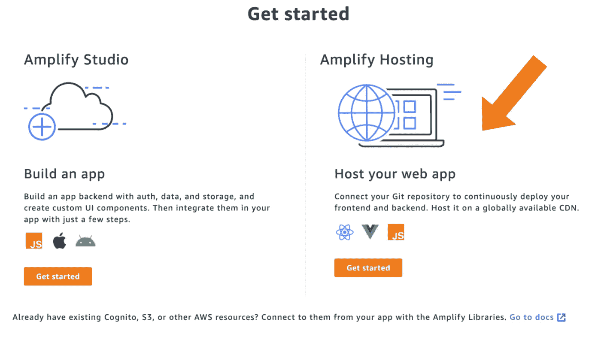

图片由作者提供。

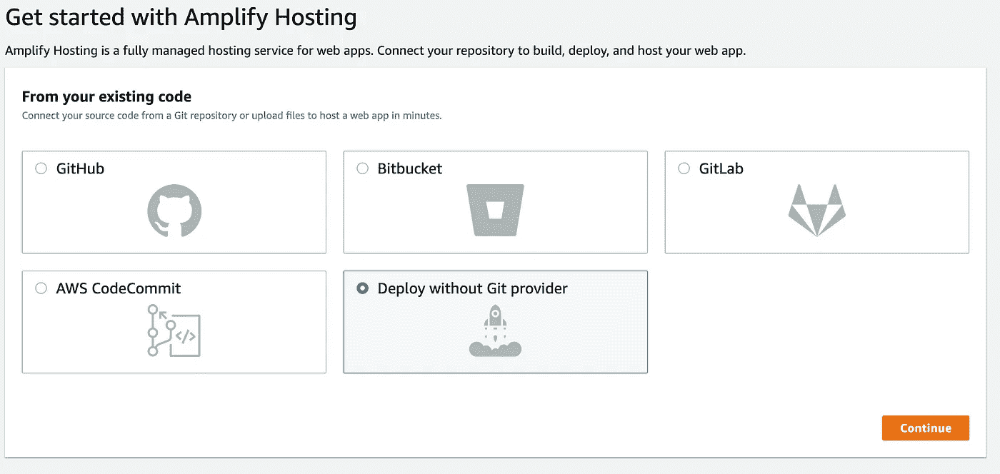

图片由作者提供。

我已经创建了一个 Amplify 应用程序项目，并将其命名为“Step1”

然后，我删除了压缩的索引文件。Amplify 部署了代码，并返回了一个我们可以访问网站的域名 URL。

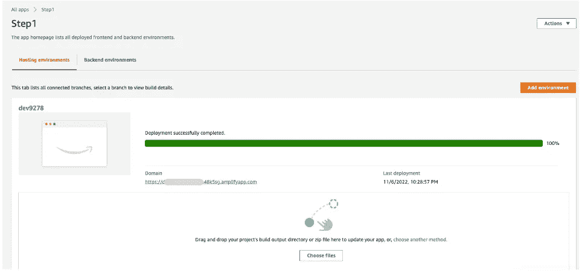

图片由作者提供。

目前，我们的网站是这样的:

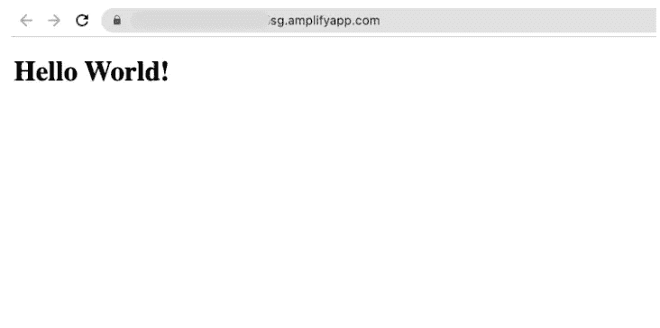

网站域名直播。图片由作者提供。

这一步都做完了！多亏了 AWS Amplify，我们的静态 HTML 代码得以部署和运行。

# 步骤 2 — *AWS Lambda 无服务器功能*

在这一步中，我们将使用 AWS Lambda 服务创建一个无服务器功能。AWS Lambda 是一种计算服务，让我们在不使用全时运行的计算引擎的情况下完成任务。相反，只有当某些东西调用它时才起作用；非常有效的解决方案。

给你一些想法，现实生活中无服务器计算的一个很好的例子是自动售货机。他们将请求发送到云端，然后处理作业，只是有人开始使用机器。你可以从[这里](https://aws.amazon.com/lambda/)了解更多关于 AWS Lambda 的信息。

让我们转到 AWS 控制台内部的 Lambda 服务。顺便说一下，确保在 Amplify 中部署 web 应用程序代码的同一区域中创建函数。您可以在页面的右上角看到地区名称，就在帐户名称的旁边。

是时候创建一个函数了。对于运行时编程语言参数:我选择了 Python 3.7，但也可以选择一种您更熟悉的语言和版本。

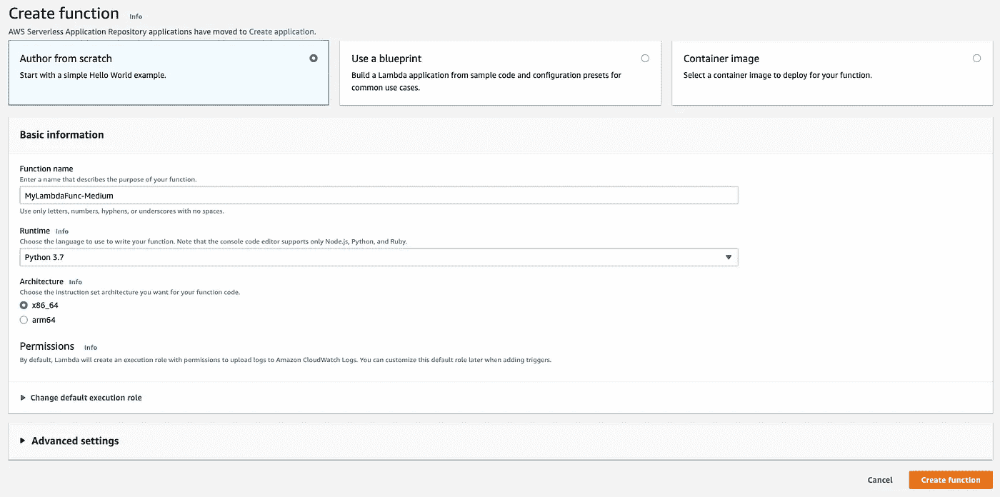

λ函数。图片由作者提供。

创建 lambda 函数后，我们将看到以下屏幕:

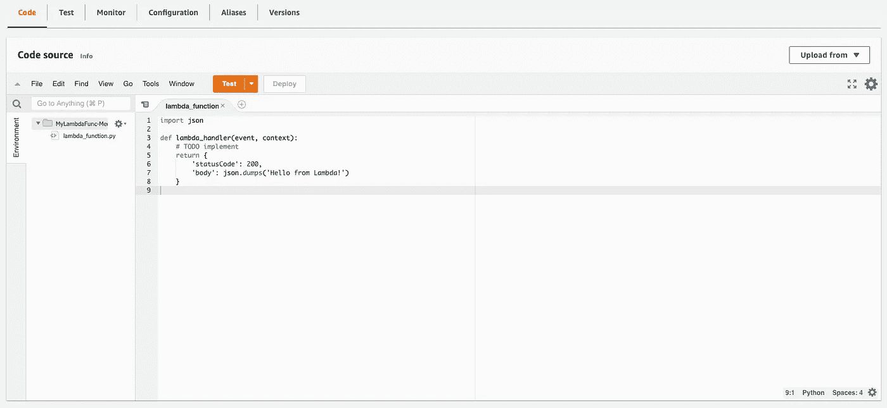

Lambda 功能代码。图片由作者提供。

现在，让我们编辑 lambda 函数。下面是一个从事件 JSON 输入中提取名字和姓氏的函数。然后返回一个上下文字典。body 键存储 JSON，这是一个问候字符串。

编辑并保存 *lambda_function* 之后，让我们继续前进到 **Test** 选项卡并创建一个事件。


测试 Lambda 函数。图片由作者提供。

以下是我们部署并运行测试后的执行结果:

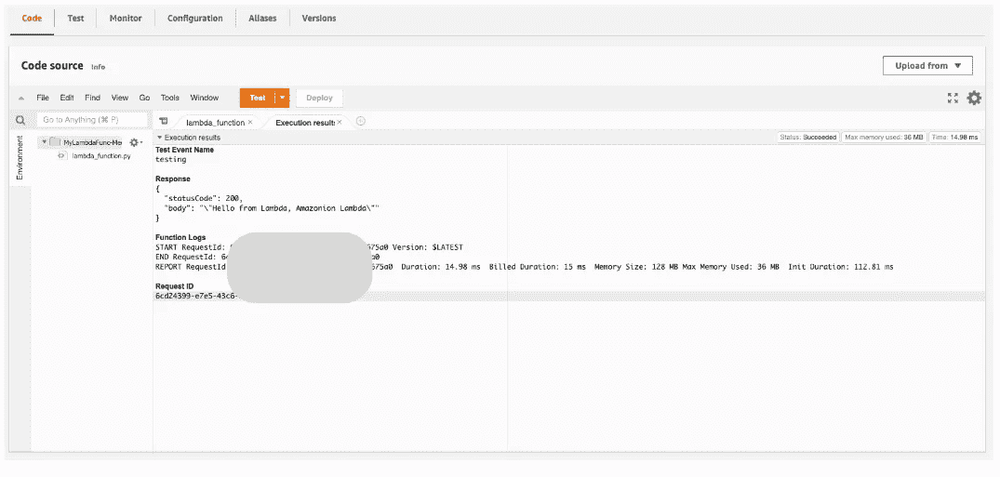

图片由作者提供。

执行结果包含以下元素:

*   测试事件名称
*   反应
*   功能日志
*   请求 ID

# 步骤 3— *将 Lambda 函数连接到 Web 应用程序*

在这一步中，我们将把无服务器 lambda 函数部署到我们的 web 应用程序中。我们将使用 API Gateway 来创建一个 REST API，它将允许我们从 web 浏览器发出请求。API Gateway service，从它的名字我们就能理解，就像是一座桥梁，连接着应用的后端和前端。

> REST:表象状态转移。
> 
> API:应用编程接口。

让我们抓紧时间，从 AWS 控制台打开 API 网关服务，然后创建一个新的 REST API。

API 网关服务主页:

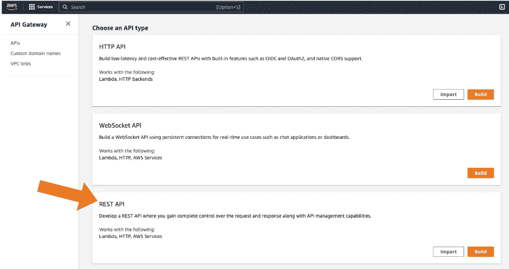

图片由作者提供。

API 创建页面，我们为 REST API 命名、选择协议类型和端点类型。

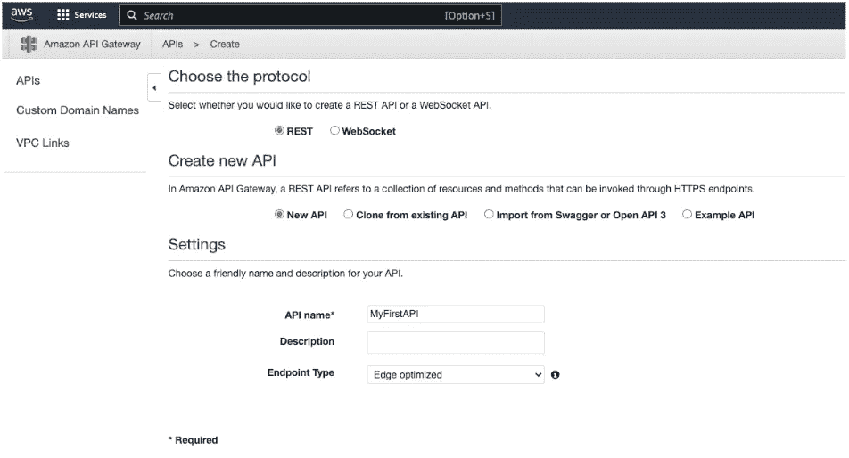

创建 API 页面。图片由作者提供。

在下一页中，我们从**动作**按钮创建一个 POST 方法。集成类型将是 lambda 函数，并确保**区域**与您用来创建 lambda 函数的区域相同。

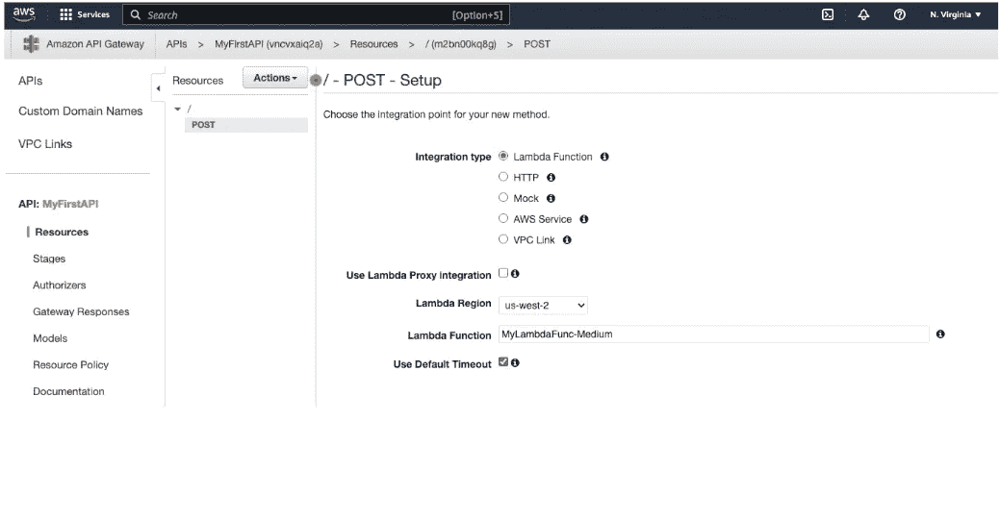

新的 API 方法设置。图片由作者提供。

接下来，我们将启用 CORS，它代表*跨源资源共享*。这是一个 HTTP 头。然后单击启用 CORS 并替换现有的 CORS 标题。

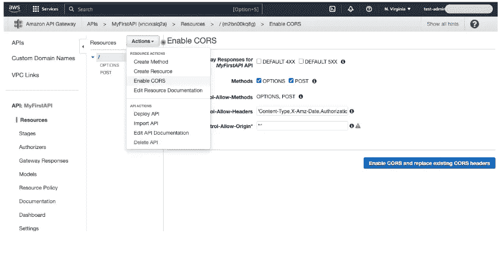

API CORS 设置。图片由作者提供。

启用 CORS 头后，**从 API actions 部署 API** 。

这将创造一个新的舞台；您将在左边栏的**阶段**选项卡下看到它。当您查看 stage 时，顶部会有一个名为 **Invoke URL** 的 URL。请确保复制该 URL 在这个项目的最后一步，我们将使用它来调用我们的 lambda 函数。

是时候测试我们的 REST API 了。

在 **Resources** 选项卡下，点击 POST 后，我们将看到方法执行屏幕。当我们点击我在下面圈出的按钮时，就会出现**测试**页面。

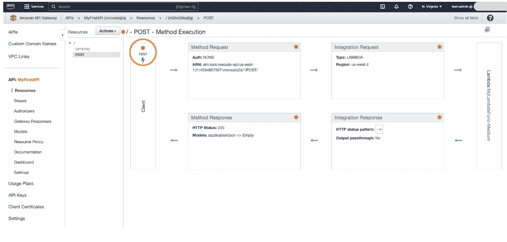

REST API 详细信息。图片由作者提供。

# 步骤 4— *创建一个 DynamoDB 表*

在这一步中，我们将在 Amazon DynamoDB(另一个 AWS 服务)中创建一个数据表。DynamoDB 是一个完全托管的 NoSQL 数据库服务，支持键值数据结构。

DynamoDB 仪表板:

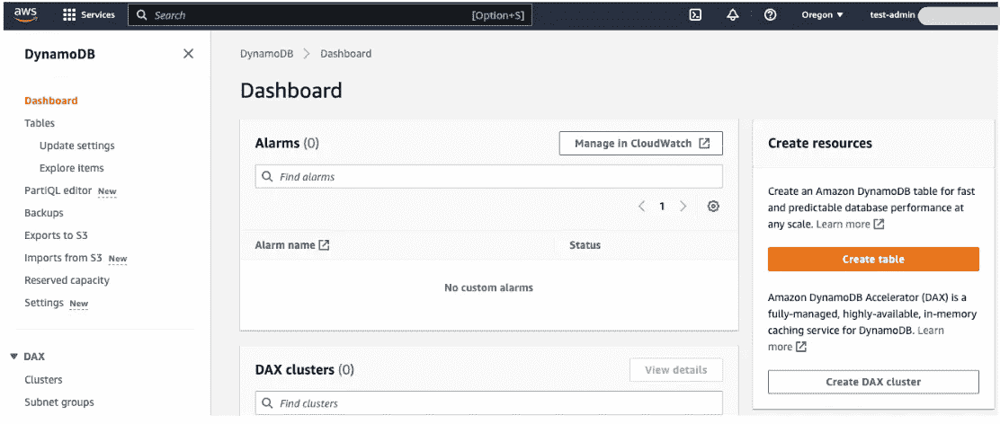

AWS DynamoDB 服务仪表板。图片由作者提供。

让我们点击**创建表格**并填写一些关于我们数据表的信息:

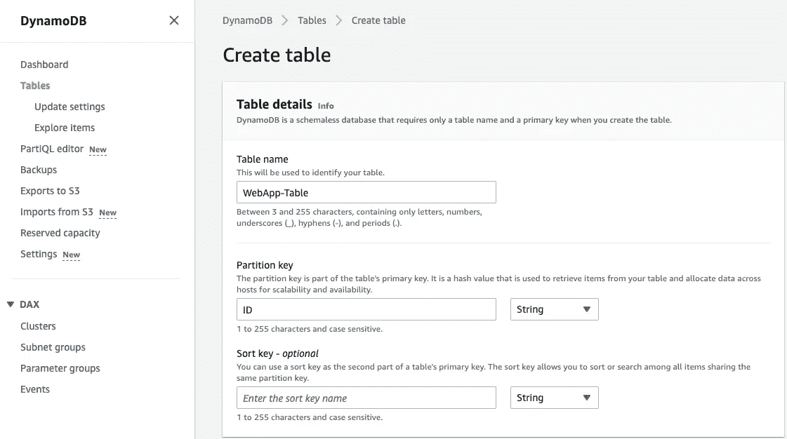

创建新的 DynamoDB 表。图片由作者提供。

然后，让我们查看表的细节并复制 ARN，它代表*亚马逊资源名称:*

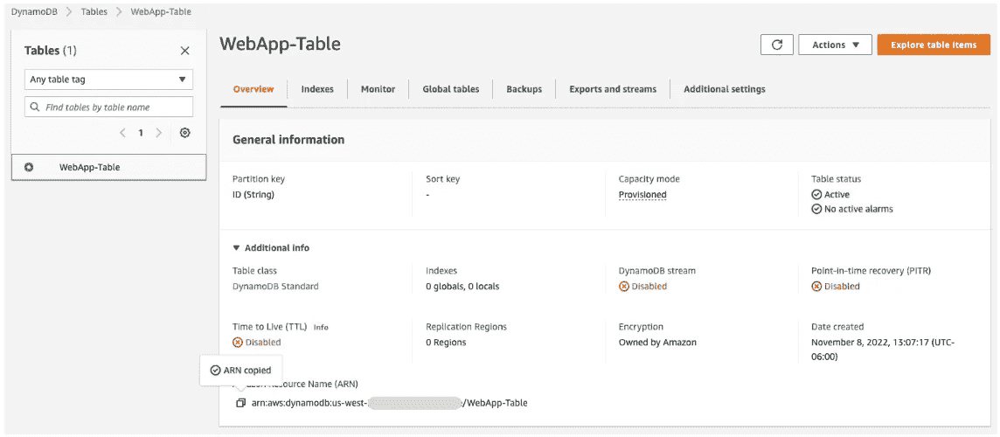

web app-表格附加信息。图片由作者提供。

在下一步创建 IAM 访问策略时，我们将使用 ARN。

# 步骤 5-IAM 策略和权限

> IAM:身份和访问管理

我知道你在想什么。政策是一个无聊的话题，我也有这种感觉——直到我意识到政策在保护我们的安全方面起着至关重要的作用。AWS 推荐最小特权访问模型，这意味着不给用户超过需要的访问权限。同样的规则也适用于 AWS 服务。

例如，即使对于这个简单的 web 应用程序项目，我们也已经开发了多个 AWS 服务:Amplify、Lambda、DynamoDB 和 API Gateway。了解他们如何相互交流以及他们共享何种信息至关重要。如果您想了解这方面的更多信息，这里的[是涵盖 IAM 中的策略和权限的官方文档部分。](https://docs.aws.amazon.com/IAM/latest/UserGuide/access_policies.html)

回到我们的项目。

我们将在这里定义的策略将允许访问我们的 lambda 函数来写/更新我们使用 DynamoDB 创建的数据表。

我们去 AWS Lambda 控制台。选择λ函数。然后，我们转到“配置”选项卡，我们将看到“执行”角色。点击链接，这将带我们到该功能的配置设置。

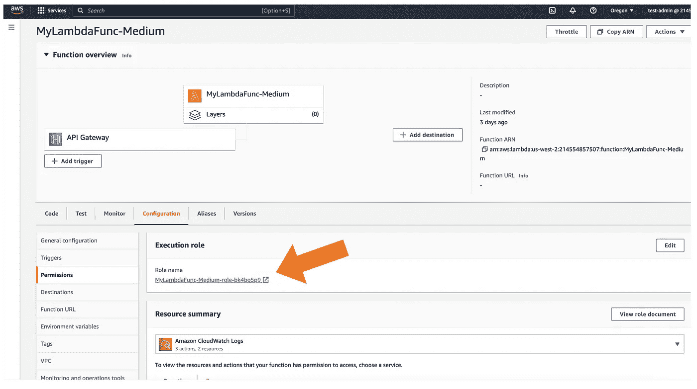

Lambda 功能配置。图片由作者提供。

从权限策略中，我们创建一个新的内联策略。

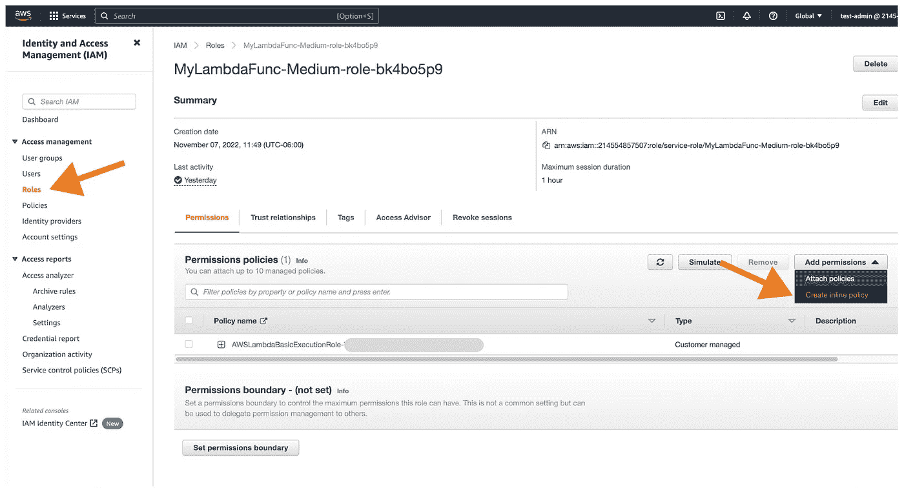

Lambda 函数 IAM 策略。图片由作者提供。

然后，让我们将下面的代码添加到 JSON 部分。

```
{
"Version": "2022-11-10",
"Statement": [
    {
        "Sid": "VisualEditor0",
        "Effect": "Allow",
        "Action": [
            "dynamodb:PutItem",
            "dynamodb:DeleteItem",
            "dynamodb:GetItem",
            "dynamodb:Scan",
            "dynamodb:Query",
            "dynamodb:UpdateItem"
        ],
        "Resource": "YOUR-DB-TABLE-ARN"
    }
    ]
}
```

这个策略将允许我们的 Lambda 函数从 DynamoDB 数据表中读取、编辑、删除和更新项目。

最后，我们将更新 lambda 函数 python 代码。在主页上，我们可以在“配置”选项卡中找到“执行”角色。

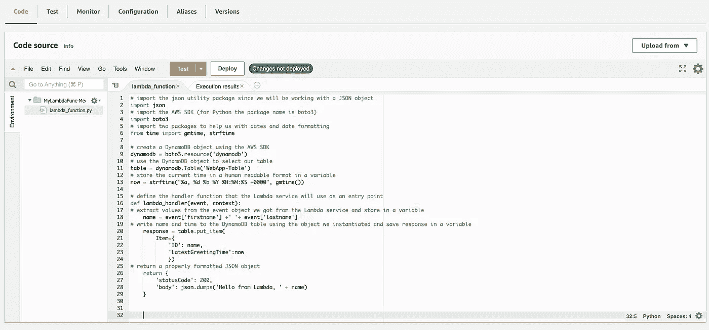

拉姆达代码。图片由作者提供。

下面是函数内部的 Python 代码:

响应采用 REST API 格式。完成更改后，确保部署代码。部署完成后，我们可以从橙色的测试按钮**测试**程序。

我们可以检查 DynamoDB 的结果。当我们运行该函数时，它已经更新了我们的数据表。当我们去 AWS DynamoDB，选择你的桌子，点击左边导航栏的**探索项目**。下面是 lambda 函数返回的对象:

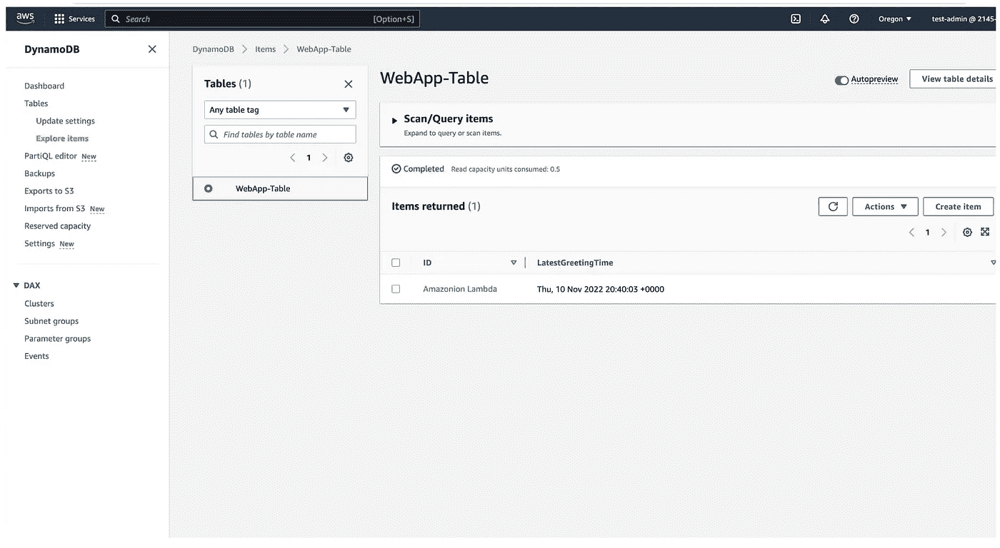

web app-表格。图片由作者提供。

# 最后一步— *测试 Web 应用程序*

恭喜你走到这一步！

在这最后一步中，我们将看到我们刚刚构建的一切都在运行。我们将更新前端，以便能够在 lambda 函数的帮助下调用 REST API 并接收数据。

首先，让我们在代码编辑器中打开一个新文件，并添加以下代码行(我将其保存为 index.html):

在保存之前，请确保更新 api 键文本。您可以在 REST API 细节下的 API 网关服务中找到它，称为 invoke URL。代码在第 34 行，这里我们用 requestOptions 变量获取 URL 链接。

当代码全部设置好后，我们将把它导出为一个压缩文件，就像步骤 1 中一样。然后，使用控制台将文件上传到 AWS Amplify。

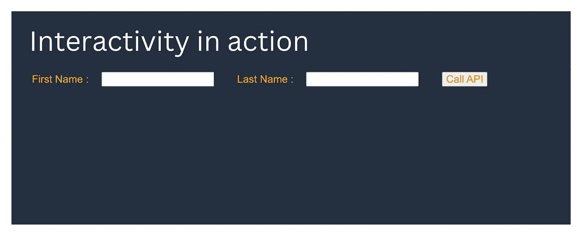

用户界面。图片由作者提供。

我们的数据表接收带有输入数据的 post 请求。当点击“**调用 API** 按钮时，lambda 函数调用 API。然后使用 javascript，我们将 JSON 格式的数据发送给 API。你可以在 callAPI 函数下找到这些步骤。

您可以在下面的“我的数据表”中找到返回的项目:


web app-表返回的项目。图片由作者提供。

## 结论

恭喜你。我们已经使用 AWS 云平台创建了一个简单的 web 应用程序。云计算像滚雪球一样越来越成为开发新软件和技术的一部分。[这里的](https://builtin.com/data-science/cloud-computing-platforms)是一篇我与认证项目分享顶级云计算平台的文章。如果你今天能从这篇文章中学到一些新东西，我会很高兴。

从事动手编程项目是提高技能的最佳方式。如果你对这个项目有任何问题或反馈，请随时联系我。我会尽我所能给你回信。

> 我是[贝希克·居文](https://lifexplorer.medium.com/membership)，我喜欢分享关于编程、教育和生活的故事。 [**订阅**](https://sonsuzdesignblog.ck.page/4226a8782a) 给我的时事通讯留下灵感。泰，

如果你想知道我写的是什么样的文章，这里有一些:

*   [使用 Python 构建人脸识别器](/building-a-face-recognizer-in-python-7fd6630c6340)
*   [使用 Python 构建语音情感识别器](/building-a-speech-emotion-recognizer-using-python-4c1c7c89d713)
*   [使用 Python 进行实时语音识别](https://medium.com/towards-data-science/speech-recognition-in-real-time-using-python-fbbd62e6ff9d)