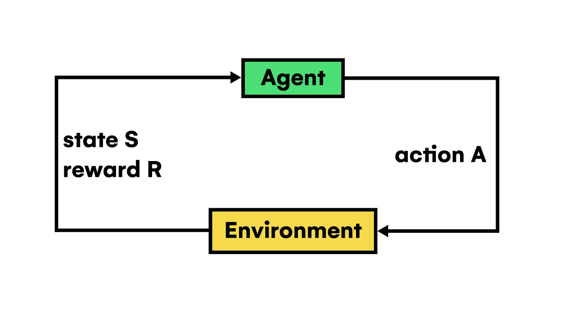
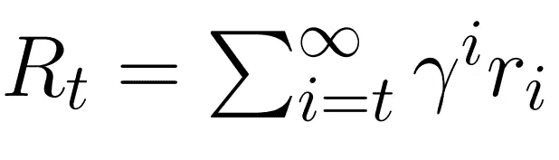
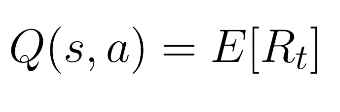
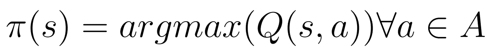
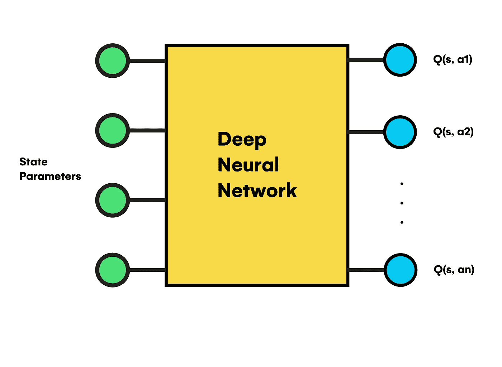
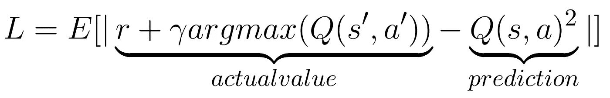
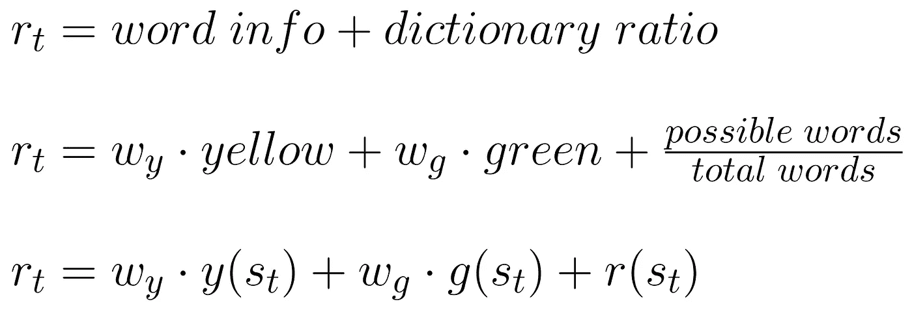
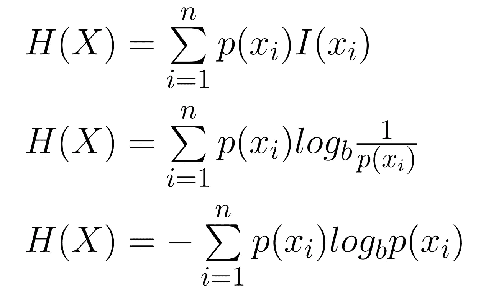
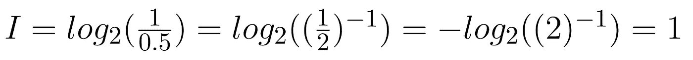
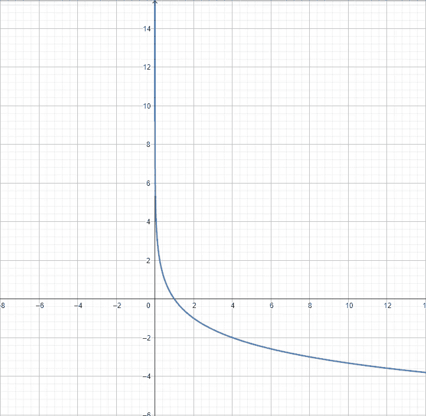

# 用 Java 构建智能 Wordle 求解器

> 原文：<https://towardsdatascience.com/building-a-smart-wordle-solver-with-java-cb734d4a9635>

## 一种高效求解单词的高级字符串处理策略

布雷特·乔丹在 [Unsplash](https://unsplash.com?utm_source=medium&utm_medium=referral) 上的照片

## 介绍

Wordle 是 Josh Wardle 最近在 2021 年 10 月创作的视频游戏，用户有六次机会猜测一个通常每天都在变化的单词。在每一次尝试中，你可以输入一个单词，然后以颜色编码的形式接收来自程序的反馈。

这种格式为单词 try 中的每个字符指定三种颜色中的一种。从左到右，如果该字母不包含在您要预测的单词中，它将是**灰色**色。另一方面，如果它包含在内但放置错误，它将显示为**黄色**色。此外，如果你正确预测了它在单词中的位置，那么**绿色**将用于相应的角色，你肯定会知道它在游戏剩余部分的价值。

在出现几个字母的情况下，程序的逻辑会在分析其余字母之前，先分析从左侧开始遍历的第一个字母。这意味着如果你要猜的单词有两个 **E** 字符，而你输入的另一个单词包含两个放错位置的 **E，**它们都将是黄色。相反，如果你输入一个单词有三个放错位置的 ***E，*** 前两个会直接被认为是定位错误，颜色为黄色。但是，最后一次出现被视为单词“中的一个*”字符，以灰色显示。*

作为一个主要要求，所有单词必须是五个字母长，才能正确地玩游戏。此外，用户在猜测单词时的所有尝试都必须按照母语使用者的数量列在相应语言(通常是英语或西班牙语)的词典中。虽然没有什么可以阻止任何其他语言被用于 Wordle，但是你可以找到各种各样的版本，从德语到汉语。

然而，如果你之前已经玩过一个单词游戏，你可能会想知道在猜正确的单词时应该遵循什么样的策略。从计算每个字符的出现频率并首先取出最相关的单词到使用**数据科学**或先进的**机器学习**技术，任何选择自动*(或不自动)*产生适当的提示并最大限度地减少完成游戏的必要尝试被证明在处理这个问题时是有帮助的。

最后，在解释破解 Wordle 游戏的几个程序的内部工作原理之前，至少了解一下本文中使用的编程语言的基础知识是很方便的，这些语言主要是 **Java** 和 **Python。**因此，如果您正在开始这一领域的学习过程，并且正在为下面显示的任何步骤而奋斗，因为我们将涉及一些高级主题，如**正则表达式**或**多线程**，您可以随时访问在线免费学习资源，如[***freeCodeCamp***](https://www.youtube.com/@freecodecamp)*或*[***stack overflow***](https://stackoverflow.com/)**

## **目标**

**本文旨在解释一个算法的 Java 实现，该算法以一种*“智能”*的方式玩文字游戏。也就是说，它必须遵循一种策略，以尽可能少的步骤到达我们想要猜测的单词。此外，我们将通过优化正常运行所需的硬件资源来提高其效率。**

# **选择核心技术**

**数据是一种重要的工具，如果我们能够从中提取知识，它在处理类似的自然问题时会特别有用。然而，并不是所有我们处理的数据都会简化我们的工作。例如，在缺失条目的数据集中，大小、格式和维度可能会增加我们思考问题的复杂性。因此，我们必须考虑前面的概念来理解每种选择的基本原理、优点和缺点。**

## **通用过程**

**如果我们分析 Wordle 的基数和每场比赛的结果情况，我们会发现在我们可以使用的所有策略中存在一个共同的过程，它专注于在下一次迭代中缩小所有可能单词的集合。**

**一开始，我们将集合称为***【D】****(对于字典)* 包含特定语言的所有现有的五个字母的单词。因此，每当用户抛出一个新的猜测并收到相应的颜色代码时，我们必须使用程序的响应来丢弃字典中那些不满足先前尝试要求的条目。因此，如果确定这个单词在给定的位置有一个特定的字符，或者有一个字母肯定不在我们要寻找的单词中，我们的程序需要使用这些信息从 ***D*** 集合中选择正确的单词，同时最小化每次游戏的可能性。**

****

**作者图片**

**例如，在上面的游戏中， ***D*** 集合包含大约 10k 个单词，这意味着它们中的每一个都可以是我们想要遇到的隐藏单词。在用户输入第一个猜测 ***【治愈】，*** 之后，根据满足以下条件的单词的数量，集合长度减少到小于其先前大小的一半:*以 H 开始，在位置 1、3 或 4 (0 索引)包含字母 A，并且其中没有 E、L 或 S。*第二次输入后， ***【匆匆】，*** 集合再次收缩新的条件:*以 Y 字符结尾，不包含 U 或 r。***

**有了最初的想法，我们现在可以开始建模一个完整的策略，稍后用 Java 实现。然而，由于我们可以有各种各样的技术可用于算法的改进和优化，因此值得考虑不同的备选方案并分析每一种方案以获得高质量的结果。**

## **随机猜测**

**我们能想出的第一个策略就是所谓的 ***随机猜测。*** 这是程序化解决一个 Wordle 游戏时最简单直观的方法之一，也是全球大多数玩家最*【无意识】*使用的方法。**

**顾名思义，该方法包括每次迭代从集合***【D】***中随机选择一个单词，假设该单词完全由提供新信息的单词组成，即，它考虑目标单词中存在或不存在的字符，包括它们在目标单词中的出现和位置。乍一看，这似乎既不是一个复杂的算法实现，也不是不正确的。但是，我们可以做得更好！**

*****随机猜测*** 的主要缺点是，我们没有探索每个单词与字典中其他可能性之间的关系，因此在每个游戏步骤中，除了已经在 ***D*** 集合中定义的标准之外，在没有任何总体标准的情况下选择任意一个单词。因此，这种操作原理可能会导致算法部署的性能不佳。尽管如此，它的简单性使它在执行成本方面成为一个高效的选择，因为除了验证之外，它不会对每个单词执行繁重的计算。**

## **机器学习**

**我们可以用来解决单词的第二个策略主要继承自机器学习技术，这些技术在过去几年中获得了显著的认可，并且其在各种领域中的应用也增加到了相同的程度。**

**在更进一步之前，我们必须注意到 ***机器学习*** 本身并不是一个你可以应用于任何问题的统一或通用的工具。实际上，它有相当多的专门分支，在这些分支中，不同的*类问题以一种确定的方式得到处理，从计算机视觉、序列预测，或者更一般的主题如*，到 ***自然语言处理。机器学习的每个子集都是为了正确有效地解决特定的任务，即使它可能会像 GPT-3 那样扩大规模。在这种背景下，我们需要考虑的研究领域就是 ***强化学习。**********

## *强化学习*

*你可能听说过最近在游戏自动化方面的非凡进步，它们比世界上最好的玩家玩得都好。从古代的棋类游戏到现代的新游戏，在这些游戏中，一个“人工智能”被电脑控制，扮演敌人的角色。前面提到的所有例子都有相同的基本原理；*

**

*作者图片*

*在 ***强化学习中，*** 我们能创造的每一个“智能”系统都是从上述方案中构建出来的。如你所见，它由两个主要组件组成，分别表示为 ***、代理*** 和 ***、环境*** *(游戏世界)*。第一个是驻留在游戏世界中的玩家，名称*“代理人”*来自于它与环境的交互。详细地说，一个代理有一组它一次可以执行的特定动作*【它们可以是离散的，如国际象棋位置，也可以是连续的，如机器人手臂的移动。**

**允许代理学习如何在环境中选择正确行动的关键概念是它在做出决定*(执行行动)*后收到的 ***奖励*** 。如果它是正的，它将 ***加强*** 代理在未来状态做出类似的决定。相反，如果它是否定的，它将代表对采取行动的惩罚，代理将学会在未来不采取类似的行动。使用这些工具，如果我们希望代理学习如何玩游戏，我们将必须建立一套完整的动作，并在它执行正确的决策时分配正确的奖励，即，为代理设置一个目标，使其能够在训练过程后学习并赢得游戏。**

****

**作者图片**

**在向上的表达式中，你有了我们想要最大化***【R】***的总代理报酬的一般计算方式。在求和记数法中，它表示在时间(r)内每个状态所有生成的奖励 ***的总和。*** 此外，引入一个折扣因子 ***γ*** 来正式避免 ***R*** 在报酬增长到无穷大时变得非常关键。在游戏中，我们实际上是在控制代理人的短期和长期报酬有多高。这不是奖励带来的唯一问题，因为它是强化学习问题中最具挑战性的任务之一。如果您想了解更多关于这些问题的信息，请访问以下详细的 [***文章***](/how-learning-reward-functions-can-go-wrong-6e794e42f4fc) 。**

## **培训过程**

**在讨论代理的学习过程之前，有必要定义几个与它在每个状态下做出决策时所遵循的标准相关的概念。**

**一方面，代理人需要有一个工具在特定的状态下及时做出决策 ***(s)。*** 形式上，这可以通过创建一个函数来计算在时间上紧接的下一个环境状态中的总代理报酬的预期值来实现，已经采取了一个动作 ***(a)。*** 简言之，它代表了*状态下可能采取的动作 ***(s)。*** 由此，如果有一个动作能够对奖励值做出正贡献，那么它将比代理的动作集中的其他动作具有更高的质量值。***

****

**作者图片**

**另一方面，如果我们希望代理在每个状态下选择并执行一个动作，我们必须使用*(或不)*Q 函数来塑造内核代理的标准，策略函数 ***π(s)。*** 简而言之，策略以一个状态作为输入参数，返回该状态内质量值最大的动作。**

****

**作者图片**

**最后，我们有培训代理的基本要素。现在剩下的唯一任务是找到一种算法来*“教导”*代理。**

**在这个阶段，强化学习提供了许多可遵循的途径，所有这些途径对于训练不同类型的代理都是有价值的。然而，我们的情况可能需要两个选项之一；一个影评人 ***马氏决策过程*** 让代理人*探索 ***环境或一个价值学习*** 方法。这里我们只讨论 ***值学习*** ，因为它们是广义的算法。***

****

**作者图片**

**如前图所示， ***值学习*** 依赖于 ***深度神经网络*** ，该网络将完全定义给定状态 s 的参数作为输入，并输出代理在这种状态下可以采取的所有可能行动的质量值。因此，将质量作为推理的输出，代理可以选择获得的最大值并执行相关的动作。但是，为了找到网络内部的最佳权重和偏差值，我们可以使用传统方法，如 ***、反向传播、随机梯度下降、*** 和损失函数，如 ***均方误差*** ，在这种情况下，损失函数将正式表示如下:**

****

**作者图片**

**如果你进一步研究网络优化过程的内部细节，你会发现总体目标是最小化损失函数，在这种情况下，通过使用均方差内的预测和实际质量项之间的 ***差*** 。**

**前面提到的方法只是我们可以在我们的例子中使用的一个例子，但它不是唯一的方法。强化学习是一个广阔的领域，有如此多的选项值得研究，从 ***汉密尔顿-雅可比-贝尔曼*** 方程到 ***萨尔萨*** *(状态-行动-奖励-状态-行动)*算法。因此，您可以为这个 Wordle 项目探索不同的替代方案及其各自的结果。**

**尽管如此，总结一下我们可以实现的算法，为代理和环境提供一个好的定义是很关键的:**

****1-环境:**由游戏机制定义，每个状态对应于代理输入的猜测。此外，它必须为每个状态生成正确的输出颜色代码。**

****2-奖励:**在训练过程之前，代理需要一个适当的奖励系统引导我们的目标，在这种情况下，猜测隐藏的单词。**

****

**作者图片**

**如上所述，体面的奖励将基于放置在正确位置的字符数*(黄色和绿色)，*字典长度的递减比率，以及通过完成游戏达到最终目标。**

****3-Agent:** 它是我们潜在解决方案的精髓，负责通过处理程序的反馈来做出最佳猜测*(动作)*。为了训练和塑造它的行为以用于以后的推断，最好的选择是使用神经网络算法来模拟 Q 函数值模式。**

## **信息论**

**最后，最终 Java 实现背后的算法是建立在与 ***信息论*** 相关的概念之上的，因为几个实验已经证明它是高度优化的。如果您想了解关于强化学习、随机猜测或其他基于属性的角色策略为何不能以最高效率工作的更多信息和细节，请访问以下资源:**

**现在，让我们解释构建算法所需的基础知识。**

*****信息论*** 是数学知识的一个分支，专门研究作为理论概念的信息，特别是当它被传递、存储或测量时。因此，该理论的用例在涉及信息处理的任何领域都很广泛，如量子计算、统计学，甚至神经学。这一领域的领军人物是 [***克劳德·香农***](https://es.wikipedia.org/wiki/Claude_Shannon) ，其创始人在 20 世纪。他在电子工程和密码学方面取得了有价值的进展，但毫无疑问，他对计算机科学早期阶段的贡献是超越性的。由于这项工作，他开始被公认为信息时代之父。**

**所以，如果我们思考信息的概念以及试图*【测量】*它所产生的可能性，我们就会认识到，设想一个代表已知环境或系统中信息量的量级的最合适的方式是由我们自己的*香农开发的，被称为 ***【熵】*** 。***

****

**作者图片**

**上面的表达式模拟了一个确定的随机变量***【x】，*** 的熵，但是为了正确理解所涉及的基础数学，当应用该公式时，我们需要可视化我们正在做的事情。**

**例如，想象你正在玩一个彩票游戏，有 100 分之一的中奖机会。如果你突然好奇*(假设你能找到答案)* : *“中奖号码是不是小于 50？”；*您将通过因子 ***0.5*** 来缩小包含您可以为游戏选择的可能中奖号码的集合，并且您将从您的问题*(观察)*中获得 1 位信息，因为 log2(1/0.5)=-log2(1/2)=1。**

****

**作者图片**

**因此，类似于 [***二分搜索法算法***](https://en.wikipedia.org/wiki/Binary_search_algorithm) ***，*** 在这种情况下，您将需要 log2(100)个观测值来达到获胜数。可以推断，用来量化信息的单位*(基数 2)* 是 ***位，*** 也表示为 ***香农单位。*****

****

**作者图片**

**这就是为什么公式中有对数的原因，根据问题的不同，对数可以在任何底数。从视觉上看，负对数将更高的信息值与最接近 0 的概率相关联。因此，观察后的可能性集合中包含的元素越少，观察中获得的信息就越多。**

> **注意，对数自动抛出 0 作为确定性事件的信息值，因为不存在不确定性。**

**最后，熵公式将这个负对数乘以概率，作为权重，并将原始集合中所有可能的概率值加在一起，在前面的示例中，原始集合包含 100 个元素。**

**在 Wordle 游戏的情况下，我们将使用有 7980 个初始单词的西班牙语词典。在开始和每次输入新单词时，我们会使用熵公式计算字典中每个单词潜在提供的信息，并选择具有最大**值**的那个。然后，由于这是我们的一组可能性，我们的算法必须在未来的游戏迭代中使用程序的反馈来丢弃不可能的单词，缩小集合，直到找到隐藏的单词，游戏获胜。**

**要了解他的策略的更多细节，您可以访问原始的 ***3blue1brown*** 指南:**

**还有，如果你对信息论和底层数学很好奇，可以使用下面的 [***资源***](https://youtu.be/bkLHszLlH34) ***。*****

# **Java 实现**

**在下一节中，我们将在 Java 上实现前面描述的策略，并做一些实质性的修改，为用户带来更好的可玩性和交互性。但首先，让我们简要总结一下我们的程序将遵循的整个算法。**

1.  **用所有可能的单词初始化字典，并计算它们的分数。由于我们将使用西班牙语，它最初将包含 7980 个单词。**
2.  **为程序提供六次机会来猜测玩家正在想的单词。然而，这次输入的不是一个单词，而是游戏本身在最初版本中应该给出的反馈。因此，玩家不是插入颜色代码，而是输入一系列字符，其中 0 代表相应字符的灰色，1 代表黄色，2 代表绿色。**
3.  **挑选具有最大分值的单词并显示给用户。**
4.  **等待并验证他的字符序列。如果不一致，请再试一次并显示一条错误消息。**
5.  **使用正则表达式来检查程序是否猜中了正确的单词并赢得了游戏。**
6.  **如果程序没有猜出这个单词，它将在未来的迭代中更新字典以丢弃不可能的单词，并重新计算得分值。**
7.  **如果程序用完了尝试次数，它将*“输掉”游戏并停止执行，除非用户想再玩一次。***

## ***词典创作***

***如前所述，我们需要一组五个字母长的西班牙语单词来开始编码和测试我们的程序。我们可以从网上下载一个，但是相反，我们将使用 ***Python*** 来自动化创建过程，增加我们对结果的控制。***

**正如你在上面所看到的，我们可以受益于 Python 带来的众多优势，比如用于执行拼写检查的 ***enchant*** ，用于组合计算的 ***itertools*** ，或者主要用于从字符串 ***中删除重音的*。******

**简而言之，代码计算字母表的所有可能排列和正确的西班牙语重音元音*(长度为 5)* 。然后，它使用 ***enchant*** 模块只过滤那些在官方西班牙语词典[***RAE***](https://www.rae.es/)上注册的排列。**

> **如果你想可视化生成的一组单词，你可以在 [***Github***](https://github.com/cardstdani/practica-java/blob/main/Data/Diccionario.txt) 上访问上传的文件。**

**此外，即使现在看起来没有必要，我们也可以计算用户在每次迭代中可能提交的所有可能的输入。因此，通过再次使用 ***itertools*** ，在两行代码中，我们生成了一个由 0、1 和 2 组成的 5 字符长字符串的列表。**

**最后，使用 ***replace()*** 函数，我们实现了想要的 2D 数组格式，这将有助于后续的 Java 实现。**

## **主要方法**

**在解释主要的方法功能之前，我们必须导入一些 ***数据结构*** 所需的库以及整个程序中使用的技术。**

**使用 ***import*** 关键字，我们的程序实现了各种实用程序来执行输入/输出操作，从 ***URL 读取数据，*** 添加多线程支持，或者高效地遍历大型线性数据结构。**

**然后，在定义了适当的常数来提高代码性能和可读性之后，我们就可以在 main 方法上实现算法的大部分步骤了。**

**解决方案的内核在上面的 main 方法中进行了编码。首先，定义一个 ***扫描仪*** 来捕捉用户输入。然后，一旦一切都准备好运行，do-while 循环控制玩家是否想再玩一次。在循环内部，我们创建字典并将其存储在一个***linked hashmap***数据结构中，该数据结构利用 ***Map*** Java 接口和 ***LinkedList*** 在检索和检查字典中是否存在元素时提供一个*常数时间复杂度*。此外，我们通过为其元素评分来设置用户交互。**

**一旦完成，我们就执行一个考虑到尝试次数常量的 for 循环，该循环执行与用户输入验证、随后的字典更新以及检查用户是否成功相关的所有过程。**

**上面两个函数也是主要方法功能的一部分，它们管理输入格式转换和从 ***URL*** 创建字典。**

**第一个返回一个 ***LinkedHashMap*** 数据结构，其中包含字典应该包含的所有初始单词，它们各自的分值在开始时为零。因此，根据 txt 文件格式，它使用 ***split()*** 函数按空格分隔单词并构建相应的输出。**

**同时，***stringpointarray()***函数解析用户输入的字符，并将其转换成其他代码段所需的格式。它还做一些验证工作，确保输入具有期望的长度，并且没有输入不支持的字符。**

## **生成正则表达式模式**

**一旦我们实现了整个算法的逻辑，就该定义负责处理输入和输出文本的其余函数了。为此，我们依赖于基于正则表达式的解决方案 *(Regex)* ，因为除了每个单词中出现的字符之外，这是建模每个字符的正确或错误位置的最紧凑和可靠的方法。**

**为了理解我们的程序将如何检测一个单词在特定条件下是否可以形成，或者如何处理输入验证，有必要了解在***generate pattern()***函数中使用的基本[***Regex***](https://youtu.be/528Jc3q86F8)模式和特性。**

*****正则表达式*** 是表示文本内部 ***模式*** 的字符序列。例如，如果您想要验证用户是否以正确的格式正确地书写了电话号码、日期或电子邮件，您可以将该格式编码为正则表达式模式，并将其与用户输入进行匹配。因此，如果有匹配，输入就被成功验证，这意味着用户没有拼错任何字符，也没有输入程序要求之外的任何内容。那些 ***Regex*** 模式通常被认为是使用紧凑的符号来搜索和替换大文本中的内容，但是在我们的例子中，我们寻求验证和编码 Wordle 规则。因此，要将游戏规则转换成有效的正则表达式模式，我们必须尽可能简化 Wordle 使用的颜色编码*(用户输入)*。**

**当该函数遍历输入序列并处理每个字符时，它会将四个可能的正则表达式中的一个附加到结果模式中，具体取决于出现的次数以及所分析单词中的相应值:**

*   *****“(？=[^%s]*$)":*** 如果选择的输入字符是 0，则表示该单词的对应字母不应该出现在目标单词中。**
*   *****【(？！。{%s}%s)":*** 如果所选字符为 0，并且在输出中没有出现值为 2 的相同字符，则单词字母不能出现在目标单词中。**
*   *****”(？！。{%s}%s)(？=.*%s)":*** 这种模式模拟了 Wordle *(本版本中的数字 1)*中的黄色，确保特定字符在单词的任何位置至少出现一次，除了它所在的位置。**
*   *****【(？=.{%s}%s)":*** 最后，最简单的情况是在单词*(数字 2)* 上找到一个绿色字符，因为表达式只需要保证出现位置上的特定字符。**

**在设置了***generate pattern()***函数后，我们现在可以通过之前生成的模式和上面显示的函数来验证用户的输入，如果用户试图作弊或输入不一致的序列，程序将能够做出反应。**

## **得分单词**

**最后，在用户输入处理之后要实现的唯一剩余元素是字典刷新部分，其中每个游戏迭代负责根据先前生成的 ***正则表达式*** 模式丢弃单词。**

**因此， ***updateDict()*** 采用当前的***LinkedHashSet***字典以及与用户对该迭代的反馈相关联的正则表达式，并返回包含用熵公式评估的所有条目的新数据结构。此外，为了提高代码性能，我们可以使用 ***多线程*** 来计算每个单词的分数，因为这是一个计算开销很大的操作。**

**由于我们是在 Java 中，*是使用 ***可调用*** 接口实现的，允许我们异步执行不同的任务，充分利用并发编程的优势。在这个程序中，我们将 de dictionary 分成多个块，并将***【score function()***执行到一个名为***parallelmapupdate、*** 的新类中，这个新类是*从 Callable 接口“继承”过来的，从而将整个 dictionary 的评分任务并行化。****

***然后，每个 ***线程*** 任务返回一个 LinkedHashSet 与字典的某一部分，在结束 ***updateDict()*** 执行之前必须连接。***

**现在，您可以使用一个定制的启动字典运行 Java 程序来测试结果。标准版包含的字数很少，适用于 CPU 中 ***核*** 很少的低端 PC。但是，您可以用任何语言或长度的自定义字典来替换字典，以分析程序并试验您自己的算法变体。**

**可以找到完整的 ***。java*** 文件和包含所有 Python 代码的 Colab 笔记本放在下面的 ***GitHub*** 资源库中:**

** [## GitHub-cardstani/practica-Java

### 此时您不能执行该操作。您已使用另一个标签页或窗口登录。您已在另一个选项卡中注销，或者…

github.com](https://github.com/cardstdani/practica-java)**