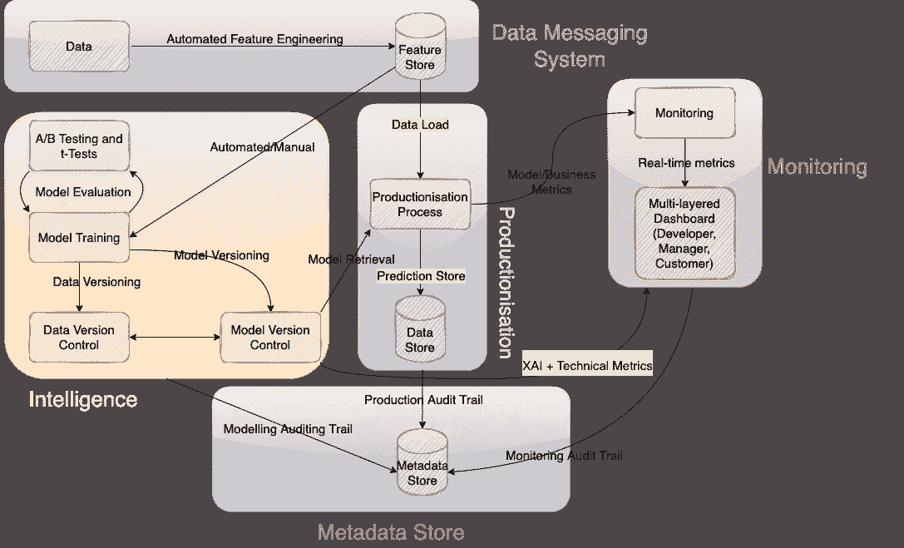

# 构建最先进的数据科学平台

> 原文：<https://towardsdatascience.com/building-a-state-of-the-art-data-science-platform-c4171286289d>

## 数据科学|工程|平台

## 规划强大的数据科学架构的构建模块

[万花筒](https://unsplash.com/@kaleidico?utm_source=medium&utm_medium=referral)在 [Unsplash](https://unsplash.com?utm_source=medium&utm_medium=referral) 上拍摄的照片

在现实世界中，数据科学流程超出了处理某些数据和训练预测模型的步骤。在生产系统中，数据科学过程对数据和模型交付、审计和准备感兴趣。数据科学是高度精细的，正确掌握数据科学是决定企业数据科学项目能否成功的关键因素。

在本文中，我们将讨论构建一个高效且健壮的 DS 平台所需的不同组件。

# 目标

> 我们为什么需要数据科学平台？
> 
> 我们想从这个平台中得到什么？

企业在数据科学服务方面失败的主要原因与他们无法正确量化其 DS 需求有关。大多数人无法回答*“你为什么需要 DS？”*。

不幸的是，一些企业跳上了当时流行词汇的宣传列车，觉得有必要做数据科学。归根结底，这才是最重要的，不是吗？这有三种主要的可能情况:

*   运气好的话，会产生一个成功的项目
*   惨败

最终经常发生的是无法兑现宣传。因此，未能交付会导致声誉受损，当然，还会损害业务！

现代企业总是有一个数据科学平台的用例。数据是当今世界的关键。毕竟这是世界上最有价值的资产。然而，大多数人没有理解的是数据科学平台和人工智能(AI)平台之间的区别。数据科学超越了人工智能的局限。

数据科学是数据体跳动的心脏。数据科学是任何组织都可以理解其原始数据的媒介。数据科学最简单的形式是一个工具集，用于交付分析智能。

那么，**为什么需要数据科学平台？我们想从这个平台中得到什么？**

很简单，数据科学平台使您能够真正理解您的数据。

我们都经历过身体上的关系，我相信我们所有人都曾一度希望自己知道对方在想什么。作为一个组织，你与你的客户和利益相关者有关系。数据科学就是这么做的！让你知道并理解你的伙伴在想什么。它为你提供了正确的知识来评估什么有效，什么无效。帮助您决定按哪个按钮。

# 组件

在我们深入探讨数据科学平台的制胜之道之前，我想指出两个极其重要的注意事项:

*   **思考未来**
    *与任何技术一样，数据技术在范围和数量上都在快速发展。因此，保持我们对未来可伸缩性机会的选择可能是明智之举。*
*   **思考模块化** *在构建我们的数据科学平台时，我们必须将它视为另一种产品。作为一个组织，你不应该建立一个数据科学平台来简单地帮助你的工作流程。为您的数据科学平台感到骄傲！展示它。推销它。最重要的是，卖掉它！
    是的，你没听错。卖掉它。以这样一种方式构建您的平台，每个组件都是个性化的，可以作为单独的产品出售。该平台的每一个组件都应该能够完美地独立工作，并且能够轻松地与其他解决方案集成。*

因此，让我们开始讨论可靠的数据科学平台的关键组件。

平台组件的数据流图。作者图片

## 组成部分 1:数据信息系统

**第 1 部分:**任何与数据相关的产品都需要从处理数据的传输开始。我们如何将数据放入我们的平台？我们有两个主要选择:

*   实时数据流
*   ETL 或批量加载

我坚信实时数据流是几乎所有场景的必由之路；然而，这在很大程度上依赖于基础设施和用例。如果实时流媒体是你的选择，那么[阿帕奇卡夫卡](https://kafka.apache.org/)就是你的朋友。卡夫卡只是一个简单的信息传递解决方案。还有各种其他的解决方案，比如*亚马逊 Kinesis* 、 *TIBCO Spotfire* 和 *RabbitMQ* 。还是那句话，选你喜欢的毒药。

查看我的另一篇关于使用 Python 处理 Kafka 事件数据流的文章！

</introduction-to-kafka-stream-processing-in-python-e30d34bf3a12>  

**第二部分:**数据存储方面。选择数据库系统在很大程度上取决于以下特征:

*   **速度** —数据传入的速度有多快？
*   **卷** —数据有多大(大小)？
*   多样化—你有多少种不同的数据结构？
*   **延迟** —您希望数据库多快返回结果？

这是一个很大的讨论领域，并且远远超出了本文的目标，所以我不会深入讨论。

**第三部分:**数据处理与特征工程。一旦我们开始获取数据流，我们就可以开始动态处理这些数据。其最终目标是创建特征库(即预先计算的特定特征)。随着机器学习解决方案在数据科学平台中的集成，特征存储变得更加相关。在生产中，任何运行的机器学习模型都会不断地从特征存储中读取以检索它们的数据。

对此有各种解决方案。人们可以使用 Spark 之类的东西开发自己的工具来处理数据流，并将结果存储在数据库对象中(这取决于人们选择的数据库风格)。反过来，人们也可以使用现有的功能商店实现，如[盛宴](https://feast.dev/)、[泰克顿](https://www.tecton.ai/)或[霍普斯沃斯](https://www.hopsworks.ai/)。这里要记住的重要一点是，我们应该始终有一个真实的来源，特别是对于工程特征。

## 组件 2:智能

这个组件是关于建立一个框架，允许自动和手动的机器学习模型训练。所有模型培训流程都应遵循标准模型评估策略(适用于所有模型)，该策略将执行 A/B 测试和统计假设测试，以评估和比较基础模型。

最终模型应通过自动超参数调整进一步优化。在部署到您的生产环境之前，每个模型都应该首先通过这个框架。

适当的模型版本控制在这里也很关键。我们需要能够回答以下问题:

*   现在的模特是什么时候训练出来的？
*   当前模型的性能指标是什么？
*   那一天生产的是哪种型号？

这个任务的一个很棒的工具是 [MLFlow](https://mlflow.org/) 。

在这一点上，我们也应该开始考虑数据版本控制(DVC)——主要是因为同样的原因，你想要版本化你的代码库。

对于 DVC，我们可以:

1.  *作为训练时快照的版本数据(例如 MLFlow 中的工件)，或*
2.  *使用专门的数据版本系统；*

这种方法将允许我们分别对数据和代码进行版本控制(数据的任何变化都会影响代码，但并不是所有的代码变化都会影响数据——所以它们应该是独立的单元)。与功能商店类似，人们可能会选择内部构建 DVC 或通过第三方解决方案。一些例子包括厚皮动物，DVC 和飞机库。

如果对 Hangar 感兴趣，可以随意查看我关于这个纯 Python DVC 实现的另一篇文章。

</introduction-to-data-version-control-5c4a83276b9>  

从长远来看，在我们的数据科学平台中正确实施 DVC 将被证明是非常强大的。特别是有了 MLFlow 这样的工具，我们就可以将 MLFlow 上版本化的训练数据模型绑定到该模型使用的训练数据集(在 DVC 版本化)。这也允许我们对我们的数据进行审计跟踪。尽管如此，模型版本控制和 DVC 都应该与一个*元数据*存储进行通信，以建立一个关于什么、何时以及如何的强大的审计追踪。但稍后会详细介绍。

这个组件的另一个方面是可解释的人工智能(XAI)。建立机器学习模型是一项任务。但是向最终用户提供可解释的预测是另一个层面的任务。现在，有许多 XAI 软件包可以帮助你解释任何机器学习算法的结果。因此，在我们的智能组件中整合这些技术确实有助于将我们的平台提升到一个新的水平。查看我关于这些技术之一的帖子！

</how-to-interpret-any-machine-learning-prediction-64ff43020214>  

这个组件的最后一个功能是模型监控。我们需要一种方法来评估我们的训练模型的性能，并持续监控它们的性能下降。模型监控和评估应分为三种方式:

1.  培训期间的模型评估/基准测试
2.  使用 XAI 和假设分析的模型监控
3.  连续生产监控

## **组件 3:生产化**

我们将我们的模型发布到生产中，供客户使用。这意味着我们的模型根据实时数据进行预测，并将结果传送到各自的目的地。该步骤还应该与元数据存储进行通信，以保持生产化审计跟踪(例如，当一个新模型被推向生产时，简单地保持所做的每一个预测的跟踪记录)。

可以集成到该组件中的另一个有趣机制是反馈环路。反馈回路是一种机制，其中机器学习模型刚刚做出的预测被反馈到相同的所述模型以进行重新训练。如果与可操作的预测相结合，这个方面变得越来越强大。这个反馈循环应该使我们能够尽可能接近实时地评估生产中的模型(取决于手头的任务),并促进向在线学习的过渡。这也将使我们能够在我们的平台中最小化模型衰减和概念漂移的影响。

例如，让我们假设一个预测客户是否会在未来 5 天内流失的数据模型。一旦我们做出预测，我们就可以对该预测进行 5 天的监控，以确定相应的客户实际上是否会流失。然后，该反馈将被反馈到初始模型，以进一步改进和提高性能。

## 组成部分 4:监测和暴露

这是我们可以炫耀我们冷静的观察和洞察力的部分。这是整个平台最重要的部分。这是经营的脸面；客户将直接与之交互和体验的组件。这是我们交付所有成果并密切监控所产生的商业价值的地方。

这是我们戴上创造性帽子的机会。我们需要构建仪表板来全面展示我们产品的功能，并确保客户能够全面、快速地吸收我们的见解。

我们还将能够持续监控当前的车型生产绩效，使我们能够在车型再培训和交付方面采取积极主动的态度。我们还可以采用多层仪表板，为不同类型的用户使用不同的视图。例如，开发者视图将允许我们深入研究特定模型的技术指标，而用户/监管者视图将加载 XAI 仪表板和假设分析。

## 组件 5:***元数据*** 存储

它只是一种让我们对工作流程中发生的事情进行可审计跟踪的方式。在这里，我们可以存储查询、预测和模型训练的审计线索。人们还可以增强*元数据*存储，以包括不同产品的预测跟踪。

# TL；速度三角形定位法(dead reckoning)

本质上，我们的数据科学平台架构应该由 5 个主要组件组成:

1.  ***获取数据
    -*** *实时流处理
    -特征工程
    -特征存储*
2.  ***智能
    -*-**-*机器学习*
3.  ***生产化
    -*** *车型调配*
4.  ***监控
    -*** *生产监控*
5.  ***元数据存储***

上述组件应该是任何数据科学框架的主干。可能不同的是我们如何处理集成并允许不同的组件相互交互。

你喜欢这篇文章吗？如果是，请考虑订阅我的电子邮件列表，以便在我发布新内容时得到通知。

<https://david-farrugia.medium.com/subscribe>  

另外，考虑成为一名会员来支持我和你其他喜欢的作家。每月 5 美元，你就可以无限制地阅读 Medium 上的每一篇文章。

<https://david-farrugia.medium.com/membership>  

**想给我买杯咖啡吗？**

<https://paypal.me/itsdavidfarrugia?country.x=MT&locale.x=en_US>  

# **想取得联系？**

我很想听听你对这个话题的想法，或者任何关于数据和人工智能的东西。如果你想联系我，请发邮件到 davidfarrugia53@gmail.com*给我。*

[Linkedin](https://www.linkedin.com/in/david-farrugia/)——[Twitter](https://twitter.com/davidfarrugia53)