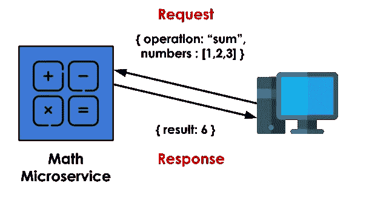
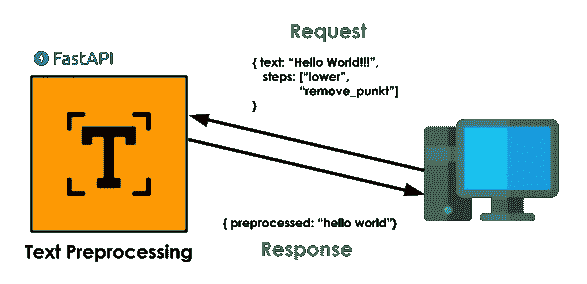

# 用 FastAPI 构建文本预处理微服务

> 原文：<https://towardsdatascience.com/building-a-text-preprocessing-microservice-with-fastapi-ca7912050ba>

## 用 Python 创建和分发一个简单的 NLP 应用程序


由 [Timelab Pro](https://unsplash.com/@timelabpro?utm_source=medium&utm_medium=referral) 在 [Unsplash](https://unsplash.com?utm_source=medium&utm_medium=referral) 上拍摄的照片

# 介绍

预处理是机器学习/数据科学应用中最重要的步骤之一。在现实世界中，大多数数据集都是脏的，有缺失值，并且充满了不正确的列，如字符串、日期和其他类型的非数字特征。

在常规应用程序中，原始数据主要在表格中，标准化、缩放和编码等方法对于机器学习模型正常工作至关重要。

在 NLP(自然语言处理)应用中，预处理是一个更加关键的步骤，因为文本本来就是非数字、非结构化和杂乱的数据。因此，文本预处理通常包括一些常见的步骤，比如清理(删除特殊字符、标点符号、停用词等)和规范化(将文本转换成小写、词干化和词汇化)。

通常，这些步骤在不同的应用程序之间共享，而一个*微服务*可能是封装、分发和重用预处理功能的好方法。

**在这篇文章**中，使用 FastAPI 库在 Python 中构建了一个简单的文本预处理 API。在这个例子中，我们将使用 RegEx(正则表达式)来规范化文本“噪声”，但是所提出的概念可以很容易地扩展到更复杂的应用程序。

# 在 Python 中查看正则表达式

Regex 是一个结构化的字符串，用来表达一个文本通用模式，该模式用于搜索文本中的术语。Regex 是 NLP 应用程序中一个非常强大的工具，绝对值得关注，但是这篇文章不会涉及它的所有实现细节，只涉及它的功能。

如上所述，正则表达式是描述通用模式的字符串。例如，假设您有一个人与人之间交换的纯文本消息的数据库，您的任务是检索对话中引用的所有电子邮件地址。

电子邮件地址是常见模式的一个很好的例子。它们都有一个“@”符号，并以点结束，如 foo@email.com 或 bar_@emailx.edu.br。正则表达式允许我们以结构化的明确方式描述这种模式。对于这个例子，它将是这样的:

```
r"\w+\@\w+(?:\.\w+)+"
```

> 这个正则表达式并不完美，但它适用于大多数情况。

在 Python 中，我们可以使用原生 regex 模块对字符串执行搜索和替换。

正则表达式查找所有电子邮件地址

输出:

```
> ['[joaozinho@email.com](mailto:joaozinho@email.com)', '[john123@edu.us](mailto:john123@edu.us)']
```

但是这对文本预处理有什么帮助呢？

通过使用 replace 函数，regex 模块在文本规范化中非常有用。这个函数允许我们找到一个模式并用一些预定义的文本替换它。通过这样做，我们能够以更有意义的独特方式在文本中表示概念(这可以进一步提高 ML 模型的性能)。

正则表达式子示例

输出:

```
This is a valid email address:  <EMAIL>  
This is another valid email address:  <EMAIL>  
This is not: antunes@@abc.br
```

# **什么是微服务？**

一个*微服务*是一个小应用程序，负责系统上一个非常具体的任务。它独立运行，与其他应用程序隔离，并且在资源上也是自给自足的。

微服务一旦运行，就可以通过 API 调用在其公开的端点上使用。我们将使用 FastAPI 来构建我们的微服务端点，FastAPI 是一个 Python web 框架，可以用最少的代码轻松实现 API。

这篇文章也不会深入 API 和 HTTP 请求的所有细节，但是所提出的应用程序非常简单，应该很容易理解。



微服务示例。图片作者。由 [Freepik](https://www.flaticon.com/free-icons/text) 创作的图标。

> 提示:Docker 是软件开发中必不可少的工具，并且与微服务的概念密切相关，因此值得一试。

# 履行

## 设置环境

首先要做的是创建一个隔离的 python 环境，只包含所需的依赖项。您可以使用 Anaconda 或 PyEnv。

创建环境后，安装以下软件包:

```
fastapi
uvicorn[standard]
requests
```

***uvicon【standard】***:本地服务器托管 API
**请求:** Python 库进行 HTTP 请求
**FastAPI:**FastAPI 包

## 构建我们的第一个 API 端点

我们与 API 通信的方式是通过在其公开的端点上发出请求。在 Web APIs 的上下文中，端点在 URL 上公开。

使用 API 服务的应用程序/个人被称为*客户端*，它可以通过 HTTP 请求(如 GET、POST 或 PUT)与端点进行交互。这些请求中的每一个都有预定的行为。例如，GET 可用于从数据库中检索一个条目，并提交以供插入。

以下示例基于 [FastAPI 官方页面](https://fastapi.tiangolo.com/#example)。用下面的代码创建一个文件 **main.py** :

API 示例

然后，在终端上运行:

```
uvicorn main:app --reload
```

> “reload”参数仅用于开发，不要用于生产。

在 http://127.0.0.1:8000/上打开浏览器，您应该会看到以下响应:

```
{"Hello":"World"}
```

恭喜你，你已经构建了你的第一个 API！

那么，我们来了解一下是怎么回事。

*   *app* 变量引用将要运行的 API 应用程序；
*   “uvicon main:app-reload”使用文件 *main 中的变量 *app* 启动服务器。*
*   默认情况下，API 运行在端口为*=*8000(http://127 . 0 . 0 . 1:8000)*的*本地主机*上。这是根，这意味着所有的端点都是从它开始的路径，比如 http://127 . 0 . 0 . 1:8000/do/something/*
*   当发出 get 请求时， *decorator app.get("/")* 将路径"/"链接到函数 *read_root* 。
    这意味着当在 http://127.0.0.1:8000/上发出 GET 请求时(注意末尾的“/”)，函数 *read_root* 被调用，返回作为响应被发送回来。
*   当您的浏览器打开 http://127.0.0.1:8000/时，它在链接上发出 GET 请求并显示响应。

## 在端点中接收数据

构建一个端点来接收信息与我们之前所做的并没有太大的不同。主要区别在于该函数还需要接收参数。例如，下面的端点接收两个参数:

```
@app.get("/example/") 
def read_item(id: int, name: string): 
    return {"your_id": id, "your_name": name}
```

该信息由客户端在请求中以 JSON 格式发送(进一步详述)，如下所示:

```
{ "id":123, "name": "Joao" }
```

最酷的是 FastAPI 自动为我们验证数据。因此，如果客户端发送一个带有{"name":123}或根本没有名称的请求，它将返回一个类型/字段错误。除了默认的 python 类型，FastAPI 还支持验证 Pydantic 类。

## **用 Pydantic 验证输入**

Pydantic 是一种更健壮的验证数据的方法。它允许我们使用 python 类描述我们期望的输入(模型)，设置必填字段、允许的间隔和值、可选参数以及更多的。例如，下面的类描述了一个*人物*应该具有什么样的价值观。

Pydantic 示例

然后，可以将该类插入到函数的参数字段中，就像上一个示例中描述的本地 python 类型一样。

## 构建我们的预处理端点

现在，终于是实现 API 本身的时候了。

我们的*微服务*的目的是基于一个定义好的需求列表对文本进行预处理。例如，用户可以请求删除所有货币值并返回小写文本。

它将具有以下功能:*删除标点符号，替换数字，替换金钱，替换电话号码，替换电子邮件，并把文本小写。*



文本预处理微服务。图片作者。由 [Freepik](https://www.flaticon.com/free-icons/text) 制作的图标。

总结一下，我们需要实现:

1.  文本预处理功能。
2.  端点的输入验证模型。
3.  将接收文本和预处理步骤列表并返回预处理文本的端点。

先说文本预处理函数。如前所述，我们将使用正则表达式来规范化文本。下面的代码展示了几个负责它的类的实现。BaseRegExPreprocessing 类充当抽象类。每个继承的类都用其代表系统功能的值覆盖了 *regex* 和 *replace_token*

文本预处理类

输入验证非常简单，我们只需要创建一个类来描述客户端发送的数据应该是什么样子。下面的代码展示了这个实现。

Pydantic 验证类

StringTransformation 类枚举 PreprocessingRequest 类中变量*步骤*的所有可接受值，每个值代表一个功能。PreprocessingRequest 是主类，它描述了发送的数据应该是什么样子。

最后，我们可以将它们放在主 FastAPI 应用程序中。

主要 API 代码

然后，用 uvicorn 运行服务器即可。

# 对一些例子进行测试

为了正确测试我们的 API，我们将使用 python 请求库。

第一个例子是替换字符串中的所有电话号码。

在查看响应的输出之前，让我们先看一下代码。

*数据*是我们发送给 API 的信息。它的格式如 pydantic 类中所述:“text”字段包含要预处理的文本，而“steps”字段包含预处理步骤的列表。它作为 *json 在 get()方法中传递。*

requests.get()在 HTTP://*localhost*/preprocess/上发出 HTTP GET 请求，这是我们端点的 URL。

可以通过调用 *response.json()* 来检索返回的输出

API 的一个优点是客户端与应用程序完全无关。我们的客户端是用 python 编写的，但它可以是 C++应用程序、web 浏览器或任何可以发出 HTTP 请求的东西。

> 事实上，测试端点的另一种方法是访问 *localhost* 上的 http://127.0.0.1:8000/docs 路径。这个路径指向 FastAPI 自动文档，构建一个迭代窗口来运行请求。

让我们以一个更复杂的例子来结束，这个例子探索了系统的许多功能:

输出:

# 结论

在本文中，我们使用 python regex 和 FastAPI 构建了一个用于文本规范化的 API。我们探索了 regex 规范化文本的能力，这是 NLP 应用程序中的一个基本过程，并描述了如何使用*微服务*和 API *s* 的概念封装和分发这个过程。尽管这是一个简单的应用程序，但它展示了可以扩展到更复杂情况的基本概念。

文中讨论的所有主题都进行了简要的探讨，以使帖子更小，并允许我们在主要目标的方向上更快地移动。要建立更坚实的基础，请查看以下参考资料:)

我希望你喜欢这次旅行，如果你喜欢讨论的任何话题，我强烈建议你进行更深入的研究。

感谢您的阅读！；)

# 参考

> Github 上的代码:[https://Github . com/jaumpedro 214/posts/tree/main/text _ pre _ fast _ API](https://github.com/jaumpedro214/posts/tree/main/text_pre_fast_api)

[1] CodingEntrepreneurs Youtube 频道， [Python & FastAPI 教程:创建一个 ai 微服务，从图像中提取文本](https://www.youtube.com/watch?v=JxH7cdDCFwE&ab_channel=CodingEntrepreneurs)。
【2】aa shish Nair，[正则表达式:文本分析的瑞士刀](/regular-expressions-the-swiss-knife-for-text-analysis-76a34ac71c97)。在媒体上，走向数据科学。
【3】AmigosCode Youtube 频道， [FastAPI 教程——用 Python 构建 RESTful API](https://www.youtube.com/watch?v=GN6ICac3OXY&ab_channel=Amigoscode)
【3】[什么是 REST API？](https://www.redhat.com/en/topics/api/what-is-a-rest-api)。在红帽子上。
【4】[HTTP 请求方法](https://developer.mozilla.org/en-US/docs/Web/HTTP/Methods)。关于 MDN Web 文档
【5】[Fast API 官方文档。](http://fastapi.tiangolo.com)
【6】[Pydantic 官方文件](http://pydantic-docs.helpmanual.io)