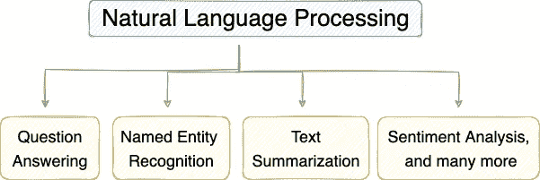
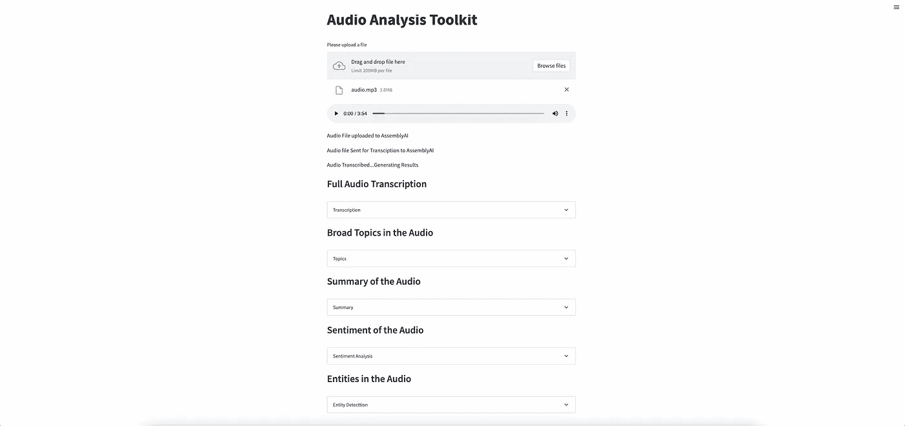
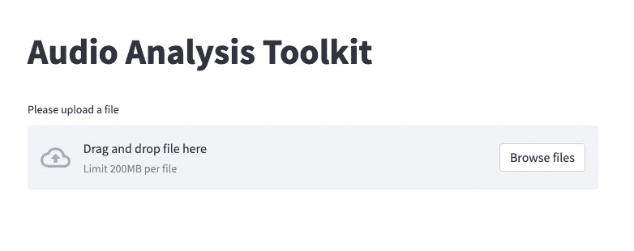
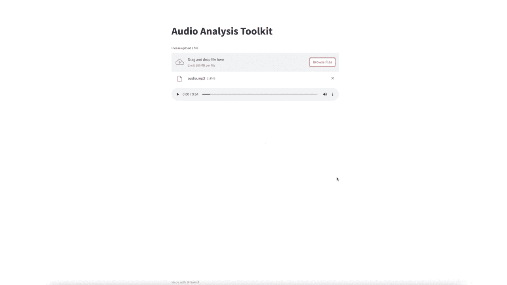
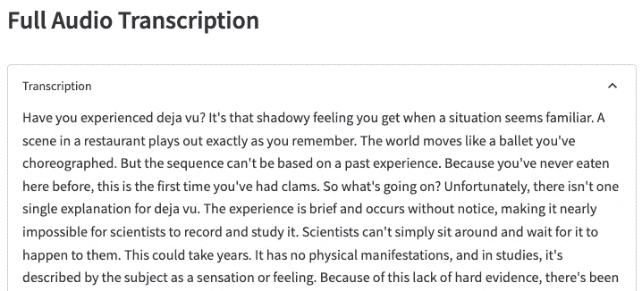
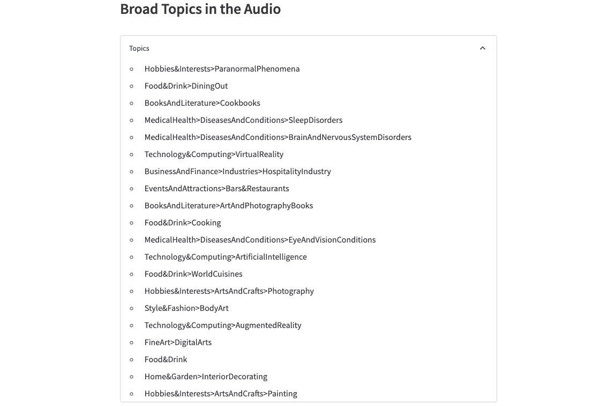
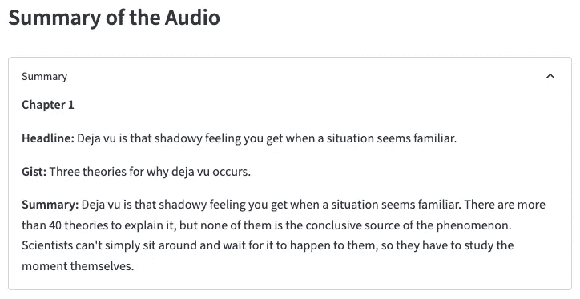
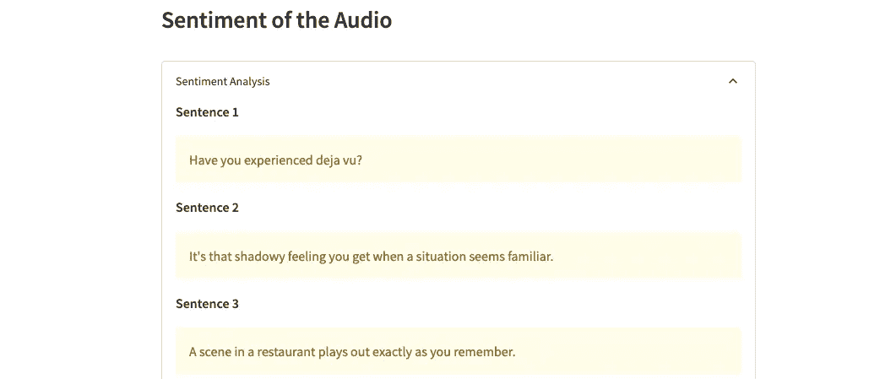
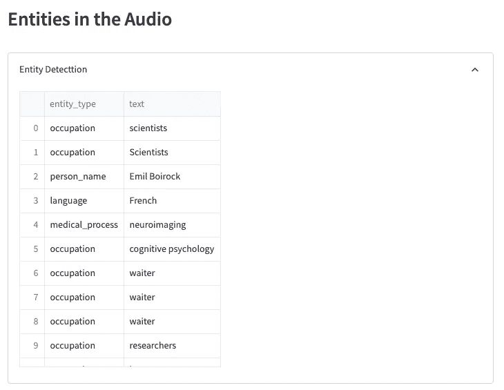

# 用 Python 构建一体化音频分析工具包

> 原文：<https://towardsdatascience.com/building-an-all-in-one-audio-analysis-toolkit-in-python-e849a0e2129e>

## 在一个地方分析您的音频文件


凯利·西克玛在 [Unsplash](https://unsplash.com?utm_source=medium&utm_medium=referral) 上的照片

语言是人类之间所有对话的基础。因此，自然语言处理(简称 NLP)领域无疑在帮助人类日常生活方面拥有巨大的潜力。

简而言之，NLP 的领域包括一组旨在理解人类语言数据并完成下游任务的技术。

自然语言处理技术涵盖了许多领域，如问题回答(QA)、命名实体识别(NER)、文本摘要、自然语言生成(NLG)等等。



自然语言处理的几个子领域(图片由作者提供)

虽然 NLP 中大多数先前的研究和开发主要集中在应用各种技术上，特别是在“文本”数据上，但最近，社区已经见证了基于语音的交互的巨大采用，引导机器学习工程师在语音领域进行实验和创新。

因此，在这篇博客中，我将在 Streamlit 中演示一个包罗万象的音频分析应用程序，它以一个音频文件作为输入，并且:

```
1\. Transcribes the audio
2\. Performs sentiment analysis on the audio
3\. Summarizes the audio
4\. Identifies named entities mentioned in the audio
5\. Extracts broad ideas from the audio
```

为了实现这一点，我们将使用 AssemblyAI API 来转录音频文件，并简化它以用 Python 构建 web 应用程序。

下图描绘了这个应用程序准备就绪后的样子。



音频分析工具包概述(图片由作者提供)

我们开始吧🚀！

# 应用程序工作流程

在构建应用程序之前，最好强调一下我们的应用程序的工作流以及它将如何工作。

下图描述了该应用程序的高级图形概览:


AssemblyAI 的转录服务工作流程(图片由作者提供)

如上所述，Streamlit web 应用程序首先将一个音频文件作为输入。

接下来，我们将把它上传到 AssemblyAI 的服务器，以获得音频文件的 URL。一旦 URL 可用，我们将向 AssemblyAI 的转录端点创建一个 POST 请求，并指定我们希望对输入音频执行的下游任务。

最后，我们将创建一个 GET 请求来从 AssemblyAI 中检索转录结果，并将它们显示在我们的 streamlit 应用程序上。

# 项目要求

本节将强调构建音频工具包的一些先决条件/依赖关系。

## 排名第一的安装简化版

在 Streamlit 中构建 web 应用程序需要在本地安装 [Streamlit](https://docs.streamlit.io/library/get-started/installation) python 包。

## #2 获取 AssemblyAI API 访问令牌

要访问 AssemblyAI 的转录服务，您应该从他们的[网站](https://app.assemblyai.com/signup)获得一个 API 访问令牌。对于这个项目，我们姑且定义为`auth_key`。

## #3 导入依赖关系

最后，我们将导入这个项目中需要的 python 库。

这样，我们就可以构建我们的音频分析 web 应用程序了。

# 构建 Streamlit 应用

接下来，让我们继续在 Streamlit 中构建 web 应用程序。

如上所述，我们的应用程序将包括四个步骤。这些是:

```
1\. Uploading the file to AssemblyAI
2\. Sending the Audio for transcription through a POST request
3\. Retrieving the transcription results with a GET request
4\. Displaying the results in the web application
```

为了实现这一点，我们将定义四种不同的方法，每种方法都致力于上述四个目标中的一个。

然而，在我们继续之前，我们应该为我们的请求声明头，并定义 AssemblyAI 的转录端点。

*   **方法一:** `**upload_audio(audio_file)**`

该方法的目标是接受从用户处获得的音频文件，并将其上传到 AssemblyAI 以获得该文件的 URL。

> 请注意，只要可以通过 URL 访问音频文件，就没有必要将它上传到 AssemblyAI。因此，如果音频文件已经可以通过 URL 访问，则可以跳过实现此方法。

`upload_audio()`方法的实现如下所示:

该函数接受`audio_file`作为参数，并在 AssemblyAI 的`upload_endpoint`处创建一个 POST 请求。我们从 AssemblyAI 返回的 JSON 响应中获取`upload_url`。

*   **方法二:** `**transcribe(upload_url)**`

顾名思义，这个方法将接受从上面的`upload_audio()`方法获得的音频文件的 URL，并将其发送给 AssemblyAI 进行转录。

在上面的 JSON 对象中，我们指定了音频的 URL 和我们希望在 AssemblyAI 的转录端点调用的下游服务。

对于这个项目，这些服务包括情感分析、主题检测、摘要、实体识别和识别文件中的所有发言者。

在`transcription_endpoint`创建 POST 请求后，我们返回 AssemblyAI 返回的`transcription_id`，稍后我们可以用它来获取转录结果。

*   **方法三:** `**get_transcription_result(transcription_id)**`

倒数第二步是从 AssemblyAI 中检索转录结果。为了实现这一点，我们这次必须创建一个 GET 请求，并提供在上一步中从 AssemblyAI 接收到的惟一标识符(`transcription_id`)。

实现如下所示:

由于转录时间取决于输入音频文件的持续时间，我们定义了一个 while 循环来创建重复的 GET 请求，直到请求的`status`变为`completed`或者转录请求指示了`error`。

接收到的特定音频文件的转录响应如下所示:

*   **方法四:** `**print_results(results)**`

这个应用程序中的最后一个方法是在 Streamlit 应用程序上打印从 AssemblyAI 获得的结果。

为了避免应用程序前端的混乱和文本混乱，我们将把每个服务封装在一个 Sreamlit 扩展器中。

与本项目相关的转录响应的关键是:

*   `**text**`:包含音频的转录文本。

*   `**iab_categories_result**`:该键对应的值是音频文件中标识的主题列表。

*   `**chapters**`:该键表示音频文件的摘要为不同的章节。

*   `**sentiment_analysis_results**`:顾名思义，这个键保存了音频文件的逐句摘要。

*   `**entities**`:最后，这个键存储音频文件中识别的实体。

## 集成主方法中的功能

作为构建 Streamlit 应用程序的最后一步，我们将上面定义的函数集成到`main()`方法中。

首先，我们为用户创建一个文件上传程序来上传音频文件。

一旦音频文件可用，我们就将其发送到方法 1 ( `upload_audio`)，然后转录音频(`transcribe`)并检索结果(`get_transcription_result`)，最后在 Streamlit 应用程序上向用户显示结果(`print_results`)。

# 执行应用程序

我们的音频分析应用程序已经准备好了，现在是运行它的时候了！

为此，打开一个新的终端会话。接下来，导航到您的工作目录，在用您的 python 文件的名称替换`file-name.py`之后执行以下命令:

```
streamlit run file-name.py
```



上传音频到应用程序(图片由作者提供)

## 演示演练

上面的上传者要求你上传一个音频文件。一旦你这样做了，上面定义的函数将被顺序执行以生成最终结果。

上传文件的转录结果如下所示:



音频分析应用程序的演练(作者提供的 Gif)

# 结果

在本节中，我们将讨论从 AssemblyAI 转录模型中获得的结果。

## 音频转录

输入音频的部分转录如下图所示。



完整音频转录(图片由作者提供)

## 主题

下图显示了演讲者在整个音频中讨论的广泛话题。



在音频中找到的主题(图片由作者提供)

## 摘要

[为了生成摘要](https://medium.com/@avi_chawla/a-step-by-step-guide-to-summarizing-audio-files-in-python-55059bec54a7)，AssemblyAI 的转录服务首先将音频分成不同的章节，然后分别对每一章进行摘要。

输入音频文件的摘要如下所示。



音频摘要(图片由作者提供)

## 情感分析

AssemblyAI 将每个句子分为三类情绪——`Positive`、`Negative`和`Neutral`。

音频中前三句的感悟如下图。它们被转录模块精确地归类为`Neutral`。



音频中句子的情感(图片由作者提供)

## 实体检测

最后，音频中标识的实体及其对应的实体标签如下所示。



音频中的实体(图片由作者提供)

# 结论

总之，在这篇文章中，我们使用 AssemblyAI API 和 Streamlit 构建了一个全面的音频应用程序来分析音频文件。

具体来说，我演示了如何对输入音频执行各种下游 NLP 任务，比如转录、摘要、情感分析、实体检测和主题分类。

感谢阅读！

[🧑‍💻**成为数据科学专业人士！获取包含 450 多个熊猫、NumPy 和 SQL 问题的免费数据科学掌握工具包。**](https://subscribepage.io/450q)

✉️ [**注册我的电子邮件列表**](https://medium.com/subscribe/@avi_chawla) 不要错过另一篇关于数据科学指南、技巧和提示、机器学习、SQL、Python 等的文章。Medium 会将我的下一篇文章直接发送到你的收件箱。