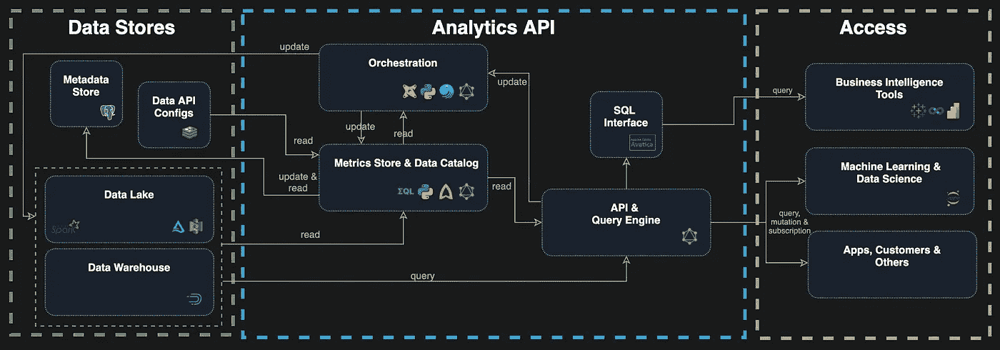

# 用 GraphQL 构建分析 API:数据工程的下一个层次？

> 原文：<https://towardsdatascience.com/building-an-analytics-api-with-graphql-the-next-level-of-data-engineering-6a8aea32ba72>

# 用 GraphQL 构建分析 API:数据工程的下一个层次？

## 拥有一个高性能、安全、可靠的数据端点是实实在在的挑战。尤其是选择每个人都同意的准确的度量和尺寸，对吗？让我们解决这个问题。


图片由[穆罕默德·巴盖里·阿迪布·贝鲁斯](https://unsplash.com/@adibbehrooz)在 [Unsplash](https://unsplash.com/photos/XHI-S_xWK28) 上拍摄

你可能会问，为什么数据工程师要用 GraphQL？GraphQL 解决了为每个客户端提供不同接口的问题，它为所有客户端(如 web、移动和 web 应用程序)统一了一个 API。我们现在在数据领域面临着同样的挑战，我们将多个客户端与众多后端系统集成在一起。

那么 GraphQL 是什么呢？在微服务和 web 应用程序的世界中，GraphQL 是一种流行的查询语言，并充当数据层。它本质上是 API 的类固醇 SQL。在本文中，我们将介绍如何将来自所有服务的数据组合成一个统一的 API。

# 为什么为数据工程师选择 GraphQL？

# GraphQL 是什么？

先说 GraphQL。在 2015 年公开发布之前，它是由脸书在 2012 年内部开发的。本质上是为了更好地为他们的移动应用服务，所有的 API 都针对网络进行了优化，拥有更大的客户端和更快的数据连接。他们没有为移动设备复制所有现有的 API 端点，而是很快意识到他们需要另一种解决方案。这个解决方案被称为 GraphQL。如果你想知道更多关于它是如何开始的，我推荐你去看网飞式的[纪录片](https://youtu.be/783ccP__No8)。

**本质上，GraphQL 是 API 的类固醇 SQL**。最棒的是，它基于与 REST 相同的技术，支持 GET 或 POST 请求。但是，不是有多个*哑*端点，而是有一个能够接受复杂查询的*智能*端点。假设您的所有用例都有数百个 API 端点。GraphQL 允许您组合它们，但是只选择您需要的列(`SELECT columns FROM ...`)和行(`WHERE ...`)。这些选项可以减少 API 调用和数据负载，因为您可以将几个 REST 调用合并成一个。这也增强了前端开发人员的能力，因为他们更少依赖后端开发人员。

# (查询)界面

下图展示了使用 GitHub[public graph QL endpoint](https://docs.github.com/en/graphql/overview/explorer)的简单查询。你可以自己尝试下面的查询。

```
query {
  repository(owner: "sspaeti-com", name: "practical-data-engineering") {
    name
    description
    owner {
      login
    }
    homepageUrl
    visibility
    createdAt
  }
}
```

响应如下所示:

```
{
  "data": {
    "repository": {
      "name": "practical-data-engineering",
      "description": "Real estate dagster pipeline",
      "owner": {
        "login": "sspaeti-com"
      },
      "homepageUrl": "https://www.sspaeti.com/blog/data-engineering-project-in-twenty-minutes/",
      "visibility": "PUBLIC",
      "createdAt": "2020-11-18T21:15:37Z"
    }
  }
}
```

# 为什么 GraphQL 如此适合？

大多数关于 GraphQL 的讨论都集中在数据获取上，但是任何**完整的数据平台也需要一种方法来修改服务器端数据**。这就是内置`mutation`发挥作用的地方，我们稍后在分析 API 中利用它们。在[查询和突变](https://graphql.org/learn/queries/)下找到更多信息。

维护简单。GraphQL 本质上是一个端点`/graphql`(可以随意命名)，而不是通过创建更多端点来增加复杂性。它还增加了它的可扩展性和可维护性。

**类型验证**内置于 [GraphQL 模式语言](https://graphql.org/learn/schema/)中，用于预先验证 GraphQL 查询。这些允许服务器和客户端在有无效查询时有效地通知开发者**，而不依赖于运行时检查**。

**自证！**当您用列和类型构建您的接口时，您记录了代码，通过使用像 GraphQL 这样的工具进行自省，这些代码自动对客户端可用。对于构建 API 的开发者和使用它的人来说，这是一个巨大的时间节省。

一个大问题是你的 **API 模式与你的数据库模式的解耦**。例如，你今天使用 [AWS Lambda](https://aws.amazon.com/lambda/) 函数在你的后端查询 [Google Big Query](https://cloud.google.com/bigquery) ，你想要或者必须换成其他的东西比如 [Apache Druid](https://www.sspaeti.com/blog/open-source-data-warehousing-druid-airflow-superset/#druid---the-data-store) 。您可以在不干扰用户的情况下进行切换，因为 GraphQL 充当了您的语义层。想象一下相反的情况，您将 web 应用程序与 Big Query 的 API 紧密集成。迁移和重写所有的前端代码需要付出很大的努力。

💡注意:除了查询和变异，操作`**subscription**` **对于更新下游事件和防止轮询**也很方便。服务器会将更改推送给所有订阅者。这对于基于事件或实时的应用程序来说很方便。订阅本身可以是 GraphQL 使用 [Websockets](https://en.wikipedia.org/wiki/WebSocket) 在服务器和客户端之间保持开放连接的`update`、`delete`或`insert`。

另一个成功的方面是**标准化规格表。无论如何，成为一个规范意味着更好的工具、更容易的使用和服务间更全面的互操作性都更容易实现。我认为仅此一点就让 GraphQL 难以避免。**

# GraphQL 不是什么

它不是一个能为您提供所有必要服务的成熟解决方案。它是一个框架的一部分，这个框架提供了适当的边界和工具来为您的业务实现合适的逻辑，否则您将不得不构建这些逻辑。但是没有创建查询接口、权限、验证等的麻烦。把所有东西粘在一起。

它不是 [YAML](https://blog.stackpath.com/yaml/) ，也不是 JSON，虽然非常接近，但它是它的格式，如上面的[接口部分](https://www.sspaeti.com/blog/graphql-the-next-level-of-data-engineering/#the-query-interface)所示。你可以在文章[REST vs graph QL API 中找到其他潜在的问题，好的，坏的，丑陋的](https://www.moesif.com/blog/technical/graphql/REST-vs-GraphQL-APIs-the-good-the-bad-the-ugly/#problems-with-graphql)。

# 什么是分析 API？

现在，我们已经看到了 GraphQL 可以做什么，我们讨论**构建一个通向下一级数据工程的 API**，在本文中我称之为*分析 API* 。该 API 将使所有利益相关者能够以一致和分离的语义方式使用**单一来源访问分析数据**(如果您知道更好的名称，请告诉我！).



作者使用 GraphQL | Image 的单端点分析 API 架构

分析 API 由五个主要组件组成，其中 GraphQL 是网关 API 和查询接口的最佳选择。除此之外，SQL Connector 还可以连接以 SQL 为母语的遗留或传统 BI 系统。指标或业务逻辑，也叫[指标存储](https://cube.dev/blog/introducing-cube-sql/)或[无头 BI](https://basecase.vc/blog/headless-bi) 存储在指标存储中。假设你在一个有很多变化的大型组织中。在这种情况下，有一个数据目录会很有帮助，它可以帮助发现您的数据，并向数据集添加所有者、评论、评级和其他信息，以便在它们之间导航。orchestrator 持续可靠地更新数据存储中的内容。稍后将详细介绍每个组件。

# 数据团队如何努力构建分析 API

云架构比以往任何时候都更加复杂，尤其是随着工具和技术的最新发展。如今，每个数据团队都希望公司的决策者能够随时获得数据。无论是数据分析师、产品经理、数据科学家、业务人员还是数据分析师，都很难提供一个单一的接口来抽象所有异构数据存储，并让他们查询所有数据。最重要的是，新的原则和架构正在接受旧的想法，例如，[数据网格](https://cnr.sh/essays/what-the-heck-data-mesh)中分散的数据产品和集中的云数据仓库。

[ade vinta](https://medium.com/adevinta-tech-blog/building-a-data-mesh-to-support-an-ecosystem-of-data-products-at-adevinta-4c057d06824d)的 Xavier Gumara Rigol 表示，如果需要更复杂的处理，每个数据集应该至少有两个与 **SQL 的接口，作为快速访问和通过笔记本**的编程访问。

另一方面，如果您只有一个 Postgres 数据库或任何其他简化的架构，那么通过分析 API 构建和路由它可能没有意义。让我们看一看当今不同的数据团队，以及他们目前面临的挑战:

*   **机器学习人员**想要一个 API 来试验 Jupyter 笔记本中的特定数据。
*   **商业智能用户**需要报告公司如何使用他们选择的仪表板工具。他们需要一个 SQL 连接器。响应时间必须在几秒钟之内，因为他们希望实时切片并在会议上演示数字。如果可能的话，公司范围内的 KPI 已经预先计算好，随时可以使用。
*   **超级用户**想要更新和修复一些不正确的数据。他们需要一个界面或清晰的文档来说明如何操作。更重要的是，他们是否在数据湖、 [OLAP](https://www.sspaeti.com/blog/olap-whats-coming-next/) 立方体、配置等环境中进行。，应该没关系。
*   **应用具有不同需求的产品逻辑的内部应用和管道**包括摄取新数据、修复无效状态、自动维护，例如压缩海量数据源或实现复杂的业务逻辑。
*   **外部客户**想要为他们的数据仓库提取数据。
*   **经理们**想一目了然地看到整体数字。

由于这些涉众有不同的用例和技能，很难支持他们所有人。通过现场验证的标准化 GraphQL 界面和记录在案的内置界面，我们拥有了当今最好的方法。这也是一个使更新保持一致并保存的机会，而不是直接与人联系🚒。

**授权和认证**值得注意，而不是在每个系统中创建新的组和用户。必须一次实施。但是如果你没有这样的 API，这是非常困难的。当然，您可以集成您的身份和访问管理解决方案，但是内置在中央 API 和 GraphQL 中是一种实用而优雅的方式。

# 分析 API 的组件

现在让我们更详细地看看每个组件，以及它们有效地做了什么。

# API 和查询引擎

分析 API 的第一个组件是界面和查询引擎。这个接口是所有工具都可以访问的单一 GraphQL 端点。称之为代理、路由器或网关，它将每个`query`、`mutation`或`subscription`转发到正确的服务或管道。

如果您有中央计算度量或任何不支持 SQL 的数据存储，查询引擎会有所帮助，您可以将 GraphQL 查询翻译成特定的查询语言。与 SQL 连接器的一个关键区别是使用高级和更通用的模式来查询数据。例如，代替`SELECT COUNT(DISTINCT userid) AS distinct_users FROM customers`，我们可以更概括地说:

```
SELECT {{ metrics.distinct_users }} FROM {{ datasources.customers }}
--or
SELECT * FROM {{ metrics.metric('customer', by='day', dims=['country', 'year']) }}
```

为此，我们需要一个中间层来将通用查询转换为实际的 SQL 查询，即查询引擎。

我希望你注意到这里所有商业智能工程师的利益和**小** [**大**](https://www.linkedin.com/feed/update/urn:li:activity:6885632330640171008/) **。我们有一个定义，而不是用稍微不同的语法为所有数据存储编写又长又复杂的查询**。我们不需要在不同的地方定义像`distinctUsers`这样的指标，而是将它存储一次，然后应用于所有的系统。没有必要担心你是否得到了最新版本或者是否有人改变了计算。下一章将详细介绍如何集中存储一个指标定义。

> 我们看到在变换层出现了更多的抽象。度量层(因 Airbnb 的 Minerva 、[Transform.co](https://transform.co/)和 [Metriql](https://metriql.com/) 而流行)，特征工程框架(更接近 MLops)，A/B 测试框架，以及各种形状和风格的本土计算框架的寒武纪大爆发。称之为“数据中间件”、“参数管道”或“计算框架”，但这个领域正在开始成形。来自[现代数据堆栈如何重塑数据工程](https://preset.io/blog/reshaping-data-engineering/)

如上面的分析 API 图所示，它通过 GraphQL 与其他组件集成，以便从指标和数据目录存储中读取数据，或者通过编排触发更新。除了只实现某些部分的无头 BI 工具之外，没有集成的工具。在[最近围绕无头毕的炒作](https://www.sspaeti.com/blog/graphql-the-next-level-of-data-engineering/#the-recent-hype-around-headless-bi)一章，你可以找到更多关于他们的内容。

# 度量存储|无头 BI

无头 BI 部分，或者我在本文中提到的度量存储，是存放所有[度量](https://support.google.com/analytics/answer/1033861?hl=en)的重要地方。度量标准，如计算度量、维度等。，这通常是从 Tableau、Power BI、Superset、Looker 等商业智能工具中了解到的。**这些工具都有自己的度量存储，大多数情况下，它们都有描述聚合计算或维度的语言**。这里最著名的是来自 Looker 的 [LookML](https://docs.looker.com/data-modeling/learning-lookml/what-is-lookml) 。这里的不同之处在于，我们将所有 BI 工具的这一部分分离出来，并将它们集中起来。它允许我们以结构化和源代码控制的方式定义它们，而不是在专有工具中。

> **将其视为遵循** [**干**](https://en.wikipedia.org/wiki/Don%27t_repeat_yourself) **原则**集中实现一次的某些业务逻辑、关键代码或元数据。假设您使用 Apache Druid，您可能有复杂的计算度量，作为 ML-Engineer 或任何客户，您希望使用 BI 工具查询这些度量。不是在每个工具中添加格式化选项、单位、描述来重新创建它们，而是将它们存储在分析 API 的中心。此外，在度量存储的帮助下。

分析 API 中不同组件之间的通信是通过 GraphQL 从查询引擎返回查询，在需要时通过直接查询查询或更新元数据存储和数据 API 配置，并执行来自编排的请求。

目前，大多数工具和人员使用**流行的模板化解决方案和** [**Jinja 和 SQL**](https://multithreaded.stitchfix.com/blog/2017/07/06/one-weird-trick/) 并集成到公司选择的 BI 工具中。但是由于 Jinja SQL 逻辑很难跨不同的数据库引擎重用，并且如果您开始嵌套这些查询，很快就会变得混乱，因此度量存储变得流行起来。

正如您现在所理解的，指标存储是分析 API 的一个重要组成部分，而作为分析查询和指标的关键组件几乎是同义词。此外，随着分析工程师越来越受欢迎，他们的领域知识主要是定义和创建这种指标的转换。

在此之上，我将看到类似于 Kafka 的 [**汇合模式注册表**](https://docs.confluent.io/platform/current/schema-registry/index.html) **的**附加服务集成，例如比较不同版本的度量定义和数据存储模式。这将减少将数据管道和应用程序逻辑与数据存储中不断发展的表和视图模式集成的错误。并允许一致地添加新的度量和维度。****

## 最近关于无头毕的炒作

如果您关注数据领域，您会注意到围绕元数据的**炒作，这些术语被称为度量存储或无头 BI。有趣的开源和闭源公司以及围绕它起步的工具包括**[**cube . js**](https://cube.dev/blog/introducing-cube-sql/)**[**Metriql**](https://metriql.com/)**[**super grain**](https://www.supergrain.com/)**[**Transform.co**](https://transform.co/)**或者** [**Minerva API** 您还将看到，由于上面提到的许多原因，他们正在使用或开始使用 GraphQL。](https://medium.com/airbnb-engineering/how-airbnb-enables-consistent-data-consumption-at-scale-1c0b6a8b9206)******

****最新的公告发生在 [dbt 的](https://www.getdbt.com/)公开会议的基调上[联合](https://coalesce.getdbt.com/)来自[德鲁巴宁](https://twitter.com/drewbanin)关于“[公制](https://youtu.be/MdSMSbQxnO0)”。他讲述了 5000 年前我们测量的起源，如果你还没看过，那一定要看。如果你想知道更多的细节，请关注已经开始的 [Github 问题](https://github.com/dbt-labs/dbt-core/issues/4071)中的许多信息和令人兴奋的想法。****

# ****数据目录****

****根据联合国欧洲经济委员会(une ce)2003 年的数据，在过去的十年中，数据增长了 40 倍(今天要高得多)。随着时间的推移，很难保持这一数量。数据目录服务解决了处理快速增长的数据的问题。****

****解决方案不在于数据，而在于跟踪元数据并有效地呈现它们。像 [Amundsen](https://amundsen.io/) 这样的数据目录和发现工具通过向我们显示哪些数据集可用、谁在哪年创建的、多少行的元数据、最小/最大条目来实现这一点。它包含一个评级系统，用户可以对数据集提供反馈，让您感受数据质量以及使用该数据集的有效性。**这是谷歌搜索，但元数据有一个方便的界面，你的指标存储**。****

****根据您选择或构建的工具，您可以与指标存储和其他组件(如 orchestrator 或 web 应用程序)进行交互。如果组件本身有 GraphQL 接口，这就是最佳解决方案。用户将使用这种工具的 web 界面，分析 API 的其他部分将通过 GraphQL 和 REST 成为可编程接口。例如，编排工具将查询最新的 db-schema 或持续数据源的列表。****

# ****管弦乐编曲****

****编排部分是大部分业务逻辑和转换最终落地的地方。**与其直接在 GraphQL 上将所有东西都构建到查询引擎中，不如使用合适的工具来重用代码并更好地集成它**。****

****我认为 [Dagster](http://dagster.io) 是现代的业务规则引擎，你可以在其中用 python 代码表达逻辑，这使得它与[的无代码/少代码方法](https://www.linkedin.com/feed/update/urn:li:activity:6857348322504540160/)相比是可测试和可扩展的。Dagster 提供了大量的工具，如[资源](https://docs.dagster.io/concepts/resources)来捕获可重用的代码，如连接到 Druid，创建一个 delta 表，启动一个 spark 作业，所有这些都在管道中使用。分析 API 中的另一个构件是 [Op](https://docs.dagster.io/concepts/ops-jobs-graphs/ops#ops) ，它将您的业务逻辑浓缩为[数据管道](https://docs.dagster.io/concepts/ops-jobs-graphs/jobs-graphs)中的功能任务。它用类型化的输入和输出进行了很好的定义，并使用了诸如上述资源之类的上下文，使得作为 op 的一部分运行 spark 作业变得很容易。****

****分析 API 中的集成是与 GraphQL 的集成，因为 Dagster 有一个内置的。Dagster 使用这个接口来查询各种元数据，启动管道/传感器(突变)，或者订阅特定的信息。旁注:这不是凭空而来的，因为 Dagster [的创始人尼克·施勒克](https://twitter.com/schrockn)是 GraphQL 的联合创始人😉。我们没有运行和使用 [Dagster UI](https://docs.dagster.io/concepts/dagit/dagit) ，而是为开发人员使用该接口，并通过分析 API 对其进行抽象。****

# ****SQL 连接器****

******SQL 是除了 python 之外的数据语言，在前面的** [**文章**](https://www.sspaeti.com/blog/business-intelligence-meets-data-engineering/#8220use-notebooks-to-open-up-the-data-silos8221) **中有详细阐述。这就是为什么我们也需要为此提供一个接口。**SQL 连接器集成了所有 BI、SQL speaking 或遗留工具。例如，连接器主要实现一个 ODBC 或 JDBC 驱动程序，Avatica 构建在 Apache Druid 使用的 [Apache 方解石](https://calcite.apache.org/avatica)上。这样，就有了一种与 ANSI SQL 接口的方法，包括度量存储中的所有度量和维度，如果工具使用 SQL，就无需在访问端做额外的工作。****

# ****构建分析 API 的挑战****

****在写这篇文章的时候，我经常发现自己与现有的架构和工具相冲突。这一章无论如何也不意味着是完整的。它指出了构建这样一个中央界面的挑战，并让我们从它们的优缺点中学习。****

*   ******具有 OpenAPI 规范的微服务:**由于部署应用程序很容易，我们可以在不同的 API 和服务之间进行大量双向通信。有了 [OpenAPI 规范(早期称为 Swagger)](https://swagger.io/specification/) ，你可以使用工具生成文档、客户端代码和测试。****
*   ****[**ROAPI**](https://github.com/roapi/roapi) :另一个迷人之处是，它自动为静态数据集旋转只读 API，而不需要你写一行代码。它建立在 [Apache Arrow](https://arrow.apache.org/) 和 [Datafusion](https://github.com/apache/arrow-datafusion) 之上。****
*   ******云数据仓库方法:**如果您使用一个主要的云数据仓库，这是一种整体架构。它给你一个 API，你可以用普通的 SQL 访问数据。它有与你的网络应用紧密结合的缺点。****
*   ****[**无代码/少代码平台**](https://www.linkedin.com/feed/update/urn:li:activity:6857348322504540160/) :当你购买一个[闭源厂商平台](https://www.sspaeti.com/blog/business-intelligence-meets-data-engineering/#8220use-closed-source-if-you-dont-have-the-developers-or-the-time8221)如 [Ascend.io](https://www.ascend.io/) 或类似平台时也是如此。****
*   ****[**Lakehouse 架构**](http://cidrdb.org/cidr2021/papers/cidr2021_paper17.pdf)**by data bricks:**lake house 表明，一切都朝着更小的移动部分发展，将数据接口整合到最低限度或一个单一接口。首席执行官 Ali Ghodsi 最近表示:“尽管我们在所有数据工具和框架方面取得了很大进展，但人们仍在四处奔波，寻找正确的数字，并与曾经正确的数字进行斗争”。这表明需要指标存储和中央分析 API。****
*   ****[**数据虚拟化**](https://www.sspaeti.com/blog/olap-whats-coming-next/#data-virtualisations) :数据虚拟化是集中和连接所有移动部分的另一种方式。**你不用四处移动和复制数据，也不用预聚合数据**，但是你有一个语义中间层来创建你的商业模型(比如立方体)。这些工具，例如 [Dremio](https://www.dremio.com/) 或 [others](https://www.sspaeti.com/blog/olap-whats-coming-next/#data-virtualisations) ，使用 Apache Arrow 技术，该技术将缓存并优化大量内存，以便您获得快速响应时间。Apache Arrow 如何工作，以及他们如何集中数据移动，你可以在 Julien Le Dem 的 Spark Summit 演讲中看到。****
*   ******无服务器功能:**更少的架构，但是对于更小的目标，你可以使用无服务器功能(没有基础设施)来运行你的胶合代码，例如，在 [AWS Lambda](https://aws.amazon.com/lambda/) 中，举一个例子。您的函数可以对支持高度事件驱动用例的事件做出反应。****
*   ****[数据仓库自动化](https://www.sspaeti.com/blog/data-warehouse-automation-dwa/) **:另一种解决方法是投资自动化。你可以不用购买你的数据仓库，而是用诸如 TimeXTener、WhereScape、BiGenius 和[等等工具来构建它。您可以敏捷地工作，将所有内容集成到您的数据仓库中，而不是将所有内容集成到一个单一的接口中。更多关于那个](https://dwa.guide/dwa-tools/)****

# ****结论****

****正如我们所见，GraphQL 是数据工程和构建分析 API 的强大工具。我们了解了分析 API 的用途，以及数据团队如何努力为当今复杂的云架构开发一个 API，主要是为了服务于各种利益相关方和其他业务部门。具有查询引擎、指标存储、数据目录、编排工具和 SQL 连接器的分析 API 的组件。最后，我们看了看其他解决方案和挑战，总的来说，就是我们现在面临的问题。****

****这篇文章的意思是不要以任何方式成为银弹解决方案。更重要的是，我希望它能帮助你开发出适合自己的最佳解决方案。我相信在接下来的几个月或几年里，这个特定的主题将会有很多进展，我期待着看到围绕 Analytics API 和 GraphQL 的生态系统。我还对这些解决方案的命名感兴趣，因为在我看来*分析 API* 还不是最终的名称。****

****暂时就这样了。我期待你的建议和批评。让我知道你是如何解决构建分析 API 的问题的，以及你对此的想法。****

*****原载于 2022 年 1 月 22 日*[*【https://www.sspaeti.com】*](https://www.sspaeti.com/blog/analytics-api-with-graphql-the-next-level-of-data-engineering/)*。*****