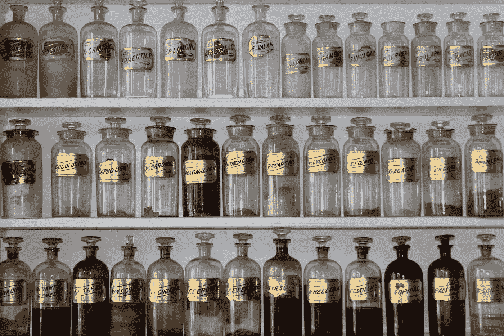
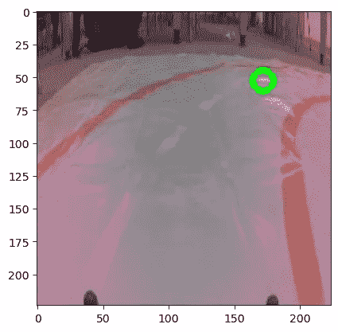
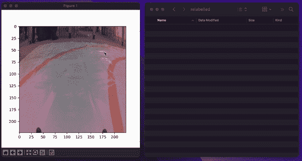
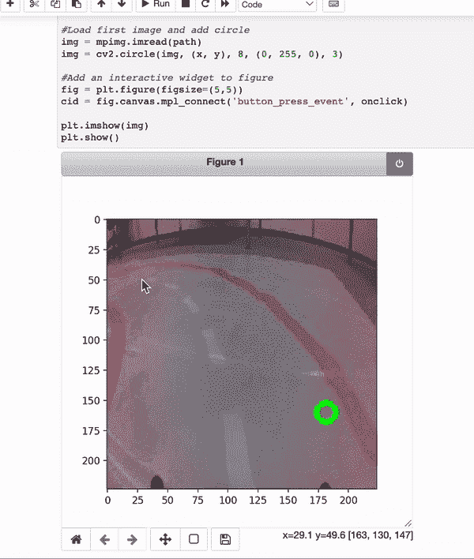
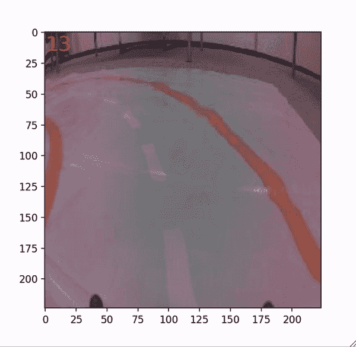
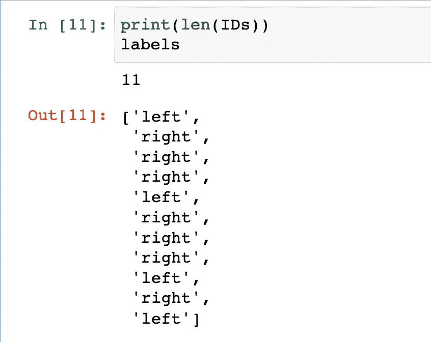

# 用 Python 构建交互式图像标注器

> 原文：<https://towardsdatascience.com/building-an-interactive-image-labeler-with-python-e1a14c5fc4>

## 使用鼠标或键盘标记您的图像数据



马特·布里内在 [Unsplash](https://unsplash.com?utm_source=medium&utm_medium=referral) 上拍摄的照片

给数据贴标签是一件痛苦的事。然而，准确标记的数据是数据科学和机器学习的基础。所以，让我们看看如何用 Python 来加速这个过程。

我们将构建两种类型的贴标机来记录:

*   鼠标点击的位置
*   键盘上按下的键

这些可以用来直接在笔记本上标记图像。我们将讨论用于创建这些的代码，你也可以在 [GitHub](https://github.com/conorosully/medium-articles/blob/master/src/image_tools/image_labelling.ipynb) 上找到它。

首先，我们将使用下面的导入。我们有一些标准包装(第 2-3 行)。我们有一些用来处理图像的包(第 5-6 行)。最后一个用于处理文件路径(第 8 行)。

我们将处理用于训练模型的图像，该模型引导自动驾驶汽车在轨道上行驶。你可以在 [Kaggle](https://www.kaggle.com/datasets/conorsully1/jatracer-images?select=object_detection) 上找到这些例子。记下图像名称:

```
181_160_c78164b4-40d2-11ed-a47b-a46bb6070c92.jpg
```

图像尺寸为 224 x 224。名称中的前两个数字是该图像中的 X 和 Y 坐标。我们希望使用图像作为输入来预测这个坐标。

不清楚？让我们展示其中一张图片。图像存储在第 2 行**的目录中。我们加载所有这些图像的路径(第 3 行)。**

我们采用列表中的第一条路径(第 1 行)，并从图像路径(第 4–6 行)中获取 X 和 Y 坐标。然后我们显示图像和坐标(第 9-11 行)。具体来说，我们使用 cv2 函数在给定的坐标上画一个圆(第 10 行)。

您可以在**图 1** 中看到输出。自动驾驶汽车要右转了。理想的方向是朝着绿圈给出的坐标走。



图 1:图像数据示例(来源:作者)

假设你花了几个小时收集数据，却发现它被错误地贴上了标签(这确实发生在我们身上)。试图手动更改文件名中的 x/y 坐标将是一场噩梦。相反，我们将使用 Python。

# 标签 1:鼠标点击

**图 2** 展示了我们的第一台贴标机。当你点击图片时，它会被保存到一个名为“重新标记”的文件夹中。使用鼠标单击的坐标更新图像名称。你可以看到一个类似的标签如何被用来记录图像中物体的位置。



图 2:贴标机 1 的演示(来源:作者)

要构建这个标签器，我们首先要定义我们的读写路径。第一个是保存现有图像的地方(第 1 行)。第二个是保存更新图像的位置(第 2 行)。

然后我们定义一个函数， **onclick** ，当我们点击一个图像时，这个函数就会运行。它获取鼠标点击的坐标(第 6 — 7 行)。我们用这些坐标创建一个新名称(第 10-12 行),并用这个名称在新位置保存图像(第 14 行)。

每次迭代后，绘图被清除(第 17 行)。如果不这样做，你会遇到内存问题。然后，我们通过删除第一个实例(第 25 行)来更新路径列表，并显示列表中的下一个图像(第 25–29 行)。

你可以在下面看到我们如何使用这个函数。我们首先获取我们想要重新标记的所有图像的路径(第 6 行)。我们加载第一幅图像(第 9–10 行)并显示它(第 16–17 行)。重要的一步是向图形添加点击功能(第 14 行)。为此，我们将我们的 **onclick** 函数作为参数传递给了 **mpl_connect** 函数。

另一件要注意的事情是全局变量的使用(第 2-3 行)。这允许在 **onclick** 函数中更新这些变量。我们还有行 **%matplotlib tk** (行 1)。这将在笔记本外的窗口中打开图形。

# 标签 2:鼠标点击

现在，让我们添加一点香料到这个标签。在图 3 的**中，你可以看到我们给图像添加了绿色圆圈。这些给出了先前标签的坐标。他们让我们看到哪些图片的标签是错误的。你也可以看到这个贴标机直接在笔记本上工作。**



图 3:贴标机 2 的演示(来源:作者)

代码类似于我们之前看到的。最重要的是，我们将保存的图像(第 9 行)必须不同于我们显示的图像(第 32 行)。否则，我们的图像上都会有亮绿色的圆圈。虽然，这将使模型更容易做出预测！

同样，我们使用这个函数的方式和以前一样。这次我们有 **%matplotlib noteboo** k(第 1 行)。这将在笔记本中保留交互图像。

当使用这个标签时，一个技巧是点击你想从数据集中删除的图像的左上角。然后，您可以过滤掉 x < 5 和 y < 5 的所有图像。

# 标签 3:键盘按压

让我们用键盘代替记录鼠标点击。如果您想要对图像进行分组以执行分类任务，这将非常有用。

对于我们的例子，我们将把我们的图像分为左转弯和右转弯。每当我们点击 **l** (左) **r** (右)或 **d** (删除)键时，下图就会发生变化。我们还在左上角添加了一个数字。这让我们知道还有多少图像需要标记。



图 4:贴标机 3 的演示(来源:作者)

我们首先在 press 上定义一个函数**，它将在按键时运行。我们获取密钥(第 7 行)，并使用图像名称作为 ID(第 10–11 行)。接下来会发生什么取决于按下哪个键:**

*   如果我们没有点击一个有效的键，将显示一条错误消息(第 14-16 行)
*   **“l”**我们将一个 ID 添加到 ID 列表中，并将“left”添加到标签列表中
*   **“r”**我们追加 ID 和“right”
*   我们不附加任何东西

图形被清除(第 27 行)，我们更新图像(第 29–39 行)。我们将 **img_path** 列表的长度作为文本包含在左上角(第 36 行)。

即使按下“d”键，图像也会更新。收集这些数据时，有时会有一只迷路的手挡住去路。我们现在可以轻松地从分类数据集中移除/删除这些杂乱的图像。

最后，我们在下面看看如何使用这个函数。我们将 id 和标签列表定义为全局变量(第 3–6 行)。我们加载图像路径列表(第 9 行)并加载第一个图像作为 matplotlib 图形(第 12–17 行)。类似地，在我们向图中添加按压功能之前(第 20 行)。这次我们传入' **key_press_event** 和新函数 **onpress** 作为参数。

一旦你标记完所有的图片，你将会看到类似的列表。对于您的任务，我强烈建议将它们保存为 csv。你不会想再做一遍所有的标记吧！



(来源:作者)

我希望你喜欢这篇文章！你可以成为我的 [**推荐会员**](https://conorosullyds.medium.com/membership) **:)** 来支持我

[](https://conorosullyds.medium.com/membership) [## 通过我的推荐链接加入 Medium 康纳·奥沙利文

### 作为一个媒体会员，你的会员费的一部分会给你阅读的作家，你可以完全接触到每一个故事…

conorosullyds.medium.com](https://conorosullyds.medium.com/membership) 

|[Twitter](https://twitter.com/conorosullyDS)|[YouTube](https://www.youtube.com/channel/UChsoWqJbEjBwrn00Zvghi4w)|[时事通讯](https://mailchi.mp/aa82a5ce1dc0/signup) —注册免费参加 [Python SHAP 课程](https://adataodyssey.com/courses/shap-with-python/)

## 资料组

**JatRacer Images** (CC0:公有领域)[https://www . ka ggle . com/datasets/conorsully 1/JatRacer-Images？选择=对象 _ 检测](https://www.kaggle.com/datasets/conorsully1/jatracer-images?select=object_detection)