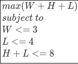
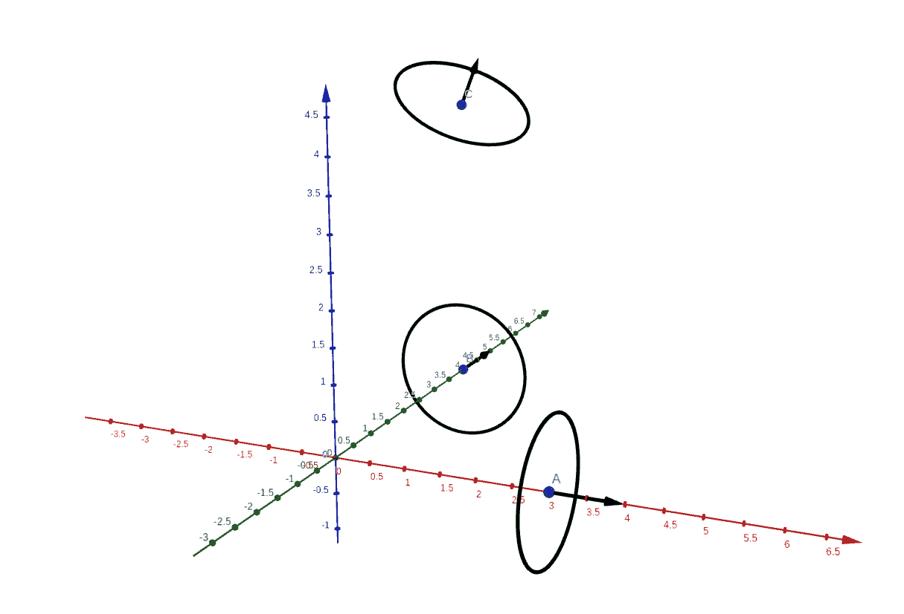
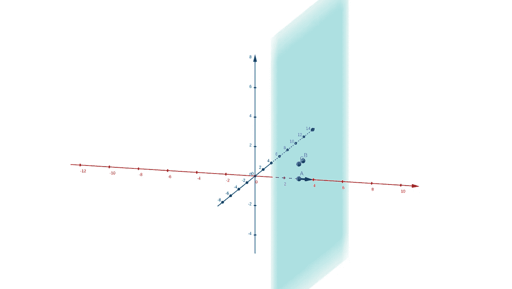
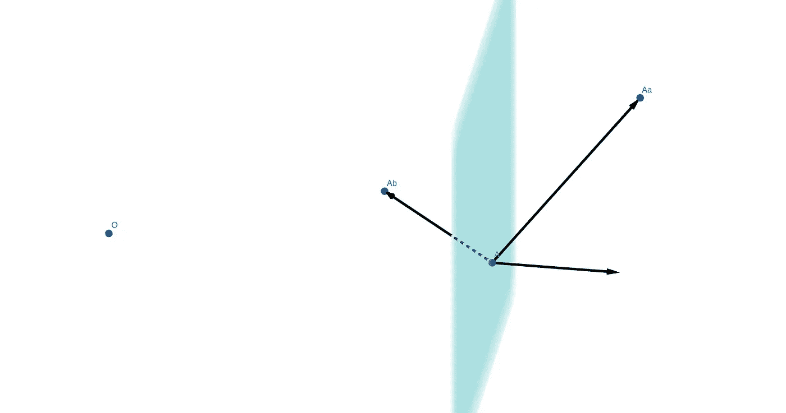
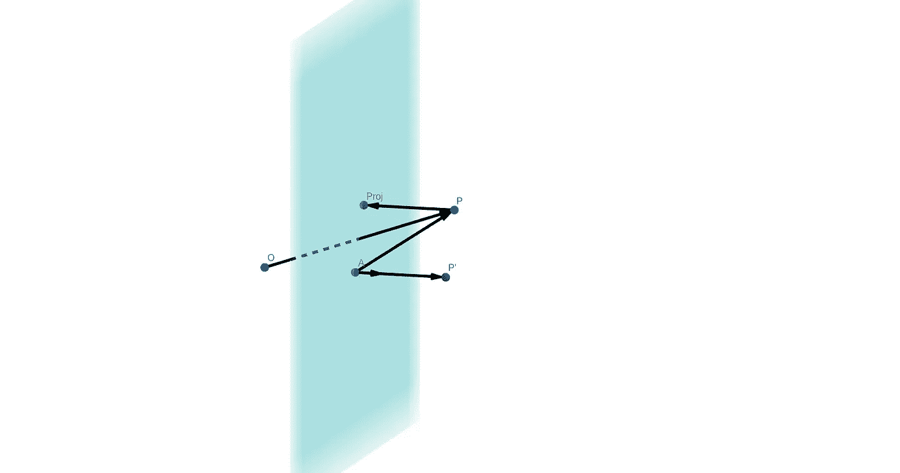

# 使用几何构建约束条件下线性优化的迭代求解器

> 原文：<https://towardsdatascience.com/building-an-iterative-solver-for-linear-optimization-under-constraints-using-geometry-d8df2a18b37e>

由[digity Marketing](https://unsplash.com/@diggitymarketing?utm_source=medium&utm_medium=referral)在 [Unsplash](https://unsplash.com?utm_source=medium&utm_medium=referral) 上拍摄的照片

# 数据科学家的强大工具

优化是数据科学中的常用工具，最常用的方法之一是线性方法。

尽管不是每个优化问题都可以用线性的方式来表述，但是在很多情况下，可以用线性的方式来重写。

在这篇文章中，我们将使用迭代方法，为约束条件下的线性优化从头开始编写一个求解器。

# 配料

在约束条件下形式化优化时，需要考虑三个主要因素:

*   一组变量:这些是我们在优化过程中想要确定的量。
*   目标:这是一个公式，它结合了变量，表达了一些我们想要最大化或最小化的值。由于我们把自己限制在线性优化的情况下，这个目标必须是变量的线性组合。
*   一组约束:这些约束将限制变量的可能值。同样，这些约束必须用线性公式表示。

例如，变量可以是矩形长方体的高度`H`、重量`W,` 和长度`L` 。目标可以是这个立体的维度之和:`W + H + L`，我们可以对变量添加一些约束，比如`W < 3`和`L < 4.`

从数学上来说，这可以写成:

作者的系统

解决这个问题相当容易。可以手动完成。解决方案在于最大化`W`和`L`，并推导出`H`，即:`W = 3`、`L = 4`和`H = 4`，因此长方体尺寸之和为`S =3 + 4 + 4 = 11.`

# 将问题可视化

在进入数学细节之前，让我们试着用图形形象化我们的问题，以便我们得到一些见解。

由于我们面临一个三维问题，即我们有三个变量:`W, L and H`，我们可以使用 3D 几何。

前两个约束很容易想象。第一种，将解空间限制在所有 3D 点都在`W = 3`定义的平面之下的 3D 空间。第二种方法将解空间限制在由`L = 4`定义的平面下方的所有 3D 点。

第三个问题处理起来有点复杂，但是如果我们使用下面的数学公式重新编写它:`<(W, L, H), (1, 1, 0)> <= 8`，其中运算符`<., .>`是点积，看起来这个约束将长方体的维度投影到向量`(1, 1,0)`上，并且这个投影的分量之和必须小于 8。

用最小距离解释该投影的另一种方式是将该矢量`(1, 1, 0)`视为平面图的(非标准化)法向矢量。因此，再一次，这第三个约束可以从几何学上解释为一个计划。

下图通过用一个法向量将平面图绘制成一个圆来说明这一点。

解空间，三个约束表示为边界平面。作者图。

上图中，`A = (3, 0, O)`和法向量`u = (1, 0, 0)`具体化了第一个约束`W <= 3`；`B = (0, 4, 0)`和`v = (0, 1, 0)`实现第二个约束，而`C = (0, 4, 4)`。

# 解决问题

## 迭代方法

让我们首先想象我们正在尝试无约束地优化目标`W + H + L`。即使这个目标相对于`W, H and L`是线性的，我们仍然可以使用最速下降法。

在线性情况下，如果没有约束，使用这种方法是不相关的，尤其是因为系统是无界的，所以没有解。然而，我们将在下一节中看到如何在这个迭代方法中集成约束。

这种最速下降法很简单，而且是纯几何的:想法是计算一个函数的梯度，并在梯度的方向上稍微移动。这里梯度是常数，是矢量`(1, 1, 1)`。下面的代码说明了这种方法:

简单最速上升代码。作者代码。

在这段代码中，`weights`包含了渐变，如同在线性公式中一样，渐变只是线性组合的权重。`x_0`为初始值，`delta`定义步长。

注意停止准则是基于收敛的。在这种情况下，没有约束，系统永远不会收敛。目标会无限增加。

## 检测不满足的约束

在这一步，我们需要能够做的是确定一个点是否在一个平面之下。一个平面可以用一个点`A`和一个法向量`n`来定义。按照惯例，如果一个点位于半空间中，指向法向量的方向，我们就说这个点在平面之上。相反，如果一个点在另一半空间中，它就被认为在平面下。

下图说明了用`W = 3`定义的平面:

绿色平面由点 A 和法向量定义。作者的情节。

给定这两条信息，通过涉及点积的计算，就有可能知道一个点是在平面之上还是之下。

让我们考虑下图中的两点`Aa`和`Ab`:

相对于法向量，Ab 在平面下方，而 Aa 在平面上方。作者图。

记住，当在一个向量和一个归一化向量之间做点积时，如果两个向量指向相同的方向，那么产生的标量将是正的，而如果它们指向相反的方向，那么它将是负的。

因此，为了知道`Ab`是否在平面之下，只需要在法向量`n`和连接`A`和`Ab`的向量`AAb`之间执行点积。

如上图所示，这两个向量指向相反的方向，因此`Ab`位于此处定义的平面下方。

对面`Aa`在飞机上方。

下面的截图解释了如何使用 NumPy 在 python 中实现这一点:

检测一个点是在平面的下面还是上面。作者代码。

## 强制约束

将线性约束正式定义为一个平面，由一个点和一个法向量定义，我们就有了必要的工具来检测不满足的约束。

我们现在需要的是一种强制约束的方法。从几何学上讲，这意味着我们需要一种方法来将所考虑的点移动到平面上。即我们需要将该点投影到平面上。

再一次，点积可以帮助我们。如上所述，法向量`n`与连接`A`和兴趣点`P`的向量之间的点积符号告知我们`P`相对于平面的位置。

但更重要的是，如果法向量`n`已经归一化，这个点积就给了我们平面和点`P`之间的距离。知道了这一点，将`P`投影到平面上简单地归结为将`P`向矢量`n`的相反方向移动由点积给出的量。

一张图胜过千言万语，我们来看看下图:

在由 A 和 n 定义的平面上投影一个点 P。

点`P'`已经通过在法向量上的投影`P`获得。投影`P`以得到它的投影`Proj`是通过使用向量`P’A`平移 P 简单完成的。

用 python 写的，给出了:

投影代码。作者代码。

请注意，这个函数`project`在数学上实际上是一个投影仪，因为`project(project(P))`等于`project(P)`。这是投影仪的数学定义。

## 把所有的放在一起

我们现在有三种工具可供使用:

*   收敛到最优解的迭代方法
*   用于检测约束是否得到充分尊重的函数
*   必要时强制遵守约束的投影器。

在约束条件下最大化目标的算法非常简单:

1.  我们使用最陡下降法，沿着梯度向最优方向移动
2.  我们确保约束得到遵守
3.  如果不是，则实施约束
4.  迭代，直到我们已经收敛，即，直到该点停止移动。

在 python 中，这给出了:

使用迭代方法优化系统。作者代码。

为了简化问题的描述，我们引入了一个`Constraint`对象，它用一个向量、一个点和一个间隙定义了一个约束。间隙表示约束相对于平面的距离。

我们还引入了一个函数`normalize_constraint`，以确保法向量是酉的，即我们确保它的范数是 1.0。

正如您所看到的，这个基本求解器收敛于最优目标，并提出预期的解决方案。

# 好吧，这在 3D 中是可行的，但是更高维度呢？

到目前为止，我们一直使用 3D 几何，以方便理解。然而，我们上面所做的一切可以立即推广到任何 n 维空间，其中`n ≥ 3`。

这可以通过将约束视为`n-dimensional`空间的超平面，即`n-1`维度对象来实现。

例如，如果我们使用一个 4 维的超立方体，而不是我们的 3D 立方体，我们会得到下面的代码，其中只有问题定义发生了变化:

我们增加了另一个维度:`Z`，并对其进行简单约束，即`Z <= 5`。因此，最大目标现在是`3 + 4 + 4 + 5 = 16`，求解器找到了。

# 结论

在这篇文章中，我们提出了一种几何的和容易理解的方法来解决约束下的线性问题。

如果你看一下关于这个主题的文献，你会发现还有许多其他方法可以解决这类问题。特别是，还有另一类方法，基于工作方式完全不同的单纯形法。

这种方法有一些优点，其中之一是精度，因为与这里提出的方法相反，它不收敛到解，而是找到解。

这也是一类较少受病态问题影响的方法。

然而，迭代方法，如这里介绍的一个，具有更有效的优势，并允许控制精度和时间消耗之间的权衡。