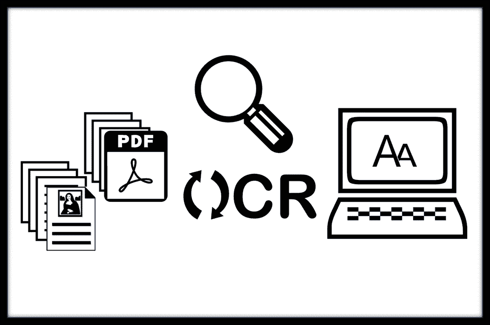
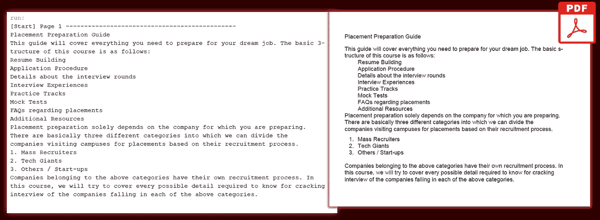
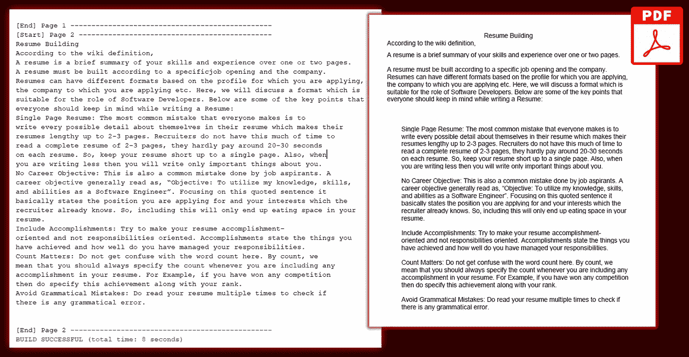

# 使用 Tess4J 构建 OCR 原生应用程序工具—只需 3 个步骤即可从 PDF 中提取文本

> 原文：<https://towardsdatascience.com/building-an-ocr-native-application-tool-with-tess4j-extract-text-from-pdf-in-just-3-steps-a51d28e16084>

## 探索 Tess4J 的第二部分。完整的源代码(Java SDK 1.8)和应用程序链接包括在内。

> 没有 Digitisation❞就没有❝Digitilisation

随着越来越多的企业和政府实体接受更高效的信息交换概念，并利用其数据的内在价值进行建设性分析，这一说法变得越来越正确。



作者图片| OCR 是一个文本提取工具，它将图形内容转换成计算机可读的格式

降低数字化管理成本的最关键工具之一是 [**光学字符识别**(**OCR)**](https://viso.ai/computer-vision/optical-character-recognition-ocr/)**——将图像、扫描文档和 PDF 文档等图形媒体转换为计算机可读格式。因此，我决定使用流行的开源 OCR 引擎 [Tesseract-OCR](https://github.com/tesseract-ocr) 探索一系列可能性**

# **项目背景信息**

**我过去在实现 Tesseract OCR 方面的一些尝试是以 [TesseractJS](https://tesseract.projectnaptha.com/) 的形式出现的，这是 OCR 引擎的一个纯 JavaScript 端口*(请参考下面的文章了解完整的细节)*:**

**<https://javascript.plainenglish.io/build-a-text-to-speech-app-using-client-side-javascript-98cd72df73bb>  </build-an-image-pdf-text-extraction-tool-with-tesseract-ocr-using-client-side-javascript-6126031001>  

然而，最近我决定使用[Tess4J](http://tess4j.sourceforge.net/)(Java 中的 [Tesseract-OCR](https://github.com/tesseract-ocr) )作为利用 Tesseract 的 OCR 引擎的替代方法。作为我最近尝试使用 Tess4J 进行图像到文本转换的后续工作，我的学习之旅的第二部分将展示 Tess4J 的内置组件来对 PDF 文档执行文本提取。此外，这也是对第一部分中开发的早期原型的补充:

</build-a-portable-ocr-tool-in-4-steps-with-tess4j-jar-a-tesseract-wrapper-for-java-6d1be3f0cb3d>  

# 用 Tess4J 构建 PDF 文本提取功能

## 先决条件步骤

在深入研究其技术实现之前，请确保已经具备了使用 Tesseract 的 Java 应用程序的最小化设置。所有 JAR 依赖项与第一部分**完全相同。**

关于如何使用 Tesseract 设置 Java 应用项目的详细信息，请参考第一部分</build-a-portable-ocr-tool-in-4-steps-with-tess4j-jar-a-tesseract-wrapper-for-java-6d1be3f0cb3d>****。****

**此后，Java 项目应该如下所示:**

****

**作者截图| JAR 依赖项列表在上图中用黄色框突出显示。**

**为了简单起见，这个 Java 项目的名称被指定为 **Tess4jOcrApp** 。请注意，在上面的黄色框中，库:`pdfbox-2.0.3.jar` `pdfbox-tools-2.0.3.jar` `fontbox-2.0.3.jar`是由 OCR 引擎读取和处理 PDF 文档页面所需的主要依赖项。**

**(**注意:** [flatlaf-2.4.jar](https://github.com/incubated-geek-cc/Tess4JOcrApp/blob/main/app/lib/flatlaf-2.4.jar) 是可选的，因为它是 Java Swing GUI 的实用程序，而不是 OCR 依赖项。)**

## **技术实施步骤**

**为了更好地连接**第一部分**和当前实现之间的点，**第二部分**将从与**第一部分**完全相同的代码模板开始，如图所示:**

**Author | Template 的代码片段类似于第一部分从文本中提取图像的代码片段。|在 main 方法中，应该实现从 pdf 文档中提取文本。**

> **第一部分只展示了从图像中提取文本，而第二部分旨在读取 PDF 文档并输出从页面中提取的所有文本内容。**

****步骤一。**设置好镶嵌实例的数据路径后，继续初始化类别`PDDocument`和`PDFRenderer`:**

```
PDDocument document = PDDocument.load(new File("sample.pdf"));
PDFRenderer pdfRenderer = new PDFRenderer(document);
```

****第二步。**通过调用`getNumberOfPages()`获取 PDF 中总页数的值，并继续创建一个 for 循环，如下所示:**

```
int totalNoOfPages = document.getNumberOfPages();
int imageDPI = 300;
for (int p = 0; p < totalNoOfPages; p++) { // FOR-EACH PAGE

}
```

****注意要点:****

*   **Tesseract OCR 实现最佳性能的理想分辨率是 **300DPI —** `imageDPI`**
*   **由 Tesseract 类调用的`doOCR()`方法接受不同类型的参数，例如— `File`(在第一部分中)以及`**BufferedImage**`。在下一步中，每个 PDF 页面将被检索并转换为类型`**BufferedImage**`用于数据提取。**

****第三步。**最后，在初始化来自**步骤 1** 和**步骤 2** 的所需变量后，`PDFRenderer`类继续调用函数`renderImageWithDPI()`来提取 PDF 文件中位置`p`处的文档页面。`renderImageWithDPI()`的返回类型为`**BufferedImage**`(变量名为`**tempPageBimg**`)。`**tempPageBimg**` 然后被解析为`doOCR()`，文件处理开始。在完成此页面的 OCR 提取后，将对其他页面分别进行相同的迭代，直到 PDF 文档中的所有文本内容都被输出以供显示。**

****仅供参考:这是所有 3 个步骤**的完整代码片段(演示输入文件可在 [pdf_sample.pdf](https://github.com/incubated-geek-cc/Tess4JOcrApp/blob/main/app/sample_data/pdf_sample.pdf) 中检索) **:****

**作者的代码片段|输入 PDF 文件[sample.pdf](https://github.com/incubated-geek-cc/Tess4JOcrApp/raw/main/app/sample_data/sample.pdf)总共有 2 页，每一页都是通过 Tesseract 实例作为 BufferedImage 提取的**

****

**作者提供的图像|文档的第 1 页已由应用程序成功处理|右图:带有红色轮廓的图像指的是原始 PDF 页面内容**

****

**作者提供的图像|文档的第 2 页已由应用程序成功处理|右图:带有红色轮廓的图像指的是原始 PDF 页面内容**

> **最后，PDF 转文本提取工具已经成功创建并可以使用了！🤩**

## **(可选)文本提取工具的用户界面**

**与第一部分类似，我选择用 Java Swing 的 GUI 工具包构建一个[图形用户界面(GUI)](https://www.britannica.com/technology/graphical-user-interface) ，并添加了第二部分的功能:**

****

**作者截屏|展示文本提取工具的 GUI 和功能|请注意，此版本的应用程序支持每次上传多个图像。|每次上传只能处理 1 个 PDF 文档。**

****参考消息:**完整的源代码可以从我在 [Tess4JOcrApp](https://github.com/incubated-geek-cc/Tess4JOcrApp) 的 Github repo 中检索到。GUI 应用程序的第 1 版和第 2 版都在同一个回购中提供，因此请随时到⭐和🔱它！**

**现在你知道了！非常感谢你坚持到这篇文章的结尾！❤如果你觉得这篇文章有用，那么请随时[关注我的媒体](https://medium.com/@geek-cc)并继续关注我的另一个即将到来的宠物项目！会非常感激—😀**

**— 🌮请给我买一份玉米卷🎀˶❛◡❛)**

**<https://geek-cc.medium.com/membership> ****