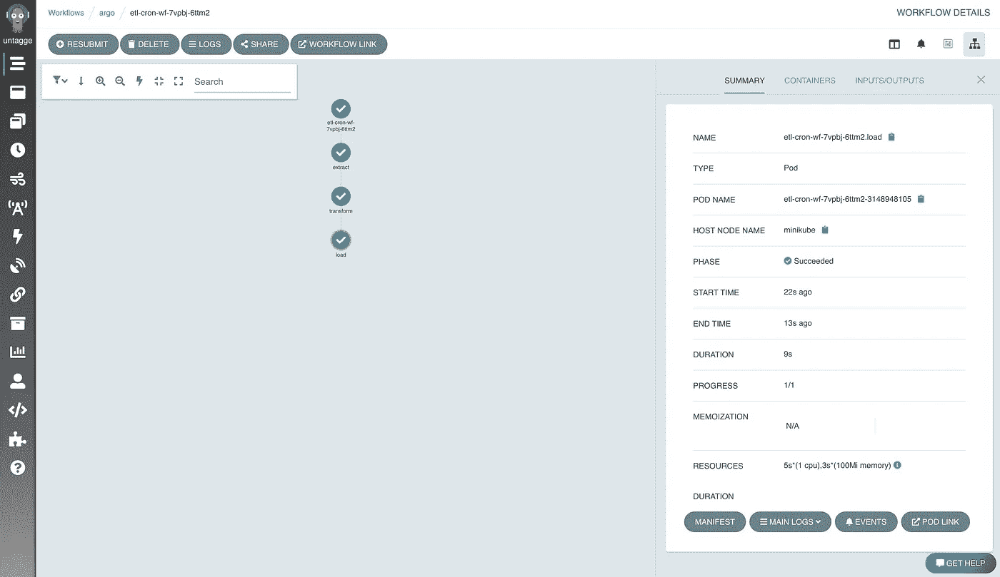
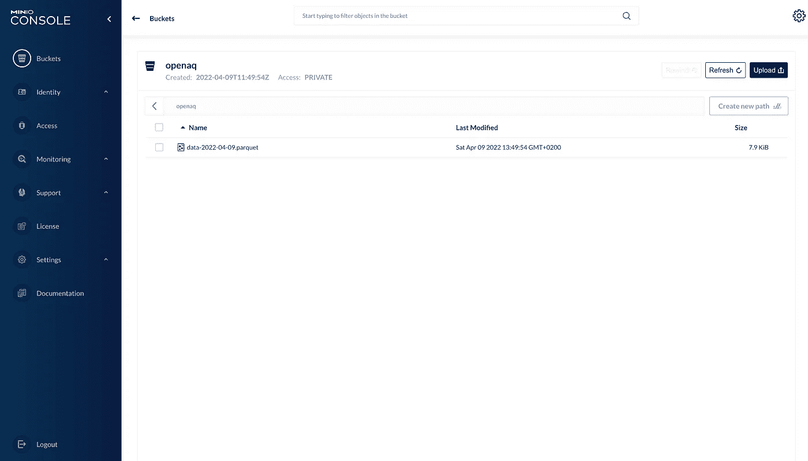

# 构建开源 ML 管道:第 1 部分

> 原文：<https://towardsdatascience.com/building-an-open-source-ml-pipeline-part-1-5b52d06351d1>

## 开始使用我们的管道——数据采集和存储。


亨特·哈里特在 [Unsplash](https://unsplash.com?utm_source=medium&utm_medium=referral) 上的照片

**1。简介**

在这一系列的文章中，我感兴趣的是尝试将一个考虑到现代 MLOps 实践的基本 ML 管道放在一起。自然地，在这些项目的开始，我们列出了一个需求列表，那么我们希望我们的管道做什么呢？

*   自动检索用于模型训练和推理的数据。
*   在模型推断之前验证数据。
*   为我们的模型自动搜索超参数。
*   自动化模型存储和指标跟踪。
*   持续交付训练好的模型。
*   模型监控。
*   自动化模型再训练。

我们可以使用哪些工具来完成这些事情？我不敢说这是做事的最佳方式，但我认为这是一个不错的开始。我们将使用 [Argo 工作流](https://argoproj.github.io/argo-workflows/)作为我们系统的主干。有了 Argo，我们可以定义操作的有向无环图(DAGS ),这将有助于我们建立数据管道。为了存储我们的数据，我们将使用 [Minio](https://min.io/) 。为了验证数据，我们将使用 [Great Expectations](https://greatexpectations.io/) ，一个用于数据验证的 python 工具。我以前写过一篇关于结合 Argo 和远大前程的文章，你可以在这里找到。对于超参数优化，我们将利用 Argo 的能力来运行并行管道步骤和动态扇出/入。对于模型存储和指标跟踪，我们将利用 [MLflow](https://mlflow.org/) 。作为一个特色商店，我们将使用[盛宴](https://feast.dev/)。对于模型监控和连续交付，我们将使用 [Seldon Core](https://github.com/SeldonIO/seldon-core) 最后，为了自动化模型重新训练和处理其他基于事件的依赖关系，我们将使用 [Argo Events](https://argoproj.github.io/argo-events/) 。一切都将部署在 minikube 集群上。我会尽我所能地讲述整个过程，并对工具的选择保持透明。

**2。入门**

我们管道的一个构件是 Minio 对象存储。为什么是米尼奥？Minio 是免费的，非常容易使用。同样，你也没有理由不能用你的应用程序的任何云对象存储来代替 Minio。

我假设一开始就安装了 [minikube](https://minikube.sigs.k8s.io/docs/start/) 、 [kubectl](https://kubernetes.io/docs/tasks/tools/) 、 [argo 命令行工具](https://github.com/argoproj/argo-workflows/releases/tag/v3.3.1)和 [helm](https://helm.sh/docs/intro/install/) 。这给了我们一个起点，来生成我们将需要的所有 kubernetes 资源，以形成一个有效的 ML 管道。

让我们开始我们的 minikube 集群:

```
minikube start --cpus 4
```

我的实例有 4 个可用的 CPU 和大约 8 Gb 的内存。

接下来，让我们使用 Bitnami helm 图表部署 Minio:

```
kubectl create ns mlops
helm repo add bitnami [https://charts.bitnami.com/bitnami](https://charts.bitnami.com/bitnami)
helm repo update
helm install minio bitnami/minio --namespace mlops
```

按照 shell 中显示的说明获取您的凭据，并将它们存储在某个地方！

接下来，让我们设置 Argo 工作流。我们可以使用他们的快速启动安装来实现。

```
kubectl create ns argo 
kubectl apply -n argo -f https://raw.githubusercontent.com/argoproj/argo-workflows/master/manifests/quick-start-postgres.yaml
```

现在我们应该有一个 Argo 工作流的工作安装。

按如下方式获取您的登录令牌(我们稍后会用到):

```
SECRET=$(kubectl -n argo get sa argo -o=jsonpath='{.secrets[0].name}')
ARGO_TOKEN="Bearer $(kubectl -n argo get secret $SECRET -o=jsonpath='{.data.token}' | base64 --decode)"echo $ARGO_TOKEN
```

**3。提取、转换、加载**

好了，我们已经准备好了核心工具，可以在非常基本的 ETL 管道上工作了。我们将从 [OpenAQ](https://openaq.org/#/) API 获取数据。对于个人项目来说，OpenAQ 是一个很好的资源，API 可以提供世界各地城市的空气质量数据。

我们将把我们的数据检索管道组织成三个部分。

1.  从 OpenAQ API 获取 JSON 格式的数据。
2.  将数据转换为 Pandas Dataframe 并估算缺失值。
3.  将 Pandas Dataframe 保存为拼花文件并加载到 Minio bucket。

下面列出了这些步骤的脚本:

简而言之，我对 OpenAQ 进行 API 调用，以获取奥地利维也纳市的空气质量数据。该调用针对前一天到当天的所有数据。计划是制作一个 Cron 工作流，在晚上执行我们的 ETL 管道。对于转换，我们将 JSON 响应转换为 Pandas 数据帧，并删除所有包含 NaN 值的行。最后，在加载部分，我们将数据作为一个 parquet 文件上传到我们的 Minio 实例。现在是有趣的部分！设置我们的 Argo 工作流 CronJob。

**4。阿尔戈**

设置 [Cron 工作流](https://argoproj.github.io/argo-workflows/cron-workflows/)对我来说是新的，所以我很想听到任何反馈。该工作流应该在每天凌晨 1 点运行。有趣的是，当我提交它时，我收到一条消息说它将在凌晨 3 点运行，因为我的本地时间与 UTC 有偏差。

您可以使用 Argo 命令行工具提交此工作流:

```
argo -n argo cron create ETL.yaml
```

现在进入 Argo UI，我们可以提交 Cron 作业来测试它。希望你也看到绿色支票！



图片作者。

并且应该已经在我们的 Minio 对象存储中创建了一个文件。



图片作者。

所以这是 ML 流水线的第一步。获取数据，对其进行简单的转换，并存储起来以备将来使用。在下一篇文章中，我想设置 Argo 事件来触发基于这个 Minio 桶中出现的新文件的工作流！敬请关注。

*在这里* *找到系列* [*的第二部。*](/building-an-open-source-ml-pipeline-part-2-29a8dcbc7620)