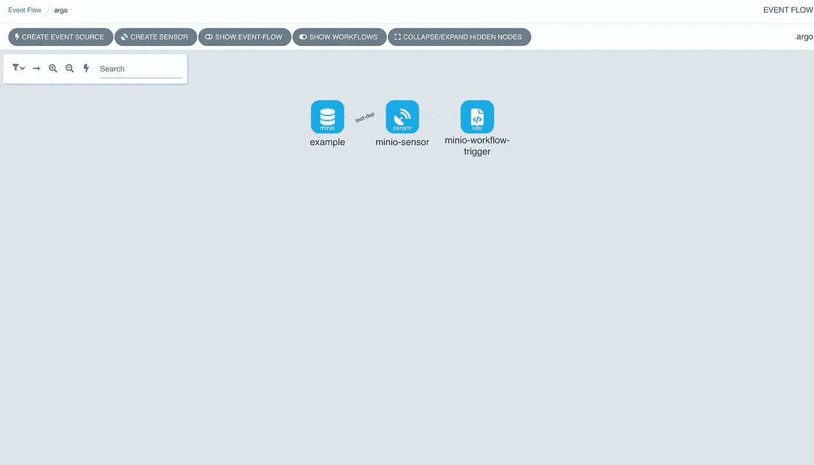
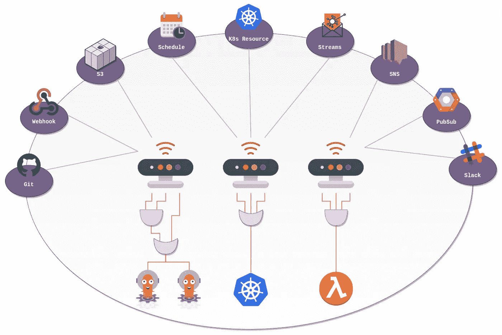
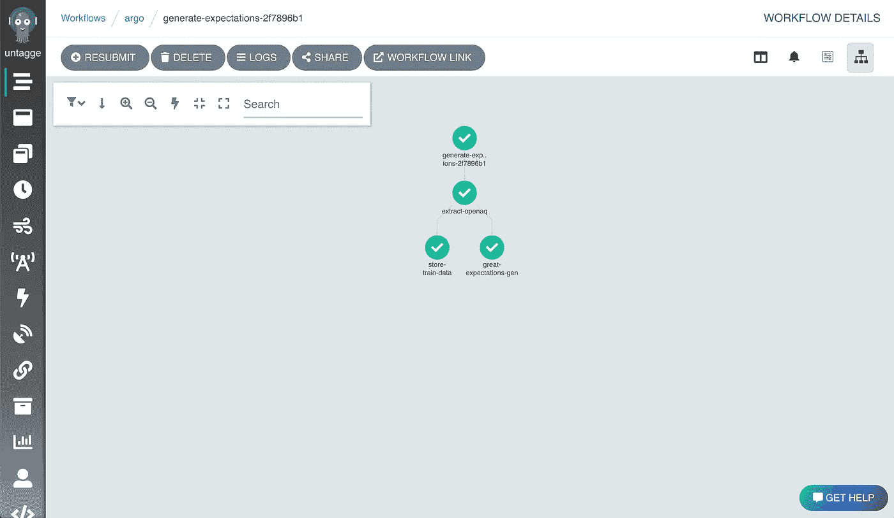

# 构建开源 ML 管道:第 2 部分

> 原文：<https://towardsdatascience.com/building-an-open-source-ml-pipeline-part-2-29a8dcbc7620>

## 用 Argo 事件和 Argo 工作流进行事件驱动的数据处理。

**1。设置 Argo 事件**

为了建立事件驱动的工作流，我们需要向我们的工具包添加另一个工具，即 [Argo Events](https://argoproj.github.io/argo-events/) 。设置 Argo 事件可能有点棘手，但是我在 Github [这里](https://github.com/lambertsbennett/mlops-odyssey)提供了必要的 YAML 文件。我们将从他们的例子中的一个例子开始，只是为了确保一切都正确安装。因此，一旦您克隆了存储库，就可以随意查看这些清单的内容。就修改而言，您需要用自己的凭据替换' minio-secret.yaml '中的 base64 编码凭据，以便事件源能够工作。

```
kubectl apply -f argo-events.yaml -n argokubectl apply -n argo -f https://raw.githubusercontent.com/argoproj/argo-events/stable/examples/eventbus/native.yamlkubectl apply -f minio-secret.yaml -n argokubectl apply -f minio-event-source-example.yaml -n argokubectl apply -f minio-sensor-example.yaml -n argo
```

您可能已经注意到，在 Argo 工作流中，侧边栏中有一个与事件相关的标签。如果您现在导航到那里，您应该会得到一个关于服务帐户无法列出该类别中的资源的错误。这是因为默认的 Argo 工作流角色不考虑 Argo 事件。要修复此运行，请执行以下操作:

```
kubectl apply -f argo-role.yaml -n argo
```

现在，当您导航到 events 选项卡时，您应该会看到与此类似的内容。这是我们的示例事件源->传感器->触发器设置。当我们将一个文件放入“openaq”桶时，它会触发一个 whalesay 工作流，打印上传文件的文件名。



Argo 用户界面中概述了我们的示例事件源。图片作者。

这是一个很大的 YAML，所以让我们后退一步，谈谈 Argo 事件如何工作，每个文件在做什么。Argo events 的工作原理是将'[事件源](https://argoproj.github.io/argo-events/concepts/event_source/)与包含'[触发器](https://argoproj.github.io/argo-events/concepts/trigger/)'的'[传感器](https://argoproj.github.io/argo-events/concepts/sensor/)连接起来。事件源使用来自外部源的事件。在我们的例子中，当一个文件被放入“openaq”桶时，我们的事件源正在消耗由 Minio 生成的通知。传感器侦听特定的事件源，并定义当事件发生时应该发生什么(这是触发器，在我们的情况下，我们部署 Argo 工作流)。Argo Events 确实是一个很酷的框架，我们在这里使用 Minio 作为事件源，但它也可以很容易地成为 Kafka 主题或 Redis pubsub 事件。



图片来自[https://argoproj.github.io/argo-events/](https://argoproj.github.io/argo-events/)。

我们需要用触发器模板定义事件源和传感器。为了测试，我使用了来自 [Argo Events Github 页面](https://github.com/argoproj/argo-events/tree/master/examples)的示例事件源和传感器文件。起初有一些问题，但是我打开了一个 Github 问题，几天之内就解决了。团队的响应时间令人印象深刻！现在，如果您向前移植并访问 Minio bucket，您就可以上传一个文件，您应该会看到示例事件在运行。

我们将回到 Argo 事件并定义我们的预处理模板，但是首先我们需要为数据验证生成一个期望套件。为此我们将寄予厚望。我以前写过一篇关于在 Argo 工作流中使用 Great Expectations 的文章，很多内容都是从[那里](/data-validation-with-great-expectations-and-argo-workflows-b8e3e2da2fcc)摘录的。

**2。在 Argo 工作流中生成期望套件**

为了生成我们的期望套件，我们需要从 OpenAQ API 中提取代表性数据。为了做到这一点，我们将尽可能早地获取 API 允许的数据，然后生成我们的期望套件。原则上，这些数据应该与我们用来训练模型的数据相同，所以我会将这些数据保存到我们的 Minio“数据湖”中，以备将来使用。我们可以利用 Hera 为此生成一个工作流，这让生活变得更加美好。我们也可以利用第 1 部分中的提取和转换函数，只需稍加修改。*这里未来要做的是参数化提取函数，这样我们就不需要硬编码 API 调用的开始和结束日期。*我们需要为数据验证工作再创建两个 Minio 桶，因为我们不想在上传远大前程文件时触发 Argo 事件管道。我创建了一个名为“验证”的桶和一个名为“训练”的桶。我们将在“验证”中存储我们的远大前程套件，在“训练”中存储原始数据。总之，从 OpenAQ 数据中生成期望值的代码如下所示:

在这里，我们利用 Argo Workflow 的能力，通过定义任务在各行中的顺序来运行并行任务:

```
extract_task >> ge_task
extract_task >> store_task
```

在运行代码之前，确保您正在本地主机:2746 上端口转发 Argo 服务器，在本地主机:9000 上端口转发 Minio。提交后，您应该能够在 Argo 用户界面中看到成功的管道运行:



图片作者。

**3。设置我们的事件驱动管道。**

在这个管道的最后一次迭代中，我们希望能够基于模型度量触发模型重新训练。为此，我认为最灵活的选择是创建一个 webhook 事件源。这意味着我们可以使用 http 请求触发 argo 工作流。简而言之，我们的工作流程如下所示:

*   在 http 触发时，检索历史 OpenAQ 数据。
*   将数据转换成表格格式。
*   为检索到的数据生成一个期望套件。
*   将原始数据存储在我们的“train”Minio 桶中。

从那里，我们可以设置一个 Minio 事件源，它将触发一个模型训练管道。这一点我们将在下一篇文章中介绍！

为了避免在 YAML 编写我们的管道，我们将使用 Argo 工作流 CRD，工作流模板。我们可以在 Python 中使用 [Hera](https://github.com/argoproj-labs/hera-workflows) 定义工作流模板，然后在 Argo 事件定义中引用工作流模板。

在 Hera 中，从工作流切换到工作流模板非常容易。为了完整起见，下面是完整的代码，但我将重点介绍具体的更改。

更改发生在导入和第 180–181 行。

```
ws = WorkflowTemplateService(host="https://localhost:2746", verify_ssl=False, token=TOKEN)w = WorkflowTemplate("generate-expectations", ws, namespace="argo")
```

现在剩下的就是定义我们的 webhook，每当它接收到 post 请求时就提交这个工作流模板。

首先让我们定义我们的 webhook 事件源。

这里我们创建一个名为 retrain 的 webhook，它在端点/retrain 和端口 12000 上公开。接下来，让我们创建我们的传感器:

您可以在这里看到，我们利用了之前通过使用“templateRef”字段创建的工作流模板。如果我们 kubectl 应用这两个文件，那么我们应该有一个准备就绪的 eventsource + sensor 对。

接下来测试设置端口-转发 eventsource pod。

```
kubectl -n argo port-forward webhook-eventsource-{randomstring} 12000:12000
```

然后，我们可以通过向/retrain 端点处的 pod 发送 post 请求来简单地测试它。我学到的一件有趣的事情是，为了正确触发工作流，我必须包含虚拟数据，即使它没有参数。

```
curl -d '{"dummy":"dummy"}' -H "Content-Type: application/json" -X POST http://localhost:12000/retrain
```

现在我们有了一个设置，可以用事件驱动的方式启动我们的管道。我们将继续以同样的方式建立我们的渠道。在下一篇文章中，我们将重点关注模型训练过程，以及我们如何将 Argo 工作流与 MLflow 结合起来进行模型训练、实验跟踪和模型存储。