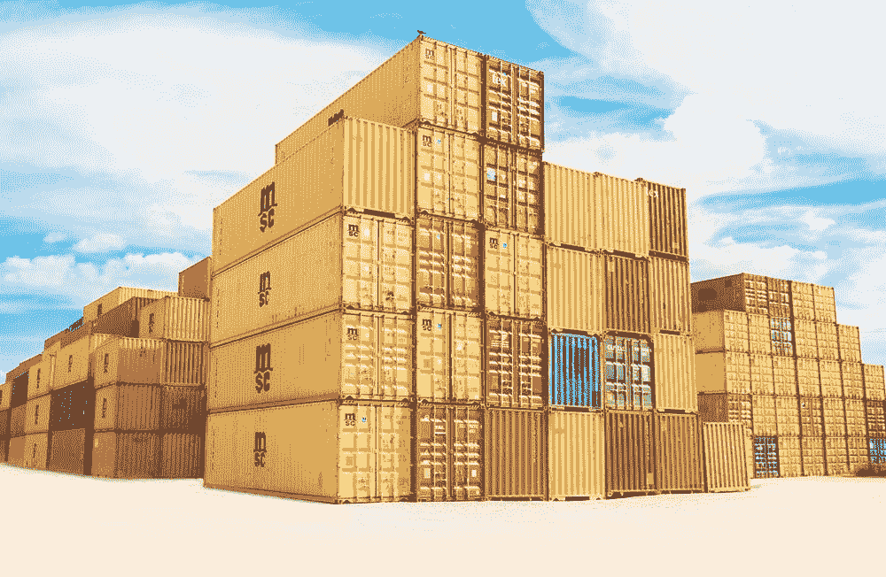
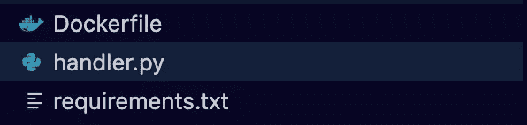
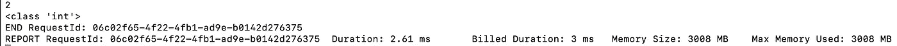

# 构建 AWS Lambda 容器映像

> 原文：<https://towardsdatascience.com/building-aws-lambda-container-images-5c4a9a15e8a2>

## 打包 Lambda 代码和依赖项

图片来自弗兰克[麦凯纳](https://unsplash.com/@frankiefoto)拍摄的 [Unsplash](https://unsplash.com/photos/tjX_sniNzgQ)

[AWS Lambda](https://aws.amazon.com/lambda/) 函数非常强大，是无服务器应用程序的核心构件之一。它们可以用来将你的整个应用程序缝合在一起，而且通常在 Lambda 函数上，你需要**为你的项目安装额外的依赖项**。Lambda 不支持某些现成的包/库，您需要找到一种方法在该环境中安装这些依赖项。

解决这个问题的一个方法是创建一个包含函数依赖项的[部署包/zip 文件](https://docs.aws.amazon.com/lambda/latest/dg/python-package.html)。这是可行的，但是一个更干净和直观的替代方法是将所有这些打包在一个[容器映像](https://docs.aws.amazon.com/lambda/latest/dg/python-image.html)中。我们可以使用 AWS [提供的基础图像](https://docs.aws.amazon.com/lambda/latest/dg/runtimes-images.html#runtimes-images-lp)来进一步简化这个过程。在本文中，我们将研究如何获取其中一个基础映像，并在此基础上为我们的 Python Lambda 函数安装一个包。我们将构建一个简单的 [NumPy](https://numpy.org/) 示例，您可以根据自己的示例进行调整。

**注意**:对于那些刚接触 AWS 的人来说，如果你想跟进的话，请确保你在下面的 [**链接**](https://aws.amazon.com/console/) 中做了一个账户。在开始之前，一定要安装 Docker。本文还假设您对 Python 和 AWS 有基本的了解。

## 1.设置

对于我们的例子，我们需要三个主要文件:Lambda Python 函数、需求文件和 docker 文件。

所需文件(作者截图)

对于我们的 requirements.txt，我们需要的只是 NumPy 包。我们将使用传入的示例负载执行一个简单的 NumPy 操作。

安装数量

接下来我们有我们的 Python Lambda 函数。在这个 Lambda 函数中，我们将它设置为以一个整数作为输入的样本 JSON。使用 NumPy，我们将捕获这个整数的平方根，并在 Lambda 函数被调用时返回它。

进口

带 NumPy 的平方根

实际上，您的问题的用例将会复杂得多，我们只是在这里进行一个简单的 NumPy 操作，以显示我们的 Lambda 函数正在与我们的附加依赖项一起工作。

我们可以在一个[docker 文件](https://docs.docker.com/engine/reference/builder/)中捕获我们的代码和依赖关系。首先我们抓取 [AWS 基础 Python 图像](https://docs.aws.amazon.com/lambda/latest/dg/python-image.html)。

基础 Python 图像

基础映像在 **LAMBDA_TASK_ROOT** 中提供了一个环境变量。我们可以复制我们的 Python 代码，并在这个目录中安装我们的依赖项。

复制 Lambda 代码

在 Lambda_TASK_ROOT 目录中安装依赖项

然后，我们将 CMD 设置为我们的处理函数，这应该是<filename>。<functioname>用你们各自的价值观。</functioname></filename>

替换为您的文件名和函数名

## 2.容器映像构建

使用 docker 文件，我们可以用下面的命令构建 Lambda 容器映像“numpy-lambda-container”。

构建图像

然后，我们使用 Docker run 命令启动映像。

开始 Docker 图像

现在在同一个目录中打开另一个终端，我们可以 [curl](https://phoenixnap.com/kb/curl-command#:~:text=apt%20install%20curl-,What%20Is%20the%20curl%20Command%3F,to%20be%20sent%20or%20received.) 一个样本数据点来本地调用我们的 Lambda 函数。

示例调用

然后我们在另一个 Shell 中看到结果。

样本结果(作者截图)

接下来，您可以将这个本地映像推送到[弹性容器注册表](https://docs.aws.amazon.com/AmazonECR/latest/userguide/what-is-ecr.html) (ECR)。要将所有这些资源推送到 AWS，您可以使用 AWS [CloudFormation/SAM](/infrastructure-as-code-with-aws-207239573de) 模板来定义和部署您的基础架构。

## 3.其他资源和结论

 [## GitHub-RamVegiraju/Lambda-Container:创建 Lambda 容器映像的示例

### 创建 Lambda 容器图像的示例。为 RamVegiraju/Lambda-Container 开发做出贡献，创建一个…

github.com](https://github.com/RamVegiraju/Lambda-Container) 

有关示例的代码，请查看上面的链接。Lambda 容器映像使得定制 Lambda 函数以适应您的工作流比以往任何时候都更容易。这是一个非常简单的用例，您可以使用它作为构建自己的复杂函数的基础。如果您想了解如何在 Lambda 上部署 ML 模型进行推理，请查看这个 [AWS 样本库](https://github.com/aws-samples/aws-lambda-docker-serverless-inference)。这是另一个伟大的[例子](https://github.com/philschmid/serverless-bert-huggingface-aws-lambda-docker)，在 AWS Lambda 上部署 [BERT](https://arxiv.org/abs/1810.04805) 模型用于无服务器推理。

我希望这篇文章很好地介绍了如何利用 AWS Lambda 的众多特性之一。一如既往，欢迎在评论中留下任何问题和反馈。

*如果你喜欢这篇文章，请在*[*LinkedIn*](https://www.linkedin.com/in/ram-vegiraju-81272b162/)*上与我联系，并订阅我的媒体* [*简讯*](https://ram-vegiraju.medium.com/subscribe) *。如果你是新来的中号，用我的* [*会员推荐*](https://ram-vegiraju.medium.com/membership) *报名吧。*