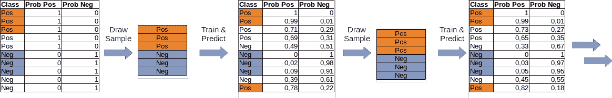
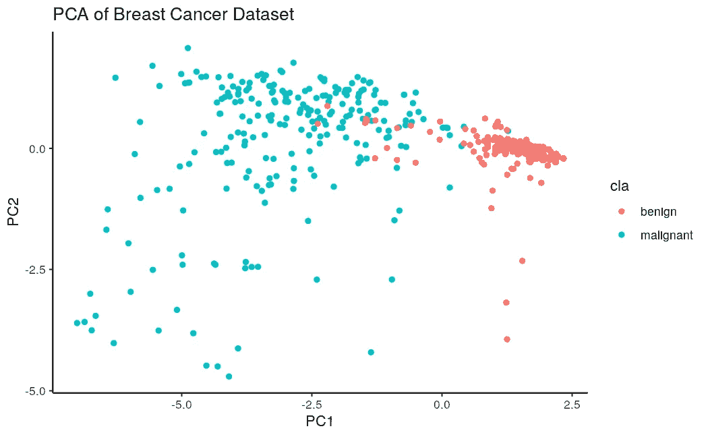
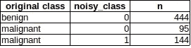
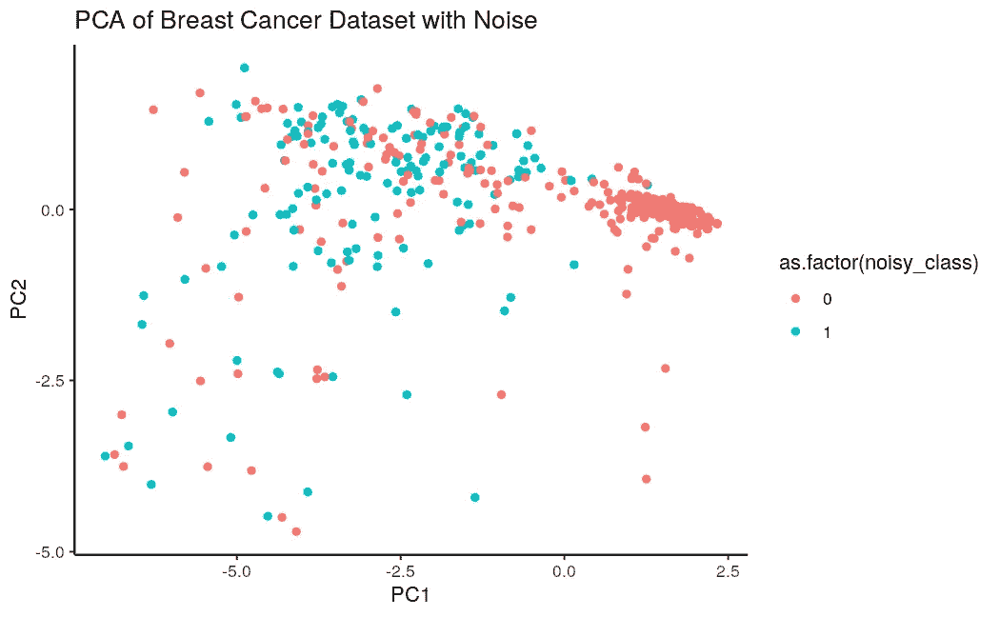
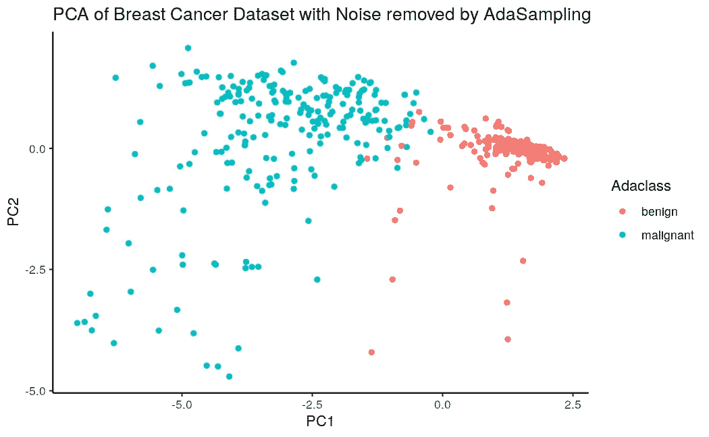

# 用有偏向的类构建分类器

> 原文：<https://towardsdatascience.com/building-classifiers-with-biased-classes-adasampling-comes-to-the-rescue-8212814264e3>

## AdaSampling 来拯救我们

离开 Kaggle 的世界，进入现实世界，数据科学家经常( *read: always* )面临脏数据的问题。除了缺失值、不同单位、重复等等，分类任务的一个相当常见的挑战是数据标签中的噪声。虽然有些噪声问题可以由分析师来解决，但其他问题本质上是有噪声的或不精确的。

考虑以下任务:预测特定蛋白质是否与特定 DNA 序列结合。或者另一个:预测是什么导致了普通感冒。这两个任务有一个共同点，那就是关于负类的知识很少。有数不清的 DNA 序列，只有那些碰巧被分析并作为特定蛋白质的目标发表的序列被认为是阳性的。但其他未发表的序列不一定是否定的。它们可能没有被分析过。普通感冒也是如此:许多病例未被发现，因为只有少数人报告患了感冒。然而，有一种技术可以帮助你应对这一挑战:[杨](https://ieeexplore.ieee.org/document/8329462)等人(2019)提出的自适应采样(AdaSampling)。



AdaSampling 算法，示意性示例。图片作者。

简而言之，AdaSampling 算法执行以下步骤:
1 .从数据集中抽取一个子样本。给定的正/负样本被选择的概率等于它是正/负类成员的概率。*(在图中，突出显示的样本最有可能是任一类别的成员，因此被选择用于建模。)*
2。使用任何底层分类算法(例如 SVM、kNN、ld a 等)构建分类器。).
3。基于该分类模型，预测样本(在完整数据集内)在正/负类中的概率。
4。重复 1-3，直到类别概率没有变化。

基本上，你会得到一张你的类的清晰的图片，并得到关于你的负样本中哪些可能不是负样本的第一个线索。在训练阶段省略这些可以大大提高模型的准确性。

让我们用 r 中的 AdaSampling 包来尝试一下。示例数据集是关于良性和恶性乳腺癌的。

```
#install.packages("AdaSampling")
library(tidyverse)
library(AdaSampling)
library(caret)# load the example dataset
data(brca)
# some cleanup of the dataset
brca$cla <- as.factor(unlist(brca$cla)) 
brca$nuc <- as.numeric(as.character((brca$nuc))) #run a PCA
brca.pca <- prcomp(brca[,c(1:9)], center = TRUE,scale. = TRUE)
# append PCA components to dataset
brca_withPCA <- cbind(brca, brca.pca$x)
# plot
ggplot(brca_withPCA, aes(x=PC1, y=PC2, color=cla)) +
  geom_point() + 
  ggtitle("PCA of Breast Cancer Dataset") +
  theme_classic()
```

原始数据集上的主成分分析如下所示:



图片作者。

我们实际上看到两个很好的分离的类。我们可以在此基础上建立一个“基础事实”分类器。我选择了一个 SVM，得到了 0.96 的精确度和 0.91 的灵敏度(代码如下)。

```
#Separate test set
set.seed(107)
inTrain <- createDataPartition(y = brca$cla,  p = 0.75)
train <- brca[ inTrain$Resample1,]
test  <- brca[-inTrain$Resample1,]ctrl <- trainControl(
  method = "repeatedcv", 
  repeats = 3,
  classProbs = TRUE, 
  summaryFunction = twoClassSummary
)
model_groundTruth <- train(
  cla ~ .,
  data = train,
  method = "svmLinear", # Support Vector Machines with Linear Kernel
  ## Center and scale the predictors for the training
  preProc = c("center", "scale"),
  trControl = ctrl,
  metric = "ROC"
)#predict
predicted_groundTruth <- predict(model_groundTruth, newdata = test)
confusionMatrix(data = predicted_groundTruth, test$cla, positive="malignant")
```

很好。这是一个相当精确的分类器。现在让我们看看 AdaSampling 的实际应用。我们假装时光倒流，回到了某些恶性肿瘤被诊断为良性的时间点。这是一个更真实的场景，因为并非所有被诊断为良性的癌症都会永远如此。

```
#get the classes
pos <- which(brca$cla == "malignant")
neg <- which(brca$cla == "benign")
#introduce 40% noise to malignant class
brca.cls <- sapply(X = brca$cla, FUN = function(x) {ifelse(x == "benign", 0, 1)})
brca.cls.noisy <- brca.cls
set.seed(1)
brca.cls.noisy[sample(pos, floor(length(neg) * 0.4))] <- 0brca$noisy_class <- as.factor(brca.cls.noisy)
brca %>% group_by(cla, noisy_class) %>% tally()
```



图片作者。

我们引入了一个测量误差:95%的癌症会变成恶性的(基本事实),现在被标记为良性的。PCA 看起来极具破坏性:



图片作者。

使用此数据构建分类器会得到一个准确度为 0.81、灵敏度为 0.47、特异性为 0.99 的模型。正如所料，这个分类器漏掉了许多潜在的恶性肿瘤。

现在是采样的时候了。下面的代码显示了细节。程序如下:需要告诉算法哪个是正样本，哪个是负样本。然后，它充当分类算法的包装器(我选择了 kNN，但是这个包提供了许多其他算法)并重新分配类。完成后，我检查了使用主成分分析的样本分布情况，使用与之前相同的特性:

```
# identify positive and negative examples from the noisy dataset
Ps <- rownames(brca)[which(brca$noisy_class == 1)]
Ns <- rownames(brca)[which(brca$noisy_class == 0)]# apply AdaSampling method on the noisy data. I pick kNN, but other classification methods are available
brca.preds <- adaSample(Ps, Ns, train.mat=brca[,1:9], test.mat=brca[,1:9], classifier = "knn")
brca.preds <- as.data.frame(brca.preds)
head(brca.preds)
brca.preds$Adaclass <- as.factor(ifelse(brca.preds$P > brca.preds$N, "malignant", "benign"))
brca <- cbind(brca, brca.preds["Adaclass"])#check the result with PCA first:
brca.pca_Ada <- prcomp(brca[,c(1:9)], center = TRUE,scale. = TRUE)
# append PCA components to dataset
brca_withPCA_Ada <- cbind(brca, brca.pca_Ada$x)
# plot
ggplot(brca_withPCA_Ada, aes(x=PC1, y=PC2, color=Adaclass)) +
  geom_point() + 
  ggtitle("PCA of Breast Cancer Dataset with Noise removed by AdaSampling")+
  theme_classic()
```



图片作者。

几乎和地面真相一模一样！为了完整起见，我还使用清理后的数据构建了一个分类器，结果得到一个准确度为 0.96、敏感度为 0.92、特异性为 0.99 的模型。

该分类器与我们在没有噪声的数据集上构建的分类器一样好。我猜这是由于数据集和恶性肿瘤很容易通过提供的特征识别。在真实世界的场景中，它可能看起来不同，并且您永远无法确定您的模型实际执行得有多好，直到您收集了更多真实的正面和负面示例。在此之前，AdaSampling 是您工具箱中增强模型的又一个工具。

***参考文献*** *: P .杨，J. T. Ormerod，W. Liu，C. Ma，A. Y. Zomaya 和 J. Y. H. Yang，“正-未标记和标记噪声学习的自适应采样及其在生物信息学中的应用”，载于《IEEE 控制论汇刊》，第 49 卷，第 5 期，第 1932–1943 页，2019 年 5 月，doi:10.11109/tcyb . 20000005*