# 建立对可解释方法的信心

> 原文：<https://towardsdatascience.com/building-confidence-on-explainability-methods-66b9ee575514>

## 易于评估解释质量的开源指标

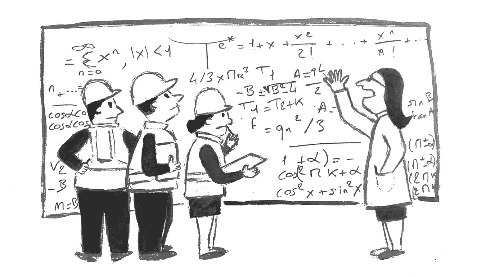

(图片由作者提供)

机器学习的兴起，接管了新的行业和应用，在过去几十年里非常强劲。其日益增加的复杂性将模型变成了黑箱，使得输入和输出之间的过程更加不透明。反过来，在其他因素的支持下，解释机器学习决策过程的需求变得至关重要。可解释性(XAI)提供了对模型如何工作的更好理解，增加了对它们的信心，并导致更好的决策。

对于数据科学家来说，可解释性必须是建模不可或缺的一部分。假设我们要开发一个信用评分模型(不管我们是否要给某人贷款)；可解释性可以提供许多洞见:

*   验证预期特征(工资、债务比率……)是否有重大影响，或者反过来理解为什么出乎意料的特征被过度表现
*   专注于具有强大预测能力的功能，并改进功能工程以提升性能
*   提供客户顾问可以用来解释拒绝/批准原因的建议
*   与数据科学家和非数据用户共享模型和结果
*   等等...

XAI 最近一直是一个热门的研究话题。出现了多种解释方法。但是今天这些方法并不完全令人满意，对结果的解释应该仔细。

因此，在*法国兴业银行*，我们开发了帮助评估解释质量的指标。我们的贡献现在可以在 Shapash 库的 1.6.1 版本中获得。


([来源](https://github.com/MAIF/shapash))

[**Shapash**](https://github.com/MAIF/shapash) 是由 *MAIF* 开发的关于可解释性的开源 Python 库。它依赖于现有的方法(如 SHAP 和莱姆)，并提出了简单的可视化和一个界面，允许在全局和局部的可解释性之间导航。

关于解释质量指标实现的更多信息，Shapash Github 上有一个 [**jupyter 笔记本教程**](https://github.com/MAIF/shapash/blob/master/tutorial/explainability_quality/tuto-quality01-Builing-confidence-explainability.ipynb) 。

# 局部可解释方法

局部可解释性有多种形式。其中最受欢迎的是基于重量的方法。那些分配给每个特征的权重与其在样本预测中的贡献成比例。例如:

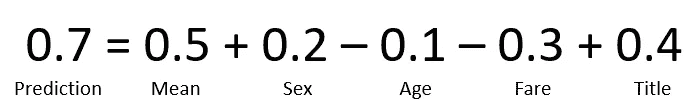

特定实例中与每个特征相关的权重示例

基本上，您将您的初始问题(您可能已经使用任何模型来获得预测)转换为线性问题，其中权重的总和(或多或少)加到模型输出中。

通过查看捕捉最大权重的特征，您将能够评估这样的句子:“*您的贷款申请被拒绝是因为您的收入(决定的 70%)和您的年龄(30%)。*

SHAP 和石灰是两种最常用的重量法；下面是一个快速回顾。

## 石灰

LIME 背后的思想如下:我们用代理(线性回归)局部近似黑盒模型，并将其系数解释为特征的贡献。

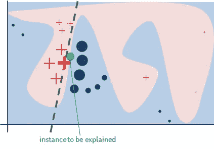

用石灰解释一个实例

更详细的解释，可以查看 [**原文**](https://arxiv.org/abs/1602.04938) [1]

## SHAP

SHAP (SHapley 加法解释)是基于 SHapley 值，一个来自博弈论的概念。SHAP 使用的思想是，应该考虑每个可能的特征组合的结果，以确定单个特征的重要性。

Shapley 值是通过查看每个要素组合以及模型输出如何变化来计算的。

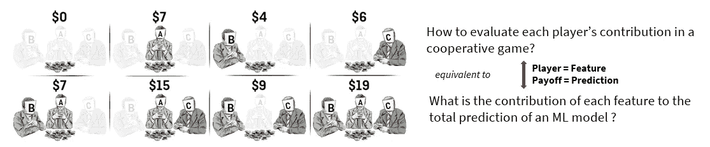

博弈论应用于确定特征的贡献

理想情况下，您需要为每个特征子集训练不同的模型(n 个特征的 2ⁿ模型)，这当然是不可能的。

除此之外，SHAP 提出了一些近似值来帮助计算沙普利值。更多信息请参见 [**论文**](https://arxiv.org/abs/1705.07874)**【2】。**

# **需要开发度量标准来评估质量**

**如果现有的方法可以在某些场景中带来有趣的见解和帮助，不幸的是，它们并不完美，并受到限制。**

**其中，在不涉及细节的情况下，当涉及相关变量时，您将无法计算出准确的 SHAP 值:要么计算是基于人工创建的、永远不会出现在现实生活中的实例，要么权重可能被赋予在模型中实际没有使用的要素(因为与实际使用的要素相关)。**

**有关这些限制的更多信息，您可以查看这篇文章<https://arxiv.org/abs/2002.11097>****【3】。******

******此外，可解释性方法之间并不总是一致的:一个特性根据一种方法可能有很强的贡献，根据另一种方法可能有很弱的贡献，甚至是相反的符号，这使得获得可信解释的任务更加困难。******

******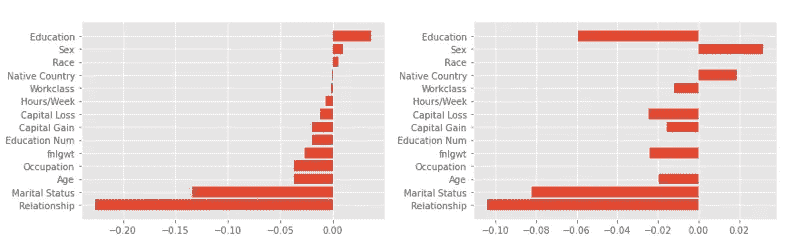******

******SHAP(左)和莱姆(右)对同一实例的贡献******

******因此，我们需要工具来估计在特定情况下何时与信任解释相关，以及反过来，何时我们应该将它们视为纯粹的见解。******

******我们开发了三个度量标准，将通过泰坦尼克号数据集上的一个例子来说明(分类问题，根据一个人的一些特征来预测他是否在沉没中幸存)。******

******我们将假设该模型已经被训练过，并且我们现在想要理解它的内部工作。******

******这三个指标是:******

*   ********一致性********
*   ******稳定******
*   ******紧密度******

# ****一致性度量****

****如上所述，目前存在几种基于权重的可解释性方法。这些方法在几个方面可能互不相同:理论基础的强度、初始假设、成熟度水平的异质性……简而言之，许多因素可能会影响与每个变量相关的权重值。****

****当我们在同一个实例上比较可解释性方法时，我们经常会得到不太相似的解释(甚至在某些情况下完全相反)。不幸的是，很难确定选择正确的方法(如果有的话)。****

****如果可以理解方法之间的差异是因为它们的假设不同，那么从业务角度来看这是不令人满意的。如果我们想了解客户为什么没有获得贷款，我们不能回答他们:“这取决于假设，要么是因为你的收入，要么是因为你的年龄”。****

****为了突出和量化这些方法之间的差异，我们开发了一个叫做`Consistency`的度量标准。这个标准回答了下面的问题:*平均来说，不同的可解释性方法给出了相似的解释吗？*****

****因此，我们可以将差异较小的情况与差异较大的情况区分开来，差异较小的情况增加了对这些方法提供的解释的信心，在差异较大的情况下，我们需要仔细解释这些解释。****

## ****图形描述****

****输出分为两个图表:****

****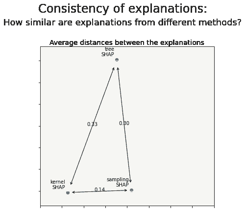********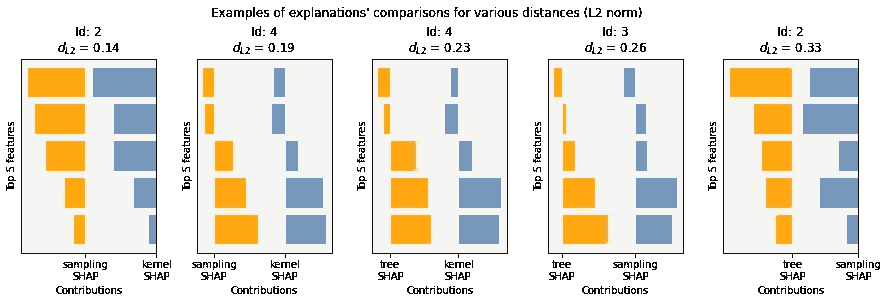****

****第一张图显示了不同方法提供的解释之间的平均距离。这是一个 2D 表示，给出了方法之间的相似性的概述。例如，KernelSHAP 和 SamplingSHAP 给出的平均解释似乎比 TreeSHAP 更接近。****

****然而，距离的解释并不容易。比如 0.33 好不好？为了帮助理解其含义，我们展示了第二张图，作为说明第一张图中显示的值的依据。****

****在第二张图中，从数据集中选择和提取了真实的实例(由于每个图顶部的 Id，我们可以找到它们),并允许更好地理解显示的值。例如，这里 0.14 的距离似乎显示出非常相似的贡献，对于 0.33 的距离，贡献稍微小一些。****

## ****密码****

****声明对象后，下面的`compile`方法允许您使用 Shapash 支持的默认方法(即 SHAP、莱姆和 ACV)计算给定数据集的贡献。****

```
****from** shapash.explainer.consistency **import** Consistencycns **=** Consistency()
cns**.**compile(x**=**Xtrain, model**=**clf)
cns**.**consistency_plot()**
```

****您也可以使用 Shapash 没有计算的您自己的贡献。确保它们都是相同的 Pandas 数据帧格式(相同的列，相同的索引)并插入到字典中。****

```
**contributions **=** {"treeSHAP": treeSHAP, 
                 "samplingSHAP": samplingSHAP,
                 "kernelSHAP":kernelSHAP}
cns**.**compile(contributions**=**contributions)
cns**.**consistency_plot()**
```

## ****技术细节****

****从数学上来说，距离定义如下。对于 M₁和 M₂的两种解释方法，解释之间的平均距离是:****

****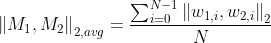****

****其中`N`是计算中考虑的实例数量，`w1`和`w2`是由所有特征的贡献创建的归一化向量(L2 范数)。****

# ****稳定性度量****

****另一种增加可解释方法可信度的方法是研究它的稳定性。直觉上，如果我们选择相似的实例(我们将在下面看到如何定义这个*相似性*)，我们会期望解释也是相似的。换句话说，*对于类似的实例，解释是否相似？*这是第二个指标`Stability`要回答的问题。****

****相似性的概念基于两个因素:****

*   ****实例在特征空间中必须是接近的****
*   ****模型预测必须接近****

****事实上，仅与特征值相关的相似性不足以得到相同的解释。例如，如果你观察一个模型的决策边界的两边，你会得到不同的预测，从而得到不同的解释。但是特征值可能非常相似。这完全说得通。****

****稳定性的问题是很重要的，因为在这个水平上的失败不会给解释带来信心。****

****在当前可解释方法所依赖的理论假设中(例如:莱姆和 SHAP)，稳定性问题通常不被提及。因此，它不会自动跟随。因此，有一个度量标准来评估这一方面是很重要的。****

## ****图形描述****

****可以显示几个图形，这取决于是希望查看完整数据集(全局)的稳定性还是特定实例(局部)的稳定性。****

****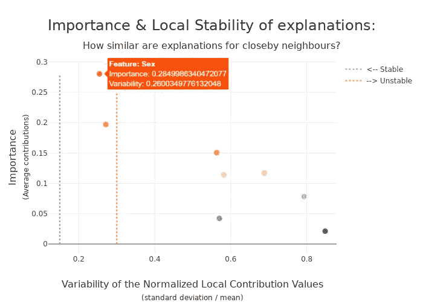****

****此图说明了一组实例的稳定性。图表上的每个点代表一个要素(作为一个绘图图表，您必须将鼠标悬停在它上面才能看到要素的名称)。****

*   ****Y 轴显示每个特性在所有考虑的实例中的平均重要性。越往上走，功能越重要。****
*   ****X 轴显示每个考虑的实例的邻域中的平均稳定性。越靠右，特征越不稳定。****

****因此，我们看到左上角的两个特性很重要，并且平均来说相对稳定。如果我们想放大一点，看看稳定性的分布而不是它的平均值，我们会得到这个图表:****

****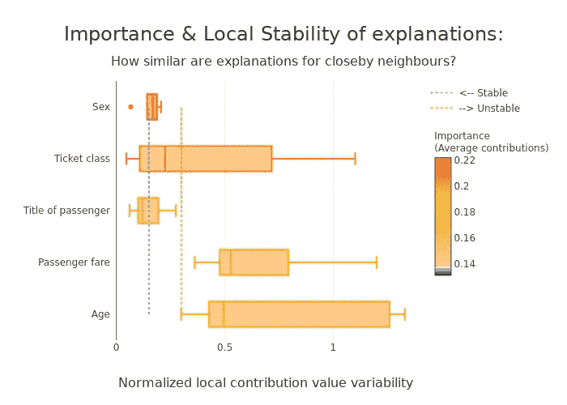****

****我们发现同样的两个最重要的特征(“性别”和“票等级”)，但是我们现在看到一些差异:如果它们的稳定性平均上接近，我们现在看到它们的分布如何变化；“性别”在所有实例中保持非常稳定，而“机票类别”则具有更高的可变性，并且取决于所研究的实例。****

****第三个视角，这次是本地的，允许您研究特定实例的稳定性:****

****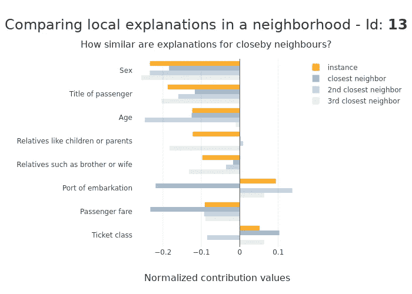****

****例如，在这里，“性别”在其邻域内是稳定的，这使得贡献可以在一定程度上得到解释，而“装载港”则显示出真正的矛盾。****

## ****密码****

```
****from** shapash.explainer.smart_explainer **import** SmartExplainerxpl **=** SmartExplainer()
xpl**.**compile(x**=**Xtrain, model**=**clf)
xpl**.**plot**.**stability_plot()**
```

****默认情况下，选择的可解释方法是 SHAP。****

## ****技术细节****

****计算稳定性指标需要两个步骤:****

1.  ****选择合适的社区****
2.  ****计算稳定性本身****

****关于给定实例的邻域，选择如下:****

*   ****我们将数据归一化，使其具有单位方差(在相同的比例上获取要素)****
*   ****我们通过 L1 距离选择前 N 个最近的邻居(默认为 10，这足够大以允许后续的过滤标准)****
*   ****我们拒绝那些模型输出与实例输出相差太大的邻居(T2 差异将在下面解释)****
*   ****我们拒绝到实例的距离大于某个阈值的邻居，以便移除异常值(该阈值由距离分布定义)****

****模型输出之间的最大允许差异定义如下:|****

*   ****对于回归:****

****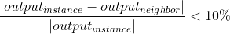****

*   ****对于分类:****

****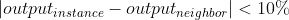****

*******一旦选择了邻居，稳定性度量本身的计算通过考虑实例及其所有邻居并计算以下各项之间的比率来完成:*******

*   *******由特征贡献创建的归一化向量(L1 范数)的标准偏差。*******
*   *******由特征贡献创建的归一化向量(L1 范数)的绝对值的平均值。*******

****这个无单位的比率被称为*变异系数* (CV)。****

# ****紧凑度量****

****为了使可解释性成为可解释的，它必须容易被人类理解。即使使用的模型很简单，这也不能保证可解释性也同样简单:一个依赖于 50 个特征的简单线性回归显示了问题；特征的数量极大地影响了可解释性。****

****一个简单的可解释性最好是基于少量的特征，因此有必要选择足够数量的特征。然而，所选择的特征必须具有足够高的预测能力，以便它们足够好地逼近模型。因此，必须考虑权衡。****

****不幸的是，这种权衡并不总是可能的。如果模型确实使用大量的特征来作出决定，则不可能令人满意地提取子集。****

****这里开发的`Compacity`指标允许确定我们是否处于这样一种情况，即通常很容易根据少数特征获得解释，或者相反，这是不可能的。为此，将包含所有特征的模型的输出与前 N 个贡献进行比较。最后，显示统计数据。****

## ****图形描述****

****下面生成的图表提供了全局统计数据(一组点)，而不是特定实例的统计数据。****

****有两个参数会影响结果:****

*   ****包含所有特征的模型的期望近似程度****
*   ****说明中选择的特征数量****

****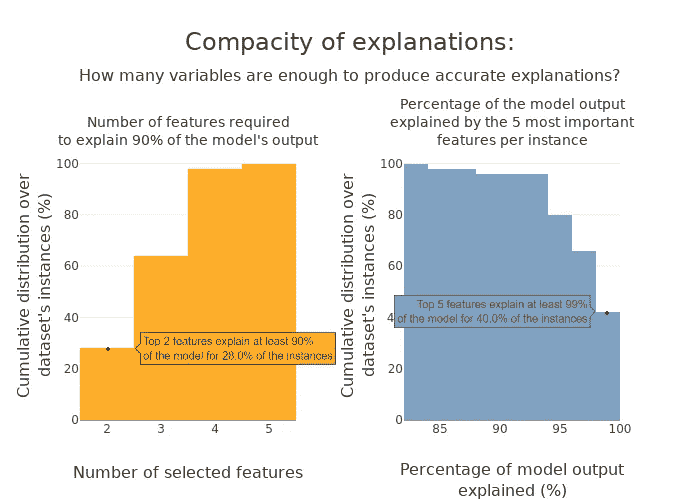****

****通过固定期望的近似水平和改变特征的数量，我们获得左图；相反，通过固定特征的数量并改变所达到的近似值，我们得到了右边的图。****

****正如我们在这个例子中所看到的(左图)，如果我们选择了 4 个特性，我们将在 X%的时间内以 90%接近基本模型。另一方面，如果我们选择 5 个特征(右图)，我们将在 X%的时间内达到 90%的近似值。****

## ****密码****

```
****from** shapash.explainer.smart_explainer **import** SmartExplainerxpl **=** SmartExplainer()
xpl**.**compile(x**=**Xtrain, model**=**clf)
xpl**.**plot**.**compacity_plot(distance=0.9, nb_features=5)**
```

****默认情况下，选择的可解释方法是 SHAP。****

## ****技术细节****

****这里，只有输出之间的距离用于计算度量。使用的距离与上面所示的距离相同:****

*   ****对于回归:****

****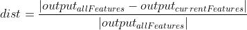****

*   ****对于分类:****

****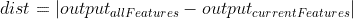****

# ****结论****

****这篇文章提出了三个度量标准来评估现有可解释性方法所提供的解释的质量。他们回答了以下问题:****

*   ****D *o 不同的解释方法平均给出相似的解释？* ( **一致性**)****
*   *****对类似事例的解释是否相似？* ( **局部稳定**)****
*   *****几个特性驱动了模型吗？* ( **紧密度**)****

****如果可解释性方法帮助了我们，并提供了可以在某些情况下使用的有趣见解，那么对它们的解释必须谨慎，正如度量所指出的那样。****

****通过开发这些指标，我们可以区分那些我们可以相信解释的情况和那些需要更深入关注的更复杂的情况。****

****这些指标在 1.6.1 版本的 [**Shapash**](https://github.com/MAIF/shapash) 中提供。还提供了一个 [**笔记本教程**](https://github.com/MAIF/shapash/blob/master/tutorial/explainability_quality/tuto-quality01-Builing-confidence-explainability.ipynb) 来熟悉它们。****

****我感谢朱利安·博恩(*法国兴业银行*)、扬·戈林( *MAIF* )和托马斯·布奇( *MAIF* )在这一富有成效的合作中做出的贡献和承诺。****

# ****参考****

****[1]里贝罗等，[“我为什么要相信你？”:解释任何分类器的预测](https://arxiv.org/abs/1602.04938) (2016)****

****[2] Lundberg 等人，[解释模型预测的统一方法](https://arxiv.org/abs/1705.07874) (2017)****

****[3] Kumar 等人，[基于 Shapley 值的解释作为特征重要性度量的问题](https://arxiv.org/abs/2002.11097) (2020)****