# 在 PyTorch 中构建自定义影像数据集

> 原文：<https://towardsdatascience.com/building-custom-image-datasets-in-pytorch-15ba855b47cb>

# 在 PyTorch 中构建自定义影像数据集

## 带代码的教程

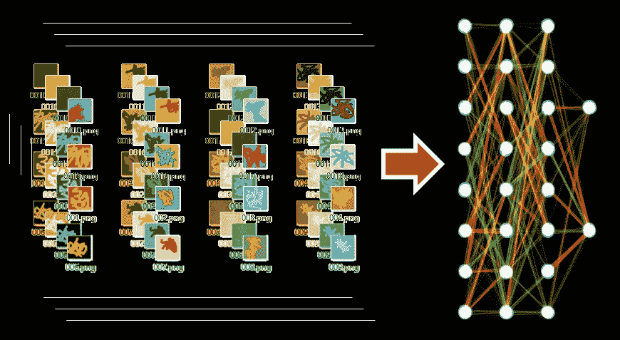

图片作者。包括来自维基百科(知识共享许可)的[神经网络可视化。](https://commons.wikimedia.org/wiki/File:Two-layer_feedforward_artificial_neural_network.png)

在本教程中，您将学习如何使用 PyTorch 的内置图像数据集，以及如何使用您想要的任何图像构建您自己的自定义图像数据集。虽然本教程的重点是图像数据，但 PyTorch 中可定制数据集的关键概念适用于任何类型的数据，包括文本和结构化表格数据。

本教程基于我的公开资源库[https://github.com/rachellea/pytorch-computer-vision](https://github.com/rachellea/pytorch-computer-vision)，其中包含了使用定制 PyTorch 数据集的代码。它还包括训练和评估定制神经网络的代码，在[这篇文章](https://glassboxmedicine.com/2021/02/06/designing-custom-2d-and-3d-cnns-in-pytorch-tutorial-with-code/)中有概述。

学完本教程后，您应该能够:

*   下载并使用 torchvision.datasets (MNIST、CIFAR、ImageNet 等)的公共计算机视觉数据集。);
*   使用图像数据标准化和数据扩充；
*   通过子类化 torch.utils.data.Dataset，从任意图像集合(或非图像训练示例)中创建您自己的数据集；
*   使用 num_workers 并行加载数据。

# **什么是数据集？**

数据集由带标签的示例组成。对于影像数据集，这意味着每个影像都与一个标签相关联。标签可以是:

*   定义类的向量，如“cat”=[0，1，0]代表[dog，cat，bus]
*   定义多个类别的向量，如“猫和狗”= [1，1，0]表示[狗，猫，公共汽车]
*   定义分割图的矩阵，其中矩阵的每个元素对应于图像的单个像素，并指定该像素属于哪一类，例如，“0”代表狗的一部分，“1”代表猫，“2”代表公共汽车，“3”代表椅子，等等。

关于分类任务的更多信息，请看[这篇文章](https://glassboxmedicine.com/2019/05/26/classification-sigmoid-vs-softmax/)。有关分段任务的更多信息，请参见[这篇文章](https://glassboxmedicine.com/2020/01/21/segmentation-u-net-mask-r-cnn-and-medical-applications/)。

# **下载内置 PyTorch 图像数据集**

在构建自定义数据集之前，了解内置 PyTorch 图像数据集是很有用的。PyTorch 通过 torchvision 提供了许多内置/预先准备/预先烘焙的图像数据集，包括:

*   MNIST，时尚 MNIST，KMNIST，EMNIST，QMNIST
*   COCO 字幕，COCO 检测；
*   LSUN、ImageNet、CIFAR、STL10、SVHN、PhotoTour、SBU、Flickr、VOC、Cityscapes、SBD、USPS、Kinetics-400、HMDB51、UCF101 和 CelebA。

导入 torchvision 后，只需一行代码就可以下载所提供的数据集。下面是一个下载 MNIST 数据集的例子，该数据集由 60，000 个训练和 10，000 个手写数字测试图像组成。每个图像都是灰度和 28 x 28 像素:

```
import torchvision 
mnist = torchvision.datasets.MNIST('path/to/mnist_root/',download=True)
```

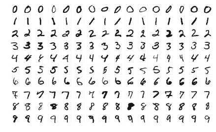

从 MNIST 数据集采样的图像蒙太奇。图片来源:[维基百科](https://en.wikipedia.org/wiki/MNIST_database)，CC by SA 4.0

在上面的代码片段中，您可以将“path/to/mnist_root/”替换为保存 mnist 图像的目录的绝对路径。

以下是如何下载 CIFAR-10 数据集的示例:

```
cifar10 = torchvision.datasets.CIFAR10('path/to/cifar10_root/',download=True)
```

CIFAR-10 包括 50，000 个训练图像和 10，000 个测试图像。它们都是自然的彩色图像，大小为 32 x 32 像素。

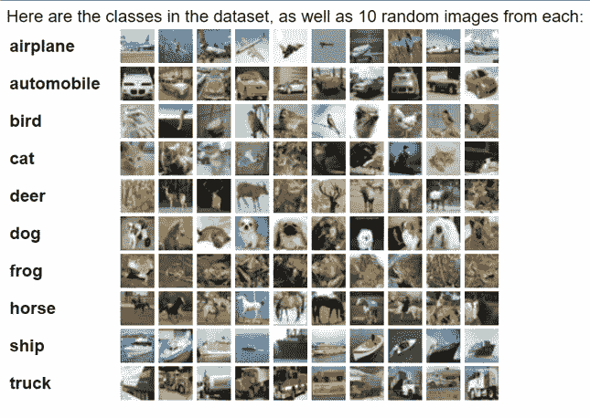

CIFAR-10 示例图像。图片来源: [CIFAR 网站](https://www.cs.toronto.edu/~kriz/cifar.html)

您可以指定下载数据集的特定子集(例如，训练、val 或测试)。语法很简单，并且根据您使用的数据集的不同而略有不同。在 torchvision datasets 页面上，为每个数据集分别记录了指定下载数据集特定子集的所有必要参数[。](https://pytorch.org/vision/stable/datasets.html)

作为一个例子，为了指定 MNIST 的训练或测试集，提供了一个称为“train”的自变量，它可以被设置为真或假:

若要指定 MNIST 的训练集，请设置 train=True。

```
mnist_train = torchvision.datasets.MNIST('path/to/mnist_root/', train=True)
```

要指定 MNIST 的测试集，请设置 train=False。

```
mnist_test = torchvision.datasets.MNIST('path/to/mnist_root/', train=False)
```

为了指定 VOC 2012 分割数据集的训练集或 val 集，提供了一个名为“image_set”的参数，它可以设置为“train”或“val”:

```
vocseg_train = torchvision.datasets.VOCSegmentation('path/to/voc_root/', year='2012',image_set='train') vocseg_val = torchvision.datasets.VOCSegmentation('path/to/voc_root/',year='2012',image_set='val')
```

## **避免过度下载**

对于一些内置的 PyTorch 数据集，初始下载可能需要很长时间，这取决于数据集的大小和您的互联网速度。幸运的是，如果您已经下载了一次数据集，那么只要您指定了最初下载数据集的目录，就不需要在该计算机上再次下载它。例如，如果您已经将 MNIST 下载到“path/to/mnist_root/”目录，那么只要您提供的路径是“path/to/mnist_root/”，您就可以访问数据集，而无需再次下载。您还可以通过设置 download=False 来明确指定不要再次下载数据集，这意味着如果由于某种原因您提供的路径不正确，您将会得到一个错误。

```
#The first time we use this training set, we download it to a particular location 
mnist_train = torchvision.datasets.MNIST('path/to/mnist_root/', train=True) #The second time we use this training set, we don't need to download it and we can just load it from the location we specified before: 
mnist_train = torchvision.datasets.MNIST('path/to/mnist_root/', train=True, download=False)
```

# **通过 DataLoader 类**使用内置 PyTorch 图像数据集

**为了实际使用一个数据集，我们需要能够从该数据集中挑选出示例，并创建它们的批处理以提供给我们的模型。PyTorch 数据加载器接收数据集并对其进行批处理。DataLoader 负责批处理，这很好，因为这意味着我们不需要编写任何繁琐的代码来选择数据集的随机子集。**

**以下是如何使用提供的 data loader 类为 MNIST 创建训练数据加载器的示例:**

```
import torch 
import torchvision mnist_train = torchvision.datasets.MNIST('path/to/mnist_root/',train=True) train_data_loader = torch.utils.data.DataLoader(mnist_train, batch_size=32, shuffle=True, num_workers=16) for batch_idx, batch in enumerate(train_data_loader): 
    #inside this loop we can do stuff with a batch, 
     like use it to train a model
```

**以下是如何为 MNIST 创建测试数据加载器的示例:**

```
mnist_test = torchvision.datasets.MNIST('path/to/mnist_root/',train=False) test_data_loader = torch.utils.data.DataLoader(mnist_test, 
                                               batch_size=32, 
                                               shuffle=False, 
                                               num_workers=16) for batch_idx, batch in enumerate(test_data_loader): 
    #do stuff
```

# ****为神经网络模型归一化数据****

**在向神经网络提供图像数据之前，必须对图像进行归一化，以使输入数据在数值上大致在[0，1]或[-1，1]的范围内。当训练神经网络的数据量大约在这个范围内时，神经网络具有更稳定的训练。对于原始 RGB 像素值在 0 到 255 范围内的图像，成功训练神经网络模型的可能性极小。**

**PyTorch 为规范化数据提供了多种选择。一个选项是 torch vision . transforms . normalize:**

**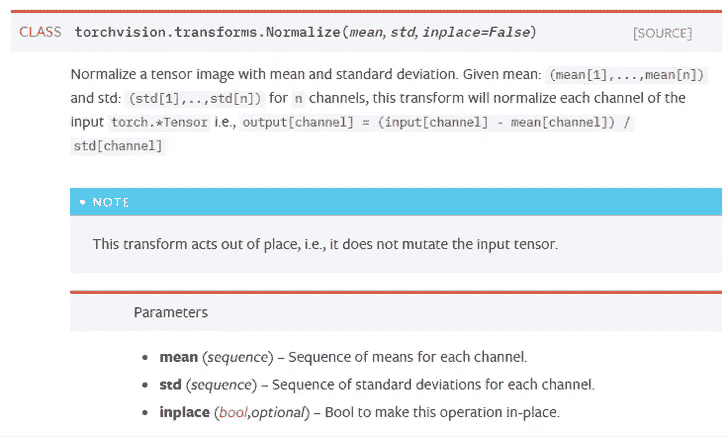**

**来自 [torchvision.transforms 文档](https://pytorch.org/docs/stable/torchvision/transforms.html)**

**您可以看到，上面的 Normalize 函数需要一个“均值”输入和一个“标准差”输入。“平均值”应该是训练集中每个颜色通道的原始像素的平均值。“std”应该是训练集中每个颜色通道的原始像素的标准偏差。如果您有一个大的数据集，您会希望计算这些值一次，然后存储它们，而不是每次都重新计算它们。请注意，您必须仅使用训练集来计算平均值和标准偏差，因为如果您使用整个数据集，您会将测试集的相关信息泄漏到训练过程中，因为它包含在平均值/标准偏差计算中。**

## ****为 ImageNet 上预训练的模型预处理数据****

**PyTorch 提供在 ImageNet 上预先训练的[模型。在为这些模型准备数据时，我们必须考虑到所有这些模型都希望它们的输入图像以特定的方式进行预处理。这些图像必须是 3 通道和 RGB，形状(3 x 高 x 宽)，其中高和宽预计至少为 224。此外，像素值必须在范围[0，1]内，并且应该使用 mean = [0.485，0.456，0.406]和 std = [0.229，0.224，0.225]进行归一化。这些平均值和标准值是使用上一节描述的过程在 ImageNet 上计算的。以下转换将使用这些 ImageNet 规范进行规范化:](https://glassboxmedicine.com/2020/12/08/using-predefined-and-pretrained-cnns-in-pytorch-tutorial-with-code/)**

```
normalize = transforms.Normalize(mean=[0.485, 0.456, 0.406], 
                                 std=[0.229, 0.224, 0.225])
```

# ****数据增强****

**数据扩充允许您鼓励模型的预测对某些类型的变化保持不变，例如图像的翻转或旋转。PyTorch 在 [torchvision.transforms](https://pytorch.org/docs/stable/torchvision/transforms.html) 中为图像数据增强提供了许多变换，包括颜色抖动、灰度、随机仿射变换、随机裁剪、随机翻转、随机旋转和随机擦除。可以用 torch vision . transforms . compose(*transforms*)聚合多个转换。**

**请注意，如果您正在执行对象检测或分割任务，其中地面实况与输入图像“类似图像”且形状相同，则需要对地面实况和输入图像应用等效的数据变换。例如，如果您对输入图像应用水平翻转，您还需要水平翻转该图像的分割基础事实。**

**下面是一些数据扩充的数据转换的例子，使用的是来自维基百科的公共领域狗图片[:](https://commons.wikimedia.org/wiki/File:BeachDog2.jpg)**

**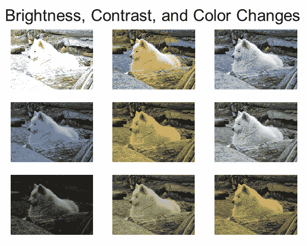**

**图片由作者提供，来自公共领域狗的照片**

**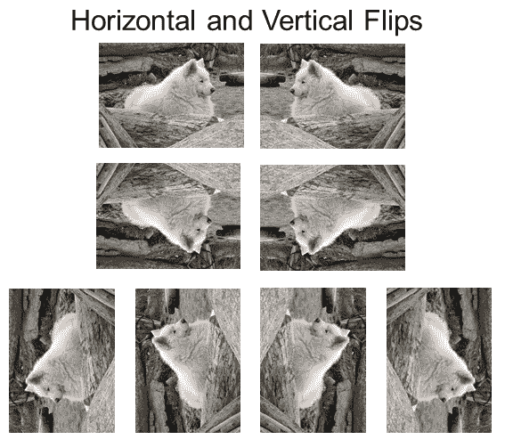**

**图片由作者提供，来自公共领域狗的照片**

**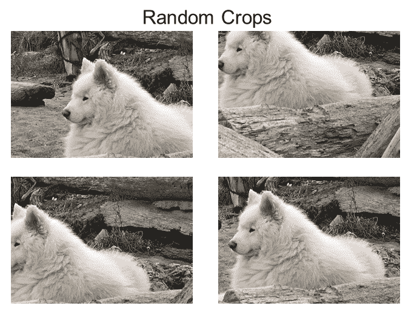**

**图片由作者提供，来自公共领域狗的照片**

**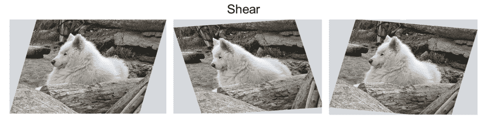**

**图片由作者提供，来自公共领域狗的照片**

**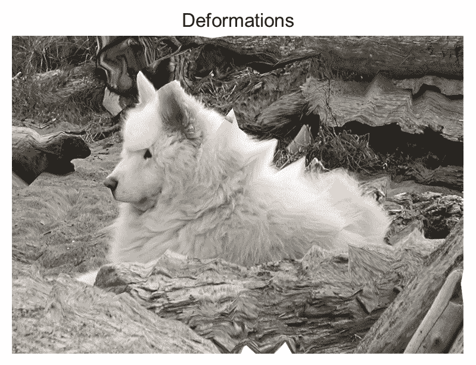**

**图片由作者提供，来自公共领域狗的照片**

# ****制作自己的数据集:概述****

**您可以为您想要的任何图像集合创建 PyTorch 数据集，例如医疗数据、从互联网上下载的随机图像或您拍摄的照片。各种机器学习数据集的例子可以在[这里](https://howtolearnmachinelearning.com/datasets/)找到。**

**PyTorch 中自定义数据集实现的要求如下:**

*   **必须是 torch.utils.data.Dataset 的子类**
*   **必须实现 __getitem__ 方法**
*   **必须实现 __len__ 方法**

**实现之后，可以将自定义数据集传递给 torch.utils.data.DataLoader，然后它可以并行加载多个批处理。这真的很好——这意味着您所要做的就是定义在哪里找到您的图像数据以及如何准备它(即定义一个数据集),然后 PyTorch 会处理所有的批处理和并行数据加载，这样您就不必这么做了！**

# ****制作自己的数据集:TinyData 示例****

**本教程的[库包括 TinyData，这是一个自定义 PyTorch 数据集的例子，它是由我在 Microsoft Paint 中绘制的一堆微小的多色图像组成的。这张图片展示了数据集中的图像:](https://github.com/rachellea/pytorch-computer-vision)**

**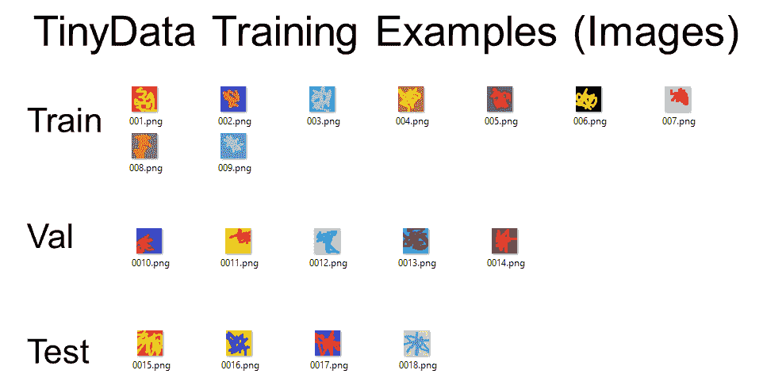**

**作者图片**

**下面是 CSV(显示在 Excel 中)的屏幕截图，它定义了每个图像的标签:**

**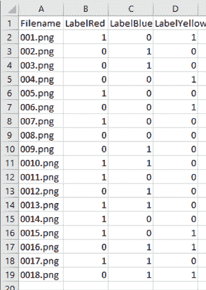**

**作者图片**

**如上所述，TinyData 是一个用于多标签分类任务的数据集，其中每个影像都与一个或多个标签类别相关联，即红色、蓝色或黄色，以确定该特定颜色是否出现在影像中。**

## ****tiny data py torch 数据集的代码****

**现在让我们看一下定义 TinyData PyTorch 数据集的代码。**

**这段代码可以在[库](https://github.com/rachellea/pytorch-computer-vision)的 load_dataset 目录中找到。它分为两个模块，custom_tiny.py 定义 TinyData 数据集，utils.py 定义图像预处理函数。**

**概括地说，如果我们在 custom_tiny.py 中查看 TinyData 类，我们可以看到 TinyData 满足上面列出的在 PyTorch 中实现自定义数据集的 3 个要求:**

**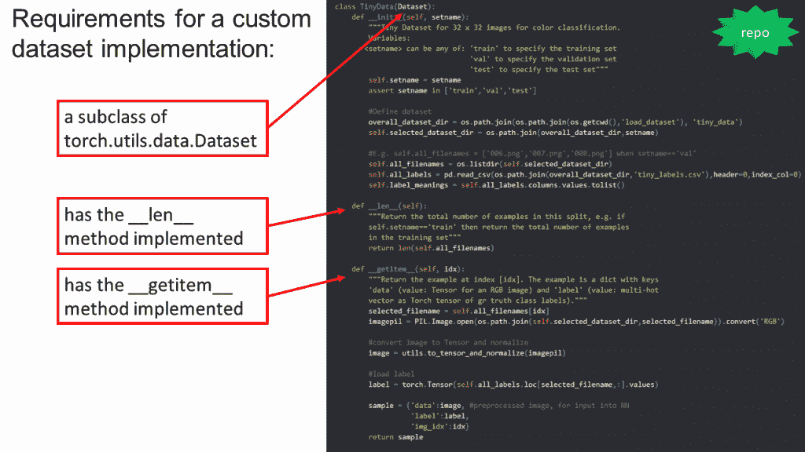**

**作者图片**

**现在，让我们来考虑这些必需的部分:**

**torch.utils.data.Dataset 的子类:为了使我们的数据集成为 PyTorch 数据集的子类，我们需要做的就是将 torch.utils.data.Dataset 放在我们的类名后面的括号中，比如如果我们只导入了 torch，就放入 my class name(torch . utils . data . Dataset)，或者如果我们使用了更具体的导入，就放入 my class name(Dataset)“from torch . utils . data import Dataset”使我们的数据集成为 PyTorch 数据集的子类意味着我们的自定义数据集继承了 PyTorch 数据集的所有功能，包括进行批处理和并行数据加载的能力。**

**__len__ 方法:该方法只返回数据集中图像的总数。您可以在 TinyDataset 的代码中看到，我们将 self.all_filenames 定义为包含数据目录中所有图像文件的名称，这样我们就可以简单地将 __len__ 方法实现为 len(self.all_filenames)。对数据集中的图像数量进行硬编码不是一个好主意；最好根据存储图像的目录的内容来计算图像的数量。**

**__getitem__ method:该方法必须接受一个整数值“idx”。该方法然后使用该整数值从数据集中选择单个例子，例如通过索引到文件名列表中。最后，该方法返回示例，以便将其提供给模型。该示例至少需要包含一个图像及其相应的标签。图像应该已经过完全处理，以便可以直接输入到模型中-在此方法返回图像之前，应该对图像应用所有规范化和数据扩充步骤。**

**在 TinyData 的示例代码中可以看到，它的 __getitem__ 方法包括几个步骤:
(1)通过 selected _ filename = self . all _ filenames[idx]选择位于索引“idx”的文件；
(2)使用 PIL 库加载存储在该位置的图像；
(3)应用数据处理步骤，在这种情况下由函数 to_tensor_and_normalize()实现，该函数在 utils 模块中定义；
(4)加载该图像的标签；
(5)通过定义包含图像数据、标签以及整数索引的 Python 字典来创建示例(称为“样本”)。从技术上讲，您不需要提供整数索引，但是它对学习有帮助，所以这里包含了它。**

## ****保持数据处理代码** **分开****

**最好将执行数据处理步骤的代码放在与数据集定义不同的模块中。为什么？**

**原因 1:如果您要运行许多不同种类的实验，那么您的图像处理代码很可能会随着时间的推移而增长，并且您不希望用一堆数据处理函数来混淆定义数据集的模块。本教程中的数据处理代码非常简单——只有几行代码——但是原则上我已经将它放入了自己的模块 utils.py 中(实际上，有一个比“utils”更具体的模块名称是个好主意，但是对于本教程来说已经足够了。)**

**原因 2:您可能希望多个不同的数据集使用相同的数据处理步骤。如果所有的数据处理函数都在某个“处理模块”中定义，那么每个数据集模块都可以从这个“处理模块”导入，并且代码保持有序。作为一个例子，utils.py 被 custom_tiny.py(定义我们的微型自定义数据集)和 custom_pascal.py(定义基于 PASCAL VOC 2012 的数据集，在本文后面讨论)导入和使用。**

**如果我们正在做大量的定制数据扩充，那么做这些的函数也将在 utils.py 中定义。**

## ****定义训练 vs 验证 vs 测试** **数据****

**您不需要为训练、验证和测试数据定义单独的数据集类。事实上，这样做是不可取的，因为这需要您的代码库包含大量冗余代码。相反，要使单个数据集类能够用于定型、验证或测试数据，可以使用参数来确定数据集将在何处查找图像。在 TinyData 示例中，该参数称为“setname ”,它确定 TinyData 类将从哪个目录加载图像。**

## ****tiny data 上的训练模型****

**要在 TinyData 上训练神经网络，可以运行以下命令:**

```
python Demo-1-TinyConvWithoutSequential-TinyData.py 
python Demo-2-TinyConv-TinyData.py
```

**你不需要 GPU 来运行上述命令，因为数据集非常小。**

# ****PASCAL VOC 2012 的自定义数据集****

**正如我们从 TinyData 示例中看到的，当您想要使用自己的图像时，PyTorch 数据集肯定会派上用场。事实证明，如果您想以不同于默认的方式使用现有的 PyTorch 数据集，PyTorch 数据集也很方便。让我们看一下 load_dataset/custom_pascal.py(也在[教程库](https://github.com/rachellea/pytorch-computer-vision)中)来理解为什么以及如何做到这一点。**

**custom_pascal.py 为 PASCAL VOC 2012 数据集定义了一个数据集。PASCAL 是一个自然图像数据集，标有以下类别的分割图:“飞机”、“自行车”、“鸟”、“船”、“瓶子”、“公共汽车”、“汽车”、“猫”、“椅子”、“奶牛”、“餐桌”、“狗”、“马”、“摩托车”、“人”、“盆栽植物”、“羊”、“沙发”、“火车”和“电视监视器”。每个图像可能有多个类别。**

**原来 PyTorch 已经提供了一个加载 PASCAL 的类。下面是一个使用内置 PyTorch 类加载 PASCAL VOC 2012 训练集的示例:**

```
pascal_train = torchvision.datasets.VOCSegmentation(voc_dataset_dir, year='2012',image_set='train',download=False)
```

**如果 PyTorch 已经有了一个 PASCAL 的内置类，叫做 VOCSegmentation，那我们为什么还要费心在 custom_pascal.py 中定义一个 PASCAL 的自定义类呢？有两个主要原因:**

**(1)因此我们可以将帕斯卡数据集与 SBD 相结合，并创建更大的整体数据集；**

**(2)所以我们可以用分类标签代替分段标签。**

## ****合并两个数据集:帕斯卡+ SBD****

**研究论文中的 PASCAL 数据集经常与 SBD 数据集结合在一起。为了在帕斯卡和 SBD 数据集上训练单个模型，我们需要以某种方式“混合”这些数据集。最简单的方法是在一个自定义数据集类中同时加载帕斯卡和 SBD，我们在自定义类中这样做:**

```
#Define dataset 
if setname == 'train': 
    #In the training set, combine PASCAL VOC 2012 with SBD 
    self.dataset =    
        [torchvision.datasets.VOCSegmentation(voc_dataset_dir,
                                              year='2012',
                                              image_set='train',
                                              download=False), 
        #SBD image set train_noval excludes VOC 2012 val images    
        torchvision.datasets.SBDataset(sbd_dataset_dir, 
                                       image_set='train_noval', 
                                       mode='segmentation',
                                       download=False)] elif setname == 'val': 
    self.dataset = 
        [torchvision.datasets.VOCSegmentation(voc_dataset_dir, 
                                              year='2012',     
                                              image_set='val', 
                                              download=False)]
```

**然后在 __getitem__ 方法的开始，我们简单地检查是否需要从 PASCAL 数据集或 SBD 数据集中选择我们的图像，这取决于整数 idx 有多大:**

```
if idx < len(self.dataset[0]): 
    chosen_dataset = self.dataset[0] 
else: 
    chosen_dataset = self.dataset[1] 
    idx = idx - len(self.dataset[0])
```

**最后要考虑的是适当地定义我们的 __len__ 方法，以便我们考虑两个数据集的大小:**

```
def __len__(self): 
    if self.setname == 'train': 
        return len(self.dataset[0])+len(self.dataset[1])     elif self.setname == 'val': 
        return len(self.dataset[0])
```

**因为 __len__ 方法正确地反映了帕斯卡和 SBD 的组合大小，PyTorch 从我们的数据集中采样时产生的随机整数 idx 有时会导致 __getitem__ 函数返回帕斯卡图像，而其他时候会导致 __getitem__ 返回 SBD 图像。**

## ****改变数据集的标签:分段- >分类****

**我们为 PASCAL 定义自定义数据集的第二个原因是使用不同的标签。PyTorch 定义的 PASCAL 数据集用于训练分割模型。因此，每个图像的基本事实是分割图。**

**但是，如果不是训练完全监督的分割模型，而是训练分类模型，或者仅依赖于分类标签的弱监督分割模型，会怎么样？在这种情况下，我们需要不同格式的标签，即指示每个类存在或不存在的多热点向量。**

**我们可以在自定义数据集类中定义这种新的标签。这是在 custom_pascal.py 函数 get_label_vector()中完成的，该函数接受默认分段图标签，并将其转换为多热点存在/不存在向量。然后，__getitem__ 利用 get_label_vector()将分割图标签转换成我们想要使用的分类标签。**

**模块 custom_pascal.py 还包含其他有用的代码，包括可视化数据集中的图像和可视化地面真实分割图的函数。它还包括从整数类标签到它们相应的描述性名称(如“cat”或“bus ”)的映射。**

## ****定制 PASCAL VOC 2012 数据集上的训练模型****

**要在自定义 PASCAL VOC 2012 数据集(包括 SBD)上训练神经网络，您可以运行以下命令，最好是在具有 GPU 的机器上:**

```
python Demo-3-VGG16-PASCAL.py 
python Demo-4-VGG16Customizable-PASCAL.py
```

## ****单元测试****

**为数据处理编写单元测试总是一个好的策略。如果您错误地处理数据，那么您在其上训练的任何模型都将是错误的。**

**在 src/unit_tests.py 中可以看到一个单元测试的例子。要运行单元测试，您可以使用以下命令:**

```
python Demo-0-Unit-Tests-and-Visualization.py
```

**上述命令还将运行 PASCAL VOC 2012 数据集可视化。**

**(关于代码组织的附带说明:如果您正在编写大量的单元测试，那么它们实际上都应该放在它们自己的测试目录中，该目录与 src 处于同一级别。那么 src 中的每个模块在测试中可以有一个相应的单元测试模块。)**

# ****定制医疗数据集****

**公共 GitHub 存储库[rachella/ct-net-models](https://github.com/rachellea/ct-net-models)包含为 CT 体积数据定义 PyTorch 数据集的代码，包括大量的数据预处理步骤和数据扩充。**

# ****用 num_workers 并行数据加载****

**我提到过 PyTorch 负责并行加载多个批次。您可以通过在数据加载器中定义 num_workers 来控制并行加载的批处理数:**

**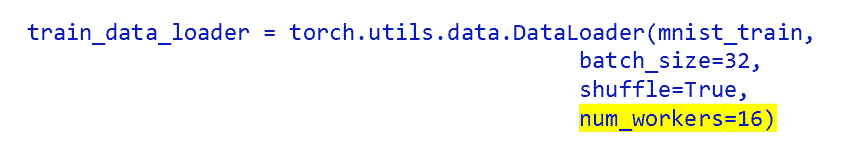**

**作者图片**

**num_workers 确定将用于加载数据的进程数。每个过程将加载一个批次。**

**如果您想进行单进程数据加载，并且一次只加载一个批处理，那么您可以将 num_workers 设置为 0。因为这将导致 PyTorch 只启动一个数据加载过程，所以总体上可能会比较慢，并且您的 GPU 可能会有很多空闲时间，因为它在等待 CPU 完成下一个批处理。设置 num_workers = 0 的一个很好的原因是，如果您使用的是 Windows 机器，并且希望使用 Python 调试器。因为 Windows 是如何处理多处理的，所以您需要将 num_workers = 0，以便在 Windows 上使用带有 PyTorch 的 Python 调试器。但是，一旦调试了程序，就可以增加 num_workers 并在没有调试器的情况下运行代码。**

**如果要进行多进程数据加载，则需要将 num_workers 设置为正整数，指定加载器工作进程的数量。在此设置中，当 GPU 对一个批次进行计算时，会加载其他批次。例如，如果您选择 num_workers=16，那么将有 16 个进程加载您的批次，这意味着大致上您将同时加载 16 个批次。如果您很好地选择了 num_workers，那么 GPU 将根本不必在批处理之间等待——一旦使用一个批处理完成，下一个批处理就已经准备好了。**

**您需要仔细选择 num_workers，否则您可能会因为试图同时加载太多的批处理而使您的机器过载。如果您正在处理像 [CT volumes](https://glassboxmedicine.com/2021/02/16/downloading-and-preprocessing-medical-images-in-bulk-dicom-to-numpy-with-python/) 这样的海量图像，或者如果您正在进行大量的数据预处理，这一点尤其重要。**

**关于如何选择 num_workers，没有严格的规定。以下是一些可能有用的一般提示:**

*   **请记住，越高并不总是越好。如果你把 num_workers 设置得太高，会使你的机器窒息，导致速度变慢或者内存出错。**
*   **一个不错的经验法则是使用与可用 CPU 内核数量相等的 num_workers。**
*   **如果您需要最大限度地优化性能，只需用不同的 num_workers 值做实验，记录一个 epoch 需要多长时间，然后选择导致最快时间的值。这不是一个非常“精神上令人满意”的方法(因为感觉上你应该能够*很容易地计算出*最佳工人数量)，但是这个实验性的测量是计算出一个好的工人数量的最快和最可靠的方法。**
*   **请记住，如果您突然从一次训练一个模型切换到一次训练多个模型，您可能希望降低 num_workers。**

**如果您使用的是 NVIDIA GPU，您可以使用 nvidia-smi 检查内存使用情况:**

**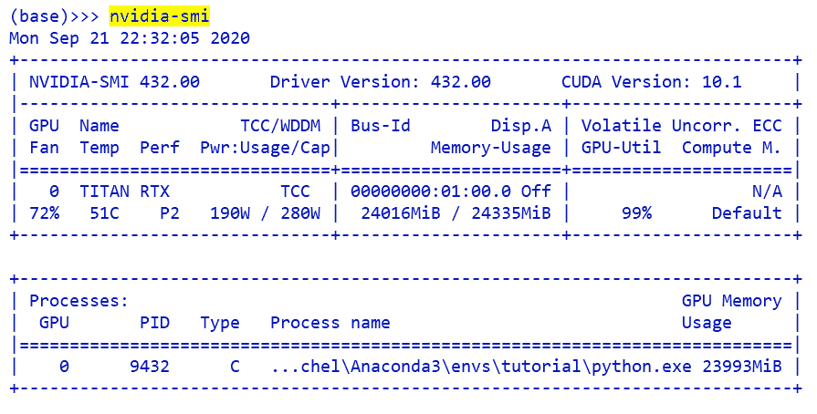**

## ****杂项提示****

*   **如果有一个遍历历元的训练循环，请确保将数据加载器放在历元循环之外。否则，您将在每个时期初始化一次数据加载器，这(a)是不必要的，(b)会耗尽您的内存使用。**
*   **如果您使用 Git 进行版本控制，请将图像数据集存储在 Git 存储库之外。“微小数据”出现在教程回购中的唯一原因是因为这是一个教程，数据小得不切实际。**
*   **与前面的要点相似，将结果文件存储在您的 Git 存储库之外也是一个好主意，因为图像模型的结果通常包含大文件(例如可视化)。**

# ****总结****

*   **PyTorch 的 torchvision 库包括许多内置数据集，包括 MNIST 和 ImageNet。**
*   **PyTorch 的数据加载器接收数据集并对其进行批处理。**
*   **torchvision.transforms 可用于规范化数据和/或执行数据扩充。**
*   **PyTorch 中的自定义数据集必须是 torch.utils.data.Dataset 的子类，并且必须实现 _ _ getitem _ _ 和 __len__ 方法。除此之外，细节由你决定！**
*   **PyTorch 中的自定义数据集也可以利用内置数据集，将它们合并成一个更大的数据集和/或为每个图像计算不同的标签。**
*   **将 num_workers DataLoader 参数设置为某个正整数值 *n* 意味着 *n* 进程将并行加载批处理。**

**数据集创建愉快！**

***原载于 2022 年 1 月 21 日*[*【http://glassboxmedicine.com】*](https://glassboxmedicine.com/2022/01/21/building-custom-image-data-sets-in-pytorch-tutorial-with-code/)*。***