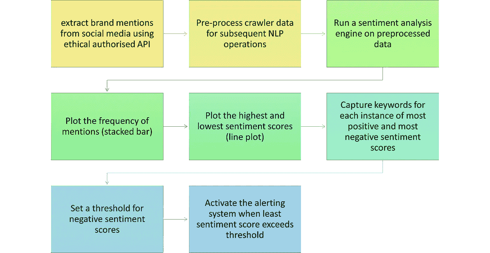

# 构建动态客户情感仪表板

> 原文：<https://towardsdatascience.com/building-dynamic-customer-sentiment-dashboards-a7cf75b0fe8d>

## 通过获取实时警报，快速发现不满意的客户并防止差评病毒式传播

在 [Unsplash](https://unsplash.com?utm_source=medium&utm_medium=referral) 上由 [Carlos Muza](https://unsplash.com/@kmuza?utm_source=medium&utm_medium=referral) 拍摄的照片

# 语境

每个企业可能只有一个糟糕的一天，甚至一个糟糕的客户服务事件，可能会使客户非常不高兴。如今，大多数不开心的顾客在社交媒体上发泄他们的愤怒，在你注意到之前，坏消息可能会被放大数倍，导致品牌形象受到相当大的损害。

如果企业能够在这些消息发布后立即发现它们，那么就有可能进行一些损害控制。然而，考虑到社交媒体帖子的泛滥以及试图从干草堆中找到“一根坏针”，这是非常不切实际的。

# NLP 能提供什么帮助？

在这种情况下，[情感分析](/the-goldmine-of-customer-reviews-quantifying-customer-experience-2da2beedf161)、[自动关键词提取](https://medium.com/analytics-vidhya/automated-keyword-extraction-from-articles-using-nlp-bfd864f41b34)、动态数据可视化和实时警报机制的组合方法可以通过提供实时警报来帮助缓解差评或对您品牌的负面看法的病毒式传播。

这将有助于企业整理所有的帖子，并提取相关的和需要立即采取行动的内容。

# 什么是情感分析？

如果你没有读过我之前的关于情感分析的文章，请在下面找到一个关于情感分析的简要概述:

情感分析也被称为“观点挖掘”。情感分析根据文本中使用的单词的情感语调给一串文本分配一个分数。

## 情绪得分——正面、负面和中性

*   “我对这项服务非常满意”是一个积极情绪的例子。这通常会有一个更接近+1 的情绪得分。
*   “我对服务非常失望”是一个带有负面情绪的字符串的例子，其情绪得分接近于-1。
*   “我在五月的最后一周利用了这项服务”是一个带有中性情绪的句子的例子。这将具有接近 0 的情绪得分。

# 动态情绪仪表板看起来像什么？

下面展示的是一个简单而强大的好情绪仪表板原型。让我们看看仪表板的各个部分。

情感仪表板的原型

1.  水平轴是时间序列轴，其中时间间隔取决于什么适合于业务。
2.  有两个垂直轴——主轴由评论的频率组成，次轴由情感分数组成。
3.  正面评价&和负面评价的**频率给了我们一些启示:**

> 两个条形的高度显示了该品牌被提及的次数，是“**品牌显著性**”的一个指标。
> 
> 正面评价与负面评价的比例反映了对该品牌的总体看法。较高的正比率有利于品牌，较高的负比率不利于品牌。

4.绿线是该品牌在该时间段内的最大正面情绪得分，红线表示最大负面情绪得分。

> 这两条线有助于确定这段时间内最快乐的顾客和最不快乐的顾客。

5.阈值线表示负面情绪得分，低于该得分时，实时警报系统将被激活。

> 将阈值设置为更负的分数可能会导致一些不开心的客户不被注意地溜走，而较高的阈值可能会触发大量警报，从而增加客户体验团队的工作。

# 创建动态情感仪表板的步骤

1.  第一步是实时提取所有社交媒体帖子、在线评论平台的评论和品牌提及。几乎所有领先的社交媒体平台和评论门户都提供安全和授权的 API 来帮助提取内容。确保内容提取符合相关许可和授权的道德规范。
2.  确保元数据与提取的数据相对应，包括发布日期/时间、位置(如果可用)、社交媒体使用信息等
3.  需要对收集的数据进行预处理，并使其适用于进一步的 NLP 处理。
4.  以这样一种方式设置数据表，即每个提及都有其可从后端检索的元数据。
5.  对收集的数据运行情感分析引擎，并收集预处理文本数据的每个单元的情感得分。
6.  在时间序列图上画出提及的频率以及最高和最低的情感分数。根据业务的性质，时间序列图的频率可以设置为分钟、小时或天。
7.  对于时间序列图的每个实例，捕获具有最积极和最消极情绪得分的提及的关键词/主题。这可以使用关键词提取或主题建模来完成。
8.  根据你的企业对负面评论的敏感程度，设定负面情绪得分的阈值。
9.  如果最小情绪得分超过阈值，则激活实时警报系统。
10.  警报系统应该向关键流程所有者发送一条消息，其中包含从元数据中提取的详细信息。

# 从动态仪表板中获取见解

动态仪表板的主要目的是为负面评论提供实时提醒。然而，从相同的数据中还可以获得其他一些见解。举几个例子:

*   提供对品牌在一段时间内的**总体情绪趋势的见解——是消极趋势还是积极趋势？**
*   提供**数据，使用聚类技术对评论进行细分和描述** —通常发布负面评论最多的客户的特征是什么？这可能会为特定的被忽视的客户群提供改进产品/服务的见解。
*   特征提取— **通过对负面评论进行主题建模，识别出可能会令顾客厌烦的特定产品特征**。

# 总结潜在的挑战

由于收集的数据非常庞大，因此数据收集、存储和检索可能会涉及巨大的成本。对建立和维护系统所涉及的成本与受损品牌形象的机会成本进行系统的成本效益分析，应能明确是否投资以及投资多少。