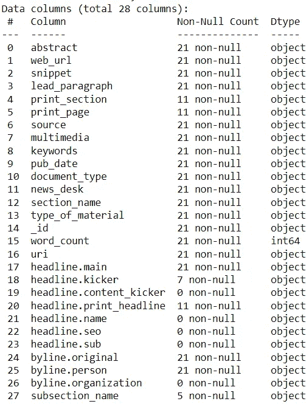
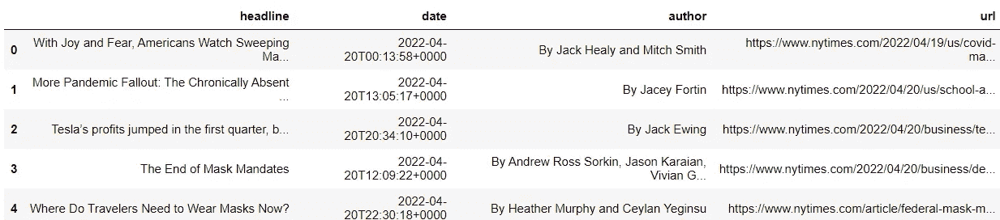

# 为初学者构建 ETL 管道

> 原文：<https://towardsdatascience.com/building-etl-pipelines-for-beginners-17c3492d29d2>

## 概述和 Python 实现

丹尼·梅内塞斯的照片:[https://www . pexels . com/photo/photo-on-laptop-computer-943096/](https://www.pexels.com/photo/photo-of-turned-on-laptop-computer-943096/)

数据科学家角色最吸引人的方面是有机会建立预测模型或进行研究，从而产生可操作的见解。

然而，如果没有可用和可访问的数据，这些任务是不可能完成的。

为了获得足够支持分析或产品开发的数据，数据科学家通常选择构建 ETL 管道。

ETL 是 extract-transform-load 的缩写，它是一系列的过程，需要接收数据，处理数据以确保可用性，并将其存储在一个安全且可访问的位置。

ETL 管道的吸引力在于它以最大的效率和最小的摩擦促进了数据收集、处理和存储。

在这里，我们探索 ETL 的各个组成部分，然后演示如何使用 Python 构建一个简单的 ETL 管道。

## 提取

在进行任何分析之前，需要获得相关数据。

ETL 的第一阶段需要从一个或多个数据源提取原始数据。这样的源可以包括平面文件、数据库和 CRM。

## 改变

在这一点上，所有的原始数据都被收集了，但是它不太可能适合使用。

因此，ETL 的第二阶段需要转换数据以确保其可用性。

人们可能希望对他们的数据应用多种类型的转换。

**1。数据清理**

应该删除任何不需要的记录或变量。数据清理可能以移除要素、缺失值、重复值或异常值的形式出现。

**2。重新格式化**

通常，当从多个来源提取数据时，重新格式化成为一个必要的步骤。即使不同的来源报告相同的信息，它们也可能以自己独特的格式报告。

例如，两个数据源可能具有日期功能，但一个数据源可能以“日-月-年”格式显示日期，而另一个数据源可能以“月-日-年”格式显示日期。为了使数据可用，来自所有来源的信息必须遵循单一格式。

**3。特征提取**

可以使用现有要素的信息创建新要素。例如，从字符串变量中提取信息，或者从日期变量中提取年/月/日。

**4。聚合**

可以汇总数据以得出所需的指标(例如，客户数量、收入等。).

**5。加入**

来自多个来源的数据可以合并，以创建一个全面的数据集。

**6。过滤**

不需要的类别可以从数据集中省略。

## 负荷

在应用了所有的转换之后，数据适合于分析，但是需要存储起来以备后续使用。

ETL 的第三个也是最后一个阶段需要将数据加载到一个安全且可访问的位置。

以下是用户在存储数据时可以选择的一些选项。

**1。关系数据库**

一种非常流行的方法是将数据存储在关系数据库中。通过这种方法，用户可以定期用新获得的数据追加或覆盖存储在数据库中的数据。

**2。平面文件**

用户还可以选择将其数据存储在平面文件中(例如，Excel 电子表格、文本文件)。

## 个案研究

通过使用 Python 构建一个简单的管道，我们可以看到 ETL 过程的效果。

假设我们需要获取与新冠肺炎相关的新闻文章的数据，以便进行某种类型的分析。

为了实现这个目标，我们将编写一个程序，它可以:

*   收集当天发表的关于新冠肺炎的新闻文章的数据
*   转换数据，使其适合使用
*   将数据存储在数据库中。

通过这一渠道，我们可以获得当天所有相关新闻文章的信息。通过每天运行这个程序，我们将获得关于新冠肺炎新闻文章的连续数据供应。

练习所需的模块如下所示:

注意:这个练习涉及到使用[纽约时报文章搜索 API](https://developer.nytimes.com/docs/articlesearch-product/1/overview) 提取数据。如果您不熟悉这个 API，或者不熟悉使用 API 进行数据收集，请查阅本文:

<https://betterprogramming.pub/data-collection-with-api-for-beginners-52b02e571944>  

**第一步:提取**

首先，我们需要使用 New York Times API 获取关于新冠肺炎的新闻文章的原始数据。

我们可以首先创建一个函数，该函数创建用 API 对任何给定查询和日期进行必要请求所需的 URI。

我们可以使用该功能获取在选定日期发表的所有与新冠肺炎相关的新闻文章。

由于 API 只为每个请求提供 10 篇文章，我们需要发出多个请求，直到我们收集了所有的数据，然后将这些数据存储在一个数据帧中。

以下是数据集功能的概述。

代码输出(由作者创建)

**第二步:变换**

现在，我们需要确保数据经过处理，以便可以使用。

在可用的特性中，唯一需要的是新闻文章的标题、URL、发表日期和作者。此外，收集的文章必须公正客观，也就是说，不需要论坛版。

对于这样的场景，要应用的理想转换是数据清理和过滤。需要删除所有缺少标题的记录以及任何重复的记录。接下来，当我们寻找客观的文章时，应该从数据集中过滤掉所有的论坛版文章。最后，应该省略任何不相关的特征。

我们用下面的代码实现了所有这些。

这是经过处理的数据集的预览。

代码输出(由作者创建)

**第三步:加载**

因为数据现在是可接受的格式，所以应该存储在关系数据库中(在本例中是 PostgreSQL)以备将来使用。为了实现这一点，我们需要实现对象关系映射(ORM)，这可以通过 [SQLAlchemy](https://www.sqlalchemy.org/) 模块来完成。

这里，我们创建了一个引擎，在这个引擎中，我们传递一个已经创建的数据库的位置。使用这个引擎，我们可以将数据存储在名为“news_articles”的表中。如果该表已经存在，它将追加新数据，而不是被覆盖。使用这种方法，我们可以保留任何以前收集的数据。

现在，数据被发送到提供的位置，可以用 SQL 查询直接访问它。

代码输出(由作者创建)

仅使用几个模块，我们就能够构建一个简单的 ETL 管道，它使用 API 收集数据，处理数据以删除不需要的信息，并将转换后的数据存储在数据库中以供将来使用，这一切都是一蹴而就的。

总之，该代码将获取所有与新冠肺炎相关的最新发表的新闻文章。从理论上讲，如果一个用户连续一年每天运行这个程序，他们将获得全年新冠肺炎新闻文章的所有相关数据。

## 要考虑的其他工具

虽然演示展示了如何用一个简单的程序实现 ETL，但实际业务案例的数据管道更加复杂，通常需要包含其他工具和技术。

1.  **云平台**

在案例研究中，转换后的数据存储在本地机器中。

但是，当涉及大量数据时，在本地存储数据并不是一种可行的方法。因此，依赖云平台(如 AWS、GCP)进行数据存储是很常见的。

**2。大数据框架**

如果使用大数据，ETL 管道可能需要结合大规模数据处理框架(例如 Apache Spark ),以便通过并行处理加快操作。

**3。作业调度器**

ETL 很少是一劳永逸的工作。数据可能需要定期收集，以便保持最新。

假设您不是一个从不生病或从不错过周末的机器人，您可能需要利用一个作业调度程序(例如 Apache Airflow)来自动化 ETL 工作流。

## 结论

照片由 [Unsplash](https://unsplash.com?utm_source=medium&utm_medium=referral) 上的 [Prateek Katyal](https://unsplash.com/@prateekkatyal?utm_source=medium&utm_medium=referral) 拍摄

当我还是个新手时，我理解 ETL 的概念，但总是被执行它所需的复杂代码所吓倒。

希望我已经展示了可以用基本的编程知识创建 ETL 管道。如果您是初学者，我邀请您通过使用您熟悉的工具构建自己的管道来获得一些实践经验。

一旦你熟悉了基础知识，就可以随意增加更多的技能。很快，您将能够构建类似于真实业务案例中使用的复杂管道。

我祝你在数据科学的努力中好运！