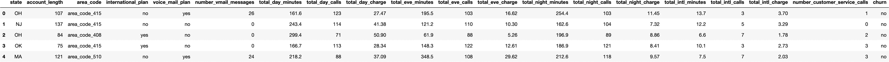
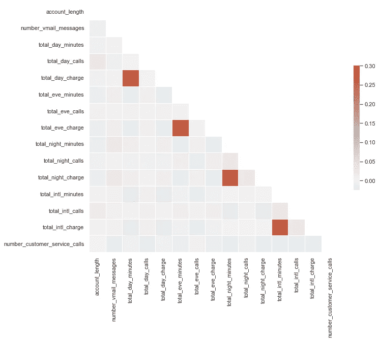
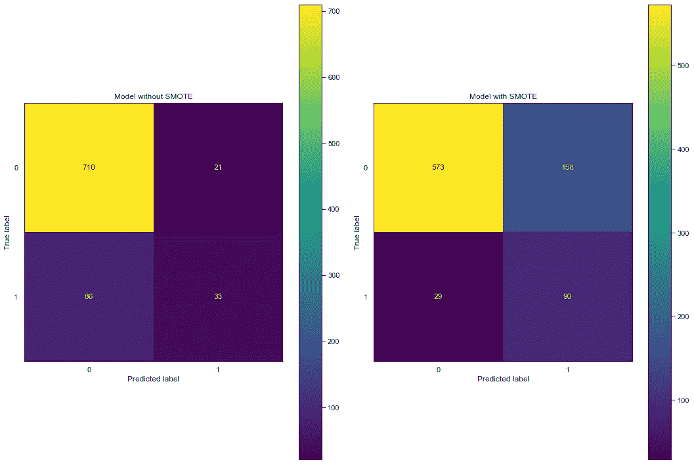
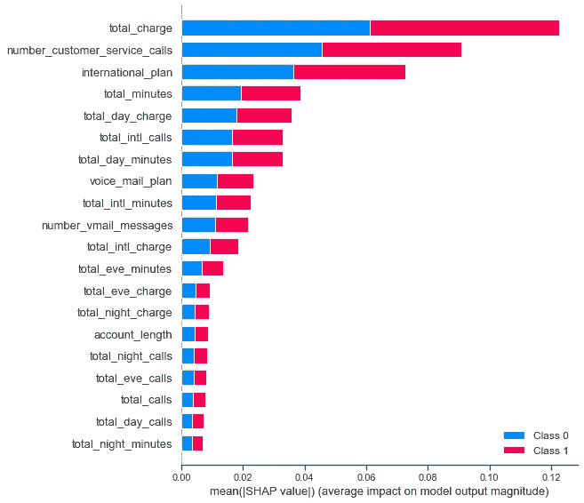
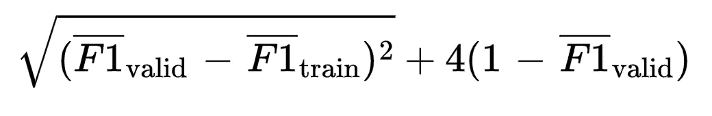
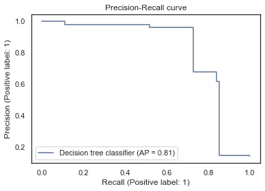
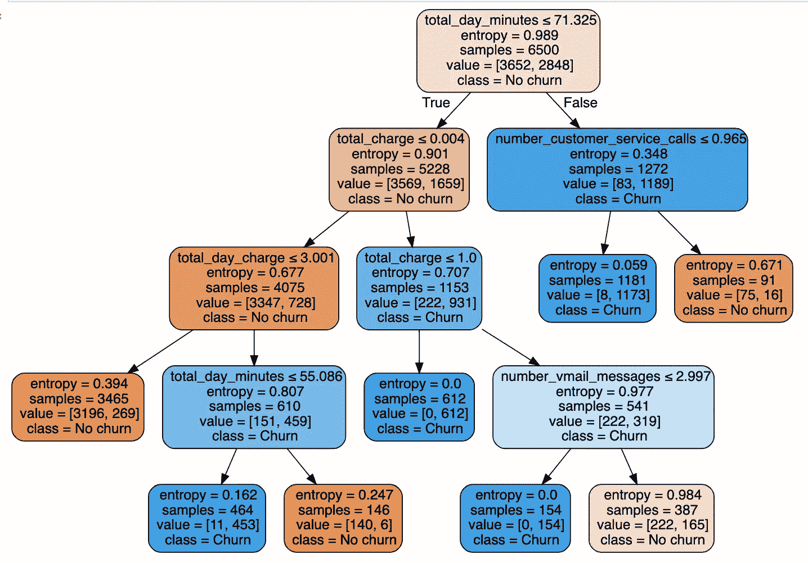

# 在不平衡数据上建立可解释模型

> 原文：<https://towardsdatascience.com/building-interpretable-models-on-imbalanced-data-a6ea5ae89bc6>

## 预测电信提供商的客户流失


Christophe Hautier 在 [Unsplash](https://unsplash.com?utm_source=medium&utm_medium=referral) 上拍摄的照片

我一直认为，要真正学习数据科学，你需要实践数据科学，我想做这个项目来练习在分类问题中处理不平衡的类。这也是一个开始使用 [mlflow](https://mlflow.org/) 帮助跟踪我的机器学习实验的绝佳机会:它允许我跟踪我使用的不同模型、我训练的参数和我记录的指标。

该项目旨在利用在 [Kaggle](https://www.kaggle.com/c/customer-churn-prediction-2020/overview) [1](这是一个公开的合成数据集)上发现的电信数据来预测客户流失。也就是说，我们希望能够根据我们掌握的客户信息，预测给定客户是否会离开电信提供商。为什么这很有用？嗯，如果我们可以预测哪些顾客会在离开之前离开**，那么我们就可以试着做点什么了！例如，我们可以为他们提供特定的优惠，也许我们甚至可以使用该模型为我们提供洞察，为他们提供什么，因为我们将知道，或者至少有一个想法，关于他们为什么离开。**

## 性能与可解释性

在我们开始考虑编写任何代码之前，了解和理解手头的问题/任务是非常重要的。在这种情况下，构建一个像 XGBOOST 这样真正强大的模型有用吗？不，当然不是。我们的目标不是从我们的模型中榨出每一滴性能。我们的目标是**了解**人们离开的原因，这样我们就可以采取一些措施，努力让他们留下来。在一个理想的世界中，我们会构建一个非常可解释的模型，但是在现实中，我们可能不得不在性能和可解释性之间找到一个折中的办法。一如既往，逻辑回归将是一个良好的开端。

## 模型评估

我们现在需要决定如何评估我们的模型，以及我们对什么满意。我认为事先决定一个最终目标很重要，否则，很难决定何时停止，挤出那多余的 1%很多时候是不值得的。

由于我们数据的性质，我们的类别可能会非常不平衡，我们感兴趣的情况(客户离开)是少数类别。这使得选择正确的指标变得非常重要。


作者图片

我们感兴趣的指标是**精度**、**召回**，以及其他与此相关的指标。精确度是正确的正面预测与正面预测总数的比率。召回率是正确的正面预测与数据集中正面预测总数的比率。在我们的案例中，我们试图通过预测哪些客户将离开来留住客户:因此，如果我们错过了将一些客户归类为“流失”，而他们并没有(误报)，我们也不会太大惊小怪。如果有的话，这些错误分类可能是客户，如果什么都不改变，他们将很快成为“流失”，因为他们可能位于决策边界的边缘。因此，我们期待**最大化召回**，因为这将最小化假阴性的数量。

我们还将看一下 **F-measure** ，因为它提供了一种用一个分数来表达对精确度和召回率的关注的方法——我们不想牺牲精确度来获得 100%的召回率！

## 型号规格

一旦我们建立了最终模型，我们就可以使用精确回忆曲线来优化我们在正面(少数类)上的表现。在这种情况下，我们将假设我们虚构的电信业务中的利益相关者希望**实现 0.80 的召回**(即我们正确识别 80%的阳性样本)，同时最大化精确度。

## 数据

*   train.csv 训练集。包含 20 列 4250 行。3652 个样本(85.93%)属于类别流失=否，598 个样本(14.07%)属于类别流失=是。
*   test.csv —测试集。包含 850 行 18 列。

EDA(以及所有建模等。)是在不同的 python 脚本中完成的，我选择在这里不包括它，因为它与我所写的主题无关。尽管如此，这仍然非常重要，你可以在我的 Github 页面上找到整个项目。

由于 state 列的基数很高，我们在对它们进行编码时需要小心，否则我们最终会得到 50 个不同的特性！

```
df.head()
```



作者图片

我们可以查看相关矩阵，以了解任何初始的有希望的特征。



作者图片

好吧，这看起来不是很好，但我们可以看到，客户流失与 total_day_minutes、total_day_charge 和 number_customer_service_calls 有一定的相关性。让我们用 total_day_minutes 和 number_customer_service_calls 建立一个简单的**基线模型**(我们省略 total_day_charge，因为它与 total_day_minutes 密切相关)。

## 特征工程

我们可以生成一些特性来封装每日总数。我们还将状态特征映射到状态所属的区域，因为这大大降低了特征维数。最后，我们可以将客户流失目标值映射到二进制，因为这是许多模型所需要的。

## 建模

首先需要做的是将数据分为训练集和验证集，因为这是避免过度拟合、提高可推广性和帮助我们比较潜在模型的重要步骤。在这种情况下，我们使用分层的 K 折叠交叉验证，因为我们的数据集是高度不平衡的，我们希望确保跨折叠的类分布是一致的。

## 基线模型

我们从构建一个简单的基线模型开始，这样我们就有一些东西可以与我们后来的模型进行比较。在回归场景中，我们可以简单地使用每次预测的目标变量的平均值，但是在我们的分类情况下，我们将使用针对两个最相关的特征训练的逻辑回归模型。

在开始之前，让我们初始化 Mlflow 并编写一个通用评分函数来评估我们的模型。

现在让我们构建基线模型，看看它在每个验证集上的表现如何！

```
Average F1 = 0.08725760427444854
Recall = 0.04847338935574229
Precision = 0.440932400932401
```

所以，是的，结果不是很好(事实上他们很糟糕)，但这仅仅意味着我们会变得更好。这只是一个基线！我们可以尝试一些事情来改进我们的模型:

*   我们可以通过过采样和欠采样来平衡我们的类，因为这种不平衡导致我们的模型偏向大多数类。
*   我们可以训练更多的功能。

## SMOTE:对少数民族阶层进行过度采样

不平衡分类的一个问题是，少数类的例子太少，模型无法有效地学习决策边界。解决这个问题的一个方法是在少数民族班级中过度取样。这可以通过简单地复制来自训练数据集中的少数类的示例来实现，尽管这不会向模型提供任何附加信息。复制少数类中的例子的一个改进是综合少数类中的新例子。在本文的[中介绍的一种常见技术是 SMOTE。值得注意的是，过采样并不是我们唯一的选择，例如，我们可以通过使用诸如](https://arxiv.org/abs/1106.1813) [TOMEK-links](https://en.wikipedia.org/wiki/Oversampling_and_undersampling_in_data_analysis#Tomek_links) 之类的技术来进行欠采样(或者将两者结合起来)。然而，在我们的例子中，最好的性能提升来自单独的 SMOTE。

然而，在我们这样做之前，让我们编写一个通用的特征处理管道，以便为建模准备好数据。我们的函数返回一个 Sklearn 管道对象，我们可以用它来拟合和转换我们的数据。它首先将数据分为数字、分类特征和二进制特征，因为我们对每一种特征都进行了不同的处理。分类特征使用一键编码进行编码，而二进制特征则保持不变。最后，对数字要素的缺失值进行估算。也尝试了缩放数字特征，但是没有带来性能的提高。这也符合我们的最大利益，不要缩放这些数据，因为这会增加解释结果的难度。

下面写了一个通用的训练函数，注意我们可以选择是否要使用 SMOTE。SMOTE 中的采样策略控制着我们对少数类重新采样的程度，这是我们以后可以调整的。

在我们使用 SMOTE 之前，让我们针对所有特性训练一个逻辑回归模型，以尝试获得一个新的基线。

```
Average F1 = 0.3066722566642678
Recall = 0.2107563025210084
Precision = 0.5720696669209255
```

结果肯定比以前好，但仍然不是很好。我们已经等得够久了，让我们试试用 SMOTE 吧！我们将使用 SMOTE 对我们的流失数据点进行过采样，以便我们最终获得相等的类别分布。

一个重要的附带说明:当使用 SMOTE 时，我们需要在没有被过采样的验证集上评估性能。否则，我们将无法获得真正的绩效衡量。

```
train_and_eval(df, model_name="lr_all_features_smote")Average F1 = 0.49789052753778434
        Recall = 0.6906862745098039
        Precision = 0.3894759793369957
```

哇！我们把 F1 的分数从 0.31 提高到了 0.50，召回从 0.21 提高到了 0.69！值得注意的是，精度几乎保持不变。这是为什么呢？那么，什么是精密测量呢？从数学上来说，精度是真阳性的数量除以真阳性的数量加上假阳性的数量。它告诉我们，当试图预测阳性样本时，我们的模型在 47%的情况下是正确的。因此，通过过采样，我们减少了假阴性的数量，但也增加了假阳性的数量。这是可以的，因为我们决定支持假阳性而不是假阴性。看到这种变化的一个直观方法是查看一个**混淆矩阵**。



作者图片

我们可以看到 TP 号从 33 到 90，FN 号从 86 到 29，太棒了！然而，结果是，我们看到 FP 数从 21 变成了 158。但是，如前所述，我们对此没有意见，因为我们更关心找出哪些客户会离开。一个小的旁注:FP 和 FN 比率可以使用概率阈值来调整，比较这两个模型的最简单的方法是比较 F1 分数。

## 特征选择

我们可以训练一个更复杂的模型，然后用它来选择特征。具体来说，我们训练一个随机森林分类器，然后使用 SHAP 值来选择最有希望的特征。缩小特征空间有助于减少维数和概化，同时也使解释结果更容易。这是双赢！

```
shap.summary_plot(shap_values, features=X, feature_names=feature_names, plot_type='bar')
```



作者图片

我们现在可以定义一个新的管道进行预处理，并且只选择我们需要的特征。

让我们看看我们的逻辑回归模型如何处理我们缩小范围的特征！

```
train_and_eval(df, model_name="lr_selected_features_smote")Average F1 = 0.5025520964212148
        Recall = 0.6940336134453782
        Precision = 0.3940789241235847
```

太棒了，我们删除了一些功能，性能略有提高。这向我们证实了其他功能并不重要。

## 但是我们能比逻辑回归做得更好吗？

在这里全力以赴训练一个 XGBOOST 模型是很容易的，但是记住这是**而不是**我们的目标。我们的目标是建立一个**可解释的**模型，我们可以用它来试图留住顾客。和逻辑回归一样，决策树分类器非常容易解释。让我们看看进展如何。

```
from sklearn.tree import DecisionTreeClassifier
train_and_eval(df, model=DecisionTreeClassifier(), model_name="dt_selected_features_smote")Average F1 = 0.8152920749388362
        Recall = 0.8461484593837536
        Precision = 0.786946006985776
```

它做得很好！我们需要**非常**小心，尽管决策树过度拟合就像没有明天一样。让我们继续调整这两个模型上的超参数，看看我们是否可以进一步优化。我们将使用 [Optuna](https://optuna.org/) ，因为我喜欢它的简单和快速。

## 超参数调谐

这里我们需要非常小心，决策树很容易过度拟合，这就是为什么随机森林模型通常是首选。随机森林能够以更好的方式对数据进行概化，因为随机特征选择充当了一种正则化形式。正如前面所讨论的，在我们的例子中，我们更关心可解释性而不是性能。现在，尽管交叉验证对于观察模型如何泛化很有用，但它不一定能防止过度拟合，因为我们最终只会过度拟合验证集。

过度拟合的一个衡量标准是训练分数远高于测试分数。我最初尝试将 Optuna 试验中的目标函数设置为交叉验证的验证分数，但这仍然会导致过度拟合，因为 DTs 没有太多的正则化。

另一种可能性，这种情况下工作出色，是衡量交叉验证的训练分数和验证分数之间的差异与验证分数本身。例如，对于 F1 分数，一个可能的目标函数是



作者图片

在这种情况下，验证和训练之间的差异的 RMSE 的权重比验证 F1 分数小四倍。优化该函数迫使训练和有效分数保持接近，同时也最大化验证分数。

```
def train_valid_f1_score(mean_train, mean_test):
    '''
    RMSE of the difference between testing and training is weighted four times less than the test accuracy 
    '''
    return np.sqrt((mean_test - mean_train)**2) + 4 * (1 - mean_test)
```

这给了我们以下结果:

*   **逻辑回归**最佳超参数:{'solver' : 'liblinear '，' penalty' : 'l2 '，' C' : 1.14，' tol' : 0.0002，max_iter : 150}
*   **决策树**最佳超参数:{'max_depth': 7，' min_samples_leaf': 4，' min_samples_split': 10，' criterion': 'gini'}，
*   **SMOTE 采样策略**LR 为 0.70，DT 为 0.56

让我们用这些参数训练一些模型，看看我们得到了什么！

```
params = {'solver' : 'liblinear', 'penalty' : 'l2', 'C' : 1.14, 'tol' : 0.0002, 'max_iter' : 150}
train(df, LogisticRegression, params, 0.70)Average training F1 score:   0.5009518013999269
Average validation F1 score: 0.5034031228088905
Overfit score:               1.9888388301734015params = {'max_depth': 7, 'min_samples_leaf': 4, 'min_samples_split': 10, 'criterion': 'gini'}
train(df, DecisionTreeClassifier, params, 0.70)Average training F1 score:   0.9153416502877135
Average validation F1 score: 0.8928098706544405
Overfit score:               0.451292297015511
```

虽然这个模型看起来很棒，而且没有过度拟合的迹象，但我们还是会选择下面这个最大深度较低的模型。我们的目标是可解释性，深度 7 并不能真正给我们带来可解释性。所以我们为了可解释性牺牲了一点准确性。

```
params = {'max_depth': 4, 'min_samples_leaf': 18, 'min_samples_split': 17, 'criterion': 'entropy'}
train(df, DecisionTreeClassifier, params, 0.78)Average training F1 score:   0.8217456929425225
Average validation F1 score: 0.816103270284813
Overfit score:               0.7412293415184575with mlflow.start_run(run_name="dt_tuned") as mlops_run:
        mlflow.log_metric("F1", 0.8161)
```

太好了，所以我们现在有几个潜在的模型。我们将继续使用决策树模型，因为逻辑回归模型不太符合要求。

## 修剪决策树

虽然我们的模型似乎没有过度拟合，但我们仍然要修剪决策树，因为它有助于我们去除没有太多预测能力的子节点。我们这样做是希望这有助于我们的模型更好地推广。大多数正则化带来的额外好处是，它还有助于提高模型的可解释性。

我们可以通过选择正确的成本复杂性参数来修剪我们的树。我们将开始使用我们选择的超参数在整个数据集上训练模型，以找到我们的 **α** 的空间——成本复杂性参数。

```
# train full model 
params = {'max_depth': 4, 'min_samples_leaf': 18, 'min_samples_split': 17, 'criterion': 'entropy'}
clf, features = train_full(df=df, model=DecisionTreeClassifier, params=params)# get cost complexity alphas from model
ccp_alphas = clf.cost_complexity_pruning_path(x_train, y_train)['ccp_alphas']
```

然后，我们可以通过交叉验证的方式对这些 **α** 中的每一个进行评分，以找到要选择的最佳复杂度。

```
{'0.0':                   0.816103270284813,
 '0.0005789325156238256': 0.816103270284813,
 '0.0005930920192462885': 0.816103270284813,
 '0.0009867859833913376': 0.816103270284813,
 '0.0011725425508943704': 0.816103270284813,
 '0.0019927001338321468': 0.816103270284813,
 '0.003228215942898363':  0.816103270284813,
 '0.0041894808849862325': 0.816103270284813,
 '0.007194356040110275':  0.8142671700825213,
 '0.00811411007422369':   0.8147206576154481,
 '0.023868223077443323':  0.7667293021998818,
 '0.06419408989742087':   0.6540410407393117}
```

我们可以看到值 **α** = 0.00811411 是可以选择的最佳复杂度。一般来说，随着 **α** 增加，节点数量和深度减少。因此，我们选择最高的 **α** 值，该值仍然具有良好的 F1 平均得分。

我们现在可以训练我们的最终模型了！

```
params = {'max_depth': 4, 'min_samples_leaf': 18, 'min_samples_split': 17, 'criterion': 'entropy', 'ccp_alpha': 0.00811411}
clf, features = train_full(df=df, model=DecisionTreeClassifier, params=params)
```

## 它在测试数据上表现如何

```
Average F1 = 0.7772925764192139
Recall = 0.6592592592592592
Precision = 0.9468085106382979with mlflow.start_run(run_name="dt_final_test_data") as mlops_run:
        mlflow.log_metric("F1", 0.777)
        mlflow.log_metric("Recall", 0.659)
        mlflow.log_metric("Preision", 0.947)
```

该模型在测试数据上表现良好！我们可以看到，精确度比召回率高得多，但是这是可以通过改变预测概率阈值来调整的。在我们的例子中，我们试图在最大化精确度的同时达到 80%的召回率。

## 选择最佳概率阈值

我们现在可以调整概率阈值来尝试和优化我们的精确召回权衡。让我们绘制一条精确召回曲线，并找出实现 80%召回率的最佳阈值。



作者图片

```
0.4263565891472868
```

如果我们在我们的测试集上再次预测，那么希望我们会看到更接近我们期望的回忆！是的，我知道我犯了两次使用测试集的大罪，但这是为了演示的目的。测试集通常是“一劳永逸”的情况。

```
Average F1 = 0.7958477508650519
Recall = 0.8518518518518519
Precision = 0.7467532467532467
```

厉害！我们已经做了我们想做的事情，事情进展顺利！很高兴看到测试分数与我们之前的分数如此相似，因为这表明我们没有过度拟合我们的模型。让我们在 MLFLOW 上记录这个模型。

## MLFLOW 实验会话


作者图片

哎呀，我把 precision 拼错了…哦，好吧。

## 模型口译

基于树的模型根据要素中的特定临界值多次分割数据。通过拆分，创建数据集的不同子集，其中每个实例属于某个子集。为了预测每个叶节点中的结果，使用该节点中训练数据的平均结果。

决策树的解释非常简单:从根节点开始，到下一个节点，边告诉你你在看哪些子集。一旦到达叶节点，该节点会告诉您预测的结果。所有的边都用 AND 连接。

因此，我们可以预测的一般方式是:如果特征 x 比阈值 c **和**小**(/大)……那么预测的结果是该节点中实例的目标的最常见值。**

**让我们画出这棵树，看看我们能推断出什么！**

****

**作者图片**

**树中的每个节点都会给出一个条件，下面左边的节点为真，右边的节点为假。第一次拆分是使用全天分钟功能执行的，该功能计算一天中所有呼叫的总分钟数。例如，我们可以看到，如果总分钟数小于 71，我们沿着树向左走，如果分钟数大于 71，我们向右走。**

**来自树的每个预测是通过沿着树向下直到找到根节点来进行的。例如，如果客户一天的总通话时间少于 71 分钟，并且他们的总费用在 0.04 到 1 分钟之间，那么我们会预测他们会流失。**

**我们可以看到，电信提供商的收费似乎是客户之间的一个重要区别因素，这一点在前面的 SHAP 特征重要性图中得到了证实。通过左边的树，我们可以看到，日费用高但日分钟数低的客户更倾向于流失而不是停留。然而，如果一天的费用少于 3 分钟，无论多少分钟，顾客都倾向于留下来！对此的一个可能的解释是，客户使用的移动计划并不完全符合他们的需求，但这需要进一步调查。**

**另一个有趣的发现是，如果一个客户一天的总通话时间很长(> 71 分钟)，并且他们不和客服通话(< 0.965 次通话，即没有通话)，那么他们比那些和客服通话的客户更有可能流失。同样，这将需要进一步的调查，以得出结论，为什么这是真的。**

**与大多数数据问题一样，这通常会导致更多的问题需要回答！**

## **结论**

**我们已经建立了一个可解释的机器学习模型，可以识别出可能流失的客户，我们希望召回 80%(我们实际上在测试集上达到了 85%)和 75%的精确度。也就是说，我们正确识别了 85%的流失客户，75%的流失预测是准确的。使用这一模型，我们可以了解促使客户离开的关键因素，并希望我们可以利用这一模型来努力留住更多的客户。**

**感谢阅读，我希望你喜欢它。如果您有任何意见或问题，请随时发表评论或通过[电子邮件](mailto:jackmleitch@gmail.com)联系我们。**

**如果你做到了这一步，这里有一些你可能感兴趣的我的其他故事…**

**[](/predicting-strava-kudos-1a4ce7a02053) [## 预测 Strava Kudos

### 一个端到端的数据科学项目，从数据收集到模型部署，旨在预测用户在…

towardsdatascience.com](/predicting-strava-kudos-1a4ce7a02053) [](/building-a-recipe-recommendation-system-297c229dda7b) [## 建立食谱推荐系统

### 使用 Word2Vec、Scikit-Learn 和 Streamlit

towardsdatascience.com](/building-a-recipe-recommendation-system-297c229dda7b) 

[1] Kaggle 练习数据集。(2020;4 月)2020 年客户流失预测，1。2022 年 01 月 04 日检索自[https://www . ka ggle . com/c/customer-churn-prediction-2020/data](https://www.kaggle.com/c/customer-churn-prediction-2020/data)。**