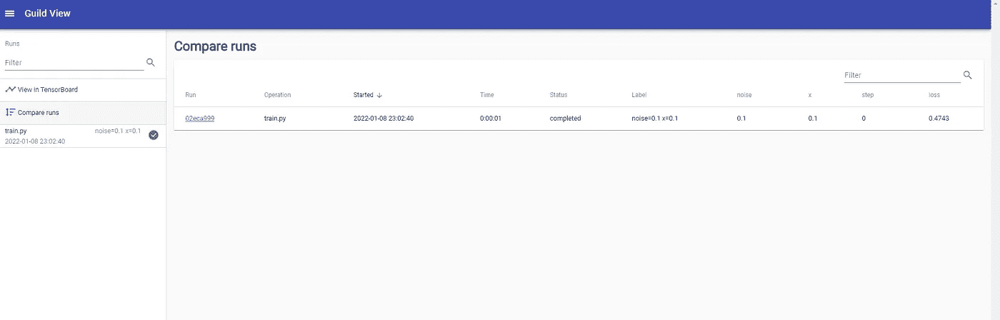

# 更快地构建机器学习模型

> 原文：<https://towardsdatascience.com/building-machine-learning-models-faster-e9fa52ad701>

## 使用 GuildAI 控制机器学习模型



GuildAI(来源:作者)

创建机器学习模型是一项简单的任务，因为有不同的 Python 库可以轻松地帮助构建任何类型的 ML 或 AI 模型，但这只是最初的一步，因为我们需要分析结果，调整 hypermeters，通过构建管道和跟踪模型性能来加速模型开发。

如果你想建立一个可持续的高性能模型，所有这些步骤都非常重要。要实现所有这些步骤的自动化，有不同的 Python 库，但这需要时间和大量的工作，同样地，手动完成会花费更多的时间。

如果我告诉你，所有这些步骤都可以用一个单独的库自动完成，而且非常轻松省时，会怎么样？使用单个库，您可以:

1.  追踪你的模特的训练
2.  分析性能
3.  调整超参数
4.  自动化管道
5.  云上的培训和备份等。

GuildAI 是一个开源的 python 库，它不仅有助于创建机器学习模型，还能满足随后的其他需求，正如我们上面提到的。它是一个基于 GUI 的交互式仪表板，允许与 ML 模型相关的不同功能。

在本文中，我们将使用 GuildAI 来跟踪模型性能。

让我们开始吧…

# 安装所需的库

我们将从使用 pip 安装 GuildAI 开始。下面给出的命令可以做到这一点。

```
pip install guildai
```

# 创建模型

对于 GuildAI，我们需要创建一个模型，并将其保存在一个. py 文件中，我们将使用 GuildAI 呈现该文件，以在一个独立的仪表板中分析该模型。将该文件命名为“train.py”。

让我们创建模型，

```
import numpy as np x = 0.1
noise = 0.1 loss = (np.sin(5 * x) * (1 - np.tanh(x ** 2)) + np.random.randn() * noise)print("loss: %f" % loss)
```

正如你在这里看到的，我们已经创建了一个基本模型来理解 GuildAI 是如何工作的。

# GuildAI 仪表板

现在，我们需要遵循某些步骤来使用 GuildAI，使用新的 Jupyter 笔记本，我们将创建一个新目录来存储我们的 train.py 文件。

```
!mkdir guild-start
```

在这之后，我们将移动到公会开始目录。

```
!cd guild-start
```

由于我们已经将模型存储在这个目录中，现在我们可以使用 train.py 文件在这个目录中直接运行 GuildAI。下面给出的命令可以做到这一点。

```
!guild run train.py
```

为了查看仪表板，我们需要使用 view 命令。

```
!guild view
```


GuildAI(来源:作者)

正如你在这里看到的，这是 GuildAI 仪表板的主页。在这里，我们可以清楚地分析模型及其属性，如损耗、噪声等。这个模型只运行过一次，所以我们没有什么可以比较的，但是你可以运行多次实验来进行比较。

继续尝试使用不同的模型，并创建 GuildAI 仪表板来解释模型和比较实验。如果您发现任何困难，请在回复部分告诉我。

本文是与 [Piyush Ingale](https://medium.com/u/40808d551f5a?source=post_page-----e9fa52ad701--------------------------------) 合作完成的。

# 在你走之前

***感谢*** *的阅读！如果你想与我取得联系，请随时通过 hmix13@gmail.com 联系我或我的* [***LinkedIn 个人资料***](http://www.linkedin.com/in/himanshusharmads) *。可以查看我的*[***Github***](https://github.com/hmix13)**简介针对不同的数据科学项目和包教程。还有，随意探索* [***我的简介***](https://medium.com/@hmix13) *，阅读我写过的与数据科学相关的不同文章。**