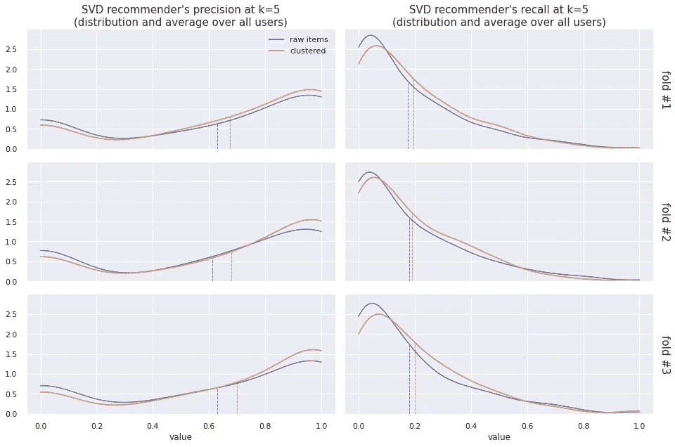

# 构建节省内存的元混合推荐引擎:从后到前(第 2 部分)

> 原文：<https://towardsdatascience.com/building-memory-efficient-meta-hybrid-recommender-engine-back-to-front-part-2-51a7d4546e90>

作者图片

# 系列概述

在[的前一部分](/building-memory-efficient-meta-hybrid-recommender-engine-back-to-front-part-1-7be279ca92a6#ccae-eae504b69e1b)中，我们回顾了基于记忆的推荐系统的机制，并构建了一个定制的协同过滤推荐器。今天，我们将应用来自流行 Python 模块的“开箱即用”推荐器，评估它们的效率，并尝试一些技术来无缝改进被称为[网飞奖获得者](https://pantelis.github.io/cs301/docs/common/lectures/recommenders/netflix/)的 SVD 预测算法。在 [RBC Group](https://www.rbcgrp.com/ua/rozshirena-analitika/) ，我们乐于分享我们在设计所谓的元混合推荐引擎以解决实际业务问题方面的经验。

# 你能推荐更多吗？

值得提醒的是，基于记忆的推荐器的魔力就在几步之内:

*   准备和缩放用户-项目交互的向量(所谓的特征向量)；
*   计算用户特征向量之间的距离(所谓的“相似度”矩阵)；
*   考虑所选预测算法的补充规则和限制，将“相似性”矩阵乘以可用评级矩阵。

这表明协同过滤推荐器的准确度改进包括:

*   调整“用户的邻域”，即考虑更相似用户的评级；
*   过滤评级矩阵，即考虑与用户先前评级的项目相似的项目；
*   或者两者都有！

这些改进将把您的“纯”[基于记忆的推荐器](/building-memory-efficient-meta-hybrid-recommender-engine-back-to-front-part-1-7be279ca92a6#ccae-eae504b69e1b)转变为混合推荐器，这意味着不可避免地失去了模型的简单性和对外部数据源的需求(与评分矩阵相关)，例如来自用户简档、在线会话和/或项目的文本和视觉内容的数据。

在 [RBC Group](https://www.rbcgrp.com/ua/rozshirena-analitika/) ，我们开发并成功采用了一种有点特殊的技术，以保持 recsys 复杂性、可解释性和资源效率之间的平衡，这表明我们的发现是一种*元混合推荐器*。

该技术限于 **(1)** 基于项目的描述性特征(也称为元数据)对项目进行初步聚类，以及 **(2)** 利用基于用户的协同过滤推荐器对聚类方式的原子化评级矩阵进行后续处理(完成)。

在这种情况下，每个用户的邻域被有效地调整，因为从相同聚类的项目的评级构建特征部分向量。这种部分向量具有较小的差异，因为期望用户以相同的方式对相似的项目(在一个聚类内)进行评级。因此，部分向量倾向于更好地反映用户的实际偏好/厌恶。

此外，所提供的技术在拟合模型和进行预测时大大减少了内存消耗。这就是为什么我们将这种元混合推荐器描述为*内存高效的*。

正如[在本系列出版物中早先的](/building-memory-efficient-meta-hybrid-recommender-engine-back-to-front-part-1-7be279ca92a6#ccae-eae504b69e1b)，我们将继续使用来自 [MovieLens](http://movielens.org) 的五星评级的[“ml-latest-small”数据集](https://grouplens.org/datasets/movielens/latest/)和自由文本标记活动来展示所有这些功能。我们将使用所有这些数据对数据集进行初始聚类。也就是电影。

首先，让我们将类型信息转换成虚拟变量:

作为预测因素之一，我们还提取了电影上映的年份，并使用某种频率编码技术对其进行了转换。

让我们进一步从标签中提取和设计一些有用的预测器。将标签列表与标题文本结合后，我们可以利用该组合来构建 TD-IDF 向量:

包括降维在内的所有主要预处理步骤都包含在一个管道中:

在应用简单的 k-均值聚类之前，我们已经确定了最佳聚类数:

让我们给集群分配任意标签，看看电影的分布情况:

看起来现在我们已经准备好进行我们的主要实验了。因此，我们将 SVD 算法(来自 Python [surprise](https://surprise.readthedocs.io/en/stable/) 模块)应用于(1)原始数据，然后应用于(2)循环中聚类数据的每个片段。每次我们都会测量精度和召回率的分布来比较结果:

元混合推荐器的一些突出表现是明显的。此外，如前所述，这种方法也是内存高效的:

为了更深入地理解这个例子中推荐引擎内部发生了什么——您应该[浏览整个代码](https://jovian.ai/wldmrgml/post-recsys)。

## 外卖笔记

因此，我们的主要信息很简单，但却很强大:当你开始把(协同过滤)推荐引擎想象成一种算法，它基于用户 A 与已经体验过与项目 X 交互的其他用户的*相似度*来以某种方式估计用户 A 与未知项目 X 的交互(也称为项目的评级)——你会立即意识到这种估计的准确性应该在多大程度上取决于测量用户之间相似度的准确性。提高测量这种相似性的准确性的一种方法(超出了纯数学方法的范围)是通过将您要比较的用户集合限制为他们共享共同特征的一些高级子集(元聚类)。如果你喜欢对你的项目集进行(元)聚类，并反复运行你的推荐引擎，情况也是如此。这种“幼稚”的方法可以显著提高任何“开箱即用”推荐算法的整体效率。