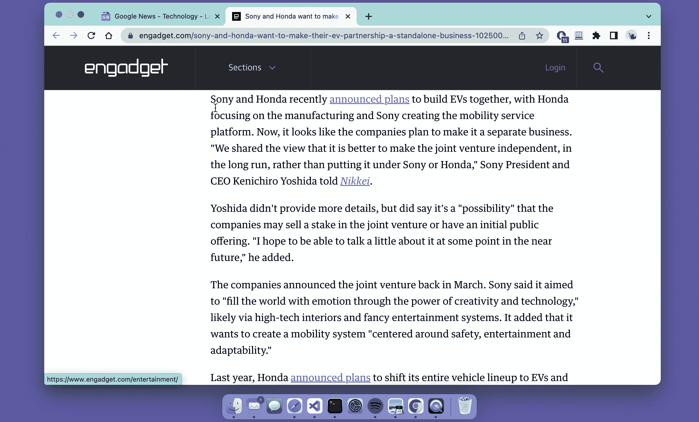
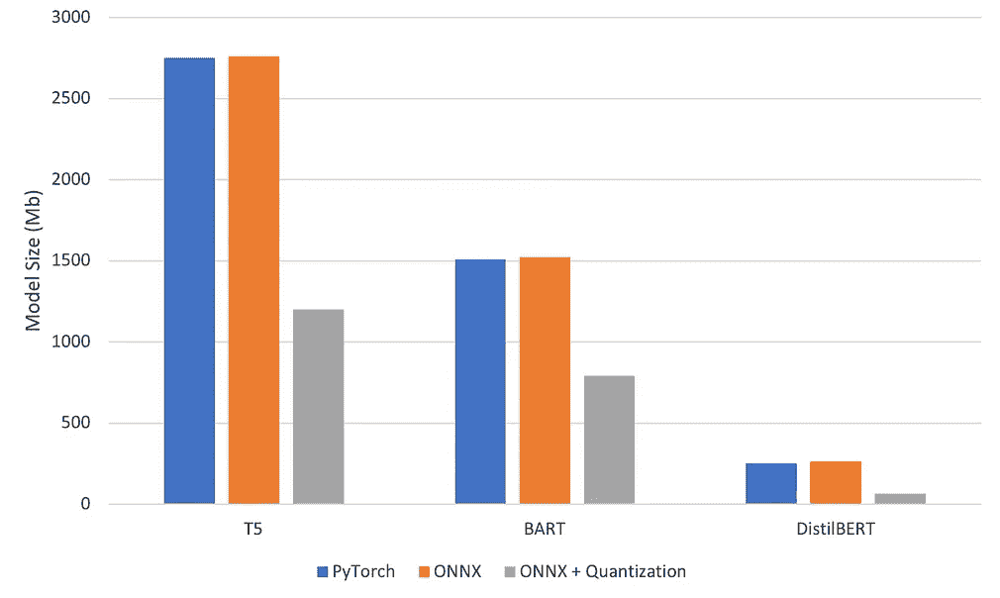
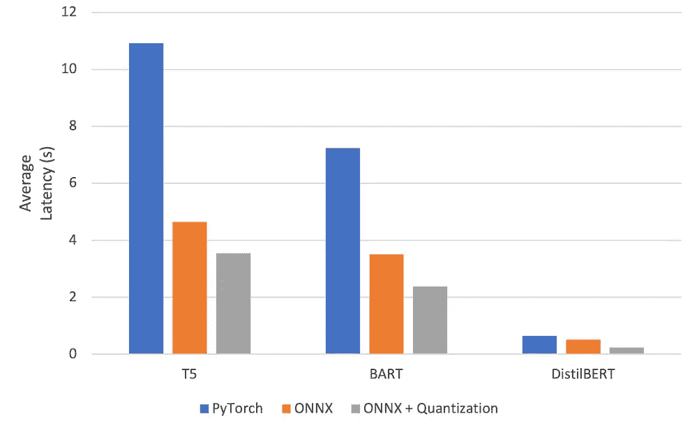
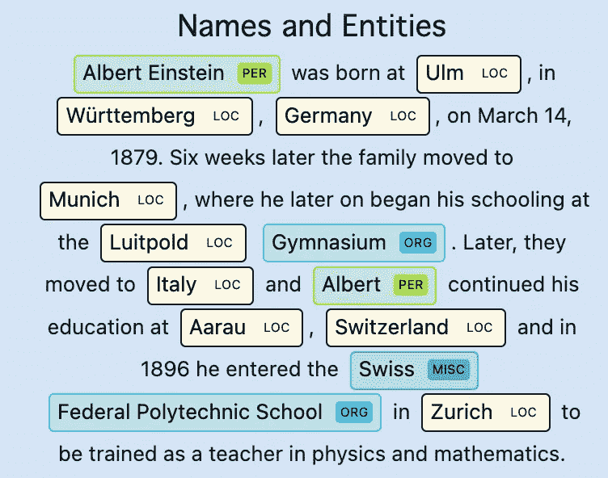
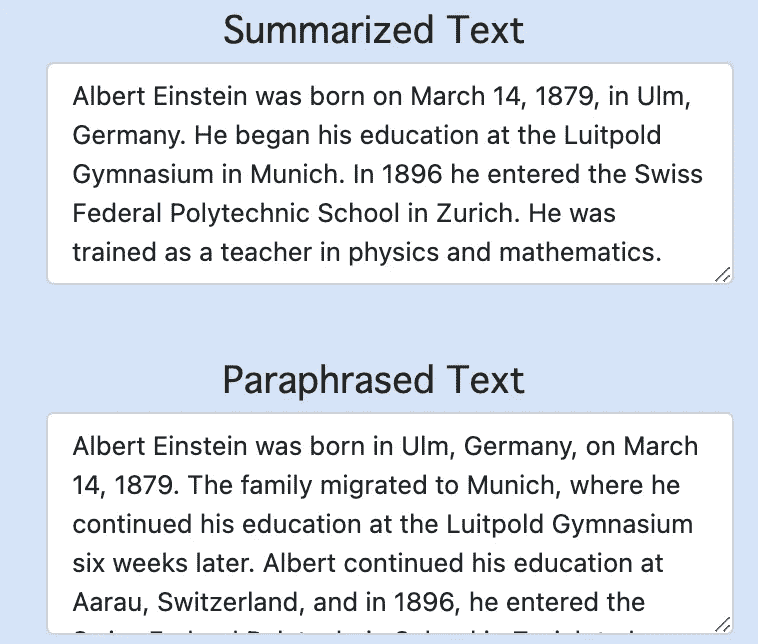
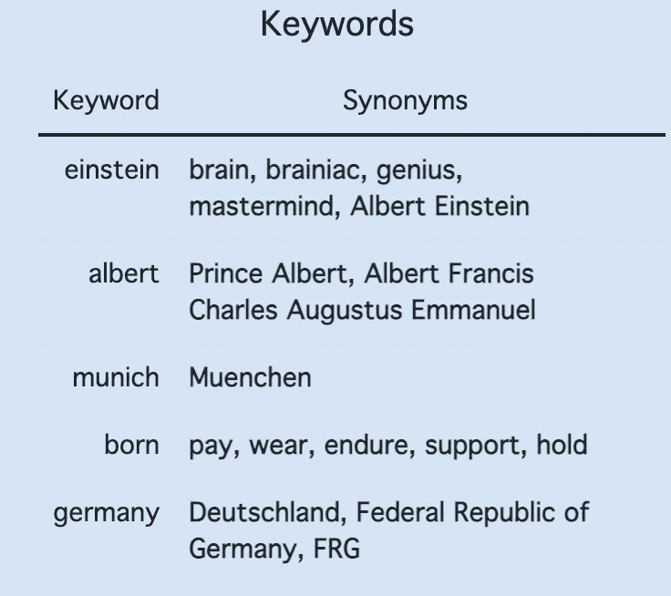

# 用拥抱脸变压器构建 NLP 供电的应用

> 原文：<https://towardsdatascience.com/building-nlp-powered-applications-with-hugging-face-transformers-9f561effc84f>

## 和 Docker 部署在 Google Chrome 上

布雷特·乔丹在 [Unsplash](https://unsplash.com?utm_source=medium&utm_medium=referral) 上的照片

我最近完成了拥抱脸团队的几个人写的关于变形金刚的奇妙的新自然语言处理的书，并受到启发，将我的一些新知识用于一个基于 NLP 的小项目。在寻找一些想法的时候，我看到了泰赞·萨胡的一篇[优秀博客文章](https://medium.com/data-science-at-microsoft/developing-microsoft-edge-extensions-powered-by-sota-nlp-models-f3991f18daa4)，他在文章中构建了一个微软 Edge 扩展来解释你屏幕上高亮显示的文本。我想更进一步，通过:

*   a)用 **ONNX 运行时**和**量化**优化模型推理
*   b)包括诸如摘要、命名实体识别(NER)和关键词提取的特征。

这个想法是，这创造了最终的随笔伴侣，因为它可以帮助快速理解摘要和 NER 的文本，它可以让那些创造性的汁液随着转述的文本和关键词同义词流动。显然，我希望人们用它来重写他们自己的作品，而不是其他人的…

谷歌 Chrome 上的随笔伴侣演示(图片由作者提供 _

> ***TL；DR:*** [*这个库*](https://github.com/jackmleitch/EssayCompanion) *包含了本文提到的所有代码。ML 的东西可以在*[*src*](https://github.com/jackmleitch/EssayCompanion/tree/main/src)*文件夹中找到，Chrome 扩展的东西在* [*扩展*](https://github.com/jackmleitch/EssayCompanion/tree/main/extension) *文件夹中。*

# 模型

在这个扩展中有四个不同的模型(和 tokenizers)在运行，其中三个是在拥抱脸中发现的！

## [T5 释义模式](https://huggingface.co/ramsrigouthamg/t5-large-paraphraser-diverse-high-quality)

这是所使用的最大型号，达到 2.75Gb(！)，并根据拉姆斯里·古塔姆的解释进行了微调。 **T5** 是在非监督和监督任务的多任务混合上预先训练的编码器-解码器模型，并且对于该模型，每个任务被转换成文本到文本的格式。

首先使用 **NLTK** 的句子分词器 [sent_tokenize](https://www.nltk.org/api/nltk.tokenize.html) 将文本拆分成句子。然后，每个句子通过 T5 模型，每个句子的释义输出被连接起来，得到一个新的释义段落。

释义模型(图片由作者提供)

一些示例输出:

对你的知识的最终考验是你将它传递给另一个人的能力。你将它从一个人传递给另一个人的能力是对你智力的最终衡量。

这很好，我们可以看到我们的转述文本是连贯的，并且具有与原文不同的结构！

## [BART 汇总模型](https://huggingface.co/facebook/bart-large-cnn)

**BART** 也是一个编码器-解码器(seq2seq)模型，具有双向(像 BERT)编码器和自回归(像 GPT)解码器。通过(1)用任意噪声函数破坏文本，以及(2)学习模型以重建原始文本，来预训练 BART。

例如，最近一篇关于欧盟 USB-C 规则实施的 250 字长的新闻文章[用 55 个字来概括:](https://www.eurogamer.net/portable-electronic-devices-sold-in-the-eu-will-require-usb-c-charging-by-autumn-2024)

> *到 2024 年秋季，所有在欧盟销售的便携式电子设备都需要使用 USB Type-C 进行充电。其目的是通过只有一个“通用充电器”来减少电子垃圾，对消费者更加友好。受影响最大的将是苹果的 iPhones 和 iPads，它们将不再能够使用 lightning 线缆。*

哇！它工作得非常出色，简明扼要地挑出了文章中的所有要点。

## [NER 模型](https://huggingface.co/elastic/distilbert-base-uncased-finetuned-conll03-english)

使用了使用 [conll03 英语数据集](https://huggingface.co/datasets/conll2003)为 **NER** 微调的 **DistilBERT** base 无壳模型。DistilBERT 是一个比 **BERT** 更小更快的模型，后者以自我监督的方式在相同的语料库上进行预训练，使用 BERT 基础模型作为教师。NER 模型只是一个蒸馏编码器，在末尾添加了一个标记分类头来预测每个实体:人、位置、组织和杂项。

NER 模型(作者图片)

在 chrome 扩展中，使用 **SpaCy** 在 HTML 中呈现 NER 结果。下面是一些输出示例。

NER 输出示例(图片由作者提供)

## [KeyBERT 关键词提取模型](https://maartengr.github.io/KeyBERT/)

该模型利用 BERT 文本嵌入和余弦相似性来寻找文档中与文档本身最相似的子短语。这个想法是这些子短语是文本中最重要的短语。

首先使用 **KeyBERT** 模型从文本中提取关键词。一旦找到关键词，WordNet 就会被用来寻找每个关键词的同义词。值得注意的是，在 WordNet 中，相似的单词被分组到一个称为 Synset 的集合中，Synset 中的单词被词条化。

KeyBERT 模型(图片由作者提供)

在句子中找到的关键词和相关同义词'*最终考验你的* ***知识*** *是你的能力* ***传达*** *它到另一个'*是:

*   知识:理解、认知、掌握
*   运送:运输、搬运、交付

# 模型优化

在 GPU 上运行推理时，模型的初始性能是 *OK* ，但在 CPU 上运行时性能非常差。甚至 GPU 推理也没有我希望的那么快，因为解码器模型必须顺序解码模型输出，而这是无法并行化的。内存也是一个问题，因为我希望能够在内存和计算资源有限的设备上使用这一扩展(我想到了我的*老式*2015 MacBook pro…)，其中两个型号的大小超过了 1.5Gb！我的目标是尽可能减少这些模型的内存占用，优化 CPU 推理的性能，同时保持模型的性能。

**量化**和**蒸馏**是两种常用于应对规模和性能挑战的技术。蒸馏已经用于 NER 模型，因为 DistilBERT 是 O.G. BERT 模型的蒸馏版本。在我的例子中，由于我有限的计算资源，T5/BART 的提取是不可能的。

我采取的第一步是将 PyTorch 模型转换为 ONNX，这是一种用于机器学习算法的开放表示格式，它允许我们为目标设备(本例中为 CPU)优化推理。拥抱脸变压器库包括一个[工具](https://github.com/huggingface/transformers/blob/main/src/transformers/convert_graph_to_onnx.py)来轻松地转换模型到 ONNX，这是用来转换蒸馏模型。转换编码器-解码器模型有点棘手，因为 seq2seq 转换目前不被 Hugging Face 的 ONNX 转换器支持。然而，我能够利用[这个](https://github.com/Ki6an/fastT5)奇妙的 GitHub 库，它分别转换编码器和解码器，并将两个转换后的模型包装在拥抱面 Seq2SeqLMOutput 类中。

将模型转换为 ONNX 后，QInt8 量化用于以较低位宽数逼近浮点数，显著减少了模型的内存占用，并提高了性能，因为计算可以进一步优化。然而，量化会引入性能损失，因为我们在转换中丢失了信息，但是已经广泛证明(例如，参见此处的)权重可以用 8 位整数表示，而性能没有显著下降。毫不奇怪，ONNX 模型的量化超级容易！

模型量化(图片作者提供)

然后，我们可以针对 CPU 使用率优化模型推断！

优化的 NER 推理(图片由作者提供)

模型优化的结果如下所示。我们可以看到，我们的努力导致了大约 2 倍的大小缩减和大约 3 倍的延迟提升！

PyTorch、ONNX 和 ONNX +量化模型(6 核英特尔酷睿 i7)之间的比较(图片由作者提供)

# 使用 FastAPI + Docker 部署模型端点

为了部署我们的应用程序，我使用了两个工具作为主要构建模块: [**FastAPI**](https://fastapi.tiangolo.com/) 和 [**Docker**](https://www.docker.com/) 。FastAPI 使围绕模型构建 web 框架变得非常容易，Docker 是一个容器化工具，允许我们在任何环境中轻松打包和运行应用程序。

使用 FastAPI，我们将模型打包并构建一个 API 来与它通信。我们还使用 Pydantic 来验证用户输入和模型输出，我们必须非常小心！例如，我们确保输入文本是一个字符串，摘要模型的响应是一个字符串，关键字提取模型返回一个包含字符串列表的字典。

FastAPI 应用程序(图片由作者提供)

Docker 然后被用来容器化 API 服务器，这允许我们在任何机器上运行应用程序，而不用担心复制我的确切环境的麻烦。为了构建服务器的 Docker 映像，我在项目的根文件夹中创建了一个 Docker 文件。

创建 Docker 图像(由作者创建的图像)

为了在线托管扩展，我们可以使用 Azure 的容器服务或者 T2 AWS 的弹性容器服务。我还没有抽出时间来做这件事，但是计划在不久的将来做这件事！

# 构建 Google Chrome 扩展

拼图的最后一块是构建由 3 部分组成的 chrome 扩展:

*   **manifest.json** 包含扩展的配置
*   ***&style . CSS***定义用户界面
*   **popup.js** 与 API 通信，实现扩展的实际功能。

来自扩展的 API 调用(图片由作者提供)

我按照[这个](https://medium.com/data-science-at-microsoft/developing-microsoft-edge-extensions-powered-by-sota-nlp-models-f3991f18daa4)神奇的教程来构建 web 扩展，所以如果你想做类似的事情，请查看一下。我自己做的唯一更改是更改输出以包含更多模型，并以 HTML 格式呈现 NER 结果。这是在网上找到的一些示例文本的最终产品的样子！

Essay Companion 的输出示例(图片由作者提供)

# 结束语

在这篇博文中，我展示了如何利用最先进的 transformer 模型来构建“智能”的基于文本的应用程序。在 CPU 上优化模型推理之前，我首先为解释、摘要、名称实体识别和关键字提取找到合适的模型。然后，我使用 FastAPI 在 API 端点部署模型，并为了可再现性将应用程序容器化。

> *这个项目的所有代码都可以在* [*这个 GitHub 资源库*](https://github.com/jackmleitch/EssayCompanion) *中找到。*

*随时联系我*[*LinkedIn*](https://www.linkedin.com/in/jackmleitch/)*！*