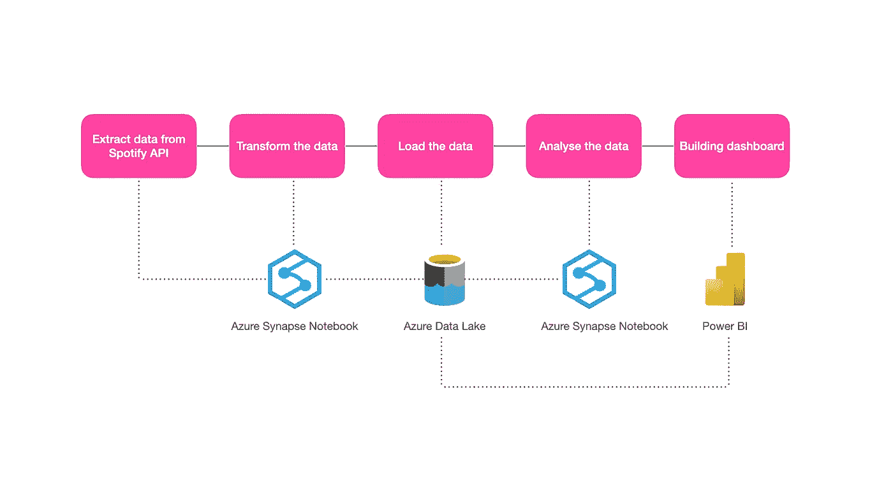
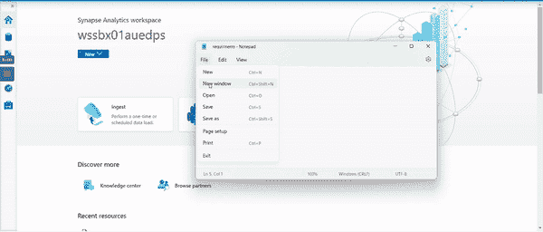
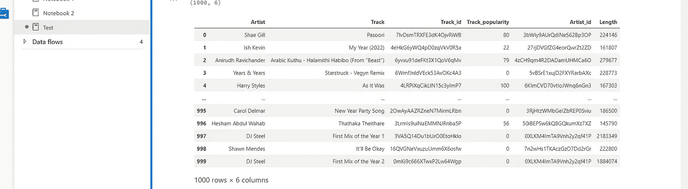
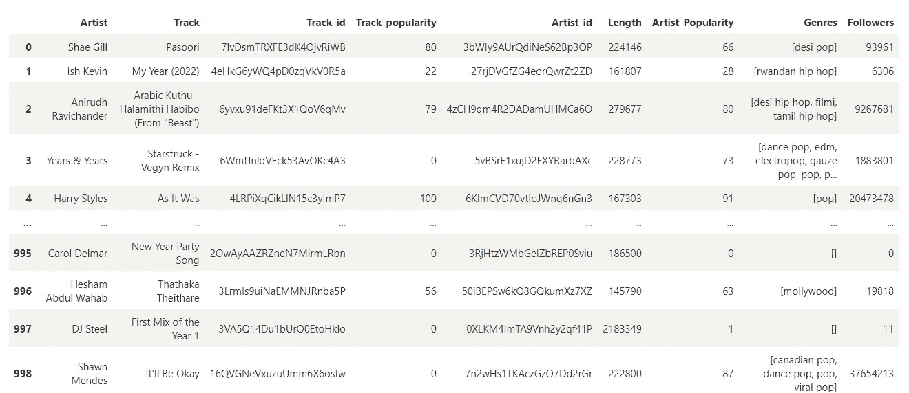
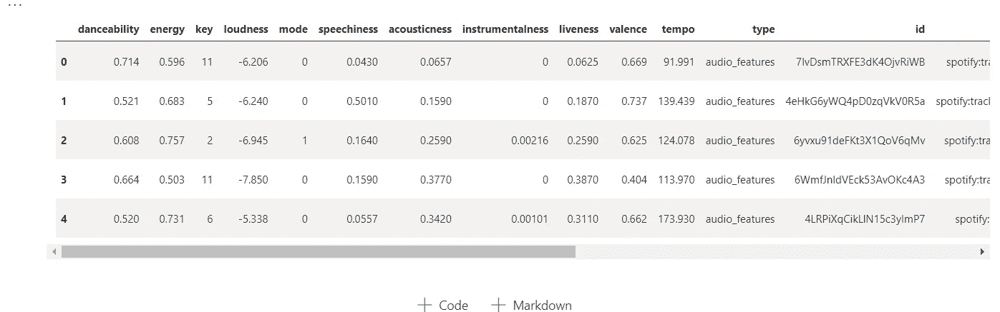
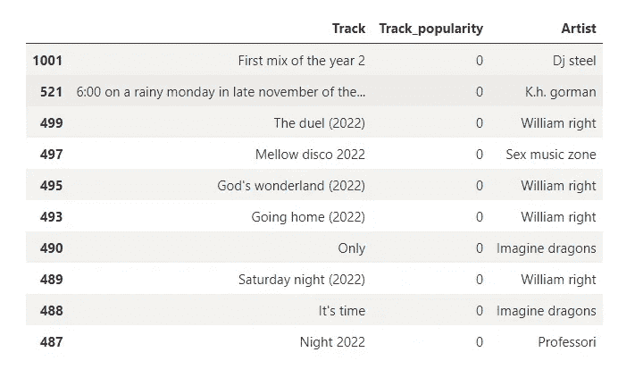
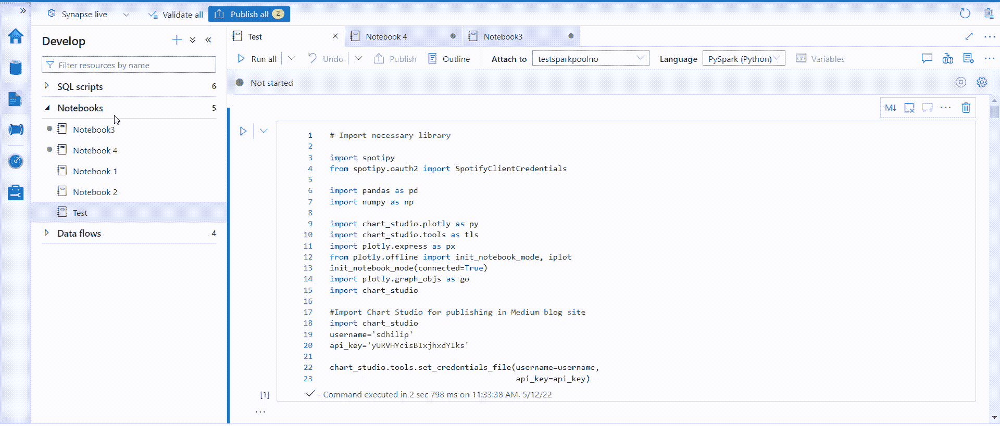
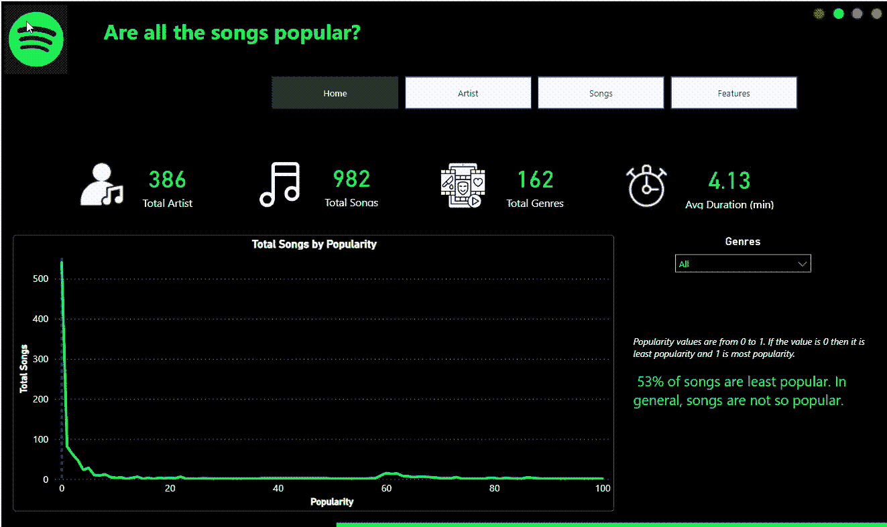

# 使用 Azure Synapse 和 Power BI 构建简单的商业智能项目

> 原文：<https://towardsdatascience.com/building-simple-business-intelligence-project-using-azure-synapse-and-power-bi-39dc5246de02>

## 使用 Synapse 和 Power BI 进行 Spotify 数据分析


迈克·科诺诺夫在 [Unsplash](https://unsplash.com/s/photos/business-intelligence?utm_source=unsplash&utm_medium=referral&utm_content=creditCopyText) 上拍摄的照片

在本文中，我使用 Azure Synapse 和 Power BI 创建了一个非常简单的端到端商业智能(BI)项目。但是，在此之前，BI 是什么？简而言之，BI 是一个收集、存储、分析原始数据并将其转换为可操作的见解的过程，可帮助组织做出更好的数据驱动型决策。

这个项目是使用 Azure Synapse analytics 和 Spotify 数据集创建的。Azure Synpase 是一个统一的平台，[接收、探索、准备、转换、管理和提供数据，以满足即时的 BI 和机器学习需求。](https://azure.microsoft.com/en-us/services/synapse-analytics/#:~:text=Azure%20Synapse%20Analytics%20is%20a,or%20dedicated%20options%E2%80%94at%20scale.)



作者图片

以下是该项目遵循的步骤(请参考上文)，

1.  通过 Azure Synapse 笔记本从 Spotify API 提取数据(由 Apache Spark 提供支持)
2.  使用 Synapse notebook 再次转换数据
3.  将数据从 Synapse 笔记本加载到 Azure 数据湖
4.  使用 Synapse 笔记本分析数据
5.  将数据湖中的数据连接到 Power BI 并构建仪表板。

我们也可以使用 Azure Synpase 管道而不是笔记本来提取数据。然而，我在这个项目中使用了一个笔记本。

在这里，我从我的 synapse 笔记本上复制了代码并粘贴到本文中，因为没有将 Synapse 笔记本嵌入到介质中的选项。拍笔记本截图对阅读没有好处。

本文不会涉及如何在 Azure 或任何云概念中创建 Synapse 笔记本。请点击[查看如何创建 Synapse 笔记本。](https://docs.microsoft.com/en-us/azure/synapse-analytics/spark/apache-spark-development-using-notebooks)

# 先决条件

1.  Spotify 客户端 ID 和客户端密码
2.  Azure Synapse 订阅
3.  超级商务智能桌面
4.  基础云知识

# 1)从 Spotipy API 中提取数据

第一步是从 Spotify 获取 ClientID 和 Client Secret。为此，我们需要[在 Spotify 网站](https://www.spotify.com/uk/signup)注册，然后[创建一个应用](https://developer.spotify.com/dashboard/)来获取 ClientID 和客户端秘密。

Spotify 提供了 SpotiPy API 作为包装器，提取数据非常容易。

在 Synapse Notebook 中，我们可以通过文本文件添加外部 python 库，并将其作为一个包上传到 spark 池中。我将文本文件命名为`requirements.txt`，并添加了库名。请检查[文档](https://docs.microsoft.com/en-us/azure/synapse-analytics/spark/apache-spark-manage-python-packages)。此外，我们需要创建一个 spark pool(用于计算功能)来运行 synapse 笔记本。请查看[此处](https://docs.microsoft.com/en-us/azure/synapse-analytics/quickstart-create-apache-spark-pool-studio)如何在 synapse studio 中创建 spark pool。



作者图片

导入 spotipy 库并初始化 spotipy，提供存储在名为 client_id 和 client_secret 的变量中的`ClinetID`和`Client Secret`

```
**# Import spotipy and initialise**import spotipy
from spotipy.oauth2 import SpotifyClientCredentials
client_id = 'YOUR SPOTIFY CLIENT ID'
client_secret = 'YOUR SPOTIFY CLIENT SECRET ID'
client_credentials_manager = SpotifyClientCredentials(client_id, client_secret)
sp = spotipy.Spotify(client_credentials_manager=client_credentials_manager)
```

导入其他必要的库并用于可视化。

```
**# Import necessary library**import pandas as pd
import numpy as npimport chart_studio.plotly as py
import chart_studio.tools as tls
import plotly.express as px
from plotly.offline import init_notebook_mode, iplot
init_notebook_mode(connected=True)
import plotly.graph_objs as go
import chart_studio
```

Spotify API 提供曲目、艺术家和曲目功能。首先，我们提取了曲目和艺术家特征。然后，我们提取轨迹特征并将它们合并成一个数据集。

# 获取追踪要素

Spotipy 提供了一个 sp.search()方法来查询轨迹要素。请在此查看[文档。](https://developer.spotify.com/documentation/web-api/reference/#/operations/search)请注意，我们一次最多只能有 50 首曲目，最多可以有 1000 条记录。我非常有兴趣看到与印度市场相关的数据，因此我只提取了与印度相关的数据。我们需要在搜索查询的 market 参数中提到国家代码。有关市场代码的更多详情，请[查看此处](https://developer.spotify.com/documentation/web-api/reference/#/operations/get-available-markets)。

```
# Creating an empty lists for track featuresartist = []
track = []
track_popularity = []
artist_id = []
track_id = []
length = []#Quering Track featuresfor i in range(0,1000,50):**# Market = 'IN' -> IN is India**tracks = sp.search(q='year:2022', type = 'track', market = 'IN', limit = 50, offset = i)for i, j in enumerate(tracks['tracks']['items']):
    artist.append(j['artists'][0]['name'])
    artist_id.append(j['artists'][0]['id'])
    track.append(j['name'])
    track_id.append(j['id'])
    track_popularity.append(j['popularity'])
    length.append(j['duration_ms'])
```

将追踪要素转换为数据框

```
# Store in the dataframedf = pd.DataFrame({'Artist' : artist, 'Track' : track, 'Track_id' : track_id, 'Track_popularity' : track_popularity, 'Artist_id' : artist_id, 'Length' : length})print(df.shape)df
```



# 获取艺术家特征

现在，我们需要为上面提取的曲目添加艺术家特征。API 提供了三种艺术家特征`Artist popularity`、`generes`和`followers`。

```
**# Creating an empty list for artist features**artist_popularity = []
genres = []
followers = []for i in artist_id:
    artist = sp.artist(i)
    artist_popularity.append(artist['popularity'])
    genres.append(artist['genres'])
    followers.append(artist['followers']['total'])**#Assigning the above features into dataframe 'df'**df = df.assign(Artist_Popularity = artist_popularity, Genres = genres, Followers= followers)
df
```



# 提取轨迹数字特征

最后，提取上述轨迹的数字特征。获得这些数字特征既容易又简单。请查看[文档](https://developer.spotify.com/documentation/web-api/reference/#/operations/get-audio-features)了解特性详情。有兴趣看看这些功能`danceability, energy, loudness, speechiness, acousticness, liveness, valence and tempo`。

```
**#Creating a empty list**track_features = []**#Extracting the track features by looping into track id and creating a new dataframe called "tfeatures"**for i in df['Track_id']:
    feature = sp.audio_features(i)
    track_features.append(feature)
tfeatures = pd.DataFrame(columns = ['danceability', 'energy', 'key', 'loudness', 'mode', 'speechiness', 'acousticness', 'instrumentalness', 'liveness', 'valence', 'tempo', 'type', 'id', 'uri', 'track_href', 'analysis_url', 'duration_ms', 'time_signature'])
for j in track_features:
    for k in j:
        tfeatures = tfeatures.append(k, ignore_index=True)
tfeatures.head()
```



我们完成了从 API 中提取数据。下一步是转换数据。

# 2)转换数据

做了如下的小改造，

1.  将曲目、艺术家和曲目数字特征合并到一个数据框中。
2.  删除不需要的列。
3.  大写的艺术家和轨道功能；也改变了数据类型。
4.  将持续时间列从毫秒转换为分钟。

```
**# Merging Track and Audio Features and stored in 'df1'**df1 = pd.merge(df, tfeatures, how = 'inner', left_on = 'Track_id', right_on = 'id')**# Dropping the unwanted features**df1 = df1[['Artist', 'Track', 'Track_id', 'Track_popularity', 'Artist_id','Artist_Popularity', 'Genres', 'Followers', 'danceability','energy', 'key', 'loudness', 'mode', 'speechiness', 'acousticness','instrumentalness', 'liveness', 'valence', 'tempo', 'duration_ms']]**#Capitalizing the Artist and Track**df1['Artist'] = df1['Artist'].str.capitalize()
df1['Track'] = df1['Track'].str.capitalize()**# Changing the data type**df1['key'] = df1['key'].astype(int)
df1['mode'] = df1['mode'].astype(int)
df1['instrumentalness'] = df1['instrumentalness'].astype(float)
df1['duration_ms'] = df1['duration_ms'].astype(int)**# Duration_ms in milliseconds. Convert into minutes**df1['duration_ms'] = df1.apply(lambda x: round(x['duration_ms']/60000,2), axis=1)
```

# 3)将数据加载到 Azure 数据湖中

将数据帧`df1`作为名为`spotify.csv`的 CSV 文件存储到 Azure Data Lake 中

我们需要将我们的`spotify.csv`写入数据湖，这非常简单&只需一行代码。请注意，您需要有写权限才能将数据保存到数据湖中。

`abfss://your_container_name@your_storage_account_name.dfs.core.windows.net/filepath`

在这里，我的容器名是`spotify`，我的存储帐户名是`storagegen2dstest`

```
# Saving the Spotify.csv into the data lake.df1.to_csv('abfss://spotify@storagegen2dstest.dfs.core.windows.net/spotify.csv', sep=',', encoding='utf-8', index=False)
```

我们完成了数据湖的数据加载。现在，我们可以开始分析了。您可以直接开始分析，而无需将数据保存到数据湖中；然而，我想保留它，因为我想以后与 Power BI 连接。此外，当 Spotify 中的数据每天发生变化时，我们可以自动执行上述提取、转换和加载操作。

# 4)分析数据

我想找到以下问题的答案，

> 十大榜单上有多少印度歌曲？
> 
> 最不流行的 10 首歌是什么？
> 
> 排名前 10 的流派有哪些？流行类歌曲的百分比是多少？
> 
> 关注者排名前 15 的艺人有哪些？那里有印度艺术家吗？
> 
> 哪首歌最适合跳舞？
> 
> 在数据集中找出 5 位拥有多首歌曲的艺术家
> 
> 音频特征之间有什么关系吗？

从数据湖中读取 CSV。

```
df1 = pd.read_csv('abfss://spotify@storagegen2dstest.dfs.core.windows.net/spotify.csv')
```

## 十大榜单上有多少印度歌曲？

```
**# Sorting the dataframe by Track_popularity**
df1.sort_values('Track_popularity', ascending = False, inplace = True)**# taking the Track and track_popularity and store in a seperate dataframe called "top"**top = df1[['Track', 'Track_popularity']]
top = top.head(15)**# Building visuals**fig = px.bar(top, x='Track', y="Track_popularity", orientation = 'v', title = "Top 10 most popular song",labels={"Track": "Track",
"Track_popularity": "Track Popularity"}
)
fig.show()
```

作者图片

我们的数据与印度市场有关。我没看到前 10 名里有任何印度歌曲。

# 最不受欢迎的歌曲是什么？

```
**#Sorting the dataframe by Track_popularity**df1.sort_values('Track_popularity', ascending = True, inplace = True)
top = df1[['Track', 'Track_popularity', 'Artist']]
top = top.head(10)
```



有趣的是，在最不喜欢的 10 首歌曲中也没有印度歌曲。

# 将歌曲按流派分组，流行类有多少首？

```
**# Taking track, Track_id, genre and store in a new dataframe called genre**genre = df1[['Track', 'Track_id', 'Genres']]
genre = genre.explode('Genres')genre['Genres'] = genre['Genres'].str.capitalize()
genre = genre.groupby('Genres')['Track_id'].count()
genre = genre.to_frame().reset_index()
genre.sort_values('Track_id', ascending = False, inplace = True)
genre = genre.head(10)**#Building Visuals**fig = px.pie(genre, values= 'Track_id', names = 'Genres', title = "Top Genres by total songs", color_discrete_sequence=px.colors.sequential.RdBu)
fig.show()
```

作者图片

流行音乐占据了前十大流派。此外，我们可以看到许多印度流派都在名单上，如宝莱坞，德西嘻哈，电影等。将近 25%的歌曲属于“流行”类。

# 关注者排名前 15 的艺术家

```
**# Grouping the artist and finding top 15 by followers**
followers = df1[['Artist', 'Followers']].groupby('Artist').sum().sort_values('Followers', ascending = False).head(15).reset_index()**#Building visuals**fig = px.bar(followers, y = "Followers", x = 'Artist', orientation = 'v', title = "Top 15 Artist by Followers",labels={"Artist": "Artist","Followers": "Total Followers"})fig.show()
```

作者图片

不确定艺术家的追随者是全球计算的还是每个市场的。然而，我可以看到两位印度艺术家，像‘阿尼鲁德·拉维钱德尔’和‘A . r .拉赫曼’进入前 15 名。

# 哪首歌最适合跳舞？

我们可以使用 danceability 特性来找到哪首歌最适合跳舞。可跳舞性值从 0 到 1。如果该值为 0.0，则最不适合跳舞，1 最适合跳舞。

```
**# Finding top song for best to dance**dance = df1[['Track', 'danceability']].groupby('Track').mean().sort_values('danceability', ascending = False).head(15).reset_index()**# Building visuals**
fig = px.bar(dance, x = 'Track', y = "danceability",  orientation = 'v', title = "Which song is the best to dance to?",labels={"Track": "Track","danceability": "Danceability"})fig.show()
```

作者图片

印度歌曲有，但不在前 5 名。

# 在数据集中找出 5 位拥有多首歌曲的艺术家

```
**# Finding top 5 artists with more than one song**
number = df1[['Artist', 'Track_id']].groupby('Artist').count().sort_values('Track_id', ascending = False).head(5).reset_index()number.rename(columns = {'Track_id':'Total Songs'}, inplace = True)colors=['#fae588','#f79d65','#f9dc5c','#e8ac65','#e76f51','#ef233c','#b7094c'] #color palette**# Building Visuals**
fig = px.treemap(number, path=['Artist'],values='Total Songs', title = "Top 5 artists with more than one song", width=800, height=400)fig.update_layout(treemapcolorway = colors, #defines the colors in the treemap margin = dict(t=50, l=25, r=25, b=25))fig.show() 
```

作者图片

我可以看到一位印度艺术家(阿尼鲁德·拉文钱德尔)位列前五名。

# 轨迹特征的相关矩阵

```
**# Separating features from the dataframe**features = df1[['danceability', 'energy','loudness', 'mode','speechiness', 'acousticness','instrumentalness', 'liveness', 'valence', 'tempo', ]]**# Finding correlation**
df = features.corr()**#Building Visuals**
fig = go.Figure()
fig.add_trace(go.Heatmap(x = df.columns,y = df.index,z = np.array(df),text=df.values,texttemplate='%{text:.2f}'))fig.update_layout(width = 800, height = 800,title = "Correlation Matrix for Track Features", coloraxis1=dict(colorscale="Plasma"))
fig.show()
```

作者图片

音频特征间的相关矩阵。我没有看到这些特征之间有任何高度的相关性，也看到了负相关性。

上述结果是动态的，因为 Spotify API 中的日常数据会根据用户发生变化。

我已经在 Azure Synapse 笔记本上完成了上述全部分析。正如我提到的，没有将 synapse 笔记本嵌入介质的选项。在这里给 synapse 笔记本拍照不会很好看。因此，我只是复制了本文中的代码。



作者图片

# 建筑能源商务智能报告

这是一个有趣的数据集来讲故事。我只是将数据湖中的 CSV 文件连接到 Power BI 并构建了简单的报告。你可以点击查看[互动链接。](https://www.sdhilip.com/spotify-analysis-2/)



作者图片

我们也可以使用其他云平台来执行上述项目。我只是用 Azure，因为我主要是在日常工作的基础上。如果是内部解决方案，我们可以使用 Python、MySQL 和 Power BI。

感谢阅读。