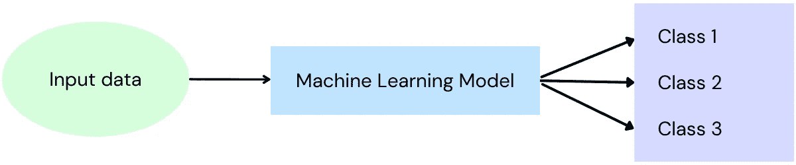
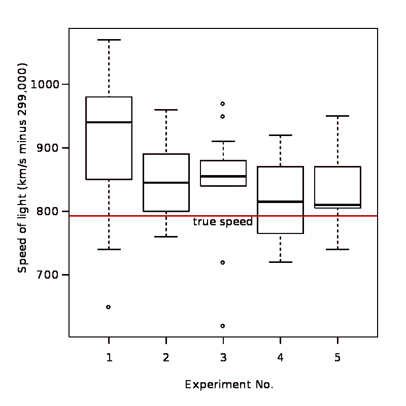

# 如何构建合适的数据集

> 原文：<https://towardsdatascience.com/building-succesful-machine-learning-models-through-proper-datasets-9058f85de5f7>

## 因为坏数据导致坏模型


在 [Unsplash](https://unsplash.com/s/photos/map?utm_source=unsplash&utm_medium=referral&utm_content=creditCopyText) 上由 [Tabea Schimpf](https://unsplash.com/@tabeaschimpf?utm_source=unsplash&utm_medium=referral&utm_content=creditCopyText) 拍摄的照片

# 为什么合适的数据集很重要？

从根本上说，机器学习模型是一种基于训练数据对自身进行配置以预测结果的东西。如果您输入的模型训练数据并不代表模型在实际使用时将面临的数据，那么除了有缺陷的预测之外，您什么都不能指望。本文将为您提供创建良好数据集的见解，该数据集能够表示模型在现实世界中使用时将面临的数据。

但是在我们开始构建伟大的数据集之前，首先，我们必须理解数据集的**组件**(类、标签、特征和特征向量)。然后，我们将继续进行**数据准备**。这就是我们**处理缺失特征**和**缩放特征**的地方。接下来，我们讨论为什么以及如何对数据集进行**分区。**最后，我们将看看为什么我们应该对我们的数据进行最后一次**检查**以及如何发现仍然可能存在的问题，例如**异常值**和**误标** **数据**。

让我们开始吧。

# 数据集的组件

## 类别和标签

在分类任务中，输入要素被映射到离散输出变量。例如，通过考虑输入数据，模型预测输出是“狗”、“猫”、“马”等。这些输出变量被定义为**类**。训练数据中的每个输入都有一个名为**标签**的标识符来表示这些类别。



分类模型如何将输入数据分类。

对一个模型来说，输入只是数字。模型不关心或不知道狗的图像或声音样本之间的区别。这也适用于标签。因此，类可以用我们想要的任何方式来表示。在实践中，我们经常使用从 0 开始的整数值来将标签映射到它们各自的类。下面是一个例子。

```
┌───────┬────────────┐
│ Label │   Class    │
├───────┼────────────┤
│     0 │ person     │
│     1 │ bicycle    │
│     2 │ car        │
│     3 │ motorcycle │
│     4 │ airplane   │
│     5 │ bus        │
│     6 │ train      │
│     7 │ truck      │
│     8 │ boat       │
│     9 │ traffic    │
└───────┴────────────┘
The table is an exerpt from the [COCO dataset](https://cocodataset.org/#home), showing its classes and labels.
```

在上面的示例中，表示自行车的每个输入都标记为 1，表示船的每个输入都标记为 8。你现在可能会想，我们到底在贴什么标签？一个人或者一条船的投入实际上是什么？这就是最重要的**特性**出现的地方。

## 特征和特征向量

要素是模型用来生成标签作为输出的输入。如上所述，这些是数字，根据任务的不同代表不同的东西。例如，在包含三种鸢尾花数据的[鸢尾数据集](https://www.kaggle.com/datasets/uciml/iris)中，**特征**是萼片和花瓣的尺寸。

```
The **four available features** in the iris dataset for the iris flower species known as Setosa are shown below. 
(only the first 5 rows of the dataset are shown)    **Sepal.Length  Sepal.Width  Petal.Length  Petal.Width** Species 
1          5.1          3.5           1.4          0.2    setosa
2          4.9          3.0           1.4          0.2    setosa
3          4.7          3.2           1.3          0.2    setosa
4          4.6          3.1           1.5          0.2    setosa
5          5.0          3.6           1.4          0.2    setosa
```

> 注:上述数据集中的 ***类*** 为鸢尾花的不同种类， **Setosa** ， **Virginica** 和 **Versicolor** 分别赋予这些类 ***标签*** 0、1 和 2。

因此，特征只是我们将用作机器学习模型输入的数字。当训练机器学习模型时，该模型学习输入特征和输出标签之间的关系。我们在这里假设特征和标签之间实际上存在关系。在没有要学习的关系的情况下，模型可能无法训练。

一旦训练结束，学习到的关系用于预测输入**特征向量**(作为输入给出的特征集)的输出标签，其中**未知**类别标签。如果模型继续做出错误的预测，原因可能是用于训练模型的特征不足以识别良好的关系。这就是为什么选择正确的功能在任何机器学习项目的开始都很重要。更多关于选择好的特性和为什么坏的特性应该被忽略的信息可以在我下面的帖子中找到。

[](/feature-selection-choosing-the-right-features-for-your-machine-learning-algorithm-379bda9f3e05)  

特征可以是不同的类型，例如浮点数、整数、序数值(自然的、有序的类别，其中值之间的差不总是相同的)和分类值(其中数字用作代码，例如男性=0，女性=1)。

> 概述:特征是表示我们已知的东西的数字，可以帮助建立与输出标签的关系。看看下面 Iris 数据集的一些行，现在显示了所有组件、要素类和标注。包含所有四个特征的每一行是一个特征向量。

```
 Features                          
          ________________|_____________________       Class   Label
         |                                      |        |       |
**Sepal.Length  Sepal.Width  Petal.Length  Petal.Width  Species** 
    5.1          3.5           1.4          0.2       setosa     0
    7.1          3.0           5.9          2.1       virginica  1
    4.7          3.2           1.3          0.2       setosa     0
    6.5          3.0           5.8          2.2       virginica  1
    6.9          3.1           4.9          1.5       versicolor 2
```

# 准备数据

既然我们已经很好地掌握了数据集所包含的内容，那么在我们开始构建伟大的数据集之前，有两件重要的事情需要考虑:

*   如何处理缺失的特征值
*   特征缩放

## 处理缺失的功能

您可能会遇到数据中缺少要素的情况，例如，您可能忘记进行测量，或者某个样本的某些数据已损坏。大多数机器学习模型不具备接受缺失数据的能力，所以我们必须用一些数据来填充这些值。

在这种情况下，您可以采取两种方法。您可以添加一个远远超出要素范围的值，因为模型对该值的重视程度较低，或者使用数据集上要素的平均值来代替缺失值。

在下面的示例中，缺少一些功能，用空格表示。

```
**Sepal.Length  Sepal.Width  Petal.Length  Petal.Width  Label** 
    5.1          3.5           1.4                      0
    7.1                        5.9          2.1         1
    4.7          3.2                        0.2         0
                 3.0           5.8          2.2         1
    6.9          3.1           4.9          1.5         2
```

计算所有特征的平均值，如下表所示

```
**Sepal.Length  Sepal.Width  Petal.Length  Petal.Width** 
    5.95         3.2           4.5          1.5 
```

通过用平均值替换缺失值，我们可以获得可用于训练模型的数据集。这并不比拥有真实数据更好，但在数据丢失时应该足够好了。如果数据集足够大，另一种方法是通过生成的直方图识别该模式(最常出现的值)。

## 特征缩放

通常，由不同特征组成的特征向量可以具有多个不同的范围。例如，一组要素的值介于 0 和 1 之间，而另一个要素的值介于 0 和 100，000 之间。另一个会在-100 到 100 之间。因此，一些特征将由于其较大的范围而支配其他特征，这导致模型在准确性方面受到影响。为了克服这个问题，使用了**特征缩放**。

为了理解这一概念以及巩固我们在上述章节中所学的内容，我们将创建一个合成数据集并查看它。

```
┌────────┬─────┬──────┬──────┬───────────┬────────┬───────┐
│ **Sample** │ **f1** │ **f2** │ ** f3 ** │ **f4** │ **f5** │ **Label** │
├────────┼─────┼──────┼──────┼───────────┼────────┼───────┤
│      0 │  30 │ 3494 │ 6042 │  0.000892 │ 0.4422 │     0 │
│      1 │  17 │ 6220 │ 7081 │ 0.0003064 │ 0.5731 │     1 │
│      2 │  ***16 │ 3490 │ 1605 │ 0.0002371 │   0.23*** │     0 │
│      3 │   5 │ 9498 │ 7650 │ 0.0008715 │ 0.8401 │     1 │
│      4 │  48 │ 8521 │ 6680 │ 0.0003957 │ 0.3221 │     1 │
│      5 │  64 │ 2887 │ 6073 │ 0.0005087 │ 0.6635 │     1 │
│      6 │  94 │ 6953 │ 7970 │ 0.0005284 │ 0.9112 │     0 │
│      7 │  39 │ 6837 │ 9967 │ 0.0004239 │ 0.4788 │     1 │
│      8 │  85 │ 9377 │ 4953 │ 0.0003521 │ 0.5061 │     0 │
│      9 │  46 │ 4597 │ 2337 │ 0.0004158 │ 0.8139 │     0 │
└────────┴─────┴──────┴──────┴───────────┴────────┴───────┘
The first column is the sample number. 
Each row of a sample is an input to the model, given as a **feature vector.** A feature vector is represented by 5 **features** for each sample
- feature set is {f1, f2, f3, f4, f5}
- Typically the full feature vector is refered to with the uppercase letter (F).
- Feature vector for sample 3 can be refered to as F3\. 
One feature vector is highlighted in bold for sample 2 in the table.
The last column is the **label**. There are two **classes**, represented by the labels 0 and 1.Notice how samples start with 0\. This is because we work with Python and Python is 0 indexed.
```

现在到缩放部分。您可以在我们的综合数据表中看到，不同的特性有不同的范围。让我们看看所有的特征，并考虑它们的最小值、最大值、平均值和范围值。

```
┌──────────┬───────────┬───────────┬──────────┬────────────┐
│ Feature  │   Range   │  Minimum  │ Maximum  │  Average   │
├──────────┼───────────┼───────────┼──────────┼────────────┤
│ f1       │        89 │         5 │       94 │       44.4 │
│ f2       │      6611 │      2887 │     9498 │     6187.4 │
│ f3       │      8362 │      1605 │     9967 │     6035.8 │
│ f4       │ 0.0006549 │ 0.0002371 │ 0.000892 │ 0.00049316 │
│ f5       │    0.6812 │      0.23 │   0.9112 │     0.5781 │
└──────────┴───────────┴───────────┴──────────┴────────────┘Notice how the features have widely varying ranges. This means that we should carry out feature scaling.
```

让我们来看两种缩放方式。首先，我们考虑最简单的方法，称为**，意思是定心**。这是通过减去整个数据集中要素的平均值来实现的。整个集合的平均值就是每个值的总和除以值的总数。

f1 的平均值是 44.4。因此，为了使 f1 居中，我们将属于 f1 特征的每个样本值替换为值-44.4。对于样本 0，它是 30–44.4，对于样本 2，它是 17–44.4，依此类推。对所有值都这样做，我们得到下表。

```
┌────────┬───────┬─────────┬─────────┬─────────────┬─────────┐
│ Sample │  f1   │   f2    │   f3    │     f4      │   f5    │
├────────┼───────┼─────────┼─────────┼─────────────┼─────────┤
│      0 │ -14.4 │ -2693.4 │     6.2 │  0.00039884 │ -0.1359 │
│      1 │ -27.4 │    32.6 │  1045.2 │ -0.00018676 │  -0.005 │
│      2 │ -28.4 │ -2697.4 │ -4430.8 │ -0.00025606 │ -0.3481 │
│      3 │ -39.4 │  3310.6 │  1614.2 │  0.00037834 │   0.262 │
│      4 │   3.6 │  2333.6 │   644.2 │ -0.00009746 │  -0.256 │
│      5 │  19.6 │ -3300.4 │    37.2 │  0.00001554 │  0.0854 │
│      6 │  49.6 │   765.6 │  1934.2 │  0.00003524 │  0.3331 │
│      7 │  -5.4 │   649.6 │  3931.2 │ -0.00006926 │ -0.0993 │
│      8 │  40.6 │  3189.6 │ -1082.8 │ -0.00014106 │  -0.072 │
│      9 │   1.6 │ -1590.4 │ -3698.8 │ -0.00007736 │  0.2358 │
└────────┴───────┴─────────┴─────────┴─────────────┴─────────┘
The synthetic data set we created, after mean centering. 
Note that now, the average value for each feature is 0\. In other words the center for each feature is 0 and values can be above or below this center.
```

平均居中足以进行特征缩放。但是我们可以更进一步。请注意，即使我们进行均值居中，范围也是不一样的。通过执行所谓的**标准化**或**标准化**，我们可以将平均值周围的数据分布(标准差)改变到相同的范围内。换句话说，我们把标准差改为 1。因为我们还执行均值居中，所以在归一化数据时，除了标准差为 1 之外，要素的均值为 0。

如果我们有一个特征值 x，可以简单地用值 z 代替 x，其中:


方程式[计算标准分数。](https://en.wikipedia.org/wiki/Standard_score)

其中: *μ* 是数据集上每个特征的[平均值](https://en.wikipedia.org/wiki/Mean)和 *σ* 的[标准差](https://en.wikipedia.org/wiki/Standard_deviation)。

幸运的是，由于我们正在使用 Python 和 Numpy，这可以通过一行代码来完成。

```
# Assuming the data is stored in the numpy array F
**F = (F - F.mean(axis=0)) / F.std(axis=0)**
```

这将提供下表:

```
┌────────┬───────┬───────┬───────┬───────┬───────┐
│ Sample │  f1   │  f2   │  f3   │  f4   │  f5   │
├────────┼───────┼───────┼───────┼───────┼───────┤
│      0 │ -0.51 │ -1.14 │     0 │  1.89 │ -0.63 │
│      1 │ -0.98 │  0.01 │  0.43 │ -0.89 │ -0.02 │
│      2 │ -1.01 │ -1.14 │ -1.84 │ -1.21 │ -1.62 │
│      3 │ -1.41 │   1.4 │  0.67 │  1.79 │  1.22 │
│      4 │  0.13 │  0.99 │  0.27 │ -0.46 │ -1.19 │
│      5 │   0.7 │  -1.4 │  0.02 │  0.07 │   0.4 │
│      6 │  1.77 │  0.32 │   0.8 │  0.17 │  1.55 │
│      7 │ -0.19 │  0.28 │  1.64 │ -0.33 │ -0.46 │
│      8 │  1.45 │  1.35 │ -0.45 │ -0.67 │ -0.33 │
│      9 │  0.06 │ -0.67 │ -1.54 │ -0.37 │   1.1 │
└────────┴───────┴───────┴───────┴───────┴───────┘
Now we see that all features are similar to each other, compared to our original dataset. 
```

# 对数据集进行分区

由于我们遵循了上面的步骤，我们现在有了一组很好的特征向量。但是等等！在用它训练我们的模型之前，我们需要做一些事情。我们不应该使用整个数据集来训练我们的模型，因为我们需要将数据集分成两个，或者理想情况下三个子集。这些子集被称为**训练数据**、**验证数据、**和**测试数据**。

**训练数据**用于训练模型。

**测试数据**用于评估训练模型的准确性和性能。重要的是，模型*永远不要在训练期间看到这些数据，因为那样的话，我们将根据它已经看到的数据来测试模型。*

不是每个型号都需要**验证数据**。但是，当模型是深度学习模型时，它会有所帮助。该数据集的使用类似于训练过程中测试数据的使用。它告诉我们训练过程进行得如何，并提供关于何时停止训练以及模型是否适合数据的信息。

综上所述，**训练**和**验证**数据**用于建立模型。**测试数据**被保留以评估模型。**

## 每组应该放多少数据？

根据一些文献，将数据集的 90%分成训练数据和 5%分别用于验证和测试数据被认为是标准的做法，而其他人建议 70%用于训练，15%分别用于较小数据集的验证和测试，或者 80%用于训练，10%用于验证和测试。

保留数据集中的先验概率很重要。如果一个类以 20%的概率存在于现实世界中，这也应该反映在我们的数据集中。这也应该扩展到我们创建的子集。我们如何做到这一点？有两种方法:

*   按类别划分
*   随意采样

## 按类别划分

当您处理小型数据集时，可以使用此方法。首先，我们确定每个类有多少个样本。接下来，对于每个类，我们将选择的百分比放在一边，并将所有内容合并在一起。

例如，假设我们有 500 个样本，其中 400 个属于类别 0，100 个来自类别 1。我们想做一个 90/5/5 的分割(90%的训练数据，5%的测试和 5%的验证)。这意味着我们从类 0 中随机选择 360 个样本，从类 1 中随机选择 90 个样本来创建训练集。从类别 0 的剩余未使用的 40 个样本中，随机选择 20 个样本用于验证数据，20 个用于测试数据。从类别 1 的剩余未使用的 10 个样本中，每个样本将进入验证和测试数据集。

## 随意采样

如果我们有足够的数据，我们不需要非常精确，并遵循上述方法。相反，我们可以随机化整个数据集，并根据必要的百分比拆分我们的数据。

但是如果我们有一个小的数据集呢？我们可以使用诸如 **k 倍交叉验证**的方法来确保这种方法的问题，例如训练和测试数据中的不平衡，可以得到缓解。如果你想了解更多关于这个方法的知识，可以看看我下面的帖子。

[](https://medium.com/@praveennellihela/what-is-k-fold-cross-validation-5a7bb241d82f)  

# 最后看一下我们的数据

现在，我们已经执行了许多操作，以确保我们的数据集足以训练一个模型。我们确保它具有良好的特性，没有缺失的特性，并且这些特性是规范化的。我们还以适当的方式将数据集划分为子集。

最后重要的一步是最后一次查看数据，以确保一切都有意义。这允许我们识别任何**错误标记的数据**和**缺失或异常数据**。这些错误可以通过将数据加载到电子表格中来识别，或者对于更大的数据集，使用 Python 脚本来汇总数据。我们应该查看平均值、中值、标准偏差以及最大值和最小值，以了解是否有任何异常数据。我们还可以生成[箱线图](https://en.wikipedia.org/wiki/Box_plot)来识别异常值。



迈克尔逊实验的方框图示例，用户:史高斯——自己的作品，[公共领域](https://commons.wikimedia.org/w/index.php?curid=1501411)，

在执行了上述所有步骤后，我们可以确信我们的数据集是一个合适的数据集，可以帮助模型很好地训练，进而对现实世界的数据产生准确可靠的预测。这可能看起来很费力，但请永远记住，如果你给你的机器学习模型输入垃圾，它们只会输出垃圾。您应该始终确保您的数据集足够好。

# 摘要

在这篇文章中，我们看了为什么一个好的数据集是重要的。然后，我们通过查看组件(如类和要素)来了解数据集的构成。我们讨论了数据准备以及如何处理缺失特征和缩放特征。接下来，我们讨论了为什么以及如何对数据集**进行分区。**最后，我们了解了为什么我们应该对我们的数据进行最终检查，以及如何发现仍然存在的问题，例如异常值和错误标记的数据。

如果你觉得这篇文章有用，可以考虑[订阅](https://medium.com/@praveennellihela/subscribe)我和[加入媒体](https://medium.com/@praveennellihela/membership)。你的会员支持我和你直接阅读的其他作家。

感谢您的阅读！在以后的帖子中再见。