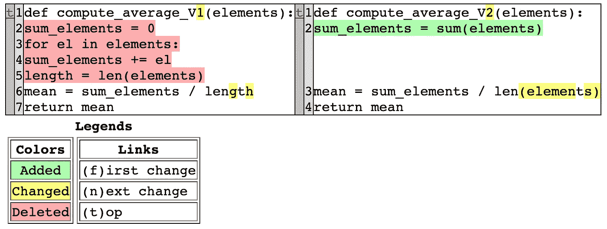

# 用 Python 枚举和 difflib 构建单词校正器和代码比较工具。

> 原文：<https://towardsdatascience.com/building-word-correctors-and-code-comparison-tools-with-python-enums-and-difflib-860d369d53d1>


照片由[诺德伍德主题](https://unsplash.com/@nordwood)在 [Unsplash](https://unsplash.com/) 上拍摄

Python 总是以其几乎无穷无尽的模块和 API 适应任何平台给我们带来惊喜。无论何时，只要您有时间阅读文档，寻找实际的实现，总有一些东西需要学习。此外，当您发现某些模块时，您可以想到有趣的用例，反之亦然。

在 Python 附带的有趣的附加元素中，我们将在这个简短的教程中关注两个 gem，即`enums ( since Python 3.4 )`和`difflib ( since Python 2.1 )`，以解决与词法纠正和版本代码比较相关的简单用例。

在第一部分中，我们试图提出一个带有枚举的 Python 词法校正器。在第二部分，我们缓慢但稳定地过渡到使用`difflib`，并尝试用它构建一个小的代码比较工具。

## **1。枚举**:

枚举器也是用其他编程语言实现的数据结构。它们帮助我们建立一组带有常量值的逻辑实体。
根据官方文件:

> 枚举是绑定到唯一常数值的一组符号名称(成员)。在枚举中，成员可以通过标识进行比较，并且枚举本身可以被迭代。

一般来说，建议用大写字母指定成员。我们不一定会一直遵守这条规则。

让我们宣布一个`DSStrategy`，它包含任何数据科学策略的通用和重要步骤:

```
from enum import Enumclass DSStrategy(Enum):
    Cleaning = 1
    Exploring = 2
    Learning = 3
    Evaluating = 4
```

我们可以像这样循环遍历枚举结构:

```
>>> for strategy in Strategy:
...    print(strategy, end=" "), print(strategy.value)Strategy.Cleaning 1
Strategy.Exploring 2
Strategy.Learning 3
Strategy.Evaluating 4
```

有趣的事情:我们有一组[分解方法](#https://docs.python.org/3/library/enum.html#supported-sunder-names)可以用来将额外的行为分层到我们的枚举器中。例如，当我们声明成员时，`_order_`分隔符规定了特定的顺序。假设你不遵守指示的顺序:

```
>>> class DSStrategy(Enum):
...    _order_ = 'Cleaning Exploring Learning Evaluating'
...    Cleaning = 1
...    Learning = 2
...    Exploring = 3
...    Evaluating = 4...
TypeError: member order does not match _order_
```

如果成员的值不重要，将每个成员与`auto`实例相关联就可以了。然后，Enum 类将为您计算出这些值。如果没有指定，默认情况下，该值从 1 开始。

```
>>> from enum import Enum, auto>>> class DSStrategy(Enum):
...    _order_ = 'Cleaning Exploring Learning Evaluating'
...    Cleaning = auto()
...    Exploring = auto()
...    Learning = auto()
...    Evaluating = auto()

>>> for strategy in Strategy:
...    print(strategy, end=" "), print(strategy.value)Strategy.Cleaning 1
Strategy.Exploring 2
Strategy.Learning 3
Strategy.Evaluating 4
```

枚举器使用起来非常简单，不会引起太多的麻烦..并不总是这样！
我们的下一个用例将枚举带到了下一个层次。我们将构建一个小而简单的词法 Python 校正器。

我们最初为枚举器提供 Python 关键字，以单下划线为前缀，并将类型和错误消息作为值。使用单下划线不是为了扰乱成员的可访问性、名称空间或类似的东西。只是从语法上来说，不能使用简单的 python 关键字作为变量或成员。这是我想到的第一个简单的解决方法，所以我应用了它。

`__init__`方法将每个成员视为一个整体实例。它调用第一个和第二个值作为成员的属性。`custom_message`方法用于动态构建一个`property`,显示一条消息来警告我们出现了词法错误。

我们编写了一个小库，在其中我们故意注入了一些词法错误:

我们将它保存到一个本地文件中，并用一些基于正则表达式的处理加载它:

注意`lines_of_code`是如何存储预处理的代码行的:

```
>>> lines_of_code['def_ add x  y  ',
 'return x   y',
 '',
 'def sub x  y  ',
 'return x   y',
 '',
 'deff mul x  y  ',
 'returnn x   y',
 '',
 'def div x  y  ',
 'tryy  ',
 'return x   y',
 'exceptt ',
 'print  Problem dividing by 0\.  ',
 'return Nonne']
```

让我们编写一个函数，一行一行地扫描`lines_of_code`，一次看一行，扫描每个单词，并与我们的`KeyWords`枚举器中定义的 python 关键字列表进行比较。

我们慢慢地开始过早地揭开一些`difflib`的美丽。注意使用了`get_close_matches`来查找最近的单词。我们稍后将对此进行详细阐述。让我们首先测试我们的功能。我们用`__members__`属性调用关键字成员列表。

```
>>> check_and_correct(lines_of_code, KeyWords.__members__)Error at line 0 .
Function definer. Careful how you define your function. 
Error at line 6 .
Function definer. Careful how you define your function. 
Error at line 7 .
Return Keyword. Careful how you close your functions !
Error at line 10 .
Exception Keyword. Easier to ask for forgiveness than permission. Wink wink !
Error at line 14 .
None operator. You should be reviewing your None usage.
```

实验很有趣，但是没有检测到一些错误的行，这是可以理解的，因为我们只向枚举器提供了所有 Python 关键字的子集。因此，我们没有足够的地面真相。

拥有所有 Python 关键字的更正确和完整的方法是调用`keyword`库并调用它的`kwlist`实例。您可能会找到组成 Python 语法的所有关键词。

```
>>> from keyword import kwlist
>>> for kw in kwlist: print(kw, end=" |")False |None |True |and |as |assert |async |await |break |class |continue |def |del |elif |else |except |finally |for |from |global |if |import |in |is |lambda |nonlocal |not |or |pass |raise |return |try |while |with |yield |
```

让我们稍微修改一下前面的函数，使其适应新的关键字查找列表:

接下来的内容清楚地表明，我们的模块拦截了更多的词法不规则性:

```
>>> check_and_correct_kwlist(lines_of_code, kwlist)Error at line 0.
Maybe you wanted to write def instead of def_.
Error at line 6 .
Maybe you wanted to write def instead of deff.
Error at line 7 .
Maybe you wanted to write return instead of returnn.
Error at line 10 .
Maybe you wanted to write try instead of tryy.
Error at line 12 .
Maybe you wanted to write except instead of exceptt.
Error at line 14 .
Maybe you wanted to write None instead of Nonne.
```

我们对我们的小型修正引擎更有信心，因为我们有一个更完整的关键字集(不像我们的关键字枚举器仍然缺少一些)。

您可能仍然对`get_close_matches`功能感到好奇，您应该深入了解一下。让我们在英语词汇的一个重要的[子集上尝试一下，并从中构建一个单词校正器。首先，我们将词汇表作为一个列表加载:](https://github.com/dwyl/english-words/blob/master/words_alpha.txt)

```
with open('words_alpha.txt','r') as f:
    lines = [line.lstrip(' ').rstrip('\n') for line in f]
```

我能想到的第一个词:`computers`。让我们寻找`compputeers`，这样我们就可以测试校正器了:

```
>>> get_close_matches('compputeers', lines, n = 4, cutoff = .8)['computers', 'computes', 'computer', 'compeers']
```

使用非常直观。`1st`和`2nd`自变量分别代表要查找的单词和要提供的查找列表。`n`是与搜索的单词最相似的候选单词的数量。`cutoff`是一个相似性得分阈值，低于该阈值的候选人将不予考虑。这将节省你很多时间来探索和测试其他模糊匹配和相似性包。`difflib`是标准库的纯宝石。

## 2.difflib 的增量:

通俗地说，`difflib`是一个比较序列的包，无论是简单的列表，字符串等等。

在许多方面，似乎`difflib`比我们之前看到的更有诱惑力。我们能想到的一个有趣的用例是代码比较器。我们的目的是比较两个版本的基本平均计算模块。

还记得当你是一个完全的 Python 初学者时，你奋力克服了它。凭借当时获得的技能，你最初的反应会驱使你写下以下内容:

```
*## V1.py*def compute_average_V1(elements):
    sum_elements = 0
    for el in elements:
        sum_elements += el
    length = len(elements)
    mean = sum_elements / length
    return mean
```

然而，由于您从未停止学习并热衷于优化您的代码，在您编写新版本一年后:

```
*## V2.py*def compute_average_V2(elements):
    sum_elements = sum(elements)
    mean = sum_elements / len(elements)
    return mean
```

现在，你正在想比较这两个版本的最快方法。让我们一起努力吧。首先，我们将两个版本都作为列表加载。

首先，我们决定将它们作为两个**大**字符串进行比较:

```
V1 = ' '.join(lines_of_code_V1)
V2 = ' '.join(lines_of_code_V2)
```

所以第一个版本应该是这样的:

```
'def compute_average_V1(elements): sum_elements = 0 for el in elements: sum_elements += el length = len(elements) mean = sum_elements / length return mean'
```

出于好奇，我们用`SequenceMatcher`类检查两个版本之间的任何相似之处。我们可以把它看作一个 API，帮助我们捕获和匹配两个字符串共有的部分:

```
>>> from difflib import SequenceMatcher
>>> sm = SequenceMatcher(None, V1, V2)>>> for block in sm.get_matching_blocks():
...    print(block)Match(a=0, b=0, size=21)
Match(a=22, b=22, size=27)
Match(a=71, b=49, size=3)
Match(a=102, b=52, size=36)
Match(a=139, b=95, size=1)
Match(a=141, b=98, size=12)
Match(a=153, b=110, size=0)
```

尽管看起来很有趣，但它并没有提供足够的信息来动态地告诉我们代码进化是如何进行的。我们可以尝试另一种方法:

`get_opcodes`在从第一个版本到第二个版本所需的透明性和操作方面非常优雅。
在每个操作码的开头，你知道代码片段是否被替换、删除或者在整个版本中保持不变。
`difflib`提供了第二个 api，它更侧重于计算差异，而不是匹配序列，这也有一个简单的实现。

different delta 的每一行都以两个字母的代码开头:

*   `‘- ‘` :表示该行是版本 1 独有的。
*   `‘+ ’`:表示该行是版本 2 独有的
*   `‘‘` :表示该行为两个版本所共有。
*   `‘? ‘` :表示该行在两个序列中都不存在。这也意味着该行可能只是描述了导致上面行中增量的特定字符。

那么，你把所有关于差异的细节汇总到一个格式化的文件中怎么样？第三个有趣的 API 允许将增量转换成 HTML 页面，如果代码片段更大的话，这个页面会更直观、更易读。

```
from difflib import HtmlDiffhtmlDiff = HtmlDiff()
result = htmlDiff.make_file(lines_of_code_V1, lines_of_code_V2)
with open('comparison_result.html','w') as file :
    file.write(result)
```

我们剩下要做的就是通过浏览器打开文件:



作者拍摄的照片

你现在对自己在学习道路上的进步有了更清晰的认识。这个工具可以帮助你做到这一点。

## 参考

公文— [列举](https://docs.python.org/3/library/enum.html)和 [difflib](https://docs.python.org/3/library/difflib.html)