# 使用 Power BI 从头开始构建您的第一个交互式仪表盘

> 原文：<https://towardsdatascience.com/building-your-first-interactive-dashboard-from-scratch-using-power-bi-af7a3e0203d4>

## 关于 Microsoft Power BI，您需要从头到尾了解的一切


丹尼尔·科尔派在 [Unsplash](https://unsplash.com?utm_source=medium&utm_medium=referral) 上拍摄的照片

这篇博文是我与 [BusinessOne](https://www.businessoneunimelb.com/) 合作的培训研讨会的两部分摘要的第二部分，BusinessOne 是一家由学生运营的公益咨询俱乐部，位于墨尔本大学。

该研讨会旨在帮助 BusinessOne 的项目团队学习使用 Microsoft Excel 的基本数据清理技术，并介绍 Microsoft Power BI 作为一种工具来构建交互式仪表盘，以交流数据集中的关键见解。

今天的博文将关注研讨会的后半部分，即使用我们在研讨会前半部分清理的事务数据集，使用 Power BI 从头构建一个仪表板。

为了更容易理解，我建议先看一遍第一部分。或者，你可以在下面看到研讨会的完整录音。

车间使用的所有材料也可以在我的 GitHub [这里](https://github.com/chongjason914/b1-workshop)找到。

# 介绍

Power BI 是微软开发的交互式软件，主要用于数据可视化和商业智能。

输入数据可以来自各种来源，包括数据库、网页或结构化文件，如 Excel 电子表格、CSV 文件等。然后，这些数据可以通过不同的视觉效果可视化，以交流见解。

在本次研讨会中，我们将从 Excel 电子表格中读取数据，使用内置的 Power BI 可视化工具创建可视化效果，并在完成后在线发布报告。

在这个过程中，我还将介绍 Power BI 用户界面，并简要描述作为初学者第一次开始时需要注意的一些事情。

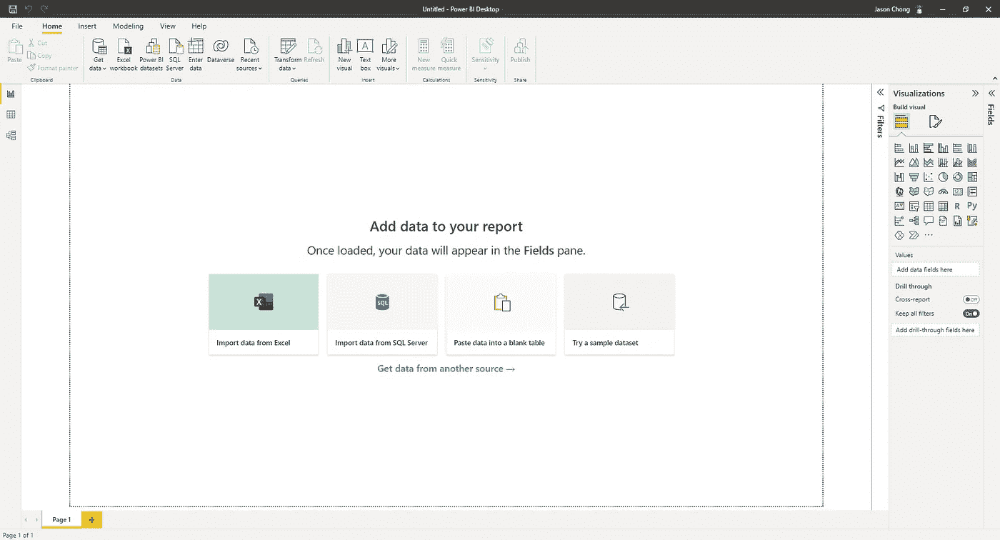

Power BI 上的 Starter 报告页面；作者图片

# 检索数据

构建任何仪表板的第一步都是获取数据。只需从“获取数据”图标下的一系列选项中进行选择，包括 Excel、SQL Server、CSV 文件等。

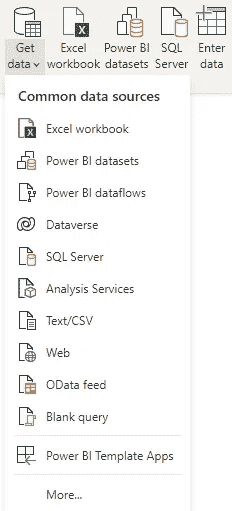

Power BI 可以从一系列不同的数据源获取数据；作者图片

这里，因为我们的事务数据集是 Excel 电子表格的形式，所以我们将继续使用 Excel 工作簿选项。

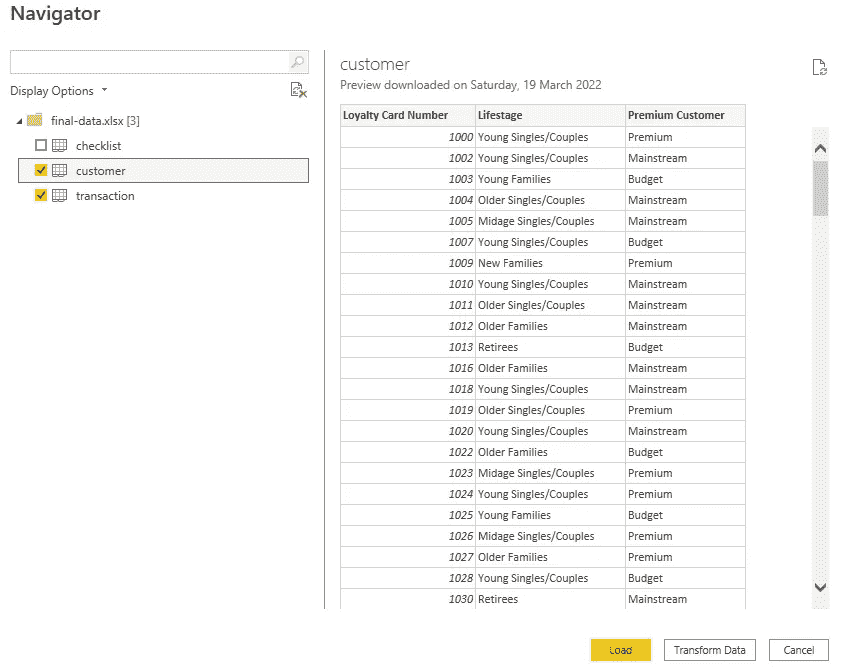

选择客户和交易记录表；作者图片

为了构建我们想要的仪表板，我们需要选择 customer 和 transaction 表。选中后，点击加载按钮加载到 Excel 电子表格中。

# Power BI 用户界面

现在让我们讨论一下 Power BI 用户界面。Power BI 中有 3 个主要选项卡:

1.  报告
2.  数据
3.  模型

首先，报告选项卡。这是我们在构建仪表板时将花费大部分时间的选项卡。这是我们可以拖放我们想要创建的不同视觉效果的地方。我们的最终产品将准确反映报告页面上的内容。

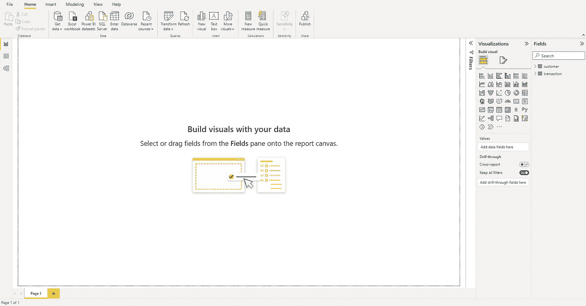

Power BI 中的“报告”选项卡；作者图片

接下来，我们有数据选项卡。“数据”选项卡显示当前加载到 Power BI 中并可供使用的所有表格。这里，我们有两个数据表:customer 和 transaction，稍后我们将使用它们来构建我们的仪表板。

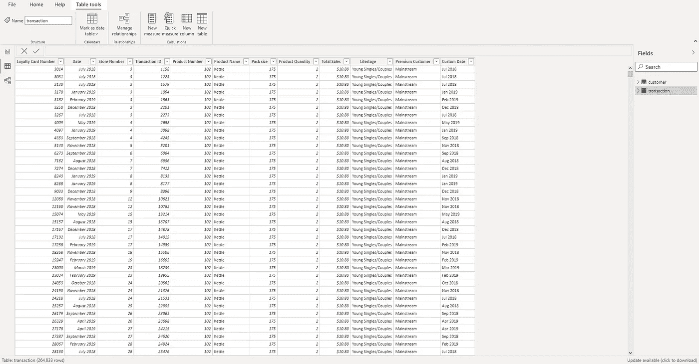

Power BI 中的数据选项卡；作者图片

最后但同样重要的是，模型选项卡。model 选项卡为我们提供了表之间关系的视图。在这里，我们可以看到交易表和客户表之间的多对一关系，在忠诚卡号字段上连接。

换句话说，这意味着忠诚度卡号对于客户表中的每一行都是唯一的，但在交易表中是重复的。这是有意义的，因为客户可以在一年中多次购买商品，因此会多次出现在事务表中，而客户表只为每个唯一的客户保留一条记录(行)。

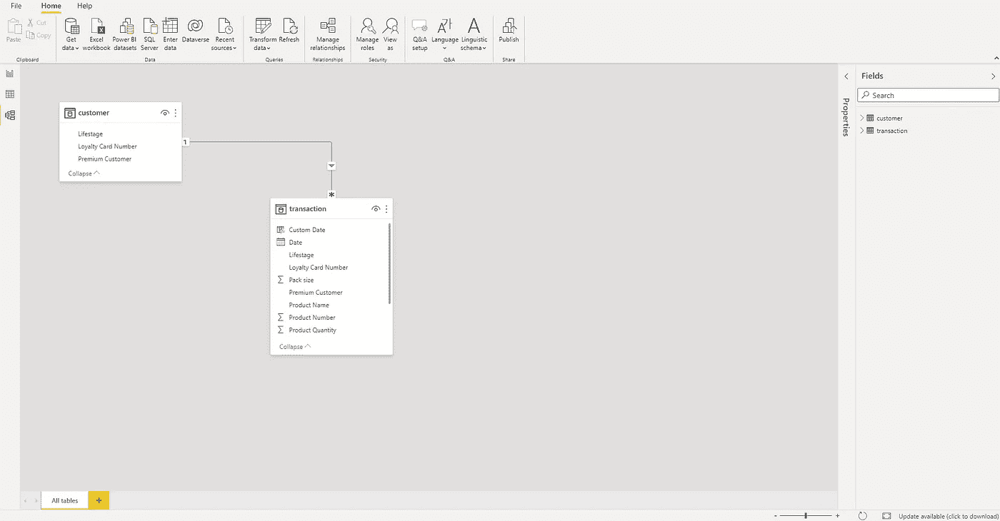

Power BI 中的“模型”选项卡，图片由作者提供

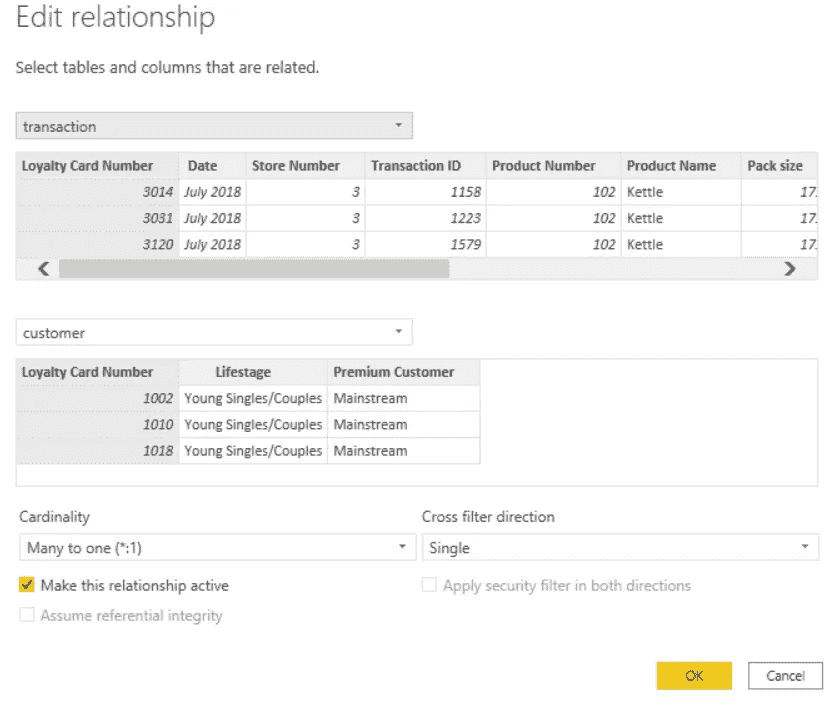

事务表和客户表之间的多对一关系；作者图片

# 创造你的第一个视觉效果

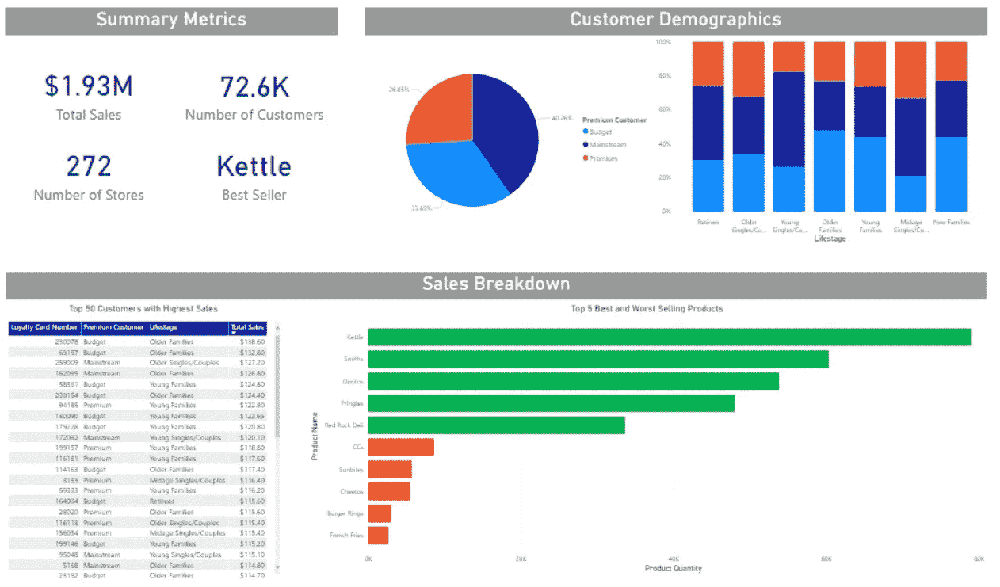

Power BI 中的视觉效果示例；作者图片

Power BI 与 PowerPoint 非常相似，都有类似的拖放感觉。我们可以在上面看到 Power BI 中现成的一系列视觉效果:卡片、饼图、表格和条形图。

对我来说，学习 Power BI 的最佳方式是体验视觉效果，以及根据自己的需求定制它们的方式。为了帮助您开始，我将演示如何创建一个简单的卡片视觉效果，即下面看到的一个汇总指标。

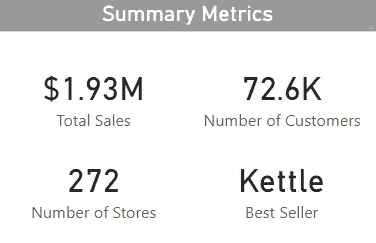

Power BI 中的显卡；作者图片

首先，我们需要选择一个视觉。在这种情况下，我们需要一个卡片视觉效果。然后，只需将一个字段从右侧的可用表中拖到字段部分。这将自动填充卡片视觉效果，并显示 193 万美元的值，这是该零售商店在该特定财政年度产生的总销售额。

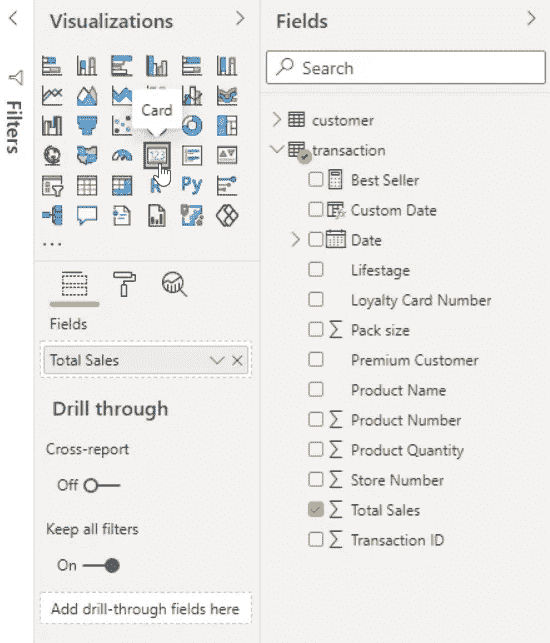

一旦填充了视觉效果，您将可以选择自定义它们，例如更改颜色、字体大小、数值小数位数等等。正如我之前说过的，学习这个的最好方法是简单地通过试验不同的选项，看看它们每个都做了什么。

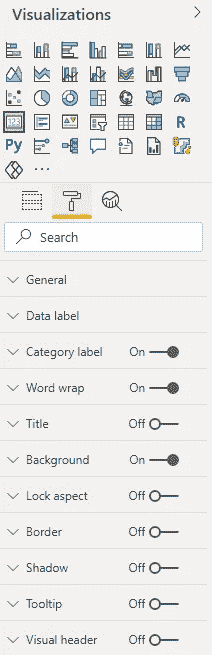

定制视觉效果的选项；作者图片

# DAX 公式

有时候，计算并不像计算总销售额那样简单。以畅销产品为例，我们希望产品名称的销售量最高。

因为我们在计算中考虑了多个字段，即产品名称和销售数量，所以仅使用其中一个字段名称是不够的。这就是达克斯的用武之地。

DAX 是数据分析表达式的缩写。它们与 Excel 公式非常相似，因为它们主要用于使用内置函数定义自定义计算。

为了证明这一点，让我们使用 DAX 来计算最畅销的产品。

```
Best Seller = TOPN(1, VALUES('transaction'[Product Name]), CALCULATE(SUM('transaction'[Product Quantity])))
```

该公式本质上是说，对每种产品的所有销售量求和，从最高到最低排列，最后取最上面的一个。这会给我们带来最畅销的产品。

# 过滤

接下来，我们将学习过滤器。顾名思义，过滤器允许我们只显示满足特定条件的数据。

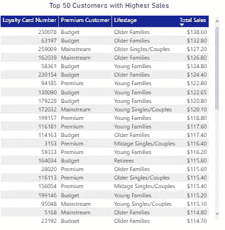

将表格筛选到前 50 行；作者图片

假设上面的例子中，一个表显示了记录销售额最高的前 50 名客户。这可能是过滤器最简单的用例之一。

要应用筛选器，我们需要做的就是首先选择表，导航到筛选器窗格，然后应用按总销售额字段排序的前 N 名筛选器。参见下图以供参考。

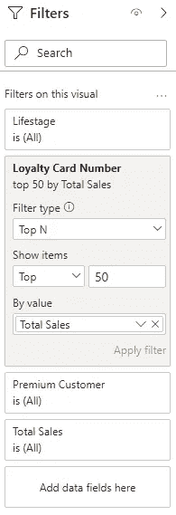

作者图片

# 切片器和切片器交互

现在让我们来谈谈切片机。切片器，类似于卡片以及我们上面看到的所有其他图表，是 Power BI 中的一种视觉类型。它允许用户过滤连接到特定切片器的图表上的数据。

这里，我们有一个不同产品名称的切片器。比方说，如果有人要选择一个特定的产品，这将改变聚集柱形图和时间序列图，以反映所选择的产品。

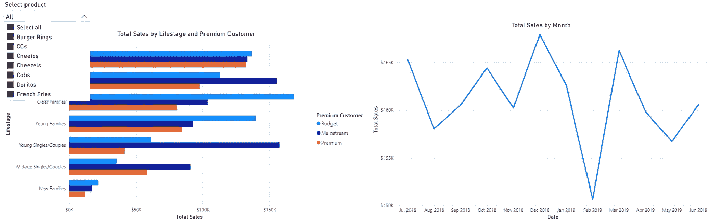

选择所有产品的默认切片器；作者图片

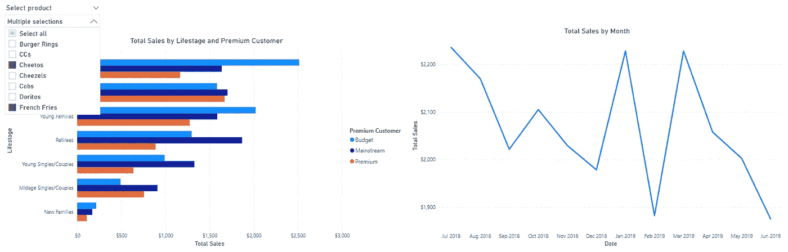

仅选择特定产品将会更改与其连接的图表；作者图片

不过，在使用切片器时要记住的一点是切片器交互。除非手动关闭，否则切片器将与同一报告页面上的所有视觉效果进行交互。

这可以在上面的格式部分找到。

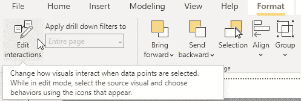

编辑切片器交互；作者图片

# 视觉分组

将视觉效果组合在一起有两个好处:

1.  保持工作区整洁，这反过来使我们能够快速、轻松地在页面上找到特定的视觉效果
2.  同时隐藏或移动一组视觉效果

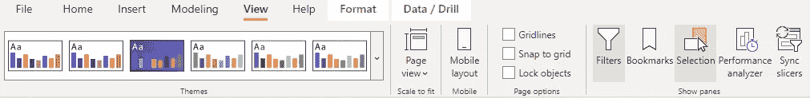

视图部分下的选择图标；作者图片

虽然没有硬性规定你应该如何分组你的视觉效果，但我个人喜欢根据它们在仪表盘上的位置或类别来分组。

例如，在这里，我把我所有的视觉效果分成了 3 个独立的、有适当标签的桶:

*   汇总指标
*   客户人口统计
*   销售细目

如果我需要回去检查或更改报告中的某个特定视图，这只会让事情变得更容易。

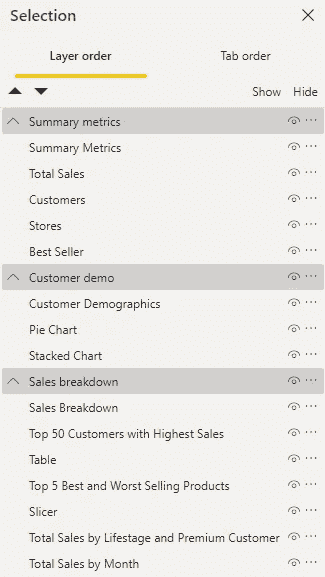

根据视觉效果在仪表板上的位置或类别对其进行分组；作者图片

# 发布报告

最后，在所有艰苦的工作完成后，一旦您对报告的外观感到满意，您现在就可以发布和共享报告了。

只需导航到主页部分，点击发布图标，按照提示操作，直到报告在线发布。一旦上线，你就可以分享给不同的用户群，获得反馈。

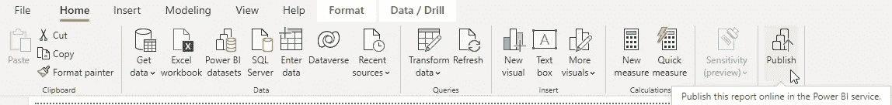

在线发布报告；作者图片

总之，Power BI 是一个非常强大和流行的工具，特别是用于商业智能目的。它不仅易于使用，而且如果使用得当，还可以向各种利益相关者传达关于数据的有意义的见解。

为了补充这篇文章，我强烈建议在我的 YouTube 频道上观看完整的视频，在那里我将更详细地演示这里涉及的每个步骤。

如果你从这篇文章中发现了任何价值，并且还不是一个媒体会员，如果你使用下面的链接注册会员，这对我和这个平台上的其他作者来说意义重大。它鼓励我们继续推出像这样的高质量和信息丰富的内容——提前感谢您！

[](https://chongjason.medium.com/membership)  

不知道接下来要读什么？这里有一些建议。

[](/data-cleaning-techniques-in-microsoft-excel-you-need-to-know-4075cbb30731)  [](/addressing-the-issue-of-black-boxes-in-machine-learning-f86429acbb2a)  [](/pandas-zero-to-hero-a-beginners-tutorial-to-using-pandas-f64e57386c7c) 