# 用 R 语言构建你的第一个闪亮的应用程序

> 原文：<https://towardsdatascience.com/building-your-first-shiny-app-in-r-82c7d1f5f309>

## 了解如何使用 R 构建一个闪亮的应用程序，并展示您的代码和交互工作


照片由[西格蒙德](https://unsplash.com/@sigmund)@ unsplash.com 拍摄

*【免责声明:此帖子包含一些我的 Udemy 课程的附属链接】*

因此，您已经使用 R 开发了您的数据科学模型或分析，现在您可能想以一种可视化和直观的方式展示结果。

你对你的故事讲述做了一些调整，添加了一些情节，但是你觉得你的视觉效果有点静态，让你在整个故事讲述过程中重复代码或情节。此外，您很难在输出中隐藏您的代码，这是很关键的，您知道这会给业务或非技术用户带来一些困惑。

很幸运，你有`shiny`！[*闪亮*](https://shiny.rstudio.com/) 是一个很棒的构建 R 应用的库，你可以在其中嵌入 R 代码和结果，而不必构建自己的前端和后端。`shiny`这些功能令人惊叹，使您能够即时提供应用，同时让您的用户与您的模型或分析结果进行交互。

关于`shiny`的另一个很酷的事情是，它可以直接从 R 中使用，就像任何其他库一样——使用 R 代码，我们可以建立一个基本的 HTML 交互页面，可以用来显示图表、数据框或其他元素。

在本帖中，我们将探索一点`shiny`库，目的是帮助你构建你的第一个应用。我们将使用几个例子，例如:

*   建立一个简单的“hello world 应用程序”，了解后端和前端流程。
*   构建一个简单的散点图应用程序。
*   构建一个具有三种不同视图的应用程序，包括来自决策树的一些结果。

在这篇文章的最后，你应该准备好使用 r 来使用这个库。虽然`shiny`需要一些时间来掌握，但我们在这里学到的东西有望成为一个良好的开端，让你开始使用复杂的`shiny`应用程序，以及用它连接你的数据帧和绘图。

我们开始吧！

# 我们第一个闪亮的香草应用

让我们从在我们的环境中安装`shiny`开始:

```
install.packages(‘shiny’)
```

安装完`shiny`包后，我们可以使用常用的`library`函数将它加载到我们的环境中:

```
library(shiny)
```

首先，我们将声明一个`fluidPage`。这个功能将是我们支配和与 web 应用前端交互的主要方式。就其核心而言，`fluidPage`是一个非常标准的行列格式用户界面(它甚至包括一些 [bootstrap](https://getbootstrap.com/) 特性)，对于大多数基本数据产品来说，这应该足够了。它通常也是可调整的，能够在应用程序中整合许多部分，正如我们将在几分钟内看到的。

简单来说，`fluidPage`可以认为是我们`shiny` app 的前端层。在这里，我们将构建用户将看到的一切，以及它将如何与后端交互。

我们的第一页非常简单，只打印了`"My first shiny page!"`:

```
sp <- fluidPage(
  "My first shiny page!"
)
```

为了运行我们的应用程序，我们还需要设置我们的后端——这可以通过定义一个将传递给我们的`shinyApp`的自定义函数来完成。现在，我们的`server`函数将完全为空(目前我们在后端没有使用任何东西):

```
server <- function(input, output) {
}
```

使用`shinyApp`，我们可以通过前端(`sp`)后端层(`server`)启动我们的第一个应用程序:

```
shinyApp(sp, server)
```

运行上面的代码后，应该会弹出一个新窗口！这个窗口是我们的*闪亮的*应用程序被提供的地方:

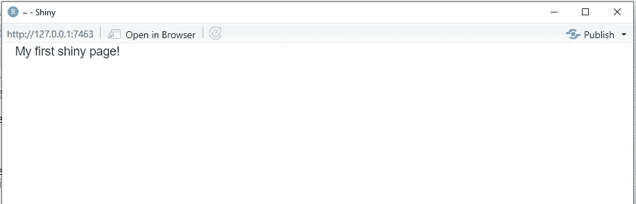

我们的第一款闪亮应用——作者图片

我们的应用程序将在本地主机 [http://127.0.0.1:7388/](http://127.0.0.1:7388/) 上的我们的计算机中提供。您应该在 R 控制台上的`shinyApp`命令下面看到您的本地主机地址:


闪亮的应用程序地址——作者图片

当你运行应用程序时，你也可以在浏览器上输入地址，这也将带你到你的应用程序。

当然，目前我们的应用程序是无用的——我们没有任何输入或输出，如果能够与我们的应用程序进行交互，那将非常有用！接下来，让我们使用`mtcars`数据框架，构建一个带有 2D 散点图的简单应用程序！

# 构建交互式绘图应用程序

当然，我们不仅仅局限于编写一个基本的文本应用程序。例如，假设我们想在我们的应用程序上显示一个与此类似的图:

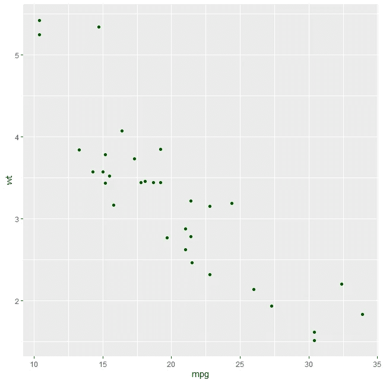

重量与 mpg mtcars 曲线图—图片由作者提供

我正在使用玩具数据集`mtcars`绘制汽车*重量*与*油耗(每加仑英里数)*的散点图:

```
library(ggplot2)

ggplot(
  data = mtcars,
  aes(x=mpg, y=wt)
) + geom_point(color='darkgreen')
```

我们可以做的一件很酷的事情是在`shiny`应用程序中提供散点图。此外，为了让我们的应用程序更有趣，我们希望有动态的`x`和`y`列，使用用户的输入。

虽然看起来很难做到这一点，但我们可以简单地通过改变我们的后端和前端层的一些部分来做到这一点。让我们从让用户从`mtcars`中可用的列列表中选择两列开始:

```
sp <- fluidPage(

  selectInput(
    inputId = 'var1',
    label = 'Column X Axis',
    choices = colnames(mtcars)
  ),

  selectInput(
    inputId = 'var2',
    label = 'Column Y Axis',
    choices = colnames(mtcars)
  )

)
```

`selectInput`函数创建一个下拉框，其中包含`mtcars`中所有可用的列。`selectInput`是`shiny`中众多可用的[输入法](https://debruine.github.io/shinyintro/inputs.html)之一，我们可以将`colnames(mtcars)`传递给 choices 参数，它将负责用所有元素填充我们的下拉列表。

`inputId`在大多数`shiny`应用中极其重要——它是我们在前端和后端之间发送信息的方式。在这种情况下，每当我们指向后端的一个`var1`或`var2`时，R 将获取我们在下拉框中指定的值。在某些场景中，我们来自前端的变量必须包含在`reactive`上下文中，我们将在我们将要构建的第三个应用程序中看到这一点。

如果我们把这个新的`sp`赋予我们的应用，我们的前端就有了新的东西:

```
shinyApp(sp, server)
```

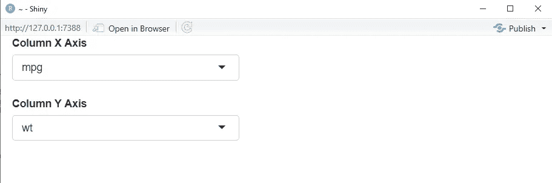

绘图应用程序-作者提供的图片

有意思！我们的前端现在有两个下拉框，我们可以在其中选择`X`和`Y`轴的列。但是..我们怎样才能把这些元素赋予我们的情节呢？这就是后端层的用武之地:

```
server <- function(input, output) {
  output$scatter <- renderPlot({
      ggplot(
      data = mtcars,
      aes_string(x=input$var1, y=input$var2)
    ) + geom_point(color='darkgreen')
  })
}
```

注意，我们可以使用标准的输入和输出参数。当我们在`shinyApp`的上下文中使用`server`函数时，输入和输出将在应用程序内部被解析。例如，`input$var1`将从页面中的第一个`selectInput`中选取数据，因为第一个`selectInput`的 id 是`var1`。

当我们现在运行我们的`shinyApp`时，我们的应用看起来会有点不同:

```
shinyApp(sp, server)
```

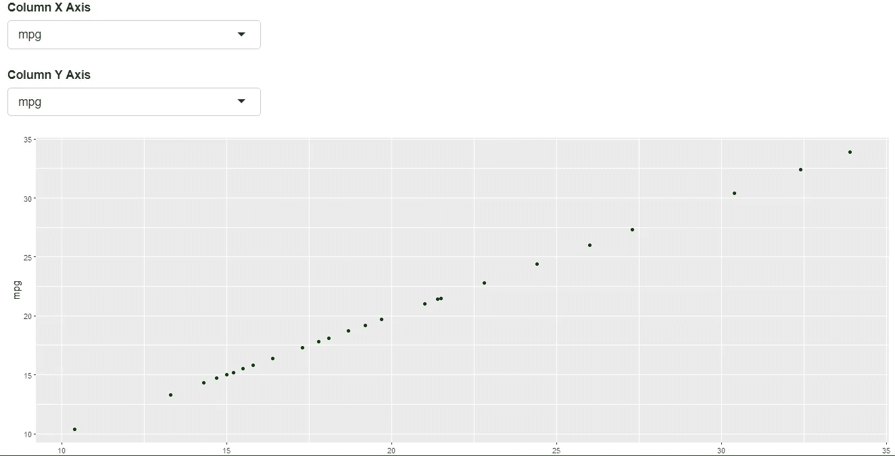

带有散点图的绘图应用程序-图片由作者提供

我们有我们的闪亮的应用程序可用的情节！在当前的视图中，散点图并没有说太多，因为我们正在绘制`mpg`对`mgp`，同一个变量。有趣的是，如果我们改变下拉列表中的列，我们的绘图将自动更新:

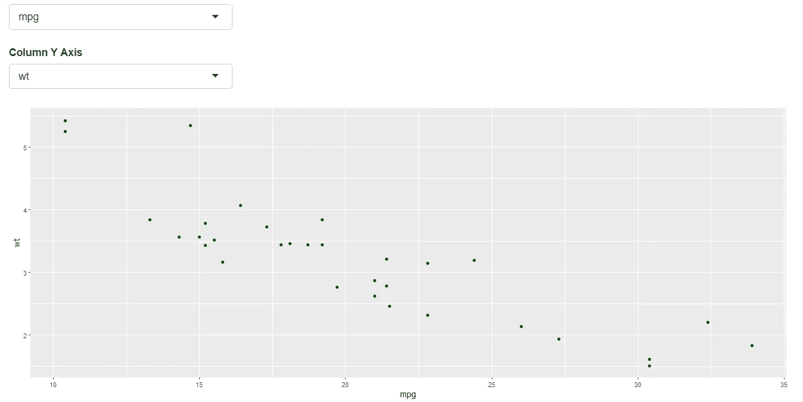

绘图应用程序，散点图 mpg 与 wt-作者提供的图片

酷！所以，基本上，每次我们切换 id 为`var1`的`selectInput`时，存储的列都存储在变量中，并提供给服务器上的`input$var1`。同样的道理也适用于`input$var2`和`var2`。从逻辑上讲，id 是我们用来连接后端和前端层的参考。

我们还可以在前端方面进一步调整我们的应用程序。例如，我们可以将我们的布局拆分成一个并排的应用程序，使用`sidebarLayout`并将每个部分包装在`sidebarPanel`和`mainPanel`中:

```
sp <- fluidPage(

  sidebarLayout(

    sidebarPanel(
      selectInput(
        inputId = 'var1',
        label = 'Column X Axis',
        choices = colnames(mtcars)
      ),

      selectInput(
        inputId= 'var2',
        label = 'Column Y Axis',
        choices = colnames(mtcars)
      )
    ),

    mainPanel(
      plotOutput("scatter")
    )
  )
)
```

我们的应用程序现在将具有以下外观:

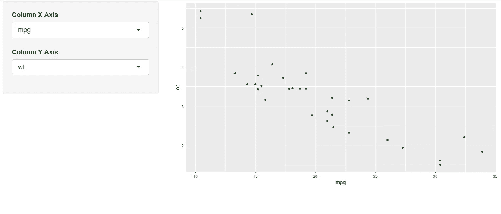

带有侧边栏布局的绘图应用程序-图片由作者提供

我们的新布局是一个两列格式的图，我们可以操纵。我们选择了一个`sideBar`布局，但是，还有更多的布局可供我们选择，这里有。

# 基于模型构建应用程序

我们已经使用绘图应用程序构建了第一个有用的`shiny`应用程序！我们研究的主要层次是:

*   我们可以使用自定义的`server`函数创建一个后端。
*   我们可以使用`fluidPage`设计前端

对于我们在`shiny`中开发的大多数单页面应用程序来说，这种机制是重复的。如果你对多页面应用很好奇，也可以查一下 [shiny.router](https://github.com/Appsilon/shiny.router) 。

对于我们的最后一个例子，让我们使用三列布局的`shiny`提供一个基本的决策树模型。

首先，我们将在我们的`mtcars`数据之上训练一个决策树，尝试基于`wt`、`cyl`和`hp`来预测`mpg`:

```
library(rpart)

dtree <- rpart(data=mtcars, mpg ~ wt + cyl + hp,
               control = list(minsplit=1))
```

当然，这是一个可笑的决策树和模型训练过程，它甚至不包含一个适当的训练-测试分割。这里的目标只是在`shiny`的上下文中使用一个基本模型，所以现在让我们忽略这些细节。

让我们将这个`dtree`对象保存到一个`rds`文件中:

```
saveRDS(object=dtree, file='decisiontree.rds')
```

假设我们想要构建以下应用程序:

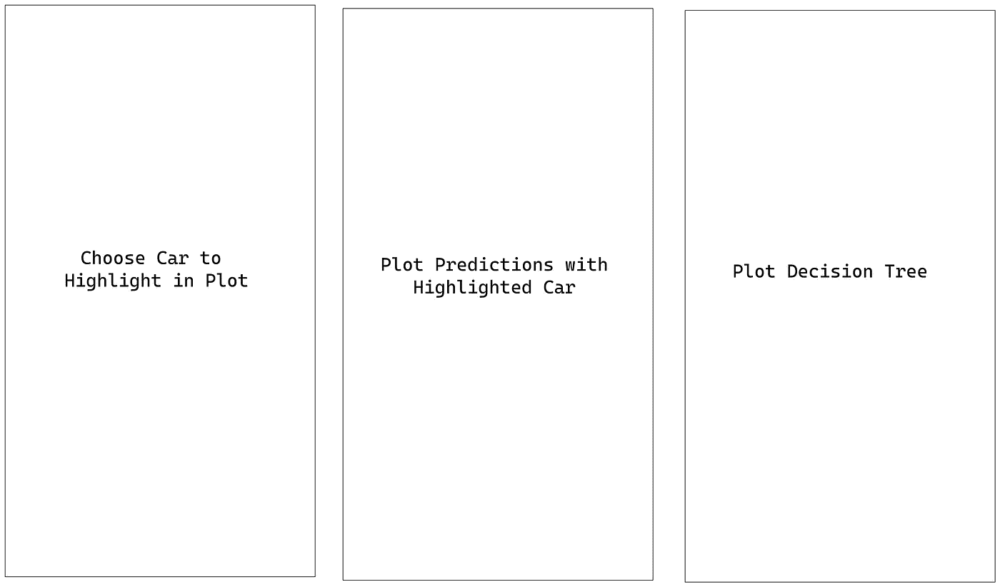

计划中的应用程序—作者图片

这里，我们需要三列，这是一个混合了`fluidRow`和`column`的优秀用例。让我们从构建一个三列布局开始，从我们的前端开始:

```
 sp <- fluidPage(

  fluidRow(

    column(4, 'Column 1!'),

    column(4, 'Column 2!'),

    column(4, 'Column 3!')       
  )
)

server <- function(input, output) {
}
shinyApp(sp, server)
```

我们的`shinyApp`将具有以下外观:


三栏应用程序—作者图片

请注意，我们的`Column 1!`、`Column 2!`和`Column 3!`在应用程序的前端等距分布。关于`fluidRow`和`column`很酷的一点是，它们以一种“boostrapy”的方式运行，这意味着，如果我们不使用全屏，我们的列将被堆叠，而不是将数据压缩成不可读的东西。

从第一列开始，我们希望有一个所有可用汽车的列表，以便我们可以选择我们将在中间一列突出显示的汽车—这样做很容易，因为我们已经了解了`selectInput`:

```
 sp <- fluidPage(

  fluidRow(

    column(4, 
        selectInput(
          inputId = 'selectedcar',
          label = 'Car List',
          choices = rownames(mtcars)
        )
    ),

    column(4, 'Column 2!'),

    column(4, 'Column 3!')       
  )
)

server <- function(input, output) {
}
shinyApp(sp, server)
```

在左栏中，我们现在可以选择特定的汽车:

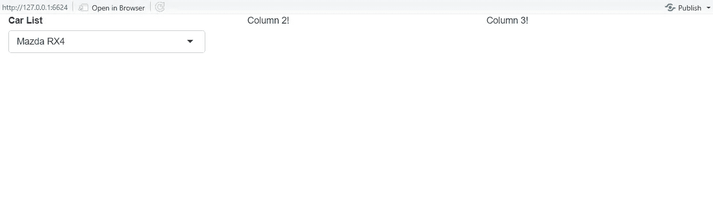

三栏应用程序—作者图片

在第二列中，我们希望用突出显示的选定汽车来绘制我们的预测图。为此，我们需要做几件事情，即与后端交互:

*   加载我们的模型并预测所有汽车的重量。
*   建立一个 MPG 与 HP 的二维图表(如果您愿意，您也可以添加另一个选择第二个变量的下拉列表)
*   高亮显示所选汽车的散点。

下面是我们如何构建符合这些要求的后端的示例:

```
server <- function(input, output) {
  model <- readRDS('decisiontree.rds')
  predictions <- data.frame(cbind(
    mtcars$hp,
    predict(object = model, mtcars)
  ))

  colnames(predictions) <- c('hp','pred_mpg')

  sc <- reactive({
    selected_car <- input$selectedcar
  })

  output$scatter <- renderPlot({

    select_car <- sc()

    (
      plot_all_cars <- ggplot(
        data = predictions,
        aes(x=hp, y=pred_mpg)
      ) 
      + geom_point(colour="darkgreen") 
      + geom_point(data=predictions[select_car, ], aes(x=hp, y=pred_mpg), colour="red", size=5)
    )
  }) 
```

让我们一步一步地详述我们的后端代码:

*   首先，我们使用`model<-readRDS('decisiontree.rds')`
    加载我们的模型，并使用`predict`函数从我们的模型中获得预测。
*   然后，我们定义我们的`predictions object.`的`colnames`
*   之后，我们设置了一个`reactive`对象。`reactive`对象是会影响任何其他对象的对象(需要计算)。例如，在这种情况下，`select_car`将影响应用于`geom_point`图中的`dataframe`的过滤器。由于这需要在后台进行一些计算，我们需要在这个对象上设置一个反应上下文，定义它用函数`sc()`调用。
*   最后，我们用两个`geom_point`来定义`plot_all_cars`:一个用于所有汽车，另一个(将作为亮点)用于我们选择的汽车。注意`select_car`将包含从`sc`返回的反应对象，我们将使用左边的下拉菜单加载该对象。

现在让我们来看看我们的应用程序的外观:

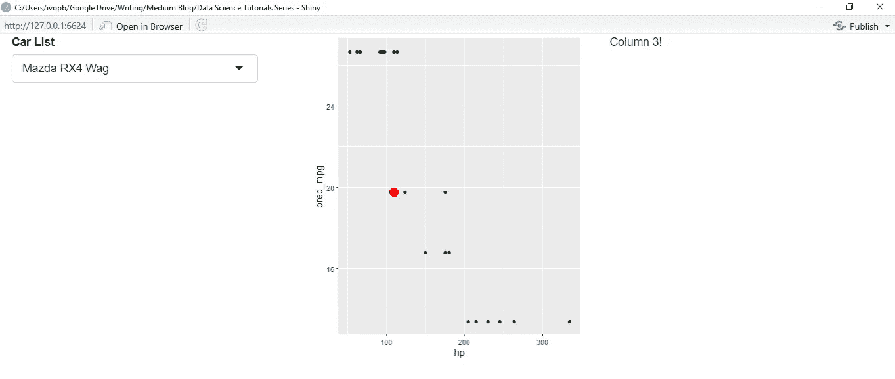

三栏应用程序(突出显示马自达 RX4 Wag)-作者图片

如果我们突出显示另一辆车，我们的图的突出显示会发生变化:

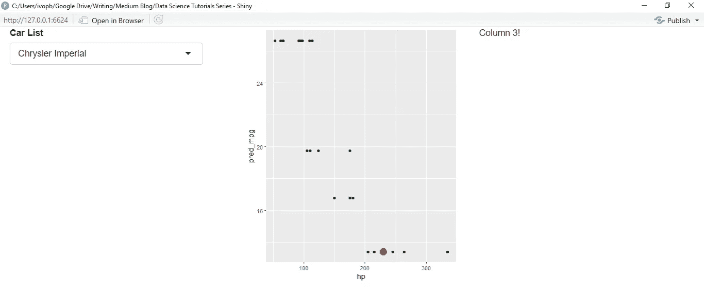

三栏应用程序(突出显示克莱斯勒帝国)-作者图片

在前端，我们只需改变我们的第二列，为它添加一个`plotOutput`模块:

```
sp <- fluidPage(

  fluidRow(

    column(4, 
        selectInput(
          inputId = 'selectedcar',
          label = 'Car List',
          choices = rownames(mtcars)
        )
    ),

    column(4, 
           plotOutput('scatter')
           ),

    column(4, 'Column 3!')       
  )
)
```

只剩下一件事了！在右栏中绘制我们的决策树——让我们在后端也这样做，但是，首先，我们需要加载`rattle`库:

```
library(rattle)
```

然后，对我们的后端和前端层进行一些更改:

```
server <- function(input, output) {
  model <- readRDS('decisiontree.rds')
  predictions <- data.frame(cbind(
    mtcars$hp,
    predict(object = model, mtcars)
  ))

  colnames(predictions) <- c('hp','pred_mpg')

  sc <- reactive({
    selected_car <- input$selectedcar
  })

  output$scatter <- renderPlot({

    select_car <- sc()

    (
      plot_all_cars <- ggplot(
        data = predictions,
        aes(x=hp, y=pred_mpg)
      ) 
      + geom_point(colour="darkgreen") 
      + geom_point(data=predictions[select_car, ], aes(x=hp, y=pred_mpg), colour="red", size=5)
    )
  })

  output$dtree_plot <- renderPlot({
    fancyRpartPlot(model, sub='')
  })

}

sp <- fluidPage(

  fluidRow(

    column(4, 
        selectInput(
          inputId = 'selectedcar',
          label = 'Car List',
          choices = rownames(mtcars)
        )
    ),

    column(4, 
           plotOutput('scatter')
           ),

    column(4, 
           plotOutput('dtree_plot')
          )       
  )
)
```

超级简单！对于上面的后端代码，我们添加了:

```
output$dtree_plot <- renderPlot({
    fancyRpartPlot(model, sub='')
  })
```

在我们的前端引用它之后，我们最终的应用程序如下所示:

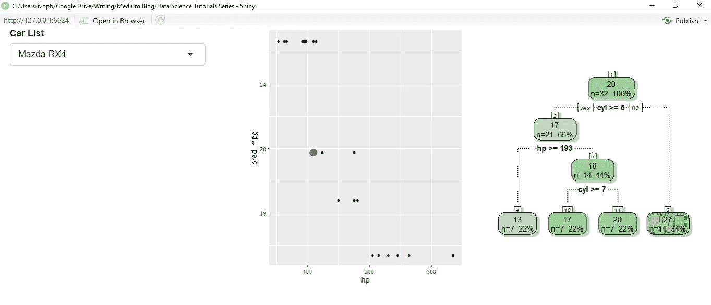

三栏应用程序—作者图片

如您所见，用 R 构建`shiny`应用程序非常简单。在这篇文章中，我们检查了一些重要的组件，例如:

*   使用`fluidPage`构建我们应用程序的前端。
*   使用自定义函数`server`构建我们应用程序的后端。
*   使用`ids`和`reactive`元件连接我们的前端和后端。
*   使用不同的 UI 元素，如`fluidRow`或`sidebarPanel`。

我希望这篇文章给了你一些可以为你的项目开发的很酷的应用的想法。作为结论:`shiny`包含一堆可调整的元素，很难记住所有的元素。你可以保存的一个更重要的页面是[闪亮文章](https://shiny.rstudio.com/articles/#first-app)，这是图书馆的官方文档，它将指导你了解我们在这篇文章中没有涉及的其他内容。

感谢你花时间阅读这篇文章！

以下是我们构建的应用程序的完整代码:

```
library(shiny)

# First App

sp <- fluidPage(
  "My first shiny page!"
)
server <- function(input, output) {
}
shinyApp(sp, server)

# Second App
sp <- fluidPage(

  sidebarLayout(

    sidebarPanel(
      selectInput(
        inputId = 'var1',
        label = 'Column X Axis',
        choices = colnames(mtcars)
      ),

      selectInput(
        inputId= 'var2',
        label = 'Column Y Axis',
        choices = colnames(mtcars)
      )
    ),

    mainPanel(
      plotOutput("scatter")
    )
  )
)

server <- function(input, output) {
  output$scatter <- renderPlot({
      ggplot(
      data = mtcars,
      aes_string(x=input$var1, y=input$var2)
    ) + geom_point(color='darkgreen')
  })
}
shinyApp(sp, server)

# Training model
library(rpart)

dtree <- rpart(data=mtcars, mpg ~ wt + cyl + hp,
               control = list(minsplit=1))

# Save dtree file
saveRDS(object=dtree, file='decisiontree.rds')

# Third App
sp <- fluidPage(

  fluidRow(

    column(4, 
        selectInput(
          inputId = 'selectedcar',
          label = 'Car List',
          choices = rownames(mtcars)
        )
    ),

    column(4, 
           plotOutput('scatter')
           ),

    column(4, 
           plotOutput('dtree_plot')
          )       
  )
)

server <- function(input, output) {
  model <- readRDS('decisiontree.rds')
  predictions <- data.frame(cbind(
    mtcars$hp,
    predict(object = model, mtcars)
  ))

  colnames(predictions) <- c('hp','pred_mpg')

  sc <- reactive({
    selected_car <- input$selectedcar
  })

  output$scatter <- renderPlot({

    select_car <- sc()

    (
      plot_all_cars <- ggplot(
        data = predictions,
        aes(x=hp, y=pred_mpg)
      ) 
      + geom_point(colour="darkgreen") 
      + geom_point(data=predictions[select_car, ], aes(x=hp, y=pred_mpg), colour="red", size=5)
    )
  })

  output$dtree_plot <- renderPlot({
    fancyRpartPlot(model, sub='')
  })

}

shinyApp(sp, server)
```

*如果你想参加我的 R 课程，请随时加入这里(* [*R 编程绝对初学者*](https://www.udemy.com/course/r-for-absolute-beginners/?couponCode=MEDIUMREADERSSEP) *)或这里(* [*数据科学训练营*](https://www.udemy.com/course/r-for-data-science-first-step-data-scientist/?couponCode=MEDIUMOCTOBER) *)。我的 R 课程适合初学者/中级开发人员，我希望有你在身边！*