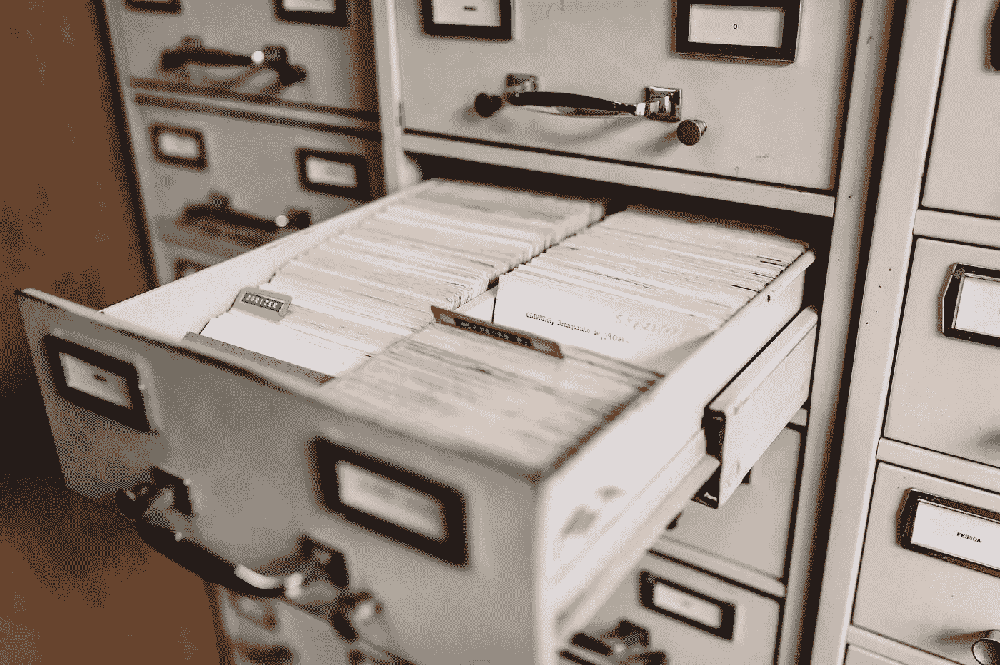

# 构建您自己的数据集:优势、方法和工具

> 原文：<https://towardsdatascience.com/building-your-own-dataset-benefits-approach-and-tools-6ab096e37f2>

# 构建您自己的数据集:优势、方法和工具

## *构建自己的数据集而不是使用预建解决方案的重要性*

Maksym Kaharlytskyi 在 [Unsplash](https://unsplash.com/s/visual/29225aad-fffc-4695-8b1f-f94841b294f2?utm_source=unsplash&utm_medium=referral&utm_content=creditCopyText) 上的照片

如果我们在谷歌上搜索*如何成为数据科学家*，我们会发现大量资源敦促我们学习线性代数和微积分的基础知识。

给我们的动力是，这些将是我们理解后面要研究的机器和深度学习算法的基础。它们是准备材料，在我看来，资源表明这是正确的。这是没有办法的。

然而，我发现，尽管作为一名数据科学家，这对成长和理解此事是必要的，但这还不够。**有很多技术高超的分析师在努力找工作，并在专业环境中证明自己的价值。**

我在 2022 年 1 月写了这篇文章，但我很确定这种说法对未来也适用。去看看 Kaggle(例如这里的)、Reddit(在 [/r/machinelearning](https://www.reddit.com/r/MachineLearning/) 或 [learnmachinelearning](https://www.reddit.com/r/learnmachinelearning/) )或 Discord 频道上关于这个话题的任何讨论。

这些人非常非常熟练。然而，他们在面对现实中挣扎。这一现实需要超越数据科学或计算机工程的知识。我不想傲慢地说我知道真相，这些人应该跟着我。事实并非如此。

我自己也面临着这种困境，在这份工作中经历了 6 年之后，我今天仍然经常面临这种困境。这并不容易，但我逐渐开发了启发法和方法，证明对提高我在工作区内外的*价值*很有用。

我觉得我今天可以分享的建议是许多在线数据科学课程中不常听到的，即**从头创建数据集来解决我们感兴趣的问题。**

让我们开始吧。

# 从头构建自己的数据集有什么好处？

有几个原因促使我推荐这种方法。这些问题从实用主义到更个人化的都有。以下是一个概述:

1.  我们对该项目自始至终承担全部责任
2.  我们完全拥有我们所使用的材料
3.  我们对问题和我们的数据产生了非常深刻的理解(*具体知识*)
4.  我们的问题无法通过已知的开放数据集来解决

在我看来，责任、所有权、知识和影响力是个人和职业发展的核心。让我们一个一个地探索它们，以理解从头开始创建数据集的业务。

## 有责任

从零开始创建数据集迫使我们处于完全负责的境地——数据中的任何错误或偏差都是我们自己造成的。因此，能够正确检索数据是非常重要的，要考虑测量系统的有效性和一致性(例如，如果我们使用物理传感器)，或者如果数据是在线找到的(例如，带有文本)，要编写干净且结构良好的代码。

## 所有权

当我们参与进来，花时间去做刮擦、创建调查或进行采访等肮脏的工作时，我们用这些工具培养了纪律性、耐心和技能。

如果使用的数据集是公开的，这就不会发生，因为其他研究人员过去已经为我们做了这项工作。拥有我们数据的所有权也使我们能够有目的、有目的地领导任何可用于研究的团队。

## 特定知识

这条道路将充满挑战，我们将独自或一起面对。在任何情况下，我们都可以肯定，我们会带着对问题的更具体和更一般的认识越过红线。如果我们多次探索这条道路，我们也可以成为这方面的专家(所谓的利基)。

## 杠杆作用

拥有杠杆意味着我们能够做或提供不是每个人都能做的事情。*拥有杠杆赋予我们价值*。如果我们有很大的优势，我们可以提供服务于他人的解决方案，并且他们能够支付得起。

当我们为一个公共数据集不能充分覆盖的问题从头构建数据集时，我们正在创建一个有价值的资产。这个价值或多或少取决于项目和最终产品的目标。

基本上，和几乎所有的发展项目一样，你从中获得的东西对个人和职业发展几乎总是很重要的。企业家的态度出现了——**如果项目在所有提到的层面上都是我们的，那么我们必须能够做出牺牲，让它有机会看到光明**。在数据科学中，这种牺牲通常始于训练数据集的创建。

# 方法

假设我们想在电脑前模拟我们的健康状况。假设是，一天中的某些时候，我们的身体会变得更加疲劳，这种疲劳可能是由于日常工作或生理波动造成的。

对于任何想研究这一现象的人来说，正确的方法是放下一个小的实验设计。事实上，*建模阶段在所有方面都跟随着实验阶段*。

你不会对你一无所知的事物建模，而足够准确地了解事物的唯一方法是运用科学方法。

我提到的例子很有趣——让我们看看如何将科学方法应用于这样一个项目。以下是步骤

1.  **假设定义** 研究几乎总是基于一个或多个实验假设。有时它可能只是探索性的，但大多数都有支持它们的研究人员所做的陈述。在我们的情况下，我们刚才已经提到了:*一天中有一些时刻我们更累，这些时刻是由于工作压力或生理波动的原因。* 我们的目标将是通过找到支持相反观点的证据来证伪这一主张([波普尔的可证伪性原理](https://en.wikipedia.org/wiki/Falsifiability))。如果这个证据很重要(从统计学上来说)，那么我们就能够拒绝零假设(描述实验前世界的假设)并接受另一个假设(我们已经通过实验收集了足够证据的假设)。
2.  **准备**
    准备阶段允许我们组织活动流程，并找到我们需要的各种工具。在我们的情况下，我们应该在工作日收集数据。我们将购买传感器应用于身体，以跟踪心率、血压和血饱和度。此外，我们可以使用软件来跟踪我们在电脑上的活动。我们还必须考虑一天中的时间:最初的直觉是，每个活动的索引将是一个时间戳，指示精确的时间。
3.  **数据收集和实验** 在这个阶段我们试图观察或造成证伪我们假设的效果。在我们的例子中，由佩戴的传感器和使用的软件表示的指示器将告诉我们实际发生了什么。也许只有当我们在工作中与一群特定的人交谈时，或者当我们做了一件我们不太喜欢的事情时，我们才会观察到精力水平的下降。发生的每一个事件都将通过在前面一点中设置的技术设备进行测量和存储。
4.  **结果分析**
    这是过程的最后一个阶段(除非你发表了一篇关于它的论文，在这种情况下该方法结束于陈述阶段)。这里我们将应用大量的数据分析技术来验证和阐明研究结果。

只有在分析了我们的研究结果之后，我们才能说我们理解了我们一开始所面临的问题。**我补充说，这是我们在对观察到的现象建模时唯一合乎道德的时刻**。

我在伦理上使用*这个词*是因为，虽然建模可以不遵循所描述的方法，但只有通过这条途径，研究的作者才能从一开始就得到他想要的东西:*对现象的更好理解*。

任何其他尝试都是由超出更深层次理解的目标传达的，例如，给某人留下好印象(所谓的地位游戏)或解决其他人的问题，这些人反过来不需要更深层次地理解问题。

我想具体说明，不想追求一个纯知识导向的目标并没有错。我们都在玩地位游戏，我们都喜欢做好工作并为此获得报酬。这不是重点。

关键是，如果我要建议我自己的儿子如何在这样一个领域进行个人项目，我会对他说这些话。不做并没有错…但是我认为如果你做了，你会成为一个更好的人，无论是在职业上还是个人方面。

# 分析师从头开始创建数据集的有用工具

这里列出了我在职业生涯中为项目收集数据的方法。发展应用这些技术的技能对于任何希望有机会独立完成项目的分析师都是有用的。

## 网页抓取

绝对是最著名的数据检索数字技术之一。如果你足够熟练，现在没有什么是刮不到的。它包括从网站或其他在线资源收集数据。

这些数据必须在 web 浏览器中可见，并且必须设计为可供其他用户查看。

不过还是有规则的:**不要抓取明确要求你不要抓取的网站**——这是不道德的——**也不要孜孜不倦地抓取**(也就是说，不要淹没服务器)。当抓取时，我们向服务器发送请求以接收数据并保存它。如果我们做得太快，而且没有控制，我们可能会损坏服务器。

最大的障碍是社交媒体，但仍然有有效的方法可以在网上找到。

我们可以在 Python 中使用的工具有

*   对于小项目-> beautiful soup+Requests 的组合([这里的](https://gist.github.com/bradmontgomery/1872970)是一个很好的开始模板)
*   对于大型项目-> [刺儿头](https://scrapy.org/)
*   对于任何 JavaScript 渲染需求-> [剧作家](https://playwright.dev/python/docs/intro)

## 调查

我们经常忘记调查是非常强大的数据收集技术。有一些像 Pollfish 这样的网站允许你提交大规模的调查，并通过非常精确的分析采访网络上成千上万的用户。

## 物理传感器

由于物联网领域和 Apple Watch 等可穿戴设备的发展，物理传感器的使用在过去十年中有了很大增长。今天，我们可以很容易地为我们的数据收集设置物理仪器，包括人和物。

## 剧本

如果我们拥有一个网站，并且精通 Javascript 或 Php，我们可以编写跟踪脚本，在用户同意的情况下，可以收集其使用行为的数据。有点像 Google Analytics 和 HotJar。我想补充一点，收集此类信息可能会受到 GDPR 法规的管辖，因此我们必须谨慎并负责任地使用数据。

# 结论

最后，我必须提到，购买数据也是可能的，根据质量不同，价格也不同。

通常，这些数据很难由单个个人找到(例如来自太空深处或海洋深处的数据)，并且由于它们所描述的现象，很难精确地汇总在一起。

数据科学家经常购买数据集，以便将大量数据加入到他们已经拥有的数据存储库中。

如果您想支持我的内容创作活动，**请随时关注我下面的推荐链接，并加入 Medium 的会员计划**。我将收到你投资的一部分，你将能够以无缝的方式访问 Medium 的大量数据科学文章。

 [## 通过我的推荐链接加入 Medium-Andrew D # data science

### 阅读 Andrew D #datascience(以及媒体上成千上万的其他作者)的每一个故事。您的会员费直接…

medium.com](https://medium.com/@theDrewDag/membership) 

我希望我对你的教育有所贡献。下次见！👋