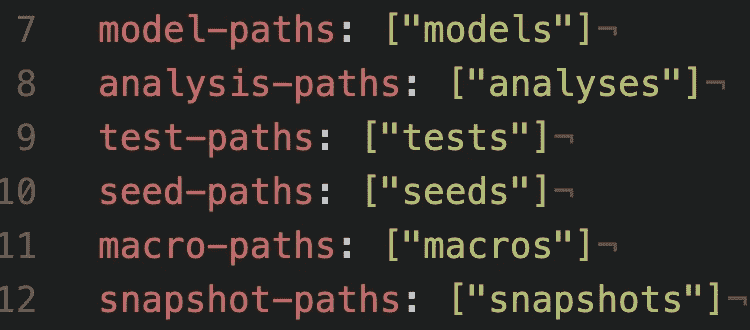

# DBT 的商业逻辑

> 原文：<https://towardsdatascience.com/business-logic-in-dbt-cf72a31bbcfd>

## 实现定制逻辑有很多种可能性，这个框架可以帮助您对选项进行排序。



DBT 的默认配置。图片作者。

我真的很喜欢使用 [DBT](https://www.getdbt.com) 来构建数据管道，它执行的框架要求你以标准化的方式构建管道。该工具完美地结合了数据工程和数据科学，为前者提供了一种动态编码的方式，并约束了后者。作为一名数据科学家，我花了数年时间，在数据管道内外，通过运行 python 进程动态生成复杂的 SQL 代码。模板是这种自由流动的数据科学工作的第二天性，DBT 为数据工程师展示了这种工具以及适用于大多数管道的结构。

数据工程的核心是业务逻辑:转换本身包含打开数据的关键信息。对于我们这里的例子，让我们将美国的一个`state`列重新编码为一个`region`:四个[人口普查被指定为东北、南部、中西部和西部的区域之一](https://en.wikipedia.org/wiki/List_of_regions_of_the_United_States#Census_Bureau-designated_regions_and_divisions)。为了帮助我们在构建这一渠道的各种选项之间做出决定，让我们列出我们关心的问题:

1.  人类可读性:我们应该能够理解逻辑，并看到值来自哪里。
2.  灵活性:我们希望为这种映射中的变化做好准备，例如，一个新的州加入美国或一个现有的州切换区域。
3.  机器可读性和 DRY:这个逻辑应该可以被程序解释，这样我们就不需要重复硬编码的值。

## 选项 1:将您的业务逻辑硬编码在 SQL 中

从各方面来看，这都不太理想，但这可能是一个起点。它可能看起来像这样:

```
SELECT state, 
       CASE WHEN state IN ('CT', 'ME', ...) THEN 'Northeast'
            WHEN state IN ('IL', 'IN', ...) THEN 'Midwest'
            ...
       ELSE NULL END AS region
  FROM {{ ref('my_table') }}
```

您可以只编码三个区域，让`ELSE`语句捕捉第四个区域。我们将编码所有四个:显式击败隐式。

使用这种硬编码的逻辑，每次更改都需要更改代码。

如果您的逻辑还没有被硬编码到 SQL 中，请选择选项 2 或 3。让我们不要对这种方法进行过多的讨论，向前推进到在每一点上都更好的解决方案。

## 选项 2:将逻辑放在一个表中，并使用一个连接来执行它

这里有一个我可以支持的想法。您的代码就是您的代码:它从 state 列创建 region 列。如果确切的映射发生变化，数据需要更新，但不是您的代码！这些数据可以用许多不同的方式来管理，甚至可以由业务涉众或下游用户来管理。具体来说，这应该是这样的:

```
SELECT state, 
       lookup.region
  FROM {{ ref('my_table') }}
  JOIN {{ source('fact_schema', 'lookup_table') }} lookup
       USING(state)
```

这与我们的目标非常吻合，现在我们需要一种存储逻辑本身的方法。我认为有三种选择:

## 选项 2(a):使用 DBT seed csv

dbt 中的种子是 dbt 加载到数据库中的 csv 文件，供下游使用。这使得 csv 文件处于版本控制中，对于这个用例来说，这是一个很酷的特性。这确实是 dbt 中 seed 功能的预期用途，我同意他们在文档中的建议[:](https://docs.getdbt.com/docs/building-a-dbt-project/seeds)

> 种子是您的 dbt 项目中的 CSV 文件(通常在您的`seeds`目录中)，dbt 可以使用`dbt seed`命令将其加载到您的数据仓库中。
> 
> 种子可以像引用模型一样在下游模型中被引用——通过使用`ref` [函数](https://docs.getdbt.com/reference/dbt-jinja-functions/ref)。
> 
> 因为这些 CSV 文件位于您的 dbt 存储库中，所以它们是受版本控制的，并且代码是可审查的。种子最适合不经常改变的静态数据。
> 
> 种子的良好用例:
> -国家代码到国家名称的映射列表
> -从分析中排除的测试电子邮件列表
> -员工帐户 id 列表

## 选项 2(b):将它作为一系列插入存储在 SQL 文件中

这个选项很臭，我就不多说了。明确地说，我的意思是编写一个`.sql`文件，将数据直接插入到表中。您可以在 dbt 中这样做，这里有一个简单的版本来说明这个想法，如`lookup_table.sql`:

```
WITH data as (
SELECT 'CT' as state, 'Northeast' as region
UNION
SELECT 'ME' as state, 'Northeast' as region
UNION
SELECT 'IL' as state, 'Midwest' as region
UNION
SELECT 'IN' as state, 'Midwest' as region
)
SELECT state, region
FROM data
```

## 选项 2(c):存储在 python/R 中，并直接推送到数据库

这里的主要问题是，您将项目分成了两个部分:预 dbt 步骤和 dbt 步骤。虽然有些情况下这是有意义的，但是我们可以在 dbt 中轻松完成这一步，所以我们不要追求这个选项。

## 选项 3:在动态查询中使用 DBT 变量

在`dbt_project.yml`中，您可以定义[变量](https://docs.getdbt.com/reference/dbt-jinja-functions/var)，然后[在查询](https://docs.getdbt.com/docs/building-a-dbt-project/jinja-macros)中使用这些变量。我们可以将数据作为变量存储在 yaml 中，如下所示:

```
vars:
  state_lookup:
    Northeast:
      - CT
      - ME
    Midwest:
      - IL
      - IN
```

然后我们将动态生成 SQL，如下所示

```
SELECT state,
       CASE 
            WHEN state in ('{{ t }}', ) THEN {{ k }}
            ELSE NULL END AS region
  FROM {{ ref('my_table') }}
```

这里的中间部分只是构建一个逗号分隔的列表，为它编写一个函数会使它看起来更好。让我们用一个`csl`过滤器(逗号分隔列表)快速查看一下:

```
SELECT state,
       CASE 
            WHEN state in ({{ v|csl }}) THEN {{ k }}
            ELSE NULL END AS region
  FROM {{ ref('my_table') }}
```

这是人和机器都可读的(耶为 yaml！)，而且它很灵活，是目前为止我最喜欢的选择。愿你的数据管道畅通，你的传呼机警报少！