# 购买一个域，连接到您的应用程序，并使用 SSL 保护 AWS 中的教程

> 原文：<https://towardsdatascience.com/buy-a-domain-connect-to-your-app-and-secure-with-ssl-tutorial-within-aws-c7479aa24d64>

## 大多数文章开发了原型，但是没有将 MVP 与领域联系起来。我将在本文中展示如何使用 AWS 实现这一点。

艾通过作者创造艺术。 [上见*下见【NFT】*](https://opensea.io/accounts/createdd?ref=0xc36b01231a8f857b8751431c8011b09130ef92ec)*；灵感来自阿曼达·冯月* [*Unsplash*](https://unsplash.com/photos/1w2xsyc2wwI)

# 目录

*   [关于本文](https://github.com/Createdd/Writing/blob/master/2021/articles/awsAppAndDomain.md#about-this-article)
*   [我应该使用哪种 AWS 基础设施类型](https://github.com/Createdd/Writing/blob/master/2021/articles/awsAppAndDomain.md#what-aws-infrastructure-type-should-i-use)
*   [购买域名](https://github.com/Createdd/Writing/blob/master/2021/articles/awsAppAndDomain.md#buy-domain)
*   [用你的 AWS 公共 IP 地址连接域名](https://github.com/Createdd/Writing/blob/master/2021/articles/awsAppAndDomain.md#connect-domain-with-your-aws-public-ip-address)
*   [启用 HTTPS](https://github.com/Createdd/Writing/blob/master/2021/articles/awsAppAndDomain.md#enable-https)
*   [添加负载平衡器](https://github.com/Createdd/Writing/blob/master/2021/articles/awsAppAndDomain.md#add-load-balancer)
*   [更新路线 53](https://github.com/Createdd/Writing/blob/master/2021/articles/awsAppAndDomain.md#update-route53)
*   [创建集群服务](https://github.com/Createdd/Writing/blob/master/2021/articles/awsAppAndDomain.md#create-service-of-cluster)
*   [查看 https 负载平衡器的结果](https://github.com/Createdd/Writing/blob/master/2021/articles/awsAppAndDomain.md#see-your-result-with-https-loadbalancer)
*   [有益的文章](https://github.com/Createdd/Writing/blob/master/2021/articles/awsAppAndDomain.md#helpful-articles)
*   [免责声明](https://github.com/Createdd/Writing/blob/master/2021/articles/awsAppAndDomain.md#disclaimer)
*   [关于](https://github.com/Createdd/Writing/blob/master/2021/articles/awsAppAndDomain.md#about)

# 关于这篇文章

在本文中，我将介绍在 AWS 中启动一个示例 web 应用程序的步骤。在我的上一篇文章中，我谈到了用 python 创建自己的 web 应用程序，以及如何用 AWS Lambda 部署它，或者用 AWS Fargate 来完成:

*   [开发并销售一款机器学习 app](/develop-and-sell-a-machine-learning-app-from-start-to-end-tutorial-ed5b5a2b6b2b)
*   [开发并销售一款 python 应用](/develop-and-sell-a-python-api-from-start-to-end-tutorial-9a038e433966)
*   [使用 AWS Fargate 部署您的 Python 应用](/deploy-your-python-app-with-aws-fargate-tutorial-7a48535da586)

我使用 AWS 是因为我已经在我的上一个项目中使用了它，并发现它有很好的文档记录，操作起来很直观，即使有如此多的选项可供选择。设置一切非常简单，你会发现很棒的官方和非官方文档。然而，我意识到大多数文章都是关于应用程序的发布，而不是如何把它和自己的域名联系起来。这对于测试来说很好，但是如果你想发布一个原型，你当然需要你自己的领域。尤其是域名本身通常非常便宜。

因此，现在我想展示如何在 AWS 中为您的 web 应用程序购买和注册域名。

我将用一些个人观点来说明我是如何做到的。

从目录中可以看出，本文的主要部分包括:

*   购买域名
*   将域连接到应用程序
*   添加负载平衡器
*   启用 https

先决条件:

*   拥有包含网页的容器化(Docker)应用程序
*   购买域名的意愿
*   在 AWS 中使用 Fargate 集群(尽管对于 AWS 中任何类似的容器管理服务，许多步骤都是类似的)

如果你在这一点上有困难，可以看看我以前关于这些主题的文章。

# 我应该使用什么类型的 AWS 基础设施

这里有一篇[很棒的文章](https://medium.com/thundra/getting-it-right-between-ec2-fargate-and-lambda-bb42220b8c79)我要推荐。他在我看来总结得很完美。因此，我想要的是部署我的容器，但不想更深入地了解基础设施。这就是我选择 AWS Fargate 的原因。

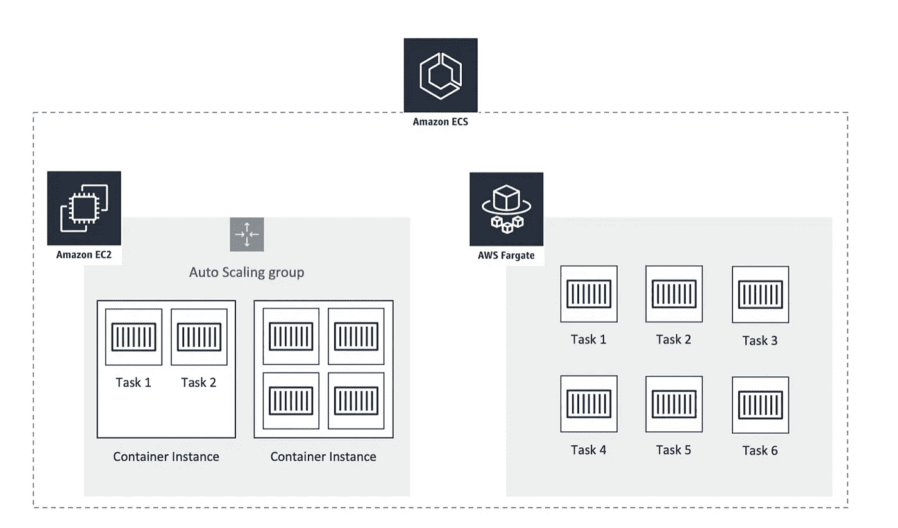

作者截图

但是，这里需要注意的是，AWS Fargate 没有附带自由层选项！(写作时)。小型设置非常便宜，但要记住。

# 购买域名

第一件事当然是买域名。

请注意，购买域名不包括在 AWS 免费层系统中。域名费用从 10 美元起。

只需通过 AWS 仪表板进入域部分，然后单击“注册域”。

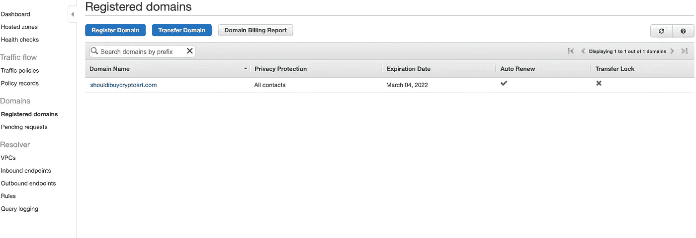

作者截图

然后，您将被引导完成选择域名的过程。

确保事先设置有效的支付方式。如果不是这样，购买过程将被取消，但您的购买将在账单上。我真的认为这是一个错误。我向 AWS 提交了一份报告，并希望这将得到解决，以便进一步使用。为了避免这种情况，请确保您的支付方式有效。您可以在您的帐户设置中找到它。

一切正常后，您将收到一封电子邮件，您的注册域名将出现在相应的选项卡下。(见上面我的截图)。

# 使用您的 AWS 公共 IP 地址连接域

有多种方法可以做到这一点。我只会用一种方式展示。

转到 Route 53 菜单，导航到“托管区域”页面，为您的域创建一个新记录。

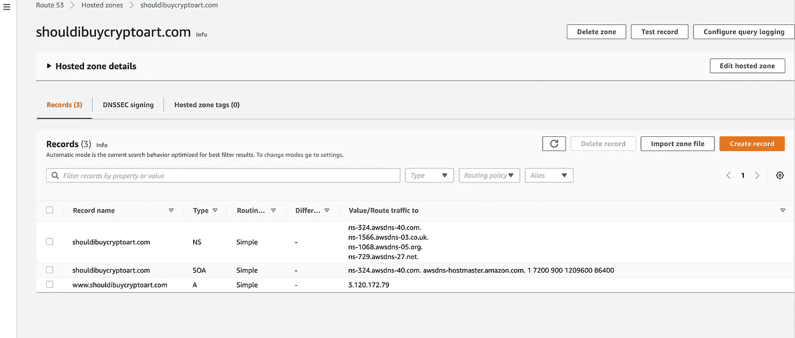

作者截图

然后创建一个新记录。

从 ec2 任务概述页面获取公共地址，并将其作为静态值添加到您的域中。对于记录名称，只需在名称中添加一个“www ”:

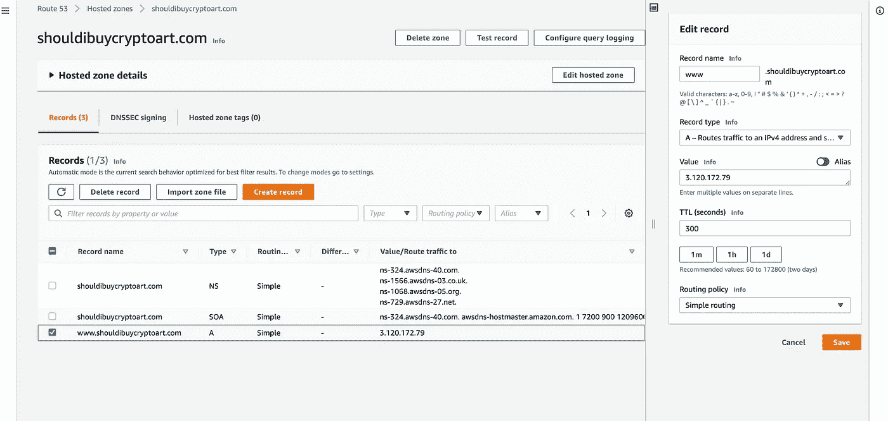

作者截图

有几件事要记住:

*   这是一个静态链接，这意味着如果 IP 地址发生变化，您需要更新此条目
*   这要求您的应用程序将其内容发送到 IP 地址，而不是其他端口(通常是 8080)。您不能在此指定端口。您必须在设置 Docker 容器的 EC 实例/集群/任务中对此进行更改。
*   当我们添加负载平衡器并启用 https 时，此条目将会改变！(见下文)

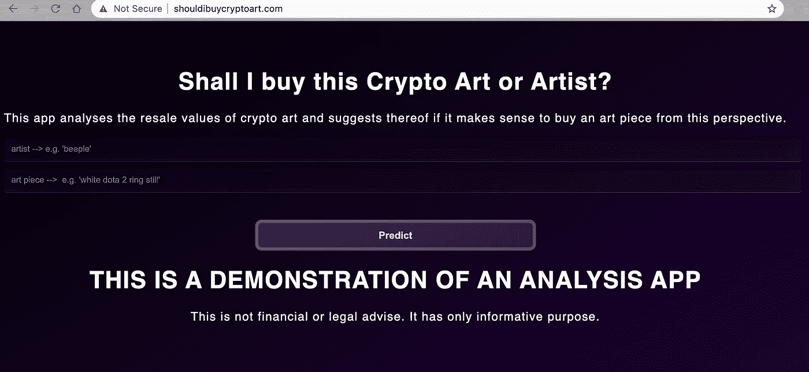

作者截图

但是，正如您所看到的，网页是通过 HTTP 而不是 HTTPS 提供的。所以下一步是添加安全证书。

# 启用 HTTPS

老实说，这比我一开始预想的要多得多。知道原因很重要。

# 向群集添加规则

转到 EC2 群集的安全组，确保添加(或已经添加)了相应的入站规则以允许 https 设置。

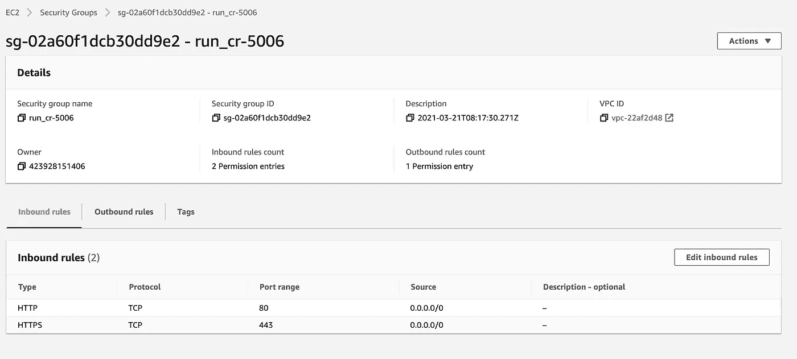

作者截图

# 获得证书

导航到 AWS 证书管理器

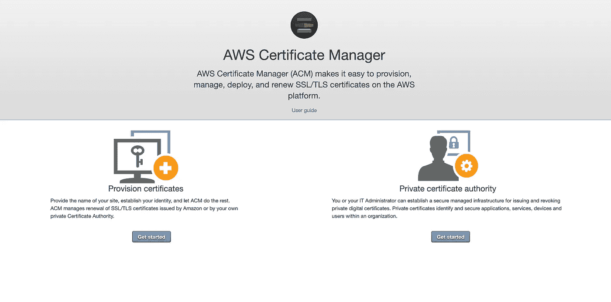

作者截图

添加您的域

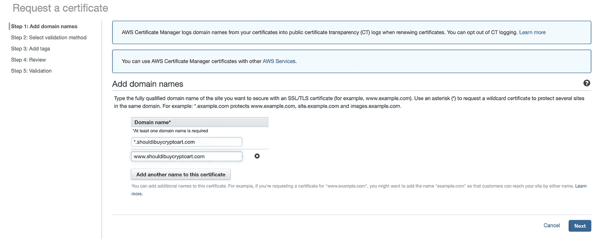

作者截图

并填写您认为合适的其余问题。

我选择了通过电子邮件确认。批准此邮件后，您将成功颁发证书。

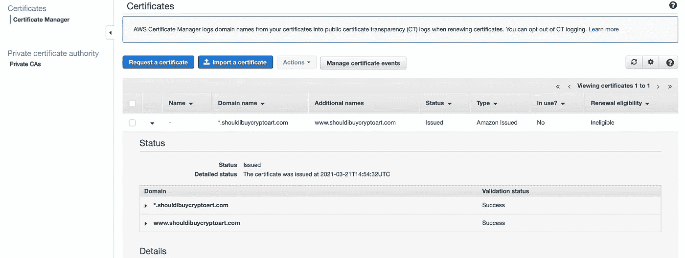

作者截图

# 添加负载平衡器

AWS 中添加 SSL 证书的一种方法是添加负载平衡器。因为我想平衡服务器的负载，所以我将展示我是如何做的。

只需输入负载平衡器并选择 EC2 功能:

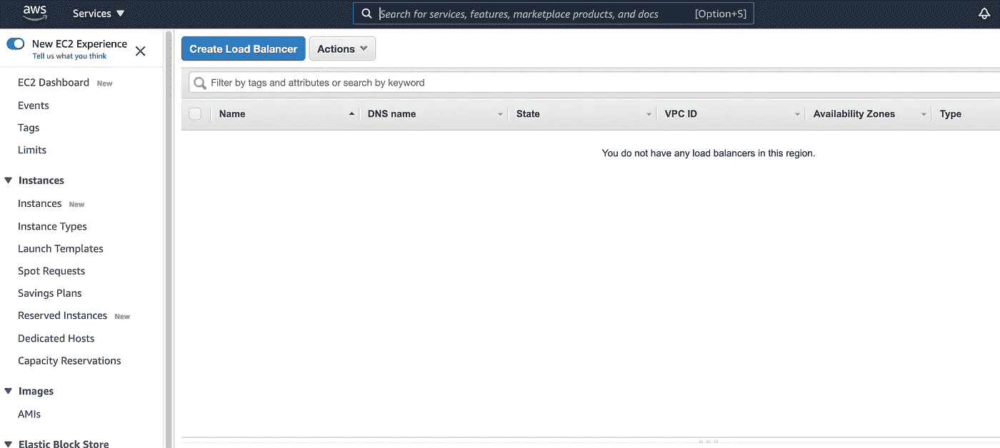

作者截图

然后，我们选择应用程序负载平衡器:

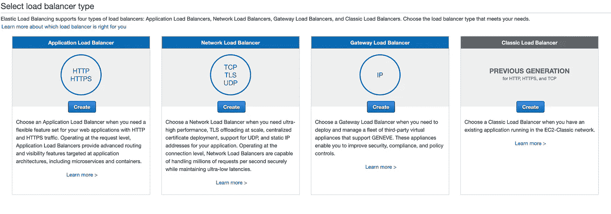

作者截图

1.  为您的负载平衡器命名
2.  该计划将面向互联网，并
3.  选择 https，
4.  选择可用子网

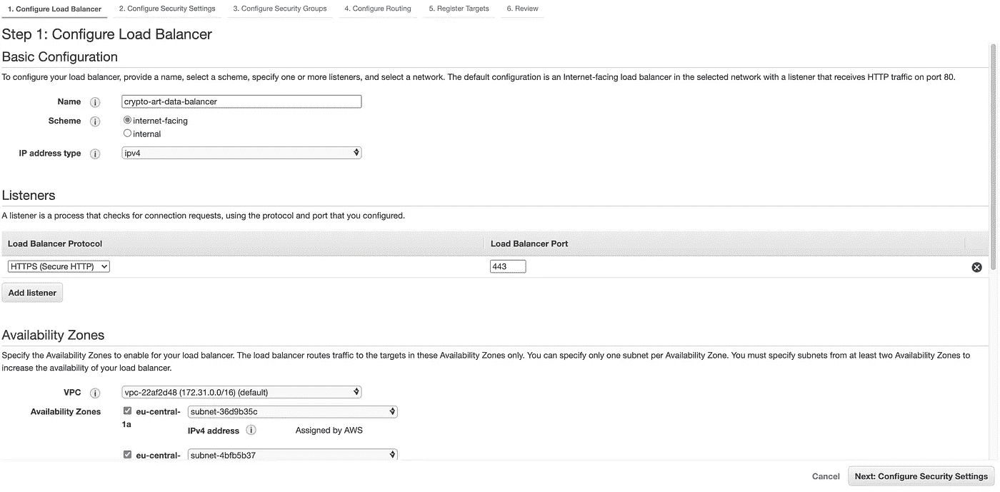

作者截图

在“安全设置”选项卡中，您可以选择之前设置的证书(从 ACM)

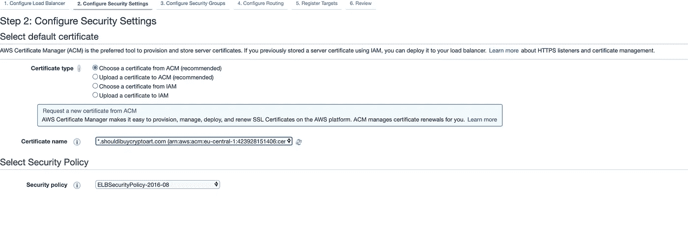

作者截图

*   建立一个安全组。确保允许 https 和 http 流量

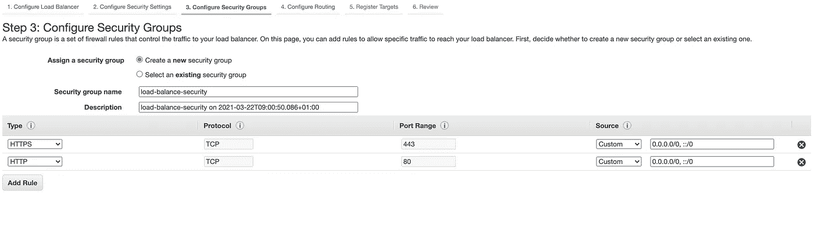

作者截图

*   配置路由。确保对 Fargate 使用目标[类型“IP”](https://docs.aws.amazon.com/AmazonECS/latest/userguide/create-application-load-balancer.html)
*   监听目标组中的 HTTP 协议

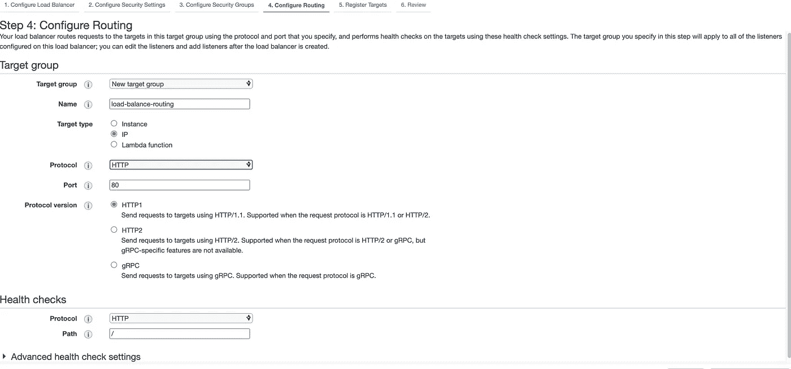

作者截图

*   保留目标中的默认值，因为它将自动分配！
*   回顾一切并创建您的负载平衡器
*   如果您想将路由直接设置为 DNS 地址，您可以复制负载平衡器的 DNS 名称

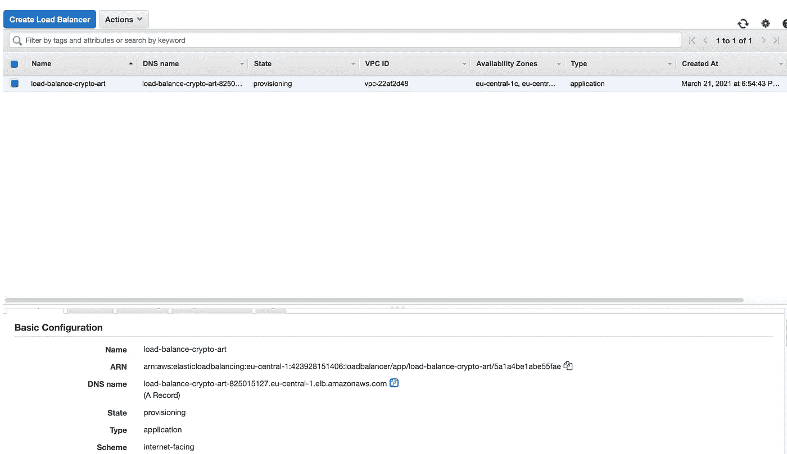

作者截图

注意，我只是在这里设置了 https 请求。理想情况下，您也可以在这里设置从 http 到 https 域的重定向。更多信息可以在[这里](https://aws.amazon.com/premiumsupport/knowledge-center/elb-redirect-http-to-https-using-alb/)找到。

# 更新路线 53

*   进入 Route 53 >路由区域>点击域名>
*   转到记录集
*   使用域名创建托管区域
*   创建/编辑名称为空的记录集，键入 A，
*   应用程序负载平衡器的别名，并选择您创建的 DNS

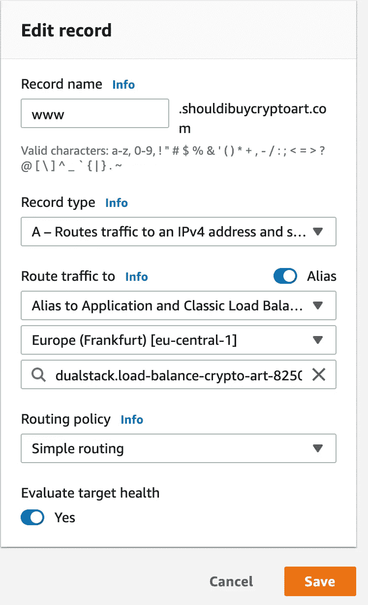

作者截图

# 创建集群服务

在服务中，您可以添加先前定义的负载平衡器。要理解服务和任务之间的区别，请看这个 [SO 问题](https://stackoverflow.com/questions/42960678/what-is-the-difference-between-a-task-and-a-service-in-aws-ecs)。

*   转到 ECS 群集中的“service”选项卡
*   根据需要填写所有内容

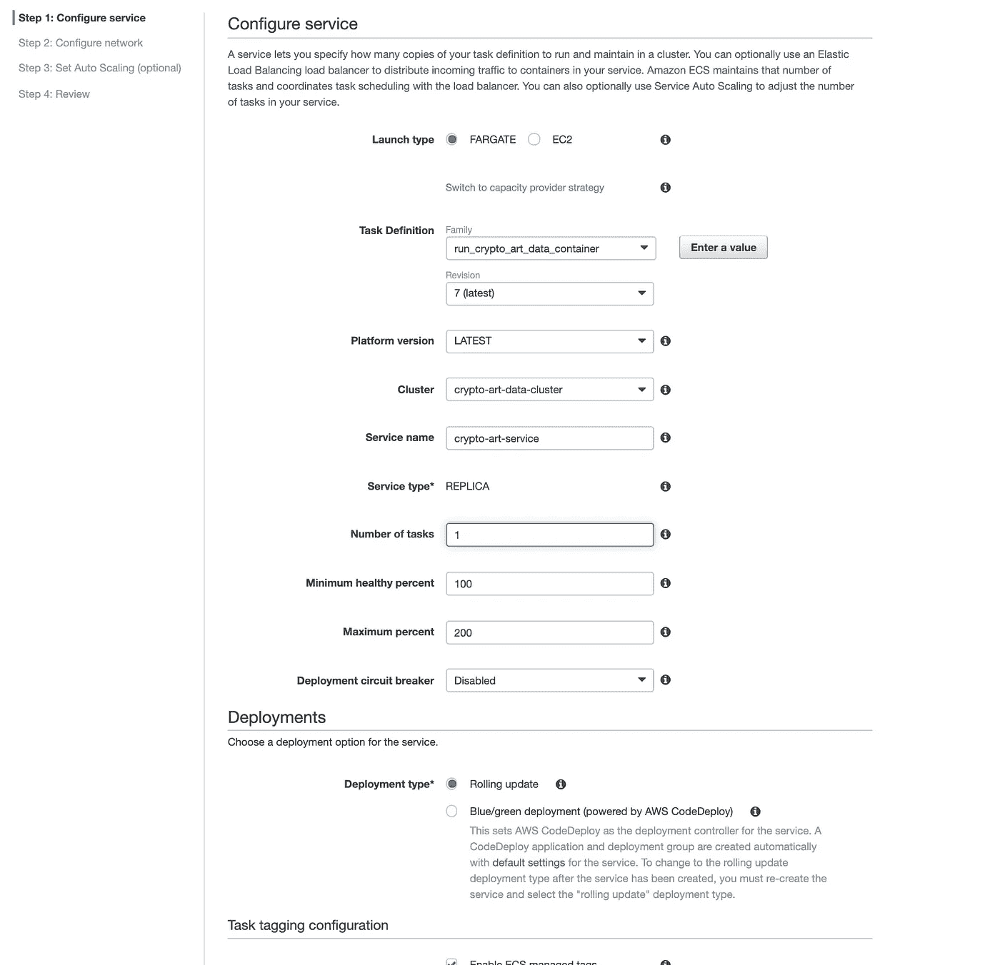

作者截图

*   在下一步(网络设置)中，使用 VPCs 的默认值
*   添加一个应用程序负载平衡器，将监听器设置为 https(端口 443)并指定您的目标组(您已经在负载平衡器的路由中定义了)

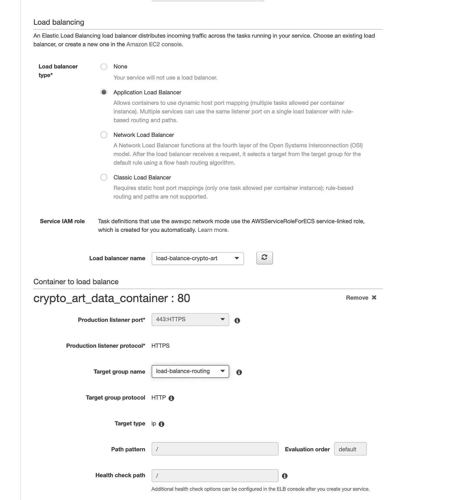

作者截图

*   完成这些步骤并创建服务

现在，您需要等待一段时间，直到一切都设置好并运行。

# 使用 https 负载平衡器查看您的结果

现在，您可以导航到任务的公共 IP:

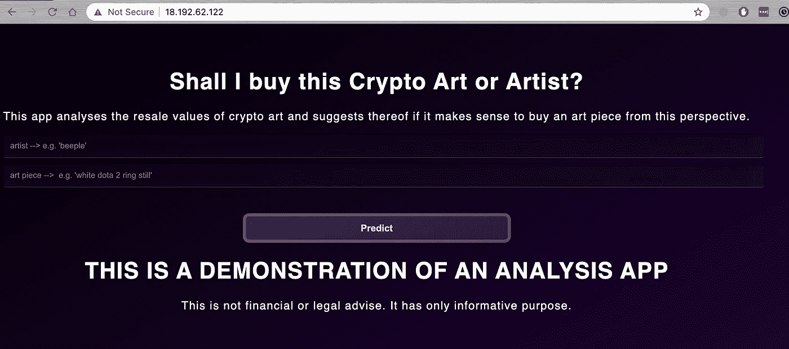

作者截图

当然还有您的 https 域:

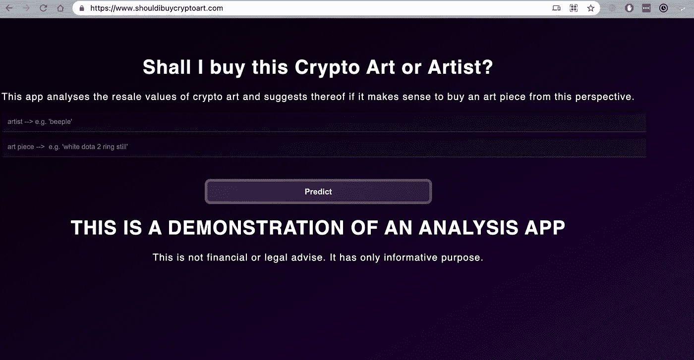

作者截图

如果你在整个过程中有问题，看看这个关于如何设置 https 的问题。我发现它很有用。

注意:由于该应用程序正在开发中。当您尝试访问时，可能无法访问该域。这是我所希望的，因为我仍然在玩 AWS 架构设置，并希望避免太多的成本。

这篇文章是一个更大项目的一部分，我将在[www.shouldibuycryptoart.com](http://www.shouldibuycryptoart.com/)下发布这个项目。该应用程序正在开发中。如果你想关注它的发展，请随时联系我或关注我的社交媒体账户。

# 有用的文章

*   [https://dev . to/ryands 17/deploy-a-node-app-to-AWS-ECS-with-dynamic-port-mapping-38gd](https://dev.to/ryands17/deploy-a-node-app-to-aws-ecs-with-dynamic-port-mapping-38gd)

# 放弃

我与本文中使用的任何服务都没有关联。

我不认为自己是专家。除了做其他事情，我只是记录事情。因此，内容并不代表我的任何专业工作的质量，也不完全反映我对事物的看法。如果你觉得我错过了重要的步骤或者忽略了什么，可以考虑在评论区指出来或者联系我。

这是 2021 年 3 月 22 日编写的。我无法监控我的所有文章。当你阅读这篇文章时，提示很可能已经过时，过程已经改变。

我总是乐于听取建设性的意见以及如何改进。

# 关于

丹尼尔是一名艺术家、企业家、软件开发人员和商业法毕业生。他的知识和兴趣目前围绕着编程机器学习应用程序及其所有相关方面。从本质上说，他认为自己是复杂环境的问题解决者，这在他的各种项目中都有所体现。

->在 https://medium.com/subscribe/@createdd[订阅此处](https://medium.com/subscribe/@createdd)或在媒体上阅读更多->[https://medium.com/@createdd/membership](https://medium.com/@createdd/membership)

连接到:

*   [Allmylinks](https://allmylinks.com/createdd)

直接:

*   [领英](https://www.linkedin.com/in/createdd)
*   [Github](https://github.com/Createdd)
*   [中等](https://medium.com/@createdd)
*   [推特](https://twitter.com/_createdd)
*   [Instagram](https://www.instagram.com/create.dd/)
*   [createdd.com](https://www.createdd.com/)

艺术相关:

*   中等/最先进的
*   [Instagram/art_and_ai](https://www.instagram.com/art_and_ai/)
*   [稀有的](https://app.rarible.com/createdd/collectibles)
*   [公海](https://opensea.io/accounts/createdd?ref=0xc36b01231a8f857b8751431c8011b09130ef92ec)
*   [已知起源](https://knownorigin.io/profile/0xC36b01231a8F857B8751431c8011b09130ef92eC)
*   [迪瓦恩艺术](https://www.deviantart.com/createdd1010/)