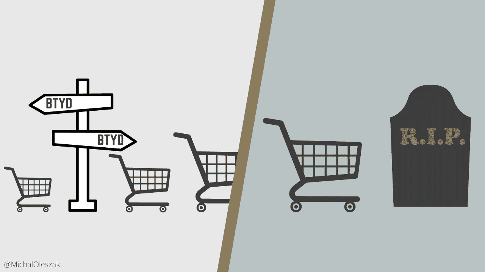
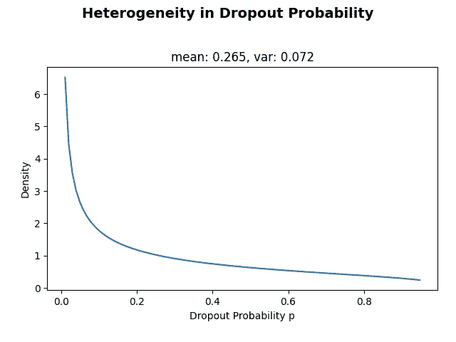
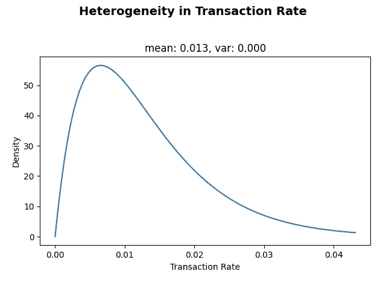
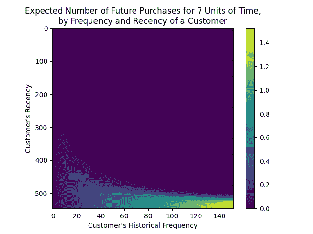
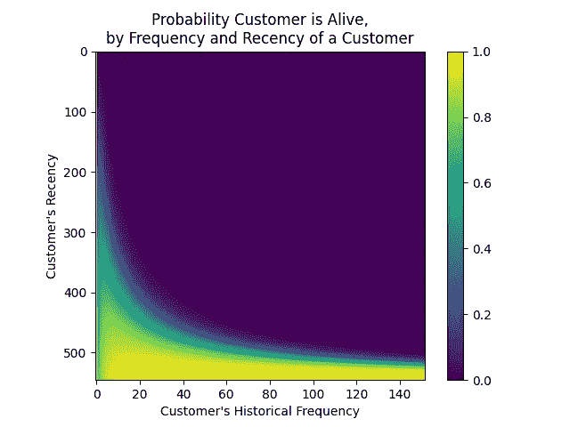

# 购买到死:理解顾客终身价值

> 原文：<https://towardsdatascience.com/buy-till-you-die-understanding-customer-lifetime-value-eb2c0a23b85>

## BG/NBD 模型解释道。



了解每个特定客户给你的业务增加了多少价值是至关重要的，尤其是因为它有助于确定客户获取和保留预算。客户终身价值模型是获得这种洞察力的有用工具。然而，似乎有很多关于它们的混淆，[而且很明显，每个人都在错误地使用它们](https://www.youtube.com/watch?v=guj2gVEEx4s)。我们如何仅从交易数据中预测终身价值和客户流失？BG/NBD 代表什么？这些模型依赖什么样的数据？让我们来了解一下！


# 了解基本情况

在我们深入研究客户终身价值或 CLV 模型之前，让我们先弄清楚一些基本的定义和假设。

## 什么是客户终身价值？

客户终身价值是企业在特定客户的整个生命周期中从他们那里获得的所有收益，通常以货币形式表示。

顾客的一生当然不需要指他们实际的出生和死亡。相反，客户的一生被理解为他们与公司打交道的时间。简而言之，它是顾客第一次购买和最后一次购买之间的时间。

> 客户终身价值是企业在特定客户的整个生命周期中从他们那里获得的所有收益，通常以货币形式表示。

为了计算特定客户的 CLV，我们需要预测他们在流失之前购买的产品或服务的数量，并乘以一些货币数字，如价格(这将导致 CLV 表现为每个客户的收入)或利润率(这将使我们的 CLV 估计每个客户的利润)。

如果您是一名会计，您可能希望将结果折算为今天的美元价值，这样您就可以知道每个客户现在的价值(也就是说，将未来的通货膨胀考虑在内)。就是这样。


## (非)合同环境下的客户终身价值

预测客户购买量以及他们何时流失的任务听起来像是机器学习模型的一个很好的用例。这是正确的，前提是你已经为你的模型找到了一些可以学习的目标。输入合同数据和非合同数据之间的重要区别。

当公司和客户之间的关系以书面协议或合同的形式正式确立时，我们就处于**契约**的环境中。想想你的网飞订阅。网飞知道你订阅和取消订阅的确切日期，那是你的一生。他们也有很多关于你的其他数据:你看了什么电影，你对它们的评价如何，一天中你看得最多的时间，可能还有你的年龄和性别等等。基于所有这些数据，建立一个预测一个人的流失概率的机器学习模型是相当简单的。

> 利用合同数据，机器学习模型可以预测 CLV。在非合同环境中，我们需要不同的方法。

现在想想你最近在一家网上商店购物。你没有与他们签订任何合同，这使得他们无法确切知道你是否已经搅拌。你可能会决定明天或十年后再和他们一起购买。此外，除了你的购物历史，他们没有太多关于你的信息(特别是如果你是作为客人在网上购物)。这是一个**非合同**设置。在这种情况下，你的亿万参数巨型变压器将没有什么用处，因为没有基本事实标签，你无法训练有监督的机器学习模型。这就是为什么我们需要不同的方法。


# 至死不渝地购买模型

多年来广泛使用的估算非合同数据 CLV 的最流行和最准确的方法是一类被称为“买到死”的概率模型。其中一个特别的例子是 **BG/NBD Gamma-Gamma 模型**，它已经被广泛采用。

事实上，这是两个独立的模型:BG/NBD 预测每个客户的未来交易数量，然后将其输入 Gamma-Gamma 模型，以预测其货币价值。让我们看看他们两个。


## **贝塔几何/负二项分布模型**

BG/NBD 模型预测客户未来的购买数量及其存活的概率，即在非合同环境下，或换句话说，仅根据过渡数据，尚未被搅动。它通过对模型的参数强加一些分布假设来做到这一点，我们很快就会谈到。但是首先，让我们来看看我们需要什么样的数据。


## 数据要求

我们的模型仅基于**交易数据**。这意味着对于每个客户，我们需要知道他们每次购买的时间、数量和价值。这些数据应该很容易从公司的交易系统中获得。

有了手头的数据，我们需要为每个客户计算四个不同的数量:

*   **最近**，或者客户第一次和最后一次购买之间的时间；
*   **频率**，或顾客在
    T5 购物的时间段计数(重要提示:网络上的一些资源声称频率是顾客重复购物的次数，这使得它比总购物次数少一次。这是不正确的，因为 frequency 应该忽略同一时间段内的多次购买。)；
*   **时间**，或者客户的年龄(这是客户第一次购买和我们分析的结束日期之间的时间差，往往是数据中可获得的最后日期)；
*   **货币价值**，或客户重复购买的平均收入或收益)。

新近和时间可以用任何感兴趣的单位来表示:小时、天、周等等。

为了让您对必要的事务数据有一个大概的了解，让我们来看看`btyd` Python 包(停止主动维护的流行的`lifetimes`包的继承者)附带的 *cdnow* 数据集。

```
 customer_id       date  volume  value
0           00001 1997-01-01       1  11.77
1           00002 1997-01-12       1  12.00
2           00002 1997-01-12       5  77.00
3           00003 1997-01-02       2  20.76
4           00003 1997-03-30       2  20.76
              ...        ...     ...    ...
69654       23568 1997-04-05       4  83.74
69655       23568 1997-04-22       1  14.99
69656       23569 1997-03-25       2  25.74
69657       23570 1997-03-25       3  51.12
69658       23570 1997-03-26       2  42.96
```

我们可以很容易地解析这些数据来提取模型所需的特征。

请注意，我们删除了频率为零的所有行，即只购买了一次的所有客户。他们无论如何也不会对模型做出贡献。我们解析的数据帧现在看起来如下。

```
 frequency  recency      T  monetary_value
customer_id                                           
00001              0.0      0.0  545.0        0.000000
00002              0.0      0.0  534.0        0.000000
00003              5.0    511.0  544.0       27.140000
00004              3.0    345.0  545.0       23.723333
00005             10.0    367.0  545.0       35.628000
                ...      ...    ...             ...
23566              0.0      0.0  462.0        0.000000
23567              0.0      0.0  462.0        0.000000
23568              2.0     28.0  462.0       49.365000
23569              0.0      0.0  462.0        0.000000
23570              1.0      1.0  462.0       42.960000
```


## 模型假设

是时候讨论一下贝塔几何/负二项分布模型本身了。让我们看看它是如何工作的，它做了哪些假设。

*   **交易。**该模型假设，只要客户还活着，他们的交易数量就遵循一个[泊松过程](/6-useful-probability-distributions-with-applications-to-data-science-problems-2c0bee7cef28)，并且具有某个比率λ。例如，λ=2 意味着顾客平均每个时间段购买两次。每个客户的比率λ是不同的，其在所有客户中的分布被假定为伽玛分布。客户死了(也就是他们搅了)，成交笔数自然是零。
*   **搅动。**每次购买后，客户可能会以某种概率流失 *p.* 这种概率对于每个客户都是不同的，其在所有客户中的分布被假设为 Beta 分布。

现在让我们花一点时间来思考我们的模型的假设。这里有几件事可能会引起混淆，需要详细说明。

首先，为什么用泊松分布来模拟客户的交易，这意味着每次购买的发生都独立于前一次？这在某些用例中可能比在其他用例中更错误(在我买了一台新冰箱后，我不会很快需要另一台)。尽管如此，做出这个简化的假设使得模型的数学更容易，并且在实践中运行良好。嘿，毕竟，任何模型的工作都是简化现实，以允许对其做出推论！

第二，我最近被一个客户问了一个有趣的问题:交易数据需要服从泊松分布吗，这是使用模型的先决条件吗？答案是否定的！首先，您可能甚至没有足够的数据来估计每个客户遵循某种特定分布的概率。然后，同样，该算法用泊松分布对数据建模以简化事情，因为泊松是这种类型数据的自然选择。只要您的数据包含每个客户在不同时间段的多次交易，就没问题！


## 模型拟合

让我们把模型放在一起。我们如何将它与数据相匹配，结果如何？想想简单的线性回归模型。当您将它与数据拟合时，结果是模型参数，在这种情况下是对目标的特征影响。在我们的 BG/NBD 模型中，目标也是估计模型参数的值。

BG/NBD 模型的工作是估计两种概率分布的参数:

*   伽马分布，客户的个人交易率λ由此而来，
*   贝塔分布，客户的个人流失概率由此而来 *p.*

β有两个参数，习惯上称为 *a* 和 *b* ，而γ也需要两个参数: *r* 和*α。这总共有四个模型参数。它们是使用最大似然法估计的，这意味着选择这样的参数值，使模型最有可能产生我们实际拥有的数据。让我们在实践中看到它。*

```
 coef  se(coef)  lower 95% bound  upper 95% bound
r        2.009639  0.041406         1.928483         2.090795
alpha  154.393028  3.700599       147.139853       161.646203
a        0.455240  0.019355         0.417304         0.493175
b        1.264726  0.069044         1.129400         1.400051
```

这里我们有四个模型参数及其估计值、标准误差和[置信区间](/confidence-intervals-vs-prediction-intervals-7b296ae58745)。


## 分析模型

为了验证我们的模型是否有意义，要做的第一件事是绘制它已经估计的两个分布，以直观地评估它们的形状。



模型估计的 Beta(左)和 Gamma(右)分布。图片由作者提供。

两者似乎都有道理。最重要的是，大多数客户的流失率都很低，这是他们所期望的。

下一步是看一下频率/新近图表。为了画出它，我们需要确定数据中的频率和新近性的范围。然后，我们为两者的所有可能组合创建一个精细的网格，并将它们提供给模型，以便它预测在预定义的时间跨度内未来购买的预期数量(稍后将详细介绍如何进行预测)。在这里，我们设置了`T=7`来获取下周的预期购买数量。



不同近期和频率的客户的预计购买次数。图片由作者提供。

显而易见，我们可以预期，历史上有着高频率和高新近性的客户会购买最多的产品(右下方)。从这个最佳位置(右上角)向图的顶部移动的是那些已经有一段时间没有购买的高频客户。这可能意味着他们已经搅动，不会再购买。另一方面，最佳购买点左侧(左下角)是不经常购买的客户，但我们最近见过他们，所以他们可能会也可能不会再次购买，因此预测下降的尾巴伸向左下角。

接下来，我们来看看流失概率。或者更准确地说，具有特定频率/新近组合的客户还没有被搅动。



具有特定频率/最近组合的客户存活的概率。图片由作者提供。

这个图表的解释与我们之前研究过的非常相似。不出所料，最近频繁出现的顾客(右下方)最有可能还活着。我们有一段时间没见的老顾客可能已经发生了变化(右上)。现在让我们看看左下角。在最不频繁的客户中，有一些我们已经有一段时间没有见过了(最近大约 300)，但是由于他们通常不经常购买，所以有合理的机会他们还没有搅动。

我们刚刚分析的两种可视化都依赖于模型的预测，无论是流失概率估计还是未来购买的预测数量。这些是怎么做的？接下来我们来讨论一下。


## 做预测

假设客户的历史频率为 3.5，最近频率为 450，年龄为 500 天，那么在接下来的 100 天内，他们会购买多少次？

预测是`0.680`，这意味着我们可以预期这样的客户平均会完成大约三分之二的购买。换句话说，如果我们观察 100 名具有相同特征的客户，我们可以预计其中 2/3 的人会购买一次，1/3 的人不会购买(或者 1/3 的人会购买两次，其余的人不会购买，从而得出相同的平均值)。

我们是如何得出这一预测的？嗯，这都是应用于模型估计的概率密度的数学。详见 Fader 等人的[这篇论文(见附录中的方程 10 及其推导)。](https://www.researchgate.net/publication/227442378_Counting_Your_Customers_the_Easy_Way_An_Alternative_to_the_ParetoNBD_Model)

简而言之，漫长的数学推导归结为估计消费者到时间 100 时的购买次数的平均值(或期望值)。这是通过首先估计客户在该时间段内的每个时间点还活着的概率来完成的，并且基于结果以及他们的最近和频率，计算最可能的购买次数。

虽然推导本身相当复杂(它利用[贝叶斯定理](https://medium.com/p/74df448da25)来计算流失率 *p* 和交易率λ的联合分布，同时还求解高斯超几何函数的欧拉积分)，但是需要评估的预测的结果公式相当简单。


## 钱，钱，钱:伽玛-伽玛模型

到目前为止，我们一直在预测未来的交易数量。这就是我们的 BG/NBD 模型可以带我们走多远。但是为了完成我们的客户终身价值评估，我们需要将这些销量预测转换成货币形式。最常用的方法是使用 **Gamma-Gamma 模型**，这是购买到死方法的一个组成部分。

Gamma-Gamma 模型使用每个客户的交易频率和平均货币价值来估计他们单笔交易的预期价值。然而，它依赖于一个重要的假设，即它的两个输入之间没有相关性。在实践中，最好事先验证这是否成立。

```
 monetary_value  frequency
monetary_value        1.000000   0.072322
frequency             0.072322   1.000000
```

对于我们的数据来说，这种相关性相当弱，因此很可能符合伽玛-伽玛模型。

准备好模型后，我们可以估计每个客户的平均交易值。

```
0        28.233236
1        26.190742
2        35.487043
3        90.966309
4        31.681303
           ...    
11387    28.755547
11388    41.177010
11389    30.689138
11390    44.424422
11391    38.599852
```

现在，我们可以将这些数字乘以 BG/NBD 模型预测的每个客户的交易数量，但这样我们就会忽略一个重要的经济现象:通货膨胀。

通货膨胀是货币的价值随着时间的推移而减少，这意味着你一年后得到的 100 美元比你钱包里已经有的 100 美元价值更低。在 CLV 世界，客户在未来带来的价值在当前的价值低于其名义货币价值。为了把它考虑进去，我们需要用某个贴现率来贴现未来的美元价值。

虽然要使用的正确折扣值可能是一个经济辩论的主题，甚至可能是特定于业务的，但在本例中，我们将任意将其设置为 1%。那么，我们每个客户在未来 12 个月的 CLV 是多少？

```
0         76.130371
1         32.012197
2         73.677196
3        112.946757
4         89.223161
            ...    
11387     43.924401
11388     19.281169
11389     28.020272
11390      3.078582
11391      2.298163
```

因此，我们得到了我们的 CLV 估计:这些是货币价值，贴现到今天的美元，我们可以期望每个客户在下一年带给我们。


# 最后的话

我们已经了解了什么是客户终身价值，为什么了解它至关重要，以及如何在非合同环境下使用“一买到底”模型来估算它。我们已经讨论了数据需求、模型的假设和架构，以及如何在 Python 中拟合和分析它。

我们忽略的一个重要方面是模型验证。我们如何知道这个模型对未来的客户是否有用，因为他们在培训中没有见过这个模型？如果你对这个话题感兴趣，一定要让我知道，我会单独写一篇关于它的文章。


如果你喜欢这篇文章，为什么不在我的新文章上 [**订阅电子邮件更新**](https://michaloleszak.medium.com/subscribe) ？通过 [**成为媒介会员**](https://michaloleszak.medium.com/membership) ，你可以支持我的写作，并无限制地访问其他作者和我自己的所有故事。

需要咨询？你可以问我任何事情，也可以在这里 预定我 1:1 [**。**](http://hiretheauthor.com/michal)

你也可以试试我的其他文章。不能选择？从这些中选择一个:

[](/comparing-things-the-bayesian-approach-b9a26ddb5ef1)  [](/on-the-importance-of-bayesian-thinking-in-everyday-life-a74475fcceeb)  [](/confidence-intervals-vs-prediction-intervals-7b296ae58745) 