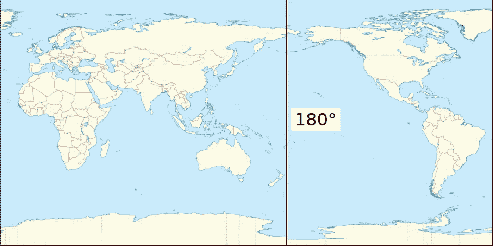
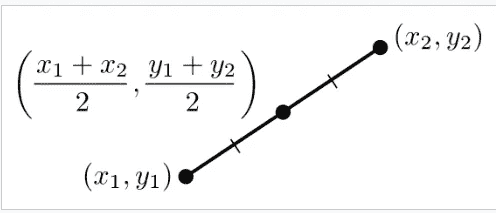
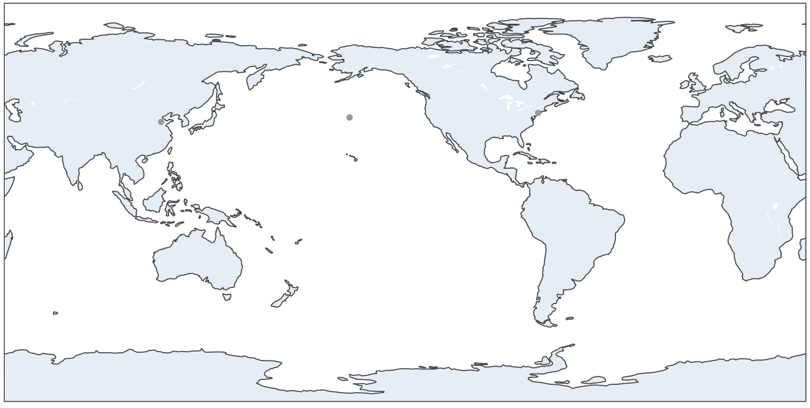

# 基于机器学习和 Python 的地理分析

> 原文：<https://towardsdatascience.com/calculating-closest-landmass-between-two-points-on-earth-214f73b48fdc>

## 一个圆形的行星如何使分析变得更加困难

[来源](https://unsplash.com/photos/9tmrYLRL7Ww)

# 介绍

我对最近上传的一个现有项目做了一些重要的更新。请查阅[原创文章](https://medium.com/towards-data-science/how-to-find-land-when-youre-at-sea-using-python-48111e5d9795)了解背景和更深层次的背景。

> **但简单回顾一下**:我和我的妻子有一种不寻常的需要，即确定地球上两个坐标之间的中点，然后找到离该中点最近的陆地。我确信这个问题的解决方案可以通过快速的谷歌搜索很容易找到，但是没有这样的运气。因此，我决定深入地理的兔子洞，为这个很少有人会问的晦涩问题找到一个解决方案。

# 脚本更新

## 1.计算地理中点:

在最初的版本中，我们利用谷歌来确定地理中点，然后脚本的主要功能是找到最近的陆地。在当前版本中，我们*从两个起始坐标本身开始*，脚本从头开始计算中点。这大大节省了时间，因为对于那些不知道自己到底在找什么的人来说，在谷歌上找到中点很困难。我不想让用户错误搞砸最终结果。然而，加入这种变化有点棘手。人们最初会认为我们在中学都学过的[中点](https://en.wikipedia.org/wiki/Midpoint)公式就足够了；然而，因为地球是圆的，不是二维笛卡尔平面，所以它有点复杂。位于太平洋中部的 [*国际日期变更线*](https://en.wikipedia.org/wiki/International_Date_Line) 是地球的“圆度”成为计算问题的地方。需要 3 个中点函数(以及随后的大量脚本来确定 3 个函数中的哪一个)来确定正确的中点。

## **情形 1:2 个起始坐标未穿越 IDL 线。**

大多数情况下都是这种情况。只要输入之间的最短距离不与下图所示的红线相交，基本中点公式就能完美工作:

[维基百科](https://en.wikipedia.org/wiki/180th_meridian#/media/File:Earth_map_with_180th_meridian.jpg)

澳大利亚到非洲，加拿大到智利，美国到欧洲等。所有这些都是公平的游戏，因为它们之间的最短距离避开了那条线。

[维基百科上的中点方程](https://en.wikipedia.org/wiki/Midpoint)

## 情况 2 和 3:两个输入点之间的最短距离穿过 IDL

因为一旦你穿过这条线(从东到西)，纬度直接从+180 度到-180 度，它扭曲了中点方程的用法。

> 例如，如果我们对坐标(0，-179.8)和(0，179.9)使用中点方程，它将在(0，0.05)处计算整个世界的中点，而不是在(0，-179.95)处计算几英里以外的中点。上谷歌地图，把这些坐标粘贴进去，你就能看到自己了。

为了说明这一点，我们需要制作另外两个场景:1 .当中点应该落在线的西边时(意味着两点的纬度都是负值)，以及 2。当中点落在线的东部时(意味着两点的纬度都是正的)。上海到纽约是中点落在 IDL 以东的一个例子；夏威夷到印度是中点落在 IDL 以西的一个例子。

*如果你看看下面代码中的第 7-15 行，你会看到其中用到的数学。第 17-20 行是比较的基本中点。*

上面的第 32-68 行是计算 3 个中点中哪一个是适合当前情况的。您可以通过注释来理解每个计算以及它如何影响下一个计算。更多细节见我的[github](https://github.com/ahershy/Land_from_oceanpoint_search/blob/main/Finding_Land_Updates.ipynb)/看完整脚本。

## 2.确定中点已经在陆地上的情况

我添加了一个 if 语句，它解释了中点在陆地上的 29%的情况(因为地球的 29%是陆地)。如果中点恰好是陆地，代码只输出坐标，避免搜索最近陆地的迭代循环。

## 3.形象化

现在有了两个起始坐标和中点的可视化。很容易迷失在坐标数字本身的抽象中，所以每次运行这个脚本时看到它们在地图上可视化对我来说都是有价值的。请看下面的视觉效果图。

中美起点的中点[原例](https://medium.com/towards-data-science/how-to-find-land-when-youre-at-sea-using-python-48111e5d9795)

# 结论:

这些编辑很有趣，在这个过程中我学到了很多地理知识。现在任何像我一样古怪的人，如果需要识别离两个坐标中点最近的陆地，可以比以往任何时候都容易。使用这个脚本也是发现小的、不知名的岛屿的好方法。我强烈建议对 python 或地理感兴趣的人尝试一下，因为你会学到很多关于这两方面的知识。

编辑:我还注意到，有更复杂的方法可以找到更精确的地理中点。本文中显示的方法是基于二维平均的近似方法；然而使用三角和三维计算显示 [*在这里*](http://www.geomidpoint.com/example.html) *，可以发现一个更精确的结果。*

**考虑通过我的推荐链接加入 Medium:**[https://andrewhershy.medium.com/membership](https://andrewhershy.medium.com/membership)

**如果你觉得这篇文章有帮助/有趣，请看看我的其他文章:**

[*如何使用 python 在海上寻找陆地*](/how-to-find-land-when-youre-at-sea-using-python-48111e5d9795)

[*我写了一个 python 脚本帮我玩彩票*](/understanding-mega-millions-lottery-using-python-simulation-d2b07d30a7cc)

[*基尼指数 vs 信息熵*](/gini-index-vs-information-entropy-7a7e4fed3fcb)

[*Alteryx 是否是你数据分析需求的正确选择？*](https://link.medium.com/Kq9FcRFB8mb)

[*使用数学和 python 优化你的投资组合*](https://link.medium.com/fk39T8NB8mb)

[*Excel vs SQL:概念上的比较*](https://link.medium.com/8ZJSKcWB8mb)