# 计算四分位数:逐步解释

> 原文：<https://towardsdatascience.com/calculating-quartiles-a-step-by-step-explanation-f5457de460ee>

## Python 中分析和计算四分位数的方法


图片由[卢卡斯](https://www.pexels.com/@goumbik/)在[像素](https://www.pexels.com/photo/document-on-top-of-stationery-669619/)上拍摄

[四分位数](https://www.statisticshowto.com/probability-and-statistics/statistics-definitions/what-are-quartiles/)是代表数据观察的四个等分区间的统计对象。这些计算是比较数据不同部分(如最大值、最小值、中间值和异常值)的有用方法。这些统计值对于比较各组是必不可少的。例如，如果我们观察 2022 年美国收入的四分位数，这些值将比我们只考虑纽约市肿瘤学家的收入更分散，因为第一个四分位数的所有收入范围比第二个四分位数大得多。四分位数可以让我们发现年薪 50，000 美元的纽约肿瘤学家是个异数。更有甚者，这一工资可能与典型值相差甚远，分析师或数据科学家可能会得出结论，这是一个错误的值，可能是人为输入错误的结果。

虽然这个例子看起来很直观，但是计算四分位数是一种统计上严格的方法，可以测量和比较数据中值的分布。鉴于这种严格性，quartiles 有许多行业应用，包括比较公司薪酬、执行客户细分、检测金融市场中的欺诈以及比较娱乐业中的门票销售。

进行这种分析的最常见方法之一是在 Pandas 中使用分位数方法，这种方法很有用，因为它可以计算任何类型的分位数，如中位数、三分位数(3 组)、五分位数(5 组)以及一直到百分位数(100 组)。此外，Seaborn 库是一个 Python 可视化工具，允许您通过箱线图可视化四分位数。

四分位数的另一个用途是分析数据的子组。Pandas 分位数方法也使得分析数据中子组中的四分位数变得简单明了。考虑电话和互联网服务提供商的客户账单数据。这些数据可能包含客户任期、性别和服务类型等信息。不同层次的四分位数可以洞察哪些因素对客户保持率影响最大。使用四分位数，您可以获得有助于回答各种分析问题的见解。例如，四分位数可以帮助我们解决以下所有问题:

1.  使用光纤互联网服务的客户比使用 DSL 的客户保留服务的时间更长吗？
2.  性别与客户任期的长短有什么关系？
3.  留下来的客户和离开的客户在月费上有显著差异吗？

四分位数及其可视化可以帮助我们以严格的分析方式解决这些问题。

在这里，我们将使用[电信客户流失数据集](https://www.kaggle.com/datasets/blastchar/telco-customer-churn)来计算和分析四分位数。该数据包含一家虚构的电信公司的客户账单信息。它规定了客户是停止还是继续使用这项服务，也就是所谓的客户流失。这些数据是公开的，在 [Apache 2.0 许可](https://www.apache.org/licenses/LICENSE-2.0)下可以自由使用、共享和修改。

**读入数据**

首先，让我们导入 Python Pandas 库:

```
import pandas as pd
```

接下来，让我们将数据读入熊猫数据框:

```
df = pd.read_csv('telco_churn.csv')
```

现在，让我们用 head()方法打印前五行:

```
print(df.head())
```

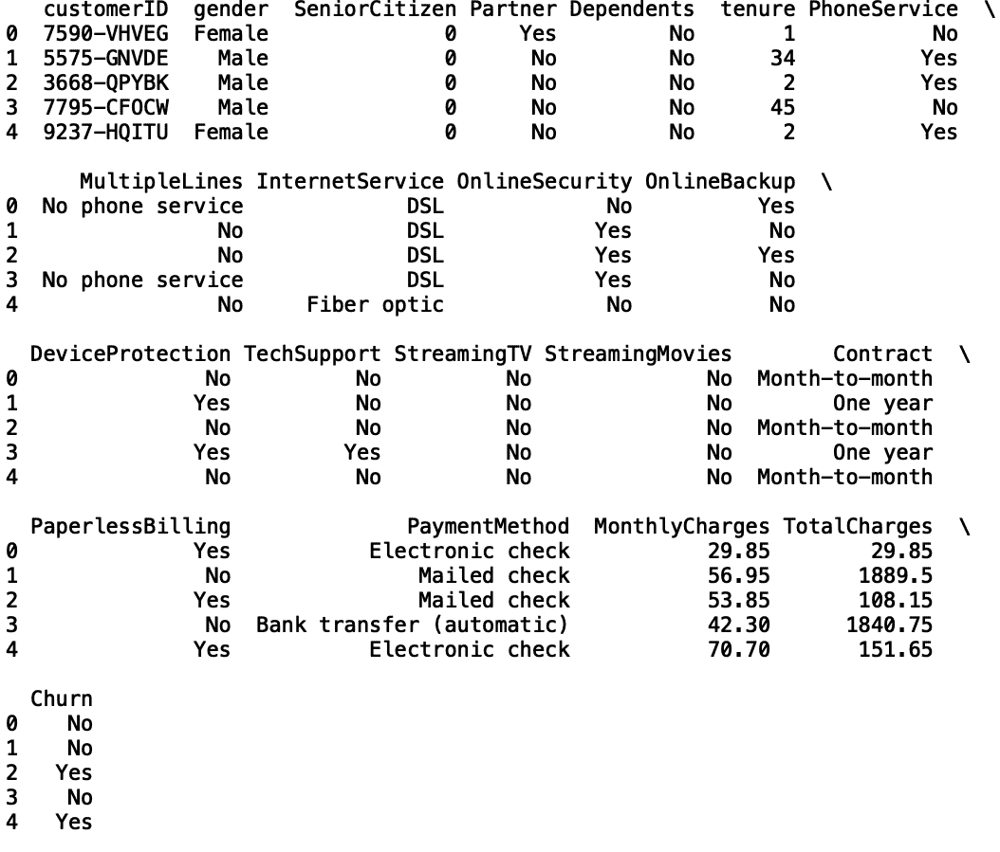

作者图片

四分位数对应于被分成四个区间的数据观察值。具有以下定义:

1.  第一个四分位数(Q1):这相当于第 25 个百分位数。这意味着 25%的数据低于 Q1，75%的数据高于 Q1。
2.  第二个四分位数(Q2):这相当于第 50 个百分位数。这个值也称为中间值。这意味着 50%的数据低于 Q2，50%的数据高于 Q2。
3.  第三个四分位数(Q3):这相当于第 75 个百分位数。这意味着 75%的数据低于 Q2，25%的数据高于 Q2。
4.  第四个四分位数:这只是数据中的最大值。

**用熊猫生成四分位数**

用 Pandas 库计算四分位数很简单。让我们计算整个数据集中以月为单位显示的任期列的四分位数。为此，我们将对 Pandas 数据框对象使用分位数方法。我们将 0.25 作为分位数方法的参数。

```
print("First Quartile (Q1) for Tenure: ", df['tenure'].quantile(0.25))
```

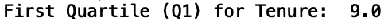

作者图片

我们看到任期的第一个四分位数是 9 个月。这意味着任期的第 25 百分位是 9 个月，也就是说 25%的客户在公司的时间少于 9 个月。让我们计算第二个四分位数。我们通过传入 0.5 作为参数来实现这一点:

```
print("Second Quartile (Q2) for Tenure: ", df['tenure'].quantile(0.50))
```

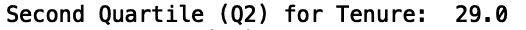

作者图片

我们看到任期的第二个四分位数是 29 个月。这意味着任期的第 50 百分位是 29 个月，也就是说 50%的客户在公司的时间少于 29 个月。

最后，我们来计算第三个四分位数。这里，我们将 0.75 作为分位数方法中的参数:

```
print(“Third Quartile (Q3) for Tenure: “, df[‘tenure’].quantile(0.75))
```

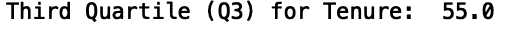

作者图片

在这里，保有权的第三个四分位数是 55 个月。这意味着任期的第 75 百分位是 55 个月，也就是说 75%的客户在公司的时间少于 29 个月。

**利用熊猫生成分位数**

分位数方法的名称是指一个统计量，它是将数据观察值划分为任意数量的区间的一种概括。对于四分位数，我们将数据观察值分为四个区间。但是用同样的方法，我们可以很容易地将数据分成 5 个区间(五分位数)，10 个区间(十分位数)，甚至 100 个区间(百分位数)。如何分割数据观测值的选择取决于应用程序，这就是为什么有一个执行这些分割的通用方法是有用的。

例如，要生成一个十分位数，我们只需将 0.1-0.9 范围内的参数传递给分位数方法。值 0.1 对应于第 10 个百分位数(即 10%的数据观测值低于该值)，0.9 对应于第 90 个百分位数(90%的数据观测值低于该值)。让我们来计算任期中的第 9 个十分位数，也称为第 90 个百分位数:

```
print("Ninth Decile for Tenure: ", df['tenure'].quantile(0.9))
```


作者图片

**四分位数&数据子组的分位数**

为子组生成四分位数也很有用。例如，我们可能想比较使用光纤的客户的任期和使用 DSL 的客户的任期。让我们来计算每个分组的四分位数。首先，让我们在 internet 服务栏中筛选数据帧，为使用 DSL 的客户创建一个数据帧，为使用光纤的客户创建另一个数据帧:

```
df_dsl = df[df['InternetService'] == 'DSL']df_fiberoptic = df[df['InternetService'] == 'Fiber optic']
```

现在，让我们看看 DSL 和光纤的第三个四分位数:

```
print("Third Quartile (Q3) for Tenure — DSL: ", df_dsl['tenure'].quantile(0.75))print("Third Quartile (Q3) for Tenure — Fiber Optic: ", df_fiberoptic['tenure'].quantile(0.75))
```

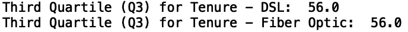

作者图片

我们看到 DSL 和光纤客户的第三季度值是相同的；对于 DSL 和光纤，56 个月的租期大于数据中客户租期值的 75%。

我们还可以看看第九个十分位数:

```
print("Ninth Decile for Tenure — DSL: ", df_dsl['tenure'].quantile(0.9))print("Ninth Decile for Tenure — Fiber Optic: ", df_fiberoptic['tenure'].quantile(0.9))
```

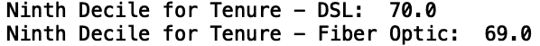

作者图片

在这里，我们可以看到 DSL 和光纤在第九个十分位数上的微小差异。对于 DSL 来说，90%的客户在公司的时间少于 70 个月。就光纤而言，90%的客户在该公司工作不到 69 个月。

由于我们正在处理的数据与客户流失相对应，所以让我们看看那些离开的人和那些留下的人之间是否有任何差异。让我们来看看流失客户和留下来的客户每月的费用有什么不同。让我们为每个组创建过滤数据框:

```
df_churn_yes = df[df['Churn'] == 'Yes']df_churn_no = df[df['Churn'] == 'No']
```

接下来，让我们计算任期的第三个四分位数:

```
print("Third Quartile (Q3) for Tenure — Churn: ", df_churn_yes['tenure'].quantile(0.75))print("Third Quartile (Q3) for Tenure — No Churn: ", df_churn_no["tenure"].quantile(0.75))
```

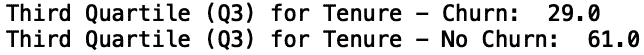

作者图片

国际矿物学会

我们看到，对于那些翻盘的客户，75%的人停留时间少于 29 个月。对于那些留下来的人，75%的人在公司呆了不到 61 个月。这说明了我们已经预料到的情况，即离开的客户比留下的客户对终身职位的价值低得多。

让我们考虑一下每月充电器专栏中流失客户与留下客户的对比:

```
print("Third Quartile (Q3) for Tenure — Churn: ", df_churn_yes['MonthlyCharges'].quantile(0.75))print("Third Quartile (Q3) for Tenure — No Churn: ", df_churn_no['MonthlyCharges'].quantile(0.75))
```

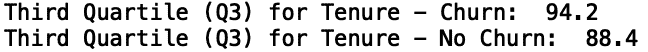

作者图片

在这里，我们看到流失客户的第三季度月费为 94.2 美元，而留下来的客户的第三季度月费为 88.4 美元。由此，我们可以得出结论，75%的流失客户支付的价格低于 94.20 美元，而 75%的留下客户支付的价格低于 88.4 美元。这可能意味着最终离开这项服务的客户被多收了钱。

**用箱线图可视化四分位数**

通常，生成清晰表示感兴趣的统计量的可视化是有用的。直观表示四分位数的一个好方法是通过箱线图。Seaborn Python 可视化库使得生成这些图变得容易。让我们从导入 Matplotlib 和 Seaborn 库开始:

```
import seaborn as snsimport matplotib.pyplot as pltsns.set()
```

让我们针对整个数据集生成一个任期箱线图:

```
sns.boxplot(df['tenure'])plt.show()
```

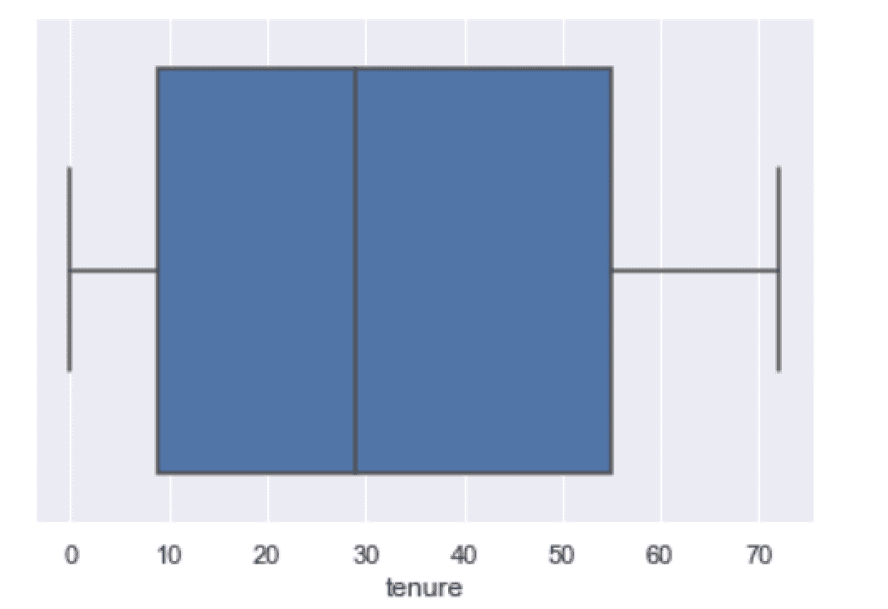

作者图片

可以通过查看蓝框来检查四分位数。蓝框左侧对应第一个四分位数(Q1)，中间的黑线是第二个四分位数(Q2，也称为中位数)，蓝框右侧是第三个四分位数(Q3)。

我们可以做的另一件事是定义一个函数，允许我们跨类别比较四分位数:

```
from collections import Counterdef get_boxplot_of_categories(data_frame, categorical_column, numerical_column, limit): keys = [] for i in    dict(Counter(df[categorical_column].values).most_common(limit)): keys.append(i) df_new = df[df[categorical_column].isin(keys)] sns.boxplot(x = df_new[categorical_column], y = df_new[numerical_column])
```

让我们使用完整的数据框架调用这个函数，将流失列作为分类列，将任期列作为数值列。显示的类别数量限制为五个:

```
get_boxplot_of_categories(df, 'Churn', 'tenure', 5)
```

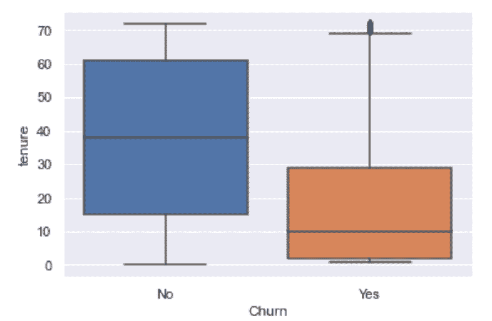

作者图片

我们发现，Q1 和第三季度留下来的客户的保有价值高于流失的客户，这是我们所预期的。让我们生成每月费用和流失率的图表:

```
get_boxplot_of_categories(df, 'Churn', 'MonthlyCharges', 5)
```

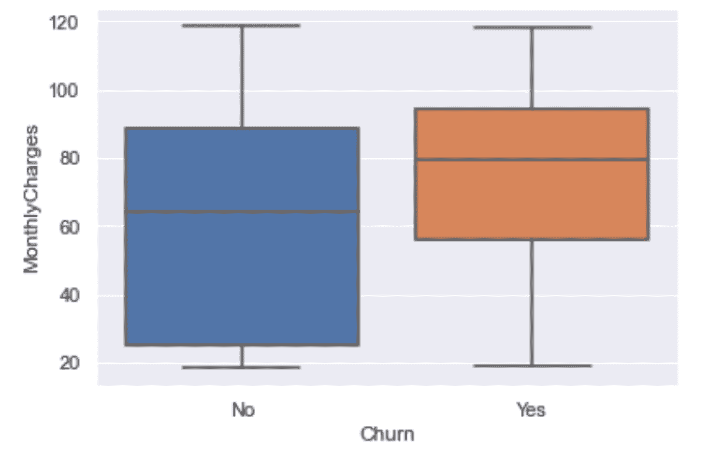

作者图片

我们看到，Q1，Q2 和第三季度的月费值，对于那些留下来的比那些流失。我们也预料到这一点，因为正如我们前面看到的，留在公司的客户通常比离开公司的客户每月支付的费用少。

这篇文章中的代码可以在 [GitHub](https://github.com/spierre91/builtiin/blob/main/quartiles_tutorial.py) 上找到。

**结论**

四分位数和分位数对于比较数据中的组非常有用。在数据观察中，不同的组和类别之间的值的分布会有很大的不同。了解数据中的数值如何在组内分布可以帮助数据科学家和分析师了解客户人口统计的差异。这种分析可以帮助公司识别更有可能继续购买服务或产品的高价值客户。公司可以利用这些信息继续锁定高价值客户，同时通过交易和促销锁定临时或不经常购买的客户。公司可以使用这种技术来开发强大的客户保持计划。

如果你有兴趣学习 python 编程的基础知识、Pandas 的数据操作以及 python 中的机器学习，请查看[*Python for Data Science and Machine Learning:Python 编程、Pandas 和 sci kit-初学者学习教程*](https://www.amazon.com/dp/B08N38XW2Q/ref=sr_1_1?dchild=1&keywords=sadrach+python&qid=1604966500&s=books&sr=1-1) *。我希望你觉得这篇文章有用/有趣。*

***本帖原载于*** [***内置博客***](https://builtin.com/data-science/) ***。原片可以在这里找到***<https://builtin.com/data-science/how-to-calculate-quartiles>****。****