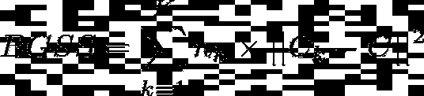
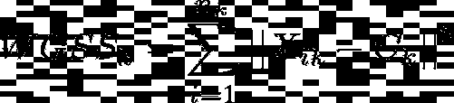
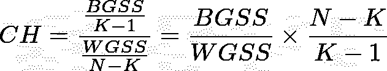
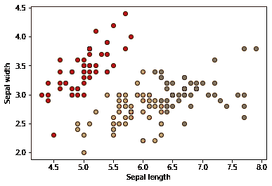
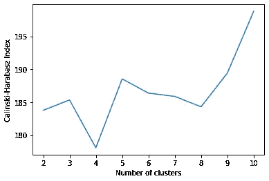

# 使用 Python 评估 K-均值聚类的 Calinski-Harabasz 指数

> 原文：<https://towardsdatascience.com/calinski-harabasz-index-for-k-means-clustering-evaluation-using-python-4fefeeb2988e>

## 在本教程中，我们将探索 Calinski-Harabasz 索引及其在 Python 中 K-Means 聚类评估中的应用。


梅尔·普尔在 [Unsplash](https://unsplash.com/s/photos/cluster?utm_source=unsplash&utm_medium=referral&utm_content=creditCopyText) 上的照片

**目录**

*   介绍
*   卡林斯基-哈拉巴斯指数解释
*   Python 中的 Calinski-Harabasz 索引示例
*   结论

# 介绍

卡林斯基-哈拉巴斯指数(CH)是聚类算法评价指标之一。它最常用于通过 K-Means 聚类算法对给定数量的聚类评估分割的良好性。

我们之前讨论过 [Davies-Bouldin 指数](https://pyshark.com/davies-bouldin-index-for-k-means-clustering-evaluation-in-python/)和 [Dunn 指数](https://pyshark.com/dunn-index-for-k-means-clustering-evaluation-using-python/)，Calinski-Harabasz 指数是另一种评估聚类性能的指标。

## 什么是卡林斯基-哈拉巴斯指数？

Calinski-Harabasz 指数(也称为方差比标准)计算为所有聚类的聚类间离差之和与聚类内离差之和的比值(其中离差是距离的平方和)。

## 如何解读卡林斯基-哈拉巴斯指数？

高 CH 意味着更好的聚类，因为每个聚类中的观测值更接近(更密集)，而聚类本身彼此更远(分离得更好)。

在下一节中，将通过几个例子详细描述计算 CH 的过程。

为了继续学习本教程，我们需要以下 Python 库:sklearn 和 matplotlib。

如果您没有安装它，请打开“命令提示符”(在 Windows 上)并使用以下代码安装它:

```
pip install sklearn
pip install matplotlib
```

# 卡林斯基-哈拉巴斯指数解释

在这一部分中，我们将介绍计算的每一步，并提供有意义的示例来帮助更好地理解公式。

## 步骤 1:计算群集间离差

第一步是计算组间离差或组间平方和(BGSS)。

CH 中的类间离差测量类的质心和整个数据集的质心(重心)之间的距离平方的加权和。

组间平方和的计算方法如下:



作者图片

其中:

*   **n_k** :簇 *k* 中的观测数
*   **C_k** :簇的质心 *k*
*   **C** :数据集的质心(重心)
*   **K** :集群的数量

## 步骤 2:计算组内离差

第二步是计算组内离差或组内平方和(WGSS)。

CH 中的类内离差测量每个观察值与同一类的质心之间的平方距离之和。

对于每个集群 *k* ，我们将 WGSS_k 计算如下:



作者图片

其中:

*   **n_k** :簇 *k* 中的观测值个数
*   **X_{ik}** :星团 *k* 的第(I)次观测
*   **C_k** :簇的质心 *k*

然后对组内所有个体平方和求和:


作者图片

其中:

*   **WGSS_k** :聚类 *k* 的组内平方和
*   **K** :集群的数量

## 步骤 3:计算卡林斯基-哈拉巴斯指数

卡林斯基-哈拉巴斯指数被定义为所有聚类的聚类间离差之和以及聚类内离差之和。

卡林斯基-哈拉巴斯指数计算如下:



作者图片

其中:

*   **BGSS** :组间平方和(组间离差)
*   **WGSS** :组内平方和(组内离差)
*   **N** :观察总数
*   **K** :集群总数

从上面的公式中，我们可以得出结论，Calinski-Harabasz 指数的大值代表更好的聚类。

# Python 中的 Calinski-Harabasz 索引示例

在这一节中，我们将通过一个例子来计算 Python 中 K-Means 聚类算法的 Calinski-Harabasz 指数。

首先，导入所需的依赖项:

您可以通过下面的代码使用任何数据。为了简单起见，我们将使用内置的虹膜数据集，特别是前两个特征:*【萼片宽度】*和*【萼片长度】*:

让我们从 3 个集群的 K 均值目标开始:

并检查 Calinski-Harabasz 指数以获得上述结果:

你应该得到结果分数: **185.33266845949427** 或者大概( **185.33** )。

为了更好地理解集群的外观，让我们将它们形象化:

我们应该会看到以下 3 个原始集群:



作者图片

因为我们计算了 3 个聚类的 CH 指数，并且原始数据具有 3 个标签，所以我们假设 3 个聚类的 CH 指数比任何其他数量的聚类的 CH 指数都高。

让我们计算一系列集群的 CH 指数，然后找出最高值:

想象一下:



我们发现一个有趣的结果，5 个聚类和 10 个聚类提供了比 3 个聚类更高的 Calinski-Harabasz 指数值(即使数据中标签的实际数量是 3)。

即使我们可以获得除 3 以外的更高的 CH 指数值，我们也可以观察到指数值仍然在 175 和 200 之间的非常接近的范围内。

# 结论

在本文中，我们讨论了如何使用 sklearn 库在 Python 中计算用于聚类评估的 Calinski-Harabasz 指数。

如果你有任何问题或者对编辑有任何建议，欢迎在下面留下评论，并查看我的更多 [Python 编程](https://pyshark.com/category/python-programming/)文章。

*原载于 2022 年 3 月 15 日*[*【https://pyshark.com】*](https://pyshark.com/calinski-harabasz-index-for-k-means-clustering-evaluation-using-python/)*。*