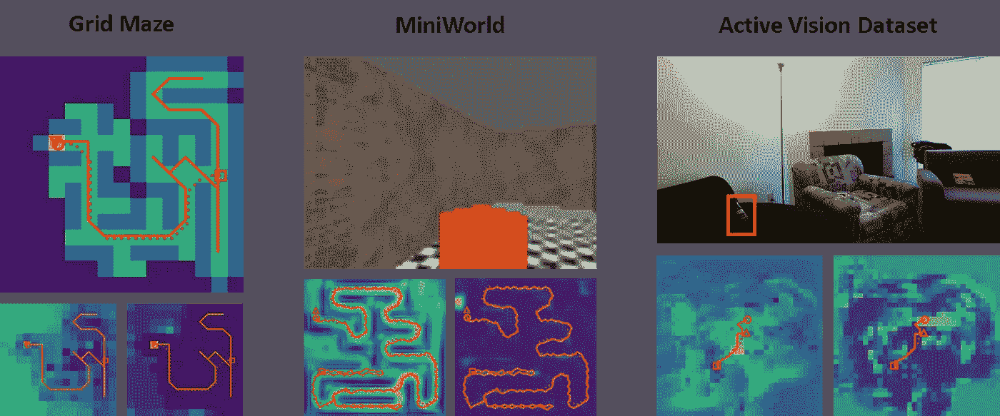
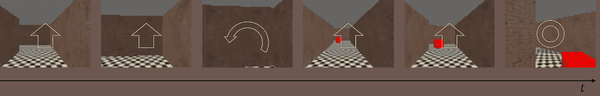
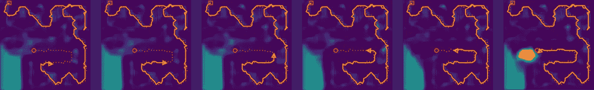
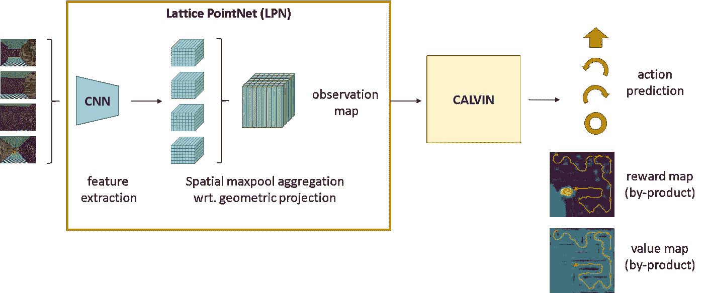
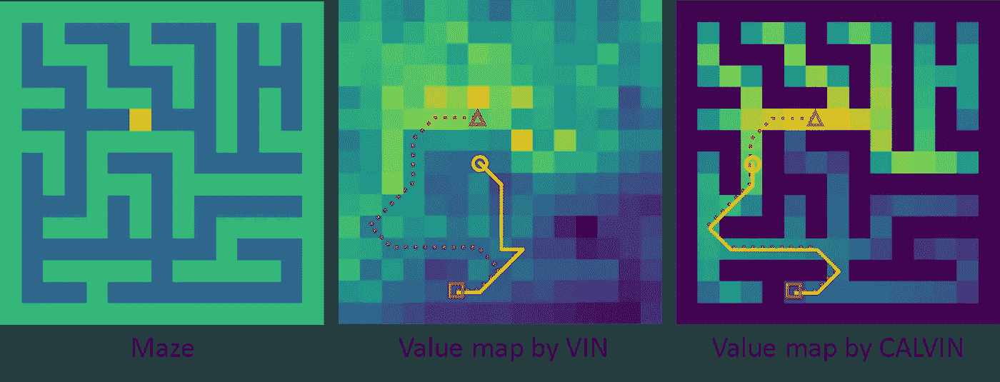
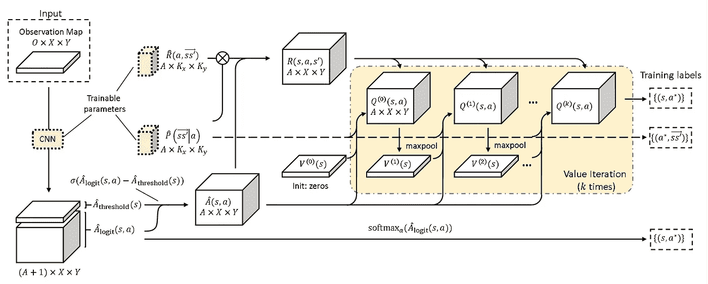

# 卡尔文——一个可以学习规划和导航未知环境的神经网络

> 原文：<https://towardsdatascience.com/calvin-a-neural-network-that-can-learn-to-plan-and-navigate-unknown-environments-820a8444276f>

## 碰撞避免长期价值迭代网络

**总结:** CALVIN 是一个神经网络，可以在新奇的 3D 环境中进行规划、探索和导航。它通过学习专家的示范来学习诸如解迷宫之类的任务。我们的工作建立在值迭代网络(VIN) [1]，一种递归卷积神经网络。虽然 VIN 只在完全已知的环境中工作良好，但 CALVIN 甚至可以在*未知的*环境中工作，在这种环境中，代理必须探索环境以找到目标。

卡尔文测试的三个环境(图片由作者提供)

在这篇文章中，我想对我最近在 CVPR 2022(计算机视觉和模式识别会议)上发表的一篇论文做一个高层次的概述。这项研究的动机是提出一个更健壮的神经网络架构，它可以 ***学习规划*** ，这是受价值迭代网络工作的启发[1]。

<https://arxiv.org/abs/2108.05713>  

**代号:**https://github.com/shuishida/calvin

# 问题是

我们要解决的问题是演示中的视觉导航。给定固定数量的 RGB-D 图像的专家轨迹和所采取的动作，机器人代理必须学会如何导航。虽然使用定义障碍和目标的自上而下的地图进行规划很容易，但如果代理必须从 RGB-D 图像中了解障碍和目标的性质，则更具挑战性。

代理视为专家演示的一系列图像和动作(作者提供的图像)

航海的另一个重要方面是探索。我们的代理开始时对新环境没有任何了解，因此它必须在导航时构建环境地图，并学习探索最有可能通向目标的区域。

代理学会预测最能解释专家演示的奖励(图片由作者提供)

为了使代理能够在未经训练的环境中导航，它必须学习一些适用于所有环境的一般知识。特别是，我们专注于学习一个共享的过渡模型和奖励模型，它可以最好地解释专家演示，然后可以应用到新的设置。

代理学习可在所有环境中重复使用的运动动力学(图片由作者提供)

# 模型概述

我们的模型由两部分组成——一个学习映射组件，我们称之为格点网，它将过去的观察聚合到嵌入的地面投影图中，以及 CALVIN，它是一个可微分的规划器，对价值迭代进行建模。与强化学习中更常见的方法不同，在强化学习中，代理看到图像并试图反应性地预测最佳行动，通过由格点网学习适当的空间表示并使用 CALVIN 作为规划网络，我们的代理能够以空间上有意义的方式探索和导航考虑到过去的观察。

模型架构概述(图片由作者提供)

CALVIN 是值迭代网络(简称 VIN)的改进版本，它使用递归卷积作为空间任务的值迭代形式。它学习一个奖励图和一个卷积核，按照值迭代更新方程应用，产生一个 Q 值图，这是对代理可以获得的未来奖励的估计。一旦计算出价值图，代理就可以采取产生最高价值的行动来最大化其机会。

虽然 VIN 是一个简单的架构，但它有几个缺陷，最明显的是它在实践中没有严格地学习价值迭代。正如您在下图中看到的，VIN 生成的价值图不是我们从价值迭代中所期望的，而我们的模型 CALVIN 学习生成一个与理论解决方案几乎相同的价值图。我们发现不匹配是因为 VIN 没有足够的约束来惩罚障碍，因此做出了次优的决定，例如反复探索死胡同。

VIN 和 CALVIN 生成的价值图的比较。VIN 产生不可解释的、脆弱的价值图。(图片由作者提供)

卡尔文，另一方面，明确学习有效和无效的过渡。它将转换模型分解为共享代理运动模型和动作可用性模型。CALVIN 使用动作可用性模型来惩罚无效的动作，并防止值从不可到达的状态传播。除了对可用动作的这些约束，我们还改进了训练损失，以便模型可以在整个轨迹上利用训练信号，而不仅仅是当前状态。

卡尔文模型图(图片由作者提供)

# 实验

我们在三个领域进行了实验，特别是探索新的未知环境:网格迷宫环境、迷你世界[2]和主动视觉数据集[3]。卡尔文实现了更强大的导航，即使在未知的环境中，展示了探索行为，这是 VIN 所缺乏的。

在我们的网格迷宫设置中，代理只能在本地查看迷宫。代理可以选择向前移动、向左、向右旋转或触发完成。我们可以看到，代理人预测代理人尚未探索的地方会有更高的价值，当代理人看到目标位置时会有更高的奖励。

卡尔文在网格迷宫环境中

接下来，我们在一个名为 MiniWorld 的 3D 迷宫环境中进行了一个类似的实验，但这一次使用的是从代理的角度而不是从上往下看的 RGB-D 图像序列。当代理导航时，它用点阵点网建立一个嵌入图，然后输入 CALVIN。在这里，代理也已经学会将较低的值分配给墙壁，将较高的值分配给未探索的位置。我们可以观察到代理在遇到死胡同时设法返回，并重新规划到其他未探索的单元。当代理看到目标时，它会给目标附近的细胞分配较高的奖励。

迷你世界中的卡尔文

最后，我们使用主动视觉数据集测试了该代理，该数据集是由机器人平台获得的真实世界图像的集合，从中我们可以创建轨迹。对于这个任务，我们使用预先训练的 ResNet 嵌入，并把它们输入到网格点网中。这位特工被训练如何在房间里找到一个汽水瓶。

活动视觉数据集环境中的卡尔文

# 结论

与其他差异化规划师相比，卡尔文能够更稳健地探索和导航未知环境。VIN 的这种改进来自于明确模拟动作可用性，用于惩罚无效动作，以及使用轨迹重新加权改进训练损失。我们还引入了一个格点网主干，以空间一致的方式有效地融合了过去的观测结果。

# 参考

[1] Tamar 等人，“[价值迭代网络](https://arxiv.org/abs/1602.02867)”，NeurIPS 2016。

[2] M. Chevalier-Boisvert，【https://github.com/maximecb/gym-miniworld, 2018。

[3] Ammirato 等人.“[用于开发和基准化主动视觉的数据集](https://arxiv.org/abs/1702.08272)”，ICRA，2017 年。