# Python 中的摄像机标定示例

> 原文：<https://towardsdatascience.com/camera-calibration-with-example-in-python-5147e945cdeb>

# Python 中的摄像机标定示例

## Python 中图像形成和相机校准综合教程系列的第 5 部分


# 介绍

相机校准的基本思想是，给定世界上的一组已知点及其在图像中的相应投影，我们必须找到负责投影变换的相机矩阵。然后我们可以用这个矩阵把世界上的任何一点投射到图像上。我们将在本文中看到如何执行相机校准。

在此之前，让我们回顾一下相机的外部和内部。

# 回顾

## 相机外部矩阵

[在](/camera-extrinsic-matrix-with-example-in-python-cfe80acab8dd)系列的第 2 部分中，我们看到摄像机外部矩阵是一个基矩阵的变化，它将一个点的坐标从世界坐标系转换到摄像机坐标系。它让我们从摄像机的角度来看这个世界。我们还看到它是旋转矩阵和平移矩阵的组合，旋转矩阵确定摄像机的方向，平移矩阵移动摄像机。因此，给定世界上一个点的坐标，我们可以应用相机外部矩阵来改变它在相机上的坐标，如下所示:

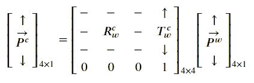

这里的符号如下:


这里，点被表示为齐次坐标，这实质上是在原始坐标上增加了一个额外的维度。

相机外部矩阵的最后一行只是 0 和 1，它们不会给变换增加任何值，因此我们可以安全地删除最后一行，并将等式重写为:


请注意，这里的输出形状是 3×1，而以前是 4×1。这意味着这个点在这里用欧几里得形式表示，这是一件好事，因为我们不需要额外的步骤来从齐次坐标转换回来；此外，管道中的下一个相机固有矩阵接受 3×1 的输入形状，我们将在接下来看到。

总之，给定世界坐标系中点的坐标，相机外部矩阵将坐标转换到相机坐标系。该转换可以表示为:

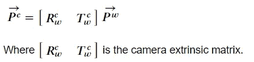

## 相机固有矩阵

现在我们已经使用相机外部矩阵获得了相机上某个点的坐标，下一步是将该点投影到相机的图像平面上并形成图像。这是相机固有矩阵的工作。在[系列的第 3 部分](/camera-intrinsic-matrix-with-example-in-python-d79bf2478c12)中已经深入讨论了摄像机固有矩阵，但是概括来说，摄像机固有矩阵将摄像机给定坐标的点投影到摄像机的图像平面上。本质上，我们可以使用相机固有矩阵来获得图像中的点的像素位置。如下所示:


这些符号是:


输出将是均匀形式的投影。要将其转换为欧几里得形式，我们只需除以最后一个坐标并丢弃最后一个维度，如下所示:


这里 *(u，v)* 是点 *P* 在图像中的像素位置。相机固有矩阵由𝜅表示，并且该变换可以表示为:

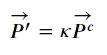

# 结合相机的外在和内在

结合相机内矩阵和外矩阵，我们可以建立一个管道，该管道以世界坐标系中的一个点作为输入，并计算它在相机形成的图像上的投影。它可以表示为:


此外，使用矩阵组合，我们可以将两个矩阵组合成一个矩阵 *M* ，如下所示:

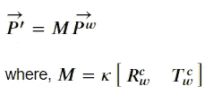

这个形状为 3×4 的矩阵 *M* 具有所有需要的信息。

## 把所有的放在一起

使用矩阵 *M* ，我们可以将整个管道表示为:

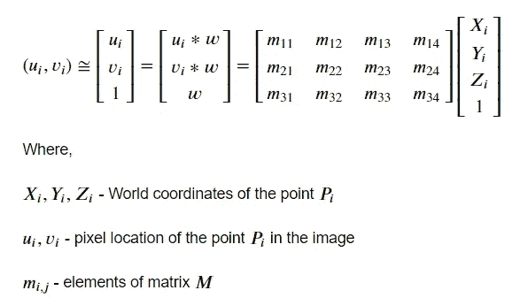

如果你观察，矩阵 *M* 有 12 个元素，但是我们在以前的文章中看到，内在矩阵和外在矩阵有 11 个自由度(6 个来自外在矩阵，5 个来自内在矩阵)。所以在 *M* 中有一个元素依赖于其他元素。

让我们假设最后一个元素 *M(3，4)* 是依赖元素。这意味着如果我们用这个元素来划分矩阵 *M* ，那么 *M* 内部的信息不会受到影响，因为它是一个依赖元素。

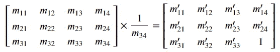

上式中，我们将矩阵 *M* 除以最后一个元素 *M(3，4)* 得到一个新的矩阵。这里需要注意的重要一点是，不管操作如何，两种情况下的输出或投影都是相同的。矩阵 *M* 的这一特性被称为*比例不变性*，意味着我们可以通过任何因子来缩放矩阵 *M* ，并且不会影响输出。

通常在现实应用中，矩阵 *M* 是未知的，摄像机标定的目标是利用一组已知点及其投影找到它。

# 几何摄像机校准


我们可以从上面的矩阵乘法中找到图像坐标 *(ui，vi)* 为:

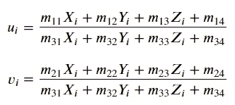

我们可以将这个等式改写为:

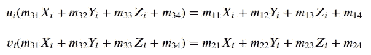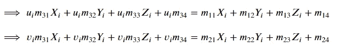

我们可以进一步简化为:

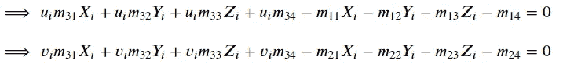

如果你观察，上面的方程看起来就像是⃗中的齐次线性方程组，通常具有以下形式:

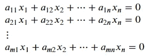

现在，一个齐次线性方程组可以用矩阵形式表示为*a*𝑥⃗*= 0*⃗*其中 *A* 是一个 *m* × *n* 矩阵，𝑥⃗是一个有 *n* 个元素的列向量， *0* ⃗是一个有 *m* 个元素的零向量。*

*所以现在我们可以用矩阵的形式来表示我们的方程，比如:我是⃗*

*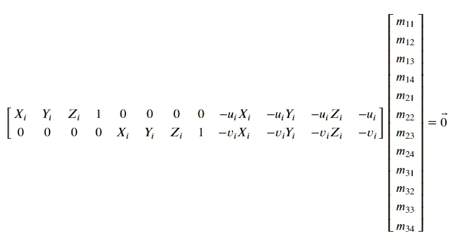*

*上午 ⃗ *= 0* ⃗*

*上式表示 *Am* ⃗ *= 0* ⃗ *。*这里的 *m* ⃗是向量形式的展平矩阵 *M* 。记住，我们的目标是求矩阵 *M* 的系数，这和解这个齐次系统是一样的。现在，每个齐次系统至少有一个解，称为零解，它是通过给每个元素赋值 0 而得到的。但这不是我们想要的解决方案。那么，如何才能找到这个齐次系统的非零解呢？*

*好吧，我们可以找到一个*近似*解，而不是找到一个精确解，我们甚至不确定它是否存在。*

*从数学上来说，这意味着我们可以找到, *m* 使得, *|Am* ⃗ *|* 成为最小值，而不是找到精确解。本质上，我们试图最小化这里的*代数误差*。*

*此外，我们可以归一化⃗，使它成为一个单位向量。记住，矩阵 *M* 是比例不变的，我们可以选择与幅度相等的比例因子来归一化它。同样， *m* ⃗只是矢量形式的展平 *M* 。*

*所以，现在我们的问题是以 *|m* ⃗ *|=* 1 为条件，求 *|Am* ⃗ *|* 的最小值。在[系列的第 4 部分](/find-the-minimum-stretching-direction-of-positive-definite-matrices-79c2a3b397fc)中，我们看到如果单位向量𝑥⃗沿着𝐴⊺𝐴.的最小特征向量，|𝐴𝑥⃗|将是最小的*

*我们先来看矩阵 *A* :*

*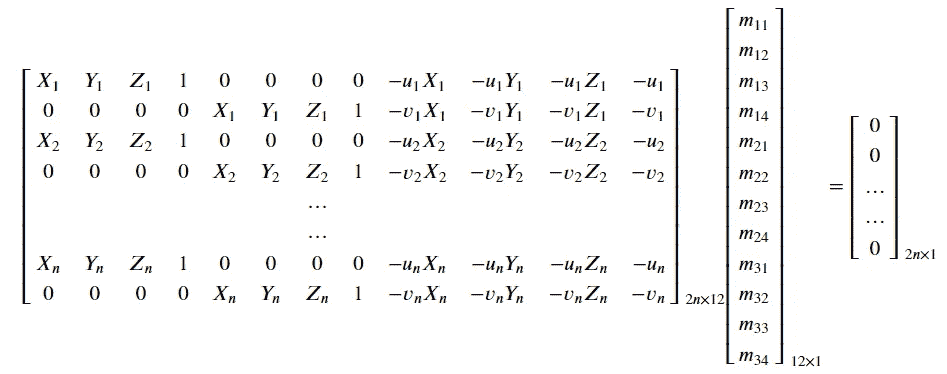*

*其思想是，我们将在由 *(Xi，易，子)，*表示的世界中找到一些点，并在由 *(ui，vi)，*表示的图像中找到它们对应的投影，然后我们可以计算矩阵*a。*这个标记过程将手动完成。现在，如果我们标记 n 个点，矩阵 a 的形状将会是 2n×12，而⃗的形状将会保持在 12×1。零矢量的形状是 2n×1。*

*这里有个问题给你:求解上面的齐次系统，我们需要标注多少个点？⃗的大小是 12，这意味着有 12 个未知数，所以我们需要求解 12 个独立的方程来找到这 12 个未知数。所以我们要求 *n* 至少为*6，这意味着我们应该标记至少 6 个*独立的*点来求解 *m* ⃗。我们也可以标记更多的点，一般来说，点越多越好；但是 6 是最小的。这里重音在单词 independent 上，意思是没有三个点应该是共线的。**

## *把所有的放在一起*

*好的，计划是标记至少 6 个点并计算矩阵 *A.* 然后我们可以计算𝐴⊺𝐴和 *m* ⃗将是它的具有最小特征值的特征向量。最后，我们可以将向量 *m* ⃗整形回 3×4 矩阵 *M* ，这将是我们校准的相机矩阵。使用 *M，*我们可以找到图像中任何世界点的投影。*

*让我们通过一个例子来看看这一点。*

# *例子*

## *安装*

*包含所有代码的 GitHub 库可以在这里找到。*

*假设您之前没有设置环境，现在可以通过运行以下命令来设置环境:*

```
*# create a virtual environment in anaconda
conda create -n camera-calibration-python python=3.6 anaconda
conda activate camera-calibration-python# clone the repository and install dependencies
git clone https://github.com/wingedrasengan927/Image-formation-and-camera-calibration.git
cd Image-formation-and-camera-calibration
pip install -r requirements.txt*
```

*注意:这里假设你已经安装了 anaconda。*

*我们将使用两个主要的库:*

*   *[**pytransform 3d:**](https://github.com/rock-learning/pytransform3d)该库具有强大的 3D 空间可视化和变换功能。*
*   *[**ipympl:**](https://github.com/matplotlib/ipympl)**这是一个游戏规则改变者。它使 matplotlib 绘图具有交互性，允许我们在笔记本中实时执行平移、缩放和旋转，这在处理 3D 绘图时很有帮助。***

## ***直觉例子***

***要执行相机校准，我们首先需要准备地面实况，它本质上是世界上的一组点及其在图像上的对应投影。在现实世界中，我们手动测量点与相机的距离，并在图像中找到它们对应的像素。然而，在计算机上，我们可以模拟这个过程——我们可以创建一个相机外部矩阵和内部矩阵，并建立一个管道来计算世界点的投影。我们已经在本系列的第二部分和第三部分的[中看到了如何创建矩阵。一旦有了地面真值，就可以用它来构造代数矩阵 *A* ，然后找它的转置，计算𝐴⊺𝐴，最后取特征值最小的𝐴⊺𝐴的特征向量，重新整形，得到标定后的相机矩阵 *M* 。](https://medium.com/p/cfe80acab8dd/edit)***

***下面是 Jupyter 笔记本的代码:***

***代码就是我们上面讨论的数学方程。让我们一步一步地浏览笔记本，了解发生了什么:***

*   ***首先，我们定义必要的参数，并创建相机的外部矩阵和内部矩阵。这些是建造管道和准备地面真相所必需的。然后我们在世界上生成 *n* 个随机点(这里我选择了 n=12)。这是我们的世界空间的一个图，有相机和随机点。由于 ipympl，Jupyter 笔记本中的情节是交互式的。***

***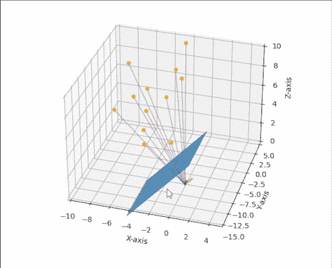***

***设置***

*   ***我们可以计算这些点的投影并形成一幅图像。首先，我们必须应用外部矩阵来表示相机坐标系中的点，然后我们可以应用内部矩阵来获得投影，最后，我们可以在图像中绘制这些投影，如下所示。***

***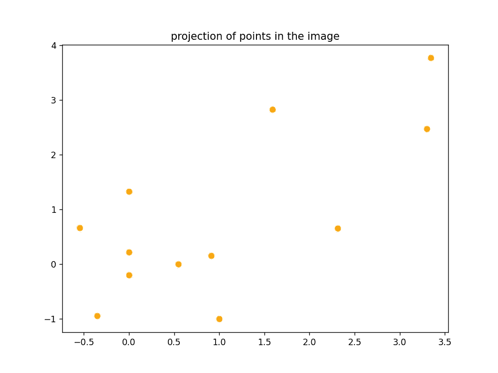***

***图像中 n 个点的投影***

*   ***现在我们已经准备好了地面真相，它本质上是世界上的点 *(Xi，易，子)*和它们在图像中对应的投影 *(ui，vi)。使用它们我们可以计算代数矩阵*A。*这是矩阵 *A* 如果你记得:****

***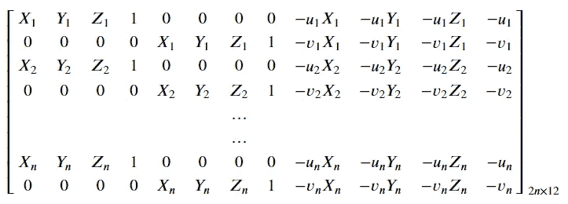***

***代数矩阵 A***

*   ***在计算完矩阵 *A* 之后，我们可以计算𝐴⊺𝐴，并选择其具有最小特征值的特征向量。这将为我们提供大小为 12 的矢量⃗。最后，我们可以将⃗整形为 3×4，从而得到我们要寻找的校准后的矩阵。***
*   ***我们可以直接使用矩阵 M 来计算世界点在图像上的投影。它有所有必要的信息。让我们将矩阵 *M* 应用到我们生成的 *n* 个随机点上；这样，我们可以将来自校准矩阵 *M* 的投影与地面实况进行比较。下图显示了比较。***

***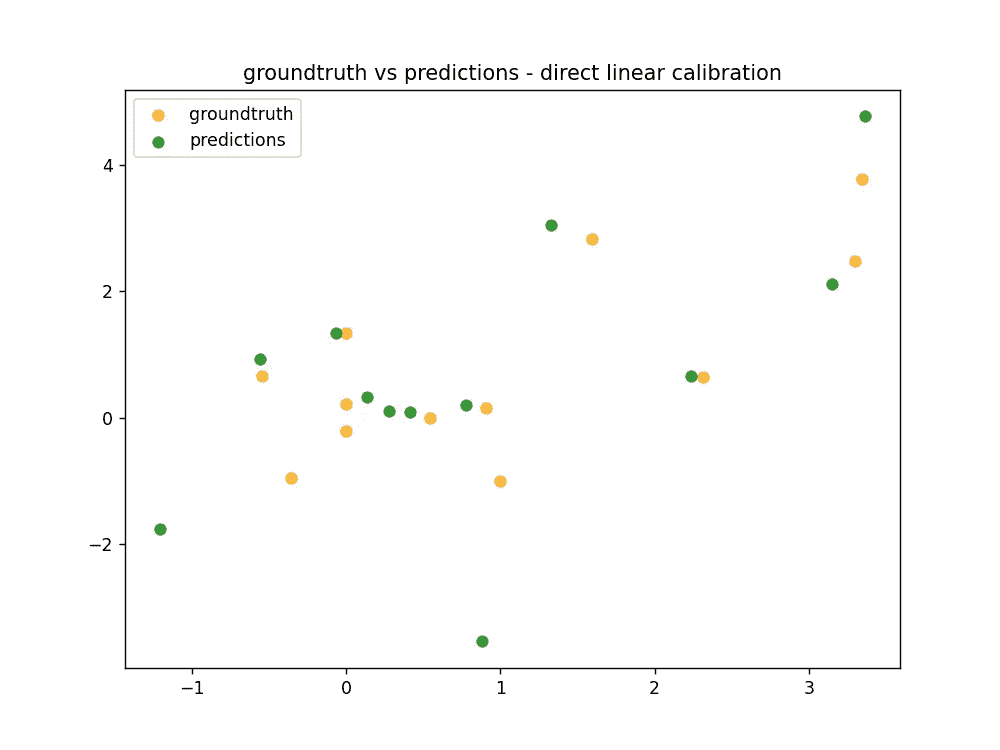***

***事实与预测***

*   ***嗯……从我们校准过的矩阵 *M —* 得到的预测让我们称之为预测 *—* 并不十分准确。有些观点接近事实，有些则相去甚远，但总体来说并不好。在下一部分，我们将讨论可能会发生什么，以及我们可以做些什么来改进。***

***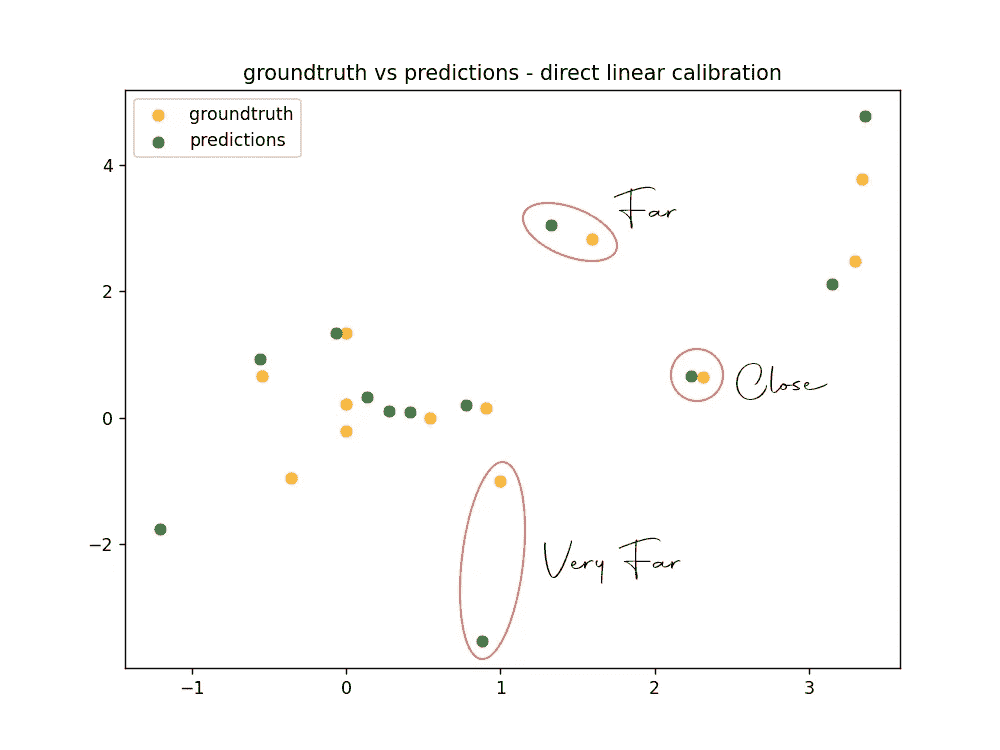***

***该图描述了预测与实际情况的对比***

# ***几何误差***

***我们上面讨论的方法称为直接线性校准。它不是很好的一个原因是因为我们试图最小化代数误差——我们本质上是试图找到 m⃗的值，它正好符合代数方程:*am :*⃗:*= 0 ;*⃗;*。*这种线性优化的问题是，当非线性误差和不确定性(如径向失真)悄悄进入相机时，这在现实世界中经常发生，该算法将严重失败。我们应该针对正确的错误类型进行优化。***

***我们应该关注的误差叫做几何误差。几何误差本质上给出了预测与地面真实情况的距离的估计。这是通过测量点的预测投影与其地面真实投影之间的距离来实现的。当我们最小化几何误差时，我们实质上是最小化了预测和事实之间的距离。***

***几何误差由以下公式给出:***

***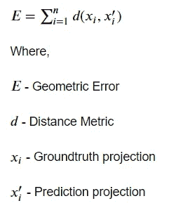***

***这里 *d* 是距离度量，我们通常用欧几里德距离。在我们的例子中，预测𝑥′𝑖由 *MXi* 给出，其中 *M* 是我们校准的摄像机矩阵， *Xi* 是世界坐标系中的一个点。因此，我们可以将等式改写为:***

***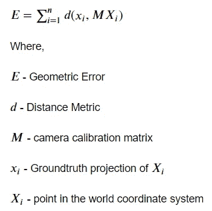******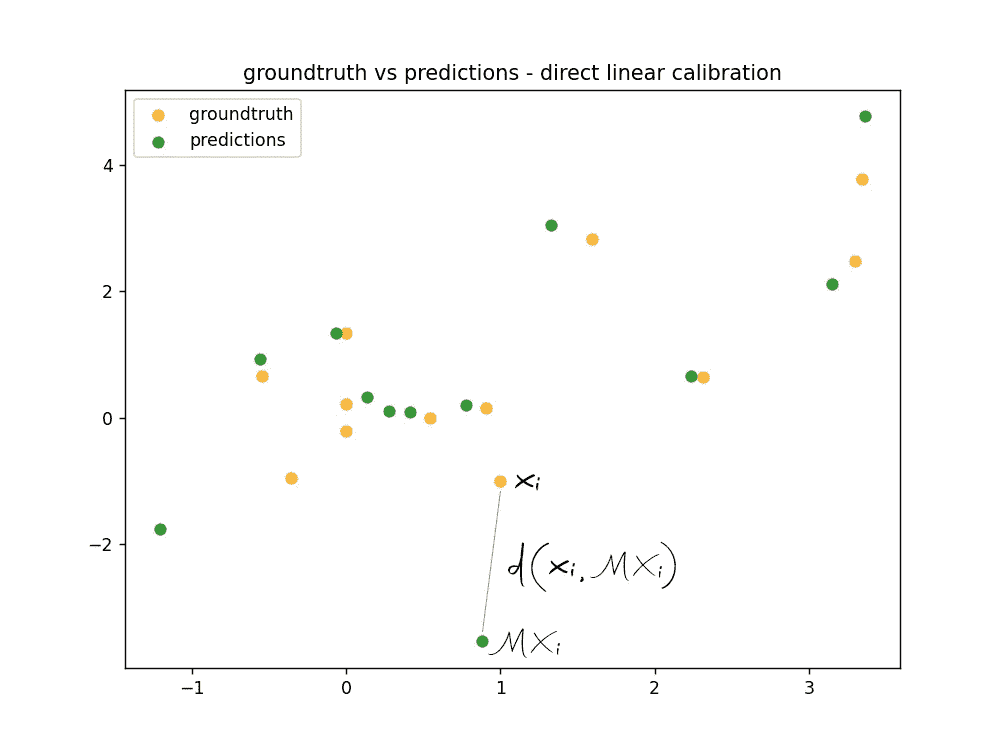***

***几何误差***

***好的，这个想法是执行某种非线性优化，并更新矩阵 *M* 的权重，以最小化几何误差。这种方法直观上类似于机器学习，其中我们使用梯度下降算法来更新模型，以最小化损失。幸运的是，我们不需要自己编写优化算法。`scipy`在`scipy.optimize`模块中提供了几十种优化算法。***

***让我们看看如何用代码实现:***

***在上面的代码中，首先我们定义几何误差函数。该函数将向量 *m* ⃗和地面真相作为参数，地面真相是世界点及其在图像中的相应投影的集合。它使用我们上面讨论的公式计算预测值:***

******

***最后，我们计算所有点上的预测投影和实际投影之间的欧几里德距离，并计算几何误差。***

***来自模块`scipy.optimize`的函数`minimize`接受两个重要参数——误差函数和初始权重。我们可以将上面定义的`geometric_error`函数作为第一个参数传递，作为第二个参数，我们可以传递任何 12 维向量作为初始状态——然而，由于我们已经通过直接线性校准方法计算了 *m* ⃗的值，我们可以将其作为初始状态传递，而不是某个随机向量。作为第三个参数，我们可以传递一个包含 error 函数参数的元组。***

***在我们执行`minimize`函数之后，它运行并完成优化过程，并返回一个包含结果的对象。我们可以通过`x`属性从这个对象访问最终更新的权重。然后，我们可以将这个 12 维权重向量整形为 3×4 矩阵，并计算预测值。下图比较了我们通过这种方法得到的预测和地面真实预测:***

***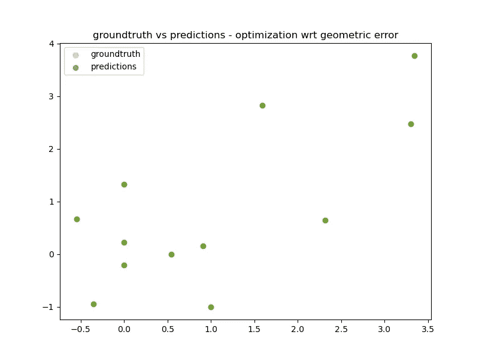***

***事实与预测——它们重叠了！***

***正如我们所看到的，预测和事实是重叠的！这意味着我们已经准确地校准了摄像机矩阵。从上图中很难看出重叠部分，所以在下图中我把它们分开了:***

***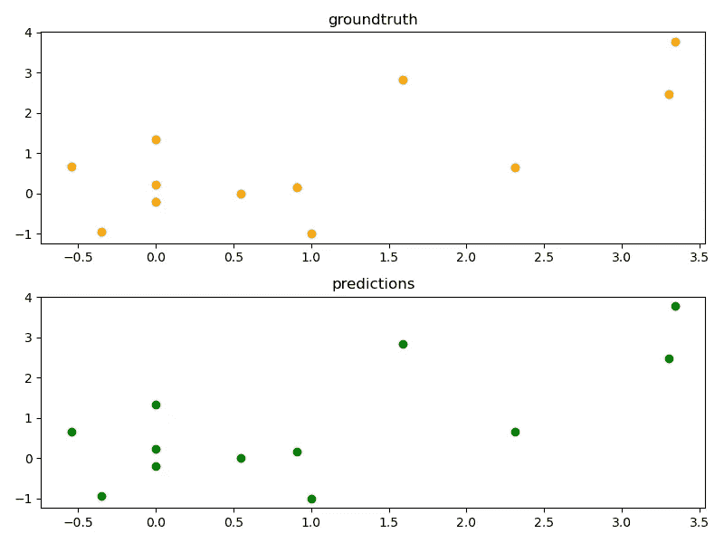***

***这种方法的另一个优点是，即使投影变换是非线性的，它也可以对摄像机建模。这发生在现实世界中，因为我们不使用针孔相机，误差和不确定性，如径向失真蠕变。***

# ***摄像机校准算法***

***将所有这些放在一起，相机校准算法包括两个主要步骤:第一步是使用直接线性校准方法计算向量 *m* ⃗，第二步是通过将 *m* ⃗作为初始状态并使用非线性优化更新其权重来最小化预测和地面真实之间的几何误差。***

# ***结论***

***我希望你喜欢这篇文章和整个系列。如果你有任何疑问或问题，请在下面的评论中告诉我。你也可以通过 [LinkedIn](https://www.linkedin.com/in/neerajkrishnadev/) 和 [Twitter](https://twitter.com/WingedRasengan) 联系我。我打算发表更多关于计算机视觉和 3D 计算机视觉的文章，我们来连线。***

# ***参考***

1.  ***[计算机视觉介绍— Udacity](https://classroom.udacity.com/courses/ud810)***

# ***图像制作者名单***

***本文中的所有图片和数字，除非在标题中明确提及其来源，否则均由作者提供。***