# 相机固有矩阵及 Python 中的示例

> 原文：<https://towardsdatascience.com/camera-intrinsic-matrix-with-example-in-python-d79bf2478c12>

# 相机固有矩阵及 Python 中的示例

## Python 中图像形成和相机校准综合教程系列的第 3 部分

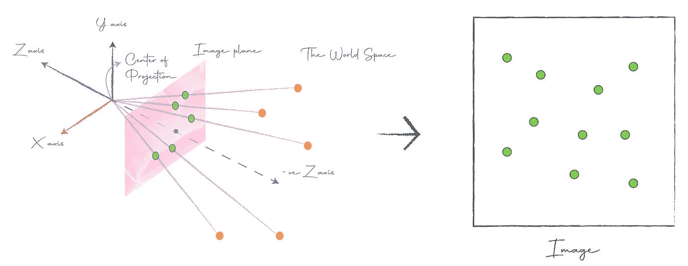

# 介绍

在[上一篇文章](/camera-extrinsic-matrix-with-example-in-python-cfe80acab8dd)中，我们学习了相机外物学，即从相机视角观察世界。在本文中，我们将了解相机如何形成图像，并了解其内在参数。

# 点的投影

图像形成的基本思想是捕捉一个点在照相机图像平面上的投影。图像中的像素对应于图像平面上的投影。请记住，图像平面就像一个胶片，捕捉从点反射回来的光线。让我们看看这是如何工作的:

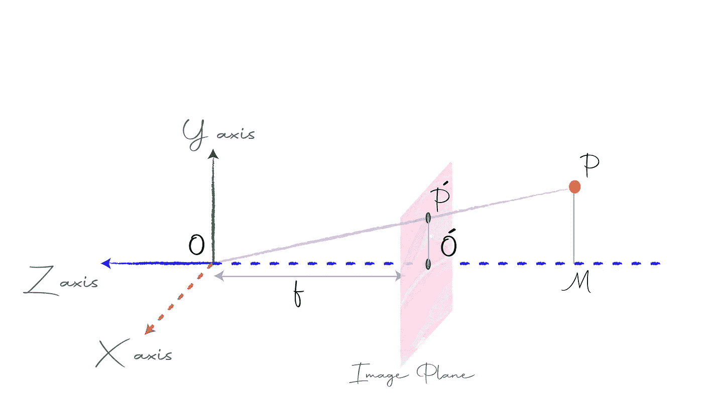

点的投影

在上图中，相机中心位于原点𝑂，图像平面从原点到-ve Z 轴的距离为𝑓。𝑓被称为焦距，通常是众所周知的相机。点𝑃在像平面上的投影是𝑃′.𝑃的坐标是(𝑥，𝑦，𝑧)，𝑃′的坐标是(𝑥′，𝑦′，𝑓).)我们的目标是找到𝑃′.的坐标

```
from the figure,
      △OMP and △OO′P′ are similar triangles.
⟹    x′/x = y′/y = f/z
⟹    x′ = x ∗ f/z and y′ = y ∗ f/z
```

我们找到了𝑃′.的坐标从上面的等式中，我们可以看到，随着点𝑃远离相机，其𝑧坐标增加，其投影将变得更小。所以，一个物体离相机越远，它在图像中出现的就越小。

要获得图像中的像素，我们只需获取投影坐标，放弃最后一个维度，然后绘制这些点。

例如，我们发现𝑃′的坐标为(𝑥𝑓/𝑧，𝑦𝑓/𝑧，𝑓).它的图像坐标将是(𝑦𝑓/𝑧).𝑥𝑓/𝑧让我们把图像坐标表示为(𝑢,𝑣)，然后:

```
(u, v) = (xf/z, yf/z)
```

好了，我们已经看到了照相机是如何成像的。那么，我们完成了相机内部的工作了吗？不会。在现实世界中，事情不会像预期的那样发展，其他参数会影响图像的形成。

让我们来看看每一个。

# 影响图像形成的参数

## 规模

当你购买相机时，它的可调焦距会在描述中给出，通常以毫米为单位，但你工作的空间可能会使用不同的单位，如像素。因此，我们需要引入一个比例因子，使单位标准化。

```
(u, v) = (𝛼 *x/z, 𝛼 * y/z)
```

在这里，你可以认为𝛼是缩放后的焦距或转换因子。

## 矩形像素

理想情况下，我们假设像素是正方形的，但在现实世界中，它们可以是不同高度和宽度的矩形。因此，我们需要为每个维度引入单独的比例因子。

```
(u, v) = (𝛼 * x/z, 𝛽 * y/z)
```

这里，𝛼是宽度尺寸的比例因子，𝛽是高度尺寸的比例因子。

## 抵消

从相机中心到图像平面的垂直线称为光轴。该轴与像平面相交的点称为光心。通常，光学中心和图像平面的原点彼此重合，但在现实世界中，它们可能会分开，如下图所示:

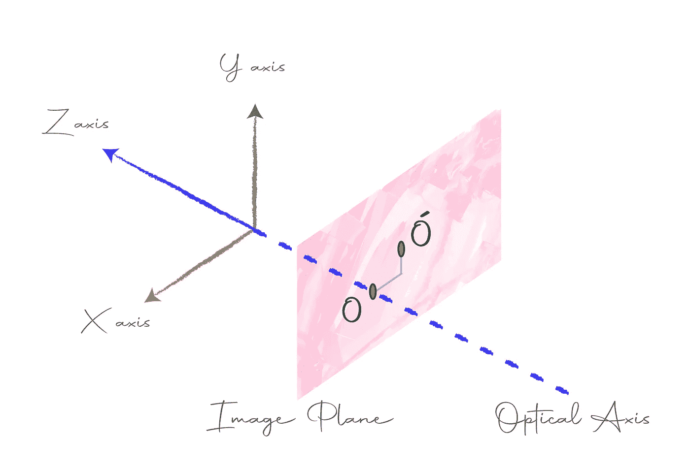

光学中心和原点可能不重合

因此，我们在等式中加入一个偏移来说明这一点:

```
(u, v) = (𝛼 * x/z + x0, 𝛽 * y/z + y0)
```

这里(𝑥0，𝑦0)是偏移量。

## 斜交

到目前为止，我们已经将图像平面描绘成一个矩形，宽度和高度方向相互垂直。但是在现实世界中，图像平面可能是倾斜的，类似于下图所示的平行四边形:

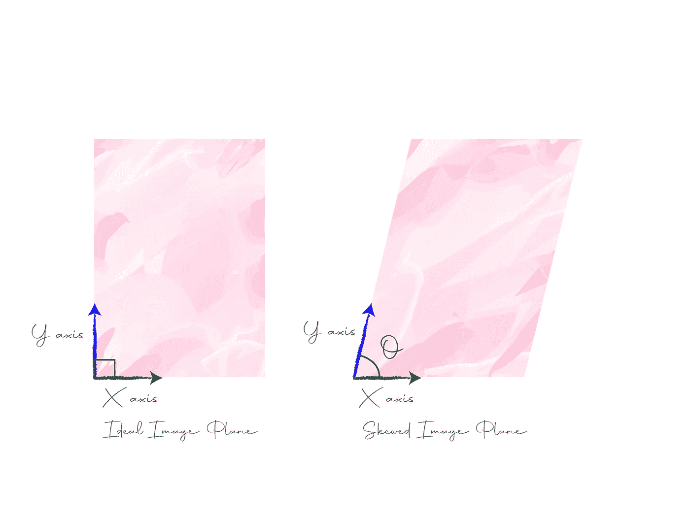

理想像平面与倾斜像平面

那么我们该如何应对呢？我们假设这些轴相互垂直，但实际上它们是成角度的。你想想，这是个换基问题。给定一个点相对于标准正交坐标轴的𝑃，我们需要用斜坐标轴来表示它。设(𝑦𝑥)是𝑃在标准正交基上的坐标，设(𝑦′𝑥′)是它在斜基上的坐标。我们的目标是找到(𝑥′，𝑦′).

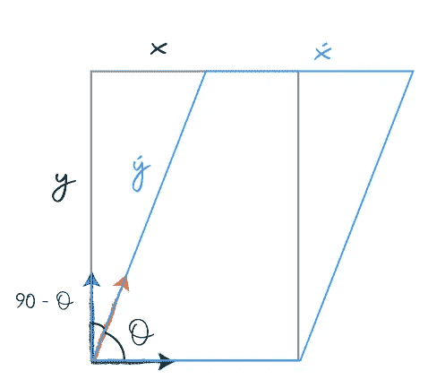

```
From the above figure,
      cos(90−θ) = y/y′
⟹    sinθ = y/y′
⟹    y = y′sinθ
⟹    y′= y / sinθalso,
      sin(90−θ) = (x - x′)/y′
⟹    y′cosθ = x - x′
⟹    x′ = x - y′cosθ
but,  y′= y / sinθ
⟹    x′ = x - ycosθ / sinθ
⟹    x′ = x - ycotθ
```

既然我们找到了(𝑥′，𝑦′)，让我们把他们纳入方程。我们只需要用这些新坐标替换旧坐标。

```
 u = 𝛼 * (x - ycotθ)/z + x0
      v = 𝛽 * (y / sinθ)/z + y0⟹    u = 𝛼x/z - (𝛼y/z)cotθ + x0
⟹    v = (𝛽y / zsinθ) + y0
```

# 相机固有矩阵

最后，在考虑了影响图像形成的参数之后，图像坐标给出如下:

```
(u, v) = [𝛼x/z - (𝛼y/z)cotθ + x0, (𝛽y / zsinθ) + y0]
```

我们可以用齐次坐标将此表示为矩阵乘法:

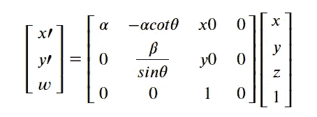

上面的矩阵叫做相机固有矩阵，用𝜅.来表示给定世界中一个点在摄像机下的坐标，我们可以将其乘以摄像机固有矩阵，以获得该点在图像中的齐次坐标。

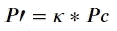

```
Here,
𝑃′ - Homogeneous coordinates of the point in the image
𝜅  - Camera Intrinsic Matrix
𝑃𝑐 - Homogeneous Coordinates of the point in the world wrt camera 
```

要从齐次坐标转换，我们只需除以最后一个元素:

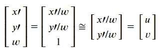

这里，(𝑢，𝑣)代表图像中点的欧几里德坐标或像素位置。

如果您观察，摄像机固有矩阵的最后一列是零列，我们可以删除它，因为它没有任何贡献，并进一步简化矩阵为:

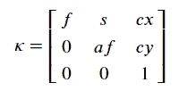

现在，矩阵方程可以重写为:

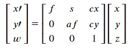

这里，不需要以齐次形式表示点坐标。

```
Here,      
      𝑓      - focal length
      𝑠      - skew factor
      𝑐𝑥,𝑐𝑦   - offset
      𝑎     - aspect ratio
```

如您所见，相机固有矩阵中有五个自由度。

# 例子

所有的理论可能会让你有点困惑。因此，让我们做一个动手的例子来理清事情。

## 安装

包含所有代码的 GitHub 库可以在这里找到。

假设您之前没有设置环境，现在可以通过运行以下命令来设置环境:

```
# create a virtual environment in anaconda
conda create -n camera-calibration-python python=3.6 anaconda
conda activate camera-calibration-python# clone the repository and install dependencies
git clone https://github.com/wingedrasengan927/Image-formation-and-camera-calibration.git
cd Image-formation-and-camera-calibration
pip install -r requirements.txt
```

**注意:**这里假设你已经安装了 anaconda。

我们将使用两个主要的库:

*   [**pytransform3d:**](https://github.com/rock-learning/pytransform3d) 该库具有强大的 3d 空间可视化和变换功能。
*   [**ipympl:**](https://github.com/matplotlib/ipympl)**这是一个游戏规则改变者。它使 matplotlib 绘图具有交互性，允许我们在笔记本中实时执行平移、缩放和旋转，这在处理 3D 绘图时很有帮助。**

## **直觉例子**

**在本例中，我们将考虑一个简单的设置，其中相机位于原点，图像平面位于+ve Z 轴上方(我们将使用左手坐标系)。接下来，我们绘制一些点，使得它们都位于与图像平面平行的同一平面上，并位于图像平面的顶部。这样就很容易想象投影和图像的形成。接下来，我们创建相机固有矩阵，并使用它将点投影到图像平面上并形成图像。最后，我们使用这个矩阵变换图像平面。下面提供了详细的分步解释。**

**笔记本嵌在下面:**

**让我们一步一步来看:**

*   **首先，我们导入必要的库。`utils.py`文件包含所有必要的助手函数。神奇的命令`%matplotlib widget`启用 ipympl 后端，这使我们能够玩的阴谋。**
*   **接下来，我们定义图像平面和点的参数。这里，我在 XY 极限(-5，5)之间的 z=5 的高度上均匀地取了 6 个点。图像平面处于 z=2 的高度。最后，我们把它们都画出来。**

**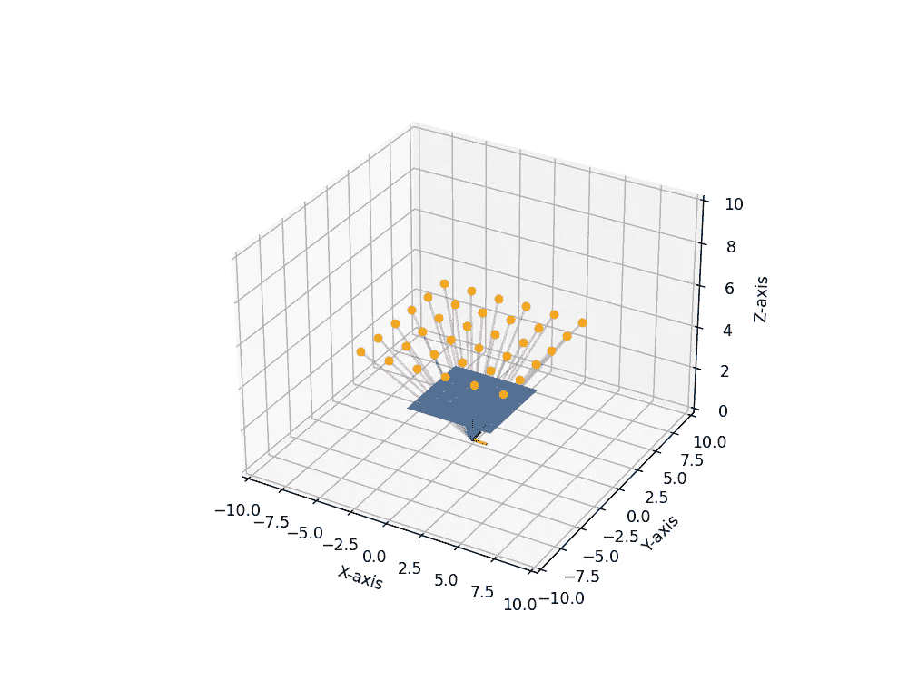**

*   **接下来，我们创建相机固有矩阵，它允许我们将点投影到图像平面上并形成图像。这里，我们创建了四个具有不同参数的矩阵来说明每个矩阵的效果。**

**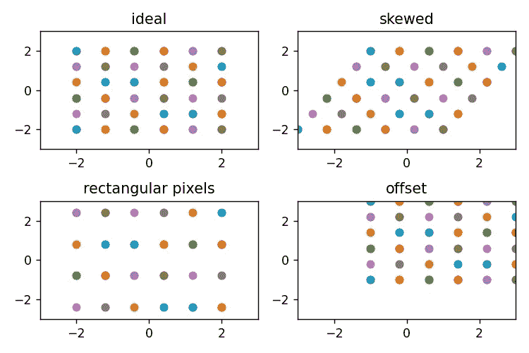**

*   **好了，我们已经修改了参数，并看到了它们对图像的影响。现在，有没有可能想象出在每种情况下像平面看起来是什么样子？摄像机内矩阵是基矩阵的变化，它的作用是从图像平面上采样点。现在，我们看到，如果我们对基变换矩阵求逆，就可以得到一个变换矩阵。因此，让我们取相机固有矩阵的逆矩阵，并将结果应用于图像平面。然而，我们必须从场景中移除焦距，因为它涉及图像平面的仰角，并且我们希望仰角是恒定的。我们只是想看看其他参数对图像平面的影响。**

**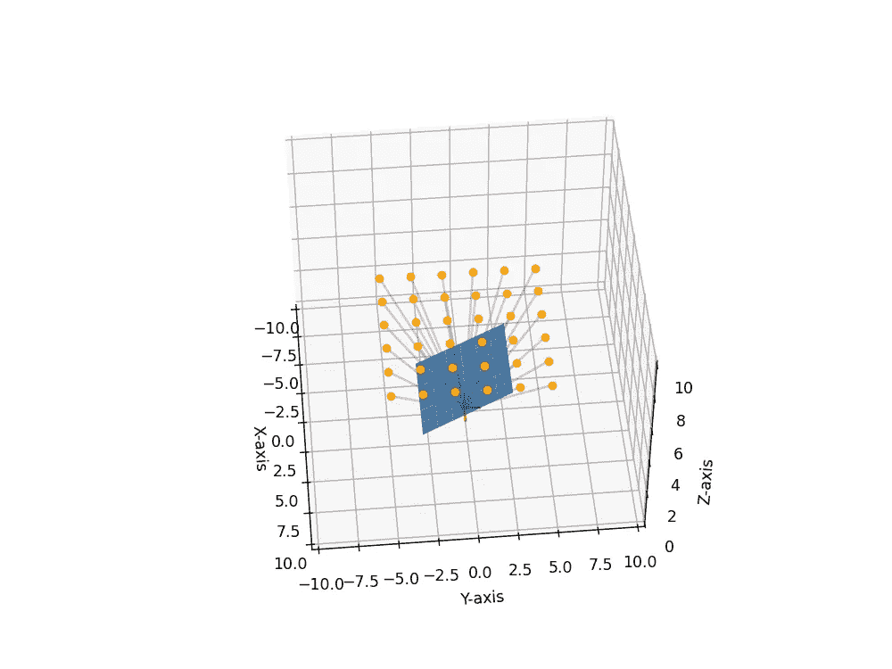**

*   **上图显示了倾斜参数 *s* 设置为 2 时的图像平面，其图像显示在上图的右上角。请注意图像和图像平面的方向是相反的。**

# **结论**

**我希望你喜欢这篇文章。我鼓励您使用笔记本，修改参数，并查看它们对图像的影响。如果你有任何疑问或问题，请在下面的评论中告诉我。**

# **参考**

1.  **[计算机视觉介绍— Udacity](https://classroom.udacity.com/courses/ud810)**

# **图像制作者名单**

**本文中的所有图片和数字，除非在标题中明确提及其来源，否则均由作者提供。**