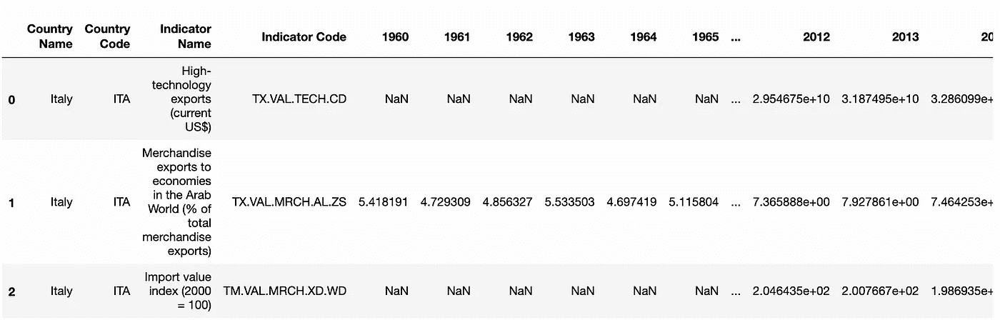
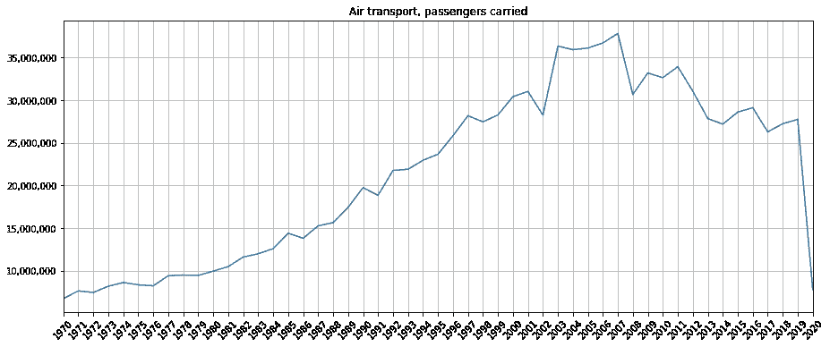
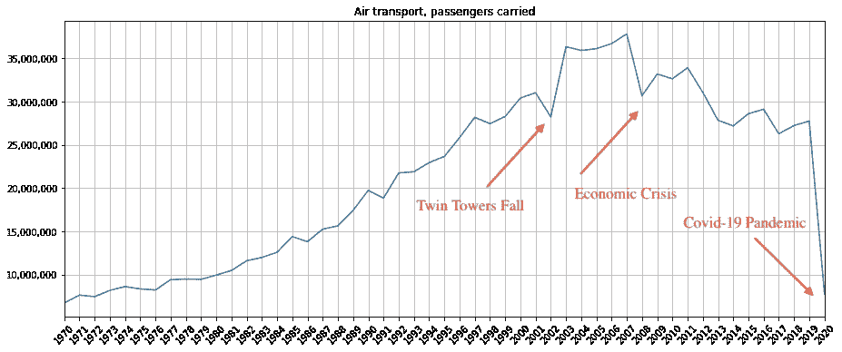
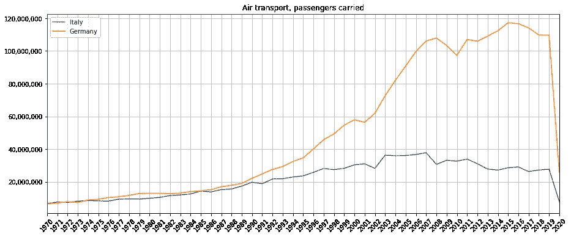
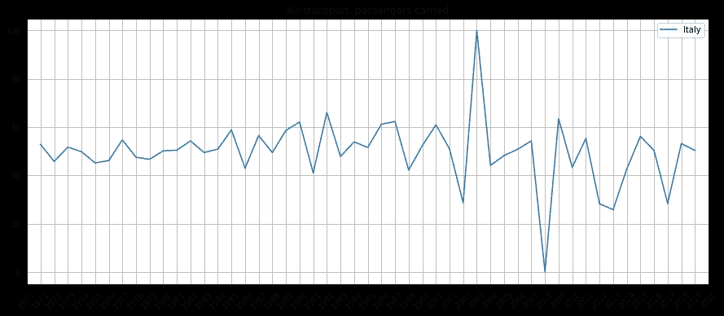

# 上下文分析能帮助提取有意义的见解吗？

> 原文：<https://towardsdatascience.com/can-context-analysis-help-extract-meaningful-insights-178a21a88e9f>

## 数据可视化

## 通过上下文分析从数据中提取有意义见解的三种策略


艾伦·琼斯在 Unsplash[拍摄的照片](https://unsplash.com?utm_source=medium&utm_medium=referral)

我最近正在读一本非常有趣的书，作者是詹姆斯·盖茨，书名是*用数据讲故事:以最快的方式实现你的商业目标的新的可视化数据指南。在这本书里，我发现了一个非常有趣的章节，它描述了从数据中提取见解时上下文的重要性。*

我已经详细阐述了作者的想法，在这里我描述了我所学到的，关于**数据背景**的重要性。我用一个实际的例子来说明我学到的概念。

**上下文分析**涉及数据集周围所有*世界的分析。数据集周围的世界可能包括不同的方面。例如，如果您正在测量一段时间内海面的温度，环境可能包括天气状况、一些船只的存在等等。*

定义上下文分析有三个要素:

*   事件
*   环境
*   时间

我分别考虑这三个方面，并用一个实际的例子来说明。

# 1 场景的设置

例如，我考虑 1970 年至 2020 年意大利航空运输的乘客数量。使用的数据集由[世界数据库](https://data.worldbank.org/country/IT)在 CC-BY 4.0 许可下发布。

本节的目的是将原始数据集转换成一个时间序列，其中包含意大利的考虑指标。

首先，我将数据集加载为熊猫数据帧:

```
import **pandas** as pddf = pd.read_csv('API_ITA_DS2_en_csv_v2_3472313.csv')
```



作者图片

原始数据集包含不同的指标，因此我只选择我感兴趣的指标:

```
indicator = 'Air transport, passengers carried'
df_ind = df[df['Indicator Name'] == indicator]
```

然后，我删除未使用的列:

```
df_ind.drop(['Country Name', 'Country Code', 'Indicator Name', 'Indicator Code','Unnamed: 65'], axis=1, inplace = True)
```

我将索引重命名为`value`:

```
df_ind.rename(index={511 : 'value'}, inplace=True)
```

现在，我建立时间序列:

```
df_ind = df_ind.transpose()
ts = df_ind['value']
ts.dropna(inplace=True)
ts.index = ts.index.astype(int)
```

最后，我绘制了时间序列:

```
import matplotlib.pyplot as plt
import numpy as npxmin = np.min(ts.index)
xmax = np.max(ts.index)
plt.figure(figsize=(15,6))
plt.plot(ts)
plt.title(indicator)
plt.gca().yaxis.set_major_formatter(plt.matplotlib.ticker.StrMethodFormatter('{x:,.0f}'))
plt.xticks(np.arange(xmin, xmax+1, 1),rotation=45)
plt.xlim(xmin,xmax)
plt.grid()
plt.savefig('air_transport_basics.png',bbox_inches="tight")
plt.show()
```



作者图片

现在，我准备分析时间序列的背景。

# 2 项活动

事件是**发生的事情**并以某种方式影响数据集的趋势或行为。

在我们的数据集中，我们可以清楚地识别出至少三个产生负峰值的事件:

*   双子塔在 2001 年倒塌，负峰在 2002 年，
*   2008 年始于意大利的经济危机，
*   2020 年新冠肺炎大流行的开始。

下图显示了意大利航空运输公司载客人数的负峰值:



作者图片

# 3 环境

环境包括影响数据集中趋势的所有特定**外部或内部约束。例如，一个非常严格的教授可以给学生 28/30 的最高分，而另一个教授也可以分配 30/30 的最高值。因此，除非对数据进行了正确的标准化处理，否则不可能对两位不同教授评估的学生成绩进行比较。**

在我们关于意大利航空运输公司运送的乘客人数的示例中，我们可能被迫将意大利的数据与德国的数据进行比较，如下图所示:



作者图片

然而，我们不能在意大利和德国之间下结论，因为它们的情况不同。虽然意大利有 44 个现役机场，德国只有 36 个，但德国机场比意大利机场更重要。这也证明了不同的流量。

# 4 次

时间是指**中按时间顺序排列的数据**。我们通常倾向于将现在的数据与过去的数据进行比较。但即使在这种情况下，我们也必须非常小心。

例如，如果我们有某个国家的游客流量的数据，我们就不能把当月的数据与上月的数据进行比较。事实上，这类数据显示了一定的**季节性**。相反，我们应该将当前的数据与上一个赛季的数据进行比较，以更准确地了解情况。

在我们的乘客运载场景中，我们无法将 1970 年与 2010 年进行比较，因为这两年的情况不同。相反，我们可以将一年与前一年进行比较。

我们可以计算出去年相对于前一年的增长百分比:

```
ts_diff = ts.diff()
ts_diff = ts_diff.iloc[1:-1]ts_diff_perc = (ts_diff-ts_diff.min())/(ts_diff.max()-ts_diff.min())*100
xmin = np.min(ts_ita.index)
xmax = np.max(ts_ita.index)
```

然后我们可以画出来:



作者图片

# 5 如何表示上下文？

用上下文来丰富图表，给读者阅读它们的可能性，而不提取错误的信息，这是非常重要的。

存在许多表示上下文的技术，包括(但不限于):

*   **标记** —添加注释以突出显示事件
*   **着色** —使用不同的颜色来突出环境
*   **图表类型** —选择适当的图表以突出显示时间。

# 摘要

恭喜你！您刚刚学习了上下文对于从数据中提取有意义的见解并表示它们的重要性。

三个因素共同决定了环境:时间、事件和环境。您可以用不同的技术在图表中表示它们，包括标签、颜色和图表类型。

如果你已经走了这么远来阅读，对我来说今天已经很多了。谢谢！你可以在[这篇文章](https://alod83.medium.com/which-topics-would-you-like-to-read-c68314dc6813)中读到更多关于我的信息。

# 相关文章

[](https://pub.towardsai.net/are-data-journalism-and-data-science-the-same-thing-77ba7ec794d4) [## 数据新闻和数据科学是一回事吗？

### 答案是否定的，我会解释原因

pub.towardsai.net](https://pub.towardsai.net/are-data-journalism-and-data-science-the-same-thing-77ba7ec794d4) [](/why-a-data-scientist-needs-to-also-be-a-storyteller-89b4636cb83) [## 为什么数据科学家也需要讲故事

### 作为一名数据科学家是一份非常棒的工作:你可以收集数据，通过奇妙的抓取机制或网络…

towardsdatascience.com](/why-a-data-scientist-needs-to-also-be-a-storyteller-89b4636cb83) [](https://alod83.medium.com/how-to-design-a-data-journalism-story-b2e421673b6e) [## 如何设计一个数据新闻故事

### 如何设计一个数据新闻故事

如何设计一个数据新闻 Storyalod83.medium.com](https://alod83.medium.com/how-to-design-a-data-journalism-story-b2e421673b6e) [](/data-visualisation-principles-part-1-a-practical-example-in-altair-b6e16f665fc6) [## 数据可视化原理第 1 部分 Altair 中的一个实际例子

### 关于如何在 Python Altair 中构建、定制和添加注释到简单条形图的实用教程

towardsdatascience.com](/data-visualisation-principles-part-1-a-practical-example-in-altair-b6e16f665fc6) [](/data-visualisation-principles-part-2-layout-and-emphasis-d682bbc38217) [## 数据可视化原理第 2 部分:布局和重点

### 基本图形设计原则入门。

towardsdatascience.com](/data-visualisation-principles-part-2-layout-and-emphasis-d682bbc38217) 

有上下文和无上下文的示例

可观察量