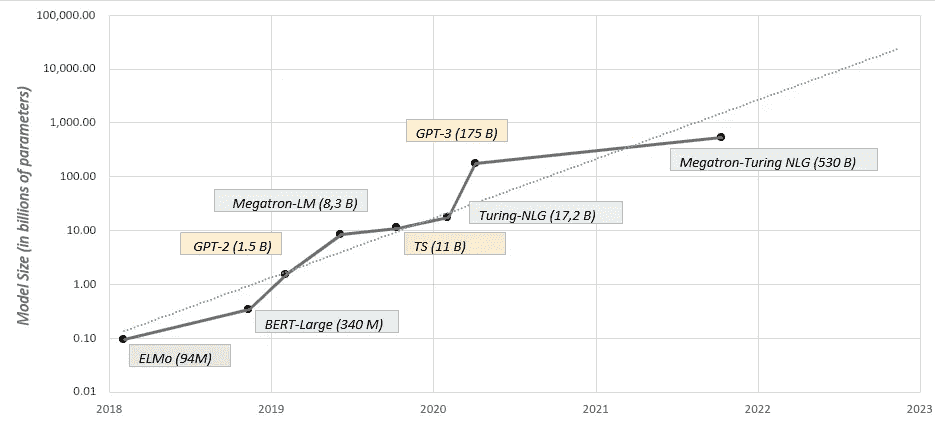
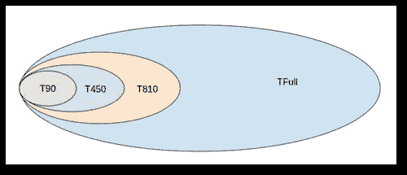
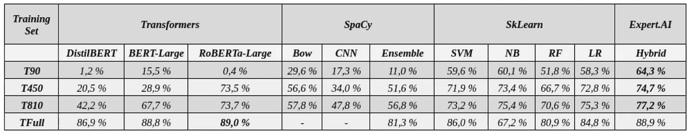

# 当监督数据不足以用于 LLM 时，混合 ML 方法能有所帮助吗？

> 原文：<https://towardsdatascience.com/can-hybrid-ml-approaches-help-when-supervised-data-isnt-enough-for-llms-fa2b587677a0>

## 具有符号向量的精益架构可以产生更好的结果

*塞缪尔·阿尔盖里尼* [和*雷奥纳多·里古蒂尼*](https://medium.com/@leonardo.rigutini)

大卫和歌利亚。提香 1542 -1544 年。来源:[维基媒体](https://commons.wikimedia.org/wiki/File:Tycjan_David_i_Goliat.jpg)

# **大型语言模型时代**

在过去的十年里，我们观察到了自然语言处理领域的一个重要的范式转变。随着[深度学习](https://en.wikipedia.org/wiki/Deep_learning)技术的出现，[端到端方法](/e2e-the-every-purpose-ml-method-5d4f20dafee4)已经逐渐取代了基于分析和选择特征的严格阶段的原始机器学习方法，它们(尤其是变形金刚)目前是 NLP 和相关领域的 SOTA。通常，这些方法由非常大的人工神经网络模型(数十亿个参数)组成，这些模型被训练成用基于统计的方法来模拟语言。当使用神经网络时，训练阶段通常需要大量的数据和更多的计算资源。因此，由于对数据、功率和成本的更高需求，它们通常使用通用任务在非常大的数据集上进行预训练，然后发布以供使用或最终集成到专有工具中。你可以在[这篇](https://huggingface.co/blog/large-language-models)帖子中找到关于这些巨头的有用讨论。

图 1 — *过去几年大型语言模型(LLM)*
*规模趋势。图片由作者受* [启发*微软研究院博客*](https://www.microsoft.com/en-us/research/blog/using-deepspeed-and-megatron-to-train-megatron-turing-nlg-530b-the-worlds-largest-and-most-powerful-generative-language-model/)

集成阶段通常需要一个微调阶段，旨在将模型裁剪为您想要重现的数据和任务，并响应特定的业务需求。值得注意的是，这个过程需要大量的标记数据(受监督的)，反映要复制的任务的特征和要求。然而，在现实世界的场景中，这种数量的标记数据通常是不可用的，并且它的产生是耗时且相当昂贵的([此处](/can-you-trust-your-model-when-data-shifts-981ed681f1fd)您可以找到一篇关于类似问题的有趣文章)。因此，将机器学习技术应用于商业或行业特定用例的两个最大挑战是数据的稀缺和计算资源的缺乏。

围绕“少量学习” [11](https://arxiv.org/pdf/1904.05046.pdf) 技术的研究主要集中在研究和比较从少量监督数据和大量未标记数据中学习的方法。在这个领域，我们已经看到越来越多的新混合方法，其中由通用大型语言模型(LLM)返回的密集表示与知识的符号表示相结合(通常富含语言和语义信息)，从而即使在处理较小的数据集时也能提供显著的提升。

# **但是 AI 不仅仅是深度学习**

Gartner 将“[复合人工智能](https://www.gartner.com/en/webinars/4002198/composite-ai-how-could-we-finally-get-ai-to-be-smarter-)”定义为不同人工智能技术的组合，以实现更好的结果。没错，人工智能不再仅仅是机器学习或深度学习。例如，基于规则的系统是人工智能领域的经典，它们是解决特定任务的不同但有效的方法。本文中讨论的混合方法由一个 ML 算法组成，该算法由文本的符号表示提供支持。

这种文本的符号表示利用了来自 [NLP](https://en.wikipedia.org/wiki/Natural_language_processing) 的前一步骤的丰富的语言信息列表(形态句法和语义数据),包括许多最常见的 [NLP](https://en.wikipedia.org/wiki/Natural_language_processing) 任务，如词汇化、依存和选区解析、词性标注、形态分析、关系检测等。此外，这些技术拥有丰富的[知识图](https://en.wikipedia.org/wiki/Knowledge_graph)，这是一个巨大的知识树，由代表概念和它们之间关系的节点和连接组成。由 NLP 分析的这一步骤产生的不同类型的信息被表示在分离的向量空间中，这些向量空间被连接并输入到机器学习算法中。

基本上，在这种混合方法中，使用大型语言模型(LLM)产生的基于密集向量(即[嵌入](https://en.wikipedia.org/wiki/Word_embedding))的最常见表示技术被替换为文本的符号表示，其中向量的每个维度编码文本的清晰和明确的语言特征。

*图 2——所用混合方法的方案。作者图片*

# **挑战**

当监督数据稀缺时，将符号人工智能与机器学习结合起来可能会改变游戏规则。事实上，当数据对于 LLM 来说根本不够用时，微调任务是极其复杂和无效的。

在这个实验中，我们比较了几种主流机器学习技术与 expert.ai 平台中使用的混合 ML 在数据稀缺条件下的性能——训练集(监督数据)的大小从每类几个样本到每类大约一百个样本不等。比较的重点是:

*   基于变压器架构的模型:[BERT](https://huggingface.co/bert-large-uncased)【1，2】及其衍生[DistilBERT](https://huggingface.co/distilbert-base-uncased)【3，4】和[RoBERTa](https://huggingface.co/roberta-large)【5，6】；
*   [Spacy](https://spacy.io) 提供的车型:BoW、CNN、Ensemble
*   关于 BoW 表示的标准[sk learn](https://scikit-learn.org/stable/index.html)【8，9】ML 算法(SVM、NB、RF、LR)
*   [expert.ai](https://www.expert.ai) 的混动车型

为了进行比较，我们选择了[消费者投诉数据集](https://www.consumerfinance.gov/data-research/consumer-complaints/) (CCD):在 [Kaggle](https://www.kaggle.com/datasets/selener/consumer-complaint-database) 上公开的关于金融产品和服务的投诉集合。该数据集包括从现有公司收集的真实投诉，并侧重于金融产品和服务，其中每个投诉都已按产品正确标记，同时创建了一个有 9 个目标类别(标签)的监督文本分类任务。

对于我们的实验，较长和较短的文本被删除，最终得到一个由 80，523 个监督文档组成的最终数据集:其中 10%用作测试集(8052)，而其余的用作训练数据。为了测量每个模型在少量学习场景中的分类能力，我们通过随机二次抽样建立了 4 个维度递增的训练集:

*   T90:每类 10 个文档(总大小为 90)；
*   T450:每类 50 个文档(总大小为 450)；
*   T810:每类 90 个文档(总大小为 810)；
*   TFull:没有子采样(总大小为 72471)。

我们使用增量过程来构建训练数据集，以便特定类别的监督文档始终包含在较大的数据集中:

*图 3-为少数镜头比较建立的 4 个训练集。作者图片*

# **获胜者是……**

表 1 显示了随着训练集大小的增加，所有模型的分类性能。对于 expert.ai 混合模型，这些值代表通过比较 4 种不同算法(SVM、朴素贝叶斯、随机森林和逻辑回归)获得的最佳结果，同时利用文本的符号表示。

*表 1:模型的性能随着训练集大小的增加而增加。作者图片*

使用较小的训练集(T90、T450 和 T810)，混合方法实现了其最佳性能，特别是与基于变压器的模型(即 BERT)相比，以及更一般地与深度神经网络(如 SpaCy)相比，具有显著的提升。

结果并不出人意料，因为人工神经网络，尤其是深度神经网络，通常需要大量的监督数据来进行有效的微调。在缺乏必要数据的情况下，绩效可能会很差。

实验结果带来的一个有趣的发现是，与主流算法相比，来自符号人工智能的丰富文本表示通常也提供了更好的结果。当调查来自 SkLearn 模型的结果时，这一点很明显，这些模型毫无例外地低于 expert.ai 的混合方法。

显然，当增加训练集的规模时，方法之间的差距和差异会减小——当使用整个训练集时，它们实际上消失了(TFull)。在这种情况下，表现最好的模型是 RoBERTa-Large，尽管所有其他模型，包括 expert.ai 的混合 ML 方法，都以非常小的偏差紧随其后。

# **结论**

这些实验中出现的概念证实了一个假设，即大多数深度神经网络方法在监督数据稀缺的典型现实世界场景中可能不是非常有效。

在这些情况下，使用利用文本符号表示的混合方法似乎更有效，并产生最佳结果。这并不意外，因为深度模型通常也需要大量的监督数据来进行微调，而在相反的情况下，性能往往会下降。

当使用混合方法时，利用丰富的文本符号表示弥补了监督数据的不足，甚至优于基于 BoW 表示的经典方法。

**参考文献:**

1.  *Devlin，Jacob，et al .〈伯特:语言理解的深度双向转换器的预训练〉arXiv 预印本*[*arXiv:1810.04805*](https://arxiv.org/abs/1810.04805)*，(2018)。*
2.  *抱脸的 BERT-Large:*[*https://huggingface.co/bert-large-uncased*](https://huggingface.co/bert-large-uncased)
3.  *SANH，Victor 等人《蒸馏伯特，伯特的蒸馏版:更小、更快、更便宜、更轻》。arXiv 预印本*[*arXiv:1910.01108*](https://arxiv.org/abs/1910.01108)*，(2019)。*
4.  *香椿面:*[*https://huggingface.co/distilbert-base-uncased*](https://huggingface.co/distilbert-base-uncased)
5.  *刘，，等，“RoBERTa:一种稳健优化的 BERT 预训练方法”。arXiv 预印本 ar*[*Xiv:1907.11692*](https://arxiv.org/abs/1907.11692)*，(2019)。*
6.  *RoBERTa-Large on hugging face:*[*https://huggingface.co/roberta-large*](https://huggingface.co/roberta-large)
7.  *SpaCy:*[*https://SpaCy . io*](https://spacy.io/)
8.  *PEDREGOSA，Fabian 等人，“sci kit-learn:Python 中的机器学习。《机器学习研究杂志》，(2011)，12:2825–2830。*
9.  *sk learn*[*https://scikit-learn.org/stable/index.html*](https://scikit-learn.org/stable/index.html)
10.  *expert . ai:*T22*https://www . expert . ai*
11.  王，亚青，等，“从几个例子中概括:关于少投学习的调查”美国计算机学会计算调查(csur)53.3(2020):1–34。[*https://arxiv.org/pdf/1904.05046.pdf*](https://arxiv.org/pdf/1904.05046.pdf)