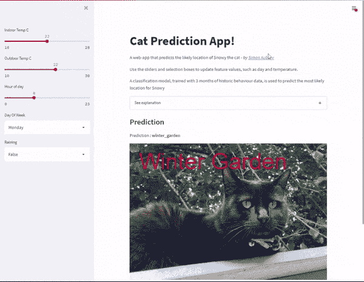
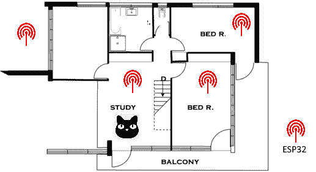
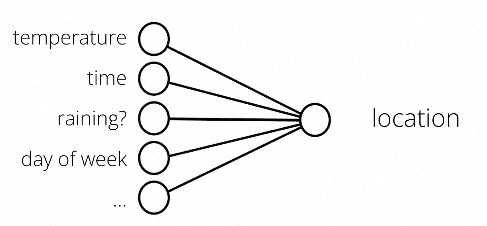
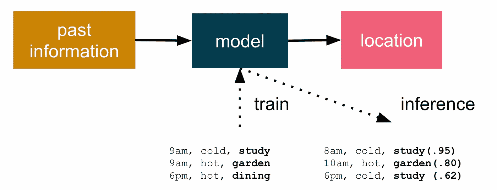
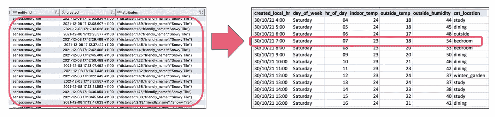
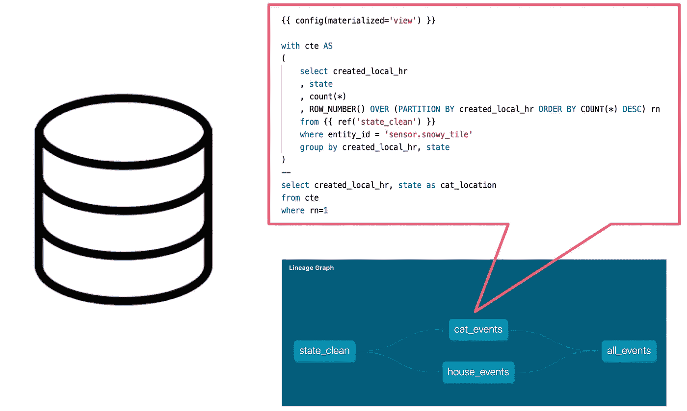
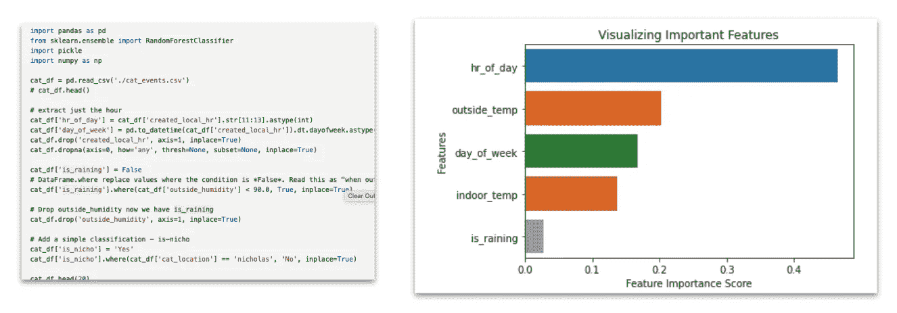
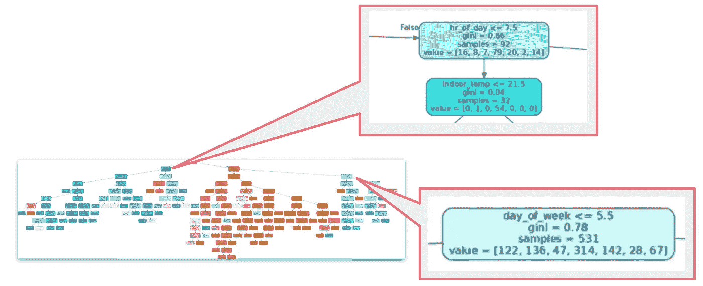
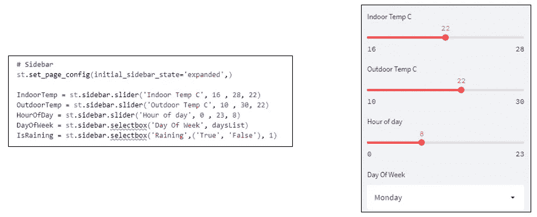

# ML 能预测我的猫现在在哪吗？

> 原文：<https://towardsdatascience.com/can-ml-predict-where-my-cat-is-now-part-2-7efaec267339>

## 利用过去行为和天气观测的猫预测模型

温贝托·阿雷利亚诺在 [Unsplash](https://unsplash.com/?utm_source=unsplash&utm_medium=referral&utm_content=creditCopyText) 上拍摄的照片

> 通过捕获几个月的历史位置和温度数据，这篇博客介绍了如何训练机器学习(ML)模型来预测我的猫一天中会去哪里。
> 
> 对于不耐烦的人，你可以直接跳到预测网站[这里](https://cat-predict-app.herokuapp.com)。

# 猫过去的行为能预测未来的睡觉地点吗？

利用一些廉价的硬件(以及一只对数据隐私问题矛盾的猫)，我想看看我是否可以训练一个机器学习(ML)模型来预测这只猫 Snowy 一天中会去哪里。

基于家庭的位置和温度跟踪允许我建立一个她最喜欢的睡觉地点的房间的广泛历史。我有一个理论，通过从她的过去收集足够的数据，我能够训练一个 ML 模型来预测她未来可能去哪里。

使用 Streamlit web 应用程序预测猫的位置(图片由作者提供)

# 用于房间级 cat 跟踪的硬件

第一项任务是收集大量关于 Snowy 历史上在哪里度过的数据，以及温度和降雨量等环境因素。我设定了一个任意的目标，收集三个月来在房子里和房子周围活动的每小时更新。

用房间信标定位猫(图片由作者提供)

猫不擅长数据输入；所以我需要一种自动的方法来收集她的位置。我让白雪戴上一个小的电池供电的蓝牙追踪器。她衣领上的这个装置只是发射一个常规的独特的蓝牙低能量( [BLE](https://en.wikipedia.org/wiki/Bluetooth_Low_Energy) )信号。然后我用八个固定的接收器来监听这个 BLE 信号。这些接收器节点是基于 [ESP32](https://en.wikipedia.org/wiki/ESP32) 的存在检测节点，放置在房屋内和周围指定的房间中(6 个在室内，2 个在室外)。

每个接收节点不断寻找唯一的 BLE 信号，并测量接收信号强度指标( [RSSI](https://en.wikipedia.org/wiki/Received_signal_strength_indication) )。信号越强，白雪离那个信标就越近(要么是这样，要么是她在摆弄电池)。例如，如果我在研究传感器旁边收到几秒钟的强信号，我可以假设白雪可能非常接近那个房间。

最终我收集了三个月的位置观测，超过**1200 万**的位置、温度、湿度和降雨量观测(我*可能*已经超过了数据收集的上限)。

我一直试图回答的问题是，我能利用这些历史观察建立一个她可能去哪里的预测模型吗？我能有多大信心用一台机器来预测一只猫可能在哪里，来预测白雪的藏身之处？

# ML 训练营

监督学习是基于示例输入-输出对创建将输入映射到输出的函数的 ML 任务。在我的例子中，我想对猫的位置、温度、一天中的时间等进行历史观察。，作为输入和查找模式…预测未来猫位置的函数(推理)。

温度、时间和日期——它能映射到位置吗？(图片由作者提供)

我的假设是这个问题可以从这些数据中归纳出来；例如，未来的数据将遵循过去猫行为的一些常见模式(对于猫来说，这种假设可能是有问题的)。

猫咪位置预测(图片由作者提供)

该训练使用过去的信息来建立一个模型，该模型是可部署的人工制品。一旦训练了候选模型，就可以测试它的预测准确性并最终部署它。在我的例子中，我希望创建一个 web 应用程序来预测 Snowy 可能在哪里打盹。

同样重要的是，该模型不必明确输出绝对位置，但可以根据置信度给出答案。如果它输出 P(位置:研究)接近 1.0，则它是有信心的，但是接近 0.5 的值表示对预测 Snowy 的位置的信心“不确定”。

# 使用 dbt 汇总数据

我的数据平台[家庭助手](https://www.home-assistant.io/)将每个传感器更新存储在[状态](https://www.home-assistant.io/docs/backend/database/)表中。这*真的是*细粒度的，每隔几秒就有来自所有传感器的更新(在我的例子中，每天大约有 18，000 个传感器更新)。为了简化模型训练，我想把数据总结成每小时更新的数据——基本上是一个单一的(最普遍的)位置，以及温度和湿度读数。

将大量数据汇总成每小时的摘要(图片由作者提供)

最初，我用一堆 SQL 语句(如 [this](https://github.com/saubury/cat-predictor/blob/master/sql/extract.sql) )手动运行数据处理来处理数据。然而，我发现这相当麻烦，因为我想在新的位置和环境条件下重新训练模型。我决定使用可靠的数据工程工具 [dbt](https://www.getdbt.com/) 来简化数据库中 SQL 转换的创建，以使再培训更加有效。

显示数据转换的 dbt 谱系图(图片由作者提供)

dbt 负责将这些 my select 语句转换成表和视图，在我的 postgres 数据仓库中执行数据转换。

# 模型训练和评估

一旦我清理了我的数据，我就使用 Scikit-learn 随机[森林决策树](https://www.datacamp.com/tutorial/random-forests-classifier-python)分类作为我的预测模型。[随机森林](https://en.wikipedia.org/wiki/Random_forest)根据训练数据创建决策树。对于 Snowy 来说，这意味着位置预测是从投票的多次随机迭代中得出的分类——选择投票最多的结果位置。

如果你看一下 [python 笔记本](https://github.com/saubury/cat-predict/blob/master/notebooks/cat_predictor_app.ipynb)，你可以看到为输入分配一个类标签所采取的步骤，这些步骤基于许多例子，这些例子是从过去对一天中的时间、温度和位置的数千次观察中训练出来的。

用于可视化要素重要性的 Python 代码段(图片由作者提供)

关于 Scikit-learn 决策树模型的一个真正酷的事情是可视化正在发生的事情是多么容易。通过可视化模型特征(如上),我可以看到“一天中的一小时”是模型中最重要的特征。

直觉上这是有道理的——一天中的时间可能对下雪的地方有最大的影响。预测白雪位置的第二个最重要的特征是室外气温。这也是有道理的——如果她想出去，太热或太冷都有可能改变。我发现令人惊讶的是*最不重要的*特性是*正在训练*特性。一种可能的解释是，该功能仅在白天有意义，当白雪晚上在室内睡觉时，下雨不会对模型产生影响。

还可以使用 Scikit-Learn 从 Python 中的随机森林中可视化出一棵决策树。

显示小时和日期决策点的可视化决策树(图片由作者提供)

在我的显示树中，我可以看到一天中的某个小时是预测中的初始决策点，上午 7:00 是算法中有趣的部分。这是我们家闹钟响起的时间——猫被激励起来寻找食物。该树的另一个有趣部分是“一周中的某一天≤ 5.5”。这相当于一周中的某一天是周一到周五——同样，算法的这一部分是有意义的，因为我们(和猫)通常在周末会起得晚一点

# Streamlit 中的 cat predictor 网络应用程序

有了创建的模型，我现在想要构建一个 web 应用程序来基于一系列输入预测 Snowy 的位置。 [Streamlit](https://docs.streamlit.io/) 是一个开源的 Python 库，它使得创建 web 应用程序变得很容易(无需我学习一堆前端框架)。我为特征值添加了滑块和选择框，比如日期和温度。

Web 应用程序—输入为滑块控件(图片由作者提供)

瞧——我用更多的 [python 代码](https://github.com/saubury/cat-predict-app/blob/master/cat_predictor_app.py)创建了一个猫预测应用程序；预测雪猫可能位置的网络应用。我找到了一些优秀的指令来将我的 Streamlit 应用程序部署到 Heroku。

那么，ML 能预测我的猫现在在哪里吗？没错——而且惊人的准确。白雪在花园里愉快地睡着了，正如预测应用程序[所预测的那样。](https://cat-predict-app.herokuapp.com/)

# 代码链接

希望你发现这个博客和代码对你所有的宠物位置预测需求有所帮助

*   数据平台和 ML 预测:[https://github.com/saubury/cat-predict](https://github.com/saubury/cat-predict)
*   Streamlit 应用:[https://github.com/saubury/cat-predict-app](https://github.com/saubury/cat-predict-app)