# 量子机器学习能帮助我们解决气候变化吗？

> 原文：<https://towardsdatascience.com/can-quantum-machine-learning-help-us-solve-climate-change-3500741d583b>

## 量子衍生技术的历史和潜在应用

埃利斯·陈嘉炜在 [Unsplash](https://unsplash.com?utm_source=medium&utm_medium=referral) 上拍摄的照片

## 介绍

在过去的几年里，由于组件结构、效率、速度和质量改进方面的指数级技术进步，通用计算机硬件的小型化速度受到了限制。这些变化过去和现在都主要受到通信、数字休闲、逃避现实生活及其问题以及由于疫情特殊情况而远程工作等社会需求的推动。

因此，一旦必然性把科学和技术推到了边缘，我们就开始遇到一个不可逾越的物理极限——原子。此外，无法进一步减小经典处理设备的尺寸已经传播了这样一种观点，即支持 [***摩尔定律***](https://en.wikipedia.org/wiki/Moore%27s_law) 的趋势将在未来几十年变得平坦，因为当建造这样的微小机制时，工程师的工作将变得更加复杂。为了正确理解这意味着什么以及为什么会发生这种情况，经典计算最基本的构建模块晶体管的最小尺寸约为 2 纳米。这意味着地球上发现的最小的病毒比嵌入 CPU 的最小的 [***晶体管***](https://hexus.net/tech/news/cpu/145645-intel-14nm-amdtsmc-7nm-transistors-micro-compared/#:~:text=Part%202.-,In%20the%20main%20picture,-%2C%20above%2C%20you%20can) 大十倍。知道了这些，就方便注意到原子的直径范围在 0.1 到 0.5 纳米之间，这是我们在生产高端技术时正在接近的一个疯狂的近距离。

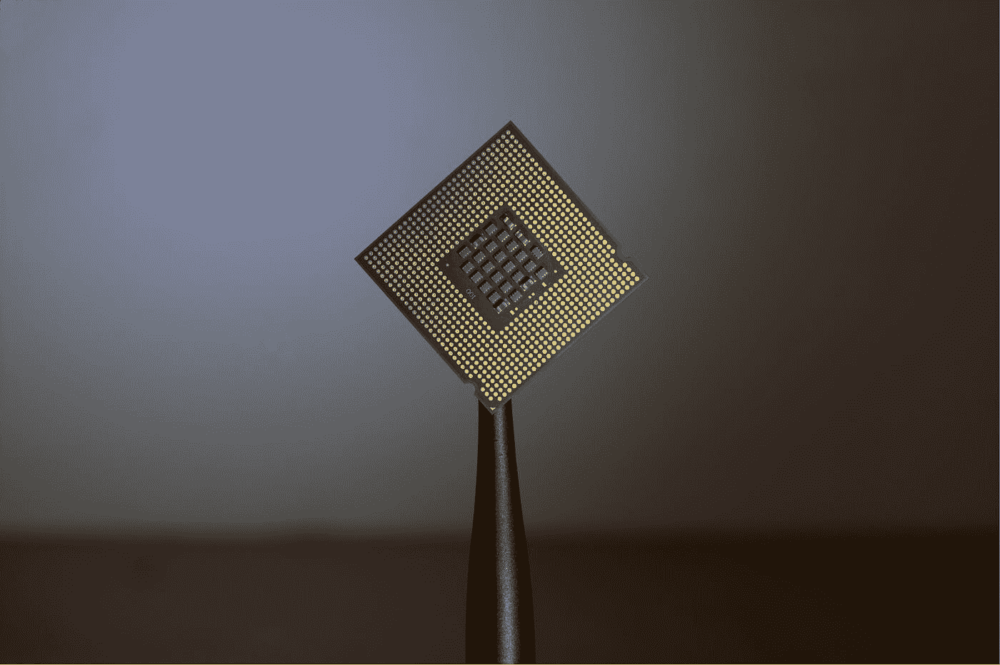

布莱恩·科斯蒂克在 [Unsplash](https://unsplash.com?utm_source=medium&utm_medium=referral) 上拍摄的照片

尺寸限制不仅阻止了 CPU 拥有更多的晶体管，从而获得更多的计算能力，而且由于其异常的复杂性，也使它们无法廉价或直接地制造和维修。此外，即使我们可以设计出比今天强大一百万倍的 CPU，如果它需要一百万倍的能量来运行，它也没有什么用处，这就引入了新的问题需要考虑。于是，许多世界范围内的计算机科学、物理、电子和数学专家提出了一个解决方案，那就是建造一台所谓的 ***“量子计算机”。*** 然而，这种将经典规则量子化的想法并不像看起来那么当代。第一个介绍它的人是保罗·贝尼奥夫，一个臭名昭著的美国物理学家，被广泛认为是量子计算之父。在他 1981 年的论文 [***【作为物理系统的计算机】***](https://www.researchgate.net/publication/226754042_The_computer_as_a_physical_system_A_microscopic_quantum_mechanical_Hamiltonian_model_of_computers_as_represented_by_Turing_machines) 中，他提出了“量子图灵机”的想法，这种机器将使用量子力学的原理来执行计算。尽管如此，直到 1995 年，<https://en.wikipedia.org/wiki/National_Institute_of_Standards_and_Technology>*研究人员 [*克里斯托弗·门罗*](https://en.wikipedia.org/wiki/Christopher_Monroe) 和 [*大卫·温兰*](https://en.wikipedia.org/wiki/David_Wineland) 才实验性地实现了第一个量子逻辑门，即受控非 ***(C 非)*** 门，从而导致了第一个工作的双量子位[核磁共振](https://en.wikipedia.org/wiki/Nuclear_magnetic_resonance) *(原子核)**

*在花费了二十多年的时间开发量子逻辑门实验实现的新方法并在实验室证明其可行性后，世界各地的科学团队已经在各种量子平台上成功构建了量子处理器，从捕获的离子到超导电路。此外，它的快速发展也使量子计算成为解决人类面临的一些最具挑战性问题的可行选择。然而，这个领域存在的时间太短，这对它不利。许多梦想升级这个世界的硬件开发人员、研究人员和物理学家面临着大量的阻碍和挫折；它们中的大部分源自理解处理物理元件的不同方式的工作原理所需的特定知识，以产生可应用于工业的功能硬件。因此，非专家和量子技术之间的关系很可能是前者向后者寻求问题的潜在解决方案，理解实施这些想法可能有很大的困难。*

*因此，这些快速的进步导致了公众的明显无知，有时会被 20 世纪或更早的古代技术的明显简单性所淹没。谈到技术教育，除了对目前被落在后面的某些群体的长期不利影响之外，还有越来越多的问题与它对地球、环境以及我们所有人的影响有关。发布与我们在市场上拥有的产品一样先进的产品，不仅在电子或计算领域，而且在所有领域，意味着大量资源的消耗和废物的产生，这可能对我们的身体健康产生严重后果。由于我们无法在短时间内完全解决这个问题，我们需要利用今天的想法、项目、创新和人们的意愿来实现可持续的存在方式。*

## *目标*

*本文旨在尽可能简单地解释量子力学、量子计算及其与机器学习的融合的基本原理，提供这些研究领域的总体视图，以解决标题“ ***中提出的问题:量子机器学习能否帮助我们解决气候变化？”*** 。通过这样做，我们可以增加社会对这些遥远的破坏性工具的了解和信任，假设这是一个学习、贡献和提高对其可能使用案例的认识的绝佳机会，主要是在环境保护领域。此外，将语言和数学中难以理解的高级概念简化为更熟悉的东西，也为进一步的研究和实验提供了一个途径，这对于保持密集的技术进步率而不导致社会其他方面的弊端是必不可少的。*

*由于在处理量子力学这样一个必要的研究领域时，可能性是无限的，掌握基础知识迫使我们适应我们构思知识的思维框架，并让我们对我们生活的宇宙有更深的理解。*

# *基本概念*

## *历史:*

*在我们直接进入量子计算概念之前，我们需要理解支持其硬件的物理原理。首先，让我们来看看它是如何开始被研究的历史。20 世纪初，物理学由三大精选组成， [***牛顿***](https://es.wikipedia.org/wiki/Isaac_Newton) 力学， [***麦克斯韦***](https://es.wikipedia.org/wiki/James_Clerk_Maxwell)*电动力学，以及 [***克劳修斯***](https://es.wikipedia.org/wiki/Rudolf_Clausius)***-***[***玻尔兹曼***](https://es.wikipedia.org/wiki/Ludwig_Boltzmann) 热力学。这些知识的每一个分支共同构成了对已知现象的完整解释，由于其确定性，这些已知现象被认为是 ***【经典物理学】*** 。然而，当涉及到为物质的最基本方面建模时，如原子光谱，或接近光速的情况，它引发了激烈的矛盾，这后来导致了爱因斯坦的 [***相对论***](https://en.wikipedia.org/wiki/Theory_of_relativity) ***。尽管如此，科学家们通过无数次实验，一直在寻找能够一致描述所有自然现象的统一物理理论。其中一些不可避免地把我们带到了今天我们知道的量子力学。*****

**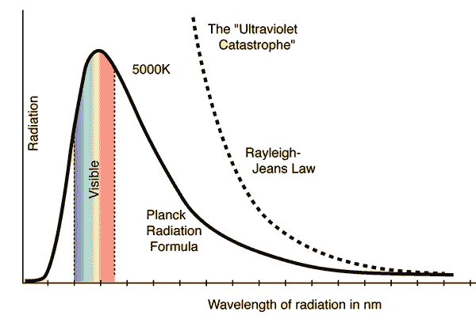**

**图片来自[物理-堆栈-交换。](https://physics.stackexchange.com/questions/309043/red-hot-objects-the-ultraviolet-catastrophe)**

**作为一个例子，强调像 [***紫外线灾难***](https://en.wikipedia.org/wiki/Ultraviolet_catastrophe) 这样的先验问题并不是多余的，在这些问题中，人们试图找到一种定律来模拟理想 [***黑体***](https://en.wikipedia.org/wiki/Black_body) 发出的辐射量。这种物理物体吸收与其波长相关的各种辐射。正如你在上面的图表中看到的，这个函数代表了一个物体发出的*【光】*的波长，对应于其开尔文度的温度。例如，如果物体不够热，它会发出红外光，如果没有合适的检测设备，人类就看不到红外光。相反，温度在图表的*“可见”*条纹上的物体会产生我们可以感知为光的辐射。例如，红热的铁与中子星的颜色不同。当科学家试图用经典力学建立这个函数时，提出了两种主要方法； [***瑞利-杰恩斯***](https://en.wikipedia.org/wiki/Rayleigh%E2%80%93Jeans_law) 定律和 [***维恩***](https://en.wikipedia.org/wiki/Wien%27s_displacement_law) 定律，都未能准确预测相关性。其中一个在接近低波长值时趋于无穷大，另一个分别在波长接近较高值时趋于无穷大。**

**由于传统的物理学解决方案没有成功， [***马普***](https://es.wikipedia.org/wiki/Max_Planck)*决定通过建立一个能够精确匹配大部分函数值的分布，然后解读其物理意义，从而在数学上解决问题。被认为是量子力学之父的普朗克得出了能量实际上是量子化的结论，这一物理学新分支因此而得名。简而言之，这意味着光*(以及能量)*被投射并吸收在被称为 [***量子***](https://en.wikipedia.org/wiki/Planck_constant) 的微小*【包】*中，而不是像人们认为的那样连续不断。***

**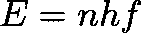**

**能量等于普朗克常数 h 乘以原子振荡器的频率，再乘以整数 n**

**最后，在量子力学诞生后，由于像[光电效应](https://en.wikipedia.org/wiki/Photoelectric_effect)或[双缝实验](https://en.wikipedia.org/wiki/Double-slit_experiment)这样的额外实验，自然开始被更好地理解。此外，它还鼓励理论发展，如 ***玻尔的*** 假设或 ***德布罗意的*** 假设。**

## **基本原则**

**如果你想了解更多关于量子力学的起源，可以去参考资料部分。但现在，我们将探索量子计算实用部分背后的理论。**

**大量的知识是基于 ***电子*** 的行为，从速度到 ***自旋。*** 对这些参数进行建模并准确了解其属性对于在离原子如此近的距离进行操作至关重要，在这种情况下，人类的感知和*偏差*在解释实验和理论证明有时奇怪的结果方面发挥了有意义的作用。为了介绍这个已知的“奇怪”工作，让我们回答这个问题； ***什么是电子？。*** 自从电子为人所知以来，它就被定义为与质子或中子一起构成原子的亚原子粒子。了解它们最令人兴奋的特征是它们的负电荷，与质子的正电荷相反，它让位于静电相互作用和亚原子力，如电磁力，负责将电子保持在原子核周围。**

**然而，当我们试图知道电子的位置、速度或角动量时，电子变得很奇怪，这也与流行的 [***自旋***](https://en.wikipedia.org/wiki/Spin_(physics)) 或内在角动量有关，在这种情况下可以是向上或向下的。所以，如果我们问自己关于电子在空间中的位置或速度，我们将不得不处理 [***海森堡的***](https://es.wikipedia.org/wiki/Werner_Heisenberg) [***不确定性***](https://en.wikipedia.org/wiki/Uncertainty_principle) 原理，形式化为:**

**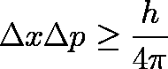**

**位置 **x** 和动量 **p** 的增量代表这些变量的不确定性。**

**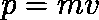**

**因为动量是质量乘以速度**

**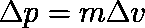**

**我们可以用两边的增量重写它**

**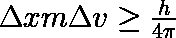****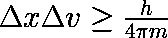**

**并在不确定性表达中进行替代。**

**上述公式将普朗克常数*与位置*和速度 ***v*** 和联系起来，告诉我们不能同时测量这两个变量，因为它们是 [***共轭***](https://en.wikipedia.org/wiki/Conjugate_variables)**(并由* [连接)在这种情况下，你会知道它的位置，但不知道它的速度，因为你无法确定它下一步会移动到哪里，所以你对速度有不确定性。相反，如果你增加相机的曝光时间，你将能够确定地知道它的速度，但这个时间位置将无法确定。](https://youtu.be/spUNpyF58BY)*****

**这种现象发生与 ***所有*** 可能的 ***共轭变量*** 我们可以从电子中提取，不仅仅是前面提到的那些；位置和动量，能量和时间，也就是说，这种无法知道像位置这样简单参数的想法似乎违反直觉，但我们必须记住，我们正在处理所有物质的最基本组成部分。宏观世界也受量子定律支配，但正如亚里士多德所说:**

> **整体大于各部分的总和**

**以基本力学的解释来结束，重要的是要有这样的想法，即物质并不总是表现为粒子，而是表现为波。DeBroglie 在 1924 年提出了这个假设，其核心在于特定波长与粒子的关联取决于其动量*(速度)。***

**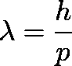**

**波长取决于动量 **p****

**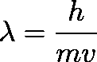**

**这一个，相反，取决于速度 **v****

**这个假设是通过像双缝实验这样的实验而成为可能的，在这个实验中，量子尺度的测量有着深远的影响。要知道为什么会发生这种情况，我们必须注意到，从本质上讲，电子处于叠加态，通过叠加态，它们可以同时位于属于空间特定区域的所有位置。只要我们不去测量，这个叠加态总是守恒的。如果我们试着观察它的实际位置，状态会坍缩，电子会将自己置于受其 [***波函数*** 影响的空间中的一点。](https://youtu.be/OFwskHrtYQ4)**

**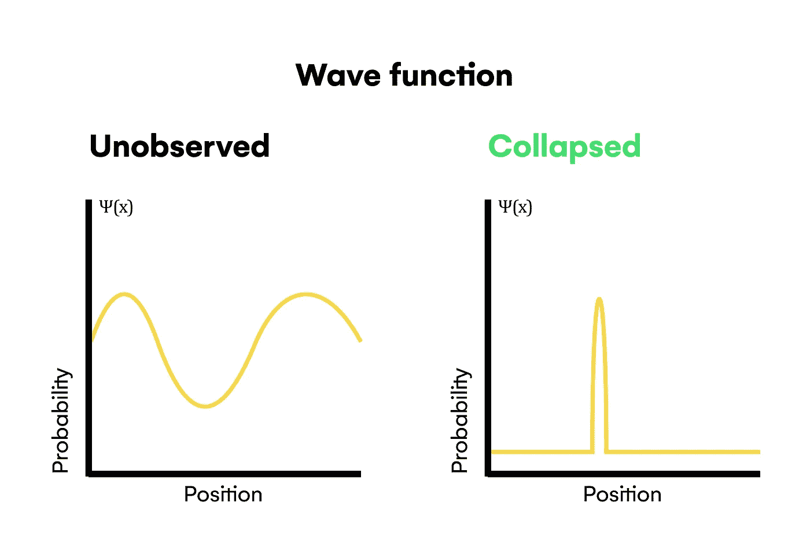**

**作者图片**

**正如你在上面看到的，波函数有一个具体的形状，它封装了在空间中的一个点上找到电子的概率*(根据* [***玻恩法则***](https://youtu.be/VHlqY44fOg0) *)* ，当找到电子的概率越大，找到电子的概率就越高，反之则越低。然后，在测量一个精确的位置并打破叠加态后，波函数坍缩成另一个函数，其峰值在检测到电子的点上。这个数学过程有几种物理解释，如 [***哥本哈根解释***](https://youtu.be/OjrEudqgZ1M)*或 [***多世界***](https://youtu.be/kxvQ3Wyw2M4) 解释。***

**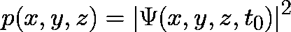**

**特定时间位置测量的概率密度函数是波函数的平方模数**(玻恩法则)****

**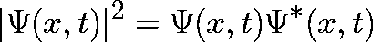**

**如波函数***ψ****定义在复平面上，其平方模等于该函数乘以其* [***复共轭***](https://en.wikipedia.org/wiki/Complex_conjugate) 。**

**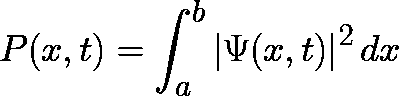**

**在空间中的两点 **a** 和 **b** 之间找到电子的概率**

**知道电子的位置对于及时了解它的行为是必要的。但在此之前，我们需要找到它的波函数***ψ(x，y，z，t)*** ，而负责让那成为可能的形式模型是 [***薛定谔方程***](https://www.electrical4u.com/schrodinger-wave-equation/) 。基本上，它是一个线性微分方程，用来得到一个量子系统的适当波函数，这个量子系统可以由单个亚原子粒子或整个复杂分子组成。这些系统中的每一个都会有不同的薛定谔方程的表达式，造成这种可变性的原因是 [***哈密顿算符***](https://psiberg.com/hamiltonian-operator/#:~:text=The%20Hamiltonian%20operator%20is%20a,of%20a%20quantum%20mechanical%20system.) ，这个方程的内核:**

**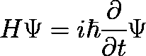**

**哈密顿算符 ***H*** *作用于波函数***ψ***等于虚数单位* ***i*** *乘以普朗克约化常数* ***h*** *乘以波函数对时间的偏导数。***

**哈密顿算符是一个物理算符，它将 [***机械能守恒***](https://en.wikipedia.org/wiki/Mechanical_energy) 原理引入到方程中，工作方式类似于经典物理。**

****

**例如，如果我们有一个 ***氢*** 原子作为一个量子系统，我们想知道其中一个电子的运动，则哈密顿量将是:**

**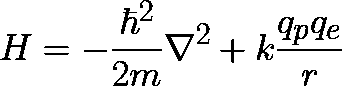****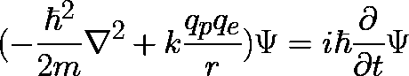**

**求解氢原子量子系统的结式薛定谔方程**

**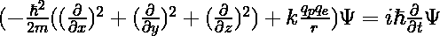**

**相同的表达式，但扩展了 [**纳布拉运算符**](https://es.wikipedia.org/wiki/Nabla) 。**

**由于这个表达式可以根据量子系统变得更大和更复杂，有几种方法可以得出波函数的合适解；请访问以下资源，详细了解物理学家如何解决这个问题:**

## **经典计算**

**我们已经看到，经典计算正在逼近原子极限，带来了几个后果，例如， [***量子隧道效应***](https://en.wikipedia.org/wiki/Quantum_tunnelling#:~:text=Quantum%20tunnelling%2C%20also%20known%20as,barrier%20height%20and%20barrier%20width.) ***。为了理解它的含义，让我们首先以最简单的形式定义什么是计算机。*****

**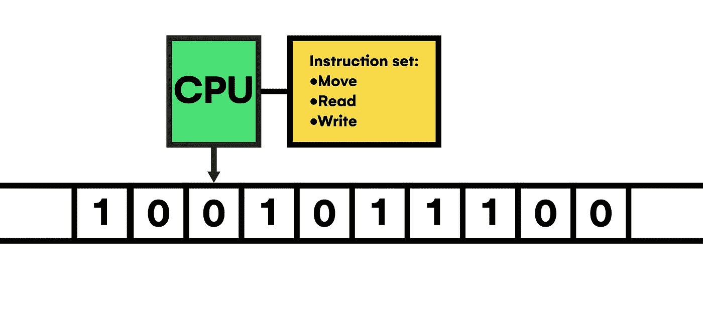**

**作者图片**

**又称为通用 [***【图灵机】***](https://youtu.be/dNRDvLACg5Q) ，计算机由一列包含有 [***离散***](https://en.wikipedia.org/wiki/Continuous_or_discrete_variable) 值的单元组成，正式表示为 ***0*** 或 ***1、*** 称为主 ***内存。*** 在这个存储器之外，一个头可以通过存储器切片，在一组指令*(程序)* 的指导下读取和修改单元的值，这些指令以二进制表示编码并存储在存储器中。**

**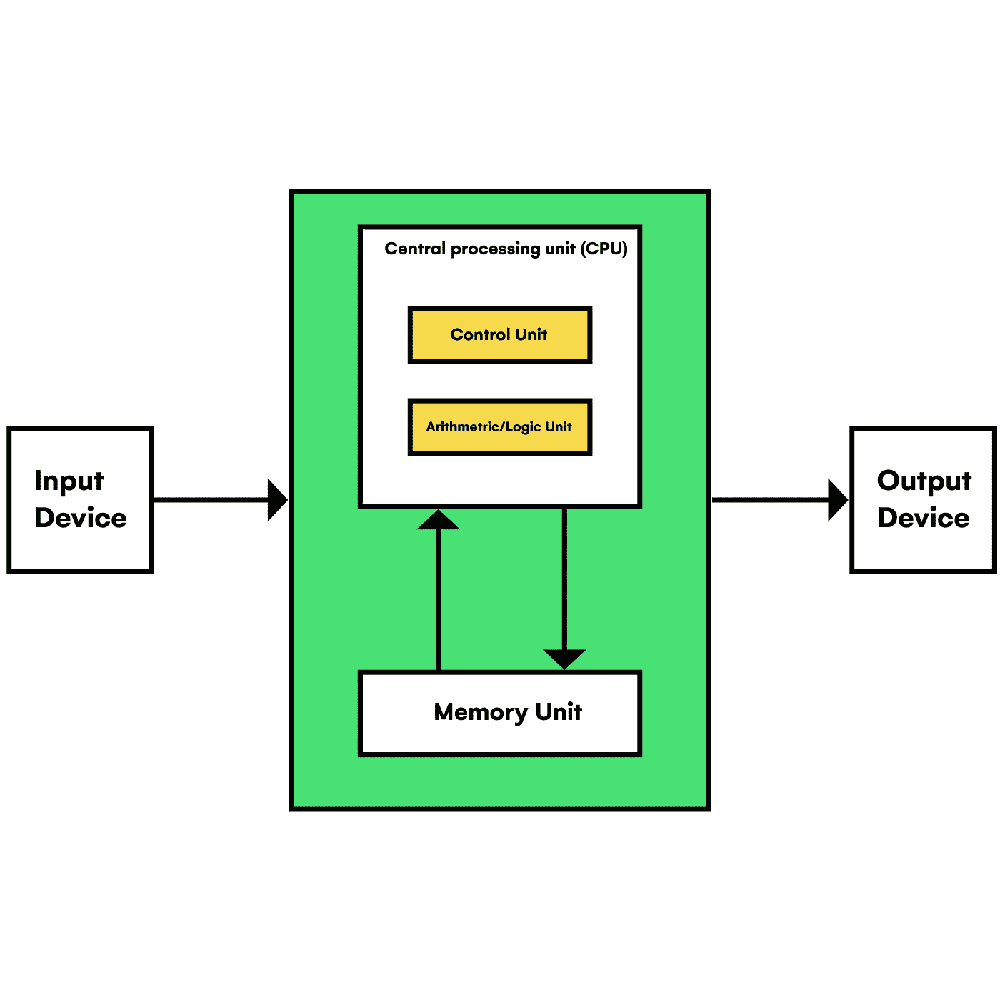**

**作者图片**

**但实际上，计算机的形式表示是由 [***冯诺依曼架构***](https://youtu.be/Ml3-kVYLNr8) 带入现实的。的确，单元列表是由 ***RAM*** 和 ***SSD/HDD*** 磁盘驱动器构成的。头部是一个处理单元 ***CPU*** *(有时结合一个****GPU****进行可并行处理)*由 [***双稳态***](https://www.sciencedirect.com/topics/engineering/bistable-circuit#:~:text=Digital%20Electronic%20Circuits&text=This%20bistable%20circuit%20has%20two,can%20override%20the%20clock%20input.) 和 [**组合**](https://www.electronics-tutorials.ws/combination/comb_1.html) 电路组成，能够执行简单的操作，如求和、比较数量、计数或寄存。同时，在文档中可以看到，这些电路包含了逻辑门， [***布尔代数***](https://en.wikipedia.org/wiki/Boolean_algebra) ***的积木。*** 虽然，如果我们看得更接近原子尺度，我们会看到 [***晶体管***](https://es.wikipedia.org/wiki/Transistor) 的组合代表逻辑门的工作。**

**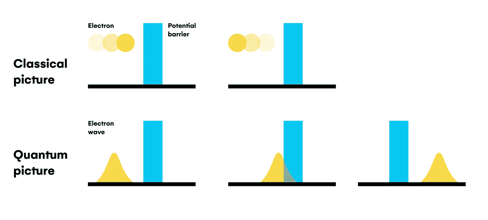**

**作者图片**

**由于晶体管充当允许或阻止电流*(电子)*流动的屏障，有时电子行为的粒子波二象性导致电流泄漏，这一过程被表示为 [***【量子隧穿】***](https://en.wikipedia.org/wiki/Quantum_tunnelling) ，其中电子的叠加态允许它“同时”处于屏障的两侧*，尽管一侧的概率值比另一侧低，如上所述。这种效果暗示了执行问题和数据损坏，大多用纠错算法解决，突出了计算机科学中的 [***汉明码***](https://youtu.be/X8jsijhllIA)*作为这些算法的起点。****

## ***量子计算***

***由于其硬件必须保持的 [***极端条件***](https://quinfog.hbar.es/research/quantum-computing-hardware/#:~:text=the%20needed%20temperatures%20of%20a%20few%20miliKelvin) ，量子计算中对强大纠错算法的需求明显大于其他计算机科学系统。***

**这些类型的计算之间的主要差别在于包含离散信息的每个存储单元的性质。虽然量子计算机使用相同的二进制数据表示，但它们主要利用 ***叠加*** 和 ***纠缠*** 量子现象来*扩展*对处理[***NP***](https://en.wikipedia.org/wiki/NP_(complexity))*复杂问题至关重要的信息处理能力，比经典计算机高效得多。***

***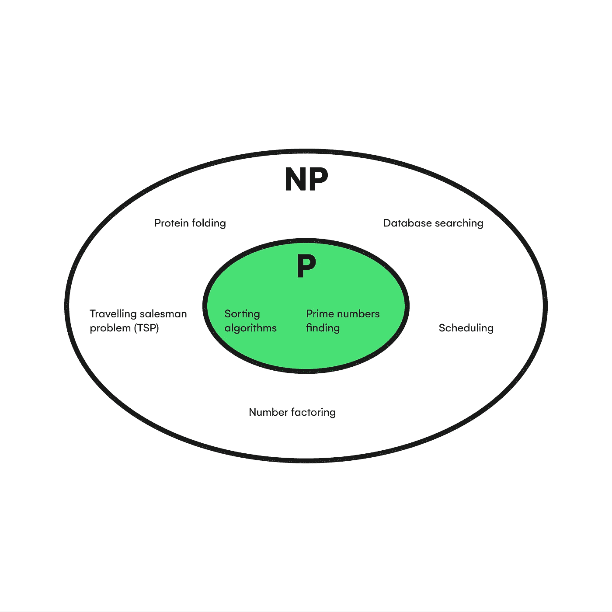***

***作者图片***

***简而言之，虽然经典位*(存储单元)*可以处于两种基本状态之一，但量子位*(量子位)*具有标记为 ***叠加*** 的第三种状态，其中它可以采用基本状态的任何线性组合，具有不确定的值，直到测量*(打破叠加状态的***和*【******

**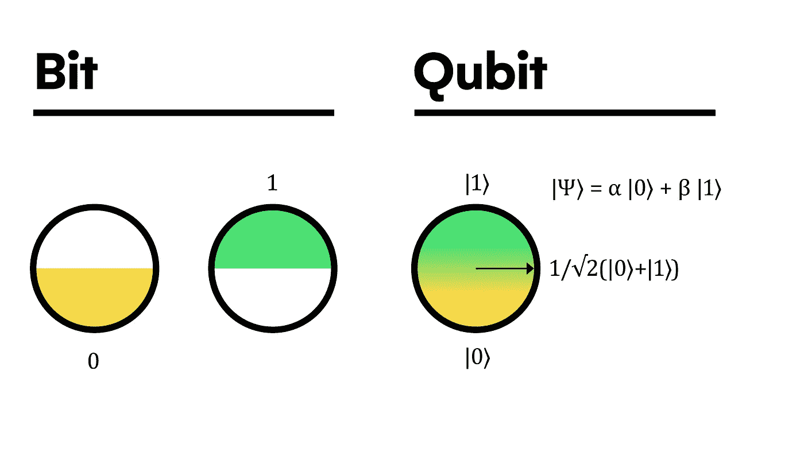**

**作者图片**

**形式上，量子位的状态用 [***狄拉克符号***](https://en.wikipedia.org/wiki/Bra%E2%80%93ket_notation) ***来描绘。*** 由此， [***量子位***](https://arxiv.org/pdf/1312.1463.pdf)|ψ⟩的状态由两个复系数α和β分别乘以基本 states|0⟩ and|1⟩的组合构成。因此，如果我们在一个称为 [***布洛赫球体***](https://youtu.be/n0ykTI317_Y) 的球体上绘制这些信息，我们可以更好地了解量子位实际上是什么。**

**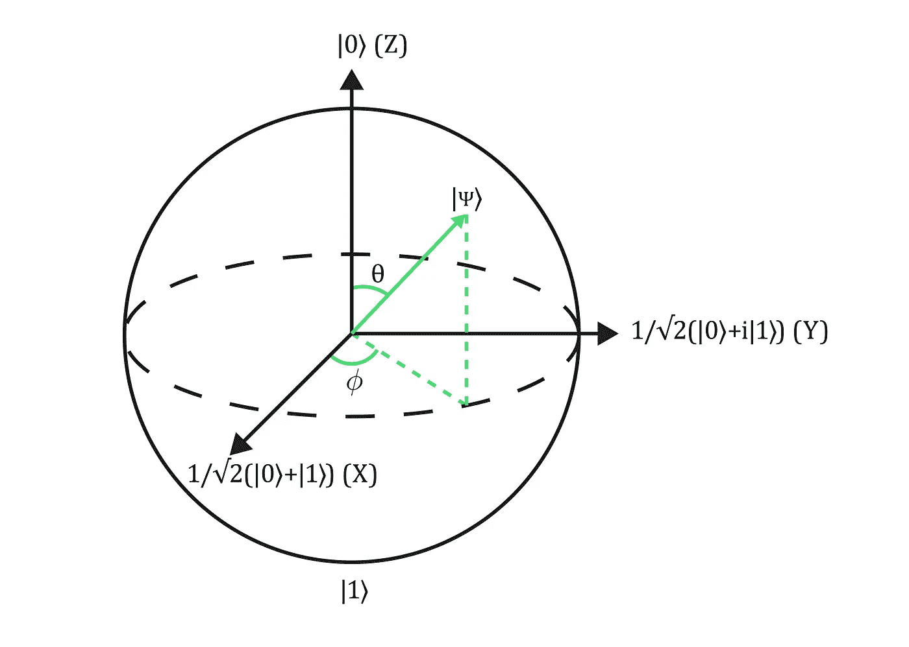**

**作者图片**

**可以推断，量子位离|0⟩越近，对应的系数越大，|1⟩.也一样因此，我们可以观察到，当打破叠加态时，这些数包含了获得特定基态的概率。**

**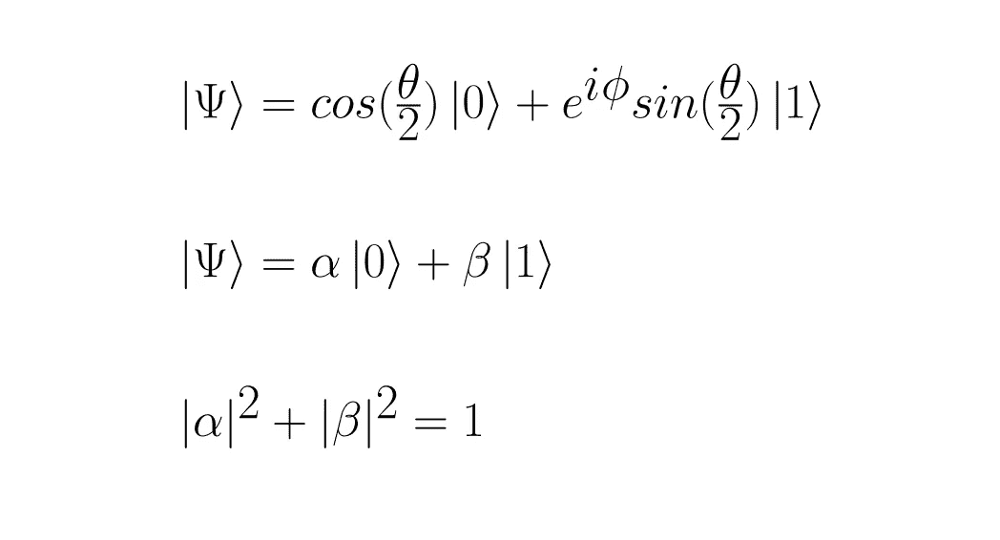**

**所有复系数的平方模的归一化概率**

**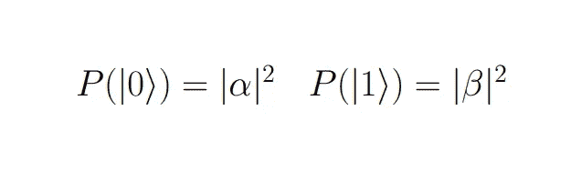**

**到目前为止，这种存储数据的方式似乎过于复杂。尽管如此，量子计算机在解决 ***NP-Hard*** 问题(如分解一个大数)时如此快速的关键是在一个量子系统中有多个量子位。尽管硬件问题的增加和对更鲁棒的纠错算法的需求，多量子位系统通过同时线性组合所有系统量子位的所有可能的基本状态值来利用它们的*。所以有了 ***n*** 量子比特，你就有了 ***2*** 到 ***n*** 系数*(等价经典比特)*，它们都是确定量子系统叠加态所必需的。***

**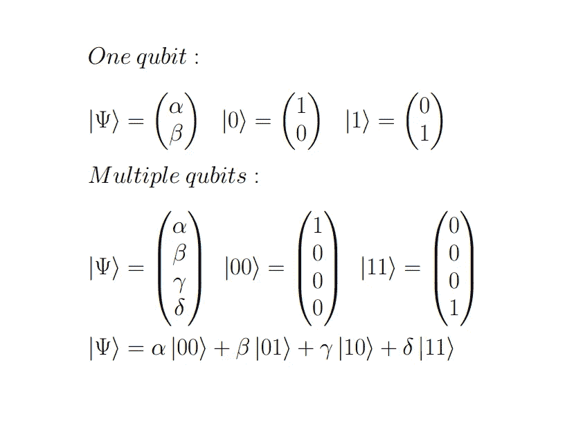**

**量子态的张量表示**

**在下一节，量子算法将帮助你最好地理解叠加效用。**

# **量子算法**

**几年前就已经知道，量子计算机能够用 [***肖尔算法***](https://youtu.be/lvTqbM5Dq4Q) 破解 ***RSA*** 加密协议，并且足够强大的计算机。但是， ***为什么*** 在解决此类任务时是叠加键？。答案很简单；量子计算机可以通过叠加多个量子位来产生一个问题的所有可能的答案，并通过破坏性干扰叠加来丢弃*【错误】*的解决方案，就好像它们是 ***【波】*** 。**

**为了构建量子算法，类似于经典计算，我们需要通过在电路中顺序布置逻辑门，将初始状态的量子位转换为最终状态。**

**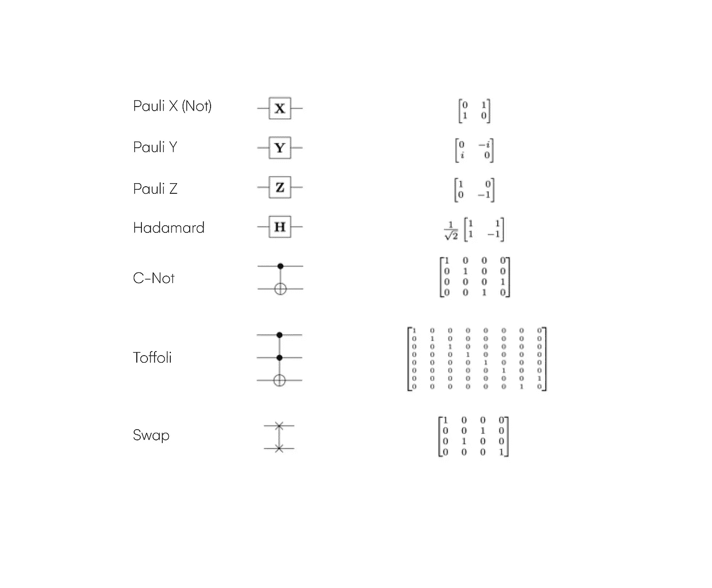**

**作者图片**

**上面，你可以看到大多数算法中的前导门。比如 ***X 门*** 就是逻辑否定的等价；同时， ***哈达玛***/**/*C-Not***门分别引入叠加和纠缠。你可以在 Qiskit 的 [***官方指南***](https://qiskit.org/textbook/ch-states/single-qubit-gates.html)*中了解更多关于它的工作原理和与古典门的关系的完整解释。然而，有必要强调的是，所有量子门都是可逆酉矩阵，使得量子计算过程 ***可逆*** 。此外，量子计算机是唯一可以用如此简单的电路生成真正随机数的设备:***

**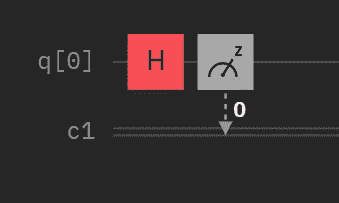**

**Hadamard 门产生叠加，得到 0 或 1 的概率为 50-50**

**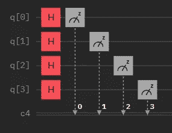**

**扩展随机数生成器**

**作为超越经典计算的效率提升的一个例子，假设你有一个布尔函数 f(x) {0，1}→{0，1}，你想知道它是 ***常数*** 还是平衡的*。使用传统的计算机，你可以计算 0 和 1 中的函数，并比较结果，如果这个函数计算量不大的话。如果是，你可能需要使用 [***Deutsch 的算法***](https://en.wikipedia.org/wiki/Deutsch%E2%80%93Jozsa_algorithm#:~:text=is%20balanced.-,Deutsch%27s%20algorithm,-%5Bedit%5D) ，通过避免对函数的二次求值，来成倍提高你的程序的时间性能。***

*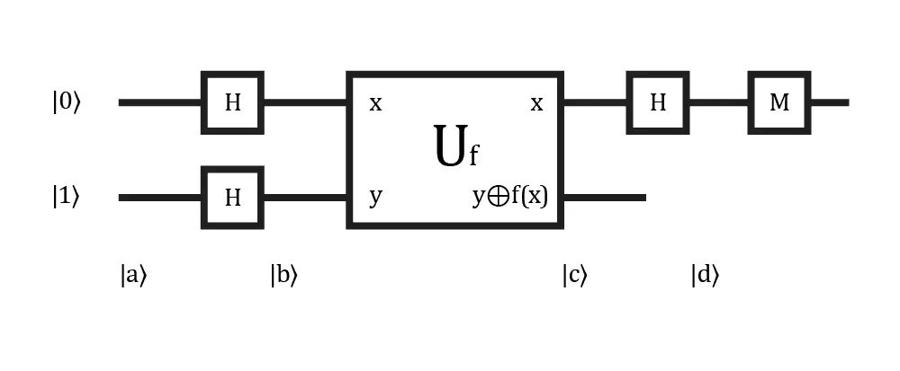*

****德语*** *问题量子电路。**

*形式上， [***证明了***](https://youtu.be/DyINHZoOcLQ) 如果 f(x)不变，过程结束时上量子位的状态将是|0⟩，否则是|1⟩。但是，为了清楚地理解算法在做什么，我们可以把这个过程分成四个部分。首先，所有量子位都被初始化为|a⟩，并与 ***阿达玛*** 门|b⟩.设置成叠加态然后，*充当一个 ***C-Not*** 门来遍历输入值的所有可能的组合，将该函数作为主成分添加到叠加处理|c⟩.中最后|d⟩，另一个 ***哈达玛*** 打破第一个量子比特的叠加，测量完成任务。**

## **量子机器学习**

**这一部分值得特别注意，因为它仍在开发中，并且根据问题类型有不同的方法。因此，这里我们将只关注神经网络的基础知识，这是不久的将来最突出的技术。**

**首先，我们需要知道机器学习和量子计算领域之间的交集根据数据和算法的类型产生了四种工作方法。**

****

**作者图片**

**根据图表，我们可以拥有 ***混合系统*** ，其中经典和量子计算机共同工作，对数据进行编码，并优化机器学习模型。当然，量化一个或两个过程有它自己的优点。例如，如果您的经典模型太深并且在训练时遍历成本太高，您可能希望使用量子模型的 ***叠加*** 来提高执行时间，将其他任务(如参数调整)留给经典设备。**

**由于数据对于维持这一工作流程至关重要，因此大量的统计流程旨在从数据中提取模式。但是神经网络值得强调，因为它们在定理 [***通用逼近定理***](/can-neural-networks-really-learn-any-function-65e106617fc6) ***中证明了优异的泛化能力。*** 简而言之，它们是可微分的数学模型，其中使用训练过程来修改它们的参数，使得模型符合输入数据集的模式。**

****

**作者图片**

**从上面这篇</advanced-waste-classification-with-machine-learning-6445bff1304f>*的文章中可以看出，神经网络试图通过串联多层包含可变参数的 [***感知器***](/what-the-hell-is-perceptron-626217814f53)**【神经元】*来模仿大脑的功能。然后，为了测试模型在拟合特定输入数据集方面的有效性，在每次训练迭代中计算并最小化成本函数，以实现一个*“智能”*模型，该模型稍后在训练数据之外执行推断。****

****

**作者图片**

**在量子神经网络的情况下，主要的区别是为每个训练迭代计算模型，通过依靠量子 ***叠加*** 和纠缠来加速该过程及其泛化能力。在这里，你必须将经典数据输入到一个量子电路中，用来自|0⟩的***【x】***门块初始化量子位对数据进行编码。接下来，正确格式化的数据以叠加状态被馈送到可微分模型*，并被经典地测量以获得用于最小化成本函数和调整模型参数 ***(θ)的输出。******

**这是量子机器学习的 ***本质*** 的一个简化例子。不过既然是这么广阔的领域，你可以在这里继续了解 [***。***](https://youtube.com/playlist?list=PLOFEBzvs-VvqJwybFxkTiDzhf5E11p8BI)**

# **应用程序**

**从根本上说，人类几乎从诞生之日起就一直试图在经典计算机上模拟像原子这样的物理元素。然而，当处理具有许多分子的系统时，从计算的观点来看，这个任务变得指数地昂贵。由于这个原因，量子计算机已经开始用于各种研究项目，旨在忠实地模拟物质之间的相互作用，以获得新的知识，并开发在市场上具有优异性能的产品和新的通信方式，这将对我们的生活产生臭名昭著的影响。**

**关于气候变化和 ***环境保护*** ，通过成功纳入量子物理定律来模拟一个物理系统意味着创造新材料，如石墨烯或任何其他其特性允许其完全回收的材料。例如，塑料是地球上产生残留物的主要材料，可以被另一种材料替代，这种材料的特性有助于其适当的再利用/分解，或者经过修改使其更具可持续性。此外，由于地球已经受到某种程度的污染，依赖经典机器学习模型对 ***废物进行分类*** 的回收厂将受益于使用 ***量子*** 模型。他们将提高效率、工作效率和准确性，避免废物堆积问题。**

**材料可能会对自然产生影响，但二氧化碳排放肯定是 ***温室效应*** 和气候变化的主要加速器成分之一。在这方面，通过解决***【TSP】、*** 等问题，量子计算机非常适合进行路线优化，从而减少车辆排放。然而，它们提供的自动化优势和高耐用性电池的可能发展是几乎所有行业最感兴趣的应用，因为它们将结束全球有害排放。所有这一切都假设少数产业 ***因那些改进*【石油公司，以及许多其他公司】而受到伤害**** *不会为了纯粹的经济目的*而强行阻止技术的适当发展。****

***结合其他应用，如推出新药、改进保健技术、治愈癌症、实现意识建模，以及更好地了解人类*大脑和 DNA，像[***join us 4 the planet***](https://joinus4theplanet.org/)这样的倡议愿意使用颠覆性技术来提高对可持续消费的认识，并为旨在保护我们环境的技术发展做出贡献。****

# **结论**

**回到题目的问题，我们可以说量子计算可以对我们生活的几乎任何领域做出贡献，包括应对气候变化。此外，我们必须注意到，这是一种需要经典框架才能在解决复杂任务时获得有益结果的范式。因此，考虑到它是对仅适用于繁重进程的经典计算的补充，我们可以得出结论，仍然有许多工作要做，我们将不得不一起做*，以便量子计算成为一个全面但安全、可理解和改变游戏规则的工具。***