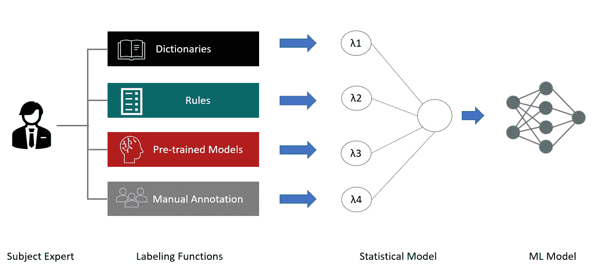

# 弱标记能代替人类标记的数据吗？

> 原文：<https://towardsdatascience.com/can-weak-labeling-replace-human-labeled-data-bfd06766a816>

## 弱监管与全监管的逐步比较


[斯科特·格雷厄姆](https://unsplash.com/@homajob?utm_source=unsplash&utm_medium=referral&utm_content=creditCopyText)在 [Unsplash](https://unsplash.com/s/photos/learning?utm_source=unsplash&utm_medium=referral&utm_content=creditCopyText) 上拍照

近年来，由于深度学习模型的出现，自然语言处理(NLP)取得了重大进展。从智能聊天机器人到从非结构化文档中自动提取数据，使用 NLP 的现实应用越来越普遍，并为许多公司带来了真正的商业价值。然而，这些模型仍然需要手动标记的训练数据来微调它们以适应特定的业务用例。收集这些数据可能需要几个月的时间，标记这些数据甚至需要更长的时间，尤其是在需要领域专家并且文本中有多个类需要识别的情况下。可以想象，这可能成为许多企业的真正采用障碍，因为主题专家很难找到，而且价格昂贵。

为了解决这个问题，研究人员采用了弱形式的监督，例如使用启发式生成的标签函数和外部知识库来以编程方式标记数据。虽然这种方法很有希望，但与完全监督相比，它对模型性能的影响仍不清楚。

在本教程中，我们将从职位描述中生成两个训练数据集:一个通过弱标记生成，另一个通过使用[ubai](https://ubiai.tools)手工标记生成。然后，我们将比较模型在 NER 任务中的表现，该任务旨在从职位描述中提取技能、经验、文凭和文凭专业。数据和笔记本都在我的 [github repo](https://github.com/walidamamou/weak_labeling.git) 里。

# 监管不力

在弱监督的情况下，用户定义一组函数和规则，将有噪声的标签(即可能不正确的标签)分配给未标记的数据。标记功能可以是模式的形式，例如正则表达式、字典、本体、预先训练的机器学习模型或群体注释。

弱监督流水线具有三个组件:(1)用户定义的标签函数和启发式函数，(2)统计模型，其将来自函数的标签作为输入，并输出概率标签，以及(3)机器学习模型，其在来自统计模型的概率训练标签上被训练。



作者图片

# Skweak

在本教程中，我们将使用 Skweak 库执行弱标记。根据库创建者[1]:

> [Skweak 是一个基于 Python 的软件工具包，它使用弱监督为这个问题提供了一个具体的解决方案。](https://github.com/NorskRegnesentral/skweak) `[skweak](https://github.com/NorskRegnesentral/skweak)` [是围绕一个非常简单的想法构建的:我们定义了一组*标注函数*来自动标注我们的文档，然后*聚集*它们的结果来获得我们的语料库的标注版本，而不是手工标注文本。](https://github.com/NorskRegnesentral/skweak)

要了解更多关于 skweak 库的信息，请阅读原文“ [skweak:弱监管使 NLP 变得容易](http://arxiv.org/abs/2104.09683)”。

# 标签功能

为了执行弱标注，我们将编写一组函数，对与我们想要标注的语料库相关的字典、模式、知识库和规则进行编码。在本教程中，我们将添加一些功能，这些功能将从职位描述中自动标记实体技能、经验、文凭和文凭 _ 专业。将这些函数应用于未标记的数据后，将使用 skweak 库提供的统计模型将结果聚合到单个概率注记图层中。

首先，我们将创建一个 skills Skills_Data.json 字典，并将其添加到我们的函数 lf3 中来注释技能实体。该词典是从公开可用的数据集中获得的。

```
*#Create_Skills_Function_from_dictionary*
**import** spacy**,** re
**from** skweak **import** heuristics, gazetteers, generative, utils
tries**=**gazetteers**.**extract_json_data('data/Skills_Data.json')
nlp**=**spacy**.**load('en_core_web_md' , disable**=**['ner'])
gazetteer **=** gazetteers**.**GazetteerAnnotator("SKILLS", tries)
lf3**=** gazetteers**.**GazetteerAnnotator("SKILLS", tries)
```

对于经验实体，我们使用正则表达式模式来获取经验的年数:

```
*#Create_Function_Foe_Experience_Detection(Use Regex)*
**def** experience_detector (doc):
    expression**=**r'[0-9][+] years'
    **for** match **in** re**.**finditer(expression, doc**.**text):
        start, end **=** match**.**span()
        span **=** doc**.**char_span(start, end)
        **if**(span):
            **yield** span**.**start , span**.**end ,  "EXPERIENCE"
lf1 **=** heuristics**.**FunctionAnnotator("experience", experience_detector)
```

对于实体 DIPLOMA 和 DPLOMA_MAJOR，我们使用来自 [Kaggle](https://www.kaggle.com/datasets/zusmani/pakistanintellectualcapitalcs) 和 regex:

```
**with** open('Diploma_Dic.json' , 'r' , encoding**=**'UTF-8') **as** f :
    DIPLOMA**=**json**.**load(f)

print(len(DIPLOMA))
**with** open ('Diploma_Major_Dic.json' ,encoding**=**'UTF-8') **as** f :
    DIPLOMA_MAJOR**=**json**.**load(f)*#Create Diploma_Function*
**def** Diploma_fun(doc):
    **for** key **in** DIPLOMA:
                **for** match **in** re**.**finditer(key , doc**.**text , re**.**IGNORECASE):
                    start, end **=** match**.**span()
                    span **=** doc**.**char_span(start, end)
                    **if**(span):
                        **yield** (span**.**start , span**.**end ,  "DIPLOMA")

lf4 **=** heuristics**.**FunctionAnnotator("Diploma", Diploma_fun)*#Create_Diploma_Major_Function*
**def** Diploma_major_fun(doc):  
    **for** key **in** DIPLOMA_MAJOR:
                **for** match **in** re**.**finditer(key , doc**.**text , re**.**IGNORECASE):
                    start, end **=** match**.**span()
                    span **=** doc**.**char_span(start, end)
                    **if**(span):
                        **yield** (span**.**start , span**.**end ,  "DIPLOMA_MAJOR")

lf2 **=** heuristics**.**FunctionAnnotator("Diploma_major", Diploma_major_fun)*#Create_Function_For_diploma_major(Use Regex)*
**def** diploma_major_detector (doc):
    expression**=**re**.**compile(r"(^.*(Ph.D|MS|Master|BA|Bachelor|BS)\S*) in (\S*)")
    **for** match **in** re**.**finditer(expression, doc**.**text):
        start, end **=** match**.**span(3)
        span **=** doc**.**char_span(start, end)
        **if**(span):
            **yield** span**.**start , span**.**end ,  "DIPLOMA_MAJOR"

lf5 **=** heuristics**.**FunctionAnnotator("Diploma_major", diploma_major_detector)
```

我们将所有函数聚合在一起，并使用 Skweak 的统计模型来找到自动标记数据的最佳协议。

```
*#create_corpus_annotated_to_train_the_model*
docs**=**[]
**with** open('Corpus.txt' , 'r') **as** f :
    data**=**f**.**readlines()
    **for** text **in** data:
        **if** (len(text) **!=**1):
            newtext**=**str(text)
            doc**=**nlp(newtext)
            doc**=**lf1(lf2(lf3(lf4(lf5(doc)))))
            print(doc**.**spans)
            docs**.**append(doc)**from** skweak **import** aggregation
model **=** aggregation**.**HMM("hmm", ["DIPLOMA", "DIPLOMA_MAJOR" , "EXPERIENCE" , "SKILLS"])
docs **=** model**.**fit_and_aggregate(docs)
```

我们终于准备好训练模型了！我们选择训练 spaCy 模型，因为它很容易与 skweak 库集成，但我们当然可以使用任何其他模型，例如变压器。github repo 中提供了带注释的数据集。

```
**for** doc **in** docs:
    doc**.**ents **=** doc**.**spans["hmm"]
utils**.**docbin_writer(docs, "train.spacy")**!**python -m spacy train config.cfg --output ./output --paths.train train.spacy --paths.dev train.spacy
```

现在，我们已经准备好使用两个数据集来运行训练，完全手工标记和弱标记，具有相同数量的文档:

**手工标注数据集模型性能:**

```
**================================== Results ==================================**

TOK     100.00
NER P   74.27 
NER R   80.10 
NER F   77.08 
SPEED   4506  

 **=============================== NER (per type) ===============================**

                    P       R       F
DIPLOMA         85.71   66.67   75.00
DIPLOMA_MAJOR   33.33   16.67   22.22
EXPERIENCE      81.82   81.82   81.82
SKILLS          74.05   83.03   78.29
```

**弱标签数据集模型性能:**

```
**================================== Results ==================================**

TOK     100.00
NER P   31.78 
NER R   17.80 
NER F   22.82 
SPEED   2711  

 **=============================== NER (per type) ===============================**

                     P       R       F
DIPLOMA          33.33   22.22   26.67
DIPLOMA_MAJOR    14.29   50.00   22.22
EXPERIENCE      100.00   27.27   42.86
SKILLS           33.77   15.76   21.49
```

有趣的是，人工标记数据集的模型性能明显优于弱标记数据集，有监督数据集的模型性能为 0.77，弱监督数据集的模型性能为 0.22。如果我们深入挖掘，会发现性能差距在实体层面依然成立(体验实体除外)。

通过添加更多的标注功能，如人群标注、模型标注、规则、字典，我们当然可以预期模型性能的改善，但还不清楚性能是否会与主题专家标注的数据相匹配。第二，找出正确的自动标记功能是一个迭代和特别的过程。当处理高度技术性的数据集(如医疗记录、法律文档或科学文章)时，这个问题变得更加严重，在某些情况下，它无法正确捕获用户想要编码的领域知识。

# 结论

在本教程中，我们演示了由弱标记数据和手动标记数据训练的模型性能之间的逐步比较。我们已经表明，在这个特定的用例中，弱标记数据集的模型性能明显低于完全监督方法的性能。这并不一定意味着弱标记没有用。我们可以使用弱标注对数据集进行预标注，从而引导我们的标注项目，但我们不能依赖它来执行完全无监督的标注。

在 Twitter 上关注我们 [@UBIAI5](https://twitter.com/UBIAI5) 或[订阅这里](https://walidamamou.medium.com/subscribe)！

**参考文献:**

1.  [https://github.com/NorskRegnesentral/skweak](https://github.com/NorskRegnesentral/skweak)