# 你能只用高中数学编写一个神经网络吗？

> 原文：<https://towardsdatascience.com/can-you-code-a-neural-network-using-only-high-school-mathematics-ac9ad80f52f7>

## 回到基础——仅使用 NumPy 编码神经网络

最近，我在向母亲解释神经网络的概念；我无法超越通常的输入、隐藏层、输出等比喻。我不认为我在这方面做得很好，这让我思考——我自己理解他们吗，还是我只是假装理解他们？

我拿了一张纸，画了几张相连网络的图表，在一个 jupyter 笔记本上用 Keras 层对整个网络进行了编码。我用了不到 10 行代码编写了一个多层网络，并且运行良好。

虽然我不满意，但感觉我只是在假装我理解这个概念，如果我继续深入下去，我肯定会犹豫。我已经无数次地阅读了神经网络的工作原理，并且可以肤浅地解释它们是如何工作的，还可以快速得出一些数学公式，但是我真的理解它们以便我可以清晰地向任何人解释吗？这个问题在那天晚上成了众矢之的。我决定回到基本原则，只用高中数学来编码整个自然网络。没有瞎忙活，没有使用 PyTorch、TensorFlow 或 Keras 的任何花哨框架。

这应该是可行的！


埃利斯·陈嘉炜在 [Unsplash](https://unsplash.com?utm_source=medium&utm_medium=referral) 上拍摄的照片

潜在的想法对我来说很清楚，但我不清楚我将如何从基础开始编码。

所以，首先，让我们在一张纸上涂鸦，首先是想法，然后把想法转化成数学方程，然后尽可能简洁地把数学编码成程序。

好吧，我已经想出了一个粗略的计划来解决这个问题。

# 基本想法

我相信你们都曾经见过类似的事情。

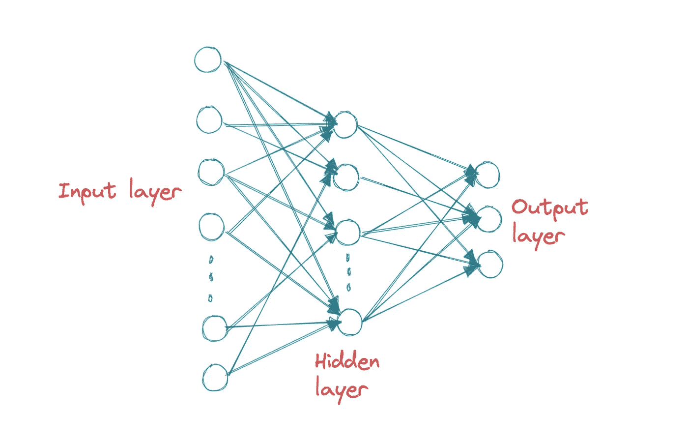

作者图片

在最简单的神经网络中，有一个输入层、一个隐藏层和一个输出层

如果没有隐藏层，这种排列将被称为感知器，类似于弗兰克·罗森布拉特在 1943 年设计的 Mark 1。

用一句话来解释，神经网络背后的思想是，给定一个输入 X，我们能否做一些数学计算来正确识别 X 或将 X 分类到预定义的类别之一？就像我们的大脑一样。

# 简单看一下算法

让我们以一个单层网络为例，输入 X1，X2；隐层神经元 H1，H2；和输出 Y1、Y2。

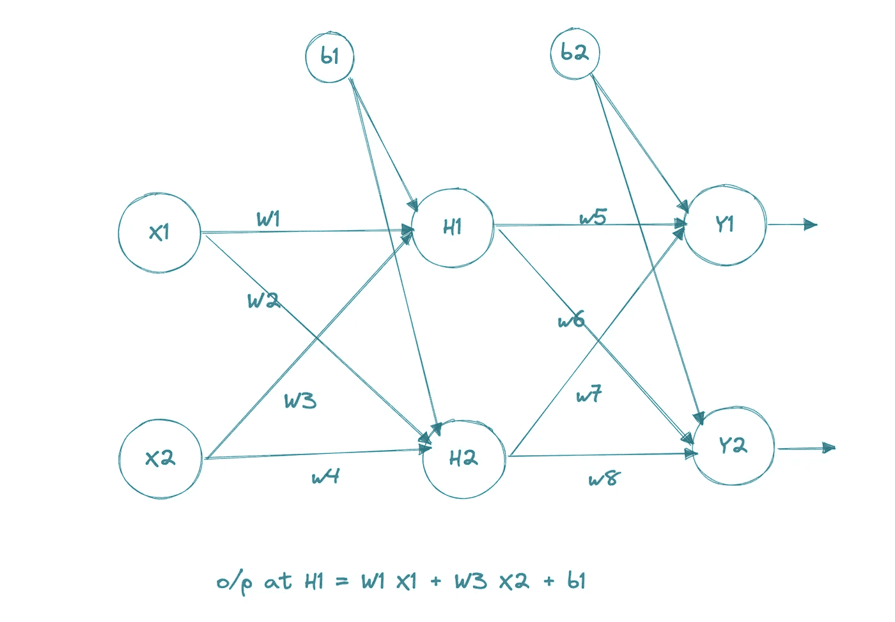

图 1(作者图片)

*您估计权重 w1、w2、w3 等，计算每个节点的输出，并最终根据 Y 的真实值测量最终输出 Y*。Y 和 Y*之间的差异是您用来重新调整权重和计算新 Y *的误差；继续这样做，直到你得到一个接近 Y 或者令你满意的 Y*值。*

这是所发生事情的淡化版本；实际上，还有更多的步骤。一个更复杂的算法:

1.  获取输入 X
2.  估计重量——这是一个完全不知情的过程，人们可以随机初始化重量。
3.  估计偏差项的值。
4.  前向传递(前馈)—在初始化权重的帮助下，估计每个节点的输出。
5.  计算最终输出(y 值)。
6.  找出误差-网络的估计值减去您想要观察的实际值。
7.  反向传递(反向传播)—借助计算出的误差，重新调整权重。
8.  不断重复步骤 3 至 6，直到达到所需的值。

# 从线性到非线性

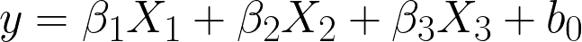

这是一个回归方程，是输入和不同权重(betas)的线性组合。

对于图 1，可以看到 H1 的输出是:

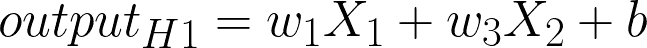

H2 的输出是:x1*w3 + x2*w4 + b1 等等。

在任何时候，它都是权重和输入的线性组合。如果我们只在神经网络的不同节点获取输出，它将只不过是一组复杂的线性回归。为了避免这种情况，我们需要引入非线性，这就是激活函数的作用。有许多流行的函数，如 sigmoid、tanh、softmax、ReLu 等。

在神经网络中引入激活函数有助于:

1.  使模型非线性化。
2.  模仿大脑中的神经元；当满足某些阈值条件时，大脑中的神经元就会激活；激活函数给神经网络的功能带来了类似的阈值。
3.  在 0 和 1 之间映射输出。

一旦我们应用激活函数，例如 sigmoid，节点处的输出将是:

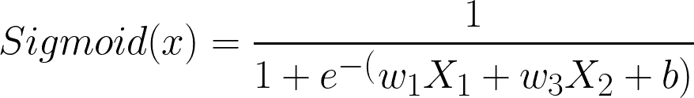

一旦计算了所有节点的所有这些值，网络将估计最终输出，并计算期望值和观察值之间的误差。

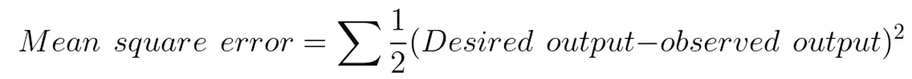

# 数据

数据集:MNIST 手写数字。

来源:http://yann.lecun.com/exdb/mnist/

http://www.pymvpa.org/datadb/mnist.html MNIST 手写数据集的许可——知识共享许可

# 正向传播

有 42，000 张图像，每张图像的尺寸为 28 x 28 = 784 像素，需要将它们分为 10 类——0、1、2、3、……9。

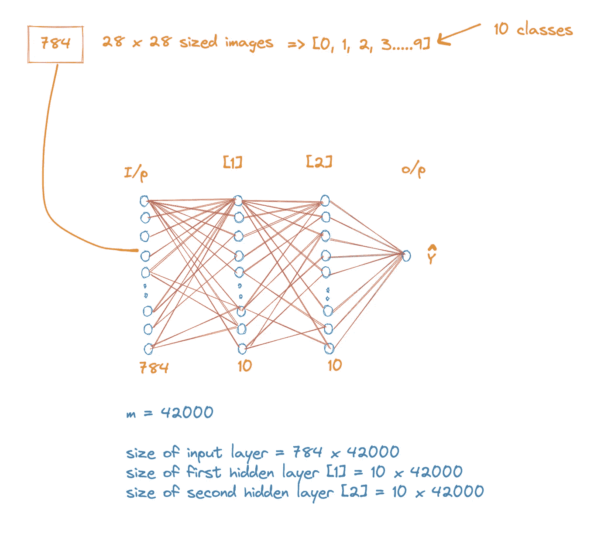

作者图片

各层的大小很重要，需要预先计算。

## 转化为数学

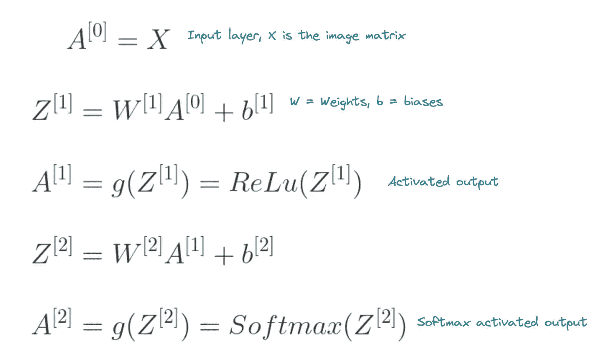

方程组 1(图片由作者提供)

网络的第一层是输入层 X，向其添加权重和偏差的线性组合，以获得线性输出 z。

在激活函数的帮助下，第一层的输出 Z 是非线性的，这里使用 ReLU。

ReLU 的非线性输出被馈送到网络的第二隐藏层，在第二隐藏层中添加了 softmax 非线性，并且最终产生输出 A2。

Softmax 会将输出向量转换为概率向量。

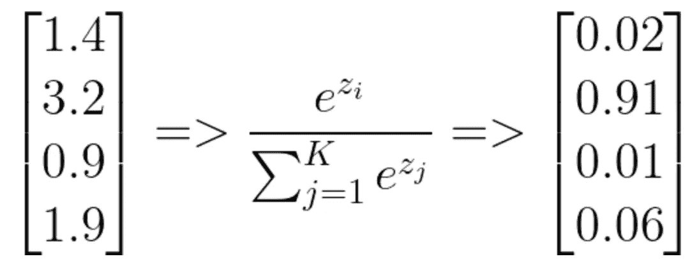

*一个旁注，在*[*【https://latexeditor.lagrida.com/】*](https://latexeditor.lagrida.com/)上写乳胶很容易

# 反向传播

到目前为止，我们一直在前进。

一旦我们得到了输出，我们将测量误差并进行反向传播。

## 为什么要反向传播？

最初随机选择的权重在反向传播期间被调整。权重决定了特征的重要性:权重的数值越高，特征就越重要。

最初，我们并不真正知道分配什么权重，所以我们从随机权重开始，但反向传播作为一种校准机制，有助于更新权重，并使网络和整个系统达到平衡。

计算以下偏导数，它们有助于确定 Z、b 或 W 等特征的微小变化如何影响误差函数。

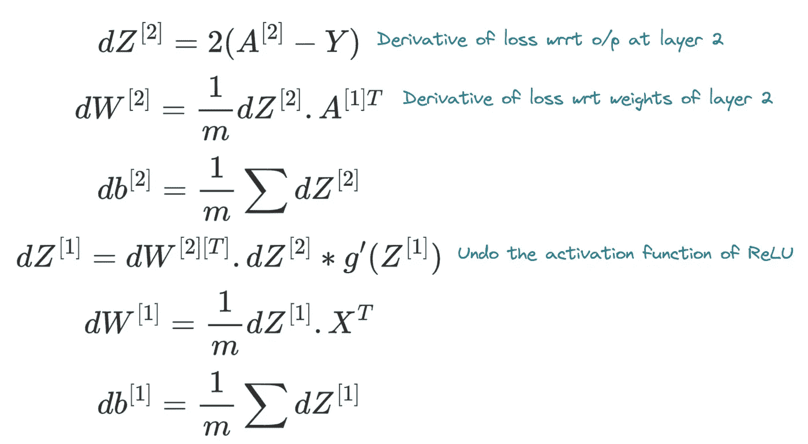

作者图片

以上是为了计算权重和偏差的误差，从而更新它们。

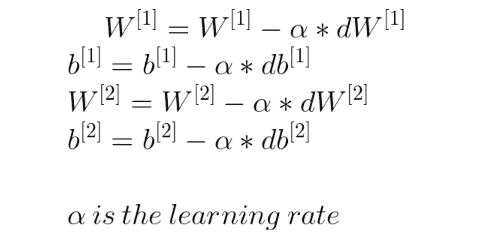

方程组 3(图片由作者提供)

这看起来像是一大堆数学。简而言之，我们将使用以下等式更新权重和偏差:

*新权重=旧权重—学习率*总误差相对于该权重的偏导数*

例如，在图 1 中，如果我们想要更新权重 5，那么

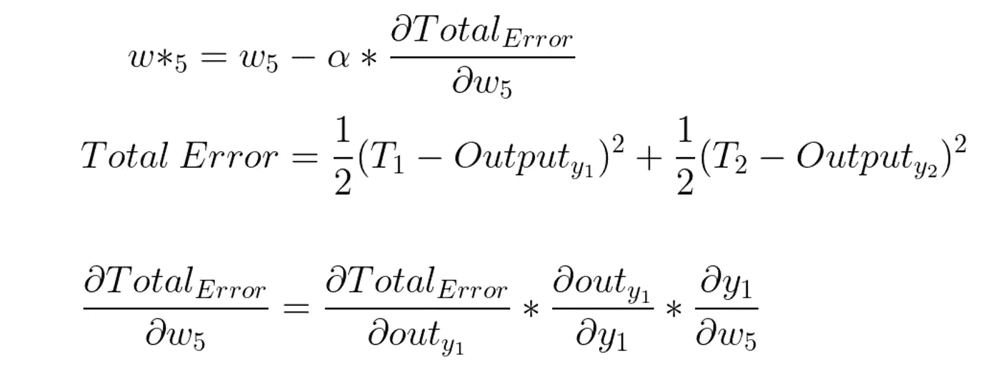

方程组 4(图片由作者提供)

> 我们知道总误差，我们只需要对误差函数进行 w5 的部分微分，但是因为误差函数中没有任何 w5 项，我们将使用**导数链规则**来找到各个偏导数，并将它们相乘以获得相关值(正如我们在上面的方程组 4 中所做的)

观看 [3B1B 视频](https://www.youtube.com/watch?v=tIeHLnjs5U8)更多了解反向传播微积分如何工作。

# 数学够了，我们来编码吧！

从回购中读取数据后，让我们将其分为训练集和测试集

一个非常重要的步骤是使训练和测试集正常化，否则训练将会很慢或者根本无效。

```
X_train = X_train/255.
X_test = X_test/255.
```

根据上面的方程组 1，让我们初始化参数并为正向传递定义一个函数

至此，已经定义了正向传递的一次迭代，让我们定义反向传播的方法，并根据方程组 2 和 3 更新参数。

让我们定义一个梯度下降方法，该方法将调用其中的向前传递和向后传递方法，并最终更新参数。

第一次运行达到了 88%的准确率

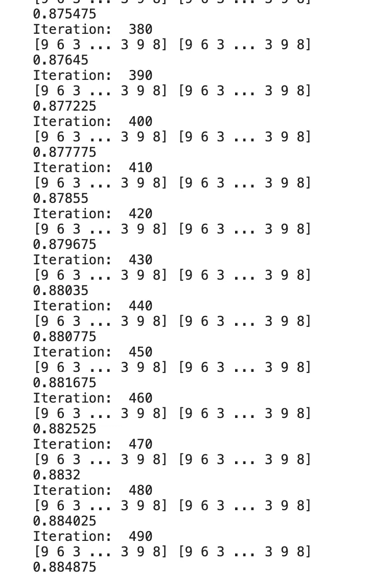

各种迭代的准确性

在测试集上使用训练过的学习者显示了一些错误的分类，但大部分是正确的。

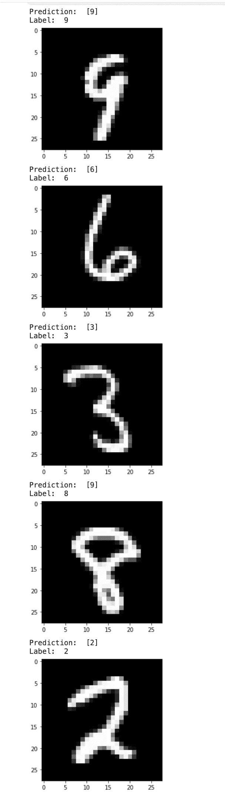

输出

在 PyTorch、Keras 或 TensorFlow 的帮助下，通过一些调整可以达到 95%的精度，而在这里，通过基本的数学知识，我们可以达到 88%。没那么糟糕！

更重要的是，我们能够计算出正向传播和反向传播数学，正确地将它们编码，并将其应用于真实世界的示例数据集。

代码库在我的 [GitHub repo](https://github.com/Prashantmdgl9/NN_scratch) 上。

如果你知道一些更简单的反向传播方法(或更直接的解释)，那么请留言或联系。