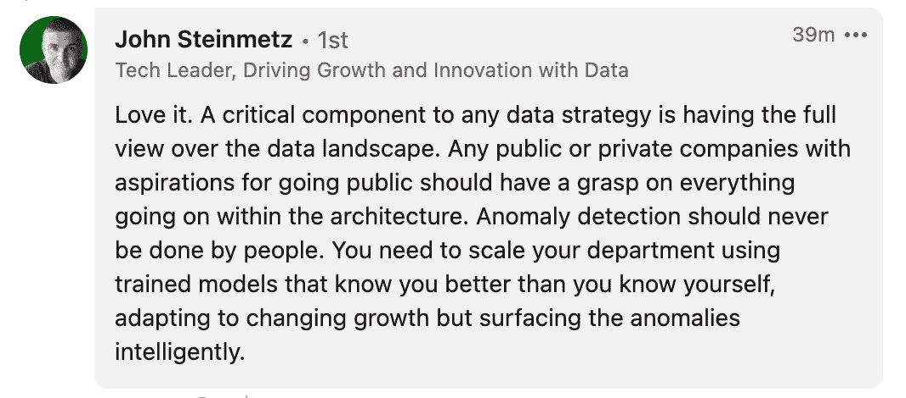
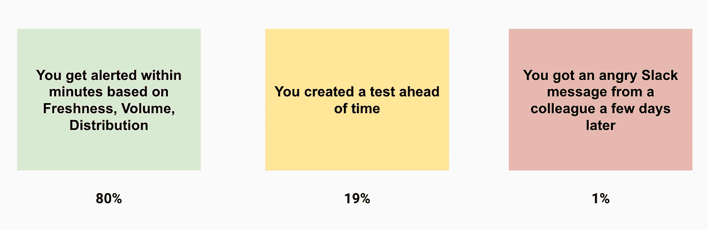

# 你能超越坏数据吗？

> 原文：<https://towardsdatascience.com/can-you-out-architect-bad-data-d1d3d8cf0106>

## 即使是设计最精良的数据平台，系统也会崩溃。不接受风险，你就是在玩火。

图片由 [Unsplash](http://www.unsplash.com) 上的[丹尼尔·赫雷斯](https://unsplash.com/@danieljerez)提供。

跟我说:*破数据在所难免。*

它不关心您在编写 dbt 测试时有多主动，您的数据建模有多完美，或者您的架构有多健壮。重大数据事件的可能性(空值？错误的模式更改？失败的模型？)回荡在整个公司的声音总是潜伏在角落里。

这并不是说像数据测试、验证、 [**数据契约**](https://www.montecarlodata.com/data-contracts/) 、领域驱动的数据所有权和数据区分等东西在减少数据事件方面没有起到作用。确实如此。事实上，我已经写了很多关于新兴的数据质量最佳实践的文章，比如[数据 SLA](https://www.montecarlodata.com/blog-one-sla-at-a-time-our-data-quality-journey-at-red-digital/)、[断路器](https://www.montecarlodata.com/blog-airflow-shortcircuitoperator-data-circuit-breaker)、[不可变/语义仓库](https://www.montecarlodata.com/blog-is-the-modern-data-warehouse-broken/)、[模式变更管理](https://www.montecarlodata.com/blog-dont-make-a-schema-change-before-answering-these-five-questions/)、[数据资产认证](https://www.montecarlodata.com/blog-stop-treating-your-data-engineer-like-a-data-catalog-and-how-to-build-a-data-certification-program/)，以及向[数据网格](https://www.montecarlodata.com/blog-what-is-a-data-mesh-and-how-not-to-mesh-it-up/)发展。

图片由作者提供；经约翰·斯坦梅茨许可，重新发布。

正如任何数据从业者都会告诉你的，将技术投入到问题中并不是保证数据质量的灵丹妙药，但是它们可以被用作防范一些不太明显的问题的护栏，否则这些问题将无法通过区分或测试来发现。

用我们现场可靠性工程前辈的睿智的话来说:“拥抱风险”

原因如下。

# 我们能战胜不可避免的事情吗？

在 dbt Labs 首席执行官 Tristan Handy 的一篇很棒的[文章](https://roundup.getdbt.com/p/interfaces-and-breaking-stuff)中，他提供了几个有用的建议，用于解决当软件工程师推送影响紧密耦合系统中数据输出的更新时出现的上游数据问题。

这是对我们之前关于[数据契约](https://www.montecarlodata.com/data-contracts/)的一篇帖子的有价值的回应，这些类型的见解也是为什么我们很高兴他能在我们即将举行的[影响力大会](https://impactdatasummit.com/2022)上发表。虽然我同意他试图尽可能多地防止数据事件击中 prod 的总体论点，但我会对他的一个论点提出异议:

或许，这些期望之一应该是:不要做出破坏下游内容的改变。

对你来说，这和对我来说一样明显吗？与其建立检测和警告系统崩溃的系统，不如建立不会崩溃的系统。”

我并不是要挑出特里斯坦(他定期写信与社区分享他的专业知识，并将加入我们在 IMPACT 的创始人小组！)因为这是潜伏在相当一部分数据从业者潜意识里的思想。“也许我可以做得很好，让坏数据永远不会进入我的管道，我的系统永远不会崩溃。”

这是一个乐观且诱人的提议。毕竟，数据工程师，以及更广泛的数据分析专业人员，需要有某种“排除万难完成任务”的心态，才能决定首先进入这个行业。

我们每天必须处理的临时请求的数量和多样性对我们不利；我们必须管理的桌子越来越大，规模也越来越大，这对我们不利；在了解我们公司日益增长的数据需求的复杂性方面，我们处于不利地位。

但是最好的数据工程师和领导者明白两件事:1)他们无法预测数据事件发生的所有方式，2)这些事件的后果[变得更加严重](https://www.montecarlodata.com/blog-the-cost-of-bad-data-has-gone-up-heres-8-reasons-why/)。

这篇文章将列举一些为什么你不能在架构上超越坏数据的原因，然后看看数据专业人士可以从网络安全、物流和软件工程等其他行业如何解决这个问题中收集到什么(提示:这不是通过构建完美的系统或拥有完美的代码)。

# 为什么您不能超越坏数据

尽管即使是最完美的体系结构也会受到坏数据的影响，原因有很多，但我将使用现实生活中的例子列出一些最常见的原因。

## 人为误差

没有一个架构是完美的，因为这些系统涉及到人，而人是不完美的。犯错是人之常情。这些类型的事件可能是由手动数据输入过程中的一个简单错误导致的，也可能是将坏代码转移到生产环境中。

我知道贵公司没有人使用 Excel，这些数据不可能进入您的完美系统，也从未有过过于匆忙的问答导致带有错误代码的批准的拉取请求，但请相信我，这在现实世界中是会发生的。

例如，一家在线零售公司在产品中发布了一个用户无法结账的 bug，幸运的是这个 bug 在 45 分钟内被发现并解决了。另一家营销技术公司增加了可迭代测试，其中包括休眠用户，并看到他们在客户数据平台上的消费(和产生的成本)一夜之间增加了近两倍。一个在线语言学习平台向他们的 ETL 管道添加了一个有问题的过滤器，阻止了他们的表以正确的速度增长。

所有这些问题，如果没有被某种形式的自动化所捕获，将会产生负面的后果，并且没有一个是最良好架构的平台所能避免的。

## 第三方依赖关系

向约翰·多恩道歉，没有一个系统是孤立的。您的数据生态系统可能包含许多不受您控制的数据源。这可以是不太成熟的第三方合作伙伴，他们没有点击发送他们的每周报告，甚至是您最大的合作伙伴中最复杂的自动化系统。

例如，一家媒体公司首先意识到他们的在线视频合作伙伴(一家服务于数百万用户的技术巨头)的数据馈送发送文件比平时晚了四个小时，这导致 ETL 作业无法正确更新。

例如，一家游戏公司注意到他们的新用户获取数据存在偏差。他们做广告的社交媒体平台改变了他们的数据时间表，所以他们每 12 小时而不是 24 小时发送一次数据。该公司的 ETL 被设置为每天只获取一次数据，因此这意味着突然有一半发送给他们的活动数据没有得到处理或传递到下游，使他们的新用户指标偏离“付费”而转向“有机”

因此，即使你已经设计了完美的流程来防止自己系统中的上游数据问题(这是一个相当大的壮举，因为正如我们在上面所展示的，即使是最大的科技公司也会有问题)，你也需要你所有的合作伙伴都是完美的。祝你好运。

## 新举措

正如我们的一位同事喜欢说的，“数据就像时尚，永远不会结束，它总是在不断发展。”即使在一个假设的世界中，您已经完成了您的架构杰作的最后一笔，也会有来自业务的新需求和用例需要变更。

即使有了最好的变更管理流程，当你开辟新的领域时，也会有尝试和错误。挑战极限(伟大的数据团队就是这样做的)会降低安全边际。

例如，一家在线零售公司正在努力降低其分析数据集中的数据延迟，从 30 分钟减少到 5 分钟。他们有许多可移动的部分，包括复制 mySQL 数据和 Kafka 流。在该计划中，有一个问题导致了一次全面的中断，影响了填充在管理层控制面板中的 100 多个表。

另一个例子是金融公司采用了一种涉及加密货币的新金融工具，这种工具要求数据类型是浮点型而不是整数型，这与他们所有其他更传统的工具不同。

## 测试只能到此为止

我已经几次提到，不可能预测坏数据进入管道的所有方式。说得好听点，这就是为什么测试(或者说[数据断路器](https://www.montecarlodata.com/blog-announcing-circuit-breakers-a-new-way-to-automatically-stop-broken-data-pipelines-and-avoid-backfilling-costs/)实际上是在测试类固醇)将[只捕捉到大约 19%的数据问题](https://www.montecarlodata.com/blog-data-observability-vs-data-testing-everything-you-need-to-know/)。

图片由作者提供。

例如，一家物流公司有一条通往其最重要的战略客户的重要管道。他们用流水线上的 90 多条独立规则一丝不苟地监控质量。然而，一个问题仍然设法绕过他们所有的测试，导致 50 万行丢失，一堆空值像杂草一样冒出来。

## 其他行业的可靠性经验

那么如果不良数据的挑战不可避免，解决方案是什么？简短的回答是更多，更智能的自动化。

对于更长的答案和解释，让我们看看我们在网络、物流和软件工程领域的同事是如何处理类似问题的。

# 网络安全专家认为安全漏洞是不可避免的

你不会发现任何可信的网络安全供应商承诺完美的安全性，或者他们会消除所有风险。就连他们的营销人员也知道没有这回事。

挑战是一样的。人是会犯错的，防御必须完美，而攻击者(在我们的例子中是坏数据)只需成功一次，就可能造成负面后果。你的系统的强度取决于你最薄弱的环节。

那么他们会怎么做呢？他们尽可能构建最好的分层防御，然后将资源投入到事件解决和缓解中。他们制定了计划来了解不可避免的违规行为的影响，并将这种影响降至最低。

在数据方面，我们需要确保我们不仅投资于预防，还投资于检测、警报和解决方案。例如，就像网络安全专业人员了解违规如何蔓延到邻近系统至关重要一样，数据工程师需要了解一个数据集中的坏数据如何影响下游的其他资产，包括 BI 仪表板和使用它们的消费者。

# 物流最佳实践关注整个价值链

制造业和物流业是最早将质量保证提升到今天水平的行业之一。

在这些行业中，每 100 万个事件中有 3.4 个缺陷被认为是有效的([我们的数据显示](https://www.montecarlodata.com/blog-data-quality-issues/)在他们的环境中，平均组织每年每 1，000 个表有 70 个数据事件，因此按照这一标准，我们仍然有办法继续我们的质量之旅)。

精益六适马起源于 20 世纪 80 年代，是一种在提高质量的同时消除浪费和缺陷的方法，至今仍广受欢迎。一个常见的 LSS 实践是“[价值链分析](https://corporatefinanceinstitute.com/resources/knowledge/other/value-chain/)，它涉及到监控为产品增值的核心业务活动。

看到数据工程的等价物并不需要丰富的想象力:

*   入库物流=提取
*   操作=转换
*   出库物流=装货
*   营销和销售=采用计划、数据素养、建立数据信任
*   服务= [数据自助服务](https://www.google.com/search?q=data+self+service+a+lie+monte+carlo&client=safari&rls=en&ei=YB_xYpj_CaHV5NoPqt-EuAw&ved=0ahUKEwiYr4Tou7f5AhWhKlkFHaovAccQ4dUDCA0&uact=5&oq=data+self+service+a+lie+monte+carlo&gs_lcp=Cgdnd3Mtd2l6EAMyBQghEKABMgUIIRCgATIFCCEQoAEyBQghEKsCMgUIIRCrAjoICCEQHhAWEB1KBAhBGAFKBAhGGABQoAxYsRVgyRZoAXAAeACAAZABiAH1B5IBAzkuM5gBAKABAcABAQ&sclient=gws-wiz)，临时分析/报告

价值链分析的关键是不仅要理解和监控每个阶段的主要和次要活动，而且要理解它们之间的联系，这被认为是该过程中最困难的部分。这表明数据工程师需要对他们的系统(不仅仅是数据仓库)进行端到端的自动监控，并确保他们拥有更新的数据血统，以了解跨系统的联系。

# 软件工程师投资自动化监控

软件工程是数据工程，尤其是数据可靠性工程发展的近乎完美的类比和路线图。

有三个主要趋势导致软件应用程序用“5 个 9”(99.999%的正常运行时间)来衡量其可靠性。

一是更好的合作。一旦他们的应用程序开始运行，开发人员就被蒙在鼓里，导致同样的错误重复发生，因为开发人员缺乏对应用程序性能的了解，并且不知道在出现问题时从哪里开始调试他们的代码。

解决方案是广泛采用的 DevOps 概念，这是一种新的方法，要求在软件部署和开发过程中开发人员(Dev)和运营(Ops)团队之间进行协作和持续迭代。

[**DataOps**](https://www.montecarlodata.com/blog/-monte-carlo-recognized-as-a-dataops-leader-by-g2/) 是一个将数据工程和数据科学团队合并起来以支持组织的数据需求的学科，与 DevOps 帮助扩展软件工程的方式类似。与 DevOps 如何将 CI/CD 应用于软件开发和运营类似，DataOps 需要一种类似 CI/CD 的自动化优先方法来构建和扩展数据产品。

第二个趋势是专业化。网站可靠性工程师和 [**谷歌的 SRE 手册**](https://sre.google/sre-book/table-of-contents/) 的兴起，通过改进专业知识、最佳实践和问责制来提高可靠性。随着数据可靠性工程师的崛起，我们看到这种专业化开始出现。

第三个趋势是增加对应用程序性能管理和可观察性的投资。DataDog 和 New Relic 等可观测性供应商的爆炸性增长充分说明了有价值的软件工程师如何继续寻找这些解决方案来实时监控异常并发出警报。随着时间的推移，这种投资只会增加(即使他们的应用程序比我们的数据产品可靠得多)，当一个团队没有在可观察性上投资时，这是很奇怪的。

我们的软件同事会告诉你，提高可靠性不仅仅是采用新的解决方案。也不在于建立了完美的系统。它是人(SREs)、过程(DevOps)和技术(可观察性)的结合。

# 没有必要免费索罗

作者站在巴塔哥尼亚臭名昭著的塞罗托雷山前。(没有她没有爬上去)。图片由巴尔·摩西提供。

组织在您的数据团队中所做的所有投资都是为了在数据的驱动下做出更好的决策。您的数据需要高度可靠，以建立信任、加速采用和扩展数据优先文化，否则这些投资将成为开销，而不是收入来源。

这是一座难以攀登的高山，但没有必要“自由单飞”。这就是监控、数据可观察性、沿袭和其他覆盖数据质量基础的自动化方法可以派上用场的地方。

放自己一马也无妨。相信我:你的股东会感谢你的。

想法、感觉、情绪？伸手到领英上 [***巴尔摩西***](https://www.linkedin.com/in/barrmoses/)**！**