# 典范分解——一种被遗忘的时间序列协整方法及其他

> 原文：<https://towardsdatascience.com/canonical-decomposition-a-forgotten-method-for-time-series-cointegration-and-beyond-4d1213396da1>

## 将多个时间序列分解为静态和趋势关系。从头开始完整的 Python 代码。

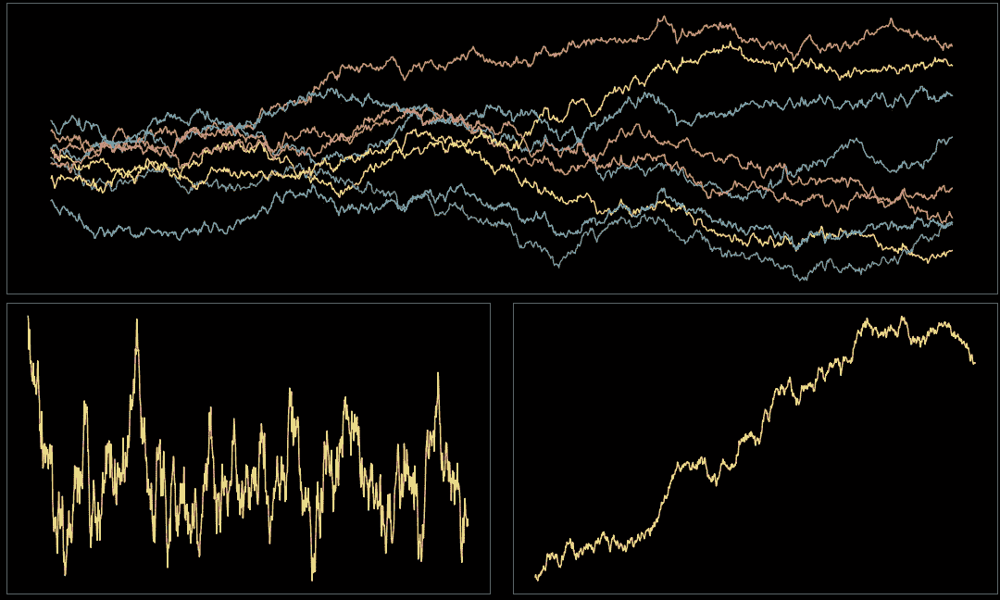

作者图片

在处理多个非平稳时间序列时，协整是最重要的概念之一。对于那些不熟悉协整的人来说，简单来说，两个或多个时间序列的协整意味着它们之间存在一个平稳的线性组合。

非平稳时间序列的问题是我们不能直接应用大多数统计工具，因为这些工具是为平稳数据设计的。然而，当存在协整时，我们拥有所有的统计机器来制作有意义的模型，并从我们的数据中获得进一步的见解。

两个著名的协整方法是 Engle-Granger 方法和 Johansen 方法。在这两种方法中，实践中最常用的是 Johansen 方法。原因是恩格尔-格兰杰方法往往会产生虚假回归，但这超出了目前的故事。可以说 Johansen 方法是大多数统计软件包中最常用的协整方法。

然而，在 Johansen 的第一篇关于协整的开创性论文(1988)之前 11 年，Box 和 Tiao 提出了一种称为规范分解的方法，我们将简称为 BTCD。这种方法很有趣，因为它不仅能发现协整关系，还能发现时间序列之间的趋势关系。事实上，有研究表明 BTCD 比约翰森方法更稳定，然而 BTCD 似乎已经被遗忘了。

在这个故事中，我将解释 BTCD 背后的基本数学，并用 Python(从头开始)编写一个库，供你在下一个时间系列项目中使用。希望我们能让 BTCD 在协整方法中恢复其应有的地位。

## 问题设置

我们要找到一个权重向量 *w* 来形成多个时间序列的线性组合，得到的时间序列 *S* 应该是平稳的。设 *p* 为一个 *n* 维向量，表示一个 *n* 维时间序列(聚合多个 1D 时间序列)，形式上:

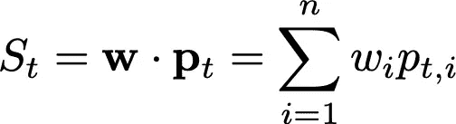

## 基础数学

BTCD 的基础是 Box 和 Tiao 定义的可预测性的概念。为了说明这个概念，让我们考虑一维时间序列 *p* 的情况。考虑一个模型 *q* 在时间 *t:* 预测 *p*

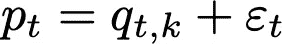

其中，ε是均值为零的 i.i.d。模型 *q* 具有来自 *k* 先前滞后、 *t* -1、 *t* -2、…、 *t* - *k* 的信息，即

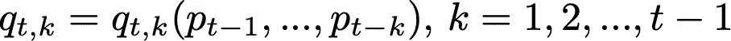

在最简单的情况下，模型 *q* 是使用 AR(1)规范构建的，这是一个线性模型，其中 *k* =1。但是保留 *q* 作为 *p* 的抽象模型更方便。

对第一个等式的两边求平方，并取我们得到的期望值:

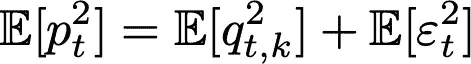

Box 和 Tiao 将可预测性定义为:

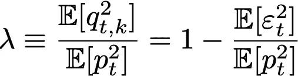

我们可以看到，当可预测性较大时 *p* 优于ε，这意味着模型 *q* 和 *p* 之间的残余噪声较小，因此 *p* 是可预测的。当可预测性较小时，ε支配 *p，*意味着 *p* 几乎是具有平稳均值和方差的纯噪声。

现在我们转向 *n* 维情况，其中 *p* 、 *q* 和ε现在是 *n* 维向量。类似于一维情况:

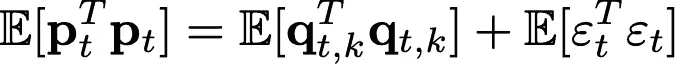

其中 *T* 上标表示转置，注意以上等式中的所有项都是矩阵。

为了获得分解关系，我们使用权重向量 *w* 将可预测性表示为:

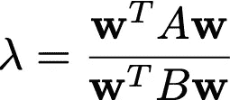

使用矩阵:

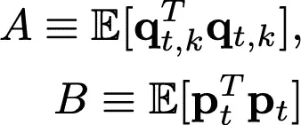

我们现在的问题是找到 *w* 使得可预测性λ最小/最大。

为了解决优化问题，我们引入了一个巧妙的变量变化:

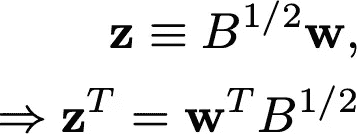

(最后一个等式来自于 B 的平方根是对称的这一事实)并且

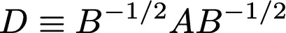

在此变量变化下，我们的权重向量为:

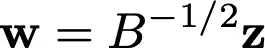

我们可以将可预测性表示为标准瑞利商:

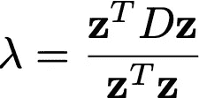

这很好，因为优化问题现在是矩阵 *D* 的特征值问题。对应于最小/最大特征值的特征向量最小化/最大化λ。

事实上，如果我们将所有特征值从最小到最大排序，它们相应的特征向量(乘以“V”的平方根倒数)将生成从最不可预测(平稳)到最可预测(趋势)的时间序列。这就是为什么 Box 和 Tiao 把这种方法命名为“规范分解”。

## 编码规范分解

我们需要解决的第一件事是如何计算二元乘积的期望值，因为矩阵 *A* 和 *B* 将需要这个。设 *v* 为一个 *n* 维向量(1D 数组)如果有 *v* 的 *t* 个观测值，这个数据可以表示为一个矩阵 *V* (2D 数组)，其中每行代表一个观测值，即形状为( *t* ， *n* )

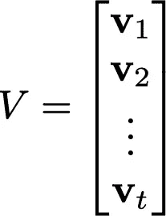

那么二元乘积的期望值可以从样本中估计出来，如下所示:

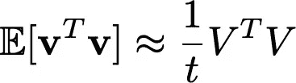

对此进行编码:

现在我们可以求解 *B* 的平方根的倒数，其中“p_mat”是向量 *p* 的观测值矩阵。

然后我们需要计算出 *A* ，为此我们需要建立模型的方式*q .【Box】和 Tiao 使用普通最小二乘(OLS)回归。然而，我们在这里允许一些灵活性，并且只为这样的模型建立一个接口。*

*如果你仔细看看这个接口，它正是我们都喜欢的 Scikit-learn 的接口，由 Scikit-learn 和许多其他库的所有回归模型实现。如果您想使用具有不同接口的不同库，您可以用 fit 和 predict 方法将它包装在一个类中，效果也一样。*

*接口而非具体实现背后的想法是能够以灵活的方式切换回归模型，而无需对 BTCD 的实际代码进行任何更改。Box 和 Tiao 使用了 OLS，但也可以尝试一些不同的东西，比如弹性网，甚至是非线性模型？这取决于你的实验。*

*在下面的代码中，为了可读性，参数 *k* 将被重命名为“max_lag”。*

*为了得到模型 *q* ，我们需要使用所有时间序列的滞后版本(直到“max_lag”)来预测每个时间序列的下一步。换句话说，对于每个时间序列(“p_mat”的每一列)，我们需要形成一个包含滞后时间序列的特征向量“X”，然后形成由 X 的 T-max _ 滞后观测值组成的矩阵 X，X 的形状为(T-max _ 滞后，最大 _ 滞后* n)。回归 y 的目标只是去掉了第一个“最大滞后”值的时间序列，所以它的形状是(T-max 滞后)。*

*现在求特征值问题的解*

*现在，将实现我们刚刚编码的所有内容的函数，即，将被调用来进行实际分解的函数，以及用于规范分解结果的*数据类*:*

*现在让我们为 BTCD 把它放在一个干净的图书馆里。*

## *合成时间序列示例*

*让我们生成 *n 个*离散采样的相关布朗运动，以生成我们的“p_mat”用于演示目的。要生成此类数据:*

*现在我们生成数据:*

*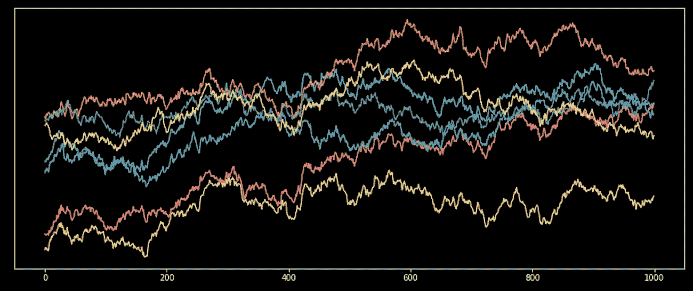*

*作者图片*

*给定“p_mat ”,其中每一列是一个时间序列，我们的权重向量 *w* ,结果时间序列 *S* 可以用以下公式计算:*

*最后是使用 Sklearn OLS 实现“RegressionModel”接口的规范分解的例子，没有截距，max_lag=1*

*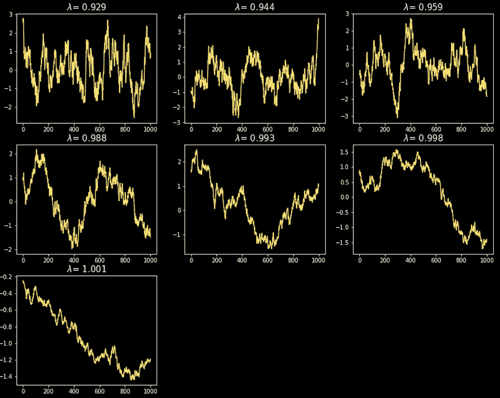*

*作者图片*

*为了说明使用另一种类型的回归是多么容易，现在让我们使用 Sklearn 的 elastic net 并将 max_lag 设置为 9。*

*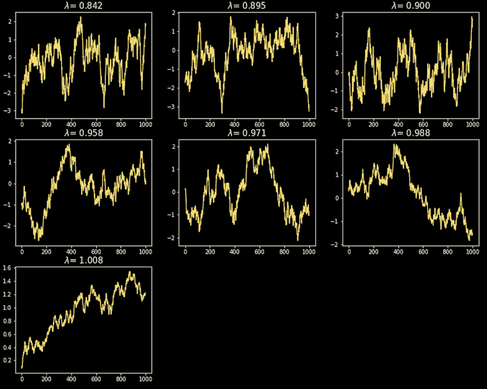*

*作者图片*

## *最后的话*

*我们已经成功地为 BTCD 编码了一个库，在我看来，它填补了大多数时间序列统计库中的一个空白。现在你除了 Engle-Granger 和 Johansen，又多了一个协整分析的工具。*

*为回归模型创建接口而不是直接对其进行编码的主要目的是让您使用和微调最适合您的数据的回归模型。然而，如果不想修补这一点，那么使用 OLS 作为框和条原本打算。*

*协整方法和 BTCD 的主要问题是它们容易过度拟合。这就是为什么对数据使用合适的回归模型很重要。如果你没有注意到我们使用相关随机行走(离散布朗运动)作为例子，事实上，这种数据的分解是过度拟合的证明。任何布朗运动的非平凡线性组合(即使它们是相关的)都是一个重新标度的布朗运动，它既不是平稳的，也不是趋势性的，因此这种组合不存在协整。这是非常重要的，尤其是当协整被用来做预测时，比如在统计套利交易应用中。遗憾的是，这些方法中的大多数会过度拟合数据，但是希望你能找到最适合你的回归模型。*

*可预测性值λ依赖于回归模型，因此在用不同回归模型计算的λ之间没有有意义的比较，因此它不是一个绝对的度量，仅在使用相同回归模型时对比较有意义。*

## *参考*

*[1] G. E. P. Box 和 G. C. Tiao，[对多个时间序列的规范分析](http://...) (1977 年)，Biometrika 64，2，第 355-65 页*

*[2] R .，D. Orden，M. Yang 和 L. Fisher，【VEC 协整向量的 Box-Tiao 和 Johansen 规范估计量的比较(1)模型 (1994)，计量经济学杂志 64，3–27*

*我希望这个故事对你有用。如果我错过了什么，请让我知道。如果你想知道更多这样的故事，请关注我的[媒体](https://medium.com/@diego-barba)。*

*  

喜欢这个故事吗？通过我的推荐链接成为媒体会员，可以无限制地访问我的故事和许多其他内容。

 *