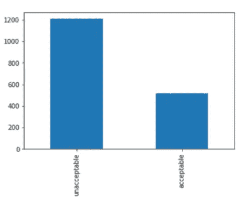
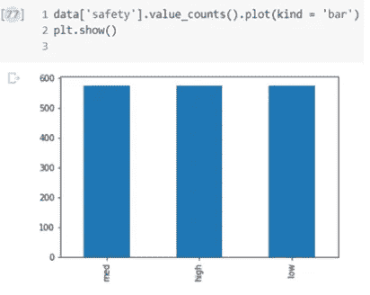
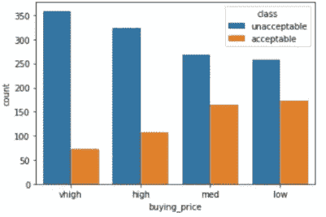
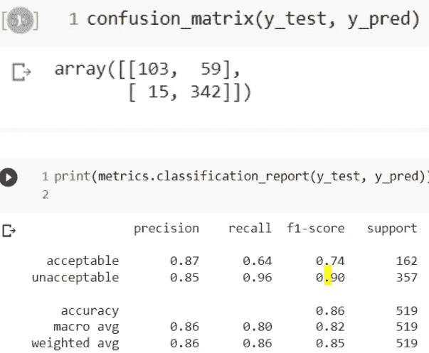
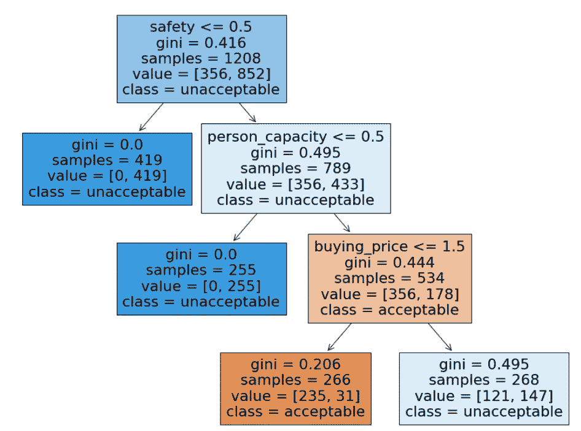

# 利用决策树分类器进行汽车评估分析

> 原文：<https://towardsdatascience.com/car-evaluation-analysis-using-decision-tree-classifier-61a8ff12bf6f>

## Python Sklearn 中决策树分类器的顺序编码

## **概述**

购买前评估汽车状况在决策中起着至关重要的作用。手动地将状况良好或可接受的车辆与状况不可接受的车辆进行分类是费时费力的。我们可以利用机器学习技术来开发汽车评估的自动系统，因为 ML 在解决分类相关问题方面已经显示出有希望的结果。在这个项目中，我们将分析汽车的不同物理条件，并随后根据汽车的属性帮助/推荐用户进行决策。

汽车评估数据集从 [UCI 机器学习库](https://archive.ics.uci.edu/ml/datasets/car+evaluation)收集，**数据源(创建者)**是 Marko Bohanec【1】。它包含具有 7 个属性的 1728 个汽车样本信息，包括一个告诉汽车是否处于可接受状态的类别特征。下面列出了功能名称及其描述:

*   **buying_price:** 客户的购买水平或能力(非常高:vhigh，高:High，低:Low，Medium: med)
*   **维护成本:**维护水平(非常高:v 高，高:高，低:低，中:中)
*   **门:**轿厢内的门数(2、3、4、5 或更多)
*   **person_capacity:** 运载人员的容量(2 人、4 人及以上)
*   **lug_boot:** 行李箱的尺寸(小、中、大)
*   **安全:**轿厢的安全等级(高、中、低)
*   等级:不可接受，可接受，非常好，良好

尽管原始数据集有四个类，但出于教程的目的，我通过将可接受、非常好和良好放在一个类(可接受的类)中，将该问题转换为二元分类问题(可接受与不可接受)。

在动手实验部分，我们将实际应用决策树分类器模型进行汽车评估分类，包括**探索性数据分析(EDA)、数据预处理、模型构建、实验结果和后分析。**

## **动手实验练习**

复制并粘贴以下链接以打开 google colab 或单击以下 Google Colaboratory 选项卡。

[https://colab.research.google.com/notebooks/welcome.ipynb](https://colab.research.google.com/notebooks/welcome.ipynb)

**进口包装**

为数据预处理、模型开发和验证导入必要的包/库:

```
import pandas as pd
import numpy as np
import matplotlib.pyplot as plt
from sklearn.metrics import confusion_matrix
from sklearn.tree import DecisionTreeClassifier
from sklearn.model_selection import train_test_split
from mlxtend.plotting import plot_confusion_matrix
from sklearn import metrics%matplotlib inline
```

**读取数据集:**

```
data = pd.read_csv(‘car_evaluation.csv’)
#We can check the first five samples of the data:
data.head(5)
```

**数据的维度**

我们可以检查数据的维度——找出观察值的数量和特征的数量

```
data.shape
```

注释:数据集包含 7 个特征的 1727 个观察值

**功能名称**

我们可以显示数据集的特征/列名

```
data.columns
```

最后一个变量——“类别”是目标变量，表示样品的标签——样品车是处于可接受的状态还是不可接受的状态。

**缺失值**

我们必须检查数据集是否包含任何缺失值。如果数据包含缺失值，那么我们应该估算缺失值或丢弃包含缺失值的观测值。

```
data.isnull().sum()
```

注释:数据集不包含任何缺失值。

**数据集的分布**

我们可以计算每一类数据集中的样本数，也可以绘制分布图以直观显示。

```
data[‘class’].value_counts()
```

备注:有 1209 个不可接受的汽车样本，而可接受的汽车数量为 518 个

**绘制类变量**

```
data[‘class’].value_counts().plot(kind = ‘bar’)
plt.show()
```



作者图片

**独立变量的分布**

我们可以通过检查自变量的分布来更好地理解数据。我在这里提供了一个例子，但是，您应该尝试使用其他变量。

```
data[‘safety’].value_counts().plot(kind = ‘bar’)
plt.show()
```



作者图片

注释:数据集包含数量大致相同的低、中和高安全条件汽车。

**计数图**

我们可以对照相关类变量检查任何自变量的分布，以获得对数据更深入的理解。例如，我绘制了变量**购买价格**和类变量在不同类别中的分布。您还可以绘制并检查其他变量。

```
import seaborn as sns
sns.countplot(data[‘buying_price’], hue = data[‘class’])
plt.show()
```



作者图片

**数据类型**

我们可以检查每个变量的数据类型(如分类变量、数值变量)。这个过程很重要，因为它告诉我们一个变量是否需要从分类到数字的转换。

```
data.info()
```

注释:从**数据类型** -所有变量都是分类格式。因此，在将数据输入模型之前，需要一个转换过程来准备数据。

## **数据预处理**

**因变量和自变量**

我们必须将自变量(X)和目标变量(y)分开，以便进一步分析。我们将目标变量“class”放到表单 X 中，并将 class 定义为目标变量。

```
X = data.drop([‘class’], axis = 1)y = data[‘class’]
```

**序数编码**

从 EDA 部分，我们发现所有的变量都是分类格式。尽管决策树分类器可以处理分类变量和数字格式变量，但是我们将在本教程中使用的 scikit-learn 包不能直接处理分类变量。因此，我们必须执行一个转换过程。然而，首先，我们需要检查数据集中分类变量的类型。从实验前部分，我们看到每个变量的所有类别都与等级或顺序相关联，表明变量是有序分类变量。因此，我们对变量进行顺序编码，以保持变量的顺序。例如，行李箱的尺寸有三个类别:小号、中号和大号，它们是有顺序的。

首先，我们按升序定义每个变量的类别。我们将使用一个 sklearn 包来完成这个任务——ordinal encoder 使用一个给定的类别列表。例如，转换后，buying_price_category 的值将从['low '，' med '，' high '，' vhigh']转换为[0，1，2，3]，对于可变门:转换类别后将为:['2 '，' 3 '，' 4 '，' 5more'] → [0，1，2，3]

```
from sklearn.preprocessing import OrdinalEncoder
buying_price_category = [‘low’, ‘med’, ‘high’, ‘vhigh’]
maint_cost_category = [‘low’, ‘med’, ‘high’, ‘vhigh’]
doors_category = [‘2’, ‘3’, ‘4’, ‘5more’]
person_capacity_category = [‘2’, ‘4’, ‘more’]
lug_boot_category = [‘small’, ‘med’, ‘big’]
safety_category = [‘low’, ‘med’, ‘high’]
all_categories = [buying_price_category, maint_cost_category,doors_category,person_capacity_category,lug_boot_category,safety_category]oe = OrdinalEncoder(categories= all_categories)
X = oe.fit_transform( data[[‘buying_price’, ‘maint_cost’, ‘doors’, ‘person_capacity’, ‘lug_boot’, ‘safety’]])
```

**列车测试数据分割**

将数据集划分为训练数据和测试数据，其中训练数据将用于训练模型，而测试数据将用于评估模型。这里，我们将数据集分为 70% : 30%，分别用于训练和测试数据。

```
X_train, X_test, y_train, y_test = train_test_split(X, y, test_size = 0.3, random_state=2)
```

## **模型开发**

**训练决策树分类器**

我们用 X_train 和 y_train 数据在 sklearn 中训练决策树分类器。在开始训练过程之前，我们可以设置不同超参数的值，例如 criterion、max_depth(树的最大深度)。min_samples_split(拆分内部节点所需的最小样本数)。等等..

```
DT_classifier = DecisionTreeClassifier( criterion= ‘gini’, max_depth= 3, min_samples_split= 10)DT_classifier.fit(X_train, y_train)
```

## **实验结果**

**预测**

我们根据测试数据预测:

```
y_pred = DT_classifier.predict(X_test)
```

**结果**

我们使用混淆矩阵来寻找模型的性能:

混淆矩阵(y 测试，y 预测)



作者图片

从混淆矩阵中:

真阳性的数量:103

误报数量:59

假阴性数量:15

真阴性数:342

我们可以使用其他评估指标来了解模型的性能，并分别显示每个类的结果。

print(metrics . classification _ report(y _ test，y_pred))

上述报告显示了可接受和不可接受类别的精确度、召回率和 f1 分数。精度、召回、f1 分数分别为 87%、64%和 74%，其中可接受的条件汽车样本(支持)的数量为 162。另一方面，不可接受类别的精度、召回、f1 分数分别是 85%、96%和 90%，其中不可接受汽车样本的数量是(支持)357。从这个报告中，我们可以看到，对于不可接受的汽车样本，该模型比可接受的汽车表现得更好，这是一个有趣的发现。

总体准确率为 86%。

## **岗位分析**

我们可以将树可视化，了解模型如何预测一辆车是否可以接受。下面是绘制树的代码。从树中:根节点是安全变量，以 0.5 分割安全变量，这意味着，它将创建两个节点-一个具有{低}安全性，而另一个将包含{中，高}安全性汽车样本。

```
from sklearn import tree
fig = plt.figure(figsize=(15,12))
_ = tree.plot_tree(DT_classifier,
feature_names=data.columns[:-1],
class_names= DT_classifier.classes_, filled=True)
```



作者图片

相关文章:

[**挑战机器学习算法中的再现性**](https://medium.com/p/3b4ca7b975c8)

[**中心极限定理中样本量的影响**](https://medium.com/mlearning-ai/cornerstones-of-statistics-central-limit-theorem-dd4d5f97fcb0)

数据泄露是机器学习管道中的一个重要因素；可以阅读— [**如何避免数据泄露**](https://medium.com/p/48169c48c347)

参考

[1]Dua d .和 Graff c .(2019 年)。UCI 机器学习知识库[http://archive . ics . UCI . edu/ml]。加州欧文:加州大学信息与计算机科学学院。