# 基数—您的权力 BI 陛下

> 原文：<https://towardsdatascience.com/cardinality-your-power-bi-majesty-3add4137753e>

## 你知道最优数据模型大小的最大“敌人”是谁吗？了解基数，并学习如何应用一些简单的技术来提高基数水平，从而提高报告性能


[Ricardo Resende 在 Unsplash 上拍摄的照片](https://unsplash.com/photos/PqqJ340jrow)

正如您可能已经从[的前几篇文章](/killing-me-softly-bi-directional-relationships-in-power-bi-b6b0b9e150f4)中了解到的，创建一个星型模式并不意味着您的数据建模任务已经完成。还有很多方面需要注意——虽然你可以偷偷摸摸地不去微调每一个细节——但其中一些“细节”当然更重要，需要更好地理解。仅仅是因为它的影响可能是重大的！

在 Power BI 中,( im)适当的解决方案最明显的含义之一就是性能！性能，性能，性能…我们一直在努力实现它(或者至少我们应该努力)，但在调整 Power BI 报告时，有许多事情需要记住。优化过程的第一步是确保您的数据模型大小处于最佳状态——这意味着，[尽可能减小数据模型大小](/how-to-reduce-your-power-bi-model-size-by-90-76d7c4377f2d)！这将使 [VertiPaq 的存储引擎](https://data-mozart.com/vertipaq-brain-muscles-behind-power-bi/)在为您的报告检索数据时以更高效的方式工作。

当您致力于优化数据模型大小时，您知道谁是您的头号“敌人”吗？！列数据类型，对吗？文本列将比数值类型的列消耗更多的内存。那只说对了一半！

## 最大的对手叫基数！

在我们解释什么是基数，以及它为什么对减少数据模型大小如此重要之前，让我们首先讨论 VertiPaq 存储数据的方式，一旦您将表的存储模式设置为 Import ( [DirectQuery 存储模式](/direct-query-in-power-bi-what-when-why-8180825812d2)超出了本文的范围，因此从现在开始，本文中所有关于基数的内容都专门指导入存储模式)。

一旦将存储模式设置为 Import，VertiPaq 将从列中扫描样本行，并基于特定列中的数据(不要忘记，VertiPaq 是一个列数据库，这意味着每一列都有自己的结构，并且在物理上与其他列分离)，它将对数据应用某种压缩算法。

有三种不同的编码类型:

*   ***值编码*** —仅适用于整数数据类型
*   ***哈希编码*** —适用于所有非整数数据类型，在某些情况下也适用于整数数据类型
*   ***【RLE(游程长度编码)*** —在 哈希编码后出现 ***，作为一个附加的压缩步骤，在这些场景中，当列中的数据以 VertiPaq“认为”的方式排序时，可以获得比仅使用哈希算法更好的压缩率***

同样，在我们解释基数的概念在整个故事中的位置之前，让我们说明一下哈希算法在后台是如何工作的:

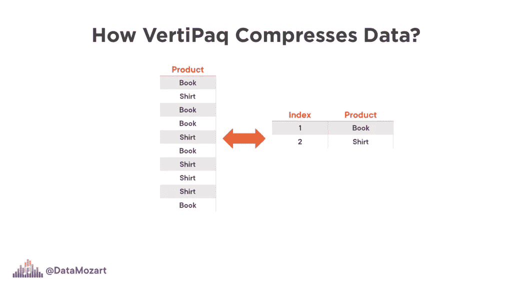

作者图片

正如您所看到的，VertiPaq 将为该列的不同值创建一个 ***字典*** ，为每个值分配一个位图索引，然后存储这个索引值而不是“真实”值——简单地说，它将把数字 1 存储为指向“Book”值的指针，将数字 2 存储为“Shirt”值，依此类推。就像在后台创建一个虚拟维度表一样！

现在，假设该列中没有两个不同的值，而是如下所示:

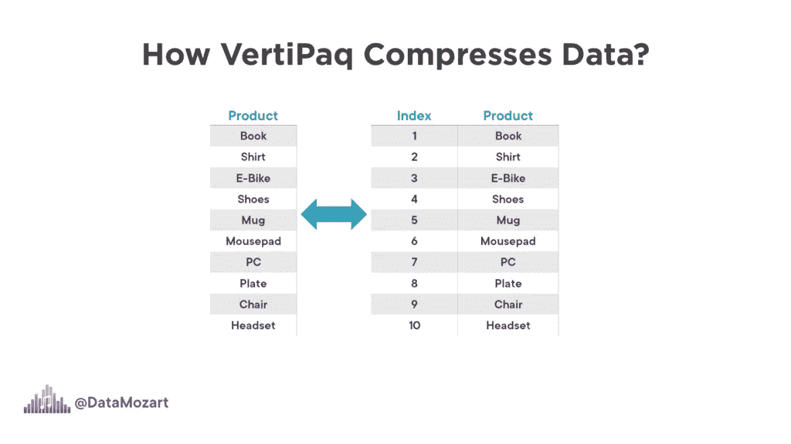

作者图片

我们的“dimension”现在将有 10 行，因此您可能会认为这个字典表的大小将比只有两个不同值的情况大得多。

现在，你可能会问自己:好吧，这很好，但是这个故事和基数有什么共同之处呢？

## 基数表示列中唯一值的数量。

在我们的第一个例子中，基数为 2，而在第二个例子中，基数等于 10。

基数是影响列大小的首要因素。别忘了，列的大小不仅受其中数据大小的影响。你应该考虑字典的大小，和层次结构的大小一样。对于具有高基数(大量不同的值)并且不是整数数据类型的列，字典的大小明显大于数据本身的大小。

让我给你看一个例子。我将使用 DAX Studio 来分析数据模型大小背后的不同指标。一旦我在 DAX Studio 中打开“高级”选项卡并选择“查看指标”,就会出现一系列不同的数字，以了解我的数据模型的特定部分有多大:

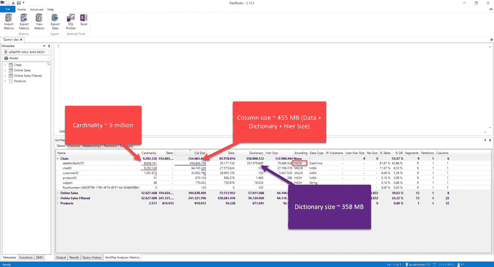

作者图片

让我们快速重申一下上图中的关键观点。在 Chats 表中，datetmStartUTC 列是日期/时间数据类型，精度达到第二级，它有将近 900 万个不同的值！它的大小约为。455 MBs —这个数字不仅包括数据大小(26 MBs)，还包括字典大小和层次结构大小。您可以看到 VertiPaq 应用了散列算法来压缩该列中的数据，但是最大的内存占用是字典大小(几乎 358 MBs)。

显然，这远远不是我们的数据模型的最佳条件。然而，我有好消息要告诉你…

## 有多种技术可以提高基数水平！

在[以前的一篇文章](/how-to-reduce-your-power-bi-model-size-by-90-76d7c4377f2d)中，我解释了如何通过应用一些更高级的方法来降低基数，比如使用除法和模运算将一个高基数的数字列拆分成两个低基数的列，每行节省一些位。我还向您展示了如何将日期/时间列分成两个单独的列——一个只包含日期部分，而另一个包含时间数据。

但是，这些技术需要在报表端做额外的工作，因为所有的度量都需要重写以反映数据模型结构的变化并返回正确的结果。因此，这些高级方法不是您在常规数据模型优化中需要应用的东西，它们更多的是一种“边缘”用例，当没有其他方法来减少数据模型的大小时，简单地说，当您处理非常大的数据集时！

但是，这并不意味着您不应该努力提高基数水平，即使对于更小更简单的数据模型也是如此。相反，这应该是 Power BI 开发过程中的一个常规部分。在本文中，我将向您展示两种简单的方法，它们可以显著降低列的基数，从而降低整个数据模型的大小。

## 通过更改数据类型来提高基数级别

老实说，您的用户多久需要分析一次二级数据？比如，我们在 09:35:36 或 11:22:48 有多少销售？我会说，毫无意义。在 98%的情况下，业务需求是每天都有可用的数据。也许在某些情况下，用户需要了解一天中的哪一段时间最“高效”:上午、下午或晚上……但是，我们仍然要关注大多数情况，在这些情况下，数据应该在每天的级别上进行细化。

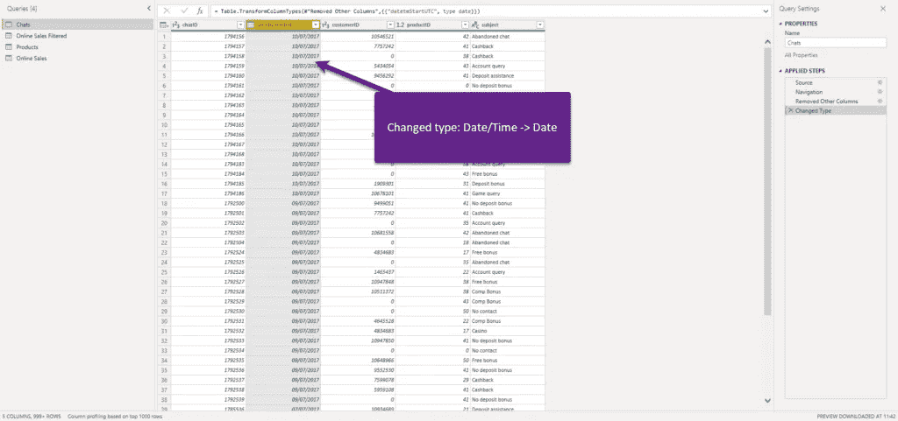

作者图片

我已经将列的数据类型从日期/时间更改为日期，因为时间部分与报告目的无关。让我们在 DAX Studio 中刷新我们的指标:

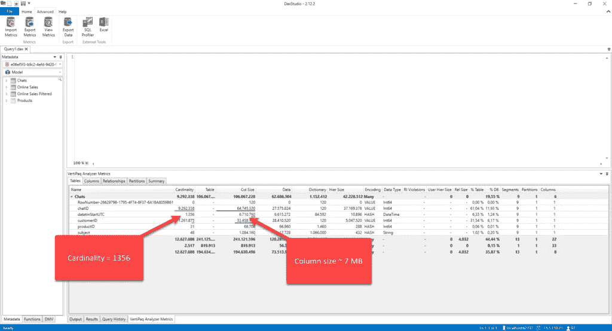

作者图片

哦，哇哦！基数不是大约 900 万，我们现在只有 1356(这是列中不同天数的数目)。但是，更重要的是，列的大小从 455 MB 降到了 7 MB！那是 huuuuge！看看字典的大小:VertiPaq 现在只处理 1356 个不同的值，而不是必须为 900 万个值构建一个字典，字典大小从 358 MBs 下降到 85 KBs！

另一个你可以应用的技巧是当你处理十进制数值的时候。将数据“按原样”导入 Power BI 的情况并不少见，而且，我不止一次看到有人导入小数点后精确到 5 位的十进制数字！我的意思是，真的有必要知道你的销售总额是 27.586.398，56891，还是显示 27.586.398，57 就可以了？

需要明确的是，在 Power BI 中格式化值以显示 2 个小数位不会影响数据模型的大小，这只是一个可视化的格式化选项，在后台，数据以小数位后 5 位数存储。

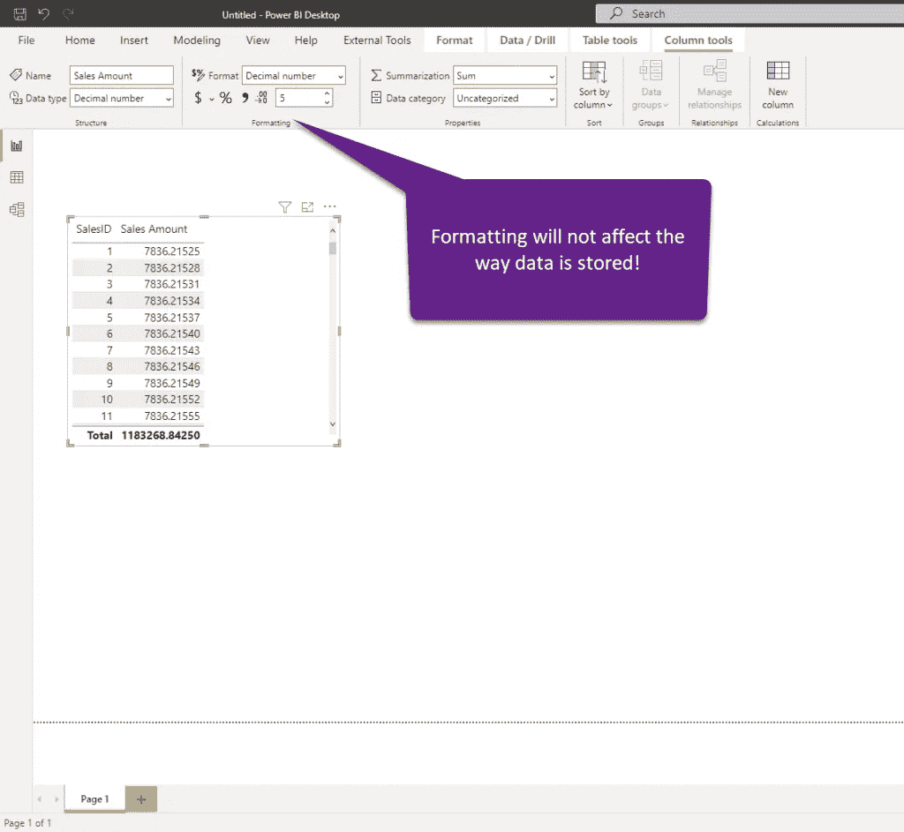

作者图片

现在，让我们在 DAX Studio 中检查这个表的指标。这是一个微不足道的数据模型大小，其中只有 151 个不同的值，但是您只能想象在数百万行的表上的差异:


作者图片

现在，我将转到超级查询编辑器，并将该列的类型更改为固定十进制数:


作者图片

我们现在已经将数值四舍五入到小数点后两位，所以让我们切换回 DAX Studio 并再次检查数字:

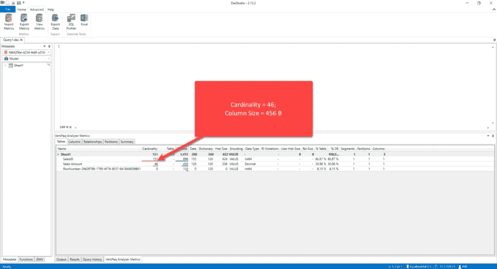

作者图片

即使在这个极小的数据集上，差别也是显而易见的！

如果您现在想知道:好吧，如果我对单笔交易值进行舍入，这没问题，但这会如何影响我的计算呢？好吧，让我们研究一个非常常见的场景，计算表中每行占总数的百分比:

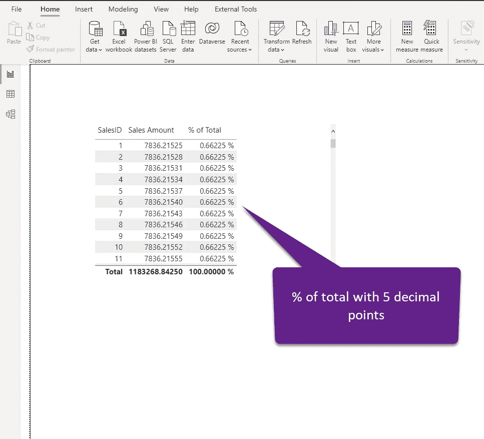

作者图片

现在，让我们检查一下，一旦我们将列的基数和值四舍五入到两位小数，这个计算是如何工作的:

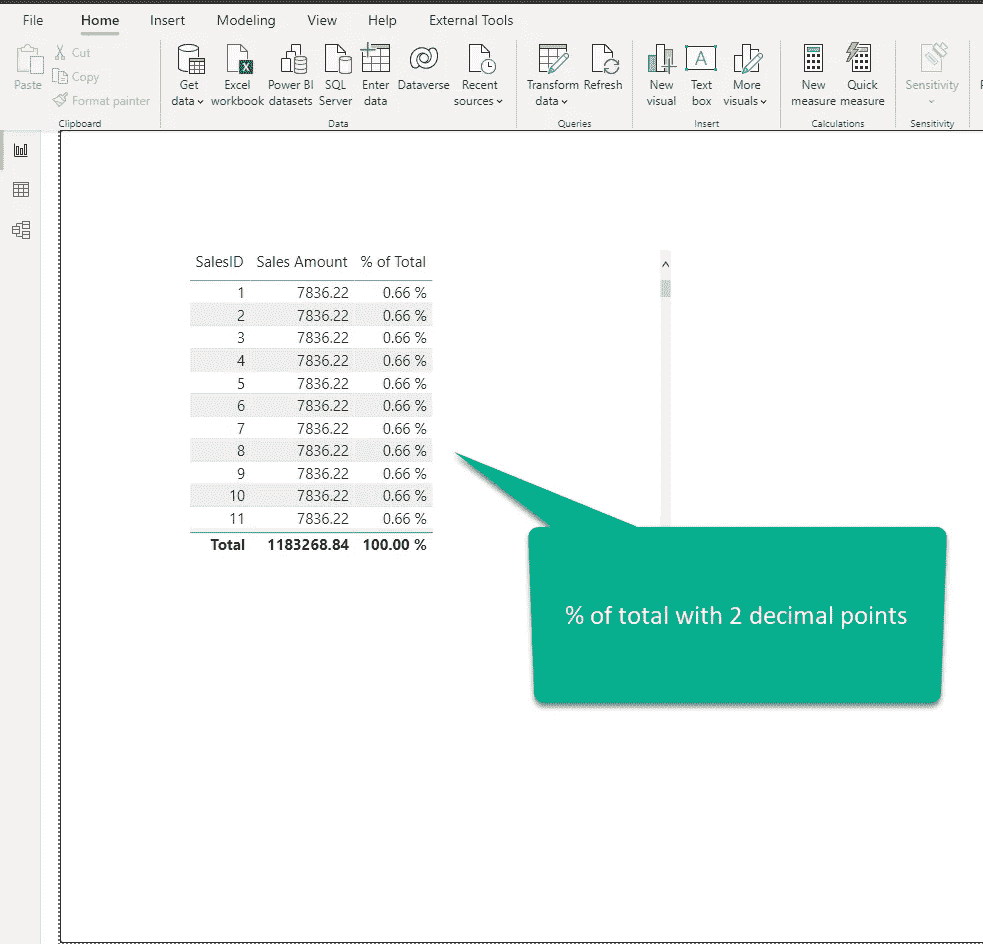

作者图片

现在，公平的问题应该是:业务决策者会关心单个行的份额是 0.66%还是 0.66225%……如果第二位小数之后的这些值对业务至关重要，那么——见鬼，是的，谁会关心基数:)……但是，我要说，在 99.99%的场景中，没有人会关心 0.66 vs 0.66225。在任何情况下，即使有人坚持这样的精度，也要试着向他们解释更高的基数带来的所有缺点(内存消耗、更慢的计算等等)，尤其是在大型事实表上。

## 使用汇总和分组提高基数水平

我想向您展示的另一项技术是如何利用汇总和分组的概念来提高基数级别，并使您的数据模型更具性能。

当您创建报表时，用户可能需要在比单个事务更高的粒度级别上理解不同的指标，例如，在特定日期售出了多少产品，在特定日期有多少客户注册，等等。这意味着您的大多数分析查询不需要针对单个事务，因为汇总的数据完全没问题。

如果我们总结聊天表的数据，让我们检查一下内存占用的差异。您可能还记得本文前一部分中的原始表，它占用 555 MBs:

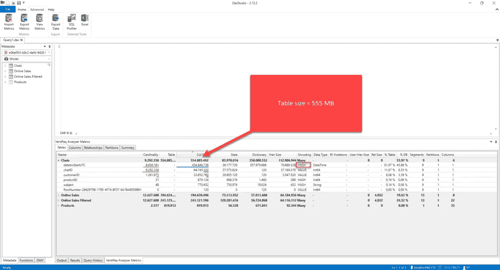

作者图片

现在，如果我预先汇总数据，并按日期和/或产品对其进行分组，则编写以下 T-SQL:

```
SELECT CONVERT(DATE,datetmStartUTC) AS datetm
,productID
,COUNT(chatID) AS totalChats
FROM Chats
GROUP BY CONVERT(DATE,datetmStartUTC)
,productID
```

如果最常见的业务请求是分析每个日期和/或产品的聊天次数，这个查询将成功满足这些请求。

让我们检查一下这个总结表与原始表相比的大小:

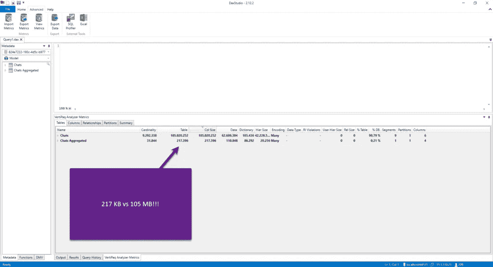

作者图片

虽然原始表(即使 datetmStartUTC 列的基数级别有所提高)需要 105 MBs，但是聚合表只需要 217 KB！而且这张表可以回答大部分的经营分析问题。即使您需要包含额外的属性，例如客户数据，这仍然是检索数据的最佳方法。

还有更多！

即使您不能在数据源端创建汇总数据，您仍然可以通过利用 Power BI 中的聚合特性获得显著的性能提升。这是 Power BI 中最强大的特性之一，值得单独撰写一篇文章，甚至是一系列文章，比如 Phil Seamark 的 [this，当我需要更深入地了解聚合及其在表格模型中的工作方式时，我总是会参考它。](https://dax.tips/2021/09/06/intro-to-power-bi-aggregations/)

## 结论

构建一个最优的数据模型不是一件容易的事情！有许多潜在的警告，有时很难避免通往“完美”模型的道路上的所有陷阱。然而，了解减少整体数据模型大小的重要性是调整 Power BI 解决方案的关键要求之一。

记住这一点，为了能够实现最佳的数据模型大小，您需要吸收基数的概念，作为决定列大小的主要因素。通过以正确的方式理解基数，以及 VertiPaq 存储和压缩数据的方式，您应该能够应用我们刚刚介绍的一些技术来提高列的基数级别，从而提高报告的整体性能！

感谢阅读！

[成为会员，阅读媒体上的每一个故事！](https://datamozart.medium.com/membership)